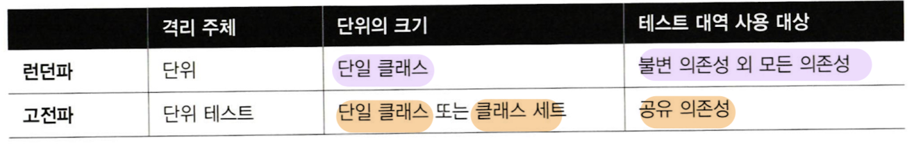
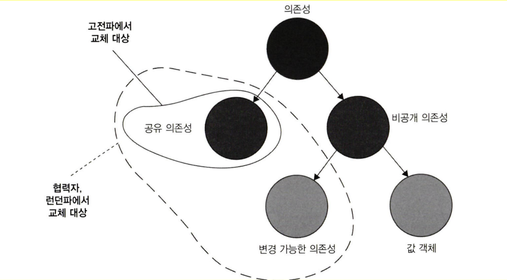
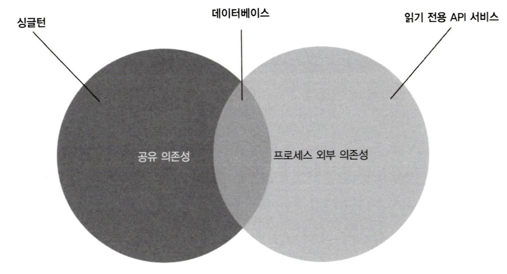
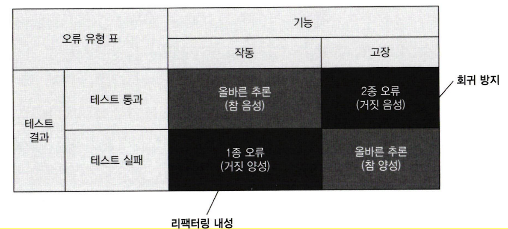
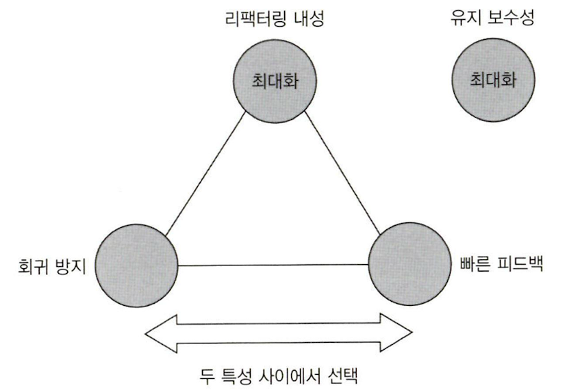
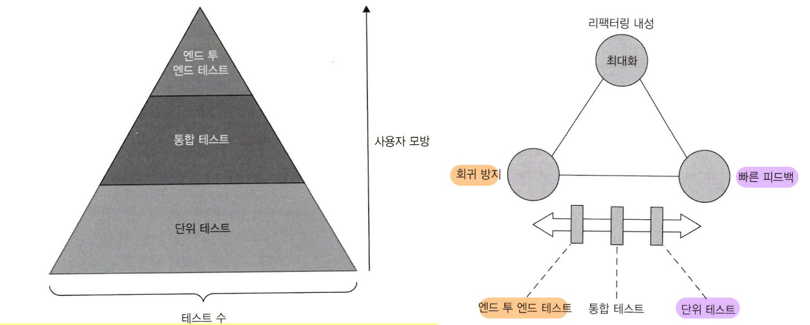
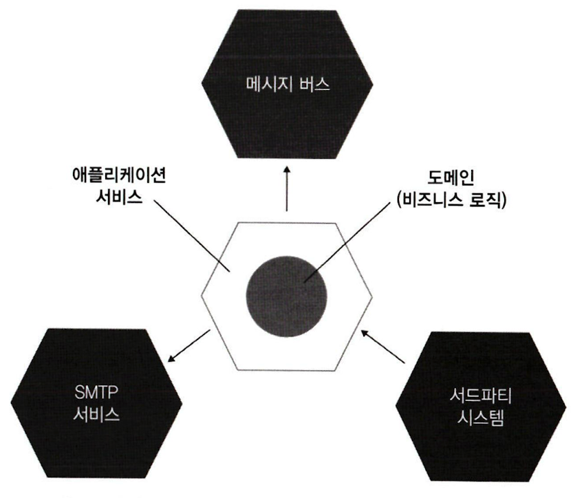

# 단위 테스트
## 단위 테스트의 목표
- 단위 테스트의 목표: **소프트웨어 프로젝트의 지속 가능한 성장**
	- **버그 없이 주기적으로 리팩토링하고 새로운 기능을 추가할 수 있도록 지원**
	- 테스트 없는 프로젝트
		- 초기 개발 속도가 빠름 -> 시간이 갈수록 엔트로피(시스템 내 무질서도) 증가 및 개발 속도 감소
	- 테스트 있는 프로젝트
		- 초반에 상당한 노력이 들어감 -> 프로젝트 후반에도 안정적으로 잘 성장
- **단위 테스트 적용은 필수**이고 논쟁거리가 아님
	- 테스트는 **코드베이스의 일부**
	- **애플리케이션의 정확성을 보장**하는 **책임**을 가진 **코드**
- 현재의 논쟁: **좋은 단위테스트**는 어떤 것인가?
	- **개발 주기에 통합**되어 있는 것
		- 매 배포 전 테스트 실행
	- 코드베이스에 **가장 중요한 부분**을 대상으로 하는 것
		- 핵심인 **도메인 모델**을 다른 것과 구분해 테스트
	- **최소한의 유지비**로 **최대 가치**를 끌어내는 것
		- 고품질 테스트는 **동작의 단위**를 **검증**하는 것 (**비즈니스 로직 테스트**)
		- 필요 사항
			- 가치 있는 테스트 식별하기
			- 가치 있는 테스트 작성하기
- 테스트 스위트 품질 측정 방법
	- 커버리지 지표
		- 테스트 스위트가 소스 코드를 얼마나 실행하는지 **백분율**로 표현
		- 중요한 피드백을 줄 순 있지만 **테스트 스위트 품질 측정에 부적합**
			- **커버리지가 낮으면 테스트가 충분치 않다**는 좋은 증거
				- 시스템의 **핵심 부분**은 **커버리지를 높게 두는게 좋음**
			- 하지만 **커버리지가 높다고 품질을 보장하지는 못함**
				- 모든 결과의 검증을 보장하지 못함 (100%여도 빠져나가는 케이스들이 있음)
				- 외부 라이브러리는 경로 검증 불가
		- 지표로만 보고 **목표로 삼아서는 안됨**!!
			- **특정 커버리지를 목표**로하면 **개발자들은 시스템을 속일 방법을 궁리**하는 부작용 발생
		- 종류
			- 코드 커버리지(code coverage, test coverage)
				- 코드 커버리지 = 실행 코드 라인 수 / 전체 라인 수
				- 커버리지 숫자는 조작이 가능,,,
					- e.g. `return input.Length() > 5 //input='abc', 100% 커버리지`
			- 분기 커버리지(branch coverage)
				- 분기 커버리지 = 통과 분기 / 전체 분기수
				- 코드 커버리지를 조금은 보완
					- e.g. `return input.Length() > 5 //input='abc', 50% 커버리지`

>**회귀**(=**소프트웨어 버그**)
> 
> 코드 수정 후 기능이 의도한 대로 작동하지 않는 경우를 의미한다.

## 단위 테스트란?
- 단위 테스트의 속성
	- **작은 코드 조각(Unit)을 검증** 
	- **빠르게 수행**
	- **격리된 방식**으로 처리하는 자동화된 테스트 (**쟁점**)
		- **격리가 무엇인지에 대한 의견 차이**가 근본적으로 고전파와 런던파를 가름
- 단위 테스트 접근 방식에 대한 분파
	
	
	- **고전파** (Classical School, **Detroit**) - **지향**
		- 원론적인 접근 추구
		- **상향식 TDD** (도메인 모델부터 시작)
			- 상태를 검증 (e.g. 고객이 상점을 통해 구매하면 상점의 재고 차감 여부를 검증)
		- **격리 방식**에 대한 관점: **단위 테스트끼리 격리**
			- 테스트는 적합한 순서(**순차적 or 병렬적**)로 실행 가능하며 **서로의 결과에 영향 X**
			- **공유 의존성**에 대해서만 **테스트 대역 사용**
				- 단위 **테스트 간 공유되는 의존성**은 테스트 대역으로 **교체**
					- 싱글톤 객체 같은 경우 각 테스트마다 생성하면 테스트 간 공유 X
					- 설정 파일도 각 테스트마다 생성자 주입하는 방식으로 가능
			- **공유 의존성 = 프로세스 외부 의존성**
				- 실무에서 예외 케이스가 거의 없음!
				- 예외 상황: 읽기 전용 외부 API (불변 의존성이므로 **공유 의존성 X**)
					- 테스트 속도와 안정성을 위해 **테스트 대역으로 교체 권장**
					- 빠르고 안정적이라면 원칙에 맞춰 그대로 사용해도 괜찮
				- 교체 시 **테스트 속도 상승** (단위 테스트의 2번째 요건 충족)
					- 공유 의존성은 대부분 프로세스 외부에 있어 호출이 느림
					- 외부 공유 의존성 테스트는 보통 통합 테스트의 영역
		- 코드 조각 범위 (Unit): 공유 의존성만 없으면 **여러 클래스 묶어 테스트 가능**
		- 통합 테스트: **단위 테스트 정의를 충족하지 않는 테스트**
			- **고전파 관점**의 단위 테스트 **정의**
				- 단일 동작 단위를 검증하고
				- 빠르게 수행하고
				- 다른 테스트와 별도로 처리한다.
			- e.g. 둘 이상의 동작 단위 검증 테스트, 다른 팀 개발 코드와 통합해 검증하는 테스트, 프로세스 외부 의존성, 공유 의존성
		- 장점
			- 단위 테스트 목표 달성에 적합 -> **동작의 단위 검증에 유용**
		- 단점
			- SUT가 올바르게 동작하더라도 협력자에 버그에 있는 경우 테스트 실패
	- **런던파** (London School, **Mockist**)
		- 런던의 프로그래밍 커뮤니티에서 시작
		- **하향식 TDD** (상위 레벨 테스트부터 시작)
			- 상호작용을 검증 (e.g. 목 객체의 메서드가 올바르게 호출되었는지, 호출 횟수는 맞는지...)
		- **격리 방식**에 대한 관점: **테스트 대상 시스템에서 협력자를 격리**
			- 한 클래스의 의존성을 모두 **테스트 대역(test double)으로 대체** (불변 의존성은 그대로)
				- e.g. 인터페이스를 통해 목 객체를 만들고 SUT에 인자로 넘김
		- 코드 조각 범위 (Unit): **단일 클래스** 혹은 해당 클래스 내 **메서드**
		- 통합 테스트: **실제 협력자 객체를 사용**하는 모든 테스트
		- 장점
			- 테스트가 실패하면 테스트 대상 시스템이 고장난 것이 확실해짐 (테스트가 세밀)
				- **중요성 떨어짐** (정기적으로 테스트 실행하면 고장난 부분 좁히기 쉬움)
			- 테스트 준비 시 복잡한 의존성 조립을 피하고 대역 하나로 대체 가능
				- e.g. 한 번에 한 클래스만 테스트 -> 전체 단위 테스트 구조 간단해짐
				- **중요성 떨어짐** (복잡한 의존성은 잘못된 설계이므로 설계를 바꿔야 함)
		- 단점
			- 목을 다루는 것은 불안정함 내포
				- 테스트가 SUT의 구현 세부 사항에 빈번히 결합

>**테스트 대상 시스템**(SUT, System Under Test) & **협력자**(Collaborator)
>
>**SUT**는 **현재 테스트에 대상이 되는 시스템**을 의미한다. 테스트 대상 메서드는 MUT(Method Under Test)라고도 한다.
>반면에 **협력자**는 **불변 의존성(값 객체)을 제외**한 시스템에 엮여 있는 **모든 의존성**들을 의미한다. 
>즉, 일반적인 클래스는 **협력자**와 **값 객체**로 2가지 유형의 의존성으로 동작할 수 있다.

>의존성 종류
>
>**공유 의존성**(shared dependency)
>**테스트 간 공유**되고 서로의 결과에 영향을 미칠 수 있는 의존성
>e.g. 정적 가변 필드, 데이터베이스
>
>**비공개 의존성**(private dependency)
>테스트 간 **공유하지 않는** 의존성
>
>**프로세스 외부 의존성**(out-of-process dependency)
>
>애플리케이션 **프로세스 외부에서 실행되는 의존성**. 대부분 공유 의존성이지만 아닌 경우도 있다.
>e.g. 데이터베이스는 외부 의존성이면서 **공유 의존성**인 반면,
>테스트 실행 전 도커 컨테이너로 시작한 데이터베이스는 외부 의존성이면서 **비공개 의존성**
>읽기 전용 API처럼 프로세스 외부 의존성이지만 **불변 의존성**이어서 **공유 의존성이 아님**

>엔드 투 엔드 테스트 (end-to-end test)
>
>**시스템을 최종 사용자 관점에서 검증하는 것**을 의미한다. (동의어: UI 테스트, GUI 테스트, 기능 테스트)
>
>엔드 투 엔드 테스트는 **통합 테스트의 일부**다. 
>둘 모두 **코드가 프로세스 외부 의존성과 함께 어떻게 작동하는지 검증**한다. 다만, **엔드 투 엔드 테스트가 일반적으로 의존성을 더 많이 포함**한다.
>(**통합 테스트**가 프로세스 외부 의존성이 **1~2개**, **엔드 투 엔드 테스트**는 **전부 혹은 대다수**)
>예를 들어, DB, 파일 시스템, 결제 게이트 웨이라는 3가지 프로세스 외부 의존성이 있다면, 보통의 **통합 테스트**는 **완전히 제어 가능하지 않은 결제 게이트 웨이만 테스트 대역으로 대체**하는 반면에, **엔드 투 엔드 테스트는 전부 테스트에 포함**한다.
>
>통합 테스트와 엔드 투 엔드 테스트의 **뚜렷한 경계는 없다**. **테스트 버전이 없거나 자동으로 가져오는 것이 불가능한 프로세스 외부 의존성**의 경우 **엔드 투 엔드 테스트 역시 테스트 대역을 사용**해야 한다.
>
>또한, 엔드 투 엔드 테스트는 **유지보수 측면에서 가장 비용이 많이 들기** 때문에 모든 단위 테스트와 통합 테스트가 통과한 후 **빌드 프로세스 후반에 실행**하는 것이 좋다.

## 단위 테스트 구조
### AAA 패턴 (Arrage, Act, Assert)
- **준비**, **실행**, **검증**패턴으로 테스트하는 일반적인 방식
- **단순하고 균일한 구조**를 만들어 **가독성**과 **유지보수성**이 향상
- Given, When, Then은 비기술자에게 조금 더 읽기 쉬운 점말고 AAA와 차이가 없음
### 단위 테스트 구조에 대한 지침
- **한 테스트**에 **여러 개의 준비, 실행, 검증 구절** -> **여러 테스트로 나눠라!**
	- 여러 구절 = 테스트가 여러 개의 동작 단위를 한 번에 검증 = 통합 테스트
- **테스트 내 if 문 피하자** -> **여러 테스트로 나눠라!**
	- 분기가 있다는 것 역시 한 번에 너무 많은 것을 검증한다는 표시
	- 단위 테스트 든 통합 테스트 든 테스트에 분기가 있어서 얻는 이점은 없음 (가독성만 감소)
- **각 구절의 적정 크기**
	- 준비 구절: 세 구절 중 **가장 큼**
		- 많이 크다면 테스트 내 비공개 메서드, 별도 팩토리 클래스 추출해 재사용
	- 실행 구절: **한 줄** (이상적)
		- **두 줄 이상**인 경우 **SUT API 설계 문제** 의심 -> **캡슐화 지키기**
			- e.g. 테스트 내 `Purchase()`, `RemoveInventory()` 각각 실행-> 캡슐화가 깨짐
		- 단, **유틸리티나 인프라 코드는 덜 적용**되므로, 절대 두줄 이상 두지 말라고 할 수는 없음!
	- 검증 구절: 여러 검증이 있을 수 있지만 **너무 커지는 것을 경계**
		- **`equals()`** 정의해 **객체 끼리 `Assert`문 한번에 검증**하는 것이 좋음
	- 참고) 종료 구절: 리소스 정리 목적으로 통합테스트에 주로 쓰임 (메서드 추출해 재사용)
- **SUT 구분하기**
	- SUT는 **동작에 대한 유일한 진입점**
	- 테스트 내 SUT 이름을 **`sut`로 명명**해 구분하자
- **구절 주석 지침**
	- AAA 패턴 따르고 주석 없이 **빈 줄로 각각 구절을 3등분해 구분**
	- 각 **구절 내에 빈 줄**이 있다면, **주석 추가하기** (`//arrage`, `//act`, `//assert`)
- **테스트 픽스처 재사용하기**
	- 테스트 픽스처: 단위 테스트를 수행할 때 필요한 **초기 상태**나 **설정**
		- e.g. 계좌 잔고 확인 테스트를 위한 초기 입금 설정 작업
	- **준비 구절 코드 재사용**은 **좋은 방법**
	- 픽스처 재사용 방법
		- **권장**: **테스트 클래스**에 **비공개 팩토리 메서드** 두자 (가독성, 재사용성 향상)
			- `CustomerTests` -> `CreateStoreWithInventory()`, `CreateCustomer()`
		- 안티 패턴: 테스트 클래스 **생성자**에서 **픽스처 초기화**
			- e.g. `_store.AddInventory(Product.Shampoo, 10)`
			- 테스트 간 결합도 상승 및 가독성 감소
				- 테스트마다 재고 변경을 다르게 설정 하고 싶어도 결합되어 어려움 (공유 상태)
		- **생성자 재사용의 유일한 예외**: **테스트 대부분에 사용되는 픽스처**
			- **기초 클래스**를 두고 **생성자**에서 초기화한 후 개별 테스트 클래스에서 상속해 재사용
			- e.g. 통합 테스트 시 DB 커넥션 초기화
				- `CustomerTests`가 DB 커넥션이 있는 `IntegrationTests`를 상속받음
- **단위 테스트 명명법**
	- **Best Practice**
		- **표현력이 있는 간단하고 쉬운 영어 구문** (엄격하지 않게 **표현의 자유** 허용)
			- 장황한 표현 지양 e.g. `considered` X
			- **사실만 서술**하고 소망이나 욕구 지양 e.g. `should be` X -> `is` O
			- 기초 영문법 지키기 e.g. 관사
		- **도메인에 익숙한 비개발자에게 설명**하듯이 이름 짓기 (도메인 전문가, 비즈니스 분석가)
		- **동작**으로 이름 짓기
			- 테스트 이름에 **메서드 이름 넣지 말기**
				- 예외: **유틸리티 코드는 메서드 이름 사용**해도 괜찮 (비즈니스 로직 X)
			- 테스트 클래스 이름 지정: **`[클래스명]Tests`**
				- 동작 단위 검증의 **진입점** 역할
				- **해당 클래스만 검증한다는 것이 아님** -> 여러 클래스 걸쳐도 **동작을 검증**
		- **`_`** 로 단어 구분 (가독성 향상)
		- e.g
			- **`Sum_of_two_numbers()`**
			- **`Delivery_with_a_past_date_is_invalid`**
	- 안티 패턴: `[테스트 대상 메서드]_[시나리오]_[예상 결과]`
		- 타인이 읽기 난해하고 구현 세부사항에 묶임
		- e.g.
			- `Sum_TwoNumbers_ReturnsSum()`
			- `IsDeliveryValid_InvalidDate_ReturnsFalse()`
- **매개변수화된 테스트** 리팩토링 하기 (Parameterized Test)
	- 유사한 테스트를 묶을 수 있는 기능 제공
		- **하나의 동작**은 **여러 테스트가 필요**하고 **복잡하면 테스트 수가 급증**하므로 관리에 용이
	- 사용 지침
		- **입력 매개변수만으로** 테스트케이스 **판단이 가능**하면, **하나의 테스트 메서드** 사용
		- **매개변수만으로 판단이 어렵다면** **긍정** 테스트 케이스와 **부정** 테스트 케이스 **나누기**
		- **동작이 너무 복잡**하면 매개변수화된 테스트 사용말고 **모두 개별 테스트**로 두기
	- e.g. 가장 빠른 배송일이 오늘부터 이틀 후가 되도록 작동하는 배송 기능
		- 4가지(어제, 오늘, 내일, 모레) 테스트가 필요하지만 유일한 차이점은 배송 날짜
		- Parameterized Test로 묶기 
			- **하나의 테스트 메서드 두기**
				- `Can_detect_an_invalid_delivery_date()`
				- `[(-1, false), (0, false), (1, false), (2, true)]`
			- **긍정 테스트**와 **부정 테스트** 나누기 (`boolean` 매개변수 제거 효과)
				- 긍정: `The_soonest_delivery_date_is_two_days_from_now()`
					- `2`
				- 부정: `Detects_an_invalid_delivery_date()`
					- `[-1, 0, 1]`
- **검증문 라이브러리 사용하기**
	- 쉬운 영어로 구성된 **이야기 패턴**으로 **테스트 가독성 향상**
	- **유일한 단점**은 프로젝트에 **의존성 추가하는 것**
	- `Assert.equal(30, result)` -> `result.Should().Be(30)`

# 가치 있는 테스트 식별하기
## 좋은 단위 테스트의 4대 요소
- 좋은 단위 테스트의 4가지 특성
	- **회귀 방지** (=소프트웨어 버그 방지)
		- 중요 지표: **테스트로 실행되는 코드의 양, 코드 복잡도, 코드의 도메인 유의성**
		- **복잡도와 도메인 유의성이 높은 코드**에 대한 **테스트**가 많을수록 **회귀 방지가 탁월**
	- **리팩터링 내성**
		- 테스트 실패없이 애플리케이션 코드 리펙토링 가능한지에 대한 척도
		- 중요지표: **거짓 양성 발생량** (**적을수록 좋음**)
		- 거짓 양성: **리팩토링 후** 기능이 **의도대로 작동**해도 **테스트가 실패**하는 상황 (**허위 경보**)
			- **회귀 발생 시 조기 경고를 제공 X** (잘못된 것이므로 개발자가 무시)
			- **리팩토링에 대한 능력과 의지 감소** (테스트 스위트에 대한 신뢰가 부족)
		- 거짓 양성의 원인: **SUT의 구현 세부 사항과 결합된 테스트** (분리 필요)
		- 해결책: 테스트에서 구현 세부사항이 아닌 **최종 결과를검증하기**
			- **결합도를 낮추면 리팩토링 내성 상승**
			- 거짓 양성 발생량이 크게 감소
		- 거짓 양성에 대한 올바른 대응은 **테스트 스위트의 안정성을 높이는 것**
	- **빠른 피드백**
		- 중요 지표: **테스트 실행 속도**
		- **빠른 테스트**는 **버그 수정 비용이 대폭 감소** (더 많은 테스트를 자주 실행할 수 있음)
		- 느린 테스트는 버그 수정 비용이 상승 (뒤늦게 버그를 발견, 시간 낭비)
	- **유지 보수성**
		- 중요 지표: **유지비** (**테스트 이해 난이도**, **테스트 실행 난이도**)
		- 테스트 이해 난이도: **테스트의 크기**를 의미 (코드라인이 적을수록 읽기 쉬움)
		- 테스트 실행 난이도: 테스트가 프로세스 외부 종속성으로 작동하면, **의존성 운영 비용** 고려 필요
- 회귀 방지 & 리팩터링 내성 간 관계
	
	- **올바른 추론**: 올바르게 작동해 테스트가 통과 & 기능이 고장나 테스트가 실패
	- 회귀 방지와 리팩터링 내성은 **테스트 스위트의 정확도 극대화를 목표**로하는 특성
		- 테스트 정확도 = 신호(발견된 버그 수) / 소음(허위 경보 발생 수)
		- **거짓 양성, 거짓 음성 발생 확률 줄이기** -> **테스트 정확도 상승**
			- **회귀 방지**가 훌륭한 테스트는 **거짓 음성 수를 최소화**
			- **리팩터링 내성**이 훌륭한 테스트는 **거짓 양성 수를 최소화**
	- 중대형 프로젝트는 **거짓 음성과 거짓 양성에 똑같이 주의를 기울여야 함**
		- 프로젝트 초반은 리팩토링이 많지 않아 거짓 양성은 무시할만 함
		- **프로젝트 중후반**으로 갈수록 **리팩토링이 중요**한데, **거짓 양성이 잦으면 문제가 커짐**
- **테스트 전략**
	- **테스트의 가치** = 회귀 방지 X 리팩터링 내성 X 빠른 피드백 X 유지 보수성
		- **하나라도 0이면 전체가 0** (모두 1도 불가능)
		- 유지보수성은 다른 특성과 독립적 (엔드 투 엔드 테스트에서만 회귀 방지와 연관됨)
		- **회귀 방지, 리팩토링 내성, 빠른 피드백**은 **상호 배타적** -> **하나를 희생해야 둘이 최대 가능**
			- 회귀 방지 희생 -> 너무 간단한 테스트
			- 리팩토링 내성 희생 -> 구현에 결합된 깨지기 쉬운 테스트
			- 빠른 피드백 희생 -> 엔드 투 엔드 테스트
		- **각 요소**에 **높은 임계치**를 두고 이를 **충족하는 테스트만 테스트 스위트에 남기기**
			- **소수의 매우 가치 있는 테스트**가 프로젝트의 지속적 성장에 효과적
	- **전략적 절충**
		
		- **리팩토링 내성**은 **최대화** 필요 (리팩토링 내성은 대부분 있거나 없거나 둘 중 하나이므로...)
		- **회귀 방지**와 **빠른 피드백** 사이에서 조절하자
	- **테스트 피라미드** 관점 전략
		
		- **테스트 유형 간 비율**은 **피라미드 형태**를 유지할 것 (팀, 프로젝트 마다 비율 차이 O)
		- **모든 테스트 계층**은 가능한 **거짓 양성 최소화 목표** (리팩토링 내성 최대화)
		- 피라미드 내 테스트 유형에 따라 **회귀 방지와 빠른 피드백 사이에서 선택**함
			- **엔드 투 엔드 테스트**는 **매우 중요한 기능**에만 적용
				- 빠른 피드백과 유지보수성 결여 -> 숫자가 가장 적은 이유
		- 예외 케이스
			- 복잡도가 거의 없는 **기본 CRUD 프로젝트**
				- **통합 테스트 수가 단위 테스트 수와 같거나 많고** 엔드 투 엔드 테스트가 없음
				- 단위 테스트는 복잡도 없는 환경에서 유용성 감소
				- 통합 테스트는 여전히 시스템 간 통합 동작 확인에 가치 있음
			- **프로세스 외부 의존성 하나**만 연결하는 API (e.g. DB)
				- **엔드 투 엔드 테스트를 더 많이 두는 것**이 적합 (환경 상 통합 테스트와 구분 불가)
				- 속도가 상당히 빠를 것이고 유지비도 적음
	- **블랙 박스 테스트 & 화이트 박스 테스트** 전략
		- **둘을 조합**하되 **테스트 작성** 시 **블랙 박스 테스트** 선택하자
			- 화이트 박스 테스트는 구현에 결합 -> 리팩토링 내성 포기할 수는 없음!
		- **테스트 분석** 시 **화이트 박스 테스트** 사용! (e.g. **코드 커버리지 도구**)
## 목과 테스트 취약성
- 테스트 대역(test double)
	- 모든 유형의 **비운영용 가짜 의존성**
	- e.g. 더미, 스텁, 스파이, 목, 페이크
	- **사용 의도**에 따라 **목**과 **스텁**으로 나뉨 (Mock 프레임워크로 똑같이 인스턴스를 생성)
		- **목(mock)** - 목, 스파이
			- **외부**로 나가는 상호 작용을 **모방**하고 **검사**
			- 상태 변경을 위해 의존성을 호출하는 것 (**사이드 이펙트 O**)
				- e.g. SMTP 서버로 이메일 발송 작업
			- **CQS 관점**에서 **명령**을 대체 (보통 반환값 X)
			- 구현
				- 목: 목 프레임워크의 도움 받아 생성
				- 스파이: 수동으로 작성한 목
		- **스텁(stub)** - 스텁, 더미, 페이크
			- **내부**로 들어오는 상호 작용을 **모방만 함**
			- 입력 데이터를 얻기 위해 의존성을 호출하는 것 (**사이드 이펙트 X**)
				- e.g. DB로 부터 데이터 검색
			- **CQS 관점**에서 **조회**를 대체 (보통 반환값 O)
			- 구현
				- 더미: 단순 하드코딩 값 (null, 가짜 문자열)
				- 스텁: 더 정교하게 시나리오마다 다른 값 반환하는 의존성
				- 페이크: 스텁과 같지만, 아직 존재하지 않는 의존성을 대체하고자 구현
- **무분별한 목 사용 지양하기** (feat. 리팩토링 내성 감소)
	- **API를 잘 설계하면 단위테스트도 자동으로 좋아짐** 
		- **식별할 수 있는 동작만 공개**하고 **구현 세부사항을 비공개**함으로써 **리팩토링 내성 상승**
	- **스텁의 상호작용은 검증하지 말자!** (안티패턴)
		- 입력을 제공할 뿐이지 SUT의 최종 결과가 아님
		- 스텁의 상호작용 검증은 **내부 구현 세부사항과 결합**(overspecifiation) -> 리팩토링 내성 감소 
			- 목의 상호작용 검증은 최종 결과 검증
		- e.g. 
			- `mock.Verify(x => x.SendGreetingsEmail("user@email.com"))` -> O
			- `stub.Verify(x => x.GetNumberOfUsers(), Times.Once)` -> **X**
	- **사이드 이펙트**가 있는 **시스템 간 통신**은 **목**으로 테스트하자! (외부 애플리케이션 통신)
		- 클래스 간 통신에도 목을 쓰는 것은 **런던파의 단점**
		- 가치 있는 목 테스트
			- `var mock = new Mock<IEmailGateway>()`
			- `mock.Verify(x => x.SendReceipt("..@x.com","egg",5), Times.Once)`
			- **클라이언트 목표 달성**에 도움이 되는 **연산**
		- 잘못된 목 테스트
			- `var storeMock = new Mock<IStore>()`
			- `storeMock.Verify(x => x.RemoveInventory("egg", 5), Time.Once)`
			- 시스템 내 통신(도메인 간 통신)은 클라이언트 목표로 가는 **중간 단계** (**구현 세부 사항**)
	- **애플리케이션을 통해서만 접근할 수 있는 프로세스 외부 의존성**은 **목 대체 X**
		- 모든 공유 의존성을 목으로 대체하는 것은 **고전파의 단점**
		- **외부 클라이언트** 관점에서 **접근 불가**한 시스템은 **구현 세부 사항**
		- e.g. 데이터베이스

>식별할 수 있는 동작과 공개 API
>
>모든 제품 코드는 2차원으로 분류할 수 있다.
>- 공개 API (`public`) & 비공개 API (`private`)
>- 식별할 수 있는 동작과 구현 세부 사항
>
>**식별할 수 있는 동작**은 **클라이언트가 목표를 달성하는데 도움**이 되는 **연산(Operation)과 상태(State)를 최소한으로 노출**한다. (연산은 **계산 수행** 혹은 **사이드 이펙트를 초래**하는 **메서드**를 의미) 
>구현 세부사항은 두 가지 중 어떤 것도 하지 않는다.
>
>**잘 설계된 API**는 **식별할 수 있는 동작은 공개 API와 일치**하고, **모든 구현 세부 사항은 비공개 API** 뒤에 숨어 있다. 만일, 식별할 수 있는 동작을 달성하고자 할 때 **클래스에서 호출해야 하는 연산 수가 1보다 크면** 해당 클래스는 **구현 세부 사항을 유출했을 가능성**이 크다.
>또한, **API를 잘 설계하면 단위테스트도 자동으로 좋아진다.** (리팩토링 내성 상승)
>
>장기적으로 **캡슐화**는 **증가하는 복잡성에 대응**하고 **소프트웨어의 지속적 성장**을 가능하게 하는 **유일한 방법**이다.

>헥사고날 아키텍처(Hexagonal Architecture, Alistair Cockburn)
	
	- 애플리케이션 서비스 + 도메인
	- **도메인 계층** (도메인 지식)
		- **비즈니스 로직** 책임
	- **애플리케이션 서비스 계층** (유스케이스)
		- **외부 환경과의 통신을 조정** (SMTP, 메시지 버스, 서드파티...)
	- 잘 설계된 API는 프랙탈 특성 존재
		- 서로 다른 계층의 **테스트**도 동일한 동작을 서로 다른 수준으로 검증하는 **프랙탈 특성** 존재
		- 목표(유스 케이스) - 하위 목표 - ...

# 가치 있는 테스트 작성하기
## 단위 테스트 스타일과 함수형 아키텍처
- 단위 테스트 스타일 종류
	- 출력 기반 테스트 (output-based testing, **함수형**)
		- SUT에 입력을 넣고 출력을 점검하는 방식
		- **사이드 이펙트 X**, **반환 값만 검증**
		- e.g.
			- `decimal discount = sut.CalculateDiscount(product1, product2)`
			- `Assert.Equal(0.02m, discount)`
	- 상태 기반 테스트 (state-based testing)
		- 작업이 완료된 후 시스템 **상태**를 확인하는 방식
		- 상태: SUT, 협력자, 프로세스 외부 의존성의 상태 (DB, 파일 시스템)
		- e.g. 
			- `sut.AddProduct(product)`
			- `Assert.Equal(1, sut.Products.Count)`
	- 통신 기반 테스트 (communication based testing)
		- **목**을 사용해 SUT와 협력자 간의 **통신**을 검증
		- e.g
			- `emailGatewayMock.Verify(x => x.SendGreetingsEmail(), Times.Once)`
- 단위 테스트 4대 요소 통한 비교
	- 결론: **항상 출력 기반 테스트를 선호하자**
		- 객체 지향에 적용이 어렵지만, 테스트를 출력기반 스타일로 변경하는 기법 사용하면 됨
	- 리팩토링 내성
		- **출력 기반 테스트**가 가장 우수
			- 테스트가 테스트 대상 메서드에만 결합해 거짓 양성 방지 탁월
		- 상태 기반 테스트, 통신 기반 테스트는 취약
			- 테스트가 구현 세부 사항에 결합될 가능성 높음
	- 유지 보수성
		- **출력 기반 테스트**가 가장 우수
			- **거의 항상 짧고 간결**하므로 유지보수가 쉬움
			- 전역 상태나 내부 상태를 변경할리 없으므로, **프로세스 외부 의존성 X**
		- 상태 기반 테스트, 통신 기반 테스트는 취약
			- 상태 기반 테스트, 통신 기반 테스트는 검증부가 커짐
				- 보완 1: 검증부 헬퍼 메서드 -> 메서드 유지와 재사용에 대한 명분이 드물 것
				- 보완 2: 검증 대상 클래스에 동등 멤버 정의 -> 코드 오염 (Code Pollution)
	- 회귀 방지와 빠른 피드백은 단위 테스트 스타일과 관련이 적음
- **함수형 프로그래밍**
	- 사이드 이펙트가 없는 **순수 함수 코드**를 강조하는 프로그래밍 방식
	- **숨은 입출력이 없어야 함**
		- 사이드 이펙트(인스턴스 상태 변경, 파일 I/O), 예외, 내외부 상태 참조(비공개 속성, DB 조회)
	- 지향점
		- **비즈니스 로직 코드**와 **사이드 이펙트 발생 코드**를 **분리**
			- 어떤 사이드 이펙트도 일으키지 않는 애플리케이션은 불가능
- **함수형 아키텍처**
	
	- **사이트 이펙트 코드를 최소화**하고 **순수 함수 방식 코드를 극대화**하는 방식
	- 구성
		- **함수형 코어** (functional core, immutable core)
			- **결정**을 내리는 코드
			- **수학적 함수**로 작성
		- **가변 셸** (mutable shell)
			- 해당 결정에 따라 **작용**하는 코드 (**실행**)
			- 수학적 함수에 의해 이뤄진 모든 결정을 가시적으로 변환 (DB 변경, 메시지 버스 전송)
	- 협력 과정
		- **가변 셸**이 **모든 입력 수집** 
		- -> **함수형 코어**는 **결정을 생성** 
		- -> **가변 셸**은 **결정을 사이드 이펙트로 변환**
	- **헥사고날 아키텍처**과의 **공통점** 및 **차이점**
		- **헥사고날 아키택처 ⊃ 함수형 아키텍처** (극단적으로 함수형 아키텍처 = 헥사고날 아키텍처)
		- 공통점
			- **관심사 분리** 측면
				- 도메인 : 애플리케이션 서비스 = 함수형 코어 : 가변 셸
			- **단방향 의존성 흐름**
		- 차이점
			- **사이드 이펙트 처리**
				- 헥사고날 아키텍처는 **도메인 계층 내**라면 **사이드 이펙트 허용**
				- 함수형 아키텍처는 **모든 사이드 이펙트**를 **함수형 코어 밖 가장자리**로 밀어냄
	- 단점
		- **적용 불가 상황 존재**
			- 의사 결정 절차 **중간에 프로세스 외부 의존성을 조회** 시, 출력 기반 테스트 적용 불가
			- e.g. 
				- DB에 있는 방문자의 접근 레벨을 중간에 조회해야할 때
				- `public FileUpdate AddRecord(..., IDatabase database) {...}`
				- **도메인은 절대로 DB에 의존해서는 안됨**
			- **해결책**
				- **애플리케이션 서비스 전면부**에서 방문자 접근 레벨도 **수집**
					- **접근 레벨이 필요 없어도 DB 조회**하므로 **성능 저하**
					- 그럼에도 **사이드 이펙트 분리 유지** 가능한 **장점**
				- `AuditManager`에 `IsAccessLevelCheckRequired()` 메서드 두기
					- 애플리케이션 서비스에서 `AddRecord()` 전에 호출
					- `true` 반환 시 `AddRecord()`에 접근 레벨 전달
					- **분리를 다소 완화**하고 **성능 향상** (필요할 때만 DB 조회)
		- 성능 감소
			- **함수형 아키텍처**를 지키다보면 **시스템이 외부 의존성을 더 많이 호출**
				- e.g. 초기 버전과 목 버전과 달리 최종 버전은 디렉토리에서 모든 파일을 읽음
			- 결론: 성능이 영향이 미미하다면 **유지보수성을 택하는게 나음**
		- 코드베이스 크기 증가
			- 함수형 아키텍처는 코드 복잡도가 낮아지고 유지보수성이 향상되지만 **초기 코딩이 증가**
			- 복잡도가 낮은 **간단한 프로젝트**는 **초기 투자가 타당 X**
- **단위 테스트 스타일 선택 전략** <책 예제 추천>
	- 최대한 **출력 기반 테스트 지향**
		- **함수형 코어**는 **출력 기반 테스트**로, **가변 셸**은 훨씬 더 **적은 수의 통합 테스트**로 다루기
			- **함수형 프로그래밍**을 활용해 **기반 코드**가 **함수형 아키텍처 지향**하도록 **재구성**
		- **출력 기반 스타일 변환**
			- **사이드 이펙트를 비즈니스 연산 끝으로 몰아서** 비즈니스 로직을 사이드 이펙트와 **분리**
			- e.g. 파일 I/O가 섞인 코드 (`AuditManger`)
				
				- 초기
					- 도메인 객체 `AuditManger`는 파일 I/O 코드를 품고 있음
					- 테스트도 파일 I/O로 검증 (단위 테스트 X, 통합 테스트 O)
				- 방법 1: 파일 I/O를 목으로 대체해 주입하기 (목 사용 테스트)
				- 방법 2: **I/O 담당 클래스로 따로 만들어 외부로 빼기** (**출력 기반 테스트**)
					- = **사이드 이펙트 외부 추출**
					- `AuditManager` (함수형 코어) - `Persister` (가변 셸)
					- `AuditManager`는 `new FileUpdate()` 식으로 업데이트 명령 반환
					- 추가할만한 사항
						- 삭제 유스케이스가 있다면 `FileAction` & `ActionType` Enum 처리
						- 오류처리 필요시 예외 클래스를 만들어 반환
	- **간헐적으로 상태 기반 테스트, 통신 기반 테스트 사용**
		- **객체 지향**은 **모든 테스트를 출력 기반 전환 불가**
		- 최대한 출력 기반 테스트로 전환하되 **비용에 따라 상태, 통신 기반 테스트를 적절히 섞자**

>스타일과 단위 테스트 분파
>
>- 두 분파는 출력 기반 테스트를 사용
>- 고전파는 상태 기반 테스트 선호, 런던파는 통신 기반 테스트 선호

>코드 오염 (Code Pollution)
>
>**단위 테스트**를 **가능**하게 하거나 **단순화**하기 위한 목적만으로 **제품 코드베이스를 오염시키는 것**을 말한다.

## 가치 있는 테스트를 위한 리팩토링
- 제품 코드의 4가지 유형
	
	- 분류 기준
		- **코드 복잡도**: 코드 내 의사 결정 분기 수
		- **도메인 유의성**: 코드가 프로젝트 문제 도메인에 얼마나 의미가 있는지
		- **협력자 수**: 클래스나 메서드 내에 가변 의존성 또는 프로세스 외부 의존성 수
	- 유형
		- **도메인 모델 및 알고리즘** (중요)
			- **복잡한 코드**와 **도메인 유의성**을 갖는 **코드**가 **단위테스트에서 가장 이로움**
				- 협력자가 없어 **유지비가 낮고 회귀 방지 탁월**
			- 참고: 복잡도와 도메인 유의성은 **서로 독립적** (도메인 코드가 안복잡할 수 있음)
		- 간단한 코드 (테스트 필요 X)
		- 컨트롤러
			- 도메인 클래스나 외부 애플리케이션 같은 다른 구성 요소의 작업 조정
			- 협력자가 많은 코드는 **테스트 비용이 많이 듦** (**유지 보수성 감소**)
			- **통합 테스트로 간단히 테스트**
		- 지나치게 복잡한 코드
			- **알고리즘**과 **컨트롤러**로 나누어 **리팩토링하자**
			- 이상적으로 여기 속하는 코드는 없어야 함
			- e.g. 여러 책임을 가지고 있는 덩치 큰 컨트롤러
- 지나치게 복잡한 코드 분할하기 <책 예제 추천>
	- **험블 객체 패턴** (**Humble Object**)
		
		- **험블 객체**(**험블 래퍼**)를 두고 이곳에서 **중요 로직**과 **테스트가 어려운 의존성**을 **붙이는 패턴**
			- 프레임워크 의존성과 결합되어 있는 코드는 테스트가 어려움
				- e.g. 비동기, 멀티스레딩, 사용자 인터페이스, 프로세스 외부 의존성 통신
			- 방법
				- 테스트 가능한 로직을 따로 추출
				- 험블 객체를 통해 테스트 로직과 테스트 어려운 의존성을 각각 호출
		- 험블 객체는 **오케스트레이션**을 할 뿐 자체적인 로직이 없으므로 **테스트할 필요 X**
		- 예시
			- **헥사고날 아키텍처, 함수형 아키텍처와 완전히 일치!**
				- 로직: 도메인 계층, 함수형 코어
				- 테스트하기 어려운 의존성: 애플리케이션 서비스 계층, 가변 셸
			- **단일 책임 원칙**(SRP) 관점과도 일치
				- 비즈니스 로직과 오케스트레이션 분리
			- MVC(Model-View-Controller), MVP(Model-View-Presenter) 패턴
				- 컨트롤러와 프레젠터는 험블 객체로서 모델과 뷰를 붙임
			- DDD의 집계 패턴 (Aggregate Pattern)
				- 클래스를 클러스터로 묶으면 코드 베이스의 총 통신 수가 줄고 테스트 용이성 향상
	- 지나치게 복잡한 코드 리팩토링 단계
		- 1단계: 암시적 의존성을 **명시적 의존성**으로 만들기
			- 도메인 객체 내 프로세스 외부 의존성은 인터페이스를 두어 주입 (목 방식)
				- e.g. 데이터베이스, 메시지 버스
			- **통합 테스트에도 중요**
			- 그러나 **도메인 모델은 프로세스 외부 의존성에 의존하지 않는 것이 깔끔**
		- 2단계: **애플리케이션 서비스 계층 도입**
			- **험블 컨트롤러**로 **오케스트레이션 책임**을 **위임**
				- 도메인 모델이 외부 시스템과 직접 통신하는 문제 극복
			- 도메인 모델은 잘 분리되었지만 **컨트롤러는 아직 복잡한 상태**
		- 3단계: **애플리케이션 서비스 복잡도 낮추기**
			- 객체 매핑 작업 추출하기
				- ORM 사용
				- 원시 데이터베이스 사용 시 데이터 매핑을 위한 팩토리 클래스 작성 (in 도메인 모델)
					- 별도의 클래스 (권장)
					- 간단한 경우, 기존 도메인 클래스의 정적 메서드
		- 4단계:

>액티브 레코드 패턴 (Active Record pattern)
>
>**도메인 클래스**가 **스스로 데이터베이스를 검색하고 저장하는 방식**을 말한다.
>단순하고 단기적인 프로젝트에는 잘 작동하지만, 코드베이스가 커지면 **확장하기 어렵다**.