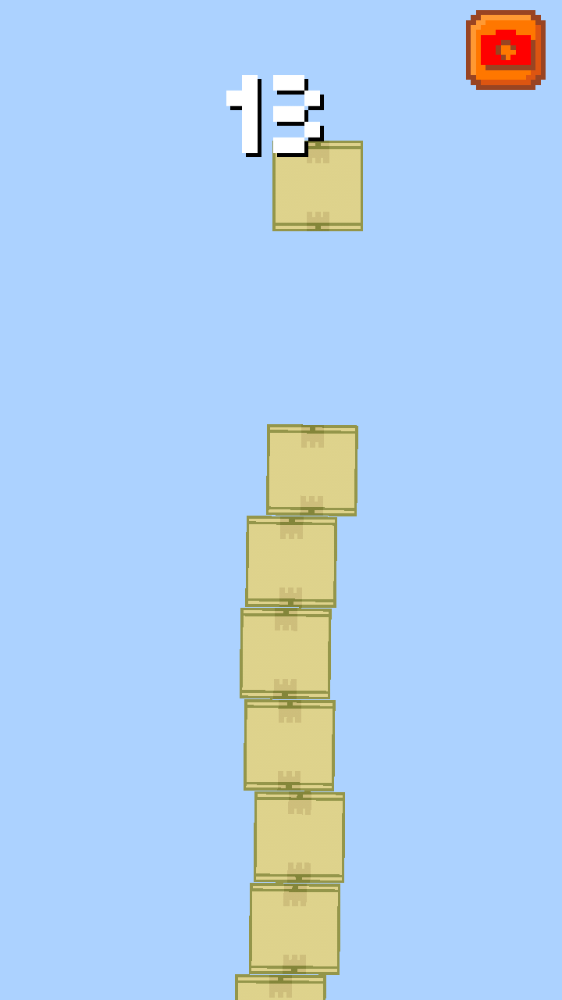
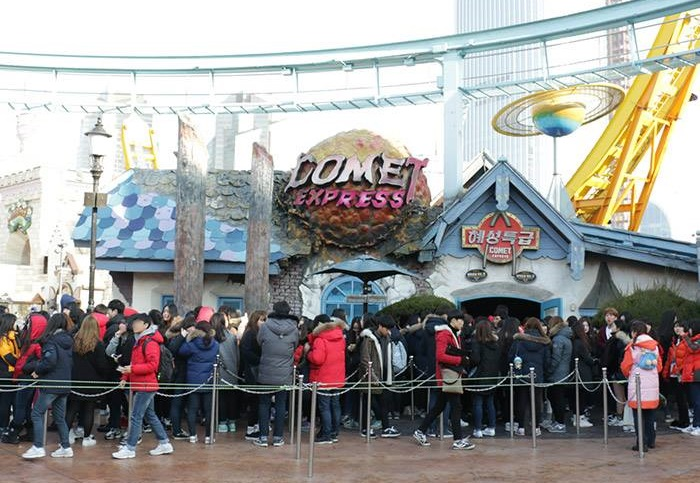

# 스택(Stack)과 큐(Queue)

## 스택(Stack)

스택 자료구조는 상자 쌓기와 비슷하다. 차곡 차곡 아래서부터 위로 상자를 쌓아 나가면, 상자를 뺄 때는 상자들이 무너지지않게 맨 위의 가장 나중에 쌓은 상자부터 빼야 한다. 스택도 마찬가지다. 가장 나중에 들어온 데이터를 가장 먼저 빼는 후입선출(LIFO: Last In First Out) 구조를 가진다.

* 상자 쌓기 게임 Dropping Box

{: width="300" height="300"}

파이썬에서는 별도의 라이브러리 없이 기본 리스트 자료형으로 스택을 쉽게 구현할 수 있다.

```python
# Stack으로 삽입(5) - 삽입(2) - 삽입(3) - 삽입(7) - 삭제() - 삽입(1) - 삽입(4) - 삭제() 구현

stack = []

stack.append(5)
stack.append(2)
stack.append(3)
stack.append(7)
stack.pop()
stack.append(1)
stack.append(4)
stack.pop()

# 가장 윗 부분부터 출력
print(stack[::-1])
```

​    

## 큐(Queue)

큐는 우리에게 상당히 익숙한 자료구조다. 흔히 얘기하는 선착순 혹은 놀이공원 대기줄처럼 먼저 도착한 데이터가 먼저 그 대기줄을 빠져나가게 된다. 이러한 구조를 선입선출(FIFO: First In First Out) 구조라고 한다. 이러한 큐는 구조적 속성상 '공정한 자료구조'라고도 불린다.

* 흔한 놀이공원의 대기 줄.jpg



큐를 파이썬으로 구현할 때는 collections 라이브러리의 deque 자료구조가 유용하다. 리스트 자료형보다 데이터의 삽입 및 삭제가 빨라 구현이 용이하다.

```python
# 삽입(5) - 삽입(2) - 삽입(3) - 삽입(7) - 삭제() - 삽입(1) - 삽입(4) - 삭제()

from collections import deque

queue = deque()

queue.append(5)
queue.append(2)
queue.append(3)
queue.append(7)
queue.popleft()
queue.append(1)
queue.append(4)
queue.popleft()

print(queue) # 먼저 들어온 순서대로 출력
queue.reverse()
print(queue) # 역순으로 출력
```