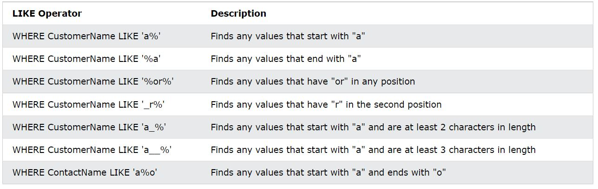

# SQL Overview

SQL(Structured Query Language)은 데이터베이스에서 데이터를 저장, 조작 및 조회하기 위한 standard language입니다. Oracle, MySQL, Postgres 등의 다양한 데이터베이스에서 표준으로서 사용됩니다.

본 포스팅은 자세히보다는 가볍게 SQL 용법들을 정리하려고 합니다.

​    

## Demo DB

예시로 사용하는 DB는 Northwind 데이터베이스입니다. 해당 데이터베이스에는 여러 table이 존재하는데, 그중 `Customers` 데이터베이스는 다음 표와 같은 모습을 가집니다.


​    

# SQL basic 

## SELECT

`SELECT` 구문은 데이터 조회를 위해 사용합니다.

* Syntax

```sql
SELECT column1, column2, ...
FROM table_name;
```

만일, `Customers`테이블에서 `CustomerName`과 `City` column만 조회하고 싶다면 다음과 같이 쿼리를 만듭니다.

```sql
SELECT CustomerName, City FROM Customers;
```

특정 column이 아닌 전체 데이터를 조회하고 싶다면 `*`을 사용합니다.

```sql
SELECT * FROM table_name;
```

### DISTINCT

`SELECT DISTINCT`를 사용하면 중복되는 데이터를 unique하게 조회할 수 있습니다.

* Syntax

```sql
SELECT DISTINCT column1, column2, ...
FROM table_name;
```

만일, 고객들이 어떤 국적을 갖고 있는지만 파악하고 싶다면, `SELECT DISTINCT`로 `City`를 조회합니다.

```sql
SELECT DISTINCT Country FROM Customers;
```

​    

## WHERE

Records를 특정 조건식으로 필터링하는데 사용합니다. `SELECT` 뿐만 아니라 `UPDATE`, `DELETE` 등의 명령어에서도 사용합니다.

* Syntax

```sql
SELECT column1, column2, ...
FROM table_name
WHERE condition;
```

예를 들어, France 국적 고객들만 조회하고 싶다면 다음과 같이 사용합니다.

```sql
SELECT * FROM Customers WHERE Country='France';
```

`WHERE`의 조건식에는 `AND`, `OR`, `NOT` 논리 연산자와 더불어 다음과 같은 연산자들이 사용됩니다.


### LIKE/NOT LIKE

또한, `WHERE`내에서는 column에서 Pattern을 찾아내는 `LIKE` 연산자도 사용할 수 있습니다. 

`LIKE` 연산자와 함께 쓰이는 wildcard는 데이터베이스 종류마다 다를 수 있지만, 다음은 SQL Server에서 자주 쓰이는 대표적 wildcard의 예시입니다.

* `%`: 0개 이상의 characters를 의미하는 기호입니다.
* `_`: 1개의 character를 의미하는 기호입니다.

다음은 `LIKE`의 사용 예시들입니다.



### IN/NOT IN

`IN`은 특정 값들에 해당하는 record만 남겨주는 연산자입니다. `OR`을 여러번 사용한 것과 동일한 기능을 할 수 있습니다.

* Syntax 1

```sql
SELECT column_name(s)
FROM table_name
WHERE column_name IN (value1, value2, ...);
```

* Syntax 2

```sql
SELECT column_name(s)
FROM table_name
WHERE column_name IN (SELECT STATEMENT);
```

### BETWEEN/NOT BETWEEN

`BETWEEN`은 특정 범위 내의 값들을 선택합니다. 범위로 사용할 수 있는 값으로 숫자, 문자, 날짜 자료형이 있습니다. 또한, 설정한 시작 값과 끝 값은 모두 범위 내에 포함됩니다.

* Syntax

```sql
SELECT column_name(s)
FROM table_name
WHERE column_name BETWEEN value1 AND value2;
```


​    

## ORDER BY

`ORDER BY`는 특정 column을 기준으로 정렬을 수행합니다. Default는 오름차순 정렬이고, 내림차순으로 정렬하고 싶다면 `DESC` 키워드를 뒤에 붙여줍니다.

* Syntax

```sql
SELECT column1, column2, ...
FROM table_name
ORDER BY column1, column2, ... ASC|DESC;
```

`Country` column을 기준으로 내림차순 정렬을 하고 싶다면 다음과 같이 쿼리를 만듭니다.

```sql
SELECT * FROM Customers ORDER BY Country DESC;
```

​    

## INSERT INTO

`INSERT INTO`는 새로운 records를 table에 추가합니다.

* Syntax 1 - column을 특정지어 추가할 때 (value가 빈 column에는 null 값이 삽입됩니다.)

```sql
INSERT INTO table_name (column1, column2, column3, ...)
VALUES (value1, value2, value3, ...);
```

* Syntax 2 - 모든 column에 value를 추가할 때 (value를 추가하는 순서는 해당 테이블의 column 이름 순서를 따릅니다.)

```sql
INSERT INTO table_name
VALUES (value1, value2, value3, ...);
```

> `CustomerID`의 경우 record가 생성될 때 자동으로 입력되어지므로 신경쓰지 않아도 됩니다.


## IS NULL

NULL 값은 =, <, <> 같은 비교 연산자로 처리할 수 없습니다. 대신에, NULL 값은 `IS NULL`과 `IS NOT NULL`을 사용해 비교합니다.

​    

## UPDATE

`UPDATE`는 기존의 records를 수정할 때 사용합니다. 수정되는 record의 수는 `WHERE`의 조건식을 통해 정해집니다.

* Syntax

```sql
UPDATE table_name
SET column1 = value1, column2 = value2, ...
WHERE condition;
```

예를 들어, `Customers`의 테이블의 `CustomerID`가 1인 record에서 `ContactName`을 'Lucian', `City`를 'Seoul'로 바꾸고 싶다면 다음의 쿼리를 만들면 됩니다.

```sql
UPDATE Customers
SET ContactName = 'Lucian', City= 'Seoul'
WHERE CustomerID = 1;
```

​    

## DELETE

기존의 records를 삭제할 때는 `DELETE`를 사용합니다. 삭제되는 record 수는 `WHERE`을 통해 정해집니다. 만일 `WHERE`가 빠지면 table의 데이터가 모두 삭제되므로, 유의해서 삭제해야 합니다.

* Syntax

```sql
DELETE FROM table_name WHERE condition;
```

만일, `CustomerName`이 'Alfreds Futterkiste'인 record를 삭제하고 싶다면 다음과 같이 쿼리를 만듭니다.

```sql
DELETE FROM Customers WHERE CustomerName='Alfreds Futterkiste';
```

​    

## 부분 조회

데이터베이스의 퍼포먼스를 위해 테이블의 records를 전부 조회하지 않고 일정 부분만 따로 조회하는 방법도 존재한다. 이를 위한 문법은 데이터베이스들마다 상이한데, MySQL은 `LIMIT`, SQL Server/MS Access는 `SELECT TOP`, Oracle은 `FETCH`를 사용한다.

​    

## Aggregate functions

다음 함수들은 특정 Column의 values를 원하는 목적으로 계산하여 return합니다.

* MAX() Syntax

```sql
SELECT MAX(column_name)
FROM table_name
WHERE condition;
```

* MIN() Syntax

```sql
SELECT MIN(column_name)
FROM table_name
WHERE condition;
```

* COUNT() Syntax

```sql
SELECT COUNT(column_name)
FROM table_name
WHERE condition;
```

* AVG() Syntax

```sql
SELECT AVG(column_name)
FROM table_name
WHERE condition;
```

* SUM() Syntax

```sql
SELECT SUM(column_name)
FROM table_name
WHERE condition;
```

​    

## Aliases

Table이나 column에 임의적으로 이름을 지어줄 수 있습니다. Aliase는 해당 쿼리에 한해서만 유효합니다.

* Column Syntax

```sql
SELECT column_name AS alias_name
FROM table_name;
```

* Table Syntax

```sql
SELECT column_name(s)
FROM table_name AS alias_name;
```

만일 aliase가 띄어쓰기를 포함한다면, double quotation("")이나 square brackets([])를 사용해 감싸줍니다.

```sql
SELECT CustomerName AS Customer, ContactName AS [Contact Person]
FROM Customers;
```

다음과 같이 여러 개의 column을 합쳐 만든 새로운 column에 alias를 사용할 수도 있습니다.

```sql
SELECT CustomerName, Address + ', ' + PostalCode + ' ' + City + ', ' + Country AS Address
FROM Customers;
```

혹은, 길어지는 SQL 쿼리를 조금 더 짧게 쓰기 위해 table alias를 사용할 수도 있습니다.

```sql
SELECT o.OrderID, o.OrderDate, c.CustomerName
FROM Customers AS c, Orders AS o
WHERE c.CustomerName='Around the Horn' AND c.CustomerID=o.CustomerID;
```

​    

## JOIN

관련된 columns을 기준으로 두 개 이상의 table의 records를 합칩니다.

* `INNER JOIN`: 대상 tables에서 `ON`의 조건에 match되는 모든 records를 가져옵니다.
* `FULL OUTER JOIN`, `FULL JOIN`: 대상 tables에서 `ON`의 조건에 match되는 모든 records를 가져오고, 대상 tables에 남아있는 match되지 않은 records를 모두 가져옵니다. (이때, 빈 field는 NULL 값으로 채워서 가져옵니다)
* `LEFT JOIN`: 왼쪽 table의 모든 records를 가져오고, 오른쪽 table에서 `ON`의 조건에 match되는 records를 붙입니다. (이 때, 빈 field는 NULL 값으로 채웁니다.)
* `RIGHT JOIN`: 오른쪽 table의 모든 records를 가져오고, 왼쪽 table에서 `ON`의 조건에 match되는 records를 붙입니다. (이 때, 빈 field는 NULL 값으로 채웁니다.)

​    

## UNION

2개 이상의 `SELECT` 쿼리의 결과를 하나로 합쳐서 내어줍니다. `UNION` 사용 시, 모든 `SELECT`문들은 동일한 개수의 column을 동일한 순서대로 가져야 하며, 각 column의 데이터 타입도 비슷해야 합니다.

* `UNION` syntax - unique values

```sql
SELECT column_name(s) FROM table1
UNION
SELECT column_name(s) FROM table2;
```

* `UNION ALL` syntax - allow duplicated data

```sql
SELECT column_name(s) FROM table1
UNION ALL
SELECT column_name(s) FROM table2;
```

​    

## GROUP BY

데이터를 특정 칼럼을 기준으로 그룹화하여 그룹별로 구분할 때 사용합니다. `GROUP BY`는 aggregate functions와 함께 자주 쓰입니다.

* Syntax

```sql
SELECT column_name(s)
FROM table_name
WHERE condition
GROUP BY column_name(s)
ORDER BY column_name(s);
```

​    

## HAVING

Aggregate function을 사용해 조건식을 사용하고 싶을 때 `HAVING`을 사용합니다. `WHERE` 구문에서는 aggregate function을 사용할 수 없기 때문에 보통 `GROUP BY` 함께 사용됩니다. 

* Syntax

```sql
SELECT column_name(s)
FROM table_name
WHERE condition
GROUP BY column_name(s)
HAVING condition
ORDER BY column_name(s);
```

​    

## EXISTS

서브 쿼리가 반환하는 records가 1개 이상이면 True를 0개면 False를 반환합니다. 

* Syntax

```sql
SELECT column_name(s)
FROM table_name
WHERE EXISTS
(SELECT column_name FROM table_name WHERE condition);
```

만일, suppliers 중 가격이 20 미만인 product를 팔고 있는 사람이 누구인지 파악하고 싶다면 다음과 같이 사용합니다.

```sql
SELECT SupplierName
FROM Suppliers
WHERE EXISTS (SELECT ProductName FROM Products WHERE Products.SupplierID = Suppliers.supplierID AND Price < 20);
```

​    

> `EXISTS`, `IN`, `JOIN`의 속도 차이
>
> `EXIST`는 데이터의 존재 여부만 파악한 후, 더이상 수행되지 않습니다. 하지만, `IN`은 실제로 존재하는 데이터들의 모든 값까지 비교하기 때문에 `EXISTS`보다 느린 경우가 많습니다. `JOIN`은 일반적으로 `EXISTS`보다 빠르지만, 중복된 값이 많을 경우 `EXISTS`가 더 빠르다고 알려져 있습니다.

​    

## ANY, ALL

`ANY`는 서브 쿼리에 주로 쓰이며, 서브 쿼리의 값 중 하나라도 조건식에 맞는다면 True를 return합니다.

* Syntax

```sql
SELECT column_name(s)
FROM table_name
WHERE column_name operator ANY
  (SELECT column_name
  FROM table_name
  WHERE condition);
```

반면에 `ALL`의 경우, 서브 쿼리의 값들이 모두 조건식에 만족되어야만 True를 return합니다. 보통, `SELECT`, `WHERE` 혹은 `HAVING`과 함께 많이 쓰입니다.

* Syntax

``` sql
SELECT column_name(s)
FROM table_name
WHERE column_name operator ALL
  (SELECT column_name
  FROM table_name
  WHERE condition);
```

​    

> Operator used in ALL, ANY
>
> `ALL`, `ANY` syntax에 나오는 operator는 =, <>, !=, >, >=, <, <= 등의 비교 연산자입니다.


## SELECT INTO

한 table의 데이터를 새로운 table에 복사하여 저장합니다.

* Syntax

```sql
SELECT column1, column2, column3, ...
INTO newtable [IN externaldb]
FROM oldtable
WHERE condition;
```

만일, 데이터 없이 table의 schema만 복사해 가져오고 싶다면 다음과 같이 쓸 수도 있습니다.

```sql
SELECT * INTO newtable
FROM oldtable
WHERE 1 = 0;
```

​    

## INSERT INTO SELECT

특정 table의 데이터를 복사해 다른 table에 삽입합니다. 복사한 데이터의 타입은 삽입할 테이블 내 column의 데이터 타입과 일치해야 합니다.

* Syntax - All columns

```sql
INSERT INTO table2
SELECT * FROM table1
WHERE condition;
```

* Syntax - Specify columns

```sql
INSERT INTO table2 (column1, column2, column3, ...)
SELECT column1, column2, column3, ...
FROM table1
WHERE condition;
```

​    

## CASE

If... Else... 구문처럼, SQL에서도 조건에 따라 값을 return할 수 있습니다. 조건식이 true인 경우를 만나면 이후 조건은 읽지 않고 값을 return하며, true인 조건이 없으면 `ELSE`의 값을 return합니다. 만일 조건이 모두 false인데 `ELSE`가 없다면, NULL 값을 return합니다.

* Syntax

```sql
CASE
    WHEN condition1 THEN result1
    WHEN condition2 THEN result2
    WHEN conditionN THEN resultN
    ELSE result
END;
```

​    

## NULL function

만일 NULL 값이 나와서는 안되는 상황이라면, column의 NULL 값 대신 함수를 통해 대체 값을 return해줄 수 있습니다. 다만, NULL function의 이름은 `IFNULL()`, `ISNULL()`, `COALESCE()`, `NVL()` 등으로 데이터베이스마다 상이합니다.

​    

## Stored Procedure

자주 사용하는 SQL 코드를 stored procedure로 미리 저장해두고 재사용할 수 있습니다. [Parameter를 여러개 설정하여 사용](https://www.w3schools.com/sql/sql_stored_procedures.asp)할 수도 있습니다.

* Syntax - Save

``` sql
CREATE PROCEDURE procedure_name
AS
sql_statement
GO;
```

* Syntax - Execution

```sql
EXEC procedure_name;
```

​    

## Comment

`--`: single line comment

`/*`, `*/`: multi line comment

​    

# Database관련 SQL

데이터베이스 자체를 조작하는 것과 관련된 SQL 문법에 대해 살펴봅니다.

​    

## CREATE

새로운 SQL 데이터베이스를 생성합니다. 다만, 데이터베이스를 생성할 때는 관리자 권한을 얻어야 합니다.

* Syntax

```sql
CREATE DATABASE databasename;
```

존재하는 데이터베이스 리스트를 확인하고 싶다면 `SHOW DATABASES`를 사용합니다.

​    

## DROP

기존에 존재하는 SQL 데이터베이스를 삭제합니다. 역시, 데이터베이스를 생성할 때는 관리자 권한을 얻어야 합니다.

* Syntax

```sql
DROP DATABASE databasename;
```


## BACKUP

기존에 존재하는 SQL 데이터베이스를 다른 위치에 Backup시킵니다. 다음 SQL은 SQL server에서 적용되는 문법입니다.

* Full backup syntax

  다른 디스크 주소에 데이터베이스를 백업하는 것이 안전합니다.

```sql
BACKUP DATABASE databasename
TO DISK = 'filepath';
```

* Differential backup syntax

  이전 버전의 backup에서 변화된 부분만 backup합니다. 덕분에, Backup time을 줄일 수 있습니다.

``` sql
BACKUP DATABASE databasename
TO DISK = 'filepath'
WITH DIFFERENTIAL;
```

​    

## CREATE TABLE

데이터베이스에 새로운 table을 생성합니다.

* Syntax

```sql
CREATE TABLE table_name (
    column1 datatype,
    column2 datatype,
    column3 datatype,
   ....
);
```

Column parameter에는 해당 column에 설정할 이름을, datatype parameter에는 varchar, integer, date 등의 타입을 명시합니다.

다음은 `Persons` 테이블을 만드는 예시입니다.

```sql
CREATE TABLE Persons (
    PersonID int,
    LastName varchar(255),
    FirstName varchar(255),
    Address varchar(255),
    City varchar(255)
);
```

`CREATE TABLE`에 `SELECT`를 결합해 사용하면 기존의 테이블에서 원하는 부분을 복사하여 새 테이블을 만들 수도 있습니다.

* Syntax

```sql
CREATE TABLE new_table_name AS
    SELECT column1, column2,...
    FROM existing_table_name
    WHERE ....;
```

​    

## DROP TABLE

기존에 존재하는 table을 삭제합니다.

* Syntax

``` sql
DROP TABLE table_name;
```

만일 table 자체는 남겨두고 table 내의 데이터만 전부 삭제하고 싶다면 `TRUNCATE`을 사용합니다.

* Syntax

```sql
TRUNCATE TABLE table_name;
```

​    

## ALTER TABLE

기존 table에 새로운 column을 추가하거나 이미 존재하는 column을 수정 및 삭제할 수 있습니다.

* ADD column syntax

```sql
ALTER TABLE table_name
ADD column_name datatype;
```

* DROP column syntax

```sql
ALTER TABLE table_name
DROP COLUMN column_name;
```

* ALTER/MODIFY column syntax

  Column의 datatype을 수정합니다. SQL Server / MS Access는 `ALTER`를 사용합니다. `MODIFY`를 사용하는 데이터베이스도 다수 존재합니다.

```sql
ALTER TABLE table_name
ALTER COLUMN column_name datatype;
```

​    

## SQL Constraints

Table에 삽입될 수 있는 데이터에 대해 규칙을 정하는 키워드입니다. Table에 들어갈 데이터의 타입을 제한할 수 있어 데이터의 accuracy와 reliability를 높입니다. Constraint의 적용 범위는 column level 혹은 table level이 될 수 있습니다.

Constraints는 `CREATE TABLE`로 table을 생성할 시 정해주거나 `ALTER TABLE`로 변경 및 삭제할 수 있습니다. Syntax는 대체로 밑의 형태를 따르지만 데이터베이스마다 상이합니다.

* `CREATE TABLE` Syntax

```sql
CREATE TABLE table_name (
    column1 datatype constraint,
    column2 datatype constraint,
    column3 datatype constraint,
    ....
);
```

* `ALTER TABLE` ADD syntax

```sql
ALTER TABLE table_name
ADD constraint (column1, column2...);
```

* `ALTER TABLE` DROP syntax

```sql
ALTER TABLE table_name
DROP constraint;
```

Constraint에 이름을 짓고 여러 columns에 한번에 적용하고 싶다면 다음과 같은 방법도 있습니다. (`ALTER TABLE`에서도 적용됩니다.)

```sql
CREATE TABLE Persons (
    ID int NOT NULL,
    LastName varchar(255) NOT NULL,
    FirstName varchar(255),
    Age int,
    CONSTRAINT UC_Person UNIQUE (ID,LastName)
);
```

### Constraint 종류

* `NOT NULL`: 특정 column에 NULL 값이 존재하지 않게끔 강제합니다.

* `UNIQUE`: 특정 column에 같은 값이 존재하지 않게끔 강제합니다.

* `PRIMARY KEY`: 각각의 record를 고유하게 구분해줍니다. `NOT NULL`과 `UNIQUE`를 자동으로 보장하며 table에 오직 1개만 존재할 수 있습니다.

* `FOREIGN KEY`: Table들 사이의 연결을 유지시켜줍니다. `FOREIGN KEY`는 table 내에 존재하는 하나의 필드이며, 다른 table에서는 `PRIMARY KEY`로 사용됩니다. `FOREIGN KEY`가 있는 table을 child table, `FOREIGN KEY`가 가리키는 `PRIMARY KEY`가 위치한 table을 parent table 혹은 referenced table이라고 합니다.

* `CHECK`: 특정 column에 들어갈 value의 범위를 제한합니다. 조건식을 활용해 원하는 constrain을 걸 수 있습니다.

* `DEFAULT`: 특정 column에 대하여 기본값을 지정해줍니다.

* `INDEX`: 특정 column에 index를 부여할 수 있습니다. 처음 index를 부여할 때 table 생성 시간은 조금 걸릴 수 있지만, 이후 빠른 데이터 탐색이 가능합니다. `INDEX` constrain을 부여하는 문법은 다른 constraint와 조금 상이합니다.

  * Syntax - allow duplicated data

  ```sql
  CREATE INDEX index_name
  ON table_name (column1, column2, ...);
  ```

  * Syntax - not allow duplicated data

  ```sql
  CREATE UNIQUE INDEX index_name
  ON table_name (column1, column2, ...);
  ```

* `AUTO_INCREMENT`: 새로운 record가 만들어질 때마다 값이 자동으로 1씩 증가하여 채워지는 필드를 설정합니다. 처음 시작 기본값은 1로 설정되어 있지만 변경 가능합니다.

​    

## VIEW

View란 SQL 쿼리 결과를 기반으로 만드는 가상 table을 의미합니다. View의 데이터는 그 자체로 실제 존재하는 것은 아니고 기존의 데이터를 어떻게 보여줄지 정의한 것입니다. 따라서, 여러 테이블로부터 가져온 데이터들을 마치 원래부터 하나의 table이었던 것처럼 보여줄 수 있습니다. 또한 기존의 데이터를 보기 좋게 가져오는 것이기 때문에, view의 데이터는 쿼리할 때마다 최신 데이터로 보여집니다.

* Create syntax

```sql
CREATE VIEW view_name AS
SELECT column1, column2, ...
FROM table_name
WHERE condition;
```

* Update syntax

```sql
CREATE OR REPLACE VIEW view_name AS
SELECT column1, column2, ...
FROM table_name
WHERE condition;
```

* Drop syntax

```sql
DROP VIEW view_name;
```

​    

## SQL Injection

만일 유저에게 ID 같은 input을 받아 앞에서 보았던 SQL 쿼리들을 사용한다면, 해커들의 위협에 쉽게 노출될 수 있습니다. 해커들은 교묘하게 SQL 문을 조작할 수 있는 형태로 input을 보내, 데이터베이스의 모든 records를 탈취할 수 있기 때문입니다. 이를 안전하게 처리하기 위해 SQL parameters를 사용할 수 있습니다.

```sql
txtNam = getRequestString("CustomerName");
txtAdd = getRequestString("Address");
txtCit = getRequestString("City");
txtSQL = "INSERT INTO Customers (CustomerName,Address,City) Values(@0,@1,@2)";
db.Execute(txtSQL,txtNam,txtAdd,txtCit);
```

위와 같이 `@`를 사용한 부분은 parameter가 되어 데이터를 input으로 받을 수 있습니다. `Execute`로 인자들을 SQL 쿼리로 넘겨 실행하면, 보다 안전하게 쿼리를 처리할 수 있습니다.


## Reference

[w3school - SQL](https://www.w3schools.com/sql/default.asp)

[SQL 뷰(view) 소개](https://blog.yeon.me/goto/955)

[SQL에서 연관 서브쿼리 연산자 EXISTS 활용하기](https://yahwang.github.io/posts/35)

[Mysql Exists와 IN절 설명과 차이점](https://wedul.site/450)