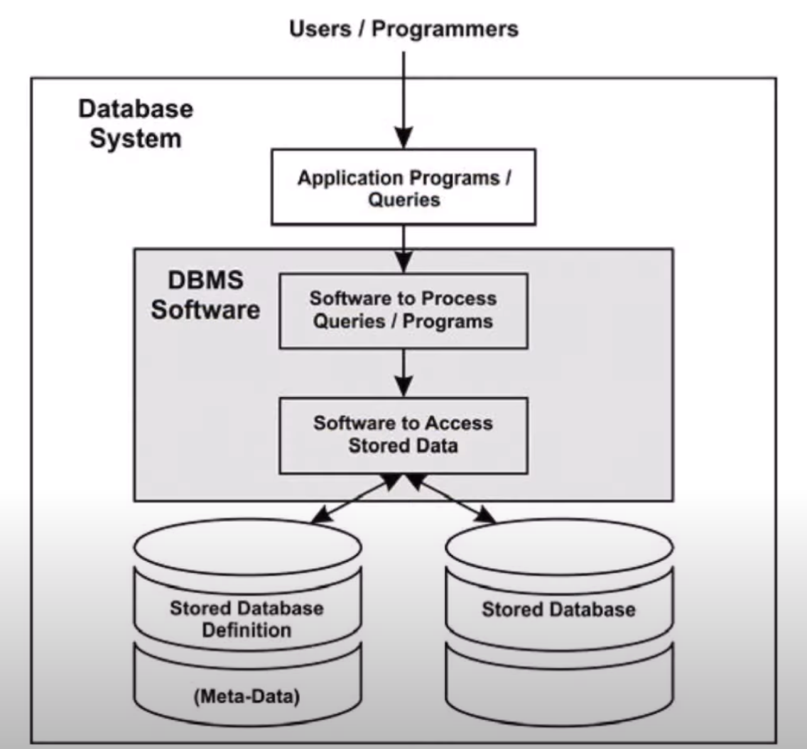
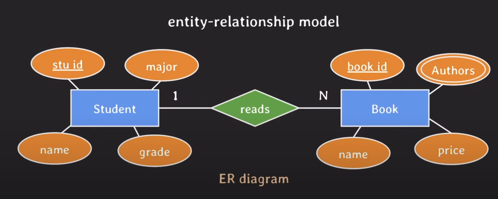
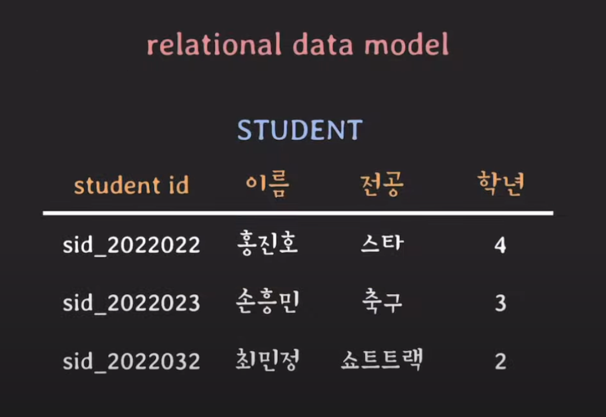
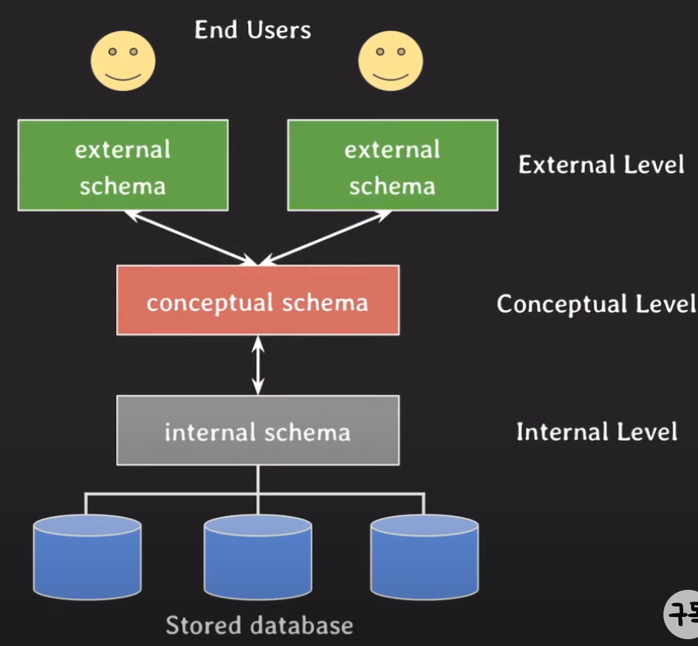

# Database 기본 용어

- Database
	- 전자적으로 저장되고 사용되는 관련있는 데이터들의 조직화된 집합 
	- **Electronically**, **Related**, **Organized collection**
- DBMS (Database Management System)
	- 사용자에게 DB를 정의 및 관리하는 기능을 제공하는 **소프트웨어 시스템**
	- PostgreSQL, MySQL, Oracle Database, SQL Server
- Metadata(=Catalog, **Data about Data**)
	- DB를 설명하는 데이터 (**Descriptive**)
	- DBMS를 통해 관리됨
	- e.g. 데이터 유형, 구조, 제약 조건, 보안, 저장, 인덱스, 사용자 그룹 etc...
- Database System
	- Database + DBMS + 연관된 applications
	- 포괄적으로 database라고 부르기도 함
- Data Model
	- **DB의 구조를 추상화해 설명하는 모형** (DB 구조: 데이터 유형, 데이터 관계, 제약 사항 etc...)
	- DB 기본 Operations(CRUD)를 포함
	- 종류
		- Conceptual Data Model (=high-level)
			
			- 일반 사용자들이 쉽게 이해할 수 있게 DB를 구조화 (추상화 수준이 가장 높음)
			- 비즈니스 요구사항 기술에 사용
		- **Logical Data Model** (=representational)
			
			- 특정 DBMS에 종속되지 않는 수준에서 디테일하고 이해하기 쉽게 DB를 구조화
			- 실제 DB 설계를 할 수 있는 수준
			- 종류 (DBMS가 채택)
				- relational data model (MySQL, Oracle DB, SQL Server)
				- object data model
				- object-relational data model (PostgreSQL)
		- Physical Data Model (=low-level)
			- 컴퓨터에 데이터가 어떻게 파일 형태로 저장되는지를 기술
			- data format, data orderings, access path(e.g. index...)
- Database Schema
	
	- **Data Model을 바탕으로 database의 구조를 기술한 것**
- Database State (=Snapshot =현재 instances의 집합)
	- **특정 시점**에 database에 있는 **실제 데이터**
- Three-Schema Architecture
	- User Application으로 부터 물리적인 database를 **분리**
	- 각 레벨을 독립시켜 **어느 레벨의 변화가 상위 레벨에 영향을 주지 않게 함** (안정적인 데이터베이스 운영)
	- Database system을 구축하는 architecture 중 하나로 **가장 많이 사용됨**
		- 대부분의 DBMS가 어느정도 따르나 three level을 완벽하게 나누지는 않음
		- Conceptual 변화는 External Level에 영향을 안 미치는 것이 상대적으로 힘들기 때문
	- 각각의 Schema는 DB 구조를 **표현**만 함. 데이터가 실제 존재하는 곳은 internal level 
	- 분류
		
		- **external schemas at external level** (user view)
			- 특정 유저들이 필요로 하는 데이터만 표현 (그 외 데이터는 숨김)
			- **logical data model**을 통해 표현
		- **conceptual schemas at conceptual level**
			- internal schema를 추상화해서 물리적인 저장 구조 내용은 숨기고 전체 DB 구조를 기술
			- entities, data types, relationships, user operations, constraints에 집중
			- **logical data model**을 통해 표현
		- **internal schemas at internal level**
			- 물리적으로 데이터가 어떻게 저장되는지 **physical data model**을 통해 표현
			- data storage, data structure, access path 등 실체가 있는 내용 기술
- Database Language
	- 오늘날 DBMS는 DML, VDL, DDL이 따로 존재하기 보다는 **통합된 언어**로 존재 (e.g. **SQL**)
	- 언어 종류
		- **DDL** (**Data Definition Language**)
			- Conceptual Schema를 **정의**하기 위해 사용하는 언어
		- SDL (Storage Definition Language)
			- Internal Schema를 정의하기 위해 사용하는 언어
			- 최근엔 파라미터 설정으로 대체 (SDL은 거의 없음)
		- VDL (View Definition Language)
			- External Schema를 정의하기 위해 사용하는 언어
			- 대부분의 DBMS에서 DDL이 VDL 역할까지 수행
		- **DML** (**Data Manipulation Language**)
			- Database에 있는 실제 data를 **활용**하기 위한 언어 (CRUD)

