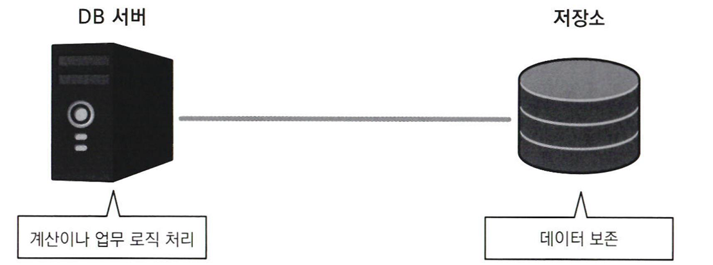
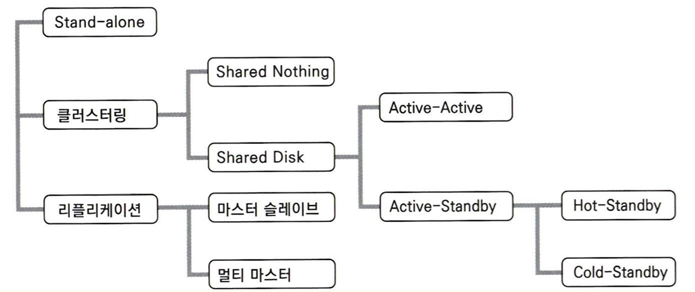
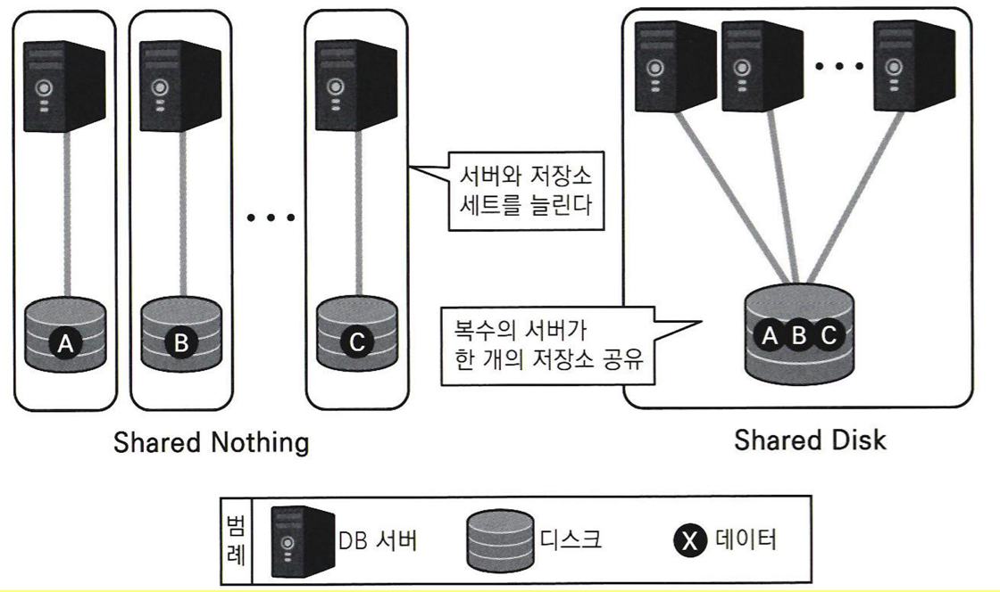
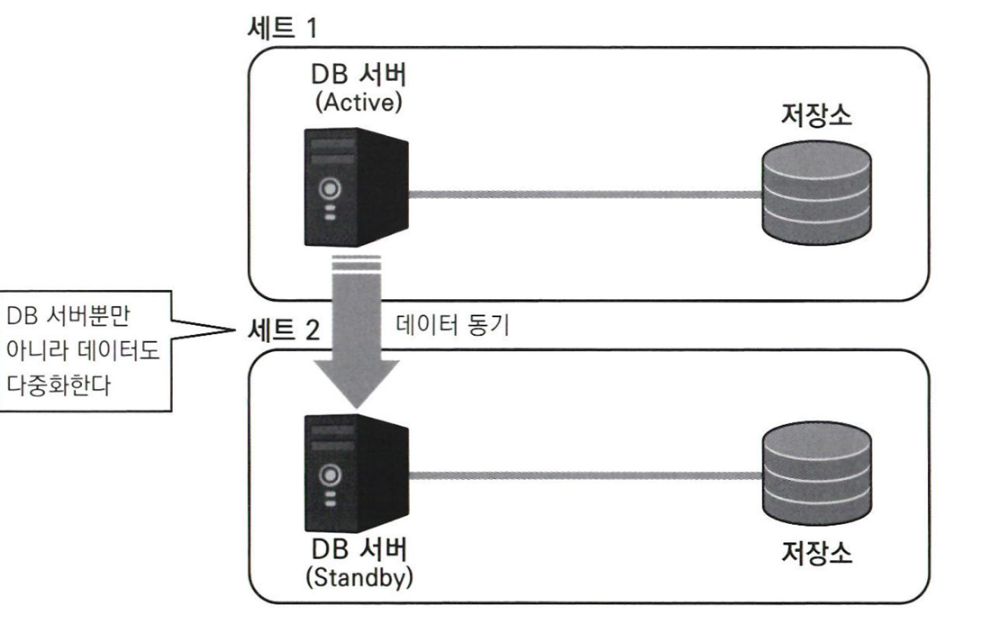
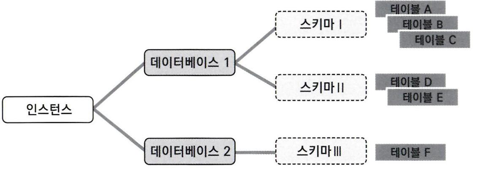

## 데이터 베이스가 갖춰야 할 기본 기능
- 데이터의 **검색**과 **갱신**
	- 데이터베이스는 **주소록**에서 시작
	- 데이터의 조회 및 등록, 수정, 삭제가 가능해야 함
	- 데이터 포멧 및 처리 성능에 대한 고려가 필요
- **동시성 제어** (= **배타 제어**)
	- 데이터베이스는 **동시에 복수의 사용자**로부터 검색 및 갱신 처리를 받음
	- 갱신의 **무결성**이 중요 (갱신 상황에 대한 제어가 필요)
	- 만일 두 명의 사용자가 같은 파일에 접근해 수정하려 한다면 다음 동작 중 하나가 시나리오가 될 것
		1. 한 사람이 파일을 열고 있을 때, 다른 사람은 열 수 없음
		2. 한 사람이 파일을 열고 있을 때, 다른 사람은 **읽기 전용**(**ReadOnly**)으로만 파일을 열 수 있음
		3. 어떤 사람도 문제없이 파일을 열 수 있고, 나중에 수행된 쪽의 갱신이 반영
			- 이를 **더티 쓰기**(**Dirty Write**)라고 하며, 선착순으로 갱신을 반영하는 상황
			- 데이터 무결성 관점에서 **지양**
- **장애 대응**
	- 데이터베이스는 **장애에 강해야 한다**.
	- 데이터 보호와 장애 대책에 최대한으로 예민해져야 함
		- 데이터 소실은 큰 사회문제와 손해배상청구 유발
	- 데이터 소실 문제에 대한 대책
		- **데이터 다중화**: 데이터를 복수의 장소에 분산해서 유지 (예방책)
		- **백업**: 데이터 소실이 발생했을 때 데이터를 복원하는 방법 (사후대책)
- **보안**
	- 데이터베이스에 보존된 데이터를 어떻게 숨길 것인가
	- 데이터베이스는 사용자가 서버를 의식하지 못하도록 설계되고 있음
## 데이터베이스의 종류
- 계층형 데이터베이스
	- 데이터를 계층구조로 관리 (조직도, 전체 구조도)
	- 최초의 현대적 데이터베이스
- **관계형 데이터베이스**
	- **2차원 표 형식**으로 데이터를 관리 (현재 가장 주류)
	- 프로그래밍 언어를 사용하지 않아도 데이터를 조작 가능 (**SQL**)
	- SQL이란 관계형 데이터베이스가 데이터를 조작하기 위해 준비한 언어
- 객체지향 데이터베이스 & XML 데이터베이스
	- 객체와 XML 형식으로 데이터를 관리 (비주류)
- **NoSQL 데이터베이스**
	- Not only SQL (SQL뿐만 아니라 다른 것이 더 있다)
	- **관계형 데이터베이스의 기능 일부를 버리고 성능(처리속도)을 높임**
	- 대량의 데이터를 고속으로 처리해야 하는 웹서비스와 잘 맞음
## 데이터베이스의 구성
### DBMS와 데이터베이스
- Database
	- 데이터 저장소를 뜻하는 **추상화**된 개념 
- DBMS(Database Management System)
	- 데이터베이스의 기능을 제공하는 소프트웨어
	- 데이터베이스 추상화를 **구현**한 제품
	- MySQL, PostgreSQL, Oracle...
### 시스템과 데이터베이스
- **시스템**은 **여러가지 소프트웨어를 조합**해 만들어야 하며, 이 작업을 SI(System Integration)라고 함
- 사용되는 소프트웨어는 크게 3가지로 구분하며 **계층성**을 띔
	- 애플리케이션
		- 비즈니스 로직을 자동화한 소프트웨어
		- 사용자는 애플리케이션을 매개로 데이터베이스에 접근
	- 미들웨어
		- 중간 소프트웨어
		- **DBMS**가 해당하는 위치
	- 운영체제
		- 시스템을 동작하게 하기 위한 토대가 되는 기능을 제공하는 소프트웨어
- 적합한 조합은 **예산, 제품 기능, 엔지니어 리소스**를 고려해 선택
- **제품의 비즈니스적 관점**도 고려 필요
	- 현시점에서 최고라고 생각해 선택한 조합이 **수년 후에는 불가능**해지는 곳이 IT 세계
	- HP-UX + Oracle 조합은 두 기업의 친밀한 관계로 지속되었으나, 추후 서로 소송으로 얽힘
## 데이터베이스와 비용
- 시스템 혹은 서비스를 새로 만드는 목적은 **돈벌이**
- 관공서나 지방공공단체는 직접적인 이익추구를 하지 않지만, **사회 전체의 이익**을 높이기 위해 시스템을 사용
- **비용감각이 있는 엔지니어**가 되어야 함
- 시스템 전체 비용 내역
	- 초기비용
		- 서비스 이용시 **최초로 지급**하는 비용
		- 하드웨어 구매비용, 엔지니어 급여...
	- 운영비용
		- 서비스 이용 기간에 **지속적으로 지급**하는 비용
		- 유지보수 비용 (장애 대응, 프로그램 수정)
- **데이터베이스** 관점의 비용
	- **초기비용**
		- **소프트웨어 라이센스 요금** (사용허가료)
			- **시스템 규모**가 클수록 라이센스료가 증가 (CPU, 사용자 수는 규모의 척도)
			- 종류
				- **프로세서 라이센스**(Processor License)
					- 하드웨어(DB 서버) CPU 성능에 따라 가격 결정
					- **어느 정도 규모를 가진 상용 시스템**에서 채택
				- 사용자 라이센스(User License)
					- 사용자 수에 따라 가격 결정
					- 사용자 수 파악이 쉬운 소규모 환경에서 채택
			- 에디션과 옵션
				- 종류
					- 스탠다드 에디션
						- 중소규모 시스템용
					- **엔터프라이즈 에디션**
						- 대규모 시스템용
						- 신뢰성, 성능, 보안 등의 추가 기능 지원 제공
					- 익스프레스 에디션
						- 시험판
						- 평범한 기능 및 동작 확인용
	- **운영비용**
		- **기술지원 비용**
			- **버그에 대한 기술적 Q&A, 긴급 수정 프로그램 배포** 등의 지원
			- 데이터베이스는 복잡한 로직으로 구현되어 있으므로, 해당 데이터베이스 개발자의 도움 필요
			- 기술 지원 없는 소프트웨어 사용은 생명줄 없이 등산하는 것
			- **너무 오래된 버전의 제품은 기술지원을 받을 수 있는 기간이 짧음**
			- **EOSL**(**End of Service LIfe**)
				- 제품이 배포되고 오랜 시간이 지나 **기술 지원이 종료되는 시점**
				- EOSL 가까우면 서비스 채택을 지양하거나 새로운 서비스로 마이그레이션해야 함
			- 반대로 **최신 버전은 버그의 집합체**로 안정성과 신뢰성에 결함이 있는 경우가 많음
- 현실적인 데이터베이스 비용 선택지
	- **벤더 제품**의 데이터베이스
		- 초기비용 **있음** + 운영비용 **있음**
		- 고기능이 더 많음
		- 반영구적 거주 가능
	- **오픈소스** 데이터베이스 
		- 초기비용 **없음** + 운영비용 **있음**
		- **기술지원료**만 유상 혹은 **구독 요금제**
		- 초기비용 없이 간단히 시작할 수 있어 의사결정 비용이 낮음
- **초기비용이 낮으면 전체비용이 높은 경우가 많으니** 전체 비용을 확실히 계산 후 냉정한 판단 필요

>**구독 요금** (Subscription)
>- 무기한 사용의 라이센스 형태와 달리 **기한을 정한 사용 허가**
>- 운영비용만 존재
>- 기술 지원이 포함
## 데이터베이스와 아키텍처 구성
### 아키텍처 역사
- 아키텍처
	- 시스템을 만들기 위한 물리 레벨의 조합
	- 시스템의 목적과 기능을 표현 (아키텍처를 보고 그 시스템의 용도와 목적을 추측할 수 있음)
	- 폭넓은 지식이 필요 (데이터베이스, 서버, OS, 미들웨어, 저장소, 로드밸런서, 방화벽...)
	- **초반 아키텍처 설계가 프로젝트의 비용과 성패를 결정**
- 역사
	- Stand-alone (1980)
		- 데이터베이스가 동작하는 머신(DB서버)이 네트워크 없이 독립적으로 동작
		- 물리적으로 서버 앞에 앉아서 사용해야함
	- 클라이언트/서버 (1990~2000)
		- 네트워크를 통해 데이터베이스 서버 1대에 복수 사용자의 단말이 접속하는 구성
		- 보안상 이유로 주로 기업이나 조직 내 닫힌 네트워크(LAN)에 이용
		- 네이티브 애플리케이션을 사용해 비즈니스 로직이 클라이언트에 존재
	- **Web 3계층** (2000~)
		- Web Server, WAS, DB 서버로 이루어진 구성
		- 클라이언트(브라우저)와 DB 서버 사이에 **웹 서버**와 **웹 애플리케이션 서버**를 둠
		- 네트워크를 이용해도 애플리케이션 계층과 DB 계층의 **보안성을 높일 수 있음**
		- 클라이언트의 비즈니스로직을 애플리케이션 계층으로 옮겨서 **애플리케이션 관리 비용을 낮춤**
### 다중화 관련 용어
- **다중화**(=**고가용성**)
	- **서비스 정지를 막기 위해** 서버를 여러개 두어 1대가 고장나도 나머지가 동작하도록 구성하는 설계
- **클러스터링**(Clustering)
	- **동일한 기능의 컴포넌트를 병렬화하는 것**
	- 클러스터링으로 가용성을 높인다 = 여유도(Redundancy)를 확보한다 = 다중화
- 가용성
	- 사용자 입장에서 시스템을 어느정도 사용할 수 있는지
- 신뢰성
	- 컴포넌트(하드웨어, 소프트웨어)가 고장나는 빈도나 고장 기간을 나타내는 개념
- 가용성을 높이는 2가지 전략
	- 심장전략: 시스템 내 각 컴포넌트의 신뢰성을 높이기
	- **신장전략**: 컴포넌트를 **병렬화**하기 (물량작전)
		- 신뢰성이 낮은 컴포넌트를 사용하더라도 **다중화**(**클러스터링**)한다면 **시스템 전체 가용성 상승**
- 가동률(=가용률)
	- 시스템이 무고장으로 동작할 확률
	- 100% - **장애 발생률**(서버)
	- 100%는 원리적으로 불가능 (비용을 들여도 달성 불가능)
	- **서버가 늘어날수록 가동률이 증가**하나 **증가 폭은 크게 적어짐**
	- 시스템 세계에서는 가용률 **99%도 낮은 수치** (= 1년 중 3일 15시간 36분 서비스 다운)
	- 유지보수 등의 계획정지를 포함하지 않는 경우 **실제 가용률**이란 표현을 사용하는 경우도 존재
- 단일 장애점(SPFO, Single Point of Failure)
	- 다중화되어 있지 않아서 전체 서비스의 계속성에 영향을 주는 컴포넌트
	- **단일 장애점의 신뢰성**이 시스템 전체의 **가용성**을 결정
	- 단일 장애점을 없애기 위해 대부분 이중화 노력
### DB 서버의 다중화
- DB 서버는 **데이터를 보존하는 영속 계층**이기 때문에, 오랫동안 **클러스터링이 어려운 컴포넌트**로 인식
	- 웹서버, WAS는 데이터를 일시적으로 처리하므로 다중화가 간편
	- 데이터는 항상 갱신되므로 DB 서버 다중화는 **데이터 정합성**이 중요
- DB 서버 아키텍처 = DB 서버 + **저장소**
	
	- 대량의 데이터를 **영구적**으로 보존해야하고 그에 따른 **성능**도 요구됨
- DB 아키텍처 패턴
	
	- **클러스터링**(Clustering)
		- **Shared Disk** (기본 다중화)
			- **DB 서버 다중화** + 1개 저장소
			- **저장소가 1개**라 **데이터 정합성은 신경 쓸 필요 없음**
			- 종류 (DB 서버 동시 동작 여부에 따라)
				- **Active-Active**
					- 컴포넌트를 **동시에 가동**
					- Oracle RAC, DB2 pureScale 말고는 없음
					- 장점
						- 시스템 다운 시간이 짧음 (한 대가 다운되어도 남은 서버가 계속 처리)
						- 좋은 처리 성능 (DB 서버 대수가 증가하면 동시 가동 CPU 및 메모리도 증가)
					- 단점
						- **저장소가 병목지점**이므로 생각만큼 성능 향상이 없는 경우도 존재
						- 저장소가 파괴될 경우 데이터 유실
				- **Active-Standby**
					- 컴포넌트 중 실제 가동하는 것은 Active, **남은 것은 대기(Standby)**
					- Standby 상태 DB 서버는 **Active DB 서버에 장애가 날 때만 사용**
						- **Heartbeat**: Standby DB 서버는 일정 간격으로 Active DB에 이상 없는지 체크 (수 초~수십 초)
						- 신호가 끊기면 장애 발생으로 판단하고 Standby DB 서버 종작
						- **전환시간**만큼의 시스템 다운 발생 (수십초~수분)
					- 종류
						- Cold-Standby
							- 평소에는 Standby DB 작동 X, Active DB가 **다운된 시점**에 작동
						- Hot-Standby
							- **평소에도** Standby DB 작동
							- 전환시간이 더 짧지만, **라이센스료가 더 비쌈**
							- 사치스러운 구성이지만, 그럼에도 **Active-Active보다 저렴**
			- **가용성과 성능이 좋은 순서**(= 라이센스 **가격순**)
				1. Active-Active
				2. Active-Standby(Hot-Standby)
				3. Active-Standby(Cold-Standby)
		- **Shared Nothing** (성능 추구를 위한 다중화)
			
			- 네트워크 이외의 **자원을 모두 분리**하는 방식
				- **서버, 저장소, 데이터를 한 세트 단위**로 해서 여러 세트로 분리
			- 구글이 개발한 구조를 **Sharding**이라고도 부름 (구글이 극적인 방식으로 유효성 증명)
			- 장점
				- **구조가 간단**하고 **저장소 병목 방지**
				- 서버와 저장소 세트를 늘리면 **병렬처리** 때문에 **선형적으로 성능(처리율)이 향상**
			- 단점
				- **각각의 DB 서버가 동일한 1개 데이터에 엑세스할 수 없음**
					- 시 단위 DB 서버 + 저장소 세트
					- 고양시 데이터는 고양시 데이터를 가진 DB 서버만 엑세스 가능
					- 경기도 인구 계산할 때는 각 시별 세트로부터 데이터를 집계 정리하는 서버 필요
				- DB 서버 다운 대책으로 **커버링(Covering)** 구성 필요
					- 한 DB 서버가 다운되면 다른 DB 서버가 이어받아 계속 처리
	- **리플리케이션** (**Replication**)
		
		- **DB 서버와 저장소 세트를 복수로 준비**하는 구성
		- 종류
			- **마스터 슬레이브** (주로 사용)
			- 멀티 마스터 (복잡해서 흔치 않음)
		- **성능**과 **갱신주기** 사이에 트레이드 오프 고려 필요
			- Active 세트(**마스터**)와 Standby 세트(**슬레이브**)가 나뉘어 있음
			- 주기적으로 Standby측 저장소를 최신 데이터로 **동기화**해야 함 (**데이터 정합성** 유지)
		- 장점
			- **원격지 리플리케이션** 덕분에 **가용성이 매우 높음**
				- DB 서버와 저장소가 모두 사용 불능이어도 **다른 1세트가 살아있다면** 서비스 지속
				- 자연재해로 서울 데이터센터가 파괴돼도 부산 데이터 센터가 무사하면 계속 처리 가능
			- **피라미드형 리플리케이션** 구성을 하면 **부하 분산**도 가능
				- **오래된 데이터를 사용해도 되는 기능**은 **손자나 증손자 세트**에 분산
## 커넥션과 세션
- 커넥션 (Connection)
	- **로그인** 후 사용자와 데이터베이스가 **연결**된 상태
	- 커넥션이 유지되는 한 사용자는 데이터베이스와 무언가를 주고 받을 수 있음
	- 데이터베이스는 **동시에 여러 개의 커넥션** 유지 가능 (=동시에 **복수의 사용자 연결 병행처리**)
	- 전화 이미지와 유사
		- 전화번호 입력 - 전화 걸기 - 상대방이 전화를 받음
		- 사용자 정보 입력 - 로그인 실행 - 커넥션 연결 완료
- 세션 (Session)
	- 커넥션의 시작과 종료 사이에서 **교환의 시작과 종료까지의 단위**
	- 커넥션과 매우 유사하지만 실제로 커넥션 확립 후 세션 생성
	- 기본적으로 **커넥션과 세션은 1:1 대응**
	- **커넥션이 성립**되면 **동시에 암묵적으로 세션도 시작**, **세션을 끊으면** **커넥션도 끊어**지는 경우가 대다수
## 관계형 데이터베이스의 계층
- 데이터베이스 내부의 테이블은 몇 개의 **그룹**으로 나뉘어 관리 (디렉토리와 유사)
- **4 계층 트리구조** (ANSI **표준** SQL)
	
	- 1계층: **인스턴스** (Instance)
		- 물리적 개념으로 DBMS 동작 단위
		- 프로세스, **서버**라 부름
		- 멀티 인스턴스가 가능하지만, 거의 사용하지 않음
	- 2계층: **데이터베이스** (Database)
	- 3계층: **스키마** (Schema)
		- 데이터베이스의 **디렉토리**에 해당하는 것
		- 사용자가 스키마를 자유롭게 만들어 용도별 분류 혹은 권한 관리 등을 할 수 있음
	- 4계층: **오브젝트** (Object)
		- **테이블**(Table), 인덱스 (Index), 저장 프로시저 (Stored Procedure) 등을 총칭
- 실제 RDBMS의 계층 분류
	- **3계층** RDBMS: MySQL, Oracle
		- **MySQL**은 **데이터베이스와 스키마를 동일한 것**으로 간주
		- **Oracle**은 **인스턴스 아래에 데이터베이스를 한 개만 만들 수 있다**는 독자적 제약 (실질적 3계층)
	- **4계층** RDBMS: PostgreSQL, SQL Server, DB2
