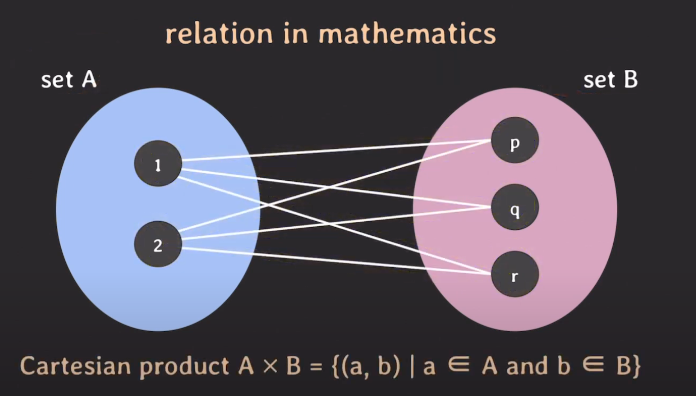
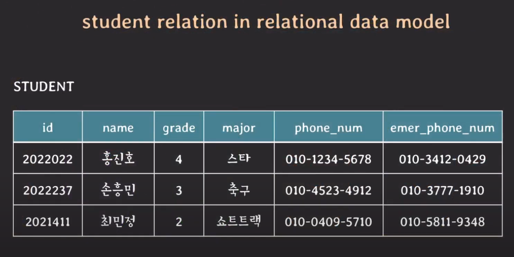

## Relational Data Model & Relational Database
- Relation in Mathematics
	- Set
		- 서로 다른 elements를 가지는 collection
		- elements의 순서는 중요하지 않음
	- Cartesian Product
		
		- Set A & Set B의 element로 만들 수 있는 **모든 pair의 조합**
	- **Relation**
		- **Cartesian product의 부분 집합** (subset of Cartesian product)
			- n-ary relation: n개의 Set에 대한 cartesian product의 부분집합
		- **tuple들의 집합** (set of tuples)
			- tuple은 하나의 pair를 의미
- **Relational Data Model**
	
	- Relation이 Relational Data Model에서는 Table로 표시 
	- **Relation = Table = Set of Tuples** 
	- tuple(행) & attribute(열)
- Relation Schema
	- Relation의 구조를 나타냄 (constraints 포함)
	- e.g. `Student(id, name, grade, major, phone_num, emer_phone_num)`
- Degree of Relation
	- Relation schema에서 attributes의 수
- **Relational Database**
	- **Relational data model에 기반하여 구조화된 database** (여러개의 relations로 구성)
- Relational Database Schema
	- relation schemas set + integrity constraints set
