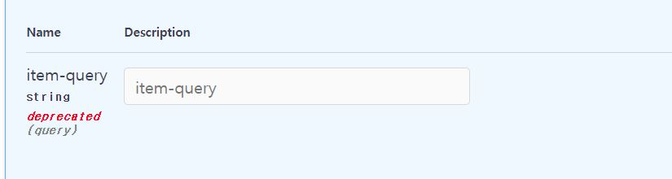

# Fast API 튜토리얼 - Validations

각각의 Parameters는 인자로 받을 데이터에 대해 여러가지 조건을 걸어 validations(유효성 검사)를 수행할 수 있습니다. 만일 incorrect한 데이터가 감지될 경우 validation에 의해 error가 응답됩니다.

​    

## Parameter의 종류를 선언하는 함수

앞에서 살펴봤듯이 parameter는 path parameter, query parameter, request body parameter 등 여러가지 형태의 종류가 존재합니다. 이외에도 cookie parameter, header parameter등 더 다양한 형태가 존재하는데, 이러한 parameter를 조금 더 명시적으로 선언할 수 있게 도와주는 함수가 각각 존재합니다.

```python
from typing import Optional

from fastapi import FastAPI, Path, Query

app = FastAPI()


@app.get("/items/{item_id}")
async def read_items(item_id: Path(...), q: Query(None):
    results = {"items": [{"item_id": "Foo"}, {"item_id": "Bar"}]}
    if q:
        results.update({"q": q})
    return results
```

만일 parameter의 default 값으로 `Path(...)`를 설정해주면, 해당 parameter는 required한 path parameter가 됩니다. 혹은 Default 값으로 `Query(None)`를 사용한다면 해당 parameter는 not required한 query parameter가 됩니다. 이러한 함수들은 함수의 첫 번째 parameter로 default 값을 받습니다.

* `Path([default 값])`

* `Query([default 값])`
* etc...

이렇게 각각의 parameters는 자신의 이름을 딴 함수를 갖고 있습니다. `fastapi`에서 import해오는 `Path`, `Query` 등이 그 예입니다. 사실 각각의 함수들은 해당 이름의 클래스에서 인스턴스를 만들어 return하는 기능을 하므로, default parameter로 설정하는 것은 해당 이름의 객체가 됩니다. Parameter에 대한 validation은 이러한 함수들을 사용해 적용합니다.

이러한 클래스들이 비슷한 느낌을 띄는 이유가 있습니다. 해당 클래스들은 모두 `Param` 클래스의 subclass들입니다. 그래서 이들은 validation과 metadata의 추가를 모두 똑같은 방식으로 적용할 수 있습니다.

​    

## Path(), Query(), Body() 함수로 required parameter 만들기

앞에서 `Query` 함수의 첫번째 parameter로 `None`을 사용해 optional parameter를 만들었는데, 만일 `Query` 함수를 사용해 required parameter를 만들고 싶다면 `Query`의 첫 번째 argument로 `...` ([Ellipsis](https://docs.python.org/3/library/constants.html#Ellipsis))를 사용하면 됩니다. 이는 나중에 사용할 `Path`, `Body` 함수와 더불어 같은 맥락의 함수들에 똑같이 적용됩니다.

* Query(...)
* Path(...)
* Body(...)
* etc...

​    

## String Validations

### Additional Information

Fast API는 type hinting과 default parameter를 통해 이에 대한 추가 정보를 인식하고 활용합니다.

```python
from typing import Optional

from fastapi import FastAPI

app = FastAPI()


@app.get("/items/")
async def read_items(q: Optional[str] = None):
    results = {"items": [{"item_id": "Foo"}, {"item_id": "Bar"}]}
    if q:
        results.update({"q": q})
    return results
```

위 코드는 `async def read_items(q: Optional[str] = None):` 부분에 query parameter `q`에 대한 타입을 명시했습니다. `q`는 `str`타입이 단서가 되어 query parameter로 인식됩니다. 또한, `= None`을 통해 not required한 optional parameter로 인지됩니다.

​    

### Additional validation

Parameter에 인자로 받을 데이터에 대한 validation을 걸어줄 수 있습니다. 일례로, query parameter `q`에 대해 인자로 들어올 `str` 데이터의 최대 길이가 50이 넘지 않게끔 검사를 수행하는 validation을 만들겠습니다.

```python
from typing import Optional

from fastapi import FastAPI, Query

app = FastAPI()


@app.get("/items/")
async def read_items(q: Optional[str] = Query(None, max_length=50)):
    results = {"items": [{"item_id": "Foo"}, {"item_id": "Bar"}]}
    if q:
        results.update({"q": q})
    return results
```

우선 `fastapi`에서 `Query` 함수를 import합니다.

* `from fastapi import FastAPI, Query`

그리고 `Query` 함수를 다음과 같은 형태로 default parameter 자리에 사용합니다. 

* `Query([default 값], [조건식])`

`q: Optional[str] = Query(None, max_length=50)`는 default 값으로 `None`을 유지한 상태에서 `q`의 최대 길이를 50으로 지정합니다. 그리고 실제로 전달된 데이터의 길이가 50을 넘어가면, error를 응답합니다. 

또한, `Query` 함수는 다음과 같이 parameter를 더 추가해 여러 개의 validation을 지정할 수 있으며, 정규표현식을 validation으로 지정할 수도 있습니다.

* `Query(None, min_length=3, max_length=50)`
* `Query(None, min_length=3, max_length=50, regex="^fixedquery$")`

이러한 validation 정보들은 Interactive Documentation에도 업데이트됩니다.

​    

### Parameter에 Multiple values 받기

```python
from typing import List, Optional

from fastapi import FastAPI, Query

app = FastAPI()


@app.get("/items/")
async def read_items(q: Optional[List[str]] = Query(None)):
    query_items = {"q": q}
    return query_items
```

Parameter를 특정 parameter를 만드는 함수를 사용해 선언한다면, multiple values를 받는 parameter로 만들 수 있습니다. 만일 query parameter를 `Query` 함수를 사용해 만든다면, multiple values를 받는 query parameter를 만드는 식입니다. 이 경우 query parameter는 반드시 `Query` 함수와 함께 정의되어야 하는데, 그렇지 않으면 Fast API가 해당 parameter를 request body로 간주할 수 있기 때문입니다. (Singular type이 아닌 type으로 parameter를 선언할 때 나타나는 현상입니다!)

* `q: Optional[List[str]] = Query(None)`

위와 같이 `List` 타입으로 `q`를 선언하면, http://localhost:8000/items/?q=foo&q=bar 요청과 같이 URL에 여러 개의 query 값이 전달되어도 리스트로 한 번에 받아 처리할 수 있습니다. Fast API는 자동으로 multiple query를 인식해 리스트에 담아줍니다. 위 URL 요청에 대한 response은 다음과 같습니다.

```json
{
  "q": [
    "foo",
    "bar"
  ]
}
```

만일 리스트로 받을 내부 요소들의 타입까지 체크하고 싶진 않다면, 다음과 같이 `list`로만 타입을 선언하면 됩니다. 

* `q: list = Query([])`

​    

### Parameter에 metadata 넣기

Parameter의 종류를 선언하는 함수에 인자를 설정해주면, 함수를 적용한 parameter에 metadata를 추가할 수 있습니다. 예를 들어, `Query` 함수의 parameter를 사용하면 다음과 같이 query parameter에 또 다른 metadata들을 추가할 수 있습니다. 

```python
async def read_items(
    q: Optional[str] = Query(
        None,
        title="Query string",
        description="Query string for the items to search in the database that have a good match",
        min_length=3,
    )
):
```

여기선 `title`과 `description` parameter를 추가했는데, 이렇게 추가된 query parameter 정보들은 Interactive Document에도 반영됩니다.

​    

### Parameter에 Alias 설정하기

REST하게 URL을 만들고 싶다면, `_`보다 `-`를 사용하는 것이 좋습니다. 언더스코어 `_`는 밑줄이 그어지면 가독성이 떨어지기 때문입니다. 그러나 parameter 이름을 `item-query`처럼 사용하는 것은 Python 문법에 어긋납니다. 따라서, 이러한 경우에는 parameter에 alias를 `item-query`로 설정해줍니다. 아래는 query parameter의 예입니다.

* `q: Optional[str] = Query(None, alias="item-query")`

​    

### Parameter Deprecating하기

**Deprecated**는 특정 기능이 아직까지 사용되고는 있지만, 중요도가 떨어져 조만간 사라지게 될 상태를 말합니다. 만일 특정 parameter를 언젠가 제거할 계획이지만 이를 계속 사용하는 클라이언트 개발자들을 위해 한 동안 남겨두려는 상황이라면, 해당 parameter를 deprecating하여 Interactive API Documentation에 해당 parameter가 deprecated 상태임을 명확히 알려줄 수 있습니다. (Documentation은 클라이언트 개발자들과의 소통 창구 역할을 합니다!)

예를 들어, 다음과 같이 Query 함수의 parameter로 `deprecated=True`를 설정해줍니다.

* `q: Optional[str] = Query(None, deprecated=True)`

Deprecated 상태에서는 parameter의 이용이 여전히 가능하지만, Interactive Documentation에는 해당 parameter의 deprecated 상태가 명확히 반영됩니다.



​    

## Numeric Validations

앞에선 String과 관련된 validation을 많이 살펴봤지만, Numeric 형태의 데이터를 다룰 때도 물론 validation을 수행하거나 metadata를 추가해줄 수 있습니다. 이 경우는 Numeric value를 자주 사용하는 path parameter를 주로 사용해서 살펴보겠습니다.

`Path` 함수는 다음과 같이 import해 사용합니다.

* `from fastapi import Path`

​    

### Path Parameter에 metadata 넣기

```python
from typing import Optional

from fastapi import FastAPI, Path, Query

app = FastAPI()


@app.get("/items/{item_id}")
async def read_items(
    item_id: int = Path(..., title="The ID of the item to get"),
    q: Optional[str] = Query(None, alias="item-query"),
):
    results = {"item_id": item_id}
    if q:
        results.update({"q": q})
    return results
```

`Path` 함수에 metadata를 넣을 때도, `Query`와 똑같은 방식으로 사용합니다. `item_id` path parameter에 `title` 정보를 넣고 싶다면 다음과 같이 `Path` 함수에 parameter로 삽입하여 적용합니다.

* `item_id: int = Path(..., title="The ID of the item to get")`

이 때, path parameter는 path의 일부분이기 때문에, 인자가 반드시 존재해야 하는 parameter입니다. 따라서, 첫 번째 파라미터로 `...`을 사용해 Fast API에게 required parameter임을 알려줍니다. 사실 `...`이외의 `None`이나 다른 default 값을 사용하더라도 문제 없이 실행되지만 큰 의미는 없으며, 해당 path parameter는 여전히 required parameter로 기능합니다.

​    

### Number validations

Parameter에 대하여 몇몇 숫자에 대한 validation을 추가할 수 있습니다.

```python
from fastapi import FastAPI, Path

app = FastAPI()


@app.get("/items/{item_id}")
async def read_items(
    *,
    item_id: int = Path(..., title="The ID of the item to get", gt=0, le=1000),
    q: str,
):
    results = {"item_id": item_id}
    if q:
        results.update({"q": q})
    return results
```

위 코드의 `Path` 함수에 들어간 `gt`, `le` 같은 validation parameter들의 의미는 다음과 같습니다.

* `gt`: greater than
* `ge`: greater than or equal
* `lt`: less than

* `le`: less than or equal    

​    

## Reference

[Fast API 공식 문서 튜토리얼](https://fastapi.tiangolo.com/tutorial/)

