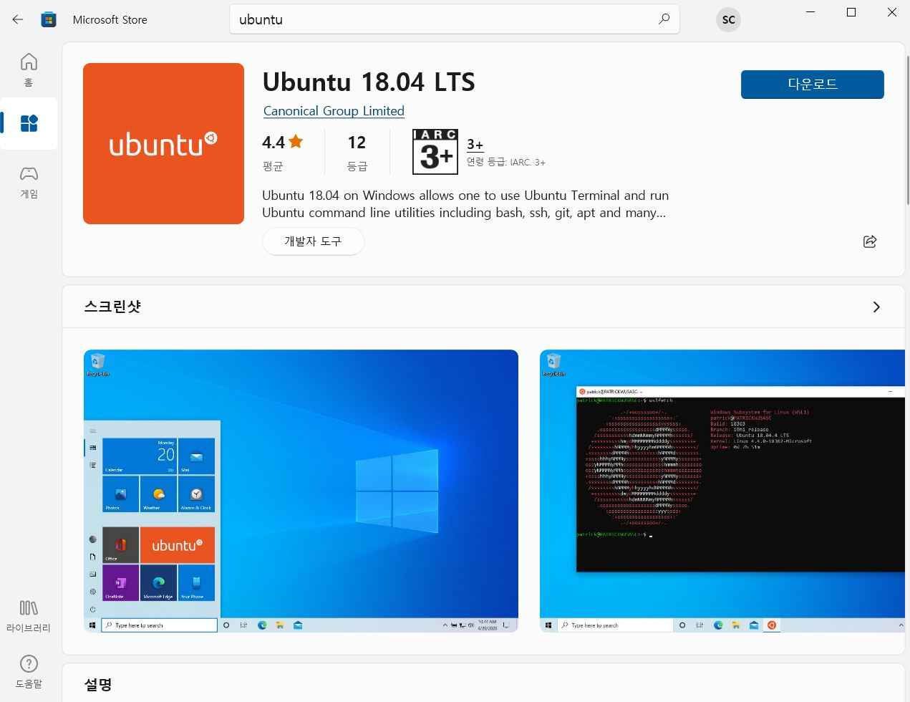

# WSL2로 Windows에서 Linux 사용하기

## Intro

Windows는 멋진 OS입니다. Windows 덕분에 개발의 첫 발자국을 뗄 수 있던 사람은 아주 많을 것입니다! 

다만, Windows 환경에서 개발을 진행하다보면, 생각치 못한 에러를 마주칠 때가 참 많습니다. 특히 Mac OS 환경에서는 자연스럽게 넘어가던 일들이 왕왕 막힐 때는, 고구마 5개가 식도에 함께하는 기분을 느끼게 됩니다(?)

이러한 참사를 막기 위해, Windows 위에서 리눅스를 매끄럽게 사용할 수 있게 도와주는 WSL2가 존재합니다.

> WSL2란?
> WSL은 Windows Subsystem for Linux 2의 줄임말로, 윈도우의 가상화 기능을 활용해서 윈도우 위에서 리눅스를 사용할 수 있게해줍니다. 단순히 가상머신으로 리눅스를 사용할 수 있는 것이 아니라, 윈도우 시스템과 통합되어 마치 하나의 머신처럼 자연스럽게 리눅스를 활용하는 것이 가능합니다. 
>
> \- [LainyZine: 프로그래머 가이드](https://www.lainyzine.com/ko/article/how-to-install-wsl2-and-use-linux-on-windows-10/)

​    

## Requirements

Windows 10 버전 요구사항: 20H1 이상

​    

## Windows 사양 확인

Windows + S 키로 검색 탭을 열어 PC 정보를 검색합니다.

PC 정보의 아래 쪽에 Windows 사양 부분에서 버전을 확인합니다. 현재 20H1, 20H2, 21H1 등에서 WSL 사용이 지원됩니다.

​    

## WSL2 활성화 및 Ubuntu 설치

WSL2 설치를 위해 가상 터미널을 이용합니다. 이 때, 가상 터미널로 Windows Terminal을 설치해 사용하면 이후 WSL 사용도 편리해집니다. 없을 시엔 Windows PowerShell을 사용합시다.

1. Windows + S 키로 Windows Terminal이나 PowerShell을 검색한 후, 우 클릭하여 '관리자 권한으로 실행'을 클릭합니다.

2. 다음 명령어를 실행해 WSL 기능을 활성화합니다.

   * `dism.exe /online /enable-feature /featurename:Microsoft-Windows-Subsystem-Linux /all /norestart` 

3. Microsoft Store에 들어가 원하는 버전의 Ubuntu를 설치합니다.

   

4. 활성화 적용을 위해 컴퓨터를 재시작합니다.

5. 다운받은 Ubuntu를 실행하고 설치 완료 메시지까지 약간 기다립니다.

6. 계정 정보 입력 메시지가 뜨면, 새로운 Ubuntu OS에 대한 새로운 계정을 만듭니다. (기존 Windows 정보와 전혀 상관없이 새 계정을 만들면 됩니다.)
   

7. 이후, 다음 명령어를 사용해 활성화 되어 있는 WSL을 WSL2로 업데이트합니다. (관리자 권한 실행)
   * `dism.exe /online /enable-feature /featurename:VirtualMachinePlatform /all /norestart`

8. 컴퓨터를 재시작합니다.

9. 다음 명령어를 사용해 WSL2를 기본 버전으로 설정합니다. (관리자 권한 실행)

   * `wsl --set-default-version 2`
   * 만일 커널 구성요소를 다운로드하라는 메시지가 나오면, 해당 링크로 가서 커널 업데이트 패키지를 다운로드 받아 install하고 다시 `wsl --set-default-version 2` 명령어를 실행합니다. 

10. 다음 명령어를 사용해, WSL에게 Ubuntu에 WSL2를 사용할 것이라는 것을 알려줍니다.

    * `wsl --list --verbose`를 통해 현재 설치된 ubuntu의 버전을 확인할 수 있습니다.
    * `wsl -l -v`로 현재 설치된 리눅스를 확인해볼 수 있습니다.
    * `wsl --set-version Ubuntu-18.04 2`식으로 명령을 실행합니다.
    * 혹시 BIOS에서 가상화가 사용가능하도록 설정하라는 메시지가 뜨면, 구글 검색을 통해 가상화 설정을 진행하고 다시 명령어를 실행합시다.

​    

## Customizing Linux Shell

WSL2을 통한 Ubuntu의 초기 리눅스 쉘 상태는 굉장히 ugly합니다. 따라서, 몇 가지 기본세팅이나 UI 적용을 통해 보다 깔끔한 터미널을 만드는 것도 매우 좋을 것입니다.

다음 링크에서 원하는 customizing을 참고하시길 바랍니다.

>  [Nomad Coder WSL Setup](https://nomadcoders.co/windows-setup-for-developers/lectures/1833)

​    

## Outro

Windows 환경에서 개발함에 있어 WSL2는 단비 같은 툴입니다. 개발에만 집중하기도 모자른 시간을 환경적 에러에서 소모할 필요는 없습니다. 그렇지만 Windows라고 개발에서 배제(?)될 필요도 없습니다. 다만, Windows를 쓰시는 개발자라면 WSL2로 초기 환경을 세팅하고 개발하시길 권합니다 :)

​    

## Reference

[Nomad Coder WSL Setup](https://nomadcoders.co/windows-setup-for-developers/lectures/1833)

[LainyZine: 프로그래머 가이드](https://www.lainyzine.com/ko/article/how-to-install-wsl2-and-use-linux-on-windows-10/)
