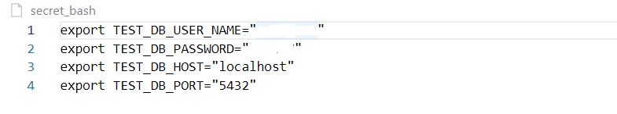
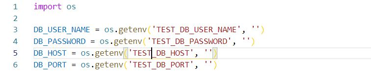
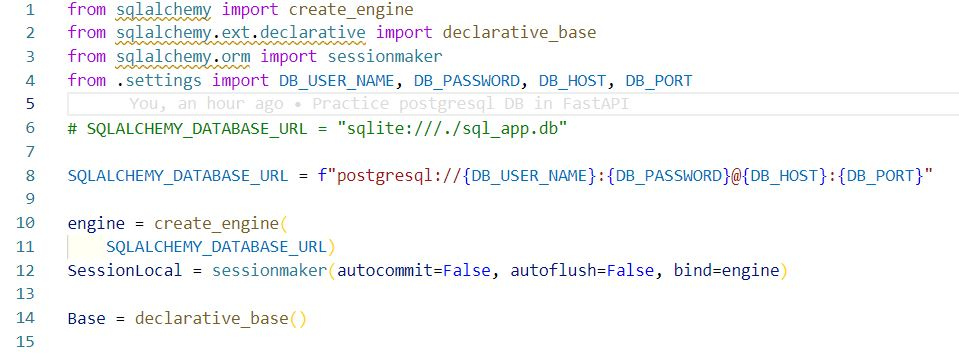
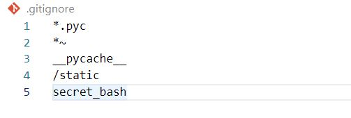

# Secret key를 숨기는 통상적 방법

Github 같은 public한 장소에 프로젝트를 배포할 때, secret key같은 private한 정보들은 숨겨서 배포해야 합니다. 이를 위한 통상적인 방법은 환경변수를 이용하는 것입니다. 하나의 파일에 private한 정보들을 몰아놓으면, 프로젝트를 실행하기 전마다 해당 파일을 사용해 환경변수를 등록해둘 수 있고 아무일 없었듯이 프로젝트를 실행할 수 있습니다.

대표적으로 secret key를 숨기기 위해서는 secret key를 담을 `secret_bash` 파일, 등록된 secret key 환경변수를 가져올 `settings.py`파일, `.gitignore` 파일 총 3가지가 필요합니다. (`secret_bash`와 `settings.py`의 이름은 임의로 변경 가능합니다.)

아래는 임의의 Python 프로젝트 구조의 예시입니다.

```
my_super_project - app - main.py
                |     |_ settings.py
                |_ .gitignore
                |_ secret_bash
```

​    

## 과정

해당 과정은 리눅스 기반에서 진행합니다. 사용되는 secret key는 PostgreSQL과 관련있는 예시입니다.

### 1. `secret_bash ` 생성 및 설정



프로젝트의 최상위 디렉토리 밑에 `secret_bash` 파일을 생성하고 secret key 정보를 담습니다. 파일 내에 `export` 명령어를 사용하는 이유는 프로젝트를 실행하기 전마다 해당 파일을 실행해 secret key를 환경 변수로 등록할 수 있도록 하기 위함입니다. 

### 2. `settings.py` 생성 및 설정



`secret_bash`에서 환경 변수를 export하면, 해당 환경 변수를 프로젝트로 가져올 수 있게 설정합니다. 이 과정에서 Python의 표준 라이브러리인 `os` 모듈을 사용합니다. `os`는 개발자가 간편하게 시스템적 접근을 할 수 있도록 도와주는 라이브러리로, `os` 라이브러리의 `getenv`를 사용해 등록된 환경변수를 가져옵니다. 이 때 해당 환경 변수가 존재하지 않는다면 `getenv`는 `None`을 반환하므로, 혹시나 오류가 나지 않게끔 `''`(빈 문자열)을 기본값으로 지정해 반환하도록 만듭니다.

### 3. `main,py`에서 환경 변수 사용하기



현재 디렉토리에 존재하는 `settings.py`에서 환경 변수 값을 담았던 변수들을 import해 secret key가 필요한 곳에 사용합니다. 여기서는 PostgreSQL의 URL을 구성하기 위해 username이나 password 등을 환경 변수를 사용했습니다.

### 4. `secret_bash` 파일을 활용해 환경 변수 등록하기

앞 과정을 다 수행했다면 secret key가 잘 동작하는지 프로젝트를 실행해봐야 합니다. 

프로젝트 실행 전, 터미널에서 `source` 명령을 사용해 `secret_bash` 파일의 설정 내용을 시스템에 적용합니다.

* `source secret_bash`

### 5. `.gitignore`에 `secret_bash`를 등록하고 github에 배포하기



`.gitignore`는 github에 올리지 않고 싶은 것들을 설정해두는 파일입니다. `.gitignore`에 `secret_bash`를 등록해서 프로젝트를 배포할 때 `secret_bash`가 무시되도록 만듭니다. (`.gitignore`의 상세한 문법이 존재하나 여기서는 생략하겠습니다.)

그리고 Github에 프로젝트를 배포하면, secret key가 숨겨진 상태로 프로젝트가 배포됨을 확인할 수 있습니다.