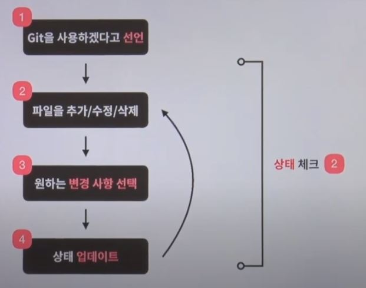
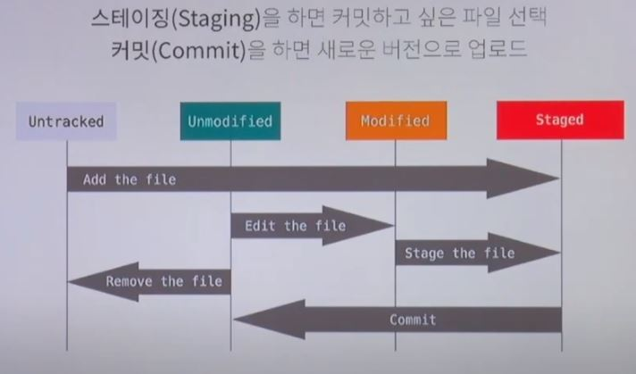
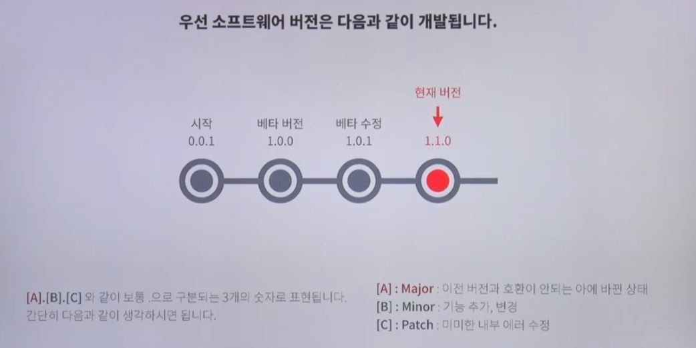
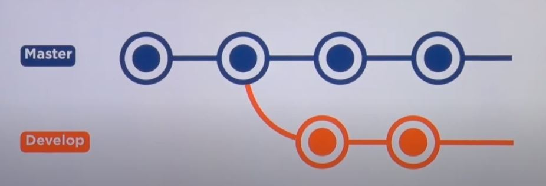
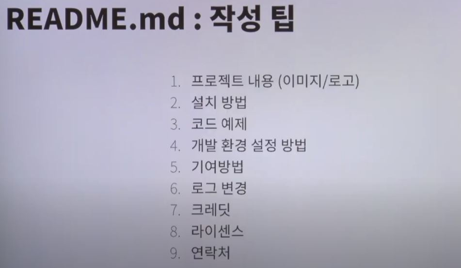
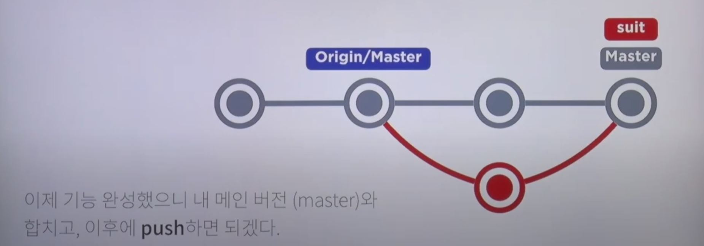
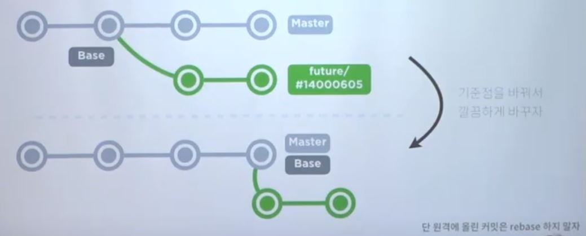

# Git 기초

## Git 기본 이용 사이클

* Git 저장소 선언하기 (Initialization & Repository)
  * Git 저장소를 흔히 Repo(레포)라고 부르며, Repo는 git으로 관리하는 하나의 메인 저장소를 뜻함
  * 사용자가 변경한 모든 내용 추적 가능
    * 현재 상태, 변경 시점, 변경한 사용자, 설명 텍스트 등
  * 관리할 폴더에서 `git init` 을 통해 선언
  * 주목할 특징
    * Git은 이제 Local에서 모든 것을 저장 및 버전 관리 가능하고 나중에 원격 서버에 올려도  상관 없음
    * Git은 데이터를 추가만 할 수 있음
      * 파일 삭제 == 삭제 기록 추가 (물론 온전한 삭제도 가능하지만, 버전 관리에서는 삭제 기록도 매우 중요)
    * Git은 파일을 추적하지 않음
      *  파일의 내용 단위로 **각 문자와 줄을 추적**
      * 빈 디렉토리는 추적하지 않음

​    

* 파일 추가/수정/삭제

​    

* 변경 사항 선택

  

  * 파일 상태
    * 파일은 추적 여부로 구분해 tracked, untracked 파일로 나눌 수 있음
    * tracked 파일은 Unmodified(수정 없음), Modified(수정 있음), Staged(저장(커밋)을 위해 준비됨) 상태로 구분됨

  * 스테이징(Staging)을 통해 커밋하고 싶은 파일 선택
    * 스테이징이 필요한 이유?
      * 여러 작업 중 일부분만 커밋해야 할 때
      * 커밋 전 상태를 수정 또는 체크할 때 (안전하게 커밋하기 위함)

​    

* 상태 업데이트
  * 커밋(Commit)을 통해 새로운 버전으로 업로드
  * 커밋을 하면, 각 버전마다 40자리의 숫자 + 알파벳 조합으로 이루어진 해시값이 존재
    * 해시 값은 버전의 주소(Key)
    * 해시값은 내용(파일 구조)을 사용해 생성됨 (파일이 어떤 폴더 밑에 있고, 어떤 내용이다 등의 상태를 40자리로 표현)
    * Commit Hash 값으로 Checkout하면 버전 이동 가능

## Git Branch

* 소프트웨어 버전 넘버링 상식

  

  * 보통 세가지 숫자로 표현되며, 위 그림과 같이 각각 의미가 다름
  * 마지막에 알파벳이 들어가는 경우도 있지만, 보통은 모두 숫자로 사용
  * 1.1, 2.1 같이 두 개로 표현된 경우, 1.0.1, 2.0.1을 뜻함

​    

* 브랜치 (Branch)

  

  * 버전 관리시 수많은 오류를 개발자들이 각각 따로 처리하는 상황이 발생하는데, 이를 위해 브랜치 개념이 등장
  * 브랜치는 시간의 흐름의 축

​    

## Git 명령어

* 프로젝트 총 관리자 및 시작자 관점

  * 프로젝트 시작 선언

    * `git init`
      * .git 파일이 생성됨 (처음엔 숨김 상태라 안보임)
      * 모든 버전 관리 정보가 담겨있으므로 조심해야 함 (버전을 초기화하고 싶을 땐, 이 폴더를 통째로 삭제하면 됨)
    * 로컬에서 Git 초기화 진행
    * 시작 버전은 master branch에 기록

  * .gitignore 파일을 생성해 양식(정규표현식)에 맞춰 작성하면, 저장하고 싶지 않은 파일들을 무시할 수 있음

  * README.md 파일 작성

    

    * Repo의 메인 페이지 역할
    * 프로젝트 설명 및 사용방법, 라이센스 등을 기술

  * 유저 이름과 이메일 등록하기 (log에 남기는 용도)

    * `git config --global user.name="[이름]"` : 깃 설정 파일을 내 모든 컴퓨터에 적용, 그 중 이름 정보 입력하겠다.
    * `git config --global user.email="[이메일]"` : 깃 설정 파일을 내 모든 컴퓨터에 적용, 그 중 이메일 정보 입력하겠다.

  * 파일 스테이지로 올리기

    * `git add [file]`
    * [file]을 스테이지로 올림 (폴더나 전체도 가능)
    * 스테이지에서 내리기
      * `git restore --staged [file]`

  * 파일 상태 체크하기 (습관적으로)

    * `git status`
    * `git diff`

  * 스테이지에 있는 내용 커밋

    * `git commit -m "add README.md"`
      * 간단한 설명과 함께 커밋

  * 커밋 기록 살펴보기

    * `git log`
    * 조금 더 시각적으로 편하게 살펴보는 방법
      * `git log --all --decorate --graph --oneline`
    * 위 방법에 간단한 별명을 붙이는 방법
      * `git config --global alias.adog "log --all --decorate --graph --oneline"`
  
  * 원격 저장소와 연결
    * `git remote add origin [url]`
    * origin이라는 이름으로 [url]과 연결 (origin은 원격 저장소에 관용 표현이므로 변경 가능)
    * 연결 여부를 확인하는 명령어
      * `git remote -v`
  * 원격 저장소로 올리기
    * `git push origin master`
    * 원격 저장소 master branch에 업데이트
    * 로컬과 원격 저장소가 동기화됨!
  * 버전 이동하기
    * `git log` 로 원하는 버전의 해시값 확인
      * 만일 과거로 돌아와 미래 로그가 안보인다면,  `git log --all`
    * `git checkout [40자리 해시값의 앞 7자리]`
      * 예시
      * `git checkout a703380`
      * `git checkout master`

​    

* 협업하는 개발자 시점

  * 원격 저장소 다운받기

    * `git clone [url]` 
    * 파일 구조, 로그를 포함한 모든 것이 다운로드됨

  * 기능별로 개발하기

    * master 브랜치는 배포 버전이므로 함부로 커밋하기 어려움... 필요한 기능은 병렬적으로 가지쳐서 개발하자!
    * `git branch [name]` 
    * 처음에는 master를 가리키는 것처럼 보이지만 커밋하면 branch를 가리키는 것을 확인할 수 있음
    * [name] 없이 `git branch`를 쓰면, 현재 브랜치가 무엇인지 확인 가능

  * 브랜치/버전 이동하기

    * `git checkout [name]`

  * 브랜치 합치기

    

    * `git merge [name]`
    * [name] 브랜치를 현재 브랜치로 합치기
    * 기능 완성 후, master와 합치는데 주로 이용
    * 같은 파일만 건드리지 않았으면 문제 없이 병합 가능!

  * 가지가 복잡한 브랜치 합치기

    

    * `git rebase master` - 자주 사용!!
    * base(기준점)를 master의 끝 점으로 re-base(재설정)해서 그래프를 한 줄로 만듬

  * 브랜치 지우기

    * `git branch -d [name]`
    * 완료했거나 필요가 없어진 브랜치를 삭제

​    

* 프로젝트 리더 시점

  * 다른 개발자가 원격에 메인 버전을 업데이트 하면, 최신 버전을 다운받아 오고 싶음
  * 원격에서 기록 가져오기
    * `git fetch` - 자주 사용!!
    * 원격 저장소와 동기화하지만 merge는 하지 않음
    * 동일 파일을 건드리는 Conflict를 방지하기 위해 미리 체크할 수 있음

  * 원격에서 기록 가져오고 합치기
    * `git pull`
    * 원격 저장소와 동기화하고 merge까지 진행

​    

* 충돌을 일으킨 개발자 시점
  * 같은 파일의 같은 부분을 수정하고 합칠 때는 충돌(Conflict)이 발생함
  * 커밋 되돌리기(reset, revert), 직접 충돌 부분 수정하기 등 다양한 해결법 존재
  * 실수한 커밋을 RESET하기
    * `git reset [option] [commit의 7자리 해시값]`
    * 해당 커밋 이후 기록을 없애기 (Hard, Mixed, Soft)
    * 커밋으로 프로젝트가 망하면, 원하는 커밋으로 reset 가능
    * 이미 원격 저장소에 올라가 있는 경우 사용해서는 안됨! 다른 개발자들과 버전이 달라져버린다...
  * 실수한 커밋도 내 커밋, 기록하자!
    * `git revert [commit의 7자리 해시값]` - 가장 좋음!!
    * 되돌릴 커밋이 여러개라면 범위를 주어 한번에 되돌릴 수 있음
      * `git revert [commit의 7자리 해시값]..[commit의 7자리 해시값]`
    * 선택한 커밋 하나만 되돌리고 다른 커밋 내용은 그대로 둠, 수정한 기록도 남김
    * 협업하는데 커밋 로그를 함부로 지우면 서로 버전이 이상해질 수 있으니 revert로 수정 기록 남기자!
    * 다만, revert 쓰는 것 보다도 가장 좋은건 수정해서 그냥 커밋을 하는 것이 아닐까?
  * 브랜치 바꿔야하는데 커밋은 하기 싫을 때
    * 현재 무언가 작업 중일 때 브랜치를 바꾸면, 작업 중인 내용이 바뀐 브랜치로 따라옴
    * `git stash`
    * 현재 작업하고 있는 작업물을 따로 추적하지 않는 저장파일에 저장하기

​    

## Reference

[티아카데미 Git & GitHub page 블로그 만들기](https://www.youtube.com/watch?v=YQat_D1C-ps&list=PL9mhQYIlKEhd9wCaqfXwxBT-zqgA6adlb&index=3&t=11s&ab_channel=SKplanetTacademy)

[초보용 git 되돌리기](https://www.devpools.kr/2017/02/05/%EC%B4%88%EB%B3%B4%EC%9A%A9-git-%EB%90%98%EB%8F%8C%EB%A6%AC%EA%B8%B0-reset-revert/)