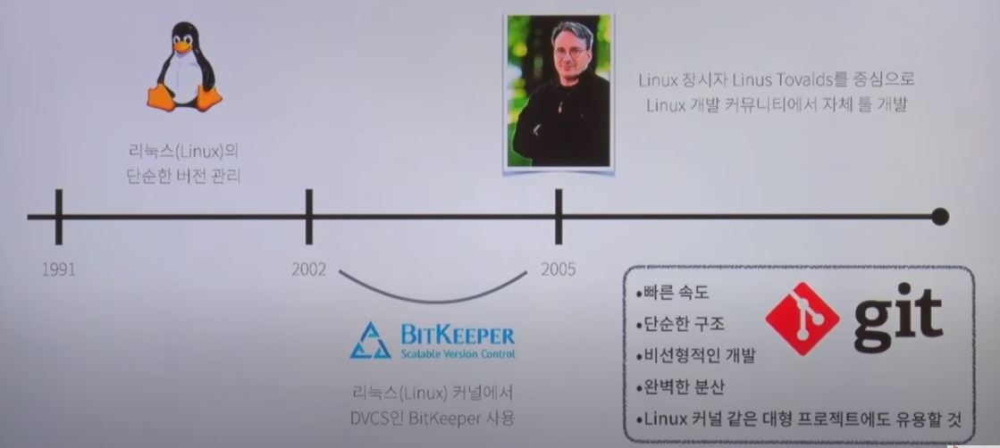
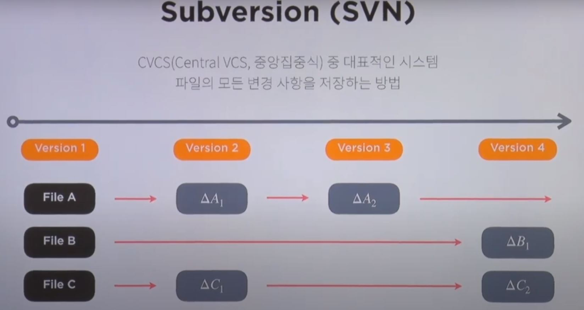
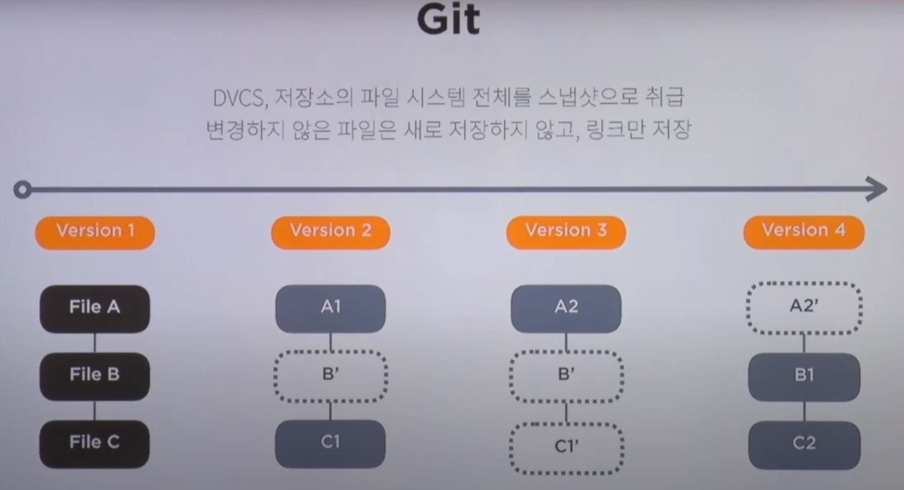

# Git의 발전 과정

## Git 탄생 배경

* Git은 분산형 버전 관리 시스템 (DVCS, Distributed Version Control System)
* 처음엔 리눅스 오픈 커뮤니티에서 BitKeeper(회사)의 DVCS를 사용했으나, 이익을 추구하는 기업과 오픈 커뮤니티와의 상충이 발생
* 리눅스 창시자 Linus Tovalds를 중심으로 2005년 리눅스 오픈 커뮤니티에서 자체 툴로서 제작

​    

## 버전 관리 시스템 (VCS, Version Control System)

* 파일의 변경 사항을 저장하고, 원하는 시점의 버전을 다시 꺼내올 수 있는 시스템

​    

## CVCS(중앙집중식 VCS) VS DVCS(분산형 VCS)

* 중앙집중식 버전 관리 시스템 (CVCS, Central Version Control System)
  * 하나의 중앙 서버를 두고, 해당 서버에서 버전을 관리
  * 최신 버전으로 업그레이드하기 위해, 최상단의 버전을 다운받고 수정해 업데이트하는 방식
  * 메인 서버에 접속하지 않으면 로컬에서 개발 불가
  * 메인 서버가 폭파되면 큰일남
  * 효율적이지만, 여전히 협업의 불편함이 있음
* 분산형 버전 관리 시스템 (DVCS, Distributed Version Control System)
  * 메인 서버와 개발자들의 컴퓨터 각각에 모든 코드와 파일 변경 정보들이 분산되어 버전을 관리
  * 메인 서버에 파일들이 어떻게 수정되었고, 누가 변경했는지 등의 정보가 저장됨
  * 로컬에서 버전 관리하고 메인 서버에 올릴 수 있음
  * 메인 서버가 폭파되어도 버전들 생존 가능
  * 보다 효율적인 협업 가능

​    

## Subversion (SVN) - CVCS

* CVCS의 대표적인 시스템 중 하나
* 파일의 모든 변경 사항을 저장
* 초기에 File A, B, C를 각각 만든다면, 각각의 파일마다 변경 사항 델타를 따로 저장
* 특정 버전을 다운 받을 때, 초깃값에서 해당 버전까지의 델타들을 합한 값인 파일을 다운받아 관리

​    

## Git - DVCS

* 특정 버전에 해당하는 모든 정보와 파일들을 스냅샷으로 찍어 관리
* 버전이 수정된 파일은 수정본을 올리고, 수정되지 않은 파일은 해당 파일이 존재하는 버전으로 연결되는 링크를 저장
* 최신 버전의 스냅샷만 유지하고 이전 버전은 델타로 관리

​    

## Reference

[티아카데미 Git & GitHub page 블로그 만들기](https://www.youtube.com/watch?v=YQat_D1C-ps&list=PL9mhQYIlKEhd9wCaqfXwxBT-zqgA6adlb&index=3&t=11s&ab_channel=SKplanetTacademy)

