## 자바 컬렉션 프레임 워크
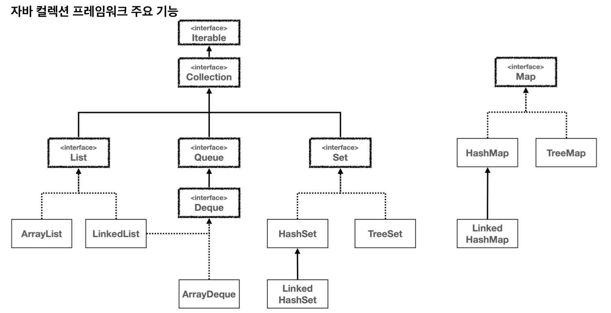
- 자바는 컬렉션 프레임워크를 통해 **다양한 자료구조**를 **인터페이스, 구현, 알고리즘**으로 지원
- 데이터 컬렉션을 **효율적으로 저장하고 처리**하기 위한 **통합 아키텍처** 제공 (컬렉션 = 자료를 모아둔 것)
- **핵심 인터페이스**
	- `Collection`
		- **단일 루트 인터페이스**로 모든 컬렉션 클래스가 상속 받음
		- 필요성
			- **가장 기본적인 인터페이스**로 다양한 컬렉션 타입이 공통적으로 따라야하는 **기본 규약** 정의
			- 이같은 설계는 **일관성**, **재사용성**, **확장성** 향상시키고 **다형성** 이점 제공
		- 주요 메서드
			- `add(E e)` : 컬렉션에 요소를 추가
			- `remove(Object o)` : 주어진 객체를 컬렉션에서 제거
			- `size()` : 컬렉션에 포함된 요소의 수를 반환
			- `isEmpty()` : 컬렉션이 비어 있는지 확인
			- `contains(Object o)` : 컬렉션이 특정 요소를 포함하고 있는지 확인
			- `iterator()` : 컬렉션의 요소에 접근하기 위한 반복자를 반환
			- `clear()` : 컬렉션의 모든 요소를 제거
	- `List`
		- **순서**가 있는 컬렉션
		- **중복 O**
		- **인덱스** 통한 요소 **접근 O**
		- 구현
			- **`ArrayList`**(주로 사용): 내부적으로 **배열** 사용
			- `LinkedList`: 내부적으로 **연결 리스트** 사용
	- `Set`
		- **중복을 허용하지 않는** 컬렉션
		- **인덱스** 통한 요소 **접근 X**
		- 구현
			- **`HashSet`**(주로 사용): 내부적으로 **해시 테이블** 사용
			- `LinkedHashSet`: 내부적으로 **해시 테이블**과 **연결리스트** 사용
			- `TreeSet`: 내부적으로 **레드-블랙 트리** 사용
	- `Queue`
		- **요소 처리 전 보관**하는 컬렉션
		- 구현
			- **`ArrayDeque`**(주로 사용): 내부적으로 **배열 기반 원형 큐** 사용 (대부분의 경우 **빠름**)
			- `LinkedList`: 내부적으로 **연결리스트** 사용
			- `PriorityQueue`
	- `Map` (**`Collection` 상속 X**)
		- **키와 값 쌍**으로 요소를 **저장**하는 객체
		- 구현
			- **`HashMap`**(주로 사용): 내부적으로 **해시 테이블** 사용
			- `LinkedHashMap`: 내부적으로 **해시 테이블**과 **연결리스트** 사용
			- `TreeMap`: 내부적으로 **레드-블랙 트리** 사용
- **알고리즘**
	- 컬렉션 프레임워크는 데이터 처리 및 조작 알고리즘 제공 (**정렬, 검색, 순환, 변환** 등)
	- 제공 방법
		- 자료구조 **자체적으로 기능** 제공
		- **`Collections`** 와 **`Arrays`** 클래스에 **정적 메서드 형태**로 구현
- **실무 선택 전략**
	- **순서가 중요 O**, **중복 허용 O** 경우: **`List`** 인터페이스를 사용
		- **`ArrayList`** 선택 (**주로 사용**)
		- 추가/삭제 작업이 앞쪽에서 빈번하다면 `LinkedList` (성능상 더 좋은 선택)
	- **중복 허용 X** 경우: **`Set`** 인터페이스 사용
		- 순서가 중요하지 않다면 **`HashSet`** (**주로 사용**)
		- 순서를 유지해야 하면 `LinkedHashSet`
		- 정렬된 순서가 필요하면 `TreeSet`
	- **요소를 키-값 쌍으로 저장**하려는 경우: **`Map`** 인터페이스를 사용
		- 순서가 중요하지 않다면 **`HashMap`** (**주로 사용**)
		- 순서를 유지해야 한다면 `LinkedHashMap`
		- 정렬된 순서가 필요하면 `TreeMap`
	- **요소를 처리하기 전에 보관**해야 하는 경우: **`Queue`** , **`Deque`** 인터페이스를 사용
		- **`ArrayDeque`** 선택 (**주로 사용**, 스택/큐 구조 모두에서 **가장 빠름**)
		- 우선순위에 따라 요소를 처리해야 한다면 `PriorityQueue`
## 배열 (Array)
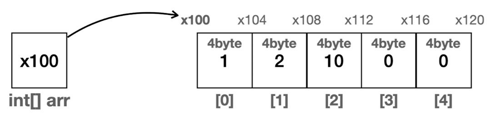
- **순서**가 있고 **중복을 허용**하면서 **크기가 정적으로 고정**된 자료구조
- 가장 **기본**적인 자료구조
- 특징
	- 데이터가 **메모리 상에 순서대로 붙어서 존재**
	- **검색**은 배열의 데이터를 **하나하나 확인**해야해서 **한번에 찾을 수 없음**
- 장점
	- **인덱스** 사용 시 **최고의 효율**
		- 데이터가 아무리 많아도 인덱스는 **한번의 계산**으로 **빠르게 자료 위치 찾음**
		- 공식: **`배열의 시작 참조 + (자료의 크기 * 인덱스 위치)`**
			- `arr[0]: x100 + (4byte * 0): x100`
			- `arr[1]: x100 + (4byte * 1): x104`
			- `arr[2]: x100 + (4byte * 2): x108`
- 단점
	- **배열의 크기**가 생성하는 시점에 **정적**으로 정해짐
		- 처음부터 많이 확보하면 **메모리 낭비**
	- **데이터 추가**가 **불편**
		- **기존 데이터**가 오른쪽으로 한 칸씩 **이동**해야 함
- 시간 복잡도
	- 데이터 추가
		- 앞, 중간에 추가: O(N)
		- **마지막**에 추가: **O(1)**
	- 데이터 삭제
		- 앞, 중간에 삭제: O(N)
		- **마지막**에 삭제: **O(1)**
	- 인덱스 조회, 입력, 변경: **O(1)**
	- 데이터 검색: O(N)
## 리스트 (List)
- **순서**가 있고 **중복을 허용**하면서 **크기가 동적**으로 변하는 자료구조
- 주요 메서드
	- **`add(E e)`**: 리스트의 끝에 지정된 요소 추가
	- `add(int index, E element)`: 리스트의 지정된 위치에 요소를 삽입
	- **`addAll(Collection<? extends E> c)`**: 지정된 컬렉션의 모든 요소를 리스트의 끝에 추가
	- `addAll(int index, Collection<? extends E> c)`: 지정된 컬렉션의 모든 요소를 리스트의 지정된 위치에 추가
	- **`get(int index)`**: 리스트에서 지정된 위치의 요소를 반환
	- **`set(int index, E element)`**: 지정한 위치의 요소를 변경하고, 이전 요소를 반환
	- `remove(int index)`: 리스트에서 지정된 위치의 요소를 제거하고 그 요소를 반환
	- `remove(Object o)`: 리스트에서 지정된 첫 번째 요소를 제거
	- `clear()`: 리스트에서 모든 요소를 제거
	- `indexOf(Object o)`: 리스트에서 지정된 요소의 첫 번째 인덱스를 반환
	- `lastIndexOf(Object o)`: 리스트에서 지정된 요소의 마지막 인덱스를 반환
	- **`contains(Object o)`**: 리스트가 지정된 요소를 포함하고 있는지 여부를 반환
	- **`sort(Comparator<? super E> c)`**: 리스트의 요소를 지정된 비교자에 따라 정렬
	- `subList(int fromIndex, int toIndex)`: 리스트의 일부분의 뷰를 반환
	- **`size()`**: 리스트의 요소 수를 반환
	- **`isEmpty()`**: 리스트가 비어있는지 여부를 반환
	- `iterator()`: 리스트의 요소에 대한 반복자를 반환
	- **`toArray()`**: 리스트의 모든 요소를 배열로 반환
	- `toArray(T[] a)`: 리스트의 모든 요소를 지정된 배열로 반환
- 실무 선택 전략
	- **배열 리스트**를 **실무 기본 사용** (대부분의 경우 **성능상 유리**)
	- **앞쪽**에서 **데이터 추가/삭제가 빈번하다**면 연결 리스트 사용 고려
		- **몇 천, 몇 만, 몇 십만 건** 수준에서 **유의미**
		- 몇 십, 몇 백 건 정도면 배열 리스트 사용
	- 배열 리스트와 연결 리스트 **실제 성능 비교** - **대부분 배열 리스트 유리**
		- 직접 구현한 구현체 비교
			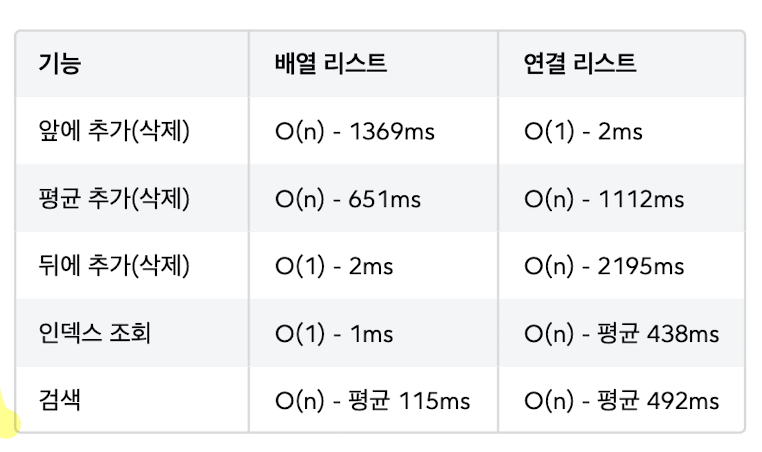
		- 자바 구현체 비교
			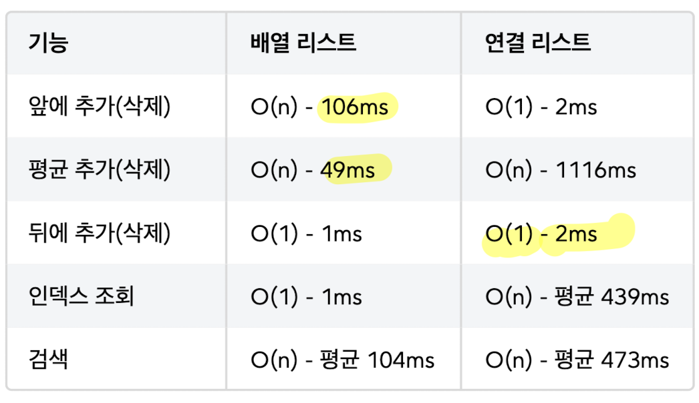
		- 평균 추가는 **이론적으로 연결 리스트**가 빠를 수 있으나 **실제로는 배열 리스트**가 **빠를 때가 많음**
			- **실제 성능**은 **현대 컴퓨터 시스템 환경의 다양한 요소에 의해 영향** 받음
				- e.g. 요소의 순차적 접근 속도, 메모리 할당 및 해제 비용, CPU 캐시 활용도 등
			- 배열 리스트는 **CPU 캐시 효율**과 **메모리 접근 속도** 좋음
				- **요소들이 메모리에 연속적으로 위치**
				- 위치가 연속적이면 **다음 데이터**를 **메모리에 미리** 올릴 수 있음
				- `CAPACITY` 초과에 따른 배열 복사 과정은 드물기 때문에 성능 영향 X
			- **이론과 실무는 차이**가 있음!
		- **자바의 배열 리스트**는 **앞, 중간 쪽 데이터 추가**가 훨씬 빠르게 **최적화**됨 (**메모리 고속 복사**)
		- **자바의 연결 리스트**는 **뒤 쪽**에 **데이터 추가**하는 속도가 **빠름** (**이중 연결 리스트**)
- 예시 구현
	```java
	public interface MyList<E> {
	     
	     int size();
	     
	     void add(E e);
	     
	     void add(int index, E e);
	     
	     E get(int index);
	     
	     E set(int index, E element);
	     
	     E remove(int index);
		 
		 int indexOf(E o);
		 
	}
	```
### 배열 리스트 (ArrayList)
- 데이터를 내부의 **배열**에 보관하는 리스트 구현체
- 특징
	- **데이터 추가**시 **배열의 크기를 초과**할 때마다 **더 큰 크기의 배열**을 새로 **생성**해 **값 복사** 후 사용
		- 복사 전 기존 배열은 GC 대상
		- **보통 50% 증가** 사용
			- 추가할 때마다 만들면 **배열 복사 연산이 너무 많음**
			- 배열의 크기를 너무 크게 증가하면 **메모리 낭비 발생**
	- 추가/삭제 시 **인덱스로 위치 조회**는 **빠르**지만 **추가/삭제 작업 자체**는 **느림**
		- 인덱스로 위치 찾기: **O(1)**
		- 추가/삭제 작업: O(N) - **데이터 이동** 때문에
- **자바** 배열 리스트 특징
	- 기본 `CAPACITY` 는 10이고 넘어가면 50%씩 증가
	- **메모리 고속 복사** 사용해 최적화 (`System.arraycopy()`)
		- **시스템 레벨**에서 최적화된 메모리 고속 복사 연산을 사용
		- **배열 요소 이동**을 루프가 아니라 **시스템 레벨에서 한 번에 빠르게 복사** (수 배 이상 빠름)
		- 데이터가 많으면 고속 복사도 소용 없음
- 장점
	- **조회**가 **빠름**
	- **끝** 부분에 데이터 **추가 및 삭제** 작업 **빠름**
- 단점
	- **앞, 중간** 부분 데이터 **추가 및 삭제** 작업 **느림** (**데이터 이동**으로 인한 **성능 저하**)
	- 배열 뒷 부분에 **낭비되는 메모리**가 존재
- 시간 복잡도
	- 데이터 추가: O(N)
		- 앞, 중간에 추가: O(N)
		- **마지막**에 추가: **O(1)**
	- 데이터 삭제: O(N)
		- 앞, 중간에 삭제: O(N)
		- **마지막**에 삭제: **O(1)**
	- 인덱스 **조회**: **O(1)**
	- 데이터 검색: O(N)
- 예시 구현
	```java
	public class MyArrayList<E> implements MyList<E> {
	    
	    private static final int DEFAULT_CAPACITY = 5;
	    private Object[] elementData;
	    private int size = 0;
	    
	    public MyArrayList() {
	        elementData = new Object[DEFAULT_CAPACITY];
		}
	    
	    public MyArrayList(int initialCapacity) {
	        elementData = new Object[initialCapacity];
		}
		
	    @Override
	    public int size() {
	        return size;
		}
		
	    @Override
	    public void add(E e) {
	        if (size == elementData.length) {
				grow(); 
			}
	        elementData[size] = e;
			size++; 
		}
		
	    @Override
	    public void add(int index, E e) {
	        if (size == elementData.length) {
				grow();
			}
	        shiftRightFrom(index);
	        elementData[index] = e;
	        size++;
		}
		
		//요소의 마지막부터 index까지 오른쪽으로 밀기 
		private void shiftRightFrom(int index) { 
			for (int i = size; i > index; i--) {
				elementData[i] = elementData[i - 1];
			}
		}
		
		@Override
		@SuppressWarnings("unchecked")
		public E get(int index) {
		    return (E) elementData[index];
		}
		
		@Override
		public E set(int index, E element) {
		    E oldValue = get(index);
		    elementData[index] = element;
		    return oldValue;
		}
		
		@Override
		public E remove(int index) {
		    E oldValue = get(index);
		    shiftLeftFrom(index);
		    size--;
		    elementData[size] = null;
		    return oldValue;
		}
		
		//요소의 index부터 마지막까지 왼쪽으로 밀기 
		private void shiftLeftFrom(int index) {
		    for (int i = index; i < size - 1; i++) {
		        elementData[i] = elementData[i + 1];
			}
		}
	
		@Override
		public int indexOf(E o) {
		    for (int i = 0; i < size; i++) {
		        if (o.equals(elementData[i])) {
		            return i;
				}
			}
			return -1;
		}
		
		private void grow() {
		    int oldCapacity = elementData.length;
		    int newCapacity = oldCapacity * 2;
		    elementData = Arrays.copyOf(elementData, newCapacity);
	    }
	    
	    @Override
	    public String toString() {
	        return Arrays.toString(Arrays.copyOf(elementData, size)) + " size=" +
	size + ", capacity=" + elementData.length;
		}
	
	}
	```
### 연결 리스트 (LinkedList)
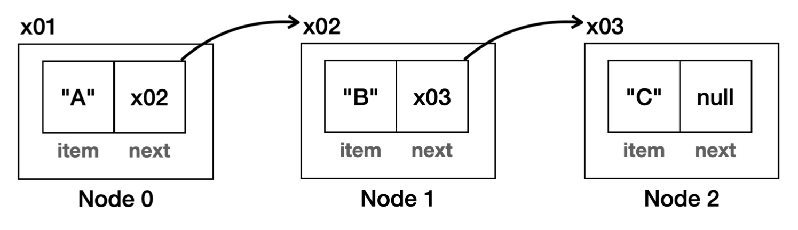
- 노드를 만들어 **각 노드끼리 서로 연결**하는 리스트 구현체
- 특징
	- 노드와 링크로 구성
	- 추가/삭제 시 **인덱스로 위치 조회**는 **느리**지만 **추가/삭제 작업 자체**는 **빠름**
		- 인덱스로 위치 찾기: O(N) - 데이터 **탐색** 때문
		- 추가/삭제 작업: **O(1)** - 필요한 노드끼리 **참조만 변경**하면 끝
- **자바** 연결 리스트 특징
	```java
	class Node {
	    E item;
		Node next;
		Node prev;
	}
	
	class LinkedList {
		Node first; //첫 번째 노드 참조 
		Node last; //마지막 노드 참조 
		int size;
	}
	```
	- **이중 연결 리스트** 구조 & **첫 번째 노드**와 **마지막 노드** 둘 다 **참조**
		- 데이터를 **끝**에 추가하는 경우도 **O(1)**
		- **역방향 조회** 가능 -> **인덱스 조회 성능** 최적화 (`size` 절반을 기준으로 조회 시작 위치 최적화)
- 장점
	- **앞** 부분 데이터 **추가 및 삭제** 작업 **빠름**
	- **필요한만큼만 동적으로** 노드를 **생성 및 연결**하므로 **메모리 낭비 X**
		- 다만 크게 봤을 때 **배열에 비해 메모리가 엄청 절약 X** (연결 유지 위한 추가 메모리 사용, `next`)
- 단점
	- **중간, 끝** 부분 데이터 **추가 및 삭제** 작업 **느림**
- 시간 복잡도
	- 데이터 추가: O(N)
		- **앞**에 추가: **O(1)**
		- 중간, 마지막에 추가: O(N)
	- 데이터 삭제: O(N)
		- **앞**에 삭제: **O(1)**
		- 중간, 마지막에 삭제: O(N)
	- 인덱스 조회: O(N)
	- 데이터 검색: O(N)
- 예시 구현
	```java
	public class MyLinkedList<E> implements MyList<E> {
	     
	     private Node<E> first;
	     private int size = 0;
	     
	     @Override
	     public void add(E e) {
	        Node<E> newNode = new Node<>(e);
	        if (first == null) {
	            first = newNode;
	        } else {
		        Node<E> lastNode = getLastNode();
		        lastNode.next = newNode;
		    }
			size++;
		}
		
		private Node<E> getLastNode() {
		    Node<E> x = first;
		    while (x.next != null) {
				x = x.next;
			}
			return x;
		}
		
		@Override
		public void add(int index, E e) {
		    Node<E> newNode = new Node<>(e);
		    if (index == 0) {
		        newNode.next = first;
		        first = newNode;
		    } else {
		        Node<E> prev = getNode(index - 1);
		        newNode.next = prev.next;
		        prev.next = newNode;
			}
			size++;
		}
		
		@Override
		public E set(int index, E element) {
		    Node<E> x = getNode(index);
		    E oldValue = x.item;
		    x.item = element;
		    return oldValue;
		}
		
		@Override
		public E remove(int index) {
		    Node<E> removeNode = getNode(index);
		    E removedItem = removeNode.item;
		    if (index == 0) {
		        first = removeNode.next;
		    } else {
		        Node<E> prev = getNode(index - 1);
		        prev.next = removeNode.next;
		    }
		    removeNode.item = null;
		    removeNode.next = null;
		    size--;
		    return removedItem;
		}
		
		@Override
		public E get(int index) {
		    Node<E> node = getNode(index);
		    return node.item;
		}
		
		private Node<E> getNode(int index) {
		    Node<E> x = first;
		    for (int i = 0; i < index; i++) {
				x = x.next;
			}
			return x;
		}
		
		@Override
		public int indexOf(E o) {
		    int index = 0;
		    for (Node<E> x = first; x != null; x = x.next) {
		        if (o.equals(x.item))
		            return index;
		        index++;
			}
			return -1;
		}
		
		@Override
		public int size() {
		    return size;
		}
		
		@Override
		public String toString() {
		    return "MyLinkedList{" +
		            "first=" + first +
		            ", size=" + size +
					'}';
		}
		
		private static class Node<E> {
		    E item;
		    Node<E> next;
	        
	        public Node(E item) {
	            this.item = item;
			}
			
	        @Override // 가독성 위해 직접 구현 e.g. [A->B->C]
	        public String toString() {
	            StringBuilder sb = new StringBuilder();
	            Node<E> temp = this;
	            sb.append("[");
	            while (temp != null) {
	                sb.append(temp.item);
	                if (temp.next != null) {
	                    sb.append("->");
	                }
	                temp = temp.next;
	            }
	            sb.append("]");
	            return sb.toString();
	        }
		}
	
	}
	```

>**자료구조**와 **제네릭**
>
>일반적으로 **하나의 자료구조**에는 **같은 데이터 타입을 보관하고 관리**한다. 숫자와 문자처럼 관계 없는 여러 데이터 타입을 섞어 보관하는 일은 거의 없다.
>따라서, 자료구조에 **제네릭을 사용**하면 **타입 안정성**이 높은 자료구조를 만들 수 있어 **매우 어울린다**.
>
>만약 배열을 사용하는 경우, 제네릭을 적용해도 **내부 배열의 타입**은 **`Object[] elementData`을 사용**할 것이다. 문제는 생성자 코드에서 배열을 생성할 때이다.
>
>`new E[DEFAULT_CAPACITY]`
>
>제네릭은 타입 매개변수에 의한 `new`를 허용하지 않는다. 또한, 런타임에 타입 정보가 필요한 생성자에서 타입 매개변수를 사용할 수 없다. 이런 **제네릭의 한계**로 인해 **`Object[]` 타입 배열**을 적용하고 **생성자**에서 다음 코드를 사용해야 한다.
>
>**`new Object[DEFAULT_CAPACITY]`**
>
>`Object[]` 타입 적용은 결국 **자료구조 내부에서 다운캐스팅을 사용**하게되는데, **큰 문제는 없다**.
>`Object` 자체는 모든 데이터를 담을 수 있어 신경쓸게 없으니, **조회하는 부분에 초점**을 맞춰보자.
>자료를 입력하는 **`add(E e)` 메서드**에서 **E 타입만 보관**하는 덕분에, **`get()` 메서드**에서 데이터를 조회 후 **`(E)`로 다운캐스팅**해 반환해도 **전혀 문제가 없다.**

>이중 연결 리스트
>
>노드 앞뒤로 연결하는 이중 연결 리스트는 **성능을 더 개선**할 수 있다.
>특히, **자바가 제공하는 연결 리스트**도 **이중 연결 리스트**다. **마지막 노드를 참조하는 변수**를 가지고 있어서, **뒤**에 **추가하거나 삭제**하는 경우에도 **O(1)** 성능을 제공한다.

>재사용성 높이기
>
>프로그래밍 세계에서는 **결정을 나중으로 미루면 재사용성이 높아진다**.
>e.g. 함수 매개변수, 제네릭 타입, 추상화 의존 & 구체적 구현 미루기

>이론과 실무의 차이
>
>자료구조를 배울 때 변경 작업이 많으면 `LinkedList`를 사용하라고 배우지만, **실제로는 `ArrayList`가 훨씬 빠르다.** 이론과 실무의 차이를 유의해야 한다.

## 해시 알고리즘 (Hash)
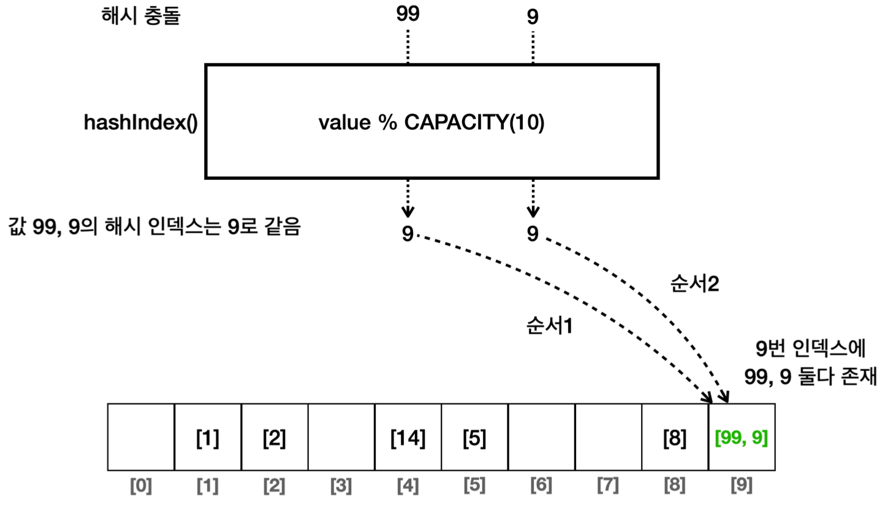
- 주의점: **해시 자료구조** 사용 시, 직접정의 객체는 **`hashCode()`와 `equals()` 반드시 재정의해야 함** (IDE)
	- **동등성을 확보**해야 함
		- `hashCode()`: 참조 값 기반이 아닌 **내부 값 기반**으로 **해시 코드** 생성
		- `equals()`: **`contains()`** 메서드 실행 시 버킷 내 각각의 **값 비교**할 때 필요
	- 직접 오버라이딩 하지 않을 시, `Object` 기본 동일성 비교 구현 실행되어서 문제
		- `hashCode()` 구현 X, `equals()` 구현 X 경우
			- 참조값 기반으로 해시코드가 생성되어 실행 때마다 값이 다름
			- 논리적으로 같은 데이터가 다른 메모리 위치에 중복 저장
			- 다른 위치에서 데이터 조회해 검색 실패
		- `hashCode()` 구현 O, `equals()` 구현 X 경우
			- 같은 해시코드가 생성되어 같은 해시 인덱스 메모리 위치에 저장
			- `equals()`가 동일성 비교 수행해, 논리적으로 같은 데이터 중복 저장
			- 해시 인덱스는 정확히 찾으나, 동일성 비교로 인해 검색 실패
		- `hashCode()` 구현 O, `equals()` 구현 O 경우
			- 논리적으로 같은 데이터는 중복 저장 X
			- 해시 인덱스도 정확히 찾고, 동등성 비교로 검색도 성공
- 기본 아이디어
	- **나머지 연산**을 사용해 **데이터 값 자체를 배열의 인덱스로 사용**하자
	- **배열의 크기만 적절히 확보**하면 **데이터가 고루 분산**
		- 입력 데이터 수와 비교해 **배열의 크기가 클수록 충돌 확률은 낮아짐**
		- 통계적으로 입력 데이터 수가 **배열 크기의 75%를 넘지 않으면** 해시 충돌이 **자주 발생 X**
- 결과: **데이터 검색 성능 비약적 향상**
	- 기존 순차 데이터 검색: O(N)
	- 해시 알고리즘: 해시 충돌이 적도록 제어하면 **대부분 O(1)**
- 해결 과정
	- 1단계: **배열 인덱스** 사용
		- **데이터 검색 성능**이 O(N) 문제 -> **O(1)** 개선
	- 2단계: **해시 인덱스**를 배열의 인덱스로 사용 (feat. **나머지 연산**)
		- 입력 값 범위가 크면 그만큼 **큰 배열을 사용**해서 **메모리가 낭비되는 문제 해결**
			- 참고로 `int` 범위 만큼의 큰 배열은 약 17기가 바이트 소모
		- 해시 인덱스: **배열의 인덱스로 사용**할 수 있도록 **원래 값을 계산한 인덱스**
			- e.g. `CAPACITY=10`일 때, 14의 해시 인덱스는 4, 99의 해시 인덱스는 9
		- 해시 인덱스 생성 **O(1)** + 해시 인덱스를 사용해 배열에서 값 조회 **O(1)** => **O(1)**
	- 3단계: **해시 충돌 가능성을 인정**하고 **배열 내 배열 혹은 배열 내 리스트**를 **이중 사용**해 실제 값 보관
		- **최악의 경우 O(N)이지만** 확률적으로 어느정도 넓게 퍼지므로 **대부분 O(1)** 성능일 것
			- e.g. 9, 19, 29, 99
			- **해시 충돌**이 일어나면 **해당 인덱스의 배열**에서 **모든 값을 비교해 검색** - O(N)
			- 해시 충돌 가끔 발생해도 **내부에서 값 몇 번만 비교하는 수준**이므로 **대부분 매우 빠른 조회**
		- 해시 충돌: **다른 값을 입력**했지만 **같은 해시 코드**가 나오는 것
		- e.g. `CAPACITY=10`일 때, 9와 99의 해시 인덱스는 모두 9로 겹침
- 예시 코드
	```java
	public class HashStart {
	    
	    static final int CAPACITY = 10;
	    
	    public static void main(String[] args) {
	        //{1, 2, 5, 8, 14, 99 ,9}
	        LinkedList<Integer>[] buckets = new LinkedList[CAPACITY];
	        for (int i = 0; i < CAPACITY; i++) {
	            buckets[i] = new LinkedList<>();
	        }
			add(buckets, 1);
			...
			add(buckets, 99);
			add(buckets, 9); //중복
			//검색
			int searchValue = 9;
			boolean contains = contains(buckets, searchValue); // true
		}
	    
	    private static void add(LinkedList<Integer>[] buckets, int value) {
	        int hashIndex = hashIndex(value);
	        LinkedList<Integer> bucket = buckets[hashIndex]; // O(1)
	        if (!bucket.contains(value)) { // O(n)
	            bucket.add(value);
	        }
		}
		
	    private static boolean contains(LinkedList<Integer>[] buckets, int
	searchValue) {
	        int hashIndex = hashIndex(searchValue);
	        LinkedList<Integer> bucket = buckets[hashIndex]; // O(1)
	        return bucket.contains(searchValue); // O(n)
	    }
	    
	    static int hashIndex(int value) {
	        return value % CAPACITY;
		}
		
	}
	```
- 해시 용어
	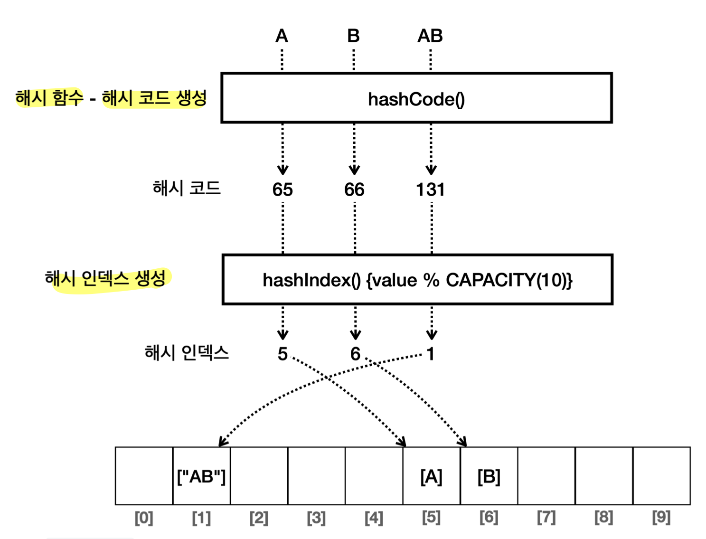
	- **해시 함수**
		- 임의의 길이의 데이터를 입력 받아 고정된 길이의 해시 값(해시 코드)을 출력하는 함수
			- 고정된 길이는 저장 공간의 크기를 의미 e.g. `int` 형 1, 100은 둘다 4byte
		- 같은 데이터를 입력하면 항상 같은 해시 코드 출력
		- 다른 데이터를 입력해도 같은 해시코드가 출력될 수 있음 (해시 충돌)
		- **해시 함수는 해시 코드가 최대한 충돌하지 않도록 설계해야 함**
			- 해시 충돌은 결과적으로 성능 하락
			- 좋은 해시 함수는 해시 코드를 균일하게 분산시키는 것 -> 해시 인덱스도 분산
			- **자바 해시 함수**는 **내부에 복잡한 연산**으로 다양한 범위의 해시 코드 생성 -> 성능 최적화
	- **해시 코드** (**해시 함수**를 통해 생성)
		- **데이터를 대표하는 값**
			- **모든 문자** 데이터는 **고유한 숫자로 표현** 가능 (**ASCII 코드**)
				- 컴퓨터는 문자를 이해하지 못해 **각 문자에 고유한 숫자**를 할당해 인식 및 저장 
					- `char` -> `int`형 **캐스팅**으로 확인 가능
						- `char charA = 'A';`
						- `(int) charA // 65`
				- **연속된 문자**는 각 문자의 고유 숫자 **합**으로 표현 가능 e.g. "AB" -> 65 + 66 = 131
					- 물론, 자바 해시 함수는 더 복잡한 연산 수행
		- **어떤 객체든 정수 해시 코드만 정의**하면 **해시 인덱스 사용 가능**
			- `Object.hashCode()`
				- 모든 객체가 자신만의 해시 코드를 표현할 수 있는 기능
				- 보통 **오버라이딩**해 **내부 값 기반으로 동등성 확보**하도록 사용 (**IDE 이용**)
					- 기본 구현: 객체의 참조값을 기반으로 해시 코드 생성
						- 인스턴스가 다르면 해시코드 다름
					- **자바 기본 클래스**는 **이미 재정의**해 둠
						- 값이 같으면 같은 해시 코드
						- `hashCode()` 결과는 음수가 나올 수 있는데 절대 값 사용
					- **새 객체 정의** 시 **직접 오버라이딩**
						- e.g. `Member` 객체 정의할 때 `id` 기반으로 해시 코드 생성
							```java
							@Override
							public int hashCode() {
								return Objects.hash(id);
							}
							```
	- **해시 인덱스**(**해시 코드**를 사용해 생성)
		- **데이터의 저장 위치**를 결정하는 값
		- 보통 **`해시 인덱스 = 해시 코드 % 배열의 크기`**
## 셋 (Set)
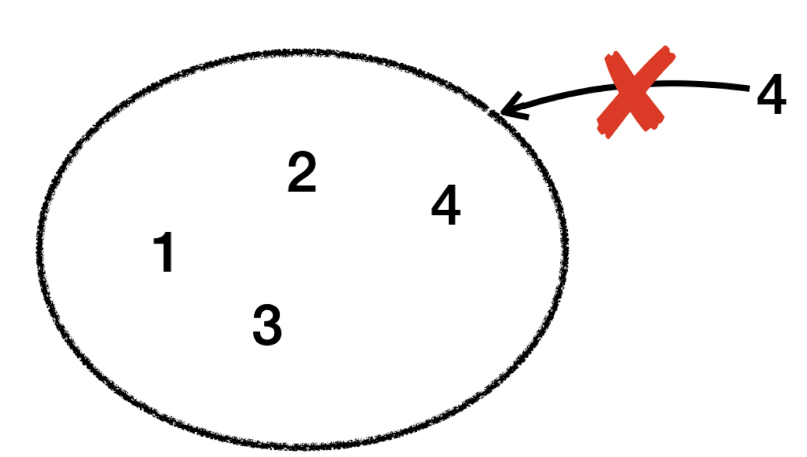
- **순서가 없고 중복을 허용하지 않는** 자료구조
- 특징
	- **요소의 유무**(=**중복 데이터 체크**)를 **빠르게 확인 가능** (`contains()`)
		- **해시 알고리즘**을 통해 데이터 검색 성능 향상
			- O(N) -> **O(1)**
		- **데이터 추가/삭제 시** 반드시 필요한 **중복 체크**에도 유용
			- 덕분에 검색, 추가, 삭제 모두 O(N) -> **O(1)** 개선
- 주요 메서드
	- **`add(E e)`**: 지정된 요소를 셋에 추가 (이미 존재하는 경우 추가하지 않음)
	- **`addAll(Collection<? extends E> c)`**: 지정된 컬렉션의 모든 요소를 셋에 추가
	- **`contains(Object o)`**: 셋이 지정된 요소를 포함하고 있는지 여부를 반환
	- `containsAll(Collection<?> c)`: 셋이 지정 컬렉션의 모든 요소를 포함하고 있는지 여부 반환
	- **`remove(Object o)`**: 지정된 요소를셋에서 제거
	- `removeAll(Collection<?> c)`: 지정된 컬렉션에 포함된 요소를 셋에서 모두 제거
	- `retainAll(Collection<?> c)`: 지정 컬렉션에 포함된 요소만 유지, 나머지 요소는 셋에서 제거
	- `clear()`: 셋에서 모든 요소를 제거
	- **`size()`**: 셋에 있는 요소의 수를 반환
	- **`isEmpty()`**: 셋이 비어 있는지 여부를 반환
	- `iterator()`: 셋의 요소에 대한 반복자를 반환
	- `toArray()`: 셋의 모든 요소를 배열로 반환
	- `toArray(T[] a)`: 셋의 모든 요소를 지정된 배열로 반환
- 실무 선택 전략
	- **`HashSet` 권장**
	- 입력 순서 유지, 값 정렬의 필요에 따라서 `LinkedHashSet`, `TreeSet` 고려
- 코드 예시 - 합집합, 교집합, 차집합
	```java
	public class SetOperationsTest {
	    public static void main(String[] args) {
	        Set<Integer> set1 = new HashSet<>(List.of(1, 2, 3, 4, 5));
	        Set<Integer> set2 = new HashSet<>(List.of(3, 4, 5, 6, 7));
	        
	        Set<Integer> union = new HashSet<>(set1);
	        union.addAll(set2);
	        
	        Set<Integer> intersection = new HashSet<>(set1);
	        intersection.retainAll(set2);
	        
	        Set<Integer> difference = new HashSet<>(set1);
	        difference.removeAll(set2);
			
			System.out.println("합집합: " + union); 
			System.out.println("교집합: " + intersection); 
			System.out.println("차집합: " + difference);
		}
	}
	```
### HashSet
- 배열에 **해시 알고리즘**을 적용해 구현
- 요소의 **순서 보장 X**
- **자바** `HashSet` 특징
	- **재해싱** (**rehashing**) 최적화
		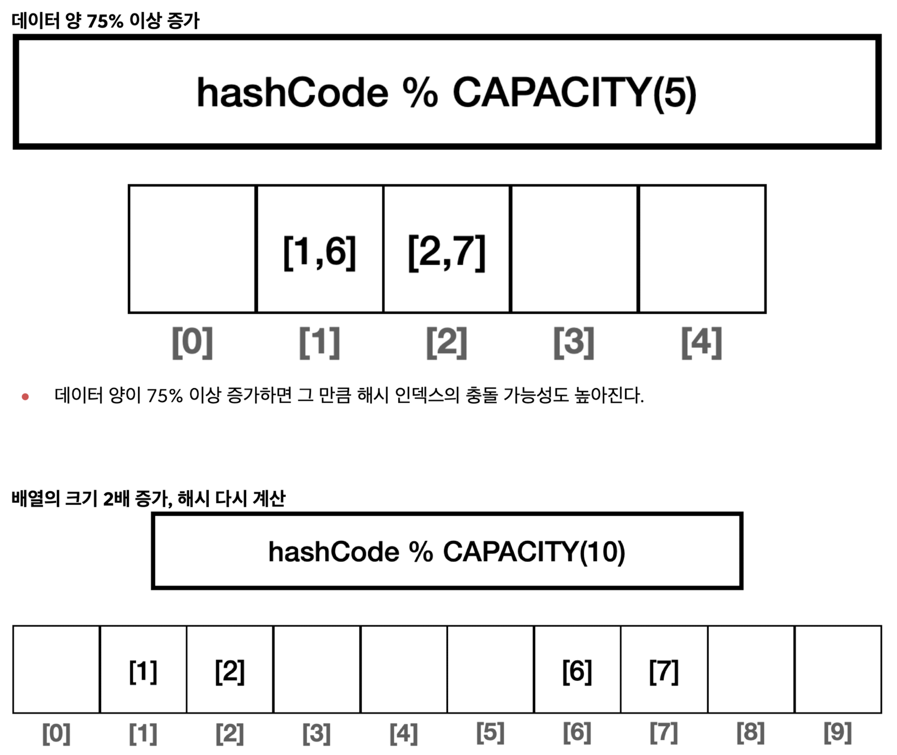
		- **배열 크기의 75%를 넘어**가면 **배열 크기를 2배**로 늘리고 **모든 요소에 해시 인덱스를 다시 적용**
		- 재적용 시간은 걸리지만, **해시 충돌을 줄이고 O(N) 성능 문제를 예방**
	- **키만 저장**하는 특수한 형태의 **해시 테이블**
		- 해시 테이블: **해시**를 사용해서 **키와 값을 저장**하는 자료 구조 (`HashMap`)
		- **자바**는 **해시 테이블의 원리를 이용**하나 `Value`만 비워두고 사용 (**`HashMap` 구현 활용**)
- 시간 복잡도
	- 데이터 추가: **O(1)**
	- 데이터 삭제: **O(1)**
	- 데이터 검색: **O(1)**
- 예시 코드 (`HashSet`)
	```java
	public class MyHashSet<E> implements MySet<E> {
	    
	    static final int DEFAULT_INITIAL_CAPACITY = 16;
	    private LinkedList<E>[] buckets;
	    private int size = 0;
	    private int capacity = DEFAULT_INITIAL_CAPACITY;
	    
	    public MyHashSet() {
	        initBuckets();
		}
		
	    public MyHashSet(int capacity) {
	        this.capacity = capacity;
	        initBuckets();
		}
		
	    private void initBuckets() {
	        buckets = new LinkedList[capacity];
	        for (int i = 0; i < capacity; i++) {
	            buckets[i] = new LinkedList<>();
	        }
		}
		
	    @Override
	    public boolean add(E value) {
	        int hashIndex = hashIndex(value);
	        LinkedList<E> bucket = buckets[hashIndex];
	        if (bucket.contains(value)) {
	            return false;
	        }
	        
	        bucket.add(value);
	        size++;
	        return true;
		}
		
	    @Override
	    public boolean contains(E searchValue) {
		    int hashIndex = hashIndex(searchValue);
	        LinkedList<E> bucket = buckets[hashIndex];
	        return bucket.contains(searchValue);
		}
		
	    @Override
	    public boolean remove(E value) {
	        int hashIndex = hashIndex(value);
	        LinkedList<E> bucket = buckets[hashIndex];
	        boolean result = bucket.remove(value);
	        if (result) {
				size--;
	            return true;
	        } else {
	            return false;
	        }
		}
		
		private int hashIndex(Object value) {
			//hashCode의 결과로 음수가 나올 수 있다. abs()를 사용해서 마이너스를 제거한다. 
			return Math.abs(value.hashCode()) % capacity;
		}
		
	    public int getSize() {
	        return size;
		}
		
	    @Override
	    public String toString() {
	        return "MyHashSet{" +
	                "buckets=" + Arrays.toString(buckets) +
	                ", size=" + size +
	                ", capacity=" + capacity +
	                '}';
	    }
	    
	}
	```
### LinkedHashSet
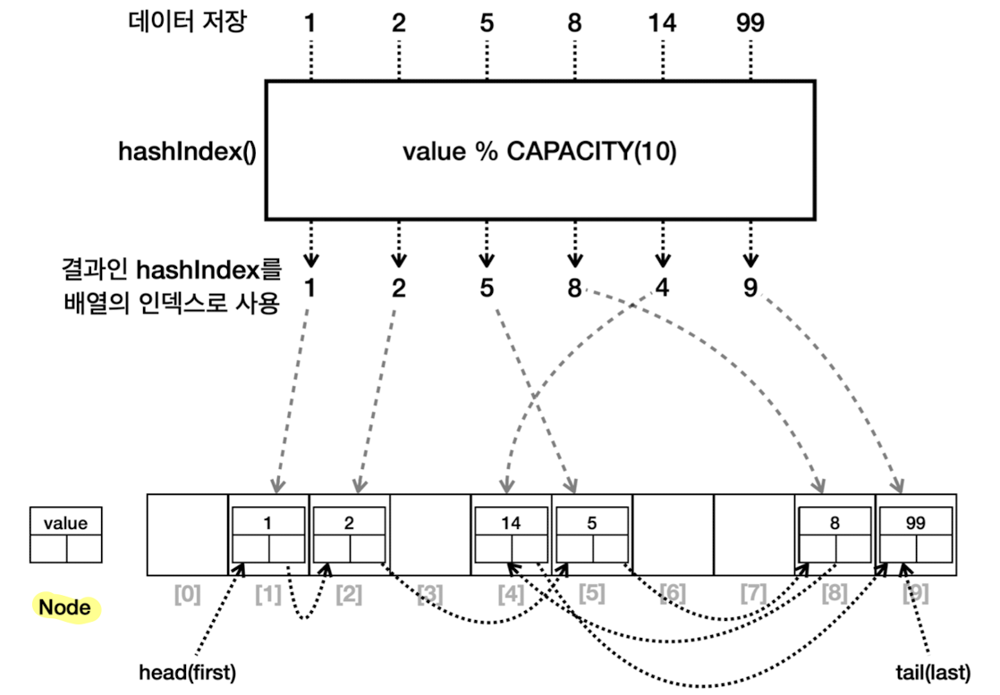
- **`HashSet`에 연결 리스트를 추가**해 구현
- 요소의 **입력된 순서 보장 O**
- 연결 링크 유지로 인해 `HashSet` 보다 **조금 더 무거움**
- 연결 링크는 데이터를 **입력한 순서대로 연결** (**양방향** 연결)
	- `first` 부터 따라가면 **입력 순서대로 데이터 순회 가능**
- 시간 복잡도
	- 데이터 추가: **O(1)**
	- 데이터 삭제: **O(1)**
	- 데이터 검색: **O(1)**
### TreeSet
- 이진 탐색 트리를 개선한 **레드-블랙 트리**를 내부에서 사용해 구현
	- 이진 트리: 자식이 2개까지 올 수 있는 트리
	- 이진 탐색 트리: 부모 노드의 값과 비교해 왼쪽 자식이 더 작은 값, 오른쪽 자식이 더 큰 값 가지는 트리
	- 이진 탐색 트리 개선
		- 이진 탐색 트리는 **데이터 균형이 맞지 않으면** 최악의 경우 **O(N)**
		- 해결 방안: **동적으로 균형 다시 맞추기**
			- 균형 맞추기 알고리즘 사용 (AVL 트리, 레드-블랙 트리)
			- **자바** `TreeSet`은 **레드-블랙 트리**를 사용해 **최악의 경우에도 O(log N)** 성능 제공
- **데이터 값**의 **순서 보장 O**
	- 데이터를 **값 기준 정렬된 순서로 저장** (값 기준은 `Comparator` 비교자 이용)
	- **중위 순회**를 통해 **데이터를 오름차순으로 순회** 가능
	- e.g. 3, 1, 2 입력해도 1, 2, 3 순서로 출력
- 시간 복잡도 - **`HashSet` 보다 느리지만** 데이터 검색 시 한 번의 계산에 절반을 날리는 특징
	- 데이터 추가: O(log N)
	- 데이터 삭제: O(log N)
	- 데이터 검색: O(log N)
## 맵(Map)
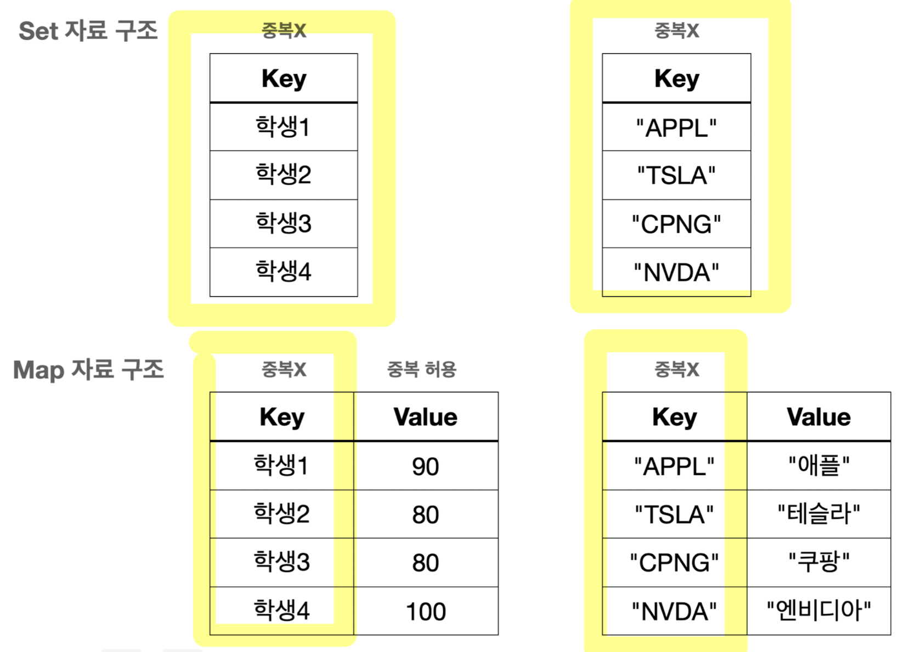
- **키-값 쌍을 저장**하는 자료구조
- 주의점
	- **`HashMap`, `LinkedHashMap`**: **`Key`로 쓰이는 객체**는 **`hashCode()`, `equals()` 반드시 구현**할 것
- 특징
	- **키는 중복 X**, **값은 중복 O**, **순서 유지 X**
	- `Collection` 상속 X
	- 내부에서 **`Entry`**(인터페이스)를 통해 키 값을 묶어 저장
	- 맵의 모든 것은 **`Key`를 중심으로 동작**하고 **`Key`는 `Set`과 같은 구조**
		- **`Map`과 `Set`은 거의 같음** (단순히 `Value`가 있는지 없는지 차이)
			- `Key` 옆에 `Value`만 단순히 추가해주면 `Map`
		- 따라서, **`Map`과 `Set`의 구현체도 거의 동일**
			- 실제로 **자바**는 **`HashSet` 구현에 `HashMap`의 구현을 가져다 씀**
			- `Map`에서 `Value`만 비워두면 `Set`으로 사용 가능
		- **키**를 통해 **빠르게 검색** 가능 - **O(1)**
- 주요 메서드
	- **`put(K key, V value)`**: 지정된 키와 값을 맵에 저장 (같은 키가 있으면 값을 변경)
	- **`putIfAbsent(K key, V value)`**: 지정된 키가 없는 경우에 키와 값을 맵에 저장
	- **`putAll(Map<? extends K,? extends V> m)`**: 지정된 맵의 모든 매핑을 현재 맵에 복사
	- **`get(Object key)`**: 지정된 키에 연결된 값을 반환
	- **`getOrDefault(Object key, V defaultValue)`**: 지정된 키에 연결된 값을 반환, 키가 없는 경우  `defaultValue` 로 지정한 값을 대신 반환
	- **`remove(Object key)`**: 지정된 키와 그에 연결된 값을 맵에서 제거
	- `clear()`: 맵에서 모든 키와 값을 제거
	- **`containsKey(Object key)`**: 맵이 지정된 키를 포함하고 있는지 여부를 반환 - **O(1)**
	- `containsValue(Object value)`: 맵에 값이 있는지 여부 반환 - O(N), 다 뒤져봐야 함
	- **`keySet()`**: 맵의 키들을 `Set` 형태로 반환 - **키가 중복을 허용하지 않으므로 `Set` 반환**
	- **`values()`**: 맵의 값들을 `Collection` 형태로 반환 - **`List`, `Set`이 애매하므로 단순히 값의 모음이라는 의미의 `Collection` 반환** (맵의 값들은 중복 O, 순서 보장 X)
	- **`entrySet()`**: 맵의 키-값 쌍을 `Set<Map.Entry<K,V>>` 형태로 환한다.
	- **`size()`**: 맵에 있는 키-값 쌍의 개수를 반환
	- **`isEmpty()`**: 맵이 비어 있는지 여부를 반환
- 실무 선택 전략
	- **`HashMap` 권장**
	- 순서 유지, 정렬의 필요에 따라서 `LinkedHashMap`, `TreeMap` 고려
- 코드 예시 - `keySet()`, `entrySet()`, `values()` 활용
	```java
	Map<String, Integer> studentMap = new HashMap<>();
	
	System.out.println("keySet 활용"); 
	Set<String> keySet = studentMap.keySet(); 
	for (String key : keySet) {
	    Integer value = studentMap.get(key);
	    System.out.println("key=" + key + ", value=" + value);
	}
	
	System.out.println("entrySet 활용");
	Set<Map.Entry<String, Integer>> entries = studentMap.entrySet(); 
	for (Map.Entry<String, Integer> entry : entries) {
	    String key = entry.getKey();
	    Integer value = entry.getValue();
	    System.out.println("key=" + key + ", value=" + value);
	}
	
	System.out.println("values 활용"); 
	Collection<Integer> values = studentMap.values(); 
	for (Integer value : values) {
	    System.out.println("value = " + value);
	}
	```
- 코드 예시 - 단어 수 세기
	```java
	public class WordFrequencyTest {
	    public static void main(String[] args) {
	        String text = "orange banana apple apple banana apple";
	        
	        Map<String, Integer> map = new HashMap<>();
	        
	        String[] words = text.split(" ");
	        
	        for (String word : words) {
	            map.put(word, map.getOrDefault(word, 0) + 1);
			}
	        System.out.println(map);
	    }
	}
	```
### HashMap
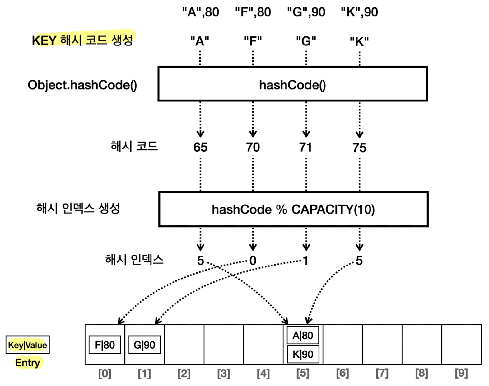
- **해시**를 사용해 **키와 값을 저장**하는 자료구조 (=**해시 테이블** =**딕셔너리**)
- **`HashSet`과 동작 원리 동일**
	- **`Key` 값**을 사용해 **해시 코드** 생성
	- 다만, **`Entry` 사용**해 `Key`, `Value` 묶어 저장
- **순서 보장 X**
- 시간 복잡도
	- 데이터 추가: **O(1)**
	- 데이터 삭제: **O(1)**
	- 데이터 검색: **O(1)**
### LinkedHashMap
- **`HashMap`에 연결 리스트를 추가**해 구현
- 요소의 **입력된 순서 보장 O** - **입력 순서대로 데이터 순회 가능**
- 연결 링크 유지로 인해 `HashMap` 보다 **조금 더 무거움**
- 시간 복잡도
	- 데이터 추가: **O(1)**
	- 데이터 삭제: **O(1)**
	- 데이터 검색: **O(1)**
### TreeMap
- **레드-블랙 트리**를 내부에서 사용해 구현
- **키 자체 데이터 값** 기준으로 **정렬된 순서 보장 O** (값 기준은 `Comparator` 비교자 이용)
- 시간 복잡도
	- 데이터 추가: O(log N)
	- 데이터 삭제: O(log N)
	- 데이터 검색: O(log N)
## Stack, Queue, Deque
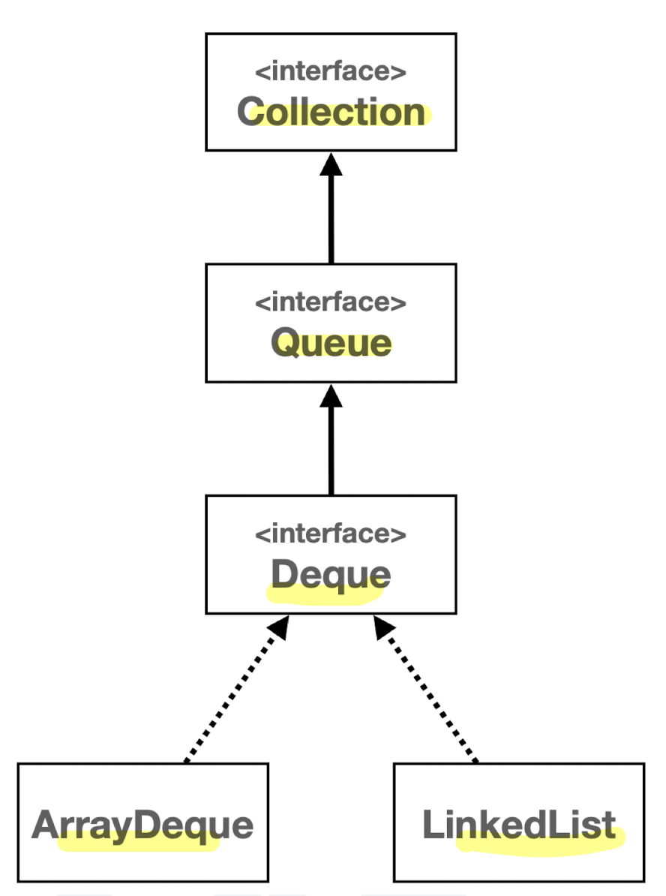
- 실무 선택 전략
	- **스택, 큐 모두 `deque`의 `ArrayDeque` 구현체 사용 권장** (성능이 빠름)
	- **큐 사용** 시
		- **단순히 큐 기능**만 필요하면 **`Queue` 인터페이스** 사용
		- **더 많은 기능**이 필요하면 **`Deque` 인터페이스** 사용
- **스택** (Stack)
	- 후입선출 (**LIFO**, Last In First Out) 자료구조
	- 전통적으로 **값을 넣는 것을 `push`**, **값을 꺼내는 것을 `pop`** 이라고 함
	- **`Deque`을 사용해 구현**해야 함
		- `Stack` 구현체 클래스는 내부에서 `Vector` 사용하는데 하위호환을 존재하므로 사용 권장 X
- **큐** (Queue)
	- 선입선출 (**FIFO**, First In First Out) 자료구조
	- 전통적으로 **값을 넣는 것을 `offer`**, **값을 꺼내는 것을 `poll`** 이라고 함
- **덱** (Deque, Double Ended Queue)
	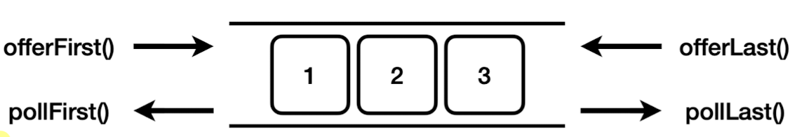
	- **양쪽 끝**에서 요소를 **추가하거나 제거 가능**
		- `offerFirst()` : 앞에 추가
		- `offerLast()` : 뒤에 추가
		- `pollFirst()` : 앞에서 꺼냄
		- `pollLast()` : 뒤에서 꺼냄
	- **일반적인 큐(Queue)와 스택(Stack)의 기능을 모두 포함**하고 있어, **매우 유연**한 자료 구조
		- **스택** 사용 위한 **메서드** 제공
			- `push()`: 앞에서 입력
			- `pop()`: 앞에서 꺼냄
		- **큐** 사용 위한 **메서드** 제공
			- `offer()`: 뒤에서 입력
			- `poll()`: 앞에서 꺼냄
		- 참고로 둘 다 다음 데이터 단순 확인용으로 `peek()` 사용 가능 (앞에서 확인)
	- 구현체: **`ArrayDeque`**, `LinkedList`
		- **`ArrayDeque`** 이 모든 면에서 **가장 빠름** 
			- **배열** 사용은 현대 컴퓨터 시스템에서 더 나은 성능 발휘할 때가 많음
				- `ArrayList` vs `LinkedList` 차이와 비슷
			- 추가로 **원형 큐 자료 구조** 사용해 **앞, 뒤 입력 모두 O(1)**
				- 물론 자바 `LinkedList`도 앞, 뒤 입력이 O(1)
			- 성능 비교
				- 100만 건 입력 (앞, 뒤 평균)
					- `ArrayDeque` : 110ms 
					- `LinkedList` : 480ms
				- 100만 건 조회 (앞, 뒤 평균)
					- `ArrayDeque` : 9ms
					- `LinkedList` : 20ms
## Iterable, Iterator - Iterator 디자인 패턴
- 순회
	- 자료구조에 들어 있는 **데이터를 차례대로 접근해서 처리**하는 것
- **Iterator(반복자) 디자인 패턴**
	- **객체 지향 프로그래밍**에서 **컬렉션의 요소들을 순회**할 때 사용되는 **디자인 패턴**
		- **컬렉션의 구현과 독립적**으로 요소들을 탐색할 수 있는 방법 제공
		- **코드 복잡성 감소**, **재사용성 상승**
	- 문제: **자료 구조마다 데이터를 접근하는 방법이 모두 다름**
		- e.g. 배열 리스트는 인덱스, 연결 리스트는 노드 순회
		- 개발자가 각 자료구조 내부구조와 순회 방법을 배워야 함
	- 해결책: **`Iterable`, `Iterator` 인터페이스** (**자바** 제공)
		- 자료구조 구현과 관계 없이 **모든 자료 구조를 일관성 있는 동일한 방법으로 순회** 가능
			- 추상화한 순회 과정
				- **반복** 과정: **다음 요소가 있는지 물어보기** & **있으면 다음 요소 꺼내기**
				- 다음 요소가 없으면 **종료**
		- **자바 컬렉션 프레임워크**는 **`Iterable` 인터페이스**와 **각 구현체에 맞는 `Iterator` 구현**해 제공
			- `Collection` 인터페이스 상위에 `Iterable` 존재 -> **모든 컬렉션이 순회 가능**
			- **`Map`은** `Iterable`이 없어 **바로 순회 불가**
				- `keySet()`, `values()`, `entrySet()`으로 **`Set`이나 `Collection` 받아 순회**
		- **`Iterable`을 구현한 자료구조**는 **`iterator`를 반환**하고 **for-each 문이 작동**한다는 의미
			- 개발자는 **`hasNext()`, `next()` 페어** 혹은 **for-each 문**으로 쉽게 자료구조 **순회 가능**
- **`Iterable`**
	```java
	public interface Iterable<T> {
	    Iterator<T> iterator();
	}
	```
	- 단순히 **`Iterator` 반복자를 반환**
- **`Iterator`**
	```java
	public interface Iterator<E> {
	    boolean hasNext();
	    E next();
	}
	```
	- `hasNext()` : **다음 요소가 있는지 확인**, 다음 요소가 없으면 `false` 를 반환
	- `next()` : **다음 요소를 반환**, **내부에 있는 위치를 다음으로 이동**
- **Enhanced For Loop**와 `Iterable`
	- **자바**는 **`Iterable` 인터페이스를 구현한 객체**에 대해서 **향상된 for 문을 사용 지원**
	- 자바는 **컴파일 시점**에 다음과 같이 **코드 변경**
		- 변경 전
			```java
			for (int value : myArray) {
			    System.out.println("value = " + value);
			}
			```
		- 변경 후
			```java
			while (iterator.hasNext()) {
			    Integer value = iterator.next();
			    System.out.println("value = " + value);
			}
			```
- 코드 예시
	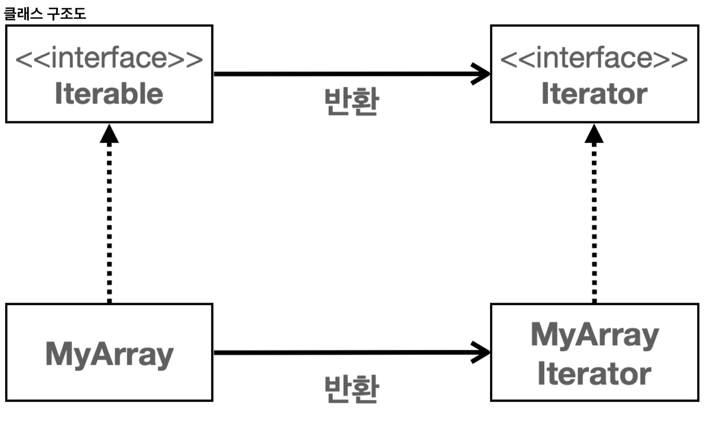
	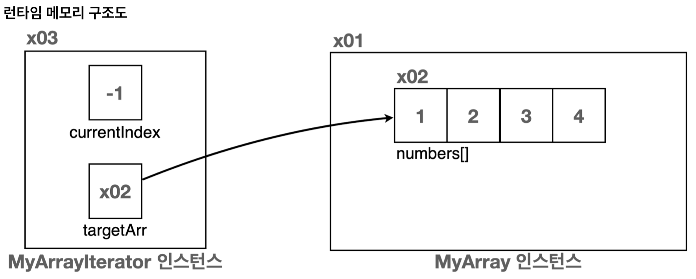
	```java
	public class MyArrayIterator implements Iterator<Integer> {
	    
	    private int currentIndex = -1;
	    private int[] targetArr;
	    
	    public MyArrayIterator(int[] targetArr) {
	        this.targetArr = targetArr;
		}
		
	    @Override
	    public boolean hasNext() {
	        return currentIndex < targetArr.length - 1;
	    }
	    
	    @Override
	    public Integer next() {
		    return targetArr[++currentIndex];
	    }
	}
	```
	```java
	public class MyArray implements Iterable<Integer> {
		private int[] numbers;
	    public MyArray(int[] numbers) {
	        this.numbers = numbers;
		}
	    
	    @Override
	    public Iterator<Integer> iterator() {
	        return new MyArrayIterator(numbers);
	    }
	}
	```
## Comparable, Comparator
- 실무 사용법
	- **객체 기본 정렬 방법**은 **객체에 `Comparable` 구현**해 정의
	- 기본 정렬 외 **다른 정렬**을 사용해야 하는 경우 **`Comparator` 구현해 정렬 메서드에 전달**
		- 이 경우 **전달한 `Comparator`가 항상 우선권 가짐**
- **정렬 비교 기준 설정** (추상화를 통해 정렬 기준만 간단히 변경 가능)
	- e.g.
		- 배열 정렬 - `Arrays.sort()` (비교자 전달 가능)
		- List 정렬 - `Collections.sort(list)`, `list.sort(null)` (비교자 전달 가능)
		- Tree 구조 정렬
			- 저장부터 정렬 필요하므로 `TreeSet`, `TreeMap`은 **`Comparable`, `Comparator` 필수**
			- `new TreeSet<>()` - 객체의 `Comparable`로 정렬
			- `new TreeSet<>(new IdComparator())` - 인자로 넘긴 `Comparator`로 정렬
	- **정렬** 시 `Comparable`, `Comparator` **둘 다 없으면 런타임 오류**
		- `java.lang.ClassCastException: class collection.compare.MyUser cannot be cast to class java.lang.Comparable`
		- **`Comparable` 없어도 `Comparator` 주면 괜찮음!**
- `Comparator` 인터페이스 (비교자)
	```java
	public interface Comparator<T> {
	    int compare(T o1, T o2);
	}
	```
	- 두 값을 비교할 때 **비교 기준**을 제공
	- `compare()`: **두 인수를 비교해 결과값 반환**
		- **첫 번째 인수**가 더 작으면 음수 e.g. `-1`
		- 두 값이 같으면 제로 e.g. `0`
		- **첫 번째 인수**가 더 크면 양수 e.g. `1`
- `Comparable` 인터페이스
	```java
	public interface Comparable<T> {
	    public int compareTo(T o);
	}
	```
	- **사용자 정의 객체**에 **정렬 비교 기준 설정** (**비교 기능** 추가)
	- `Comparable` 통해 구현한 순서를 **자연 순서**(**Natural Ordering**)라고 함
	- `compareTo()`: **자기 자신**과 **인수**로 넘어온 객체 **비교해 결과값 반환**
		- **현재 객체**가 인수로 주어진 객체보다 더 작으면 음수 e.g. `-1`
		- 두 객체의 크기가 같으면 제로 e.g. `0`
		- **현재 객체**가 인수로 주어진 객체보다 더 크면 양수 e.g. `1`
- 예시 코드 - 정렬 (`Comparator` 전달)
	```java
	public class SortMain {
		public static void main(String[] args) {
			Integer[] array = {3, 2, 1}; 

			System.out.println("Comparator 비교");
			
			Arrays.sort(array, new AscComparator()); // 1, 2, 3
			
			Arrays.sort(array, new DescComparator()); // 3, 2, 1
			
			//DescComparator와 같다.
			Arrays.sort(array, new AscComparator().reversed()); // 3, 2, 1
		}
	    
	    static class AscComparator implements Comparator<Integer> {
	        @Override
	        public int compare(Integer o1, Integer o2) {
	            return (o1 < o2) ? -1 : ((o1 == o2) ? 0 : 1);
			}
		}
		
	    static class DescComparator implements Comparator<Integer> {
	        @Override
	        public int compare(Integer o1, Integer o2) {
	            return (o1 < o2) ? -1 : ((o1 == o2) ? 0 : 1) * -1;
	        }
	    }
	}
	```
- 예시 코드 - 객체 `Comparable` 정의
	```java
	public class MyUser implements Comparable<MyUser> {
	    
	    private String id;
		private int age;
		
		...
		
		//나이 오름차순으로 구현
		@Override
		public int compareTo(MyUser o) {
		    return this.age < o.age ? -1 : (this.age == o.age ? 0 : 1);
		}
	}
	```
## Arrays 유틸
- `Arrays.toString()`
	- 배열을 문자열로 보기 좋게 정제해 반환
- `Arrays.copyOf(기존배열, 새로운 길이)`
	- **새로운 길이**로 **배열을 생성**하고 **기존 배열 값**을 새로운 배열에 **복사**
- `Arrays.sort()`
	- **배열**에 들어있는 데이터를 **순서대로 정렬**
	- 시간 복잡도: **O(N log N)**
	- 자바 구현 알고리즘
		- 초기: 퀵소트
		- 현재:
			- 데이터가 적을 때(32개 이하) **듀얼 피벗 퀵소트(Dual-Pivot QuickSort)** 사용
			- 데이터가 많을 때 **팀소트(Tim Sort)** 사용
	- 종류
		- `Arrays.sort(배열)`
			- **자연 순서** 기준으로 정렬 (**`Comparable` 기준**)
		- `Arrays.sort(배열, Comparator)`
			- **`Comparator` 기준**으로 정렬
			- **`Comparator` 전달 시** 객체 `Comparable` 보다 **우선순위 가짐**
## 컬렉션 유틸
- 컬렉션을 편리하게 다룰 수 있는 다양한 기능 제공
- `Collections` **정렬** 관련 메서드
	- `max` : **정렬 기준**으로 **최대 값**을 찾아서 반환
	- `min` : **정렬 기준**으로 **최소 값**을 찾아서 반환
	- `shuffle` : 컬렉션을 랜덤하게 섞음
	- `sort` : **정렬 기준**으로 컬렉션을 **정렬**
	- `reverse` : **정렬 기준**의 **반대로** 컬렉션을 **정렬**
- **편리한 컬렉션 생성**
	- **불변 컬렉션** 생성 (**`of()`**, **사용 권장**)
		- 생성한 객체는 **불변** (`add()`, `put()`, `remove()` 불가)
		- 변경 시도 시 `UnsupportedOperationException` 예외 발생
		- **불변을 위한 다른 구현체** 사용
			- e.g. 
				- `class java.util.ImmutableCollections$ListN`
				- `List` 인터페이스에 불변을 위한 다른 구현체 제공
		- **`List`, `Set`, `Map` 모두 `of()` 지원**
			- `List<Integer> list = List.of(1, 2, 3);` 
			- `Set<Integer> set = Set.of(1, 2, 3);`
			- `Map<String, Integer> map = Map.of("A", 1, "B", 2, "C", 3);`
		- **배열**을 **리스트로 변환**하기도 지원
			- `Integer[] inputArr = {30, 20, 20, 10, 10};`
			- `List<Integer> list = Arrays.asList(inputArr);`
			- `List<Integer> list = List.of(inputArr);`
		- 참고: 생성자 전달 방법
			- `Set`은 생성자에 `List`를 받을 수 있음 (배열은 못 받음)
				- `Integer[] inputArr = {30, 20, 20, 10, 10};`
				- `Set<Integer> set = new LinkedHashSet<>(List.of(inputArr));`
	- **가변 컬렉션으로 전환**
		- 불변 -> 가변 (**`new XxxXxx<>(list)`**)
			- `List<Integer> list = List.of(1, 2, 3);// 불변 리스트 생성`
			- **`ArrayList<Integer> mutableList = new ArrayList<>(list);// 가변`**
		- 가변 -> 불변 (**`Collections.unmodifiableXxx()`**)
			- `List<Integer> unmodifiableList = Collections.unmodifiableList(mutableList); //java.util.Collections$UnmodifiableRandomAccessList`
	- **빈 컬렉션 생성**
		- 빈 가변 리스트 생성: 구현체 직접 생성 e.g. `new ArrayList<>();`
		- 빈 불변 리스트 생성
			- **`List.of()`** (자바 9, **권장**)
			- `Collections.emptyList()` (자바 5)
	- 멀티스레드 동기화 컬렉션 변환
		- 일반 리스트를 동기화된 리스트로 변경 가능
		- 일반 리스트 보다 성능 느림
		- e.g.
		- `ArrayList<Integer> list = new ArrayList<>();`
		- `List<Integer> synchronizedList = Collections.synchronizedList(list);`

>`List.of()` VS `Arrays.asList()`
>
>두 메서드 모두 리스트를 생성할 수 있다.
>
>`List<Integer> list = Arrays.asList(1, 2, 3);`
>`List<Integer> list = List.of(1, 2, 3);`
>
>일반적으로 자바 9 이상은 **`List.of()`를 권장**한다. 혹시나 하위 호환성을 위함이거나 내부 요소를 변경해야 하는 경우 `Arrays.asList()` 선택할 수 있다.
>
>`Array.asList()`는 **고정된 크기를 가지지만, 내부 요소를 변경할 수 있다.** 
>(`set()`은 가능하지만 `add()`, `remove()` 불가)
>즉, 고정도 가변도 아닌 **애매한 리스트여서 거의 사용하지 않는다.**