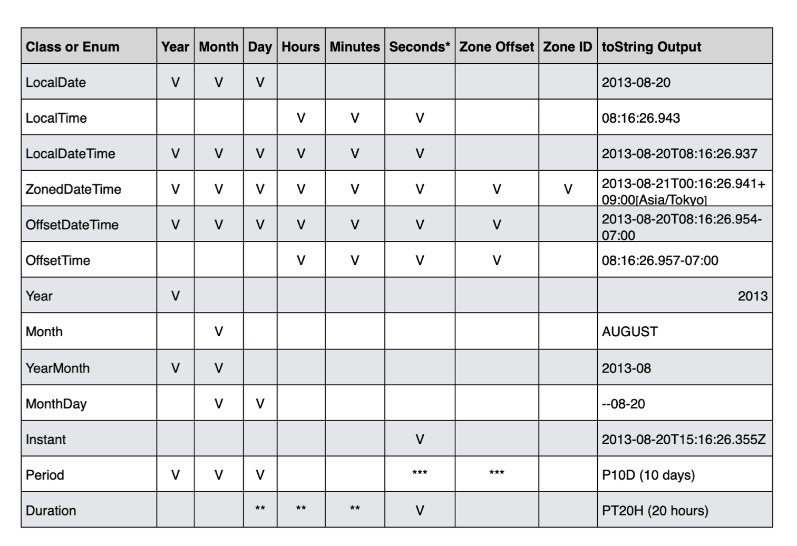
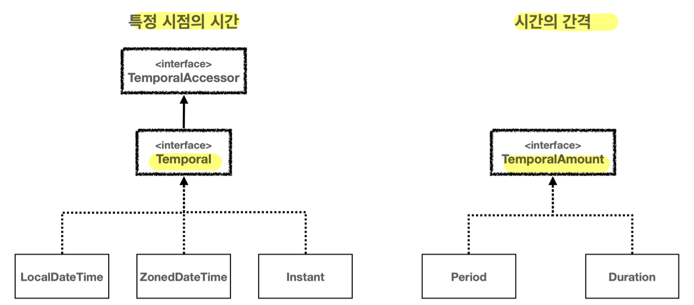
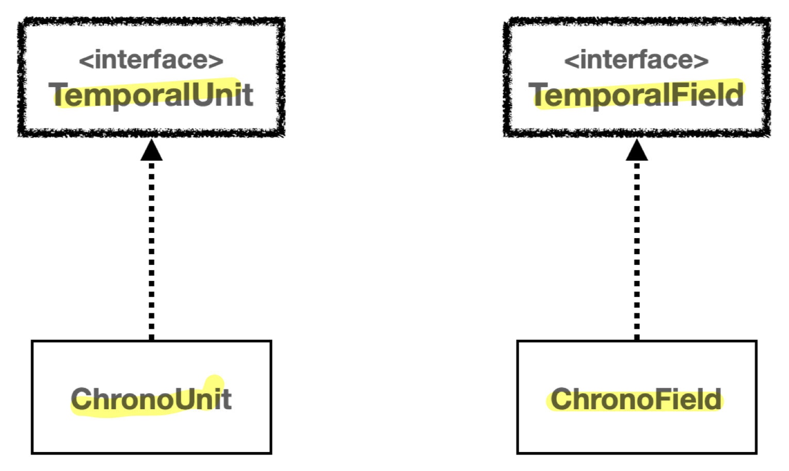

## 날짜 시간 라이브러리의 필요성
- 날짜 라이브러리는 **복잡한 계산을 추상화해 제공**하므로, 안정적이고 정확한 개발 가능
	- **자바 8**에서 `java.time` 패키지(JSR-310)를 표준 API(기능의 모음)로 도입
	- **외부 라이브러리**였던 **Joda-Time**의 개발자를 데려와 새로운 자바 표준 API를 함께 정의
	- 이전 문제가 많던 API를 크게 개선 (사용성, 성능, 스레드 안정성, 타임존 처리, 불변 객체 설계 등)
- 날짜 계산이 어려운 이유
	- 각 달은 **28~31일**로 다르게 분포
	- 윤년 (Leap Year)
		- **지구가 태양을 한 바퀴 도는 평균 시간**은 약 365.2425일 (약 365일 5시간 48분 45초)
		- 우리가 사용하는 **그레고리력**은 1년이 365일
		- **윤년**은 **둘의 간극을 매우기 위한 해결책**으로 **4년마다 하루를 추가** (2월 29일)
			- 100년 단위는 윤년이 아니며 400년 단위는 다시 윤년
	- 일광 절약 시간 (Daylight Saving Time, DST) - 썸머타임
		- 보통 **3월 중순~11월 초** 태양이 일찍 뜨는 것에 맞춰 **1시간 앞당기는 제도**
		- **국가나 지역에 따라** 적용 여부 및 시작 종료 날짜가 **다름**
	- 타임존 계산
		- 각각의 타임존은 **UTC(세계 협정시)로부터의 시간 차이**로 정의
		- London / UTC / GMT는 세계 시간의 기준이 되는 00:00 시간대
			- GMT (그리니치 평균시, Greenwich Mean Time)
				- 처음 세계 시간은 영국 런던 그리니치 천문대를 기준으로 만듦
			- **UTC** (협정 세계시, Universal Time Coordinated)
				- GMT를 대체하기 위해 도입 (둘은 실질적으로 같은 시간대)
				- 다만, UTC는 원자 시계를 사용해 측정해 **보다 정확한 시간 유지**
		- 타임존 예시
			- Europe/London
			- GMT
			- UTC
			- America/New_York -05:00 
			- Asia/Seoul +09:00
## 자바 날짜 시간 라이브러리 (`time`) - 클래스 분류표

- 유의점
	- 모든 날짜 클래스는 **불변** -> 변경이 발생하는 경우 새로운 객체를 생성해 반환
	- 초는 **나노초** 정밀도로 캡처 가능
- `Year`, `Month`, `YearMonth`, `MonthDay`: 자주 사용 X
- **`DayOfWeek`**: **월, 화, 수, 목, 금, 토, 일**을 나타내는 Enum (`ChronoField`)
## 날짜와 시간 핵심 인터페이스

- `TemporalAccessor` 인터페이스
	- 날짜와 시간을 **읽기** 위한 기본 인터페이스
- 날짜와 시간의 2가지 개념 (**특정 시점의 시간** & **시간의 간격**)
	- **`Temporal`** 인터페이스 - **특정시점의 시간**
		- 날짜와 시간을 **조작**하기 위한 기능 추가 제공
		- 상위 인터페이스 덕분에 **읽기와 쓰기 모두 지원**
		- 구현체
			- `LocalDateTime`, `LocalDate`, `LocalTime`
			- `ZonedDateTime`, `OffsetDateTime`
			- `Instant`
	- **`TemporalAmount`** 인터페이스 - **시간의 간격**
		- 특정 날짜 시간 객체에 **일정 기간을 더하거나 빼는데 사용**
		- 구현체
			- `Period` , `Duration`
- 시간의 **단위**와 **필드** 
	
			- **단독 사용 X**, 날짜 시간 **조회**나 **조작**에 사용
	- **`TemporalUnit`** 인터페이스 - **시간의 단위**
		- 날짜와 시간을 측정하는 **단위**
		- 구현체(**Enum**): **`ChronoUnit`**
			- 시간: NANOS, MICROS, MILLIS, SECONDS, MINUTES, HOURS
			- 날짜: DAYS, WEEKS, MONTHS, YEARS, DECADES, CENTURIES, MILLENNIA
			- 기타: ERAS, FOREVER
			- 주요 메서드
				- `between(Temporal, Temporal)`
					- 두 `Temporal` 객체 사이의 시간을 현재 `ChronoUnit` 단위로 측정하여 반환
					- e.g.
						- `LocalTime lt1 = LocalTime.of(1, 10, 0); `
						- `LocalTime lt2 = LocalTime.of(1, 20, 0);`
						- `long secondsBetween = ChronoUnit.SECONDS.between(lt1, lt2);`
						- `long minutesBetween = ChronoUnit.MINUTES.between(lt1, lt2);`
				- `getDuration()`
					- 현재 `ChronoUnit`의 기간을 `Duration` 객체로 반환
					- e.g.
						- `ChronoUnit.HOURS.getDuration().getSeconds() //3600`
						- `ChronoUnit.DAYS.getDuration().getSeconds() //86400`
	- **`TemporalField`** 인터페이스 - **시간의 각 필드**
		- **날짜와 시간의 특정 부분**을 나타냄 (연도, 월, 일, 시간, 분)
		- 예를 들어, 일(day)은 31보다 클 수 없는 것처럼 **범위**가 생김
		- 구현체(**Enum**): **`ChronoField`**
			- 연도: ERA, YEAR_OF_ERA, YEAR, EPOCH_DAY
			- 월
				- **MONTH_OF_YEAR**: 월 (1월 = 1)
			- 주 및 일
				- **DAY_OF_MONTH**: 월의 일 (1일 = 1)
				- **DAY_OF_WEEK**: 요일 (월요일 = 1)
				- DAY_OF_YEAR: 연의 일 (1월 1일 = 1)
			- 시간
				- **HOUR_OF_DAY**: 시간 (0-23)
				- HOUR_OF_AMPM: 오전/오후 시간 (0-11)
				- CLOCK_HOUR_OF_DAY: 시계 시간 (1-24)
				- CLOCK_HOUR_OF_AMPM: 오전/오후 시계 시간 (1-12)
				- **MINUTE_OF_HOUR**: 분 (0-59)
				- **SECOND_OF_MINUTE**: 초 (0-59)
				- MILLI_OF_SECOND: 초의 밀리초 (0-999)
				- MICRO_OF_SECOND: 초의 마이크로초 (0-999,999)
				- NANO_OF_SECOND: 초의 나노초 (0-999,999,999)
			- 기타
				- AMPM_OF_DAY: 하루의 AM/PM 부분
			- 주요 메서드
				- `range()`
					- 필드 값의 **유효 범위**를 `ValueRange` 객체로 반환 (최소값과 최대값을 제공)
					- e.g.
						- `ChronoField.MONTH_OF_YEAR.range() //1 - 12`
						- `ChronoField.DAY_OF_MONTH.range() //1 - 28/31`
### `Temporal` - 특정 시점의 시간
#### 기본 날짜 시간 표현 (`LocalXxx`)
- **특정 지역의 날짜와 시간만 고려**할 때 사용 (**타임존 적용 X**, 시간대 고려 X)
- **국내 서비스**만 고려할 때 **권장**
- 종류
	- `LocalDate`: **날짜**만 표현 (년, 월, 일) 
		- 예) `2013-11-21` 
	- `LocalTime`: **시간**만 표현 (시, 분, 초) 
		- 예) `08:20:30.213`
		- 밀리초, 나노초 단위도 포함 가능
	- **`LocalDateTime`**: **`LocalDate` + `LocalTime`**
		- 예) `2013-11-21T08:20:30.213`
		- 클래스 내부에 `LocalDate`와 `LocalTime`을 **필드**로 가지고 있음
			```java
			public class LocalDateTime {
				private final LocalDate date;
				private final LocalTime time;
				...
			}
			```
- 주요 메서드
	- 공통 메서드
		- 생성
			- `now()`: 현재 시간 기준으로 생성
			- `of(...)`: 특정 날짜를 기준으로 생성
		- 계산
			- `dt.plusXxx()`: 특정 날짜 시간 단위를 더함 
				- e.g. `plusYears(1)`, `plusDays(10)`, `plusSeconds(30)`
	- **`LocalDatetime`**
		- 날짜와 시간 분리
			- `dt.toLocalDate()`: 주어진 `LocalDateTime`에서 **날짜**만 반환
			- `dt.toLocalTime()`: 주어진 `LocalDateTime`에서 **시간**만 반환
		- 날짜와 시간 합체
			- `of(...)`: 날짜와 시간을 묶어서 `LocalDateTime`으로 만들기
				- e.g. `LocalDateTime.of(localDate, localTime)`
		- 비교
			- `dt.isBefore()`: **현재 날짜시간**이 지정 날짜시간보다 **이전**이라면 `true` 를 반환 
			- `dt.isAfter()`: **현재 날짜시간**이 지정 날짜시간보다 **이후**라면 `true` 를 반환
			- `dt.isEqual()`: 현재 날짜시간과 지정 날짜시간 시간적으로 **동일**하면 `true` 를 반환
				- `isEqual()`
					- 객체가 다르고 타임존이 달라도 **시간적으로** 같으면 `true`
					- e.g. 서울의 9시와 UTC의 0시는 시간적으로 동일
				- `equals()`
					- 객체 타입, 타임존 등등 **내부 데이터의 모든 구성요소**가 같아야 `true`
					- e.g. 서울의 9시와 UTC의 0시는 타임존이 다르므로 `false`
#### 시간대 적용 날짜 시간 표현 (`ZonedDateTime`, `OffsetDateTime`)
- **글로벌 서비스** 개발 시에만 사용 (그러지 않으면 거의 사용 X)
- 용어
	- **타임존**(Time Zone)
		- **오프셋**과 **일광 절약 시간제**에 대한 정보 담김
		- -> 타임존을 알면 일광 절약 시간제를 알 수 있음
		- 예) `Asia/Seoul`
	- 오프셋(Offset)
		- UTC로 부터의 시간대 차이 
		- 예) `+9:00`
- 종류
	- **`ZoneId`**
		- 자바가 제공하는 **타임존** 클래스
		- 내부에 **오프셋**과 **일광 절약 시간제** 정보 포함
	- **`ZonedDateTime`**
		- 시간대를 표현하는 **타임존**이 포함 (**`LocalDateTime` + `ZoneId`**)
		- 일광 절약 시간제 **적용**
		- **실제 사용 날짜와 시간 정보** 표현에 적합 (**비행기 시간, 회의 시간, 일상 시간 표현...**)
		- 예) `2013-11-21T08:20:30.213+9:00[Asia/Seoul]`
		- 클래스 내부에 `LocalDatetime`, `ZoneId`, `ZoneOffset`을 **필드**로 가지고 있음
			```java
			public class ZonedDateTime {
				private final LocalDateTime dateTime;
				private final ZoneOffset offset;
				private final ZoneId zone;
				...
			}
			```
	- `OffsetDateTime`
		- 타임존은 없고, **고정된 오프셋만 포함** (**`LocalDateTime` + `ZoneOffset`**)
		- 일광 절약 시간제 **적용 X**
		- **시간대 변환 없이 로그를 기록**하고 처리할 때 적합
			- 로그는 **순차적**으로 쌓여야 함, 썸머타임 적용으로 1시간 당겨지는 상황 있으면 안됨
		- 예) `2013-11-21T08:20:30.213+9:00` 
		- 클래스 내부에 `LocalDatetime`, `ZoneOffset`을 **필드**로 가지고 있음
			```java
			public class OffsetDateTime {
				private final LocalDateTime dateTime;
				private final ZoneOffset offset;
				...
			}
			```
- 주요 메서드
	- 공통 메서드
		- 생성
			- `now()`: 현재 시간 기준으로 생성 (`ZoneId`는 현재 시스템을 따름)
			- `of(...)`: 특정 날짜를 기준으로 생성
	- **`ZonedDatetime`**
		- `of(...)` 사용법
			- 단순 생성
				- `ZonedDateTime zdt = ZonedDateTime.of(2030, 1, 1, 13, 30, 50, 0, ZoneId.of("Asia/Seoul"));`
			- `LocalDatetime` + `ZoneId`로 생성하기
				- `LocalDateTime ldt = LocalDateTime.of(2030, 1, 1, 13, 30, 50);`
				- `ZonedDateTime zdt = ZonedDateTime.of(ldt, ZoneId.of("Asia/Seoul"));`
		- **타임존 변경하기**
			- `zdt.withZoneSameInstant()`: 입력한 타임존으로 변경
				- e.g. `zdt.withZoneSameInstant(ZoneId.of("UTC"))`
	- `OffsetDatetime`
		- `of(...)` 사용법
			- `LocalDatetime` + `ZoneOffset`로 생성하기
				- `LocalDateTime ldt = LocalDateTime.of(2030, 1, 1, 13, 30, 50);`
				- `OffsetDateTime odt = OffsetDateTime.of(ldt, ZoneOffset.of("+01:00"));`
	- 이외
		- `ZoneId`
			- `getAvailableZoneIds()`: 이용 가능한 모든 `ZoneId` 반환
			- `systemDefault()`: 시스템이 사용하는 기본 `ZoneId` 반환
			- `of(...)`: 타임존을 직접 제공해서 `ZoneId`로 변환 
				- e.g. `ZoneId.of("Asia/Seoul")`
#### 기계 중심의 시간 (`Instant`)
- **UTC**를 기준으로 하는 **시간의 한 지점**
- 1970년 1월 1일 0시 0분 0초(UTC)를 기준으로 **경과한 시간**으로 계산 (**초 데이터**)
- 클래스 내부에 초 데이터를 **필드**로 가짐 (나노초 정밀도)
	```java
	public class Instant {
		private final long seconds;
		private final int nanos;
		...
	}
	```
- **일반적으로 `LocalDateTime` , `ZonedDateTime`를 사용하고 `Instant`는 특별한 경우에 사용**
	- **기준점이 명확**하나(UTC), **사람이 읽기 어렵고 초 단위 간단한 연산만 가능**
- 사용 예
	- 로그 기록, 트랜잭션 타임스탬프, 서버 간 시간 동기화 등 **전 세계적으로 일관된 시점 표현 시**
	- 지속 시간 계산 등 **시간대 변화 없는 순수한 시간 흐름**만을 다룰 때
	- DB에 날짜 시간 저장하거나 다른 시스템과 날짜 시간 정보를 교환할 때
- 주요 메서드
	- 생성
		- `now()`
			- UTC를 기준 **현재** 시간의 `Instant` 를 생성
		- `from()`
			- **다른 타입**의 날짜와 시간을 기준으로 `Instant` 를 생성
			- `LocalDateTime` 사용 불가 (`Instant` 는 UTC 기준이어서 시간대 정보가 필요)
			- e.g.
				- `ZonedDateTime zdt = ZonedDateTime.now();`
				- `Instant from = Instant.from(zdt);`
		- `ofEpochSecond()` 
			- **에포크 시간을 기준**으로 `Instant` 를 생성
			- `ofEpochSecond(0)` -> 에포크 시간인 1970년 1월 1일 0시 0분 0초로 생성
			- `ofEpochSecond(30)` -> 1970/1/1/0/0/30
	- 계산
		- `plusSeconds()` : 초, 밀리초, 나노초 정도만 더하는 간단한 메서드
	- 조회
		- `getEpochSecond()` : UTC 1970년 1월 1일 0시 0분 0초를 기준으로 **흐른 초**를 **반환**

>Epoch 시간
>
>Epoch time(에포크 시간) 또는 Unix timestamp는 **컴퓨터 시스템**에서 시간을 나타내는 방법 중 하나이다. **1970년 1월 1일 00:00:00 UTC부터 현재까지 경과된 시간을 초 단위로 표현**한 것이다. 즉, 시간대에 영향을 받지 않는 **절대적인 시간 표현 방식**이다. 
>`Instant`는 Epoch 시간을 다루는 클래스이다.

### `TemporalAmount` - 시간의 간격 (기간, 시간의 양, amount of time)
#### 년, 월, 일 단위 표현 (`Period`)
- 클래스 내부에 **년, 월, 일**을 **필드**로 가짐
	```java
	public class Period {
	    private final int years;
	    private final int months;
	    private final int days;
	}
	```
- 주요 메서드
	- 생성
		- `of()` : 특정 기간을 지정해서 `Period` 를 생성
			- `of(년, 월, 일)`
			- `ofDays()`
			- `ofMonths()`
			- `ofYears()`
	- 계산
		- 더하기
			- 특정 날짜 인스턴스의 **`plus()` 메서드**를 사용해 기간을 더할 수 있음
			- e.g.
				- `LocalDate currentDate = LocalDate.of(2030, 1, 1);`
				- `Period period = Period.ofDays(10);`
				- `LocalDate plusDate = currentDate.plus(period);`
		- `between()`: 기간 차이 구하기 (**`Period` 반환**)
			- `LocalDate startDate = LocalDate.of(2023, 1, 1);`
			- `LocalDate endDate = LocalDate.of(2023, 4, 2);`
			- `Period between = Period.between(startDate, endDate); //Period 반환`
	- 조회
		- `getYears()`, `getMonths()`, `getDays()`
#### 시, 분, 초(나노초) 단위 표현 (`Duration`)
- 클래스 내부에 **초 데이터**만 **필드**로 가짐
- 내부에서 **초를 기반**으로 **시, 분, 초를 계산**해서 사용
	```java
	public class Duration {
	    private final long seconds;
	    private final int nanos;
	}
	```
- 주요 메서드
	- 생성
		- `of()` : 특정 시간을 지정해서 `Duration` 를 생성
			- `of(지정)` 
			- `ofSeconds()` 
			- `ofMinutes()` 
			- `ofHours()`
	- 계산
		- 더하기
			- 특정 시간 인스턴스의 **`plus()` 메서드**를 사용해 시간을 더할 수 있음
			- e.g.
				- `LocalTime lt = LocalTime.of(1, 0);`
				- `Duration duration = Duration.ofMinutes(30);`
				- `LocalTime plusTime = lt.plus(duration);`
		- `between()`: 시간 차이 구하기 (**`Duration` 반환**)
			- `LocalTime start = LocalTime.of(9, 0);`
			- `LocalTime end = LocalTime.of(10, 0);`
			- `Duration between = Duration.between(start, end); //Duration 반환`
	- 조회
		- `get`은 바로 가져오는 느낌, `to`는 계산을 하는 느낌 (`Duration`은 내부에 초 데이터만 보유)
			- `toHours()`, `toMinutes()`
			- `getSeconds()`, `getNano()`
		- 일반적인 x시간 x분을 출력할 때는 **`toHoursPart()` + `toMinutesPart()` 조합** 사용
			- `toHoursPart()`, `toMinutesPart()`, `toSecondsPart()`
## 날짜와 시간 조회 및 조작
- **일관성** 있는 **시간 조회 및 조작** 기능 제공 (인터페이스 설계가 잘되어 있음)
- 불변 객체이므로 **메서드 체이닝** 가능
- 기본 규칙
	- 조회 방법
		- 편의 메서드 사용 (**가독성을 위해 권장**)
			- 자주 사용하는 조회 필드는 **간단한 편의 메서드** 제공
			- `getYear()`, `getMonthValue()`, `getDayOfMonth()`, `getHour()`, `getMinute()`, `getSecond()`, `getDayOfWeek()`
		- `TemporalAccessor.get(TemporalField field)` 
			- **`ChronoField`** 인수로 전달해, 날짜 시간 객체에서 원하는 단위로 조회 가능
			- `get(ChronoField.YEAR)`, `get(ChronoField.MONTH_OF_YEAR)`, `get(ChronoField.DAY_OF_MONTH)`, `get(ChronoField.HOUR_OF_DAY)`, `get(ChronoField.MINUTE_OF_HOUR)`, `get(ChronoField.SECOND_OF_MINUTE)`, `get(ChronoField.DAY_OF_WEEK)`
			- **편의 메서드에 없는 경우** 사용
	- 조작 방법
		- 편의 메서드 사용
			- 자주 사용하는 메서드는 **간단한 편의 메서드** 제공
			- `plus` -> `plusXxx`, `minus` -> `minusXxx`
		- `Temporal plus(TemporalAmount amount)`
			- **`Period`**, **`Duration`** 인수로 전달해 조작 가능
		- `Temporal plus(long amountToAdd, TemporalUnit unit)`
			- **시간의 양**과 **`ChronoUnit`** 인수로 전달해, 특정 시점의 시간을 조작 가능
- `isSupported()` - `TemporalAccessor` & `Temporal` 인터페이스
	- 현재 타입에서 **특정 시간 단위나 필드를 사용할 수 있는지** 확인
	- e.g. `LocalDate`에는 시, 분, 초 단위 관련 조회 및 조작을 할 수 없음
		```java
		LocalDate now = LocalDate.now();
		boolean supported = now.isSupported(ChronoField.SECOND_OF_MINUTE);//false
		if (supported) {
			int minute = now.get(ChronoField.SECOND_OF_MINUTE);
		}
		```
- **기간 차이** 구하기
	- **남은 기간**
		- `Period`, `Duration`의 `between()`
		- e.g. 
		- `Period period = Period.between(startDate, endDate);`
		- 년: `period.getYears()` / 월: `period.getMonths()` / 일: `period.getDays()`
	- **디데이**
		- `ChronoUnit`의 `between(Temporal, Temporal)`
		- e.g. `long daysBetween = ChronoUnit.DAYS.between(startDate, endDate);`
- **`with()`**
	- **복잡한 날짜 계산**에 적합
	- 날짜와 시간의 **특정 필드 값만 변경**하는 것이 가능
	- 방법
		- 편의 메서드
			- 자주 사용하는 메서드는 **간단한 편의 메서드** 제공
			- `dt.with(ChronoField.YEAR, 2020)` -> `dt.withYear(2020)`
		- **`TemporalAdjusters`** 사용
			- `TemporalAdjuster` 인터페이스의 구현체 묶음 (자바가 만들어 둠)
			- **더욱 복잡한 날짜 계산** 가능
			- e.g
				- `dt.with(TemporalAdjusters.next(DayOfWeek.FRIDAY))`
					- 다음주 금요일 구하기
				- `dt.with(TemporalAdjusters.lastInMonth(DayOfWeek.SUNDAY))`
					- 이번 달의 마지막 일요일 구하기
		- `Temporal with(TemporalField field, long newValue)`
			- 단순한 날짜만 변경 가능
			- e.g. `dt.with(ChronoField.YEAR, 2020)`
## 날짜와 시간 문자열 파싱과 포멧팅
- 포멧팅과 파싱
	- 포멧팅: `Date` -> `String`
	- 파싱: `String` -> `Date`
- **`DateTimeFormatter`**
	- 날짜와 시간 포멧팅 및 파싱에 사용
	- **포멧팅**: **`ofPattern()`**
		```java
		LocalDate date = LocalDate.of(2024, 12, 31);
		DateTimeFormatter formatter = DateTimeFormatter.ofPattern("yyyy년 MM월 dd 일");

		String formattedDate = date.format(formatter); //2024년 12월 31일
		```
	- **파싱**: 특정 날짜 객체의 **`parse()`**
		```java
		LocalDate date = LocalDate.of(2024, 12, 31);
		String input = "2030년 01월 01일";
		DateTimeFormatter formatter = DateTimeFormatter.ofPattern("yyyy년 MM월 dd 일");
		
		LocalDate parsedDate = LocalDate.parse(input, formatter);
		```
	- 자주 쓰이는 패턴
		- `y`: 연대의 연도
		- `M`: 연중 월
		- `d`: 월의 일수
		- `H`: 24시간제 시(0-23)
		- `m`: 분
		- `s`: 초
	- 패턴 예시
		- **"yyyy년 MM월 dd 일"**
		- **"yyyy-MM-dd HH:mm:ss"**

>ISO 8601
>
>날짜와 시간의 표준 출력. 