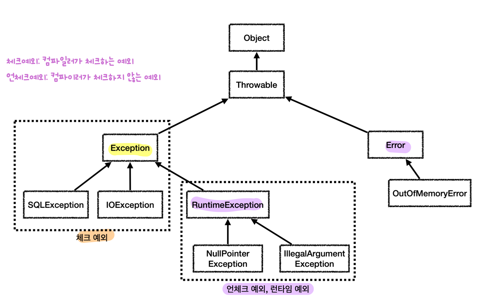

## 예외 계층

- `Object`: 모든 객체의 최상위 부모
- `Throwable`: 최상위 예외, **잡으면 안됨** (`Error`까지 잡히므로)
	- `Error`
		- 애플리케이션에서 **복구 불가능한 시스템 예외** (메모리 부족, 심각한 시스템 오류...)
		- 애플리케이션 개발자는 이 예외를 **잡지 않아야 함**
		- **언체크 예외**
	- **`Exception`**: **체크 예외** (런타임 예외 제외), 애플리케이션에서 개발자가 **잡아야 할** 실질적최상위 예외
		- **`RuntimeException`**: **언체크 예외**
## 체크예외 VS 언체크 예외
- 핵심
	- 언체크 예외는 **`throws`** 선언하지 않고 **생략 가능** (**자동 예외 던지기**)
	- 나머지는 동일
- 체크 예외
	- **컴파일러가 체크**하는 예외
	- 체크 예외의 장단점
		- 예외를 누락하지 않도록 **컴파일러**가 안전 장치 역할
		- **크게 신경쓰지 않고 싶은 예외**까지 모두 반드시 잡거나 던져야 함
- 언체크 예외
	- **컴파일러가 체크하지 않는** 예외
	- 중요 예외의 경우 `throws`를 선언해두면 IDE를 통해 개발자가 편리하게 인지 가능 (보통은 생략)
	- 언체크 예외의 장단점
		- 신경쓰고 싶지 않은 언체크 **예외 무시 가능**
		- 개발자가 실수로 **예외 누락 가능**
## 예외 처리 기본
- **기본 규칙**
	1. 예외는 **잡아서 처리하거나 던져야 한다**
		- 예외를 잡는 코드: `catch`
		- 예외를 던지는 코드: `throws`
	2. 예외를 잡거나 던질 때 **지정한 예외 뿐만 아니라 그 예외의 자식들도 함께 처리**된다
- 기본적으로 **언체크(런타임) 예외**를 사용하자
	- **체크 예외들은 바깥으로 던져야 하는데** 이 과정에서 **의존 관계 문제** 발생
		- 실무에서 발생하는 **대부분의 예외는 복구 불가능**한 시스템 예외 (애플리케이션 단에서 처리 불가)
			- 서블릿 오류 페이지, 스프링 MVC `ControllerAdvice` 예외 공통 처리 
			  (별도 로그, 슬랙, 문자, 메일을 통해 개발자가 빠르게 인지)
			- API는 상태코드 500 응답
		- **의존 관계 문제**
			- 컨트롤러, 서비스는 **본인이 처리할 수 없어도** **`throws`를 선언**해 예외를 던져야 함
			- **컨트롤러, 서비스가 해당 체크 예외에 의존**하게 되어 구현 기술 변경 시 **OCP 위반**
			- 예를 들어, DB 접근 기술을 변경한다면 예외를 포함한 컨트롤러, 서비스 코드를 수정
	- **런타임 예외**를 사용하면 처리할 수 없는 예외를 **별도 선언 없이 그냥 두면 됨**
		- 의존성 발생 X -> 기술 변경이 있어도 컨트롤러, 서비스 코드 변경 X -> **OCP 준수**
	- **대부분의 최근 라이브러리는 런타임 예외**를 기본으로 제공 (스프링, JPA...)
	- 다만, 런타임 예외는 놓칠 수 있기 때문에 **문서화가 중요** (혹은 명시적으로 코드에 **`throws`** 남기기)
- 체크 예외는 **비즈니스 로직상 의도적으로 던지는 예외**에만 사용
	- 매우 심각한 문제는 개발자가 실수로 예외를 놓치면 안된다고 판단할 수 있음
	- 체크 예외 예시 (무조건 해야하는 건 아님)
		- 계좌 이체 실패 예외
		- 결제시 포인트 부족 예외
		- 로그인 ID, PW 불일치 예외
- **`Exception`을 던지지 말자**
	- 코드가 깔끔해지는 것 같지만, 모든 체크 예외를 다 던져 버려서 **중요한 체크 예외를 놓침**
	- 꼭 필요한 경우가 아니면 `Exception` 자체를 밖으로 던지는 것은 좋은 방법이 아님
- **스택 트레이스를 남기자**
	- 로그 남기기
		- `log.info("예외 처리, message={}", e.getMessage(), e);`
		- **로그의 마지막 인수에 예외 객체 전달**하면 로그에 스택 트레이스를 출력
	- 예외를 전환할 때는 **반드시 기존 예외를 포함**하자
		- `throw new RuntimeSQLException(e);` - **기존 예외 `e` 포함**
		- 덕분에 기존 예외와 스택 트레이스까지 확인 가능
		- 포함하지 않으면 실제 DB에서 근본적으로 발생한 예외를 확인할 수 없는 **심각한 문제 발생**

>예외를 계속 던지면 벌어지는 상황
>
>- **자바 `main()` 쓰레드**의 경우 예외 로그를 출력하면서 **시스템이 종료**
>- **웹 애플리케이션**의 경우 **WAS가 예외를 받아 처리**하고 개발자가 **지정한 오류 페이지** 보여줌 
>  (예외 하나로 시스템이 종료되면 안됨)