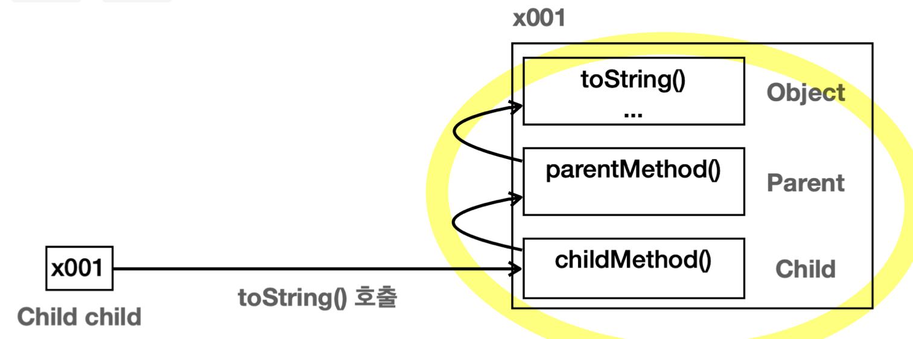

## java.lang 패키지
- 자바 언어를 이루는 **가장 기본이 되는 클래스들을 보관**하는 **패키지**
- 모든 자바 애플리케이션에서 자동으로 import됨 (**import 생략 가능**)
- 대표 클래스
	- `Object`: 모든 자바 객체의 부모 클래스
	- `String`: 문자열
	- `Integer`, `Long`, `Double`: 래퍼타입, 기본형 데이터 타입을 객체로 만든 것
	- `Class`: 클래스 메타 정보
	- `System`: 시스템과 관련된 기본 기능들 제공
## Object 클래스
- 자바에서 모든 클래스의 **최상위 부모 클래스**
- 클래스에 상속 받을 부모 클래스가 없으면 **묵시적으로 `Object` 클래스를 상속 받음**
	- `public class Parent {...}` == `public class Parent extends Object {...}`
- 묵시적 상속으로 인해 `Object`는 **메모리에도 함께 생성**됨
	
- `Object` 클래스가 최상위 부모 클래스인 이유
	- **공통 기능 제공**
		- 모든 객체에 필요한 기본 기능을 구현
		- 모든 개발자들이 직접 만들 필요 없이 **일관성** 있게 사용 & 프로그래밍이 **단순화**
			- Object가 없다면 수많은 개발자들이 유사한 공통 부모 클래스를 구현해 일관성 X...
	- **다형성의 기본 구현** (한계 존재)
		- 다형성의 올바른 활용 = 다형적 참조 + 메서드 오버라이딩
			- 장점: 다형적 참조 가능
				- **모든 객체를 다 담을 수 있으므로**, 다양한 타입의 객체를 **통합적으로 처리** 가능
			- 한계: 메서드 오버라이딩 불가
				- 자식 클래스의 기능을 사용하려면 다운캐스팅을 해야만 함
				- `toString` 같은 **`Object`가 보유한 메서드는 당연히 오버라이딩 가능**
- 제공 메서드
	- `toString()`: 객체의 정보를 문자열 형태로 제공
		- 기본 로직: 패키지 포함 객체의 이름 + 16진수화된 객체의 참조값 (해시 코드)
		- **IDE를 통해 재정의하면 편리**
		- 참고) `System.out.println()` 메서드 내부에서 호출됨
			- `public void println(Object x) {...}`
			- -> `String.valueOf(x)` -> `(obj == null) ? "null" : obj.toString()`
			- **다형성을 활용한 OCP의 좋은 예**
				- `Object`를 인자로 받아 다형적 참조
				- Open: toString을 오버라이딩해 **기능 확장**
				- Closed: 클라이언트 코드인 `println()`은 **변경 X**
				- -> 덕분에 세상 모든 객체의 정보를 편리하게 출력 가능
	- `equals()`: 객체의 같음을 비교 (**동등성 비교**)
		- "두 객체가 같다"는 2가지 의미
			- **동일성**(Identity)
				- 두 객체가 **참조값이 같은 동일한 객체**인지 확인 (`==`)
				- **자바 머신** 기준, 메모리 참조, **물리적**
			- **동등성**(Equality)
				- 두 객체가 **논리적으로 동등**한지 확인 (`equals()`)
				- **사람** 기준, **논리적**
		- 기본 로직: `==` 동일성 비교 제공
		- **동등성 개념은 각각의 클래스마다 다르기 때문에**, 동등성이 필요한 경우 **재정의** (**IDE 활용**)
	- `getClass()`: 객체의 클래스 정보를 제공
	- `hashCode()`
	- `clone()`: 객체 복사 (잘 사용 X)
	- `notify()`, `notifyAll()`, `wait()`: 멀티 쓰레드용 메서드
	- ...

>객체의 참조값 출력
>
>`toString()`의 기본 사용 이외에 다음 코드를 사용하면 **객체의 참조값을 직접 출력**할 수 있다.
>
>**`String refValue = Integer.toHexString(System.identityHashCode(dog1));`**
>`System.out.println("refValue = " + refValue);`
> 
> 출력값: refValue = 72ea2f77

>`equals()` 메서드 구현 시 지켜야할 규칙 (중요 X)
>
>**반사성(Reflexivity)**: 객체는 자기 자신과 동등해야 한다. ( `x.equals(x)` 는 항상 `true` ).
>**대칭성(Symmetry)**: 두 객체가 서로에 대해 동일하다고 판단하면, 이는 양방향으로 동일해야 한다. (`x.equals(y)` 가 `true` 이면 `y.equals(x)` 도 `true` ).
>**추이성(Transitivity)**: 만약 한 객체가 두 번째 객체와 동일하고, 두 번째 객체가 세 번째 객체와 동일하다면, 첫 번째 객체는 세 번째 객체와도 동일해야 한다.
>**일관성(Consistency)**: 두 객체의 상태가 변경되지 않는 한, `equals()` 메소드는 항상 동일한 값을 반환해야 한다.
>**null에 대한 비교**: 모든 객체는 `null` 과 비교했을 때 `false` 를 반환해야 한다.

## 불변 객체
- 핵심: **불변이라는 단순한 제약을 사용해 사이드 이펙트라는 큰 문제 막을 수 있음**
- 참조형 객체 공유의 문제
	- 기본형과 참조형의 공유
		- 기본형(Primitive Type): 하나의 값을 **여러 변수에서 절대로 공유하지 않음** (값 복사 후 대입)
		- 참조형(Reference Type): 하나의 객체를 참조값을 통해 **여러 변수에서 공유 가능**
	- 따라서, **참조형은 사이드 이펙트 발생 가능성이 높음**
		- 사이드 이펙트: 특정 변경이 의도치 않게 다른 부분에 영향을 미침
		- **디버깅이 어려움** & **코드 안정성 저하**
	- 또한, **여러 변수가 하나의 객체를 공유하는 것을 막을 방법 X**
		- 객체 공유는 개발자가 변수마다 인스턴스를 생성하여 방지 가능
		- 하지만 자바 문법상 참조형 변수 대입은 문제 없기 때문에, 객체 공유를 완벽히 막을 방법은 없음
		- 참조형 변수 대입 (`Address b = a`) -> 여러 변수가 하나의 객체 공유
	- 사실 근본 원인은 객체를 공유한 것이 아니라 **공유될 수 있는 객체의 값을 변경한 것이 문제**
	- 결론: **객체의 값을 변경하지 못하게 설계**하면 사이드 이펙트 원천 차단 가능
- **불변 객체** (Immutable Object)
	- 객체의 **상태가 변하지 않는** 객체 (객체 내부의 값, 필드, 멤버 변수)
	- 설계 전략: **생성자**를 통해서만 **값을 설정**하고, 이후 값 변경 막기
		- 내부 필드를 **`final`로 선언**
		- **`setXxx()` 메서드 제거**
			- 개발자는 컴파일 오류 변경 메서드가 없다는 사실 인지 -> 어쩔 수 없이 새 인스턴스 생성
		- **값 변경** 필요 시 **계산 결과를 새로운 객체로 만들어 반환**
			- 기존 값은 변경 X, 계산 결과를 바탕으로 새로운 객체 만들어 반환
			  (**불변 유지 + 새로운 결과**)
			- 불변 객체의 변경 관련 메서드들은 보통 새 객체를 만들어 반환하므로 **반환 값을 받아야 함**
	- 불변 객체 예시 코드
		```java
		public class ImmutableAddress {
		    
		    private final String value;
		    
		    public ImmutableAddress(String value) {
		        this.value = value;
			}
			
			public String getValue() {
			    return value;
			}
			
			@Override
			public String toString() {
			    return "Address{" +
		            "value='" + value + '\'' +
		            '}';
		    }
		}
		```
	- 불변 객체 값 변경 예시 코드
		```java
		public class ImmutableObj {
		    
		    private final int value;
		    
		    public ImmutableObj(int value) {
		        this.value = value;
			}
		    
		    public ImmutableObj add(int addValue) {
		        int result = value + addValue;
		        return new ImmutableObj(result);
			}
		    
		    public int getValue() {
		        return value;
			}
		}
		```
- 불변 객체의 의의
	- **자바가 기본으로 제공하는 수많은 클래스들은 불변으로 설계**되어 있음
	- **가변 클래스가 더 일반적**이고, **불변 클래스**는 값을 변경하면 안되는 **특별한 경우에 만들어서 사용**
		- 같은 기능의 클래스를 하나는 불변, 하나는 가변으로 각각 만드는 경우도 있음
		- 활용 예시
			- 캐시 안정성
			- 멀티 쓰레드 안정성
			- 엔터티의 값 타입 설정에 유용

>가변 객체 vs 불변 객체
>
>가변 객체 (Mutable): 처음 만든 이후로 상태가 변할 수 있는 객체
>불변 객체 (Mutable): 처음 만든 이후로 상태가 변하지 않는 객체

>**`withXxx()` 네이밍 컨벤션**
>
>불변 객체에서 값을 변경하는 경우, 메서드 이름이 "with"로 시작하는 경우가 많다.
>이는 **원래의 상태를 변경하여 새로운 변형을 만든다**는 의미를 함유한다. (= coffee with sugar)
>즉, **원본 객체의 상태가 그대로 유지됨을 강조하면서 변경사항을 새 복사본에 포함하는 과정을 간결하게 표현**하는 것이고, 불변 객체의 변경 메서드 내용은 이와 잘 어울린다.

## String 클래스
- **문자열을 편리하게 다룰 수 있도록 기능 제공** (`char[]`로 여러 문자를 직접 다루는 불편함을 해소)
- 클래스이므로 **참조형** 문자열 객체 생성
- `String` 클래스를 통한 문자열 생성 방법
	- 쌍따옴표 사용: `"hello"`
	- 객체 생성: `new String("hello");`
- 문자열은 매우 자주 다루어지므로, 편의상 `""`, `+` 등의 연산을 제공해 문자열 처리
- 문자열 비교
	```java
	public class StringEqualsMain1 {
		public static void main(String[] args) {
			String str1 = new String("hello");
			String str2 = new String("hello");
			System.out.println("new String() == 비교: " + (str1 == str2));
			System.out.println("new String() equals 비교: " + (str1.equals(str2)));
	
			String str3 = "hello";
			String str4 = "hello";
			System.out.println("리터럴 == 비교: " + (str3 == str4));
			System.out.println("리터럴 equals 비교: " + (str3.equals(str4)));
		} 
	}
	
	// 실행 결과
	// new String() == 비교: false
	// new String() equals 비교: true
	// 리터럴 == 비교: true
	// 리터럴 equals 비교: true
	```
	- 결론: **항상 `equals()` 동등성 비교해야 함**
		- `String` 인스턴스는 **`new String()`** 혹은 **문자열 리터럴**로 만들어질 수 있음
		- 메서드를 사용할 때 `String` 타입 인자로 **둘 중 무엇이 들어올지 알 수 없기 때문**
	- **`new String()`** 끼리 비교 시: **동일성 비교 실패** & 동등성 비교 성공
		- 서로 다른 인스턴스이므로 동일성 비교 실패
		- `String` 클래스는 동등성 비교를 할 수 있도록 `equals()` 메서드를 재정의해둠
	- **문자열 리터럴** 끼리 비교 시: **동일성 비교 성공** & 동등성 비교 성공
		
		- **문자열 리터럴을 사용하는 경우**, 자바는 **메모리 효율성**과 **성능 최적화**를 위해 **문자열 풀**을 사용
			- 문자열 풀은 **힙 영역**을 사용하며 **메모리 사용**과 **문자를 만드는 시간**을 **줄임**
			- 자바는**로딩 시점**에 클래스들을 읽어들이면서 
				- 클래스에 문자열 리터럴이 있으면 문자열 풀에 `String` 인스턴스를 **미리 생성**해둠
				- 이 때, 같은 문자열이 있으면 만들지 않음
			- **실행 시점**에 문자열 **리터럴**을 사용하면, **문자열 풀에서 `String` 인스턴스를 찾음**
				- 해시 알고리즘을 사용해 매우 빠르게 인스턴스를 찾음
				- `String str3 = "hello"`, `String str4 = "hello"`은 같은 참조값 사용
				- -> 동일성 비교 성공
- `String`은 **불변 객체**로 설계됨
	- 생성 이후 내부 문자열 값을 변경 불가 & 변경 관련 메서드도 새로운 `String` 객체를 만들어 반환
	- 불변으로 설계된 이유
		- **사이드 이펙트를 막기 위해**
		- **문자열 풀**에 있는 `String` 인스턴스 값 변경 -> **같은 문자열을 참조하는 다른 변수도 함께 변경**
- 구조
	```java
	public final class String {
		//문자열 보관
		private final char[] value; // 자바 9 이전 
		private final byte[] value; // 자바 9 이후
	
		//여러 메서드
		public String concat(String str) {...}
		public int length() {...}
		...
	}
	```
	- 문자열 보관
		- Java 9 이후에는 **메모리를 더 효율적으로 사용**하기 위해 **문자열 보관**에 **`byte[]`** 사용
			- `char`는 문자 하나당 무조건 2byte를 차지
			- 다만, 영어, 숫자는 보통 1byte 표현 가능하고 나머지는 2byte UTF-16 인코딩 사용 가능
	- 주요 메서드
		- `length()` : 문자열의 길이를 반환
		- `charAt(int index)` : 특정 인덱스의 문자를 반환
		- `indexOf(String str)` : 특정 문자열이 시작되는 인덱스를 반환
		- `substring(int beginIndex, int endIndex)` : 문자열의 부분 문자열을 반환
		- `contains(CharSequence s)` : 문자열이 특정 문자열을 포함하고 있는지 확인
		- `toLowerCase()` , `toUpperCase()` : 문자열을 소문자 또는 대문자로 변환
		- `trim()` : 문자열 양 끝의 공백을 제거
		- `concat(String str)` : 문자열을 더함 (**`+` 연산도 `concat` 사용**)
		- `valueOf(Object obj)` : 다양한 타입을 문자열로 변환 (숫자, 불리언, 객체...)
		- `format(String format, Object... args`
			- e.g.1 `String.format("num: %d, bool: %b, str: %s", num, bool, str);`
			- e.g.2 `String.format("숫자: %.2f", 10.1234); //10.12`
			- e.g.3 `System.out.printf("숫자: %.2f\n", 10.1234); //10.12`
		- `split(String regex)` : 문자열을 정규 표현식을 기준으로 분할
		- `join(CharSequence delimiter, CharSequence... elements)` : 주어진 구분자로 여러 문자열을 결합
			- e.g.1 
				- `String.join("-", "A", "B", "C"); //A-B-C`
			- e.g.2 
				- `String[] splitStr = str.split(",");`
				- `String.join("-", splitStr);`
- **자바의 `String` 최적화**
	- 불변 String 클래스의 단점
		```java
		String str = "A" + "B" + "C" + "D";
		String str = String("A") + String("B") + String("C") + String("D");
		String str = new String("AB") + String("C") + String("D");
		String str = new String("ABC") + String("D");
		String str = new String("ABCD");
		```
		- 문자를 더하거나 변경할 때 마다 **계속해서 새로운 객체를 생성**
			- `new String("AB")`, `new String("ABC")` 는 제대로 사용되지도 않고, GC 대상
			- 많은 CPU, 메모리 자원 소모
	- **`StringBuilder`는 성능과 메모리면에서 효율적** (가변 `String`)
		- `StringBuilder` 는 내부에 `final` 이 아닌 **변경할 수 있는 `byte[]`** 을 가짐
		- 가변은 **사이드 이펙트에 유의**해 사용해야 함
		- 문자열을 변경하는 동안만 사용하다가 **변경이 끝나면 안전한(불변) `String` 으로 변환할 것**
		- 예시 코드 1
			```java
			public class StringBuilderMain {
			    public static void main(String[] args) {
			    
			        StringBuilder sb = new StringBuilder();
			        sb.append("A");
			        sb.append("B");
			        sb.append("C");
			        sb.append("D");
				    System.out.println("sb = " + sb); //ABCD
			         
			        sb.insert(4, "Java");
			        System.out.println("insert = " + sb); //ABCDJava
			        
			        sb.delete(4, 8); 
			        System.out.println("delete = " + sb); //ABCD
			        
			        sb.reverse(); 
			        System.out.println("reverse = " + sb); //DCBA
			        
			        //StringBuilder -> String
			        String string = sb.toString();
			        System.out.println("string = " + string); //DCBA
			    }
			}
			```
		- 예시 코드 2 (메서드 체이닝)
			```java
			public class StringBuilderMain1_2 {
			    
			    public static void main(String[] args) {
			        StringBuilder sb = new StringBuilder();
			        String string = sb.append("A").append("B").append("C").append("D")
			                .insert(4, "Java")
			                .delete(4, 8)
			                .reverse()
			                .toString();
			        System.out.println("string = " + string);
			    }
			}
			```
	- **실무 사용 전략**
		- **대부분의 경우 최적화가 되므로 `+` 연산 사용**
			- 문자열 리터럴 최적화
				- **자바 컴파일러**는 문자열 리터럴 더하기를 **자동으로 합쳐줌**
					- 컴파일 전: `String helloWorld = "Hello, " + "World!";`
					- 컴파일 후: `String helloWorld = "Hello, World!";`
				- 런타임에 별도 문자열 결합 연산을 수행하지 않으므로 성능 향상
			- `String` 변수 최적화
				- 문자열 변수의 경우 안에 어떤 값이 들어있는지 컴파일 시점에는 알 수 없음
				- 따라서 **컴파일러**가 **`StringBuilder()`를 사용해 자동으로 최적화**
					- `String result = str1 + str2;`
					- -> `String result = new StringBuilder().append(str1).append(str2).toString();`
		- **최적화가 어려운 경우**에만 **`StringBuilder`** 사용
			- **루프 안에서 문자열을 더하는 경우**, 최적화가 이루어지지 않음
				```java
				String result = "";
				for (int i = 0; i < 100000; i++) {
					result += "Hello Java ";
				}
				
				//의도와 다르게 최적화되는 코드
				//String result = "";
				//for (int i = 0; i < 100000; i++) {
				//	result = new StringBuilder().append(result).append("Hello Java").toString();
				//}
				```
				- 컴파일러가 반복을 예측할 수 없음
				- 따라서, 최적화에 실패하고 대략 10만번 문자열 객체를 생성할 것 (2490ms)
			- 이런 경우, **직접 `StringBuilder` 사용할 것** (3ms)
				```java
				StringBuilder sb = new StringBuilder();
				for (int i = 0; i < 100000; i++) {
				    sb.append("Hello Java ");
				}
				String result = sb.toString();
				```
			- **최적화가 어려운 경우**
				- 반복문에서 반복해서 문자 연결 (1000번 넘게 간다 싶을 때 빌더 사용)
				- 조건문을 통해 동적으로 문자열 조합
				- 복잡한 문자열의 특정 부분 변경
				- 매우 긴 대용량 문자열 다루기

>`CharSequence`
>
>`CharSequence`는 `String`, `StringBuilder`의 상위 타입이다. 문자열을 처리하는 다양한 객체를 받을 수 있다.

>`StringBuilder` VS `StringBuffer`
>
>`StringBuffer`는 `StringBuilder`와 똑같은 기능을 수행한다.
>차이점은 `StringBuffer`는 내부에 동기화가 되어 있어서, **멀티쓰레드 상황에 안전**하다. 물론, 동기화 오버헤드로 인해 성능은 느리다.

>메서드 체이닝 (Method Chaining)
> 
> **메서드 호출의 결과**로 **자기 자신의 참조값을 반환**하도록 설계하는 것이다. (**`return this;`**)
> 이 경우, 반환된 참조값을 사용해서 **`.`을 찍고 메서드 호출을 계속 이어갈 수 있다.**
> 
> `StringBuilder`를 포함해 자바의 라이브러리와 오픈 소스들이 종종 사용한다.
> 메서드 체이닝은 **코드를 간결하고 읽기 쉽게 만들어주는 효과**가 있다.

>문자열 뒤집기
>
>**`StringBuilder`의 `reverse()`를 사용**하면 편리하게 문자열을 역순으로 얻을 수 있다.
>
>`String reversed = new StringBuilder(str).reverse().toString();`

## 래퍼 클래스 (Wrapper Class)
- **기본형을 감싸서 만드는 클래스** (=기본형의 객체 버전)
	- 기본형(Primitive Type)이 객체가 아니어서 발생하는 한계
		- 객체 지향의 장점을 살릴 수 없음
			- 메서드 제공 X, 객체 참조가 필요한 컬렉션 프레임워크 사용 불가, 제네릭 사용 불가
		- `null` 값을 가질 수 없음
			- `데이터가 없음`이라는 상태도 필요성이 있는데 불가능
	- 래퍼 클래스는 **기본형의 한계를 해결**
- **자바**는 기본형에 대응하는 **래퍼 클래스를 기본 제공**
	- 특징
		- **불변 객체**로 설계됨
		- **`equals()`로 비교**해야 함 (`==`는 참조형이라 안맞음)
		- `equals()`와 `toString()`은 재정의 되어 있음
	- 박싱(Boxing)
		- 기본형을 **래퍼 클래스로 변경**하는 것
		- e.g. `Integer.valueOf(10)`
		- **`valueOf(...)` 사용 권장**
			- 성능 최적화 기능 존재
				- `Integer`의 경우 개발자들이 일반적으로 자주 사용하는 **-128 ~ 127 범위**
				- 해당 범위의 `Integer` 객체를 **미리 생성**해두고 **조회시 미리 생성된 값 반환** (**캐싱**)
				- 해당 범위가 아닌 값을 조회시 `new Integer()`를 호출
			- `valueOf`는 **내부에서 `new Integer(...)`을 사용**해 객체를 생성하고 돌려줌
				- `new Integer(10)` 방식은 향후 자바에서 제거될 예정이므로, **직접 사용 X**
	- 언박싱(Unboxing)
		- 래퍼 클래스에 들어있는 **기본형 값을 다시 꺼내는 것**
		- `intValue()`, `longValue()` 등의 메서드 사용
	- 오토 박싱(Auto-boxing)
		- **컴파일러**가 개발자 대신 **`valueOf`, `xxxValue()` 등의 코드를 추가**해주는 기능 (컴파일 단계)
		- 기본형과 래퍼형의 **편리한 변환** 가능
		- 자바는 1.5부터 오토박싱, 오토 언박싱 지원
		- 예시
			- `int value = 7;`
			- `Integer boxedValue = value; // 오토 박싱(Auto-boxing)`
			- `int unboxedValue = boxedValue; // 오토 언박싱(Auto-Unboxing)`
	- 주요 메서드
		- `valueOf()` : **래퍼 타입**을 반환 (숫자, 문자열을 모두 지원)
		- `parseInt()` : **기본형** 반환 (문자열 전용, `parseXxx`)
		- `compareTo()` : 내 값과 인수로 넘어온 값을 **비교** (내 값이 크면 `1` ,같으면 `0` , 작으면 `-1` 을 반환)
		- `Integer.sum()` , `Integer.min()` , `Integer.max()` : **`static` 메서드**
- **래퍼 클래스 실무 사용 전략**
	- **CPU 연산을 많이 수행하는 특수한 경우**에만 **기본형 사용**해 최적화 (수만~수십만 이상 연속한 연산)
	- 이외에는 **코드 유지보수에 더 나은 방향 선택** 
		- 최신 컴퓨터는 매우 빠르므로 적은 연산 차이는 실질적 도움 X
		- 성능 최적화는 대부분 더 많은 복잡한 코드 요구
		- 특히 **웹 애플리케이션의 경우 네트워크 호출을 한 번 줄이는 게 더 효과적**
			- 메모리 내 연산 하나보다 네트워크 호출 한 번이 많게는 수십만배 더 오래 걸림
		- 개발 이후 성능 테스트 해보고 **정말 문제가 되는 부분을 찾아 최적화**
	- 기본형과 래퍼 클래스의 성능 차이 (`Integer` 기준)
		- 속도
			- 10억번 누적합을 구하는 시나리오
			- 기본형 연산은 래퍼 클래스 연산보다 5배 빠름 (318ms VS 1454ms)
		- 메모리 차이
			- 기본형: 4byte
			- 래퍼 클래스: 4byte + 8~16byte (내부 필드 기본형 값 + 객체 메타데이터)
## Class 클래스
- 클래스의 정보(**메타데이터**)를 다루는데 사용
- **런타임**에 필요한 **클래스의 속성과 메서드 정보를 조회하고 조작** 가능
- 주요 기능
	- 타입 정보 얻기: 클래스의 이름, 슈퍼클래스, 인터페이스, 접근 제한자 등과 같은 정보를 조회
	- 리플렉션: 클래스에 정의된 메서드, 필드, 생성자 등을 조회하고, 이들을 통해 객체 인스턴스를 생성하거나 메서드 를 호출하는 등의 작업 가능
	- 동적 로딩과 생성: `Class.forName()` 메서드를 사용하여 클래스를 동적으로 로드하고, `newInstance()` 메서드를 통해 새로운 인스턴스를 생성
	- 애노테이션 처리: 클래스에 적용된 애노테이션(annotation)을 조회하고 처리하는 기능을 제공
- 주요 메서드
	- 클래스 객체 조회
		- `Class clazz = String.class; // 1.클래스에서 조회`
		- `Class clazz = new String().getClass(); // 2.인스턴스에서 조회`
		- `Class clazz = Class.forName("java.lang.String"); // 3.문자열로 조회`
	- 클래스 객체 메서드
		- `getDeclaredFields()`: 클래스의 모든 필드를 조회
		- `getDeclaredMethods()`: 클래스의 모든 메서드를 조회
		- `getSuperclass()`: 클래스의 부모 클래스를 조회
		- `getInterfaces()`: 클래스의 인터페이스들을 조회
- 리플렉션 예시: 클래스 메타 정보 기반 인스턴스 생성하기
	- `Class helloClass = Hello.class;`
	- `Hello hello = (Hello) helloClass.getDeclaredConstructor().newInstance();`

>class VS clazz
>
>class는 **자바의 예약어**이므로, 패키지명 및 변수명으로 사용할 수 없다. 
>자바 개발자들은 이를 대신하여 **clazz를 관행으로 사용한다.**

## System 클래스
- **시스템**과 관련된 기본 기능들 제공
- 주요 기능
	- `System.in` , `System.out` , `System.err`: 표준 입력, 표준 출력, 오류 스트림
	- `System.currentTimeMillis()`, `System.nanoTime()`: 밀리초, 나노초 단위 **현재 시간** 제공
	- `System.getenv()`: OS에서 설정한 **환경 변수**의 값 제공
	- `System.getProperties()`: 현재 모든 시스템 속성 제공 (자바에서 사용하는 설정 값)
	- `System.getProperty(String key)`: 특정 시스템 속성 제공
	- `System.exit(int status)`: 프로그램 종료 및 OS에 프로그램 종료의 상태 코드 전달 (**사용 지양**)
		- 상태코드 `0`: 정상종료
		- 상태 코드 `0` 이 아님: 오류나 예외적인 종료
	- `System.arraycopy`: **배열 고속 복사**
		- **시스템 레벨에서 최적화된 메모리 복사 연산** 사용
		- 직접 반복문 을 사용해서 배열을 복사할 때 보다 수 배 이상 **빠른 성능**을 제공
		- e.g. `System.arraycopy(originalArray, 0, copiedArray, 0, originalArray.length);`
## Math, Random 클래스
- `Math` 클래스
	- 다양한 수학 문제를 해결해주는 클래스
	- 주요 메서드
		- `abs(x)` : 절대값
		- `max(a, b)` : 최대값 
		- `min(a, b)` : 최소값
		- `exp(x)` : e^x 계산 
		- `log(x)` : 자연 로그
		- `log10(x)` : 로그 10 
		- `pow(a, b)` : a의 b제곱
		- `ceil(x)` : 올림
		- `floor(x)` : 내림
		- `round(x)` : 반올림
		- `sqrt(x)` : 제곱근
		- `cbrt(x)` : 세제곱근
		- `random()` : 0.0과 1.0 사이의 무작위 값 생성 (`double` 값)
- `Random` 클래스 (`java.util` 패키지)
	- `Math.random()` 보다 **다양한 랜덤값**을 구할 수 있도록 기능 제공
		- `Math.random()`도 내부에서는 `Random` 클래스 사용
	- `Random` 객체 생성 방법
		- 기본 생성자
			- `Random random = new Random();`
			- 생성자를 비워두면 **씨드값을 자동 생성**해 사용 (매 반복마다 결과가 달라짐)
				- `System.nanoTime()` + 여러가지 복잡한 알고리즘 => 씨드값을 생성
		- 생성자의 Seed 전달
			- `Random random = new Random(1);`
			- 랜덤은 **내부에서 씨드값을 사용**해 랜덤값을 구함
			- **씨드값이 같으면 항상 같은 결과를 출력**
	- 주요 메서드
		- `random.nextInt()` : 랜덤 `int` 값을 반환
			- `nextInt(int bound)` : `0` ~ `bound` 미만의 숫자를 랜덤으로 반환
				- 예를 들어서 3을 입력하면 `0, 1, 2` 를 반환한다.
			- 활용: 1 ~ 10 까지 반환하기
				- `random.nextInt(10) + 1`
		- `nextDouble()` : `0.0d` ~ `1.0d` 사이의 랜덤 `double` 값을 반환
		- `nextBoolean()` : 랜덤 `boolean` 값을 반환

>정밀 계산에는 `BigDecimal`을 활용하자.

## 열거형 - Enum
- 단순 문자열 처리는 오타나 유효하지 않은 값이 입력될 수 있어 **타입 안정성이 떨어짐** (**컴파일 오류 감지 X**)
	- e.g. 회원 등급 별 할인 - `DIAMOND`, `GOLD`, `BASIC`
	- **특정 범위로 값 제한 필요**
- 해결 과정 단계
	- 1단계: 문자열 상수 처리
		- e.g. `public static final String BASIC = "BASIC"`
		- 장점: 문자열 상수를 사용하면 유효하지 않은 값에 대해 **컴파일 오류 발생**
		- 단점: 개발자가 실수로 정의해둔 문자열 상수를 사용하지 않으면, **여전히 직접 문자열 입력 가능**
			- `public int discount(String grade, int price) {}`
			- 위 코드를 보면 개발자는 당연히 모든 문자열을 입력할 수 있다고 생각하게 됨
	- 2단계: **타입 안전 열거형 패턴** (**Type-Safe Enum Pattern**)
		```java
		public class ClassGrade {
			public static final ClassGrade BASIC = new ClassGrade();
		    public static final ClassGrade GOLD = new ClassGrade();
		    public static final ClassGrade DIAMOND = new ClassGrade();

			private ClassGrade() {}
		}
		```
		- 핵심: **나열한 항목만 사용할 수 있게 제한**
			- 애플리케이션 로딩 시점에(static) 각각의 상수에 별도 **인스턴스를 생성해 구분**
			- 외부에서 `new ClassGrade()` 생성 및 전달을 막기 위해 **private 생성자**를 둠
		- 장점
			- **타입 안정성 및 데이터 일관성 향상** (**컴파일 오류 체크 가능**)
				- `public int discount(ClassGrade classGrade, int price) {}`
				- 사전에 정의해둔 인스턴스만 사용할 수 있음
			- `==` 동일성 비교 가능 (문자열 처리 시 `equals()`를 사용해야 했음)
		- 단점: 많은 코드 작성 & private 생성자 추가 유의점
	- 3단계: **열거형** (**Enum Type**)
		- 타입 안전 열거형 패턴을 쉽게 사용할 수 있도록 **프로그래밍 언어에서 지원**
		- **예상 가능한 집합을 표현**하는 데 사용
			- Enumeration(in 프로그래밍): 상수들을 사용하여 코드 내에서 미리 정의된 값들의 집합
		- **타입 안정성** 및 **코드 가독성** 향상
		- **`static import` 사용 시 가독성 더욱 향상**
		- 기본 사용법
			```java
			public enum Grade {
			    BASIC, GOLD, DIAMOND
			}
			```
			- 열거형도 (제약이 추가된) **클래스** (`class` 대신 `enum` 키워드를 사용할 뿐)
			- 열거형은 자동으로 **`java.lang.Enum`을 상속 받음** (`extends Enum`, 추가 상속 불가)
			- **외부 임의 생성 불가** (private 생성자)
			- **인터페이스 구현이 가능**
			- 열거형에 추상 메서드 선언 및 구현 가능 (익명 클래스와 같은 방식 사용)
		- 주요 메서드
			- `values()`: 모든 ENUM 상수를 포함하는 **배열을 반환**
			- Enum 상수
				- `valueOf(String name)`: 주어진 이름과 **일치**하는 ENUM 상수를 반환
				- `name()`: **ENUM 상수의 이름**을 문자열로 반환
				- `ordinal()`: ENUM 상수의 선언 순서(0부터 시작)를 반환 (**사용 지양**)
					- 중간에 상수 선언 위치가 변경되면 전체 상수 위치가 모두 변경됨
				- `toString()`: 
					- **ENUM 상수의 이름**을 문자열로 반환 
					- `name()` 메서드와 유사하지만, `toString()` 은 직접 오버라이드 가능
		- 객체 지향적 예시코드
			```java
			public enum Grade {
			    BASIC(10), GOLD(20), DIAMOND(30);
			    
			    private final int discountPercent;
			    
			    Grade(int discountPercent) {
			        this.discountPercent = discountPercent;
			    }
			    
			    public int getDiscountPercent() {
			        return discountPercent;
				}
			
				public int discount(int price) {
			        return price * discountPercent / 100;
			    }
			}
			```
			- 할인율은 등급에 의해 정해짐 (캡슐화 필요)
			- Grade 클래스 내 **필드 추가**하고 **생성자를 통해 필드 값 저장**
			- 열거형은 접근제어자 선언을 막아두었기 때문에, **생성자 선언**은 **private이 적용**
			- **상수 끝에 생성자에 맞는 인수를 전달**하면 **적절한 생성자가 호출됨** (`BASIC(10)`)
			- 열거형도 클래스이므로 **메서드 추가 가능** (`getDiscountPercent()`)
