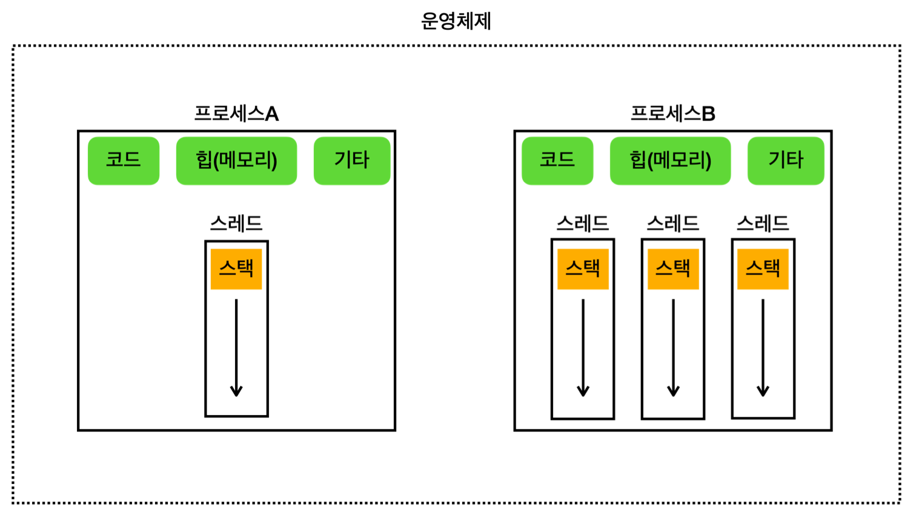

## 멀티태스킹 & 멀티프로세싱
- 프로그램 실행
	- 프로그램을 구성하는 **코드를 순서대로 CPU(=프로세서)에서 연산**하는 일
- 초창기 컴퓨터
	- 하나의 CPU 코어에서 한 프로그램 코드를 모두 수행 후 다른 프로그램 코드 실행
	- e.g. 사용자는 음악 프로그램 끝난 후에야 워드 프로그램 실행 가능해 불편
- 멀티태스킹 (**소프트웨어** 관점 - 운영체제)
	- **단일 CPU**(**단일 CPU 코어**)가 **여러 작업을 동시에 수행하는 것처럼** 보이게 하는 것
		- e.g. 현대 운영체제에서 여러 애플리케이션이 동시에 실행되는 환경
	- **CPU가 매우 빠르게 두 프로그램의 코드를 번갈아 수행**한다면, 사람은 **동시에 실행되는 것처럼 느낄 것**
		- 현대 CPU는 초당 수십억 번 이상의 연산 수행
		- **대략 0.01초(10ms)** 동안 **한 프로그램**을 **수십만 번 연산**
		- 하나의 CPU 코어 -> 프로그램 A 코드 수행 (약 10ms) -> 프로그램 B 코드 수행 (약 10ms) -> 프로그램 A의 이전 실행 중인 코드부터 다시 수행 (약 10ms) -> ... 
- 멀티프로세싱 (**하드웨어** 관점)
	- **여러 CPU**(**여러 CPU 코어**)를 사용하여 **여러 작업을 동시에 수행**하는 것
		- e.g. 멀티코어 프로세서를 사용하는 현대 컴퓨터 시스템
	- **여러 개의 CPU 코어**에서 여러 프로그램이 **물리적으로 동시에 실행**
		- **코어가 2개여도 2개보다 많은 프로그램 실행 가능**
		- 하나의 CPU 코어만 사용하는 시스템보다 동시에 **더 많은 작업을 처리**
		- e.g. CPU 코어 2개에서 프로그램 A, B, C 처리
			- CPU 코어 2개에서 물리적으로 동시에 2개의 프로그램 처리
				- A, B 실행 (약 10ms)
				- B, C 실행 (약 10ms)
				- ...
- **멀티 태스킹과 멀티프로세싱은 함께 일어날 수 있는 개념**

>CPU 코어
>
>최근의 일반적인 컴퓨터는 **하나의 CPU 안에 여러 개의 코어**를 가지는 **멀티코어 프로세서**를 가진다.
>**코어**는 **CPU 안의 실제 연산을 처리하는 장치**를 말한다. 
>과거에는 하나의 CPU 안에 하나의 코어만 들어있었다.

## 프로세스와 스레드

- 프로세스
	- **운영체제 안**에서 **실행 중**인 프로그램
		- 실행 환경과 자원을 제공하는 **컨테이너** 역할
		- 자바 언어와 비유하면 클래스는 프로그램(=코드뭉치, 파일), 인스턴스는 프로세스
	- 메모리 구성
		- 각 프로세스는 **독립적인 메모리 공간**을 가짐
			- 서로의 메모리에 직접 접근 불가
			- 특정 프로세스에 심각한 문제가 발생해도 **다른 프로세스에 영향 X** (해당 프로세스만 종료)
		- 구성
			- 코드 섹션: 실행할 **프로그램의 코드**가 저장되는 부분
			- 데이터 섹션: **전역 변수** 및 **정적 변수**가 저장되는 부분 (위 그림의 기타에 포함)
			- 힙: **동적으로 할당되는 메모리 영역**
			- 스택: **메서드(함수) 호출** 시 생성되는 **지역 변수**와 반환 주소의 저장 영역 (**스레드에 포함**)
	- **하나 이상의 스레드를 반드시 포함**
- 스레드
	- **프로세스 내에서 실행되는 작업 단위**
		- **CPU**를 사용해 **코드를 하나하나 실행**
	- 메모리 구성
		- 공유 메모리
			- **한 프로세스 내 여러 스레드들**은 프로세스가 제공하는 **메모리 공간을 공유**
			- e.g. 코드 섹션, 데이터 섹션, 힙, 스택을 프로세스 안 모든 스레드가 공유
		- 개별 스택
			- 각 스레드는 **자신의 스택**을 가짐
	- 프로세스보다 **생성 및 관리가 단순하고 가벼움**
- 멀티스레드가 필요한 이유
	- **하나의 프로그램**도 그 안에서 **동시에 여러 작업**이 필요하다
	- e.g.
		- 워드 프로그램 - 프로세스A
			- 스레드1: 문서 편집
			- 스레드2: 자동 저장
			- 스레드3: 맞춤법 검사
		- 유튜브 - 프로세스B
			- 스레드1: 영상 재생
			- 스레드2: 댓글
- 멀티스레드도 단일 코어 스케줄링 & 멀티 코어 스케줄링 모두 발생 가능

>프로그램 실행
>
>프로그램을 실행하면 **운영체제**는 먼저 디스크에 있는 파일 덩어리인 **프로그램을 메모리로 불러와 프로세스를 만든다**. **프로그램이 실행**된다는 것은 사실 **프로세스 안에 있는 코드가 한 줄씩 실행되는 것**이다.
>**코드는 보통 `main()`부터 시작해서 스레드가 하나씩 순서대로 내려가면서 실행**한다.
>한 프로세스 안에는 최소 하나의 스레드가 존재한다. 그래야 프로그램이 실행될 수 있다.

>CPU 스케줄링
>- **운영체제**가 **CPU에 어떤 프로그램을 얼마만큼 실행할지 결정**하는 것
>- CPU를 **최대한 활용**할 수 있는 **다양한 우선순위와 최적화 기법** 사용
>	- e.g. 시분할 기법 (Time Sharing, 시간 공유)
>		- 각 프로그램의 **실행 시간을 분할**해서 마치 동시에 실행되는 것처럼 하는 기법
>- 운영체제는 내부에 **스케줄링 큐**를 가지고, **각각의 스레드는 스케줄링 큐에서 대기**
>	- 스레드들이 운영체제한테 내가 실행되어야 한다고 알리면 운영체제는 해당 스레드들을 큐에 넣음
>	- 운영체제는 큐에서 대기중인 스레드를 하나씩 꺼내 CPU를 통해 실행
>	- 스레드는 CPU 연산을 통해 프로그램 코드를 수행
>	- 운영체제는 10ms 정도 후 작업 중인 스레드를 잠시 멈추고 다시 스케줄링 큐에 넣음
>	- 스케줄링 큐에서 다음 스레드를 꺼내 CPU를 통해 실행
>	- 반복...

>단일 스레드: 한 프로세스 내에 **하나의 스레드**만 존재
>멀티 스레드: 한 프로세스 내에 **여러 스레드**가 존재

## 컨텍스트 스위칭 (Context Switching)
- 컨텍스트 스위칭
	- CPU 스케줄링에 의해 작업 중인 스레드가 교체되는 과정
		- 멈춰지는 스레드는 **수행 위치**와 CPU에서 사용하던 **변수 값들**을 **메모리에 저장**
		- 실행하는 스레드는 **수행 위치**와 CPU에서 사용하던 **변수 값들**을 **메모리에서 CPU로 불러옴**
	- 값을 저장하고 불러오는 과정은 **약간의 비용을 발생시킴**
		- 실제로 컨텍스트 스위칭 시간은 짧지만, **스레드가 매우 많다면 비용이 커질 수 있음**
	- 실제로 **큰 단위 계산**을 할 때 **컨텍스트 스위칭 발생 가능성 높음**
- **멀티스레드는 대부분 효율적**이지만, **컨텍스트 스위칭** 과정이 필요하므로 **항상 효율적이진 않음**
	- 90% 경우는 효율적, 1~3% 경우는 비효율적
	- 예시
		- CPU 코어가 2개이고 스레드 2개 만들어 연산
			- 2배 빠르게 처리 가능 (**효율적**)
		- CPU 코어가 1개인데 스레드 2개 만들어 연산
			- 연산 시간 + **컨텍스트 스위칭 시간** (**비효율적**)
			- 단일 스레드로 연산하는 것이 오히려 효율적
## 스레드 숫자 최적화 전략
- CPU 개수와 스레드 개수
	- CPU 4개, 스레드 2개
		- CPU 100% 활용 X, 컨텍스트 스위칭 비용은 감소
		- 컨텍스트 스위칭이 일어날 수는 있지만 거의 없을 것
	- CPU 4개, 스레드 100개
		- CPU 100% 활용 O, 컨텍스트 스위칭 비용 증가
	- CPU 4개, 스레드 4개
		- **최적 상태** (CPU 100% 활용 O, 컨텍스트 스위칭 비용 거의 X)
		- 스레드 개수로 CPU 코어 개수 + 1개가 이상적 (특정 스레드 대기 시 남은 스레드 활용 가능)
- 스레드 작업 유형
	- CPU 바운드 작업
		- **CPU 연산 능력**을 많이 요구하는 작업
		- e.g. 복잡한 수학 연산, 데이터 분석, 비디오 인코딩, 과학적 시뮬레이션...
	- I/O 바운드 작업
		- **입출력(I/O) 작업**을 많이 요구하는 작업 (대기 시간으로 인해 **CPU 유휴 상태** 빈번)
		- e.g. DB 쿼리 처리, 파일 읽기/쓰기, 네트워크 통신, 사용자 입력 처리...
- 실무 전략
	- **스레드 숫자는 작업 유형에 따라 다르게 설정해야 한다!**
		- CPU 바운드 작업: **CPU 코어 수 + 1개**
			- CPU를 거의 100% 사용하는 작업이므로 **스레드를 CPU 숫자에 최적화**
		- I/O 바운드 작업: **CPU 코어 수 보다 많은 스레드 생성**
			- **성능 테스트** 통해 **CPU를 최대한 활용하는 최적의 스레드 개수** 찾을 것! 
			- 너무 많은 스레드는 **컨텍스트 스위칭 비용** 증가
	- **웹 애플리케이션 서버 실무는 I/O 바운드 작업이 많음** -> **CPU 코어 수 보다 많은 스레드 생성할 것!**
		- 사용자 요청 1개 처리 -> 스레드 1개 필요 (CPU 1%)
		- I/O 작업(DB 쿼리 대기 등)을 생각하면 스레드는 CPU를 거의 사용하지 않고 대기
		- 이 경우 CPU 코어가 4개 있다고 해서 스레드도 4개만 만들면 안됨
			- 동시에 4명의 사용자 요청만 처리 -> CPU 4% 사용 -> **CPU가 심하게 놀고 있음!**
			- 단순 생각해도 100개 스레드 생성 가능 (CPU 100%)
			- 스레드 개수만 늘리면 되는데, 서버 장비를 늘리는 비효율적인 사태가 벌어지기도...
	- 웹 애플리케이션 서버도 상황에 따라 CPU 바운드 작업이 많을 수 있음
		- 이 때는 CPU 코어 수 + 1개 고려