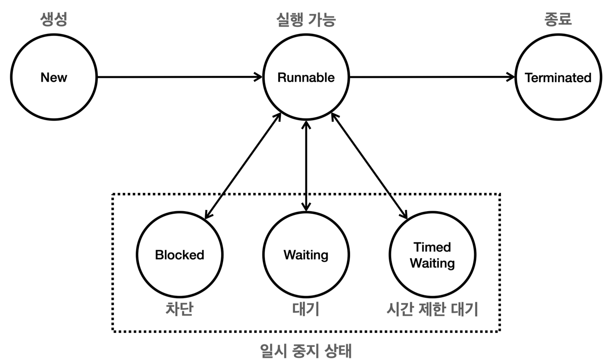
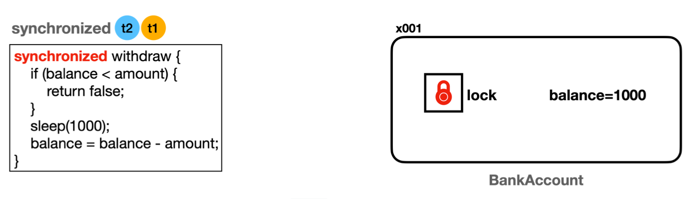
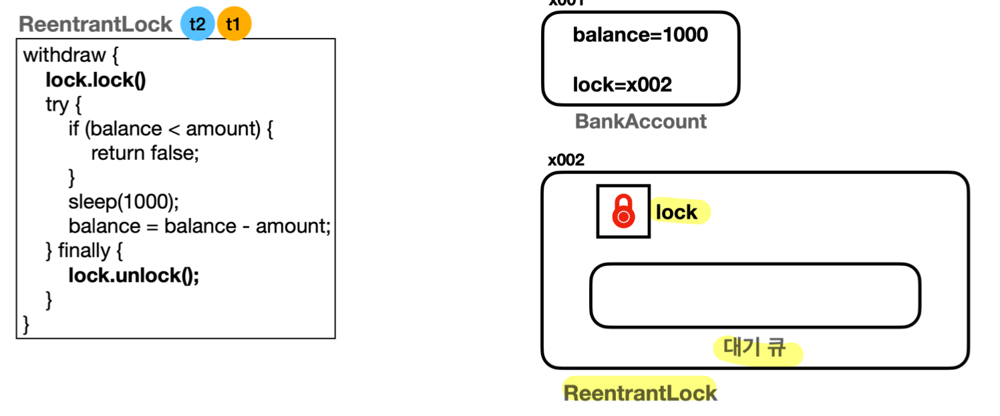
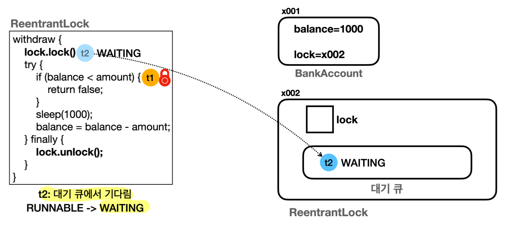
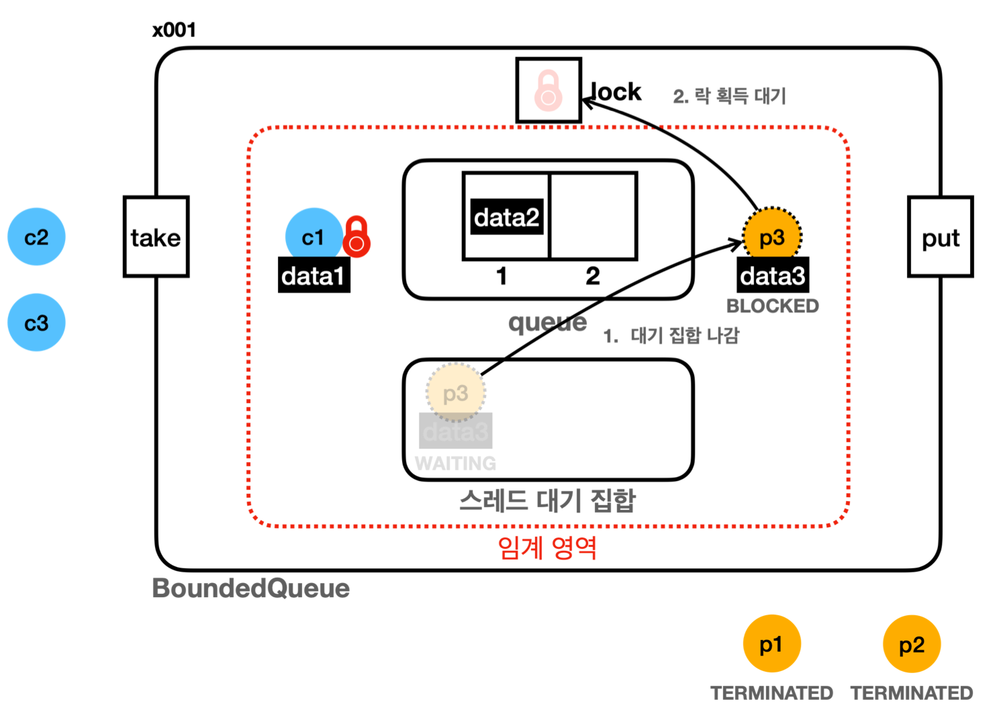
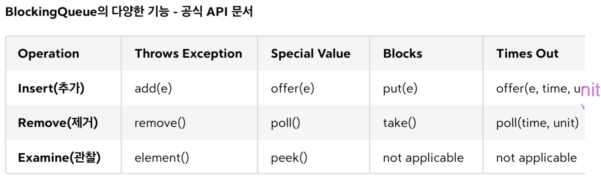
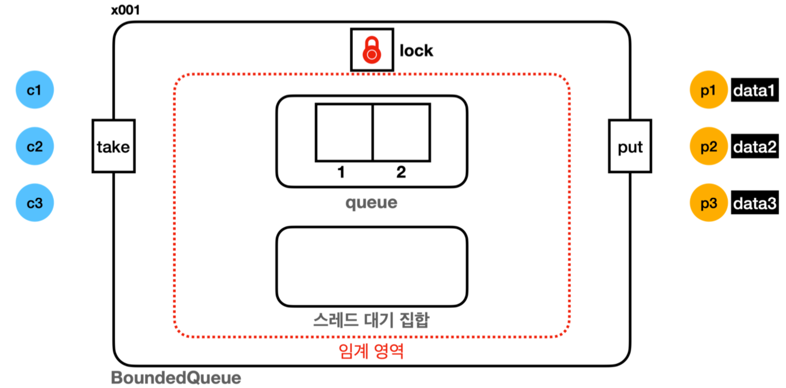
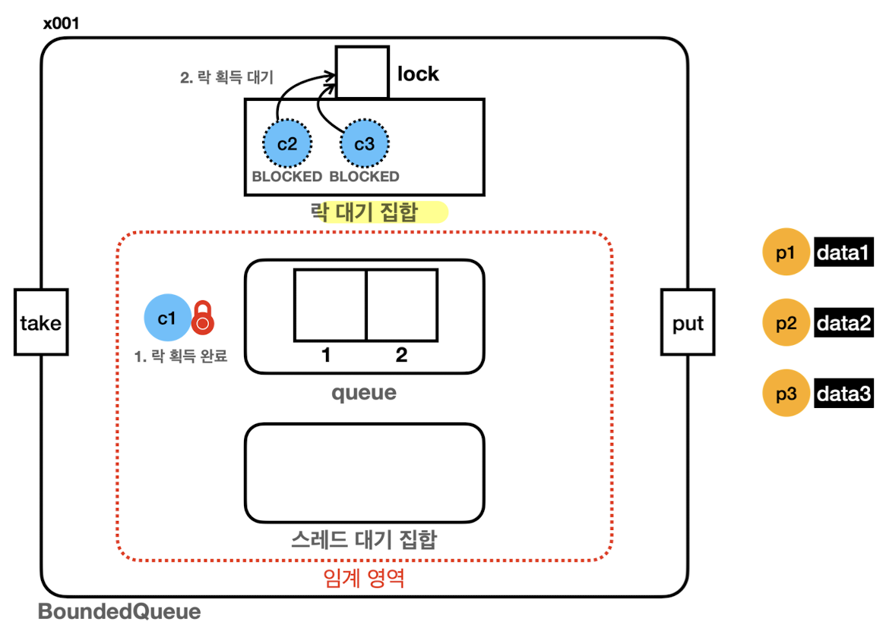
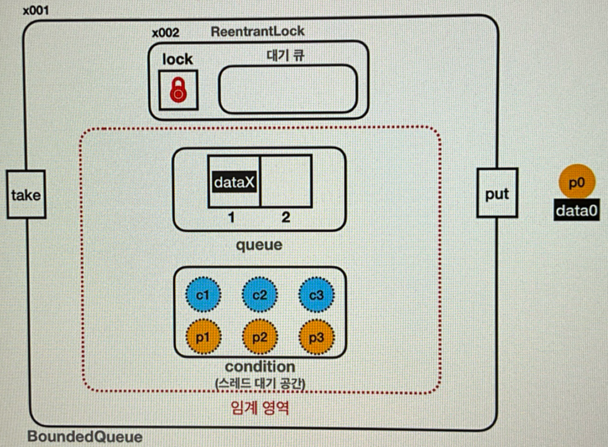
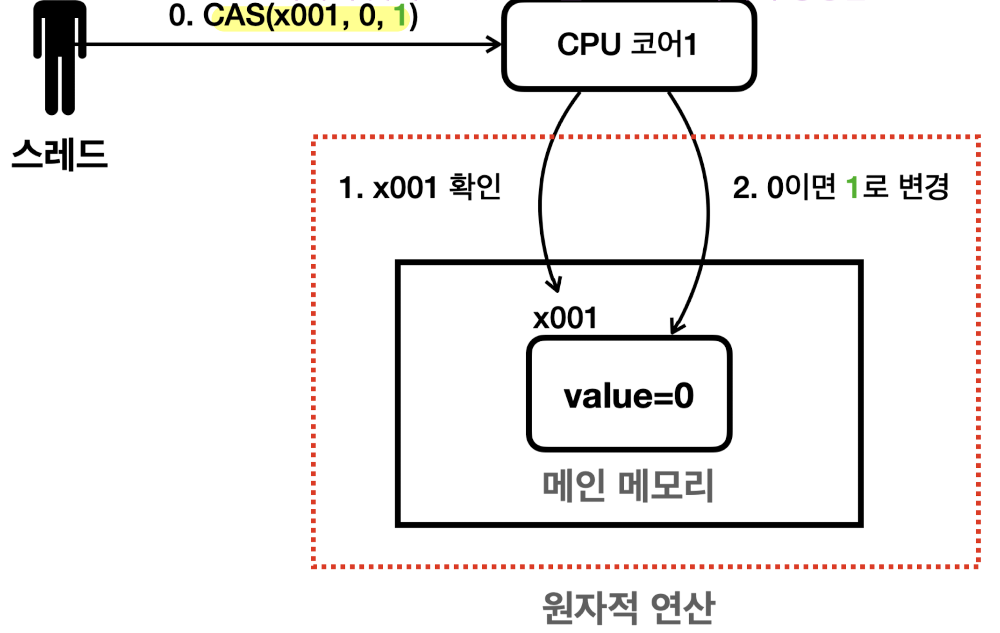

## 멀티태스킹 & 멀티프로세싱
- 프로그램 실행
	- 프로그램을 구성하는 **코드를 순서대로 CPU(=프로세서)에서 연산**하는 일
- 초창기 컴퓨터
	- 하나의 CPU 코어에서 한 프로그램 코드를 모두 수행 후 다른 프로그램 코드 실행
	- e.g. 사용자는 음악 프로그램 끝난 후에야 워드 프로그램 실행 가능해 불편
- 멀티태스킹 (**소프트웨어** 관점 - 운영체제)
	- **단일 CPU**(**단일 CPU 코어**)가 **여러 작업을 동시에 수행하는 것처럼** 보이게 하는 것
		- e.g. 현대 운영체제에서 여러 애플리케이션이 동시에 실행되는 환경
	- **CPU가 매우 빠르게 두 프로그램의 코드를 번갈아 수행**한다면, 사람은 **동시에 실행되는 것처럼 느낄 것**
		- 현대 CPU는 초당 수십억 번 이상의 연산 수행
		- **대략 0.01초(10ms)** 동안 **한 프로그램**을 **수십만 번 연산**
		- 하나의 CPU 코어 -> 프로그램 A 코드 수행 (약 10ms) -> 프로그램 B 코드 수행 (약 10ms) -> 프로그램 A의 이전 실행 중인 코드부터 다시 수행 (약 10ms) -> ... 
- 멀티프로세싱 (**하드웨어** 관점)
	- **여러 CPU**(**여러 CPU 코어**)를 사용하여 **여러 작업을 동시에 수행**하는 것
		- e.g. 멀티코어 프로세서를 사용하는 현대 컴퓨터 시스템
	- **여러 개의 CPU 코어**에서 여러 프로그램이 **물리적으로 동시에 실행**
		- **코어가 2개여도 2개보다 많은 프로그램 실행 가능**
		- 하나의 CPU 코어만 사용하는 시스템보다 동시에 **더 많은 작업을 처리**
		- e.g. CPU 코어 2개에서 프로그램 A, B, C 처리
			- CPU 코어 2개에서 물리적으로 동시에 2개의 프로그램 처리
				- A, B 실행 (약 10ms)
				- B, C 실행 (약 10ms)
				- ...
- **멀티 태스킹과 멀티프로세싱은 함께 일어날 수 있는 개념**

>CPU 코어
>
>최근의 일반적인 컴퓨터는 **하나의 CPU 안에 여러 개의 코어**를 가지는 **멀티코어 프로세서**를 가진다.
>**코어**는 **CPU 안의 실제 연산을 처리하는 장치**를 말한다. 
>과거에는 하나의 CPU 안에 하나의 코어만 들어있었다.

## 프로세스와 스레드

- 프로세스
	- **운영체제 안**에서 **실행 중**인 프로그램
		- 실행 환경과 자원을 제공하는 **컨테이너** 역할
		- 자바 언어와 비유하면 클래스는 프로그램(=코드뭉치, 파일), 인스턴스는 프로세스
	- 메모리 구성
		- 각 프로세스는 **독립적인 메모리 공간**을 가짐
			- 서로의 메모리에 직접 접근 불가
			- 특정 프로세스에 심각한 문제가 발생해도 **다른 프로세스에 영향 X** (해당 프로세스만 종료)
		- 구성
			- 코드 섹션: 실행할 **프로그램의 코드**가 저장되는 부분
			- 데이터 섹션: **전역 변수** 및 **정적 변수**가 저장되는 부분 (위 그림의 기타에 포함)
			- 힙: **동적으로 할당되는 메모리 영역**
			- 스택: **메서드(함수) 호출** 시 생성되는 **지역 변수**와 반환 주소의 저장 영역 (**스레드에 포함**)
	- **하나 이상의 스레드를 반드시 포함**
- 스레드
	- **프로세스 내에서 실행되는 작업 단위**
		- **CPU**를 사용해 **코드를 하나하나 실행**
	- 메모리 구성
		- 공유 메모리
			- **한 프로세스 내 여러 스레드들**은 프로세스가 제공하는 **메모리 공간을 공유**
			- e.g. 코드 섹션, 데이터 섹션, 힙, 스택을 프로세스 안 모든 스레드가 공유
		- 개별 스택
			- 각 스레드는 **자신의 스택**을 가짐
	- 프로세스보다 **생성 및 관리가 단순하고 가벼움**
- 멀티스레드가 필요한 이유
	- **하나의 프로그램**도 그 안에서 **동시에 여러 작업**이 필요하다
	- e.g.
		- 워드 프로그램 - 프로세스A
			- 스레드1: 문서 편집
			- 스레드2: 자동 저장
			- 스레드3: 맞춤법 검사
		- 유튜브 - 프로세스B
			- 스레드1: 영상 재생
			- 스레드2: 댓글
- 멀티스레드도 단일 코어 스케줄링 & 멀티 코어 스케줄링 모두 발생 가능

>프로그램 실행
>
>프로그램을 실행하면 **운영체제**는 먼저 디스크에 있는 파일 덩어리인 **프로그램을 메모리로 불러와 프로세스를 만든다**. **프로그램이 실행**된다는 것은 사실 **프로세스 안에 있는 코드가 한 줄씩 실행되는 것**이다.
>**코드는 보통 `main()`부터 시작해서 스레드가 하나씩 순서대로 내려가면서 실행**한다.
>한 프로세스 안에는 최소 하나의 스레드가 존재한다. 그래야 프로그램이 실행될 수 있다.

>CPU 스케줄링
>- **운영체제**가 **CPU에 어떤 프로그램을 얼마만큼 실행할지 결정**하는 것
>- CPU를 **최대한 활용**할 수 있는 **다양한 우선순위와 최적화 기법** 사용
>	- e.g. 시분할 기법 (Time Sharing, 시간 공유)
>		- 각 프로그램의 **실행 시간을 분할**해서 마치 동시에 실행되는 것처럼 하는 기법
>- 운영체제는 내부에 **스케줄링 큐**를 가지고, **각각의 스레드는 스케줄링 큐에서 대기**
>	- 스레드들이 운영체제한테 내가 실행되어야 한다고 알리면 운영체제는 해당 스레드들을 큐에 넣음
>	- 운영체제는 큐에서 대기중인 스레드를 하나씩 꺼내 CPU를 통해 실행
>	- 스레드는 CPU 연산을 통해 프로그램 코드를 수행
>	- 운영체제는 10ms 정도 후 작업 중인 스레드를 잠시 멈추고 다시 스케줄링 큐에 넣음
>	- 스케줄링 큐에서 다음 스레드를 꺼내 CPU를 통해 실행
>	- 반복...

>단일 스레드: 한 프로세스 내에 **하나의 스레드**만 존재
>멀티 스레드: 한 프로세스 내에 **여러 스레드**가 존재

## 컨텍스트 스위칭 (Context Switching)
- **CPU**는 컴퓨터에 있는 **여러 Process, 여러 Thread 들을 돌아가면서 실행함**
- 컨텍스트 (Context)
	- Process나 Thread가 **중단 됐다가 다시 실행될 때 필요한 정보**
- 컨텍스트 스위칭 (Context Switching)
	- 현재 실행 중인 Context를 **잠시 중단 및 저장**하고 **새로운 Context**를 **로딩 및 실행**하는 것
		- 멈춰지는 스레드는 **수행 위치**와 CPU에서 사용하던 **변수 값들**을 **메모리에 저장**
		- 실행하는 스레드는 **수행 위치**와 CPU에서 사용하던 **변수 값들**을 **메모리에서 CPU로 불러옴**
	- 컨텍스트 스위칭 발생 시 **CPU Cache가 초기화**됨
		- 다른 코드 수행을 위해 Cache를 비우고 새로 메모리를 읽어 Caching함
	- 값을 저장하고 불러오는 과정은 **약간의 비용을 발생시킴**
		- 실제로 컨텍스트 스위칭 시간은 짧지만, **스레드가 매우 많다면 비용이 커질 수 있음**
	- 유력한 발생 시점
		- Sleep
		- Lock
		- I/O 작업 (Network I/O, File I/O, Console 출력)
		- 시스템 API 호출
		- 혹은 **큰 단위 계산**을 할 때 **컨텍스트 스위칭 발생 가능성 높음**
- **멀티스레드는 대부분 효율적**이지만, **컨텍스트 스위칭** 과정이 필요하므로 **항상 효율적이진 않음**
	- 90% 경우는 효율적, 1~3% 경우는 비효율적
	- 예시
		- CPU 코어가 2개이고 스레드 2개 만들어 연산
			- 2배 빠르게 처리 가능 (**효율적**)
		- CPU 코어가 1개인데 스레드 2개 만들어 연산
			- 연산 시간 + **컨텍스트 스위칭 시간** (**비효율적**)
			- 단일 스레드로 연산하는 것이 오히려 효율적
## 스레드 숫자 최적화 전략
- CPU 개수와 스레드 개수
	- CPU 4개, 스레드 2개
		- CPU 100% 활용 X, 컨텍스트 스위칭 비용은 감소
		- 컨텍스트 스위칭이 일어날 수는 있지만 거의 없을 것
	- CPU 4개, 스레드 100개
		- CPU 100% 활용 O, 컨텍스트 스위칭 비용 증가
	- CPU 4개, 스레드 4개
		- **최적 상태** (CPU 100% 활용 O, 컨텍스트 스위칭 비용 거의 X)
		- 스레드 개수로 CPU 코어 개수 + 1개가 이상적 (특정 스레드 대기 시 남은 스레드 활용 가능)
- 스레드 작업 유형
	- CPU 바운드 작업
		- **CPU 연산 능력**을 많이 요구하는 작업
		- e.g. 복잡한 수학 연산, 데이터 분석, 비디오 인코딩, 과학적 시뮬레이션...
	- I/O 바운드 작업
		- **입출력(I/O) 작업**을 많이 요구하는 작업 (대기 시간으로 인해 **CPU 유휴 상태** 빈번)
		- e.g. DB 쿼리 처리, 파일 읽기/쓰기, 네트워크 통신, 사용자 입력 처리...
- 실무 전략
	- **스레드 숫자는 작업 유형에 따라 다르게 설정해야 한다!**
		- CPU 바운드 작업: **CPU 코어 수 + 1개**
			- CPU를 거의 100% 사용하는 작업이므로 **스레드를 CPU 숫자에 최적화**
		- I/O 바운드 작업: **CPU 코어 수 보다 많은 스레드 생성**
			- **성능 테스트** 통해 **CPU를 최대한 활용하는 최적의 스레드 개수** 찾을 것! 
			- 너무 많은 스레드는 **컨텍스트 스위칭 비용** 증가
	- **웹 애플리케이션 서버 실무는 I/O 바운드 작업이 많음** -> **CPU 코어 수 보다 많은 스레드 생성할 것!**
		- 사용자 요청 1개 처리 -> 스레드 1개 필요 (CPU 1%)
		- I/O 작업(DB 쿼리 대기 등)을 생각하면 스레드는 CPU를 거의 사용하지 않고 대기
		- 이 경우 CPU 코어가 4개 있다고 해서 스레드도 4개만 만들면 안됨
			- 동시에 4명의 사용자 요청만 처리 -> CPU 4% 사용 -> **CPU가 심하게 놀고 있음!**
			- 단순 생각해도 100개 스레드 생성 가능 (CPU 100%)
			- 스레드 개수만 늘리면 되는데, 서버 장비를 늘리는 비효율적인 사태가 벌어지기도...
	- 웹 애플리케이션 서버도 상황에 따라 CPU 바운드 작업이 많을 수 있음
		- 이 때는 CPU 코어 수 + 1개 고려
## 스레드 생성 및 실행
- 스레드 생성과 메모리
	
	- **자바는 실행 시점**에 **`main`이라는 이름의 스레드**를 만들고, 프로그램의 시작점인 **`main()` 메서드 실행**
	- **새로운 스레드**를 생성 및 시작하면 **자바**는 스레드를 위한 **실행 스택**을 **할당**
		- `start()` 메서드
			- 새로운 스레드를 실행
			- `main` 스레드는 **다른 스레드에게 일을 시작하라고 지시만 하고 바로 빠져나옴**
		- 스레드에 이름을 주지 않으면 임의의 이름 부여 (`Thread-0`, `Thread-1`...)
	- **메서드를 실행**하면 스택 위에 **스택 프레임**이 쌓임
		- **`main` 스레드**는 **`main()` 메서드 스택 프레임** 올리며 시작
		- **새로 만든 스레드**는 **`run()` 메서드 스택 프레임** 올리며 시작
- 유의점
	- 반드시 `run()` 메서드가 아닌 **`start()` 메서드 호출**해야 함
		- `start()` 호출 O -> **실행 스택 생성**되고 **별도의 스레드로 작동**
		- `start()` 호출 X -> `run()` 호출은 단순 함수 실행, 생성한 스레드도 단순한 객체일 뿐
			- 일반적인 메서드 호출 (`main` 스레드의 실행 스택 위에서 실행)
	- **스레드 간 실행 순서를 보장하지 않음** -> 이것이 **멀티스레드**!
		- **스레드는 동시에 실행**되므로 스레드 간 **실행 순서는 얼마든지 달라질 수 있음**
			- CPU 코어가 2개여서 물리적으로 정말 동시에 실행될 수도 있고
			- 하나의 CPU 코어에 시간을 나누어 실행할 수도 있음
- 생성 방법
	- **`Runnable` 인터페이스 구현** (**권장**)
		- 정의
			```java
			public class HelloRunnable implements Runnable {
			    @Override
			    public void run() {
			        System.out.println(Thread.currentThread().getName() + ": run()");
			    }
			}
			```
		- 실행
			- `Thread thread = new Thread(new HelloRunnable());`
			- `thread.start()`
		- **더 유연하고 유지보수하기 좋은 방식**
			- **상속**이 자유로움 (`Thread` 상속 방식은 다른 상속이 불가능)
			- **스레드**와 **작업** 코드가 서로 **분리**되어 가독성 상승
			- 여러 스레드가 동일한 `Runnable` 객체를 공유할 수 있어 **자원 관리가 효율적**
	- `Thread` 클래스 상속
		- 정의
			```java
			public class HelloThread extends Thread {
			
				@Override
				public void run() {
				    System.out.println(Thread.currentThread().getName() + ": run()");
				}
			}
			```
		- 실행
			- `HelloThread thread = new HelloThread();`
			- `thread.start()`
		- 자바는 스레드도 객체로 다룸
		- 스레드가 실행할 코드를 `run()` 메서드에 재정의

>`Thread` 주요 메서드
>
>`Thread.currentThread()`: 해당 코드를 실행하는 스레드 객체 조회 가능
>`Thread.currentThread().getName()`: 실행 중인 스레드의 이름을 조회

>Runnable 인터페이스와 체크 예외
>
>자식 클래스가 부모보다 더 넓은 범위의 예외를 던지면, **일관성을 해치고 예상치 못한 런타임 오류를 초래**할 수 있다. 
>따라서, 자바에서는 메서드 재정의 시 다음과 같은 예외 관련 규칙을 적용한다.
>
>1. 부모 메서드가 체크 예외를 던지지 않는 경우, 자식 재정의 메서드도 던질 수 없다.
>2. 자식 메서드는 부모 메서드가 던질 수 있는 체크 예외의 하위 타입만 던질 수 있다.
>3. 언체크 예외는 강제하지 않으므로 상관없이 던질 수 있다.
>
>**`Runnable` 인터페이스의 `run()` 메서드는 어떤 예외도 던지지 않기 때문에**, 개발자는 `run()` 메서드 재정의시 반드시 **`try-catch` 블록 내에서 체크 예외를 처리**해야 한다.
>예를 들어, **유틸리티 메서드**를 하나 만들어, 내부에서 `try-catch`로 **체크 예외를 잡고 언체크 예외로 변경해 재발생시키는 방법**도 있다.

>`this`와 스레드
>
>`this`는 **호출된 인스턴스 메서드가 소속된 객체를 가리키는 참조**이며, 스택 프레임 내부에 저장된다.
>
>메서드를 호출하는 것은 정확히는 **특정 스레드가 어떤 메서드를 호출**하는 것이다. **스레드**는 메서드 호출을 관리하기 위해 **메서드 단위**로 **스택 프레임**을 만든다. 이 때 인스턴스 메서드를 호출하면 **어떤 인스턴스 메서드를 호출했는지 기억하기 위해** 해당 인스턴스의 참조값을 스택 프레임 내부에 저장해두는데, 이것이 `this`다.
>
>따라서, 특정 메서드 안에서 `this`를 호출하면 스택프레임 내의 `this` 값을 불러서 사용하고 필드 접근시 `this`를 생략하면 자동으로 `this`를 참고해 필드에 접근한다.
>
>참고로 인스턴스 메서드는 `this`가 있지만 **클래스 메서드는 `this`가 없다.**

## 데몬 스레드 (Daemon Thread)
- 스레드는 2가지 종류로 구분
	- 사용자 스레드
		- 프로그램의 **주요 작업** 수행
		- 모든 사용자 스레드가 종료되면 JVM도 종료
			- Main 뿐만 아니라 다른 사용자 스레드까지 모두 종료되어야 자바 종료 (중간에 작업 끊김 X)
	- 데몬 스레드
		- **백그라운드**에서 **보조적인 작업** 수행
		- 모든 사용자 스레드가 종료되면 JVM이 종료되고 데몬 스레드도 자동 종료 (작업 끊김)
- 데몬 스레드 실행 방법
	- `thread.setDaemon(true) // 데몬 스레드로 설정 (기본값은 false, user 스레드가 기본)`
	- `thread.start() // 데몬 스레드 여부는 start() 실행 이후에는 변경되지 않음`

>데몬
>
>컴퓨터 과학에서는 사용자에게 보이지 않으면서 **시스템의 백그라운드에서 작업을 수행하는 것**을 데몬 스레드, 데몬 프로세스라고 한다. 예를 들어, 사용하지 않는 파일이나 메모리를 정리하는 작업들이 있다.

## 스레드 기본 정보
- 스레드 이름 부여
	- `Thread myThread = new Thread(new HelloRunnable(), "myThread");`
		- 스레드 이름이 "myThread"
	- 디버깅, 로깅 목적으로 유용
- `Thread` 클래스 메서드
	- `threadId()`: **스레드 고유 식별자** 반환 (JVM 내 각 스레드에 대해 유일)
	- `getName()`: **스레드 이름** 반환 (스레드 이름은 중복 가능)
	- `getPriority()`: **스레드의 우선순위** 반환 (1: 가장 낮음 ~ 10: 가장 높음, 기본값: 5)
		- `setPriority()`로 변경 가능하지만, 실제 실행 순서는 운영체제에 달려있음
	- `getThreadGroup()`: **스레드가 속한 그룹**을 반환
	- `getState()`: 스레드의 현재 상태를 반환 (`Thread.State` 열거형에 정의된 상수)
		- NEW, RUNNABLE, BLOCKED, WAITING, TIMED_WAITING, TERMINATED

>부모 스레드
>
>**새로운 스레드를 생성하는 스레드**를 의미한다.
>**스레드는 기본적으로 다른 스레드에 의해 생성**된다. (`main` 스레드는 제외)

>스레드 그룹
>
>**직접적으로 잘 사용하지 않는다.** 스레드를 그룹화하여 관리할 수 있는 기능을 제공한다. 
>스레드 그룹에는 특정 작업을 일괄적으로 적용할 수 있다. (e.g. 일괄 종료, 우선순위 설정)
>모든 스레드는 부모 스레드와 동일한 스레드 그룹에 속한다.
>`main` 스레드는 기본으로 제공되는 `main` 스레드 그룹에 속한다.

## 스레드의 생명 주기

- **`NEW`**
	- 스레드가 **생성**되었으나 **아직 시작되지 않은** 상태
	- `Thread` 객체는 생성되었지만 `start()` 메서드가 호출되지 않음
- **`RUNNABLE`**
	- 스레드가 **실행 중**이거나 **실행될 준비**가 된 상태 (=CPU에서 실행될 수 있음)
	- `start()` 메서드 호출 후 상태
	- `RUNNABLE` 상태의 모든 스레드가 **동시 실행되지는 않음** (**운영체제 스케줄러**가 CPU 할당하기 때문)
	- 자바에서는 운영체제 스케줄러에 있든 CPU에서 실제 실행되고 있든 **모두 `RUNNABLE` 상태** (구분 X)
- **`TERMINATED`**
	- 스레드가 **실행을 마친** 상태 (`run()` 메서드 **정상 종료** 혹은 **예외 발생 종료**)
	- 스레드는 한 번 **종료**되면 **다시 시작할 수 없음** (새로 만들어서 실행해야 함)
- **일시 중지 상태**
	- **`BLOCKED`** 
		- 스레드가 **동기화 락**을 기다리는 상태
		- `synchronized` 블록 진입 위해 락 획득 대기할 때
	- **`WAITING`**
		- 스레드가 **다른 스레드의 특정 작업 완료**를 **무기한** 기다리는 상태
		- e.g. `wait()`, `join()` 혹은 `LockSupport.park()` 호출 시
		- 다른 스레드가 `notify()`, `notifyAll()` 호출하거나 `join()`이 완료될 때까지 기다림
	- **`TIMED_WAITING`**
		- 스레드가 **다른 스레드의 특정 작업 완료**를 **일정 시간 동안** 기다리는 상태
		- e.g. `sleep(long millis)`, `wait(long timeout)`, `join(long millis)` 
		  혹은 `LockSupport.parkNanos(ns)` 호출 시
		- 주어진 시간이 경과하거나 다른 스레드가 해당 스레드를 깨우면 이 상태를 벗어남
## 다른 스레드의 작업 기다리기 - `join()`
- **다른 스레드의 작업 완료를 기다려하는 상황**에 사용
	-  `join()`: **무한정** 기다릴 때 사용 (`WAITING`)
	- `join(ms)`: **특정 시간**만 기다릴 때 사용 (`TIMED_WAITING`)
- 진행 과정
	- 호출 스레드는 **`WAITING`** 상태가 됨
	- 대상 스레드가 **`TERMINATED`** 상태가 될 때까지 **대기**
		- 대상 스레드가 `TERMINATED` 상태가 되면 `RUNNABLE` 상태가 되어 다음 코드 수행
		- 대상 스레드가 이미 `TERMINATED` 상태라면 바로 빠져나옴
- e.g. 연산을 두 개의 스레드로 나누어 진행하고 완료된 후 결과를 합쳐 사용
	- `thread-1`: 1 ~ 50까지 더하기
	- `thread-2`: 51 ~ 100까지 더하기
	- `main`: 두 스레드의 계산 결과를 받아 합치기
## 스레드 작업을 중간에 중단하기
- **다른 스레드**의 작업을 중간에 중단하기
	- **인터럽트** (**권장**)
		- **대기 상태**의 스레드(`WAITING`, `TIMED_WAITING`...)를 **직접 깨워**, `RUNNABLE` 상태로 변경
		- 작업 중단 지시 후, 거의 **즉각적으로** 인터럽트 발생
		- 인터럽트 상태가 되면 **`InterruptedException`** 예외 발생
			- 상태 변화
				- 인터럽트 상태(`true`) -> `InterruptedException` -> 인터럽트 상태(`false`)
			- **`InterruptedException`을 던지는 메서드**를 **호출**하거나 **호출 중**일 때만 예외가 발생
				- e.g. `Thread.sleep()`, `join()`
				- 일반 코드에서는 예외가 발생하지 않음
		- 관련 메서드
			- `interrupt()`: 특정 스레드에 인터럽트 걸기
			- `isInterrupted()`: 인터럽트 상태 **단순 확인** (인터럽트 상태 변경 X)
			- `interrupted()`: 인터럽트 상태를 **확인** 및 **상태 변경**
				- 스레드가 인터럽트 상태면 `true`를 반환 및 **인터럽트 상태 `false`로 변경**
				- 스레드가 인터럽트 상태가 아니면 `false`를 반환 (상태 변경 X)
		- 인터럽트 직접 체크 시, **`interrupted()` 사용할 것!** (with `interrupt()`) 
			- `InterruptedException`을 던지는 메서드가 없을 때도 인터럽트 사용 가능
			- `isInterrupted()`는 인터럽트 상태가 `true`로 남겨진 채 유지됨
				- 다른 곳에서도 계속 인터럽트가 발생할 수 있어 위험
		- 방법 예시
			- Task 주요 코드 (Runnable)
				- `while (!Thread.interrupted()) {...}`
			- `main` 스레드가 `thread.interrupt()` 실행해 `work` 스레드에 인터럽트 지시
	- 변수 사용하기
		- 방법 예시
			- Task 주요 코드 (Runnable)
				- `volatile boolean runFlag = true;`
				- `while (runFlag) {...}`
			- `main` 스레드가 `runFlag = false;`를 실행해 `work` 스레드에 작업 중단 지시
		- 문제점
			- `work` 스레드가 **작업 중단 지시에 바로 반응 불가** (**반응성이 느림**)
			- `while` 조건문을 읽을 때에서야 인지하므로 루프 내 작업이 길다면, 반응이 더 느려짐
- **스레드** **스스로** 작업을 중간에 중단하기 (**`yield`**, **양보하기**)
	- 현재 스레드가 크게 바쁘지 않다면, 스케줄링 큐에 대기 중인 다른 스레드에게 **CPU 실행 기회**를 **양보**
	- 현재 스레드는 **다시 스케줄링 큐로 돌아감** (**`RUNNABLE` 상태 유지**)
	- **CPU 코어 수보다 많은 스레드가 있을 때** 의미가 있음
	- `yield`는 스케줄러에게 **힌트**만 줄 뿐, 실행 순서 강제 X
		- 굳이 양보할 필요 없는 상황이면 본인 스레드 계속 실행 (운영체자가 최적화)
	- 구현 예시
		```java
		while (!Thread.interrupted()) {
		    if (jobQueue.isEmpty()) {
				Thread.yield(); // 추가
				continue; 
			}
			... 
		}
		```
		- 최대한 **실시간으로 확인** 원할 시 `yield()`가 효율적
		- 만일 좀 더 오래 기다려도 될 것 같아 **CPU 사용을 최대한 줄이고 싶다면** `sleep()`도 괜찮음
	- 참고: `sleep()`의 단점
		- 복잡한 상태 변화 과정 (`RUNNABLE` -> `TIMED_WAITING` -> `RUNNABLE`)
		- 특정 시간만큼 스레드가 실행되지 않음 (양보할 상황이 아닌데도 휴식)
## 메모리 가시성 (Memory Visibility)
 
- 멀티 스레딩 환경에서 **한 스레드가 변경한 값**이 **다른 스레드에서 언제 보이는지**에 대한 문제
	- 다른 스레드는 캐시에서Stale Data(오래된 데이터) 읽을 수 있음
- CPU와 캐시 메모리
	- **CPU**는 처리 성능을 개선하기 위해 **캐시 메모리**를 사용 (L1, L2, L3 캐시...)
	- 현대 CPU는 코어 단위로 캐시 메모리를 보유
- **각 스레드**가 **각자의 캐시 메모리**를 바라보고 작업해 **서로 값 변경을 감지하지 못함**
	- 스레드가 특정 변수 값 사용 시, 점유하는 코어의 **캐시 메모리로 값을 불러옴** (From 메인 메모리)
	- 값 변경 시, **캐시 메모리의 값만 변경** (메인 메모리에 **즉시 반영 X**)
	- **메인 메모리 반영 및 읽기 시점**은 **알 수 없음**!
		- 주로 **컨택스트 스위칭**이 있을 때 **캐시 메모리 함께 갱신** (`sleep()`, 콘솔 출력...)
		- 그러나 환경마다 다르고 갱신이 일어나지 않을 수도 있음
- **`volatile`**
	
	- **성능을 약간 포기**하는 대신에, **값 읽기 및 쓰기**를 모두 **메인 메모리에 직접 접근**해 진행
	- 사용 상황
		- 여러 스레드에서 **같은 시점에 정확히 같은 데이터를 보는게 중요**할 때 사용
		- 캐시 메모리보다 **성능이 떨어지므로 꼭 필요한 곳에만 사용!** (약 5배 차이, 환경에 따라 다름)

>Memory Wall
>
>메모리 액세스 속도보다 CPU 처리 속도가 훨씬 빠르기 때문에 발생하는 문제를 말한다. 
>일반적으로 CPU에 캐시를 두어 속도를 개선한다. (L1, L2, L3)

>자바 메모리 모델 (Java Memory Model)
>
>**자바 프로그램이 어떻게 메모리에 접근하고 수정할 수 있는지 규정**한다. 특히, 멀티스레드 프로그래밍에서 여러 스레드들의 작업 순서를 보장하는 **happens-before 관계**를 정의한다.
>만일 **A happens before B** 관계가 성립한다면, **A 작업의 모든 메모리 변경 사항은 B 작업 시작 전에 메인 메모리에 반영되어 B 작업에서 볼 수 있다.** 
>즉, **다른 스레드 작업의 최신 상태를 참조하는 것(메모리 가시성)을 보장**한다. 이 규칙을 따르면, **멀티스레드 프로그래밍 시 예상치 못한 동작을 피할 수 있다.**
>
>스레드 시작 및 종료, 인터럽트, 객체 생성 등의 규칙이 있지만 **핵심**은 **`volatile`** 혹은 **동기화 기법(`synchronized`, `ReentrantLock`)을 사용**하면 **메모리 가시성 문제가 발생하지 않는다**는 점이다.

## 동시성 문제와 동기화
- 동시성 문제
	- 멀티 스레드 상황에서 **공유 자원에 여러 스레드가 동시에 접근**할 때 발생
		- e.g. 두 개 스레드가 계좌 출금 로직을 실행할 때, 둘 다 검증 로직을 통과해 잔액 없는데도 출금
	- **근본 원인**
		- 공유자원에 대한 **변경이 있는 연산**을 **여러 단계로 나누어 사용**하는 것
			- e.g. 출금은 **검증 단계**와 **계산 단계**로 나뉘어 있어 원자적이지 않은 연산
		- 여러 단계 없이 원자적인 변경이라면 문제 없음
		- 변경 없이 읽기만 한다면, 이것 역시 문제될 것이 없음
	- 멀티 스레드에서는 **공유 자원에 대한 접근을 적절하게 동기화**해서 **동시성 문제를 예방**하는게 **중요**
	- 동시성 문제가 있다면 **메모리 가시성을 해결해도 문제가 지속됨**
- 임계 영역 (Critical Section)
	- **공유 자원 접근 및 수정**으로 인해 **여러 스레드가 동시에 작업**할 때 **문제가 생기는 코드**
		- e.g. 임계영역 = 검증 단계 + 계산 단계
- 동기화 (Synchronization)
	- **공유 자원**에 대해 **일관성 있고 안전한 접근을 보장**하기 위한 메커니즘
		- 임계 영역은 **한 번에 하나의 스레드만 접근할 수 있도록 보호**해야 함
	- **멀티 스레드 상황**에서의 **동시성 문제를 해결**하기 위해 사용
		- **경합 조건(Race Condition)** 해결
			- 두 개 이상의 스레드가 경쟁적으로 동일한 자원을 수정할 때 발생하는 문제
			- 데이터 정합성이 깨짐
		- **데이터 일관성** 해결
			- 여러 스레드가 동시에 읽고 쓰는 데이터의 일관성 유지
			- e.g. 입출금 예제 (1000원 잔액에서 두 개 스레드가 800원 출금 시도)
				- 순차 실행 결과로 -600은 데이터 일관성이 있음 (숫자는 맞으니까)
				- 완전 동시 실행 결과로 200은 데이터 일관성이 깨짐 (아얘 800원 증발)
	- 멀티스레드 환경에서 필수적인 기능이지만, **성능저하 예방**을 위해 **꼭 필요한 곳에 사용해야 함**
- 동기화 기법
	- `synchronized`
		- **모니터 락**을 사용해 동기화하는 방법
			
			- 모니터 락(monitor lock)
				- **모든 객체(인스턴스)가 내부에 가지고 있는 자신만의 락**
				- 자바 기본 제공
			- 스레드가 **`synchronized` 메서드에 진입**하려면 **반드시 모니터 락을 얻어야 함**
		- 적용 범위는 **인스턴스 단위**
			- 한 스레드가 `withdraw()` 실행 중일 때, 
			  다른 스레드는 `withdraw()`와 `getBalance()` 모두 호출 불가
		- 장점
			- 프로그래밍 언어 문법으로 제공 (자바 1.0)
			- **단순**하고 **편리**한 사용
		- 단점
			- 무한정 대기 문제
				- `BLOCKED` 상태 스레드는 락 획득까지 **무한정 대기** - 타임아웃 or 인터럽트 불가능
				- e.g. 웹의 경우 요청한 고객의 화면에 계속 요청 중만 뜨고 응답 X
			- 공정성 문제
				- `BLOCKED` 상태 스레드들의 **락 획득 순서는 보장 X** (자바 표준에 정의 X)
				- 최악의 경우 **특정 스레드**가 **너무 오랜기간 락을 획득하지 못할 수 있음**
		- 예시 코드
			- 메서드 동기화
				```java
				public class BankAccountImpl implements BankAccount {
				    
				    private int balance;
				    ...
				    @Override
				    public synchronized boolean withdraw(int amount) {
						...
				     }
				     
				    @Override
				    public synchronized int getBalance() {
				        ...
				    }
				}
				```
				- 클래스 내 **모든 메서드에 일일이 키워드 적용**하는게 일반적
			- 블록 동기화 (**권장**)
				```java
				@Override
				public boolean withdraw(int amount) {
					log("거래 시작: " + getClass().getSimpleName());
					
					synchronized (this) {
						...
					}
					
					log("거래 종료");
					return true;
				}
				```
				- **동기화 구간은 꼭 필요한 코드 블럭만 최소한으로 한정해 설정해야 함** (**최적화**)
					- **동기화**는 여러 스레드가 동시에 실행하지 못하므로 **성능이 떨어짐**
					- 동시 처리 구간을 늘려서 **전체적인 성능을 더 높일 수 있음**
				- **괄호 ()** 안에 들어가는 값은 **락을 획득할 인스턴스의 참조**
	- **`ReentrantLock`**
		
		- 자바는 **더 유연하고 세밀한 제어**를 위한 **동시성 문제 해결 라이브러리 패키지** 지원
		  (`java.util.concurrent`, 자바 1.5)
			- **`Lock` 인터페이스**와 **`ReentrantLock` 구현체** 지원 (**`LockSupport` 활용**)
			- 모니터 락이 아닌 **자체적으로 구현한 락** 사용
		- **`synchronized`의 단점 극복**
			- 무한 대기 문제 -> **`LockSupport`** 이용해 해결
			- 공정성 문제 -> **`ReentrantLock`** **공정 모드 옵션**으로 해결
				- 비공정 모드 (Non-fair mode) - 디폴트
					- `private final Lock nonFairLock = new ReentrantLock();`
					- **성능 우선**: 락을 획득하는 속도가 빠름
					- **선점 가능**: 새 스레드가 대기 스레드보다 먼저 락 획득할 수도 있음
					- **기아 현상 가능**: 특정 스레드가 계속해서 락 획득 못할 수 있음
						- 비공정 모드도 내부는 큐로 구현되어 있음
						- **대부분의 경우 오래된 스레드 먼저 실행**
						- Race Condition **정말 심할 때 가끔 새치기 스레드** 나올 수 있음
				- 공정 모드 (Fair mode)
					- 서비스에서 **로직상 반드시 순서가 지켜져야 할 때** 사용 (e.g. 선착순)
					- `private final Lock fairLock = new ReentrantLock(true);`
					- **공정성 보장**: 먼저 대기한 스레드가 락을 먼저 획득
					- **기아 현상 방지**: 모든 스레드가 언젠가 락 획득할 수 있도록 보장
					- **성능 저하**: 락 획득 속도 느려짐
		- `LockSupport`
			- 스레드를 `WAITING` 상태로 변경 (`BLOCKED` X, **무한 대기 문제 해결**)
				- `unpark()`로 깨울 수 있음
				- 타임아웃 및 인터럽트도 가능해짐!
			- 주요 기능
				- `park()`: 스레드를 `WAITING` 상태로 변경
				- `parkNanos(nanos)`: 스레드를 `TIMED_WAITING` 상태로 변경 (지정 나노초)
				- `unpark(thread)`: 스레드를 `WAITING`, `TIME_WAITING` -> `RUNNABLE` 변경
					- 대기 상태의 스레드는 외부 스레드의 도움을 받아야 깨어 날 수 있음 (파라미터)
			- **`LockSupport` 활용**은 **무한 대기하지 않는 락** 기능 개발의 **토대**
				```java
				if (!lock.tryLock(10초)) { // 내부에서 parkNanos() 사용 
					log("[진입 실패] 너무 오래 대기했습니다.");
					return false;
				}
				
				//임계 영역 시작
				...
				//임계 영역 종료
				
				lock.unlock() // 내부에서 unpark() 사용
				```
				- 락(`lock`) 클래스를 만들어 락 획득 및 반납에 따라 스레드 상태 변경
				- 다만, 구현을 위해서는 대기 스레드를 위한 자료구조 및 
				  스레드를 깨우는 우선순위 알고리즘도 필요하므로 복잡
				- 자바는 **저수준의 `LockSupport`를 활용**하는 **고수준의 `ReentrantLock` 구현해둠**
		- `Lock` 인터페이스
			```java
			public interface Lock {
				//락 획득 시도, 락 없을 시 WAITING, 인터럽트 반응 X
				//lock()은 인터럽트 시 잠깐 RUNNABLE 됐다가 강제로 WAITING 상태로 되돌림 
			    void lock(); 
			    void lockInterruptibly() throws InterruptedException;//인터럽트O
			    boolean tryLock(); //락 획득 시도, 성공 여부 즉시 반환
			    boolean tryLock(long time, TimeUnit unit) throws InterruptedException; //주어진 시간 동안 락 획득 시도, 이후 성공 여부 반환
			    void unlock(); //락 반납, 락을 획득한 스레드가 호출해야 함
				
			    //락과 결합해 사용하는 Condition 객체 생성 및 반환
			    //스레드가 특정 조건을 기다리거나 신호를 받을 수 있도록 함
			    Condition newCondition();
			}
			```
		- 예시 코드 1 - 무한정 대기 (`lock.lock()`)
			```java
			public class BankAccountImpl implements BankAccount {
			    
			    private int balance;
			    private final Lock lock = new ReentrantLock();
			    ...
			    @Override
			    public boolean withdraw(int amount) {
					log("거래 시작: " + getClass().getSimpleName());
					
					lock.lock(); // ReentrantLock 이용하여 lock을 걸기 
					try {
						...
					} finally {
						lock.unlock(); // ReentrantLock 이용하여 lock 해제
					}
					
					log("거래 종료"); 
					return true;
				}
			    
			    @Override
			    public int getBalance() {
					lock.lock(); // ReentrantLock 이용하여 lock 걸기 try {
			            ...
			        } finally {
						lock.unlock(); // ReentrantLock 이용하여 lock 해제
					}
				}
				
			}
			```
			- 스레드가 락을 획득하지 못하면 `WAITING` 상태가 되고, 대기 큐에서 관리 
			  (내부에서 `LockSupport.park()` 호출)
				
			- 락 반납 시, 대기 큐의 스레드를 하나 깨움 (내부에서 `LockSupport.unpark()` 호출)
				- 대기 큐에 스레드가 없을 시, 깨우지 않음
			- 깨어난 스레드는 락 획득을 시도
				- 락을 획득하면 대기 큐에서 제거
				- 락을 획득하지 못하면 다시 대기 상태가 되면서 대기 큐에 유지
					- 비공정 모드
						- 락 획득을 시도하는 잠깐 사이에 새 스레드가 락을 먼저 가져갈 수 있음
						- 경쟁: 새로 락을 호출하는 스레드 VS 대기 큐에 있는 스레드
					- 공정 모드
						- 대기 큐에 먼저 대기한 스레드가 락을 가져감
		- 예시 코드 2 - 대기 빠져나오기 (`lock.tryLock()`)
			```java
			@Override
			public boolean withdraw(int amount) {
				log("거래 시작: " + getClass().getSimpleName());
				
				// 대기 없이 획득 여부 바로 판단
				if (!lock.tryLock()) {
					log("[진입 실패] 이미 처리중인 작업이 있습니다.");
					return false;
				}
			
				// 특정 시간만큼 대기
				/**
				try {
			        if (!lock.tryLock(500, TimeUnit.MILLISECONDS)) {
						log("[진입 실패] 이미 처리중인 작업이 있습니다.");
			            return false;
			        }
			    } catch (InterruptedException e) {
			        throw new RuntimeException(e);
				}
				**/
			
				try {
					...
				} finally {
					lock.unlock(); // ReentrantLock 이용하여 lock 해제
				}
				
				log("거래 종료"); return true;
			}
			```

>**공유 자원**
>
>**여러 스레드가 접근하는 자원**을 말한다. (e.g. 인스턴스 변수, 클래스 변수, 인스턴스 자체)
>
>사실, 공유 자원은 원자적이지 않은 변경이 문제가 되는 것이므로, **`final` 키워드가 붙은 공유자원**은 멀티스레드 상황에 **안전한 공유자원**이다. 어떤 스레드도 값을 변경할 수 없기 때문이다.
>
>참고로, **지역 변수**는 공유 자원이 아니므로 **동시성 문제를 전혀 고민하지 않아도 된다.** 
>지역 변수는 **각각의 스레드가 가지는 별도의 스택 공간에 저장**되어서 **다른 스레드와 공유하지 않기 때문**이다.

>`BLOCKED` VS `WAITING` (`WAITING` & `TIMED_WAITING`)
>
>두 상태 모두 스레드가 **실행 스케줄링에 들어가지 않고 대기**한다는 점에서 비슷한 상태이다. (CPU가 실행 X)
>
>다만, `BLOCKED` 상태는 **`synchronized`에서만 사용**되며 타임 아웃이나 인터럽트가 **불가능**하다.
>반면에, `WAITING` 상태는 **범용적으로 사용**되며 **타임아웃**이나 **인터럽트**를 통해 **대기 상태를 빠져나올 수 있다.**

## 생산자 소비자 문제
- 생산자 소비자 문제(producer-consumer problem) 
	- **여러 스레드가 동시에 특정 자원을 함께 생산하고 소비하는 상황**
	- 멀티스레드에서 자주 등장하는 동시성 문제
	- = **한정된 버퍼 문제(bounded-buffer problem)**
- 기본 개념 
	- 생산자(Producer)
		- 데이터를 **생성**하는 역할
		- e.g. 파일에서 데이터를 읽어오거나 네트워크에서 데이터를 받아오는 스레드
	- 소비자(Consumer)
		- 데이터를 **사용**하는 역할
		- e.g. 데이터를 처리하거나 저장하는 스레드
	- 버퍼(Buffer)
		- 생산자가 생성한 데이터를 **일시적으로 저장하는 공간**
		- e.g. 큐
	- **생산자 소비자 모두 여럿일 수 있음**
- 문제 상황
	- 생산자가 너무 빠를 때
		- 생산자가 데이터를 빠르게 생성해 버퍼가 가득차면, **버퍼에 빈 공간이 생길 때까지 기다려야 함**
	- 소비자가 너무 빠를 때
		- 소비자가 데이터를 빠르게 소비해 버퍼가 비면, **버퍼에 새 데이터가 들어올 때까지 기다려야 함**
- 해결책
	- **스레드를 제어**할 수 있는 **특별한 자료구조** 사용
- 예제: **스레드를 제어하는 큐 만들기**
	- 기본 가정: **소비자 스레드**와 **생산자 스레드**는 **지속적으로 발생함** (생산자 소비자 구조는 계속 실행)
	- `BoundedQueueV1`
		- 특징
			- 동기화한 큐 사용 (`take()`, `put()` 메서드를 `synchronized`)
			- 생산자가 자원을 생산할 때, **큐가 가득찼다면 데이터를 버림**
			- 소비자가 자원을 소비할 때, **큐가 비었다면** 아무일도 안하고 **`null` 반환**
		- 문제
			- **생산자가 데이터를 버리는 것이 비효율적** (기다림 X)
			- **소비자가 데이터를 기다리지 않는 것이 비효율적** (기다림 X)
	- `BoundedQueueV2`
		- 목표: **생산자 혹은 소비자 스레드가 기다리도록 하기**
		- 특징
			- 생산자는 큐에 빈 공간이 생길 때까지 기다림
				- `put()` 메서드 -> `while (queue.size() == max)`
				- 생산자 스레드는 반복문을 통해 큐에 빈공간이 생기는지 주기적으로 체크
			- 소비자는 큐에 데이터가 추가될 때까지 기다림
				- `take()` 메서드 -> `while (queue.isEmpty())`
				- 소비자 스레드는 반복문을 통해 큐에 데이터가 추가되는지 주기적으로 체크
		- 문제
			- 생산자나 소비자 스레드가 **락을 가지고 대기**하면, **다른 스레드들은 `BLOCKED` 됨** 
			  (`synchronized`)
	- `BoundedQueueV3`
		- 목표
			- 임계 영역 안에서 락을 가지고 기다리는 스레드가 **락을 다른 스레드에게 양보하도록 하기**
			- `Object` 클래스를 통한 해결 (**`wait()`**, **`notify()`**, **`notifyAll()`**)
				
				- **`synchronized`** 에서 비롯된 락 획득 후 임계영역 내 **무한 대기 문제 해결**
				- **모든 객체가 사용 가능** (자바는 멀티스레드를 고려하며 탄생한 언어)
				- 주요 메서드
					- 유의점
						- 모두 **`synchronized`** 메서드 및 블록 **내에서 호출**되어야 함
						- 대기하는 스레드는 **스레드 대기 집합에서 대기**
					- `Object.wait()`
						- 현재 스레드가 가진 **락을 반납하고 대기** (`WAITING`, 스레드 대기 집합)
						- 다른 스레드가 `notify()`, `notifyAll()`을 호출할 때까지 **대기 유지**
					- `Object.notify()`
						- 스레드 대기 집합에서 대기 중인 스레드 중 **하나를 깨움** 
							- 대기 집합에서 **어떤 스레드가 깨어날지는 예측 불가능** 
							  (JVM 스펙 명시 X)
						- 락을 다시 획득할 기회 얻음
						- 깨어난 스레드는 **`WAITING` -> `BLOCKED`** 상태가 됨
							- 깨어난 스레드는 **임계 영역 내**에 있음
							- 임계 영역 내 코드를 실행하려면 락이 필요
							- **락 획득을 위해 `BLOCKED` 상태로 대기**
					- `Object.notifyAll()`
						- 스레드 대기 집합에서 대기 중인 **모든 스레드를 깨움** 
						- 모두 락 획득 기회를 얻음
						- 깨어난 스레드는 **`WAITING` -> `BLOCKED`** 상태가 됨
							- 깨어난 스레드는 **임계 영역 내**에 있음
							- 임계 영역 내 코드를 실행하려면 락이 필요
							- **락 획득을 위해 `BLOCKED` 상태로 대기**
		- 특징
			- 생산자 - `put()`
				- 반복문 내에서 `wait()`으로 **락을 반납**하고 큐의 빈 공간을 **기다림** (`WAITING`)
				- 자원 생산에 **성공**하면 `notify()`로 **대기 스레드를 깨우고 종료**
			- 소비자 - `take()`
				- 반복문 내에서 `wait()`으로 **락을 반납**하고 큐의 데이터 추가를 **기다림** (`WAITING`)
				- 자원 소비에 **성공**하면 `notify()`로 **대기 스레드를 깨우고 종료**
		- 문제
			- 생산자 소비자 모두 데이터를 정상 생산하고 정상 소비하나...
			- 1) **스레드 대기 집합 하나**에 **생산자, 소비자 스레드를 함께 관리**
			- 2) **깨울 스레드 선택이 불가능** (`notify()`)
				- **같은 종류의 스레드를 깨울 때 비효율 발생**
					- 큐에 데이터가 없는데 소비자가 소비자를 깨우거나 
					  큐가 가득 찼는데 생산자가 생산자를 깨우는 케이스 존재
					- 깨어난 스레드가 **CPU 자원만 소모하고 바로 다시 대기 집합에 들어가** 비효율
				- **스레드 기아 상태** (**`thread starvation`**) 발생
					- 최악의 경우 **특정 스레드만 영원히 깨어나지 못할 수 있음**
						- `notify()`가 어떤 스레드를 깨우는지 자바 스펙에 명기 X
						- 물론 보통은 오래 기다린 스레드가 깨어나도록 구현됨
					- 큐에 데이터가 없는데 소비자 스레드만 계속 깨우거나
					  큐가 가득 찼는데 생산자 스레드만 계속 깨울 수 있음
					- **`notifyAll()`을 사용**하면 스레드 기아 상태를 막을 수 있으나 **비효율은 지속**
	- `BoundedQueueV4`
		- 목표: **구현**을 `synchronized`에서 **`ReentrantLock`으로 변경**
		- 특징
			- **`Lock` 인터페이스**와 **`ReentrantLock` 구현체** 사용
				- `private final Lock lock = new ReentrantLock();`
				- **`private final Condition condition = lock.newCondition();`**
					- `ReentrantLock` 을 사용하는 스레드가 대기하는 **스레드 대기 공간**
					- **`Lock(ReentrantLock)`을 사용**하면 **스레드 대기 공간을 직접 만들어야 함**
			- 변경 포인트
				- `synchronized` -> `lock.lock()`
				- `wait()` -> **`condition.await()`**
					- 지정 `condition`에 **현재 스레드를 대기(`WAITING`) 상태로 보관**
				- `notify()` -> **`condition.signal()`**
					- 지정 `condition`에서 **대기 중인 스레드를 하나 깨움**
					- `Condition`은 `Queue` 구조를 사용하므로 **FIFO 순서로 깨움**
	- `BoundedQueueV5`
		- 목표: 서로 다른 종류의 스레드를 꺠우도록 **생산자용, 소비자용으로 스레드 대기 집합을 분리**
		- 특징
			- 생산자와 소비자 **스레드 대기 집합 분리** (`condition`)
				- `private final Lock lock = new ReentrantLock();`
				- `private final Condition producerCond = lock.newCondition();`
				- `private final Condition consumerCond = lock.newCondition();`
			- **생산자는 소비자를 깨우고 소비자는 생산자를 깨움**
				- 생산자 - `put()`
					- 큐가 가득 찬 경우: `producerCond.await()`
					- 데이터 저장한 경우: `consumerCond.signal()`
				- 소비자 - `take()`
					- 큐가 빈 경우: `consumerCond.await()`
					- 데이터를 소비한 경우: `producerCond.signal()`
	- **`BlockingQueue`**
		- 자바는 생산자 소비자 문제 해결을 위해 **`BlockingQueue` 인터페이스**와 **구현체**를 제공
		- 큐가 특정 조건을 만족할 때까지 **스레드를 차단할 수 있는 큐** (큐가 가득차거나 비어 있을 때)
		- 실무 멀티스레드는 **응답성이 중요**하므로, **인터럽트**나 **타임아웃**을 받을 수 있게 설계됨
			
			- e.g.
				- 생산자 스레드(서버에 상품을 주문하는 고객)가 고객의 요청을 큐에 넣고 
				  소비자 스레드는 큐에서 주문 요청을 꺼내 처리
				- 선착순 할인 이벤트가 크게 성공해 주문이 폭주하면, 소비가 생산을 따라가지 못하고 큐가 가득 차게 될 수 있음
				- 수 많은 생산자 스레드가 큐 앞에서 대기 (**고객도 응답 없이 무한 대기**)
				- **너무 오래 기다리지 않고 데이터 추가 포기 및 고객에게 나중에 다시 시도해달라고 응답 보내는게 나은 선택**
			- **큐가 가득 찼을 때** 생각할 수 있는 **4가지 선택**
				- 대기 없이 예외 던지기 (Throws Exception)
				- 대기 없이 즉시 `false` 반환 (Special Value)
				- 대기 (Blocks) - **인터럽트 제공**
				- 특정 시간 만큼 대기 (Times Out) - **인터럽트 제공**

>`synchronized`와 `ReentrantLock`의 유사성
>
>생산자 소비자 문제는 5, 60년대 해결된 개념이므로 `synchronized`와 `ReentrantLock`은 유사한 모습을 보인다. `ReentrantLock`이 조금 더 편하게 쓸 수 있게 나왔을 뿐이다.

>**스레드 대기 집합 (wait set)** & **락 대기 집합**
>
>
>자바의 **모든 객체 인스턴스**는 멀티스레드와 임계 영역을 다루기 위해 **모니터 락**, **락 대기집합**, **스레드 대기 집합** 3가지 기본 요소를 가지고 있다. (`synchronized` 적용 상황)
>
>`synchronized`에서 **스레드의 대기**는 **`wait()` 대기**, **락 획득 대기** **2단계**가 존재하며, 스레드 대기 집합은 **2차 대기소**, 락 대기 집합은 **1차 대기소**라 볼 수 있다. 
>만일 **임의의 스레드들이 동시에 실행**되면, 하나의 스레드가 락을 획득하고 **나머지 스레드는 1차 대기소**에 들어간다. 
>또한, 특정 스레드가 `wait()`을 호출하면 2차 대기소로 들어가고 `notify()`가 호출되면 2차 대기소에서 나와 락 획득을 시도하며, 락이 없을 경우 1차 대기소로 간다. 즉, **2차 대기소에 있는 스레드는 2차, 1차 대기소를 모두 빠져 나와야 임계 영역을 수행**할 수 있다.
>
>스레드 대기 집합은 **대기 상태에 들어간 스레드를 관리하는 것**이다.
>예를 들어, `synchronized` 임계 영역 안에서 `Object.wait()`을 호출하면, 스레드는 대기(`WAITING`) 상태에 들어가고 대기 집합 내에서 관리된다. 이후, 다른 스레드가 `Object.notify()`를 호출하면 대기 집합에서 빠져나간다.
>(참고로, `wait()` 호출은 앞에 `this`를 생략할 수 있다. `this`는 해당 인스턴스를 뜻한다.)
>
>락 대기 집합은 **락을 기다리는 `BLOCKED` 상태의 스레드들을 관리**한다. `synchronized`를 시작할 때, 락이 없으면 `BLOCKED` 상태로 락 대기 집합에서 대기한다.
>
>
>**`ReentrantLock`도 마찬가지로 2단계 대기 상태로 동작**한다.
>다만, 다음의 차이가 있다.
>- 독립적으로 구현된 **락**, **락 대기 큐**, **`condition`**(스레드 대기 공간)으로 구성
>- 락 획득 대기 시 `WAITING` 상태로 대기
>- `condtion.await()` 호출 시 스레드 대기 공간에서 대기 (`WAITING`)
>- 다른 스레드가 `condition.signal()` 호출 시 스레드 대기 공간 빠져나옴

>Doug Lea
>
>동시성 프로그래밍, 멀티스레딩, 병렬 컴퓨팅, 알고리즘 및 데이터 구조 등의 분야에서 많은 업적을 만들었다. 특히, **`java.util.concurrent` 패키지의 주요 설계 및 구현을 주도**했다. 
>
>`java.util.concurrent` 패키지가 제공하는 동시성 라이브러리는 견고함 및 성능 최적화에 더불어 **개발자가 쉽고 편리하게 동시성 문제를 다룰 수 있게 해준다.**
>이러한 기여는 **자바 동시성 프로그래밍을 크게 발전**시키고 현대 자바 프로그래밍의 핵심적 부분이 되었다. 
>이외에도 `Queue`, `Deque` 같은 자료구조에서 Doug Lea의 이름을 찾을 수 있다.

## 동기화와 원자적 연산 (CAS)
- **원자적 연산**
	- 해당 **연산이 더 이상 나눌 수 없는 단위로 수행**되는 것
	- **멀티스레드 상황에서 다른 스레드의 간섭 없이 안전하게 처리되는 연산**
		- 원자적 연산은 멀티스레드 상황에서 전혀 문제가 없음
		- 원자적 연산이 **아닌 경우**, `synchronized`나 `Lock` 등을 사용해 **안전한 임계 영역** 만들어야 함
	- e.g. 
		- `i = 1`은 원자적 연산 O (대입 연산)
		- `i = i + 1`, `i++`은 원자적 연산 X (3단계: `i` 값 읽기, 더하기 연산, 대입 연산)
	- **원자적 연산 제공 클래스**
		- 자바는 각 타입 별로 **멀티스레드 상황에 안전**하면서 **다양한 값 증가, 감소 연산**을 제공
		- `AtomicInteger`, `AtomicLong`, `AtomicBoolean`, `AtomicXxx`...
	- 원자적 연산 **구현 성능 비교** 
		- 상황: 1000개 스레드를 사용해 값을 0에서 1000으로 증가시키기
		- 성능 비교
			- `BasicInteger` (result: 950, 39ms)
				- **CPU 캐시**를 적극 사용하므로 **가장 빠름**
				- 멀티스레드에서 사용 불가하지만 **단일 스레드 사용 시 효율적**
			- `VolatileInteger` (result: 961, 455ms)
				- CPU 캐시를 사용하지 않고 **메인 메모리 사용해 느려짐**
				- 멀티스레드에서 사용 불가
			- `SyncInteger` (result: **1000**, 625ms)
				- **멀티스레드 상황에서 안전** (`synchronized`)
				- `MyAtomicInteger`보다 **느림**
			- **`MyAtomicInteger`** (result: **1000**, 367ms)
				- **멀티스레드 상황에서 안전** (`incrementAndGet()`, **CAS**)
				- `synchronized`, `Lock(ReentrantLock)` 보다 **1.5~2배 빠름**
- **CAS 연산** (Compare-And-Swap, Compare-And-Set)
	
	- **락을 걸지 않고** 원자적인 연산 수행 (**락 프리(lock-free) 기법**)
	- **CPU 하드웨어 차원**에서 내리는 특별한 명령
		- CPU는 **잠깐 다른 스레드가 메모리에 write하는 것을 막음**
			- 너무 찰나의 시간이므로 락이라 부르진 않음 (**성능에 큰 영향 X**)
			- 원자적이지 않은 **두 과정**을 묶어 하나의 **원자적 명령**으로 만듦 (**중간에 다른 스레드 개입 X**)
				- 주 메모리에서 값 **읽기**
				- 기대하는 값이 맞다면 읽은 값을 **변경**하기 (아니라면 변경 X)
		- **대부분의 현대 CPU**가 CAS 연산 명령어 제공
			- JAVA가 CAS 연산 요청 시 **운영체제**는 현재 컴퓨터 **CPU 종류 확인** 
			  (인텔, AMD, MAC...)
			- 그 후 그에 맞는 CAS 연산을 **CPU 코어에 명령**
		- 자바는 `AtomicXxx` 클래스에서 **CAS 연산 메서드** 제공 (`compareAndSet()`)
			- e.g. `compareAndSet(0, 1)`
				- 주 메모리 현재 값이 0이라면 1로 변경하고 `true` 반환
				- 주 메모리 현재 값이 0이 아니라면 변경없이 `false` 반환
			- e.g. `incrementAndGet()` 내부 구현 예시 (CAS 활용)
				```java
				private static int incrementAndGet(AtomicInteger atomicInteger) {
					
					int getValue;
					boolean result;
					
					do {
						getValue = atomicInteger.get();
						log("getValue: " + getValue);
						result = atomicInteger.compareAndSet(getValue, getValue + 1);
						log("result: " + result);
					} while (!result);
					
					return getValue + 1;
				}
				```
				- **스레드 충돌이 발생**해도 **CAS 연산**이 성공할 때까지 **반복 재시도**
				- 덕분에 락 없이 **안전한 데이터 변경** 가능
	- **작은 단위의 일부 영역에 적용 가능** (락 완전히 대체 X)
		- 락 기반 방식의 문제점 (`synchronized`, `Lock(ReentrantLock)`)
			- 락 기반 방식은 직관적이지만 **무거움**
				- **스레드의 상태 변경**으로 CPU 스케줄러에 들어갔다 나왔다 하는 무거운 과정 동반
				- 락 획득 및 반납에 **시간 소요**
				- 락 획득 및 반납하는 **과정의 반복**
- **스핀 락**(Spin-Lock) - CAS 활용 락 구현 
	```java
	public class SpinLock {
	    
	    private final AtomicBoolean lock = new AtomicBoolean(false);
		
		public void lock() {
			log("락 획득 시도");
			while (!lock.compareAndSet(false, true)) {
				// 락을 획득할 때 까지 스핀 대기(바쁜 대기) 한다.
				log("락 획득 실패 - 스핀 대기"); 
			}
			log("락 획득 완료"); 
		}
	    
	    public void unlock() {
	        lock.set(false);
			log("락 반납 완료"); 
		}
		
	}
	```
	- **스핀 락**
		- 락을 획득하기 위해 **자원을 소모**하면서 **반복적으로 확인**하는 락 메커니즘
		- **CAS를 사용**해서 구현
	- CAS는 단순한 연산 뿐만 아니라, **가벼운 락 구현에도 사용 가능**
		- 락 획득은 원자적이지 않은 임계 영역
			- 1. 락 사용 여부 확인
			- 2. 락의 값 변경
		- `synchronized`, `Lock` 등으로 동기화할 수도 있지만, **CAS를 사용**하면 **원자적 연산** 가능
	- 장점
		- 무거운 동기화 작업(락) 없이 **아주 가벼운 락**을 만들 수 있음 
		  (`RUNNABLE` 상태를 유지, 빠른 성능 동작)
	- 단점
		- 반복문으로 **CPU 자원을 계속 사용**하면서 락을 **대기** (스핀 대기, 바쁜 대기)
	- 사용 방향
		- **아주 짧은 CPU 연산 수행 시에만 사용**해야 효율적
			- **나노 초 단위**에서 사용해야 함
			- e.g. 숫자 값 증가, 자료 구조 데이터 추가
		- **I/O 작업** 같이 **오래 기다리는 작업**에서는 **최악**
			- CPU를 계속 사용하며 기다림
			- e.g. DB 쿼리, 다른 서버 응답 기다리기
				- **보통 I/O 작업**은 0.X초 ~ X초까지 걸릴 수 있음 (**최소 10ms 이상**)
			- 이 경우 일반적인 락을 사용해야 함
- **동기화 락 방식** VS **락 프리 방식**(CAS 활용)
	- **두 방식 모두 안정적인 데이터 변경 보장**
	- 동기화 락 방식
		- **비관적** 접근법 (pessimistic, 가정: "스레드 충돌이 반드시 일어날 것이다")
		- **항상 락 획득**하고 데이터 접근
		- 다른 스레드의 접근을 **막음**
			- 스레드를 하나씩 순서대로 돌림
			- 멀티스레드에서 순간적으로 싱글 스레드로 바뀜
		- 장점
			- 하나의 스레드만 리소스에 접근할 수 있으므로 **충돌 발생 X**
			- 락을 대기하는 스레드는 **CPU를 거의 사용 X**
		- 단점
			- 락 획득을 위한 대기 시간이 길어질 수 있음
			- 스레드 상태 변경으로 인한 **컨텍스트 스위칭 오버헤드**
	- 락 프리 방식(CAS 활용)
		- **낙관적** 접근법 (optimistic, 가정: "대부분의 경우 충돌이 없을 것이다")
		- **락을 사용하지 않고** 데이터에 바로 접근
		- 어떤 스레드도 멈추지 않음 (10개 스레드면 모두 돌아감)
			- **충돌이 발생**하면 그 때 **재시도**
		- 장점
			- **충돌이 적은 환경**에서 **높은 성능** 발휘
			- 스레드가 **블로킹되지 않아**(`RUNNABLE`) 병렬 처리가 더 효율적일 수 있음
		- 단점
			- 충돌이 빈번한 환경이라면 **대기 시에도 CPU 자원 계속 소모**해 비효율적
- **실무 사용 전략**
	- **기본은 동기화 락을 사용**하고 특별한 경우에 CAS를 적용하여 최적화
		- 임계 영역이 필요한 **매우 간단한 CPU 연산**에만 **CAS 연산** 사용이 **효과적**
			- 간단한 CPU 연산은 매우 빨리 처리되므로 충돌이 자주 발생 X
			- **나노 초 단위**에서 간단한 연산에서 사용해야 함
				- e.g. 숫자 값 증가, 자료 구조 데이터 추가
		- **I/O 작업** 혹은 **몇 초씩 걸리는 복잡한 비즈니스 로직**이라면 **락** 사용
			- 충돌이 어마어마하게 날 것이므로
			- **보통 I/O 작업**은 0.X초 ~ X초까지 걸릴 수 있음 (**최소 10ms 이상**)
				- e.g. DB 쿼리, 다른 서버 응답 기다리기
	- **실무에서** 대부분의 애플리케이션은 공유 자원 사용시, 생각보다 **충돌하지 않을 가능성이 훨씬 높음**
		- e.g. 주문 수 실시간 카운트
			- **특정 피크 시간**에 **주문이 100만건** 들어오는 서비스 
			  (1시간 100만건이면 우리나라 탑 서비스)
			- 1,000,000 / 60분 = 1분에 16,666건, 1초에 277건
			- 1초 CPU 연산수 고려하면, **100만 건 중 충돌 나는 경우**는 **넉넉 잡아도 몇 십건 이하**일 것
		- **주문 수 증가 같은 단순한 연산**은 **`AtomicInteger`** 같은 **CAS가 더 나은 성능 보임**

>CAS 연산과 라이브러리
>
>복잡한 동시성 라이브러리들은 CAS 연산을 사용하지만, **개발자가 직접 사용하는 경우는 거의 없다.**
>**CAS 연산을 사용하는 라이브러리를 잘 사용하는 정도면 충분**하다. (`AtomicInteger`...)

>**스레드 충돌**
>
>**두 스레드가 동시에 실행되면서 문제가 발생하는 상황**을 말한다.

>**스레드 세이프**
>
>**여러 스레드가 동시에 접근해도 괜찮은 경우**를 말한다.

## 동시성 컬렉션
- **실무 전략**
	- **멀티스레드 환경**에서 **필요한 동시성 컬렉션**을 **잘 선택해 사용**할 수 있으면 충분
	- **단일 스레드**에는 **일반 컬렉션** 사용, **멀티스레드**에는 **동시성 컬렉션** 사용 (성능 트레이드 오프)
- 기존 컬렉션 프레임워크 (`java.util`)는 **스레드 세이프 X**
	- 원자적 연산 제공 X -> 동시성 문제 및 버그 발생
	- e.g. `ArrayList`, `LinkedList`, `HashSet`, `HashMap`...
	- 다만, **성능 트레이드 오프**로 인해 처음부터 **모든 자료구조에 동기화를 해둘 수는 없음**
		- 단일 스레드 환경에서 불필요한 동기화는 성능 저하 발생
		- e.g. `java.util.Vector`는 현재 거의 사용 X
- 대안 1: 기존 컬렉션 프레임워크에 `synchronized`, `Lock`을 적용해 임계 영역 만들기
	- 컬렉션을 모두 복사해서 **동기화 용으로 새로 구현**해야하는데 **비효율적**
		- 구현 변경 시 2곳에서 변경해야 함
- 대안 2: **프록시**가 대신 동기화 기능 처리 (**프록시 패턴**)
	- 자료구조의 **인터페이스를 구현한 프록시 클래스**를 만들어 `synchronized` 적용해 `target` 호출
		- 클라이언트 -> `SyncProxyList` (인터페이스 구현 및 `synchronized` 적용) -> `BasicList` 
	- **자바**는 기본 컬렉션을 **스레드 세이프**하게 만드는 **동기화 프록시 기능** 제공
		- `Collections`를 통해 다양한 `synchronized` **동기화 메서드** 지원
			- `synchronizedList()`
			- `synchronizedCollection()`
			- `synchronizedMap()`
			- `synchronizedSet()`
			- `synchronizedNavigableMap()`
			- `synchronizedNavigableSet()`
			- `synchronizedSortedMap()`
			- `synchronizedSortedSet()`
	- 장점
		- **기존 코드를 그대로 사용**하면서 `synchronized`만 살짝 추가 가능
		- 예를 들어, `SimpleList` 인터페이스를 구현한 **모든 구현체에 적용 가능**
	- 단점
		- **대상 컬렉션 전체**에 동기화가 이뤄져 **잠금 범위가 넓어짐**
			- 동기화 필요 없는 메서드에도 `synchronized` 적용해야 함
		- 메서드 내 특정 부분에만 **정교한 동기화 불가능** (**최적화 불가**)
- 대안 3: 자바는 **스레드 세이프**한 **동시성 컬렉션**을 제공 (`java.util.concurrent`, 자바 1.5)
	- **유연하고 성능 최적화된 동기화 전략** 사용
		- **일부 메서드**에 대해서만 동기화 적용
		- **더욱 정교한 잠금**을 통해 성능 최적화
		- e.g. `synchronized` , `Lock`(`ReentrantLock`), `CAS` , 분할 잠금 기술(segment lock)
			- 분할 잠금 기술
				- e.g. 해시맵 -> 버킷마다 락을 분산
					- 다른 버킷에 접근한 스레드는 락 획득을 위해 경쟁하지 않음
					- 같은 버킷 접근해 충돌 시 락 혹은 CAS 기법 적용
	- 종류 (**`ConcurrentHashMap`** 가장 많이 사용, 다른 것은 자주 사용 X)
		- `List` 
			- `CopyOnWriteArrayList` : `ArrayList` 의 대안 
		- `Set`
			- `CopyOnWriteArraySet` : `HashSet` 의 대안
			- `ConcurrentSkipListSet` : `TreeSet`의 대안 
			  (정렬된 순서 유지, `Comparator` 사용 가능)
		- `Map`
			- **`ConcurrentHashMap`** : `HashMap` 의 대안
			- `ConcurrentSkipListMap` : `TreeMap` 의 대안 
			  (정렬된 순서 유지, `Comparator` 사용 가능)
		- `Queue`
			- `ConcurrentLinkedQueue` : 동시성 큐, 비 차단(non-blocking) 큐
			- **`BlockingQueue`**: 동시성 큐, 스레드 차단(blocking) 큐
				- `ArrayBlockingQueue`
					- **크기가 고정**된 블로킹 큐
					- 공정(fair) 모드를 사용 가능 (사용 시 성능이 저하될 수 있음)
				- `LinkedBlockingQueue`
					- **크기가 무한하거나 고정**된 블로킹 큐
				- `PriorityBlockingQueue`
					- **우선순위**가 높은 요소를 **먼저 처리**하는 블로킹 큐
				- `SynchronousQueue`
					- **데이터를 저장하지 않는** 블로킹 큐
						- 생산자가 데이터를 추가하면 소비자가 그 데이터를 받을 때까지 대기
					- **중간에 큐 없이 생산자, 소비자가 직접 거래**
						- **생산자-소비자 간의 직접적인 핸드오프(hand-off)** 메커니즘을 제공
				- `DelayQueue`
					- **지연된 요소를 처리**하는 블로킹 큐 (지정된 지연 시간이 지난 후 소비)
					- 일정 시간이 지난 후 작업을 처리해야 하는 **스케줄링 작업**에 사용
		- `Deque`
			- `ConcurrentLinkedDeque` : 동시성 덱, 비 차단(non-blocking) 큐
		- `LinkedHashSet`, `LinkedHashMap`의 동시성 컬렉션은 제공 X
			- 필요하다면 `Collections.synchronizedXxx()` 사용할 것
## 스레드 풀 (Thread Pool)
- **스레드 직접 사용의 문제점**
	- **스레드 생성 비용**으로 인한 **성능 문제**
		- 스레드 생성 = 스레드 객체 생성 (`new Thread()`) + **스레드 시작** (`thread.start()`)
			- `new Thread`는 단순히 자바 객체만 생성하는 것
			- **`thread.start()` 호출 시 실제 스레드 생성** (메모리 할당, 시스템 콜, 스케줄링...)
		- **스레드 생성은 매우 무거운 작업** (**스레드 하나**는 **보통 1MB 이상**의 메모리 사용)
			- **메모리 할당**: 스레드 생성 시 **호출 스택을 위한 메모리 공간을 할당**해야 함
			- **운영체제 자원 사용**: 운영체제 커널 수준에서 시스템 콜을 통해 처리 (CPU와 메모리 소모)
			- **운영체제 스케줄러 설정**: 새 스레드를 관리하고 실행 순서 조정
		- **스레드를 재사용**하면 **효율적**일 것
			- 스레드 생성은 단순 자바 객체 생성보다 비교할 수 없을 정도로 큰 작업
			- 아주 가벼운 작업이라면, 작업 실행 시간보다 스레드 생성 시간이 더 오래 걸릴 수 있음
			- **스레드를 재사용**하면 처음 생성 후에는 **생성 시간 없이 아주 빠르게 작업 수행 가능**
	- **스레드 관리 문제**
		- 시스템이 버틸 수 있는 **최대 스레드 수까지만 스레드를 생성**할 수 있게 **관리해야 함**
			- 서버의 CPU, 메모리 자원이 한정되어 있으므로, 스레드 무한 생성 불가
		- **애플리케이션 종료 시**에도 스레드 관리 필요
			- **실행 중 스레드가 남은 작업을 모두 수행**한 후 프로그램 종료하도록 관리
			- **급하게 종료**해야할 때는 **인터럽트를 통해 바로 스레드를 종료**하도록 관리
	- **`Runnable` 인터페이스의 불편함**
		- **반환 값이 없음**
			- `run()` 메서드에 반환 값 X -> **스레드 실행 결과**를 **직접 받을 수 없음**
			- e.g. 스레드 실행 결과를 멤버 변수에 넣어두고 `join()`으로 기다린 후 보관 값을 사용
		- **예외 처리**
			- **체크 예외**를 던질 수 없어 **메서드 내부에서 반드시 처리**해야 함
- **스레드 풀**
	- 스레드를 **생성**하고 **관리**하는 풀
	- 단순히 **컬렉션에 스레드를 보관**하고 **재사용**하는 것이지만, **구현은 복잡**
		- 스레드 상태 관리 (`WAITING`, `RUNNABLE`)
		- 생산자 소비자 문제 (스레드 풀의 스레드가 소비자)
		- `Executor` 프레임워크 사용시 편리하게 사용 가능
	- 작업 흐름
		- 스레드를 필요한만큼 **미리 생성**
		- 작업 요청이 오면 이미 만들어진 스레드를 조회해 작업 처리
		- 작업 완료 후, 스레드를 **재사용**할 수 있도록 스레드 풀에 **다시 반납**
- **스레드 풀**을 사용하면 **스레드 생성 및 관리 문제 해결**
	- 재사용을 통해 스레드 **생성 시간을 절약**
	- **필요한 만큼만** 스레드를 **만들고 관리**
## **`Executor` 프레임워크** (스레드 사용 시 **실무 권장**)
- 자바 **멀티스레딩 및 병렬 처리**를 **쉽게 사용**하도록 돕는 **기능의 총 집합**
	- 작업 실행 관리, 스레드 풀 관리, 스레드 상태 관리, `Runnable` 한계, 생산자 소비자 문제...
- **개발자**가 직접 스레드 생성 및 관리하는 **복잡함을 줄임**
- 주요 구성 요소
	- 최상위 `Executor` 인터페이스
		```java
		public interface Executor {
		     void execute(Runnable command);
		}
		```
	- **`ExecutorService` 인터페이스** (**주로 사용**)
		```java
		public interface ExecutorService extends Executor, AutoCloseable {
		     
		    <T> Future<T> submit(Callable<T> task);
		     
		    @Override
		    default void close(){...}
		    
			... 
		}
		```
		- 주요 메서드로 **작업 제출**과 **제어 기능** 추가 제공
	- **`ThreadPoolExecutor`** (`ExecutorService`의 **기본 구현체**)
		
		- 크게 **스레드풀** + **블로킹 큐**로 구성
		- 기본 사용 예시
			```java
			ExecutorService es = new ThreadPoolExecutor(2,2,0, TimeUnit.MILLISECONDS, new LinkedBlockingQueue<>());
			
			es.execute(new RunnableTask("taskA"));
			es.execute(new RunnableTask("taskB"));
			
			es.close()
			```
			- **생산자** (`main` 스레드)
				- `es.execute(작업)` 호출 시, 작업 인스턴스를 내부 `BlockingQueue`에 보관
			- **소비자** (스레드 풀에 있는 스레드)
				- 소비자 중 하나가 `BlockingQueue`에 들어 있는 작업을 받아 처리
			- 작업 과정
				- `ThreadPoolExecutor` **생성 시점**에는 스레드 풀에 **스레드를 미리 만들지 않음**
				- `es.execute(작업)` 호출로 **작업이 올 때마다 `corePoolSize` 까지 스레드 생성**
					- 생산자 스레드는 작업만 전달하고 다음 코드 수행 (Non-Blocking)
				- **`corePoolSize` 까지 생성**하고 나면, 이후 **스레드 재사용**
					- 작업이 완료되면 스레드 풀에 **스레드 반납** (= **스레드 상태 변경**)
					- = 스레드가 **`WAITING` 상태**로 스레드 풀에서 대기
					- 반납된 스레드는 **재사용**
				- **`close()`** 호출 시, **`ThreadPoolExecutor` 종료**
					- **스레드 풀**에 대기하는 **스레드도 함께 제거**
		- 생성자 사용 속성
			- `corePoolSize` : 스레드 풀에서 관리되는 **기본 스레드의 수**
			- `maximumPoolSize` : 스레드 풀에서 관리되는 **최대 스레드 수**
			- `keepAliveTime` , `TimeUnit unit`
				- **기본 스레드 수를 초과**해서 만들어진 **스레드가 생존**할 수 있는 **대기 시간**
				- **이 시간 동안** 처리할 **작업이 없다면 초과 스레드는 제거**
			- `BlockingQueue workQueue` : **작업을 보관할 블로킹 큐** (생산자 소비자 문제 해결)
		- 스레드 풀 상태 확인 메서드
			- `getPoolSize(); //스레드 풀에서 관리되는 스레드의 숫자`
			- `getActiveCount(); //작업을 수행하는 스레드의 숫자`
			- `getQueue().size(); //큐에 대기중인 작업의 숫자`
			- `getCompletedTaskCount(); //완료된 작업의 숫자`
		- 


>`close()` VS `shutdown()`
>
>`close()`는 자바 19부터 지원되는 메서드다. 19 미만 버전을 사용한다면 `shutdown()`을 호출해야 한다.