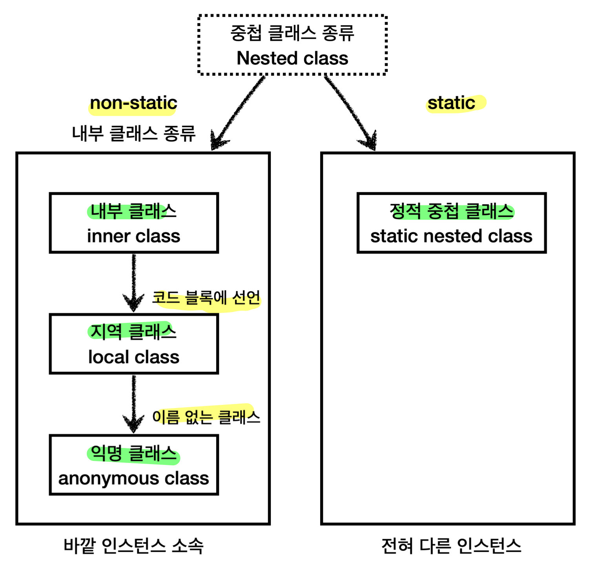
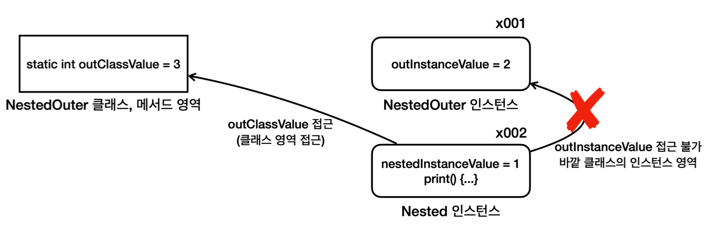
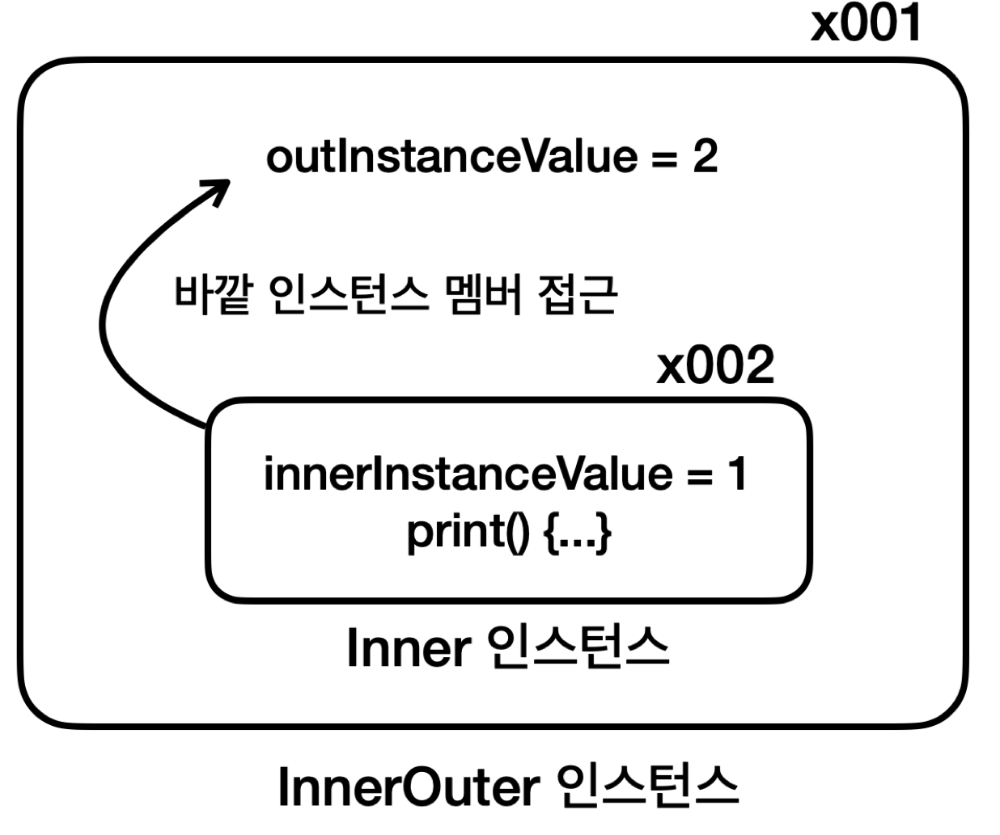
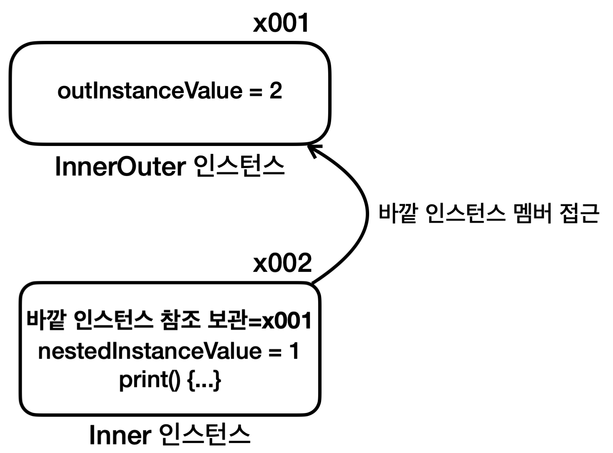
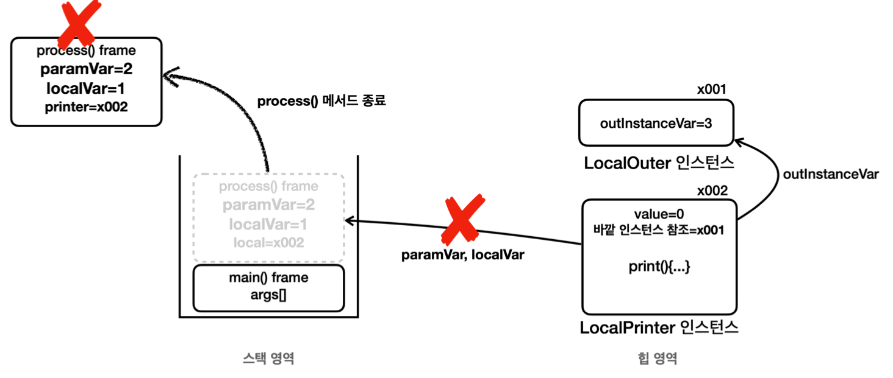
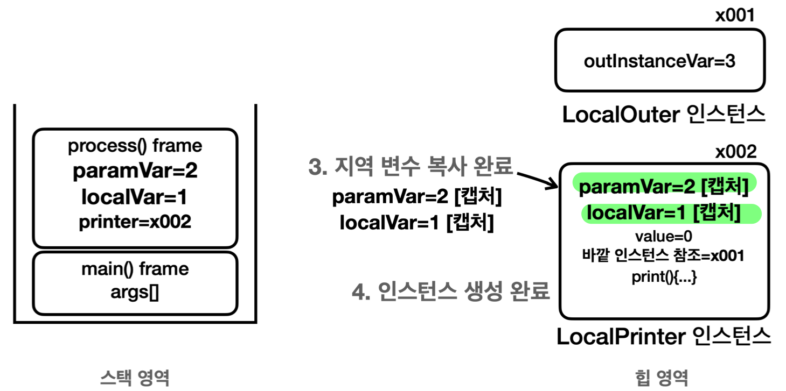

## 중첩 클래스의 분류

- **클래스를 정의하는 위치**에 따라 총 4가지, 크게 2가지로 분류 (변수 선언 위치와 동일)
	- **정적 중첩 클래스** (정적 변수와 같은 위치)
	- 내부 클래스
		- **내부 클래스** (인스턴스 변수와 같은 위치)
		- **지역 클래스** (지역 변수와 같은 위치)
		- **익명 클래스** (지역 클래스의 특별 버전)
- 중첩 클래스 사용 상황 => 패키지 내 꼭 필요한 클래스들만 노출시켜 **개발자의 혼란을 줄임**
	- 특정 클래스가 다른 하나의 클래스 **안에서만 사용됨** (다른 클래스에서 사용시 중첩 클래스 사용 X)
	- 둘이 아주 **긴밀하게 연결**되어 있는 경우
- 장점
	- **논리적 그룹화**
	- **캡슐화**
		- 다른 곳에서 사용될 필요 없는 **중첩 클래스가 외부에 노출 X**
		- **중첩 클래스**는 **바깥 클래스의 `private` 멤버에 접근 가능**
			- **불필요한 `public` 제거** 및 **긴밀한 연결**
- 정적 중첩 클래스 VS 내부 클래스 사용 상황
	- 바깥 클래스의 **인스턴스 상태에 의존**하고 **인스턴스 변수를 사용**할 것 같다면 **내부 클래스** 사용
	- **아닐 것 같다**면 **정적 중첩 클래스** 사용
## 정적 중첩 클래스 (Nested)

```java
public class NestedOuter {

	private static int outClassValue = 3;
	private int outInstanceValue = 2;
	
	static class Nested {
		private int nestedInstanceValue = 1;

		public void print() { 
			
			// 자신의 멤버에 접근
			System.out.println(nestedInstanceValue); 
			
			// 바깥 클래스의 인스턴스 멤버에는 접근할 수 없다.
			// System.out.println(outInstanceValue);

			// 바깥 클래스의 클래스 멤버에는 접근할 수 있다. private도 접근 가능
			System.out.println(NestedOuter.outClassValue);
			System.out.println(outClassValue);
		}
}
```
```java
public class NestedOuterMain {
	public static void main(String[] args) {
		//단독 생성 가능
		NestedOuter.Nested nested = new NestedOuter.Nested(); 
		nested.print();
	}
}
```
- **`static` 키워드 O**
- 바깥 클래스의 **인스턴스에 소속 X**
	- 바깥 클래스의 **내부**에 있지만, 바깥 클래스와 **관계 없는 전혀 다른 클래스** (내 것이 아닌 것)
	- 단지 구조상 중첩해뒀을 뿐 클래스 2개와 큰 차이 없음
		```java
		class NestedOuter {
		}
		
		class Nested {
		}
		```
- **바깥 클래스의 인스턴스 변수 접근 불가** (클래스 변수는 접근 가능)
	- 바깥 인스턴스의 **참조값이 없기 때문**
- `private` 접근 제어자 관점
	- 바깥 클래스와 중첩 클래스는 **서로의 `private` 접근 제어자에 접근 가능**
	- 둘은 **접근제어자 관점에서 한 식구**
- 생성 방법
	- 바깥 클래스의 바깥에서 접근 및 생성
		- 접근: `바깥클래스.중첩클래스`
		- 생성: `new 바깥클래스.중첩클래스()`
		- 바깥 클래스 생성과 상관없이 **단독 생성 가능**
	- **바깥 클래스의 내부에서 접근 및 생성** (**권장**)
		- 접근: `중첩클래스`
		- 생성: `new 중첩클래스()`
		- 정적 중첩 클래스는 `private`으로 두고 **바깥 접근 및 생성을 막는게 옳음**
		- 중첩 클래스의 **용도**는 소속된 바깥 클래스의 **내부에서 사용**되는 것이므로
		```java
		public class Network {
			 
			public void sendMessage(String text) {
				NetworkMessage networkMessage = new NetworkMessage(text);
			}
			
			private static class NetworkMessage {
				...
			}
		}
		```
## 내부 클래스 (Inner)
### 내부 클래스 (공통 개념)


```java
public class InnerOuter {
	
	private static int outClassValue = 3;
	private int outInstanceValue = 2;
	
	class Inner {
		
		private int innerInstanceValue = 1;
		
		public void print() {
			// 자신의 멤버에 접근 
			System.out.println(innerInstanceValue);
			
			// 외부 클래스의 인스턴스 멤버에 접근 가능, private도 접근 가능
			System.out.println(outInstanceValue);
			
			// 외부 클래스의 클래스 멤버에 접근 가능. private도 접근 가능
			System.out.println(InnerOuter.outClassValue);
		} 
	}
}
```
```java
public class InnerOuterMain {
	 
	 public static void main(String[] args) {
		 InnerOuter outer = new InnerOuter();
		 InnerOuter.Inner inner = outer.new Inner();
		 inner.print();
	 }
}
```
- **`static` 키워드 X**
- 바깥 클래스의 **인스턴스에 소속 O**
	- 바깥 클래스의 **내부**에 있으면서, 바깥 클래스를 **구성하는 요소** (나를 구성하는 요소)
	- **개념**상으로는 바깥 인스턴스 안에 내부 인스턴스가 생성
	- **실제**로는 내부 인스턴스가 **바깥 인스턴스의 참조값 보관**
- **바깥 클래스의 인스턴스 변수 접근 가능** (클래스 변수도 접근 가능)
	- 참조값을 가짐
- `private` 접근 제어자 관점
	- 바깥 클래스와 내부 클래스는 **서로의 `private` 접근 제어자에 접근 가능**
- 생성 방법
	- 바깥 클래스의 바깥에서 생성
		- 생성: `바깥클래스의 인스턴스 참조.new 내부클래스()`
		- **바깥 클래스의 인스턴스**를 **먼저 생성**해야 내부 클래스의 인스턴스 생성 가능
	- **바깥 클래스의 내부에서 생성** (**권장**)
		- 생성: `new 내부 클래스()`
		- **내부 클래스의 인스턴스**는 자신을 생성한 **바깥 클래스의 인스턴스**를 **자동으로 참조**
		```java
		public class Car {
			
			private String model;
			private int chargeLevel;
			private Engine engine;
			
			public Car(String model, int chargeLevel) {
				this.model = model;
				this.chargeLevel = chargeLevel;
				this.engine = new Engine();
			}
			
			public void start() {
				engine.start();
				System.out.println(model + " 시작 완료"); 
			}
			
			private class Engine {
				public void start() {
					System.out.println("충전 레벨 확인: " + chargeLevel);
					System.out.println(model + "의 엔진을 구동합니다."); }
				}
			}
			
		}
		```
- 종류
	- 내부 클래스: 바깥 클래스의 **인스턴스 멤버에 접근**
	- 지역 클래스: 내부 클래스의 특징 + 지역 변수에 접근
	- 익명 클래스: 지역 클래스의 특징 + 클래스 이름 X
### 지역 클래스
```java
class Outer {

	public void process() { 
		//지역 변수
		int localVar = 0; 
		
		//지역 클래스
        class Local {...}
        
        Local local = new Local();
	}
}
```
- **내부 클래스**의 종류 중 하나로 **지역 변수와 같이 코드 블럭 안에서 정의**
- **지역 변수에 접근 가능** (접근하는 지역 변수는 `final`이거나 사실상 `final`이어야 함)
- **접근 제어자 사용 불가** (Like 지역 변수)
- 사용 상황
	- **특정 메서드 내 간단히 사용**할 목적
- **지역 변수 캡처**
	- 지역 클래스 인스턴스 생성 시점에 **접근이 필요한 지역 변수는 복사**해서 **인스턴스에 보관하는 것**
		- 지역 클래스 인스턴스에서 지역 변수에 접근하면, **실제로는 인스턴스에 캡처한 변수로 접근**
		- **힙 영역**의 인스턴스가 **스택 영역**의 지역 변수에 **접근**하는 것은 **복잡한 상황**을 동반하기 때문
	```java
	public class LocalOuter {
	    
	    private int outInstanceVar = 3;
	    
	    public Printer process(int paramVar) {
		    
		    int localVar = 1; //지역 변수는 스택 프레임이 종료되는 순간 함께 제거된다. 
		    
		    class LocalPrinter implements Printer {
			    int value = 0;
	            
	            @Override
	            public void print() {
		            System.out.println("value=" + value);
		            
		            //인스턴스는 지역 변수보다 더 오래 살아남는다.
		            System.out.println("localVar=" + localVar);
		            System.out.println("paramVar=" + paramVar);
		            
	                System.out.println("outInstanceVar=" + outInstanceVar);
	            }
			}
			
			Printer printer = new LocalPrinter();
			// 지역클래스가 접근하는 지역 변수는 final이거나 사실상 final이어야 한다.
			// localVar = 10; // 컴파일 오류
			// paramVar = 20; // 컴파일 오류
			
			//printer.print()를 여기서 실행하지 않고 Printer 인스턴스만 반환한다. 
			return printer;
		}
	
		public static void main(String[] args) {
			LocalOuter localOuter = new LocalOuter();
			Printer printer = localOuter.process(2);
			//printer.print()를 나중에 실행한다. process()의 스택 프레임이 사라진 이후에 실행
			printer.print();
			
			//추가
			System.out.println("필드 확인");
			Field[] fields = printer.getClass().getDeclaredFields(); 
			for (Field field : fields) {
		        System.out.println("field = " + field);
		    }
		}
	}
	
	//실행결과
	
	//value=0
	//localVar=1
	//paramVar=2
	//outInstanceVar=3

	//필드 확인 
	
	//인스턴스 변수
	//field = int nested.local.LocalOuter$1LocalPrinter.value
	
	//캡처 변수
	//field = final int nested.local.LocalOuter$1LocalPrinter.val$localVar 
	//field = final int nested.local.LocalOuter$1LocalPrinter.val$paramVar
	
	//바깥 클래스 참조
	//field = final nested.local.LocalOuter nested.local.LocalOuter$1LocalPrinter.this$0
	```
	- 변수 생명 주기 차이 문제
		
		- `process()` 메서드 종료 후, 생존 중인 `LocalPrinter` 인스턴스의 `print()` 메서드 호출
		- 변수 생명주기를 고려하면
			- 지역변수(`localVar`, `paramVar`)는 `print()` 메서드 호출 시점 전 **이미 소멸**
			- `process()`의 스택 프레임이 사라지므로 지역 변수도 함께 소멸
		- 그러나 실행 결과는 **지역 변수들 값까지 모두 정상 출력**
	- 자바의 해결책: 지역 변수 캡처
		
		- `LocalPrinter` **인스턴스 생성 시점**에 지역 클래스가 접근하는 **지역 변수 확인**
		- 해당 지역 변수들을 **복사**해 **인스턴스에 포함**하여 생성 (`paramVar`, `localVar`)
		- `print()` 메서드에서 `paramVar`, `localVar`에 접근 시 **인스턴스에 있는 캡처 변수에 접근**
			- **캡처한 `paramVar` , `localVar` 의 생명주기** = **`LocalPrinter` 인스턴스의 생명주기**
			- 변수 생명 주기 차이 문제 해결
		- 실제로 `LocalPrinter` 인스턴스 내에서 캡쳐 변수 확인 가능 (자바가 내부 생성 및 사용)
	- 유의점: **지역 클래스가 접근**하는 **지역 변수 값**은 **변경하면 안됨**
		- 지역 클래스 접근 지역 변수는 **`final`로 선언**하거나 **사실상 `final`이어야 함**\
		- 지역 클래스 생성 시점에 지역 변수를 캡처하므로 생성 이후에는 값을 변경해서는 안됨
			- 스택 영역 지역 변수 값과 인스턴스 캡처 변수 값이 서로 달라지는 **동기화 문제 예방**
			- 두 변수를 동기화할 시 디버깅이 어렵고 멀티스레드 상황에서도 복잡하고 성능 저하 존재
			- 동기화 문제가 일어나지 않게 **지역 변수 변경을 원천 차단**하는게 깔끔
		- **자바 문법 규칙**이고 어길시 **컴파일 오류 발생**
		- 사실상 `final`(effectively final)
			- `final`을 사용하지 않았지만, 중간에 값을 변경하지 않는 것
			- `final`을 사용해도 동일하게 작동해야 함
		- 만일 캡처된 변수를 바꿔야 한다면, 새로 선언하면 됨 (굳이 사이드이펙트 만들 필요 X)
			- e.g.
				- `int x = localVar;`
				- `x++`
### 익명 클래스
- **지역 클래스**의 종류 중 하나
- **클래스 이름**을 **생략**하고 지역 클래스의 **상속**과 **구현**, **선언**과 **생성**을 **한번에 처리**
	- 지역 클래스의 선언과 생성
		```java
		//선언
		class LocalPrinter implements Printer{
		//body
		}
		
		//생성
		Printer printer = new LocalPrinter();
		```
	- 익명 클래스
		```java
		Printer printer = new Printer(){
		     //body
		}
		```
		- `new` 다음에 상속 혹은 구현할 부모 타입 입력
		- 부모 타입이 인터페이스일 시, 해당 인터페이스를 구현하는 익명 클래스를 생성
- 사용 상황
	- 인스턴스를 한 번만 생성할 수 있어 **일회성 사용**에 좋고 **코드가 간결**해짐
	- **복잡하거나 재사용이 필요한 경우 별도의 클래스를 정의**하는 것이 나음
- 특징
	- 반드시 부모 클래스를 **상속** 받거나 인터페이스를 **구현**해야 함
	- 생성자를 가질 수 없고, **기본 생성자**만 사용됨
	- 자바 내부에서 `바깥 클래스 이름` + `$` + `숫자`로 정의 (e.g. `AnonymousOuter$1`)
		- 익명 클래스가 여러개면 숫자가 증가하며 구분

>메서드의 재사용성을 높이는 팁
>
>**메서드(함수)의 재사용성**을 높이기 위해 **변하는 부분**과 **변하지 않는 부분**을 **분리**하고 **변하는 부분은 외부에서 전달 받자**. (데이터 혹은 코드 조각을 파라미터로 전달)
>중복을 제거하고 좋은 코드를 유지할 수 있다.

>외부에서 코드 조각을 전달하는 방법
>
>1. 인스턴스를 전달
>	- 메서드에 코드 조각을 담아두고 실행
>	- 다만, 코드 조각을 전달하기 위해 클래스를 정의하고 인스턴스를 생성하는 것이 번거로움
>	- e.g.
>		- 지역 클래스로 생성해 전달
>		- 익명 클래스로 생성해 전달
>2. **람다(Lambda)로 전달**
>	- 자바 8 이전: 메서드 인수로 기본형 타입과 참조형 타입만 전달할 수 있었음
>	- 자바 8 이후: 메서드 인수로 **함수**를 전달 가능
>	- **람다가 매우 편리** (람다가 없을 때는 코드 조각을 항상 익명 클래스로 전달했음...)

## 섀도잉 (Shadowing)
```java
// 내부 클래스 예시
public class ShadowingMain {
    
    public int value = 1;
    
    class Inner {
        public int value = 2;
        
        void go() {
            int value = 3;
            System.out.println("value = " + value); // 3
            System.out.println("this.value = " + this.value); // 2
            System.out.println("ShadowingMain.value = " + ShadowingMain.this.value); // 1
        }
	}
    
    public static void main(String[] args) {
        ShadowingMain main = new ShadowingMain();
        Inner inner = main.new Inner();
        inner.go();
    }
}
```
- **바깥 클래스의 인스턴스 변수 이름**과 **내부 클래스의 인스턴스 변수 이름**이 **같다면?**
- 변수 이름이 같을 때 프로그래밍에서는 대부분 **더 가깝거나 구체적인 것이 우선권을 가짐**
- **새도잉**: 다른 변수들을 가려서 보이지 않게 하는 것
	- value = 3
	- this.value = 2
	- ShadowingMain.value = 1
- 다른 변수를 가리더라도 **인스턴스 참조**를 사용해 외부 변수 접근 가능
	- 내부 클래스 인스턴스 접근: `this`
	- 바깥 클래스 인스턴스 접근: `바깥클래스이름.this`
- 물론, 이름이 같은 경우 **처음부터 이름을 서로 다르게 지어서 명확하게 구분**하는 것이 **더 나은 방법**
	```java
	public class LocalOuter {
	    
	    private int outInstanceVar = 3;
	    
	    public void process(int paramVar) {
	        
	        int localVar = 1;
	        
	        class LocalPrinter {
		        int value = 0;
	            
	            public void printData() {
	                System.out.println("value=" + value); //0
	                System.out.println("localVar=" + localVar); //1
	                System.out.println("paramVar=" + paramVar); //2
	                System.out.println("outInstanceVar=" + outInstanceVar); //3
	            }
	        }
	        
	        LocalPrinter printer = new LocalPrinter();
	        printer.printData();
	    }
	    
	    public static void main(String[] args) {
	        LocalOuter localOuter = new LocalOuterV1();
	        localOuter.process(2);
	    }
	}
	```