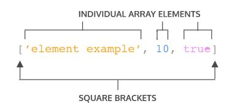
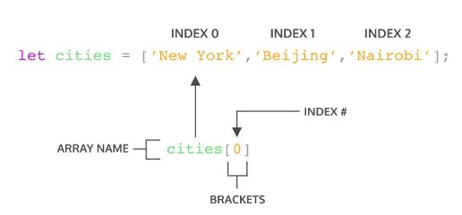

# Array

Javascript의 array는 어떤 data type도 저장할 수 있으며, 저장된 data마다 순서(index)를 지닙니다.


## Syntax



기본적인 문법은 `[]`을 중심으로 이뤄지며, array 내부에 다양한 type의 data들이 함께 저장될 수 있습니다.

​    

## Indexing



Array는 `[]`에 index를 사용하여 원하는 element에 접근할 수 있습니다. Indexing의 시작은 0부터 진행되며, 만일 element의 총 개수를 넘어가는 index로 접근할 경우 `undefined`가 반환됩니다.

* Indexing to String

  ```javascript
  const hello = 'Hello World';
  console.log(hello[6]);
  // Output: W
  ```

  또한, Indexing은 String type의 data에도 적용됨을 유의합니다.

* Update with index

  ```javascript
  let seasons = ['Winter', 'Spring', 'Summer', 'Fall'];
   
  seasons[3] = 'Autumn';
  console.log(seasons); 
  //Output: ['Winter', 'Spring', 'Summer', 'Autumn']
  ```

  Indexing을 사용하면 접근한 data를 원하는 값으로 update하는 것도 가능합니다.

​    

## let & const in array

```javascript
let condiments = ['Ketchup', 'Mustard', 'Soy Sauce', 'Sriracha'];

const utensils = ['Fork', 'Knife', 'Chopsticks', 'Spork'];

condiments[0] = 'Mayo';
console.log(condiments);  // [ 'Mayo', 'Mustard', 'Soy Sauce', 'Sriracha' ]

condiments = ['Mayo'];
console.log(condiments);  // [ 'Mayo' ]

utensils[3] = 'Spoon';
console.log(utensils);  // [ 'Fork', 'Knife', 'Chopsticks', 'Spoon' ]
```

`const` 변수에 저장한 array라도 해당 array 내부의 요소는 여전히 변경가능(mutable)합니다. 다만, 새로운 array 혹은 값을 변수에 재할당할 수는 없습니다.

​    

## Useful property & method

* `length`: array 내의 존재하는 element의 개수를 반환합니다.

* `push()`: array의 맨 끝에 element를 추가합니다. (이 때, 인자를 여러 개 받을 수 있습니다.)

  ```javascript
  const itemTracker = ['item 0', 'item 1', 'item 2'];
   
  itemTracker.push('item 3', 'item 4');
   
  console.log(itemTracker); 
  // Output: ['item 0', 'item 1', 'item 2', 'item 3', 'item 4'];
  ```

* `pop()`: array의 맨 끝의 element를 제거하고 그 값을 반환합니다. (인자를 받지 않습니다.)

* `shift()`: array 맨 앞의 element를 제거하고 반환합니다. (인자를 받지 않습니다.)

* `unshift()`: array의 맨 앞에 element를 추가합니다. (이 때, 인자를 여러 개 받을 수 있습니다.)

* `slice()`: 설정한 index대로 slicing한 결과를 반환합니다.

  ```javascript
  const animals = ['ant', 'bison', 'camel', 'duck', 'elephant'];
  
  console.log(animals.slice(2));
  // expected output: Array ["camel", "duck", "elephant"]
  
  console.log(animals.slice(2, 4));
  // expected output: Array ["camel", "duck"]
  
  console.log(animals.slice(1, 5));
  // expected output: Array ["bison", "camel", "duck", "elephant"]
  
  console.log(animals.slice(-2));
  // expected output: Array ["duck", "elephant"]
  
  console.log(animals.slice(2, -1));
  // expected output: Array ["camel", "duck"]
  ```

* `indexOf()`: 인자로 오는 값이 array에서 몇 번째 index인지 찾아 반환합니다.

​    

## Reference

[Codecademy - introduction to javascript](https://www.codecademy.com/courses/introduction-to-javascript/)
