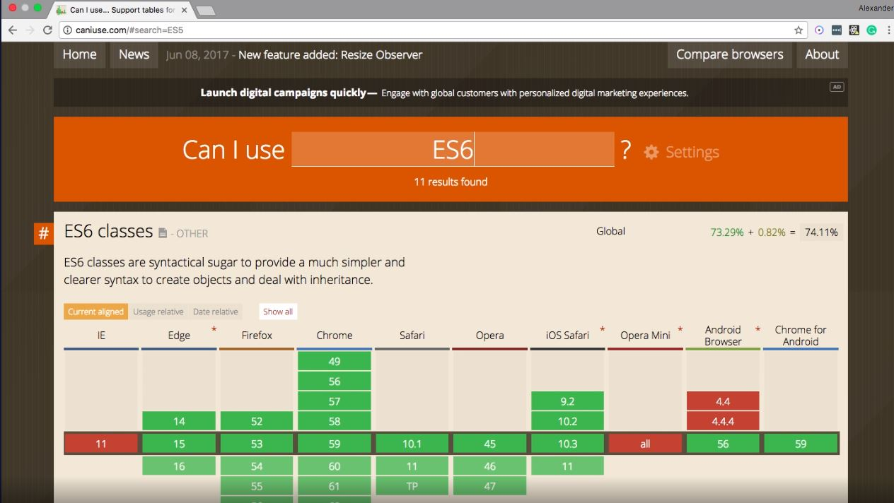

# Browser Compatibility & Transpilation

우리는 정기적으로 web browser의 update 알림을 받습니다. 주기적인 update가 필요한 이유는 보통 보안상 취약점을 처리하고 HTML, CSS 혹은 JavaScript의 새로운 syntax 버전을 지원하기 위해서입니다.

특히, JavaScript의 표준을 관리하는 기관, Ecma International이 2015년에 발표한 ECMAScript2015(흔히, ES6로 불리우는)가 등장했을 때, 많은 개발자들은 장점이 많은 ES6를 바로 채택하고 사용했지만 대부분의 브라우저에서 ES6가 지원되지 않아 브라우저 호환성(browser compatibility) 문제가 발생했습니다. 

이 챕터에서는 새로운 syntax 버전과의 gap으로 인해 발생하는 이러한 브라우저 호환성 이슈를 개발자들이 어떤식으로 처리하는지에 초점을 맞추려고 합니다. 

​    

## caniuse.com



caniuser.com은 브라우저 호환성 정보를 쉽게 찾아볼 수 있는 사이트입니다. 어떤 브라우저의 몇 번째 버전이 특정 라이브러리를 지원하는지 여부를 간단히 체크할 수 있습니다.

이 곳에서 검색해보면, ES5는 여전히 대다수의 브라우저에서 지원됩니다. 이와 달리, ES6는 점진적인 적용을 감안해야 합니다. 그 결과 대부분의 최신 버전 브라우저에서는 ES6가 원활히 지원되는 반면, ES6 module과 같은 ES6의 특정 feature들은 지원되지 않는 브라우저가 아직 대다수입니다.

​    

## ES6의 장점과 Transpilation의 필요성

ES6는 이전 버전인 ES5에 비해 상당한 이점들이 있습니다.

* Readability and economy of code
* Addresses sources of ES5 bugs
* A similarity to other programming languages

이러한 장점들은 많은 web developer들이 ES6를 곧바로 채택하도록 만들었습니다. 

다만, ECMA는 이로 인해 발생할 호환성 문제를 미리 예상해, ES6가 ES5 코드로 mapping될 수 있게끔 만들었습니다. 예를 들어, `const`나 `let` 키워드를 `var`로 mapping하거나, interpolation을 concatenation으로 mapping하는 방식입니다.

이러한 mapping은 충분히 규칙적이기 때문에, 개발자들은 ES6가 자동으로 ES5으로 변환되도록 하는 Babel이라는 JS library를 만들었습니다. 즉, 하나의 프로그래밍 언어를 다른 언어로 변환하는 과정을 transpilation이라고 하며, Babel은 ES6를 ES5로 transpile합니다. 

​    

## Babel

Babel은 ES6를 ES5로 손쉽게 transpile해주는 library입니다. 먼저, Babel을 사용하기 위해 ES6의 파일(main.js)의 위치를 `./src/main.js`에 둡니다.

```
project
|_ src
|___ main.js  // ES6 file 
```

그리고 Babel을 설치하기 전에 npm을 사용할 수 있게끔 프로젝트를 setup해야 합니다. npm은 node project manager의 약자로 node package에 대한 접근과 관리를 위해 사용됩니다. npm을 사용하면 작업의 반복과 버그를 줄일 수 있습니다.

터미널에서 npm을 init합니다. (Node가 설치되어 있어야 합니다!)

```bash
npm init
```

이 때, metadata에 관한 사항을 적어달라는 prompt가 나오는데, title과 description정도만 입력하고 전부 무시해도 좋습니다. (title, description 역시 선택사항입니다.)

Init 이후에, root 디렉토리에는 `package.json` 파일이 생성됩니다. `package.json` 파일은 해당 프로젝트의 metadata와 프로젝트를 실행하기 위해 필요한 node package 목록, command line scripts에 해당하는 key-value pair 등을 저장합니다. 


Babel은 터미널 창에서 다음과 같이 사용합니다.

* Babel package 설치하기 (2개 모두)

  * for CLI tool

  ```bash
  npm install babel-cli -D
  ```

  * for mapping information

  ```bash
  npm install babel-preset-env -D
  ```

  실행이 완료되면 Babel 패키지 및 관련된 모든 dependency들이 `node_modules` 디렉토리에 저장되어 있는 것을 확인할 수 있습니다.

  > `-D` 옵션
  >
  > `-D`는 해당 패키지를 `package.json`의 `devDependencies`라는 property에 추가하는 옵션입니다. 일단 `devDependencies`에 추가된 패키지들은 다른 개발자들이 현재 프로젝트를 실행할 때 각각의 패키지를 install할 필요없이 `npm install` 커맨드 한 번으로 모두 설치되는 이점을 가집니다.

* Source가 되는 JS version 설정하기

  Root 디렉토리에서 `.babelrc` 파일을 생성합니다.

  ```bash
  touch .babelrc
  ```

  `.babelrc` 내에 source가 될 js 파일의 버전을 명시합니다. 아래와 같은 object를 파일에 저장하면, Babel은 ES6+에 대한 코드들을 목표 언어로 변환할 것입니다.

  ```
  {
    "presets": ["env"]
  }

* `package.json`에 Babel 실행을 위한 script 기재하기

  `package.json`에 `script` property에 가보면 다음과 같은 객체가 존재함을 확인할 수 있습니다.

  ```json
  ...
  "scripts": {
    "test": "echo \"Error: no test specified\" && exit 1"
  }, ...
  ```

  이 객체의 `"test"` property 밑에, 다음과 같이 Babel을 실행하기 위한 script를 하나 추가합니다.

  ```json
  ...
  "scripts": {
    "test": "echo \"Error: no test specified\" && exit 1",
    "build": "babel src -d lib"
  }
  ```

  추가한 코드는 각각 다음과 같은 의미를 가지고 있습니다.

  - `babel` — The Babel command call responsible for transpiling code.
  - `src` — Instructs Babel to transpile all JavaScript code inside the **src** directory.
  - `-d` — Instructs Babel to write the transpiled code to a directory.
  - `lib` — Babel writes the transpiled code to a directory called `lib`.

* Babel 실행하기 (root directory)

  ```bash
  npm run build
  ```

작업이 완료되면 **./lib** 디렉토리에 변환된 ES5 코드가 담긴 파일을 확인할 수 있습니다. 파일명은 본래의 ES6 파일명과 동일하게 생성됩니다.

최종적인 디렉토리 구조는 다음과 같습니다.

```
project
|_ lib
|___ main.js
|_ node_modules
|___ .bin
|___ ...
|_ src
|___ main.js
|_ .babelrc
|_ package.json
```