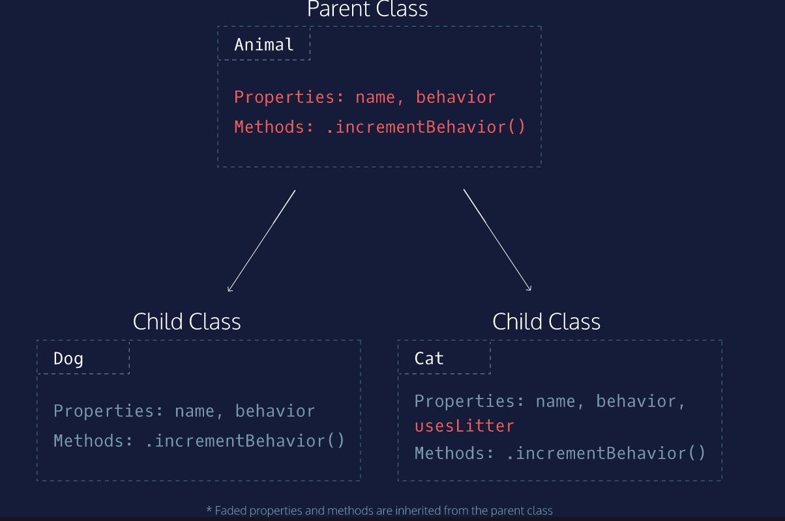

# Class

Javascript는 OOP(object-oriented programming) language입니다. 따라서, 실제 세계를 모델로 class와 instance를 만들어 object들을 사용할 수 있습니다.

​    

## Syntax example

```javascript
class Dog {
  constructor(name) {
    this._name = name;
    this._behavior = 0;
  }

  get name() {
    return this._name;
  }
  get behavior() {
    return this._behavior;
  }   

  incrementBehavior() {
    this._behavior ++;
  }
}

const halley = new Dog('Halley');
console.log(halley.name); // Print name value to console
console.log(halley.behavior); // Print behavior value to console
halley.incrementBehavior(); // Add one to behavior
console.log(halley.name); // Print name value to console
console.log(halley.behavior); // Print behavior value to console
```

* `class`

  Class를 생성하기 위해 필요한 키워드 입니다.

* `constructor`

  Class가 object와 가장 구분되는 지점은 `constructor` 메서드의 유무입니다. `constructor`는 새로운 instance가 만들어질 때마다 호출되는 class의 중요한 메서드이며, instance를 초기화하는 역할을 합니다.

* `this`

  Class의 맥락에서 `this`는 해당 class의 instance를 의미합니다.

* `new`

  Class의 instance를 생성하기 위해 사용하는 키워드입니다. `new`는 class 내의 `constructor()` 메서드를 호출하고 새로운 instance를 반환합니다.

​    

## 상속(Inheritance)

```javascript
class Cat {
  constructor(name, usesLitter) {
    this._name = name;
    this._usesLitter = usesLitter;
    this._behavior = 0;
  }
 
  get name() {
    return this._name;
  }
 
  get behavior() {
    return this._behavior;
  }
 
  get usesLitter() {
    return this._usesLitter;
  }
 
  incrementBehavior() {
    this._behavior++;
  }
}
```

앞선 class의 예제에서 `Dog` class를 만들었던 것처럼, `Cat` class도 이와 유사하게 만들 수 있습니다. 여기선 `Cat`의 경우 모든 것이 `Dog`와 동일하지만 배변기 사용 가능 여부를 나타내는 `usesLitter` property만 하나 더 가집니다.



이렇게 여러 class가 동일한 부분을 가질 경우, 코드의 반복을 피하기 위해 부모 class를 만들어 자식 class가 이를 **상속(inheritance)**받게끔 설계하는 것이 효율적입니다. 상속은 부모 class가 가지는 property와 method를 동일하게 사용할 수 있게끔 물려받는 것을 의미합니다. 상속을 사용하면 코드의 가독성이 높아지고 유지보수가 매우 쉬워집니다.

```javascript
class Animal {
  constructor(name) {
    this._name = name;
    this._behavior = 0;
  }
 
  get name() {
    return this._name;
  }
 
  get behavior() {
    return this._behavior;
  }   
 
  incrementBehavior() {
    this._behavior++;
  }
} 
```

따라서, 위와 같이 `Animal` class를 만들어 `Dog`와 `Cat`의 공통된 부분을 모은 후, 이를 각자 상속받도록 설계하는 것이 보다 나은 코드를 만드는 방향이 될 것입니다.

`Animal`을 상속받은 `Cat`의 코드는 다음과 같습니다. 

```javascript
class Cat extends Animal {
  constructor(name, usesLitter) {
    super(name);
    this._usesLitter = usesLitter;
  }
  
  get usesLitter() {
    return this._usesLitter;
  }
}
```

* `extends`

  Class를 다른 class의 자식 class로 만들기 위해 사용하는 키워드입니다. 부모 class의 method들을 자식 class가 사용할 수 있게 됩니다.

* `super`

  부모 class의 `constructor` 메서드를 호출하는 키워드입니다. 부모 class의 property 상속과 관련이 깊습니다.

  또한, 자식 class에서 `this`를 사용하기 위해, 자식 class 내의 `constructor` 메서드 첫 번째 줄에 반드시 호출해주어야 합니다. (그렇지 않으면, reference error가 발생합니다!)

```javascript
const bryceCat = new Cat('Bryce', false); 
console.log(bryceCat._name); // output: Bryce
console.log(bryceCat.name); // output: Bryce
```

끝으로, `Animal` class를 상속받은 `Cat`은 위와 같이 instance를 만들어 사용할 수 있습니다.

​    

## Static method

Static method는 class에 직접적으로 접근해 사용하는 메서드를 말합니다. 해당 class의 instance를 통해서는 사용할 수 없다는 특징이 있습니다. 예를 들어, `Date` class는 instance를 만들 수 있으면서 `.now()` 같은 static method를 사용할 수 있습니다.

다음은 `Animal` class에 static method `generateName`을 추가한 코드입니다.

```javascript
class Animal {
  constructor(name) {
    this._name = name;
    this._behavior = 0;
  }
 
  static generateName() {
    const names = ['Angel', 'Spike', 'Buffy', 'Willow', 'Tara'];
    const randomNumber = Math.floor(Math.random()*5);
    return names[randomNumber];
  }
} 

console.log(Animal.generateName()); // returns a name
```

* `static`

  Static method를 선언하는 키워드입니다. `static`이 사용된 메서드는 instance를 통해 사용할 수 없고, class에서 직접적으로 접근해야 호출 가능합니다. Instance를 통해 호출할 경우, error를 일으킵니다.

​    

## Reference

[Codecademy - introduction to javascript](https://www.codecademy.com/courses/introduction-to-javascript/)