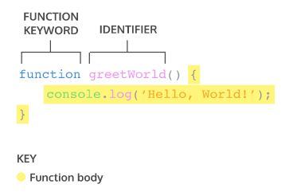
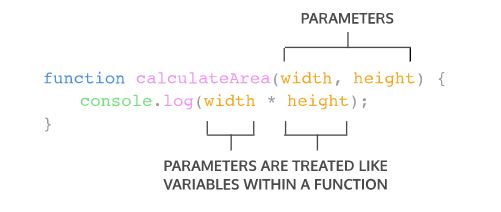
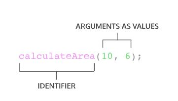
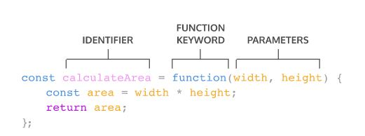
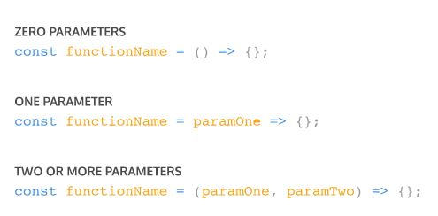
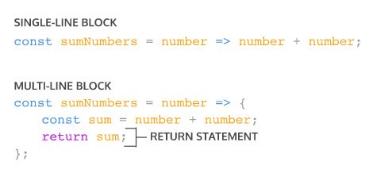

# Function of Javascript

## Syntax



​    

## Syntax of declaring parameter and calling with argument

Parameter를 함수에 선언하는 문법은 다음과 같습니다.



그리고 다음과 같이 인자를 전달해 해당 함수를 호출합니다.



​    

## Default parameter

Javascript에서 default parameter는 ES6 버전에서 소개되었습니다. 함수에 default parameter를 설정해두면, 인자가 전달되지 않거나 data type이 undefined인 인자가 전달될 때 argument의 값으로 default parameter에 설정된 값이 오게 됩니다.

```javascript
function greeting (dog = 'stranger dog') {
  console.log(`Hello, ${dog}!`)
}
 
greeting('Welsh Corgi') // Output: Hello, Welsh Corgi!
greeting() // Output: Hello, stranger dog!
```

​    

## Return

보통의 언어들처럼 `return` 키워드를 사용해 함수의 결과를 반환합니다. 만일 어떤 값을 리턴하지 않으면, 기본적으로 `undefined` 값이 반환됩니다.

```javascript
function greeting(name) {
  let text = 'Bow wow, hello ' + name + '!';
}
console.log(greeting('lucian')) // Prints undefined
```

```javascript
function greeting(name) {
  let text = 'Bow wow, hello ' + name + '!';
  return;
}
console.log(greeting('lucian')) // Prints undefined
```

​    

## Hoisting

Javascript는 함수가 선언된 곳 이전에서도 해당 함수를 호출할 수 있습니다. 이러한 Javascript의 특징을 hoisting이라고 부릅니다. 다만, 함수 선언 이전에 호출하는 것은 일반적으로 좋은 방법이 아니기 때문에, hoisting의 사용은 지양하는 것이 좋습니다.

```javascript
greeting(); // Output: Hello, World!
 
function greeting() {
  console.log('Hello, bow wow!');
}
```

​    

## 함수 표현식 (Function Expression)

함수를 정의하는 또 다른 방법으로 함수 표현식이 있습니다. 보통의 함수 선언식과 달리 함수 표현식은 익명함수를 변수에 저장하는 방식으로 구현합니다.(ES6부터 보통 `const` 변수에 담습니다.) 익명함수는 식별자(이름)가 없는 함수를 말합니다. 함수 표현식의 기본 문법 예제는 다음과 같습니다.



함수 표현식으로 만든 함수는 변수의 이름을 사용해서 호출합니다.

```javascript
variableName(argument1, argument2)
```

함수 표현식에서 또 한 가지 유의할 점은 hoisting이 적용되지 않는다는 것입니다. 함수 표현식은 **항상 함수를 호출하기 전에 위치해야 합니다.**

​    

## Arrow function

함수를 짧게 정의하도록 돕는 또 하나의 방법입니다. `function` 키워드를 쓰는 대신 `=>`를 써서 함수를 선언합니다. 다음은 arrow function의 syntax 예제입니다.

```javascript
const greeting = (name) => {
  let text = `Hi, ${name}. Bow wow!`
  return text;
};

console.log(greeting('Lucian'));  // Hi, Lucian. Bow wow!
```

​    

## Concise arrow function

Arrow function은 몇 가지 조건 하에서 더욱 간결해질 수 있습니다.

먼저, 함수의 parameter가 한 개라면, `()` 없이 parameter를 선언할 수 있습니다.



함수의 body가 single-line block일 경우, `{}`은 생략할 수 있습니다. `{}`이 없는 경우, 해당 body의 결과는 `return` 키워드에 상관없이 자동으로 반환됩니다.



​    

## Reference

[Codecademy - introduction to javascript](https://www.codecademy.com/courses/introduction-to-javascript/)

[함수 표현식 VS 함수 선언식](https://joshua1988.github.io/web-development/javascript/function-expressions-vs-declarations/)