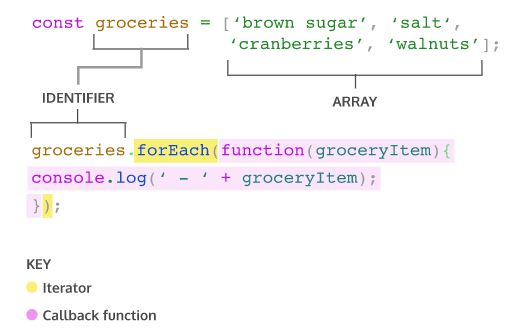

# Iterator

Looping을 더욱 쉽게 만들어주는 JavaScript의 built-in array methods를 iteration method(=iterator)라고 합니다. Iterator는 array가 element들을 조작하고 value를 반환하기 위해 호출하는 메서드로서 도움을 줍니다.

​    

## forEach()



`forEach()`는 특정 함수를 array 각각의 element들에 적용하는 iterator입니다. 보통 iterator의 인자로 함수를 받은 후, element들 각각을 인자로 사용해 해당 함수를 호출합니다. (이렇게 다른 함수의 인자로 사용되는 함수를 callback 함수라고 부릅니다.)

`forEach()`는 기존의 array를 변경하지 않으며, `undefined`를 return합니다.

```javascript
groceries.forEach(groceryItem => console.log(groceryItem));
```

또한, arrow function을 인자로 사용해 iterator를 호출할 수도 있습니다. 이처럼, iterator의 인자로 사용되는 함수의 syntax는 임의로 자유롭게 사용할 수 있습니다.

​    

## map()

```javascript
const numbers = [1, 2, 3, 4, 5]; 
 
const bigNumbers = numbers.map(number => {
  return number * 10;
});

console.log(numbers); // Output: [1, 2, 3, 4, 5]
console.log(bigNumbers); // Output: [10, 20, 30, 40, 50]
```

`map()` 역시 `forEach()`와 비슷하게 동작합니다. 인자로 callback 함수를 받아, array 각각의 element를 callback 함수의 인자로 사용합니다. 다만, `map()`은 함수를 적용한 새로운 값들을 array에 담아서 반환한다는 점이 특징입니다.

​    

## filter()

```javascript
const words = ['chair', 'music', 'pillow', 'brick', 'pen', 'door']; 
 
const shortWords = words.filter(word => {
  return word.length < 6;
});

console.log(words); // Output: ['chair', 'music', 'pillow', 'brick', 'pen', 'door']; 
console.log(shortWords); // Output: ['chair', 'music', 'brick', 'pen', 'door']
```

`filter()`는 원래의 array에서 특정 조건에 만족하는 element들만 골라내어 새로운 array에 담아 반환합니다. 따라서, `filter()`에 인자로 사용되는 callback 함수는 반드시 `boolean` 값을 리턴하는 함수여야 합니다. 이 때, callback 함수가 `true`를 반환하게 하는 element들이 새로운 array에 담깁니다.

​    

## findIndex()

```javascript
const jumbledNums = [123, 25, 78, 5, 9]; 
 
const lessThanTen = jumbledNums.findIndex(num => {
  return num < 10;
});

console.log(lessThanTen); // Output: 3 
console.log(jumbledNums[3]); // Output: 5
```

`findIndex()`는 특정 element의 위치를 알고 싶을 때 사용하는 iterator입니다. Callback 함수가 true를 반환하는 첫 번째 element의 index를 return합니다. 만일, callback 함수의 조건을 충족하는 element가 없다면 `findIndex()`는 `-1`을 반환합니다.

​    

## reduce()

```javascript
const numbers = [1, 2, 4, 10];
 
const summedNums = numbers.reduce((accumulator, currentValue) => {
  return accumulator + currentValue
})
 
console.log(summedNums) // Output: 17
```

| Iteration | `accumulator` | `currentValue` | return value |
| --------- | ------------- | -------------- | ------------ |
| First     | 1             | 2              | 3            |
| Second    | 3             | 4              | 7            |
| Third     | 7             | 10             | 17           |

`reduce()`는 말그대로 array을 감소시켜 하나의 값으로 만드는 iterator입니다. Callback 함수에 따라 array의 각 element를 accumulator에 대해 계산해, 최종적으로 하나의 계산 값을 반환합니다.

```javascript
const numbers = [1, 2, 4, 10];
 
const summedNums = numbers.reduce((accumulator, currentValue) => {
  return accumulator + currentValue
}, 100)  // <- Second argument for .reduce()
 
console.log(summedNums); // Output: 117
```

| Iteration # | `accumulator` | `currentValue` | return value |
| ----------- | ------------- | -------------- | ------------ |
| First       | 100           | 1              | 101          |
| Second      | 101           | 2              | 103          |
| Third       | 103           | 4              | 107          |
| Fourth      | 107           | 10             | 117          |

또한, `reduce()`는 optional한 두 번째 parameter를 받을 수 있으며, 이 때 해당 parameter는 accumulator로서 사용됩니다.