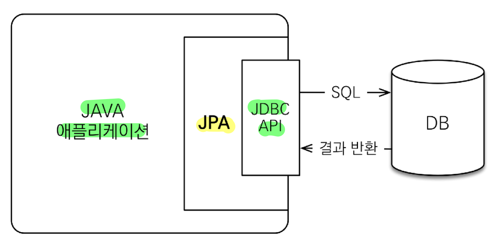
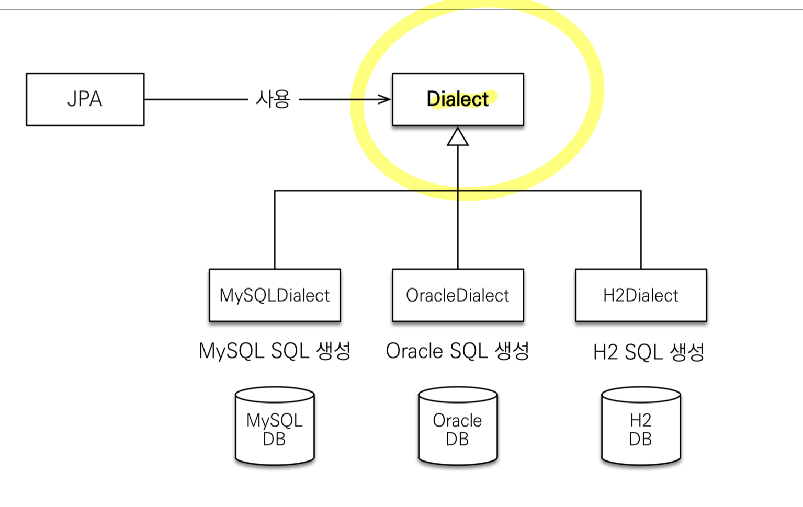
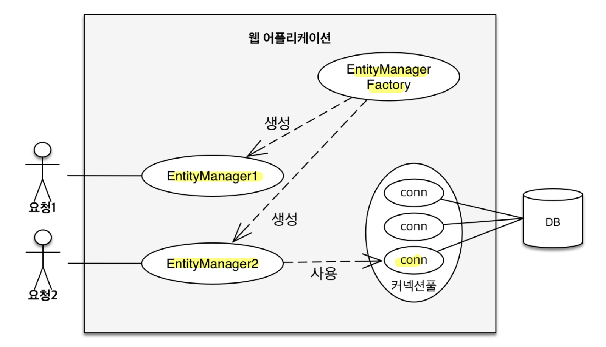

## JPA 개요
- SQL 중심적인 개발의 문제점
	- **코드 반복**
		- 정형화된 쿼리 반복 (`INSERT`, `UPDATE`, `SELECT`, `DELETE`)
		- 반복적인 자바 객체 매핑 작업 (자바 객체 -> SQL, SQL -> 자바 객체)
	- **SQL 유지보수의 어려움**
		- 테이블 필드 추가 시 모든 SQL에 개발자가 직접 필드를 추가해야 함
		- 실수 시 기능 이상 발생
	- **패러다임의 불일치** (객체 지향 & 관계형 DB)
		- 객체 지향 & 관계형 DB의 차이
			- 상속
				- 객체 상속 VS Table 슈퍼타입 서브타입 관계 (One-to-Many)
				- 여러 테이블을 삽입하고 조회하게 되어 객체 변환 과정이 번거로움
			- 연관관계
				- 객체는 참조(Reference) VS Table은 Foreign Key
				- 객체를 테이블에 맞추어 모델링하게 됨 (`teamId`)
				- 객체 다운 모델링을 하면 객체 변환 과정이 번거로움(`Team`)
			- 객체 그래프 탐색
				- 객체는 자유롭게 객체 그래프 탐색 VS 실행하는 SQL에 따라 탐색 범위 결정
				- 계층형 아키텍처에서 **진정한 의미의 계층 분할이 어려움** (**엔터티 신뢰 문제**)
				- 즉, **물리적으로는 계층이 분할되었지만, 논리적으로는 계층이 분할되어 있지 않음**
					- 계층형 아키텍처는 다음 계층을 믿고 쓸 수 있어야 함
					- 만약, 서비스 계층 개발 중에 다른 개발자가 만든 DAO `find`를 쓸 때 
					  조회된 엔터티의 `getTeam`, `getOrder` 나아가 `getDelivery`가 가능한지는
					  DAO 내부의 SQL 쿼리를 까봐야 알 수 있음
					- 즉, 다음 계층에 대한 신뢰가 없음
			- 데이터 식별 방법 (`==`)
				-  같은 ID를 2번의 조회로 데이터 가져온 상황에서
					- SQL로 조회한 2개 데이터는 서로 다르다
					- 컬렉션에서 같은 ID로 찾은 객체는 항상 같음
		- **객체 다운 모델링을 할수록 매핑 작업이 무수히 늘어남**
		- 객체를 **자바 컬렉션에 저장하듯이** DB에 저장할 수는 없을까?
- JPA (Java Persistence API)
	
	- 자바 진영의 ORM 기술 표준
		- JPA 표준 명세로 인터페이스의 모음
		- JPA 2.1 표준 명세를 구현한 3가지 구현체 (**하이버네이트**, EclipseLink, DataNucleus)
		- 2.0에서 대부분의 ORM 기능을 포함
	- 객체는 객체대로 RDB는 RDB대로 설계하고 ORM 프레임워크가 중간에서 매핑
		- JVM 내 **JAVA 애플리케이션**과 **JDBC API** **사이에서 동작**
		- **패러다임 불일치를 중간에서 해결** (SQL 생성, 객체 매핑)
	- SQL 중심적인 개발에서 벗어나 **객체 중심으로 개발**해 **생산성** 및 **유지보수** 향상
		- 필드 추가 시, JPA가 알아서 SQL을 동적 생성
		- 자바 컬렉션에 저장하듯이 코드를 작성하여 패러다임 불일치를 해결 (객체 매핑 자동화)
## JPA 성능 최적화 기능
- **1차 캐시**와 동일성 보장
	- **같은 트랜잭션 안**에서는 **1차 캐시를 조회해 같은 엔티티를 반환** (약간의 조회 성능 향상)
	- Read Committed여도 **애플리케이션 단에서 Repeatable Read 보장**
- **쓰기 지연** (transactional write-behind)
	- `INSERT` SQL을 버퍼에 모아두었다 **트랜잭션 커밋 시 한 번에 DB에 보냄** (JDBC BATCH SQL)
	- `UPDATE`, `DELETE`도 트랜잭션 커밋 시 한 번에 보내서 **락(Lock) 시간을 최소화**
- **지연 로딩** (Lazy Loading) & **즉시 로딩** (Eager Loading)
	- 지연 로딩: 객체가 실제 사용될 때 로딩
	- 즉시 로딩: JOIN SQL로 한번에 연관된 객체까지 미리 조회
	- **지연 로딩으로 개발**하다가 **성능 최적화가 필요한 부분은 즉시 로딩**을 적용해 해결

>기술 사이에 계층이 생길 때
>
>**중간**에 기술이 껴서 **계층**이 생긴다면 항상 2가지의 **성능 최적화**가 가능하다.
>1. 캐시
>2. Buffer로 Write 가능 (모아서 보내기 가능)

## JPA 설정하기
- JPA 설정 파일 (`persistence.xml`)
	- 경로: `/META-INF/persistence.xml`
	- 이름 지정: `persistence-unit name`
	- 설정 값 종류
		- JPA 표준 속성: `jakarta.persistence.~`
		- 하이버네이트 전용 속성: `hibernate.~`
	- **스프링 부트를 쓴다면 생성할 필요 없음**
		- 대신 **`application.properties`** 사용
		- **`spring.jpa.properties`** 하위에 똑같은 속성 추가
- **Dialect (방언)**
	
	- SQL 표준을 지키지 않는 **특정 DB만의 고유한 기능**
	- 각각 DB가 제공하는 SQL 문법 및 함수가 조금씩 다름
		- 페이징: MySQL-LIMIT, Oracle-ROWNUM
	- JPA는 특정 DB에 종속되지 않지만 **Dialect 설정은 필요**
		- **`hibernate.dialect`** 속성 값 지정 (하이버네이트는 40가지 이상의 Dialect 지원)
		- H2: `H2Dialect`
		- Oracle: `Oracle10gDialect`
		- MySQL: `MySQL5InnoDBDialect`
## JPA 동작 원리

- 주요 객체
	- **`EntityManagerFactory`**
		- 하나만 생성해서 애플리케이션 전체에서 공유
	- **`EntityManager`**
		- JPA의 모든 데이터 변경은 트랜잭션 안에서 실행
		- 한 트랜잭션 단위로 1회 사용하고 버림 (쓰레드 간 공유 X)
- 동작 순서
	- **`Persistence`**(클래스)가 `persistence.xml` **설정 정보 조회**
	- `Persistence`가 **`EntityManagerFactory`** 생성
	- `EntityManagerFactory`가 **`EntityManager`** 생성
## JPQL
- 단순한 조회 방법
	- `EntityManager.find()`
	- 객체 그래프 탐색 - `a.getB()`, `b.getC()`
- **검색조건이 포함된 SQL의 필요성**
	- 단순 조회는 문제 없지만 애플리케이션이 **필요한 데이터만 DB에서 불러오려면** 결국 검색 SQL이 필요
- **JPQL**
	- **엔터티 객체**를 대상으로 검색하는 **객체 지향 SQL** (JPA 제공)
		- 반면에, SQL은 데이터베이스 **테이블**을 대상으로 쿼리
	- SQL을 추상화해서 **특정 DB SQL에 의존 X**
		- JPQL은 현재 설정 Dialect와 합쳐져 **현재 DB에 맞는 적절한 SQL을 생성하고 전달**
		- **DB를 바꿔서** Dialect가 바뀌었더라도 **JPQL 자체를 바꿀 필요는 없음**
## 객체 & 테이블 매핑
- `@Entity`: JPA가 관리할 객체
- `@Id`: DB Primary Key