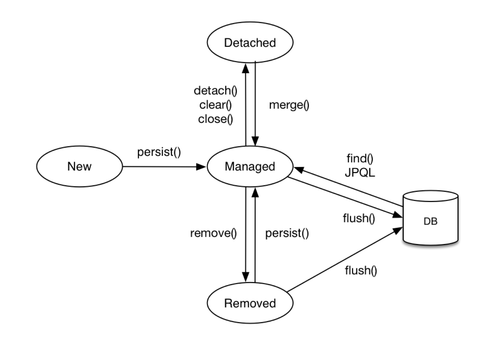
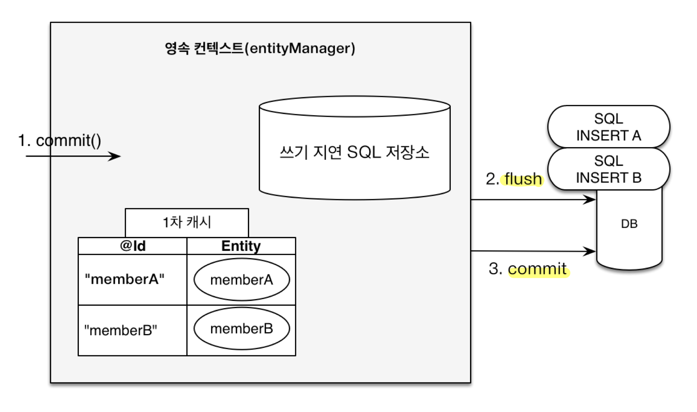
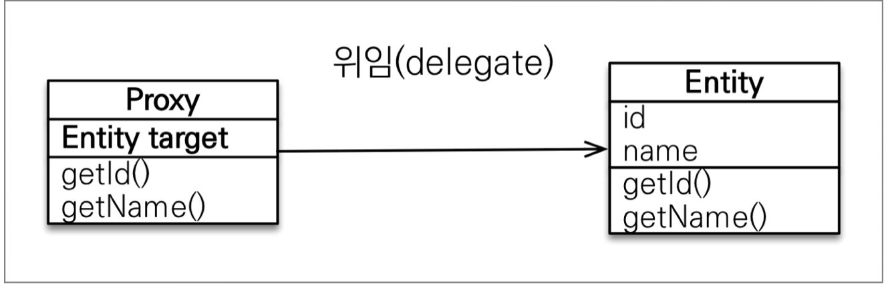

## JPA 개요
- SQL 중심적인 개발의 문제점
	- **코드 반복**
		- 정형화된 쿼리 반복 (`INSERT`, `UPDATE`, `SELECT`, `DELETE`)
		- 반복적인 자바 객체 매핑 작업 (자바 객체 -> SQL, SQL -> 자바 객체)
	- **SQL 유지보수의 어려움**
		- 테이블 필드 추가 시 모든 SQL에 개발자가 직접 필드를 추가해야 함
		- 실수 시 기능 이상 발생
	- **패러다임의 불일치** (객체 지향 & 관계형 DB)
		- 객체 지향 & 관계형 DB의 차이
			- 상속
				- 객체 상속 VS Table 슈퍼타입 서브타입 관계 (One-to-Many)
				- 여러 테이블을 삽입하고 조회하게 되어 객체 변환 과정이 번거로움
			- 연관관계
				- 객체는 참조(Reference) VS Table은 Foreign Key
				- 객체를 테이블에 맞추어 모델링하게 됨 (`teamId`)
				- 객체 다운 모델링을 하면 객체 변환 과정이 번거로움(`Team`)
			- 객체 그래프 탐색
				- 객체는 자유롭게 객체 그래프 탐색 VS 실행하는 SQL에 따라 탐색 범위 결정
				- 계층형 아키텍처에서 **진정한 의미의 계층 분할이 어려움** (**엔터티 신뢰 문제**)
				- 즉, **물리적으로는 계층이 분할되었지만, 논리적으로는 계층이 분할되어 있지 않음**
					- 계층형 아키텍처는 다음 계층을 믿고 쓸 수 있어야 함
					- 만약, 서비스 계층 개발 중에 다른 개발자가 만든 DAO `find`를 쓸 때 
					  조회된 엔터티의 `getTeam`, `getOrder` 나아가 `getDelivery`가 가능한지는
					  DAO 내부의 SQL 쿼리를 까봐야 알 수 있음
					- 즉, 다음 계층에 대한 신뢰가 없음
			- 데이터 식별 방법 (`==`)
				-  같은 ID를 2번의 조회로 데이터 가져온 상황에서
					- SQL로 조회한 2개 데이터는 서로 다르다
					- 컬렉션에서 같은 ID로 찾은 객체는 항상 같음
		- **객체 다운 모델링을 할수록 매핑 작업이 무수히 늘어남**
		- 객체를 **자바 컬렉션에 저장하듯이** DB에 저장할 수는 없을까?
- JPA (Java Persistence API)
	
	- 자바 진영의 ORM 기술 표준
		- JPA 표준 명세로 인터페이스의 모음
		- JPA 2.1 표준 명세를 구현한 3가지 구현체 (**하이버네이트**, EclipseLink, DataNucleus)
		- 2.0에서 대부분의 ORM 기능을 포함
	- 객체는 객체대로 RDB는 RDB대로 설계하고 ORM 프레임워크가 중간에서 매핑
		- **JVM** 내 **JAVA 애플리케이션**과 **JDBC API** **사이에서 동작**
		- **패러다임 불일치를 중간에서 해결** (SQL 생성, 객체 매핑)
	- SQL 중심적인 개발에서 벗어나 **객체 중심으로 개발**해 **생산성** 및 **유지보수** 향상
		- 필드 추가 시, JPA가 알아서 SQL을 동적 생성
		- 자바 컬렉션에 저장하듯이 코드를 작성하여 패러다임 불일치를 해결 (객체 매핑 자동화)
## JPA 설정하기
- JPA 설정 파일 (`persistence.xml`)
	- 경로: `/META-INF/persistence.xml`
	- 이름 지정: `persistence-unit name`
	- 설정 값 분류
		- JPA 표준 속성: `jakarta.persistence.~`
		- 하이버네이트 전용 속성: `hibernate.~`
	- **스프링 부트를 쓴다면 생성할 필요 없음**
		- 대신 **`application.properties`** 사용
		- **`spring.jpa.properties`** 하위에 똑같은 속성 추가
- **Dialect (방언)**
	
	- SQL 표준을 지키지 않는 **특정 DB만의 고유한 기능**
	- 각각 DB가 제공하는 SQL 문법 및 함수가 조금씩 다름
		- 페이징: MySQL-LIMIT, Oracle-ROWNUM
	- JPA는 특정 DB에 종속되지 않지만 **Dialect 설정은 필요**
		- **`hibernate.dialect`** 속성 값 지정 (하이버네이트는 40가지 이상의 Dialect 지원)
		- H2: `H2Dialect`
		- Oracle: `Oracle10gDialect`
		- MySQL: `MySQL5InnoDBDialect`
- **데이터베이스 스키마 자동생성** (**DDL**)
	- **애플리케이션 실행 시점**에 **DDL 자동 생성**
	- 설정한 **Dialect에 맞춰서** 적절한 DDL 생성
	- 설정값 (**`hibernate.hbm2ddl.auto`**)
		- `create`: 기존 테이블 삭제 후 다시 생성 (**`DROP` + `CREATE`**)
		- `create-drop`
			- `create` + 종료 시점에 테이블 삭제 (**`DROP` + `CREATE` + `DROP`**)
			- 테스트 사용 시 마지막에 깔끔히 날리고 싶을 때 사용
		- `update`
			- **변경분**만 반영 (`ALTER`)
			- 컬럼 추가는 가능하지만 지우기는 안됨
			- **운영에서 사용하면 안됨 X**
		- `validate`: 엔터티와 테이블이 **정상 매핑되었는지만 확인**
		- `none`: 사용하지 않음 (**주석처리**하는 것과 똑같음)
	- 유의사항
		- **개발, 스테이지, 운영 서버는 반드시 validate 혹은 none만 사용!!!!** (스크립트 권장)
		- 개발초기 단계 혹은 로컬에서만 create 혹은 update 사용

>DDL 생성 기능
>
>JPA의 DDL 생성 기능(`@Table` `uniqueConstraints`, `@Column` `nullable` 등)은 **DB에만 영향을 주고 런타임에 영향을 주지 않는다.**
>즉, 애플리케이션 시작 시점에 제약 추가 같은 DDL 자동 생성에만 사용하고, 실제 INSERT, SELECT 등의 JPA 실행 로직에는 큰 영향을 주지 않는다.

## JPA 동작 원리

- **JPA의 모든 데이터 변경은 트랜잭션 안에서 실행**
	- `EntityTransaction transaction = em.getTransaction();`
	- `transaction.begin();`
	- `...`
	- `transaction.commit();`
- 주요 객체
	- **`EntityManagerFactory`**
		- 하나만 생성해서 애플리케이션 전체에서 공유
	- **`EntityManager`**
		- 한 요청 당 1회 사용하고 버림 (쓰레드 간 공유 X)
- 동작 순서
	- **`Persistence`**(클래스)가 `persistence.xml` **설정 정보 조회**
	- `Persistence`가 **`EntityManagerFactory`** 생성
	- `EntityManagerFactory`가 **`EntityManager`** 생성
## 영속성 컨텍스트
- **애플리케이션**과 **DB**(**JDBC API**) 사이에서 **엔터티를 관리하는 논리적인 영역**
	- 엔터티를 영구 저장하는 환경
	- 눈에 보이지 않는 논리적인 개념
- **엔터티 매니저**와 **영속성 컨텍스트**는 **1:1 관계** (엔터티 매니저를 통해 접근)
- 엔터티의 생명주기
	
	- **비영속 (new/transient)**
		- 영속성 컨텍스트와 전혀 관계가 없는 새로운 상태
		- e.g. 새로운 객체 생성
	- **영속 (managed)**
		- 영속성 컨텍스트에 관리되는 상태
		- e.g. `em.persist(member);`
	- **준영속 (detached)**
		- 영속성 컨텍스트에 저장되었다가 분리된 상태
		- 영속성 컨텍스트가 제공하는 기능을 사용하지 못함 (더티 체킹 등...)
		- 방법
			- `em.detach(member)`: 특정 엔터티만 준영속상태로 전환
			- `em.clear()`: 영속성 컨텍스트를 완전히 초기화
			- `em.close()`: 영속성 컨텍스트를 종료
	- **삭제 (removed)**
		- 실제 DB에 삭제를 요청하는 상태 (`DELETE` SQL 생성)
		- e.g. `em.remove(member);`
## 영속성 컨텍스트의 이점 - JPA 성능 최적화 기능
- 애플리케이션과 DB 사이에 **영속성 컨텍스트**라는 **계층**이 생기면서 Buffering, Cacheing 등의 이점 얻음
- **1차 캐시**
	- ID(PK)가 Key, Entity가 value인 **Map** (메모리 내 **영속성 컨택스트 안에 위치**)
	- 동작
		- 엔터티가 **1차 캐시에 있으면** 1차 캐시에서 **조회**
		- **1차 캐시에 없으면** **DB에서 조회**한 후 1차 캐시에 **저장** (=DB 조회가 **엔터티를 영속 상태로 만듦**)
	- 이점
		- 조회 성능 향상
			- **같은 트랜잭션 안**에서는 **1차 캐시를 조회해 같은 엔티티를 반환**
			- 다만, **큰 성능 향상은 없음**
				- 조회가 DB까지 가지 않아서 약간의 성능 향상 
				- 하지만, 서비스 전체적으로 봤을 때 이점을 얻는 순간이 매우 짧고 효과가 적음
					- 한 비즈니스 로직 당 하나의 영속성 컨텍스트를 사용해서 이점 순간이 짧음
					- 고객 10명이 와도 모두 별도의 1차 캐시를 가지므로 효과가 적음
				- 같은 것을 여러 번 조회할 정도로 비즈니스 로직이 매우 복잡한 경우 도움이 될 때가 있을 것
		- 동일성 보장
			- **같은 트랜잭션 내**에서 영속 엔터티는 **여러 번 조회해도 동일성이 보장**됨
			- **애플리케이션 차원**에서 **`Repeatable Read`** 트랜잭션 격리 수준 보장
				- 예를 들어, 트랜잭션 격리수준이 `Read Committed`여도 보장
- 트랜잭션을 지원하는 **쓰기 지연** (transactional write-behind)
	- **쓰기 지연**
		
		- 트랜잭션 커밋 순간 **쓰기 지연 SQL 저장소**에 쌓아둔 SQL을 **한 번에 DB에 전달**하고 바로 **커밋**
			- `INSERT` SQL을 버퍼에 모아두었다 **트랜잭션 커밋 시 한 번에 DB에 보냄**
			- `UPDATE`, `DELETE`도 트랜잭션 커밋 시 한 번에 보내서 **락(Lock) 시간을 최소화**
			- JDBC BATCH SQL 이용
			- **성능 상 이점 (일반 상황 & 배치 작업)** - 큰 성능향상은 아님
	- **변경 감지** (**Dirty Checking**)
		
		- 엔터티의 조회 순간 **1차 캐시**에 엔터티와 **스냅샷**을 함께 보관
		- 변경 감지 과정
			- `transaction.commit()` 호출 -> `flush()` 메서드 호출
			- **현재 엔터티와 스냅샷을 비교**
			- **변경사항이 있으면 `UPDATE` SQL을 생성**해 쓰기 지연 SQL 저장소에 적재
			- 적재된 SQL을 한 번에 DB로 보냄 (실제 flush)
			- 실제 DB 커밋 발생
- **지연 로딩** (Lazy Loading) & **즉시 로딩** (Eager Loading)
	- 지연 로딩: 객체가 실제 사용될 때 로딩
	- 즉시 로딩: JOIN SQL로 한번에 연관된 객체까지 미리 조회
	- **지연 로딩으로 개발**하다가 **성능 최적화가 필요한 부분은 즉시 로딩**을 적용해 해결

>기술 사이에 계층이 생길 때
>
>**중간**에 기술이 껴서 **계층**이 생긴다면 항상 2가지의 **성능 최적화**가 가능하다.
>1. 캐시
>2. Buffer로 Write 가능 (모아서 보내기 가능)

## 플러시 (Flush)
- 영속성 컨텍스트의 변경내용을 **DB**에 **반영**하는 것 (=**동기화**)
	- **쓰기 지연 SQL 저장소에 쌓아둔 쿼리를 DB에 날리는 작업**
	- 영속성 컨텍스트를 비우지는 않음
- **트랜잭션**이 있기 때문에 플러시 개념이 존재할 수 있음
	- 플러시는 **SQL 전달 타이밍**만 조절
	- 결국 커밋 직전에만 동기화하면 됨
- 플러시 방법
	- `em.flush()` - 직접 호출
		- 테스트 이외에 **직접 사용할 일은 거의 없음**
		- 쿼리를 직접 확인하고 싶거나 커밋 전에 SQL을 미리 반영하고 싶을 때
	- **트랜잭션 커밋** - 플러시 자동 호출
		- 변경 감지가 먼저 발생
		- 쓰기 지연 SQL 저장소의 쿼리(등록, 수정, 삭제)를 DB에 전송
	- **JPQL 쿼리 실행** - 플러시 자동 호출
		```java
		em.persist(memberA);
		em.persist(memberB);
		em.persist(memberC);
		
		//중간에 JPQL 실행
		query = em.createQuery("select m from Member m", Member.class);
		List<Member> members= query.getResultList();
		```
		- JPQL은 1차 캐시를 거치지 않고 **SQL로 번역되어 바로 실행**되므로 **항상 플러시를 자동 호출**
		- 영속성 컨텍스트에 새로 생성된 엔터티가 아직 DB에 반영되지 않았기 떄문
		- `em.setFlushMode`로 조절할 수 있으나 굳이 이 옵션을 사용할 일은 없음
## Entity 매핑
### 객체 & 테이블 매핑
- **`@Entity`**
	- JPA가 관리하는 객체 (=엔터티)
	- **기본 생성자 필수** (public 또는 protected)
	- final 클래스, final 필드, enum, interface, inner 클래스 사용 X
	- `name` 속성: JPA에서 사용할 엔터티 이름 지정 (기본값: 클래스 이름, **가급적 기본값 사용**)
- **`@Table`**
	- 엔터티와 매핑할 테이블 지정
	- 속성
		- **`name`**
			- 매핑할 테이블 이름 지정
			- 기본값: 엔터티 이름
			- 지정DB 이름이 `ORDERS`면 `name="ORDERS"` 지정)
		- **`uniqueConstraints`**(**DDL**): DDL 생성 시 유니크 제약 조건 생성
		- `catalog`: DB catalog 매핑
		- `schema`: DB schema 매핑
### 필드 & 컬럼 매핑
- **`@Column`** (컬럼 매핑)
	- **`name`**: 매핑할 컬럼 이름
	- **`nullable`**(DDL): null 값 허용 여부 설정
	- **`length`**(DDL): 문자 길이 제약조건 설정 (`String` 타입에만 사용, 기본값 255)
	- **`precision`**, **`scale`**(DDL): `BigDecimal` 혹은 `BigInteger`에서 사용
	- `insertable`, `updatable`: DB는 못막지만 애플리케이션 단에서 등록 및 변경을 막거나 허용
	- `unique`: 유니크 제약 적용 (제약이름이 랜덤 생성되어 **보통 `@Table`의 속성으로 유니크 적용**)
	- `columnDefinition`: DB 컬럼 정보 적용 (**특정 DB 종속적인 옵션 적용 가능**)
- **`@Enumerated`** (enum 타입 매핑)
	- **`EnumType.String`을 반드시 적용**할 것! (DB에 `VARCHAR(255)`로 삽입)
	- `EnumType.ORDINAL`는 값이 순서를 기준으로 숫자(`Integer`)로 DB에 삽입됨
	- 따라서, **`EnumType.ORDINAL`는 새로운 Enum 값 추가 시 매우 위험!**
- **`@Lob`** (`BLOB`, `CLOB` 타입 매핑)
	- **필드 타입**에 따라 매핑이 달라짐
	- `String`, `char[]`: DB 타입 `CLOB` 매핑
	- `byte[]`: DB 타입 `BLOB` 매핑
- **`@Transient`**
	- **메모리 상에서만 임시로 어떤 값을 보관**하고 싶을 때 사용 (메모리 임시 계산값, 캐시 데이터...)
	- 해당 컬럼은 **메모리에서만 쓰고 DB에서 쓰지 않음**
- `@Temporal` (날짜 타입 매핑)
	- `@Temporal`은 생략하고 **`LocalDate`, `LocalDateTime` 타입을 사용하자!**
	- JAVA 8부터 하이버네이트가 애노테이션 없이 타입만으로 컬럼 매핑
### 기본키 매핑 (Primary Key)
- **권장 식별자 전략**
	- **Long 형** + **대체키** + **키 생성전략** 사용 (**auto-increment** 혹은 **sequence** 전략 사용)
	- 때에 따라 **UUID**나 **회사 내 룰에 따른 랜덤값** 사용
- **`@Id`**(**직접 할당**)
	- `@Id`만 사용 시 PK를 사용자가 직접 할당
- **`@GeneratedValue`** (**자동 생성**) 
	- DB가 PK 자동 생성
	- **`generator`** 속성
		- `@SequeceGenerator`의 `name` 혹은 `@TableGenerator`의 `name`을 등록
	- **`strategy`** 속성
		- **`IDENTITY`**
			- **기본 키 생성을 데이터베이스에 위임**
			- ID 값을 NULL로 주고 INSERT 쿼리 진행하면 DB가 자동 생성
			- **`em.persist()`** 시점에 **즉시 INSERT SQL 실행**해 **DB에서 식별자 조회**
				- DB 접근 없이는 PK 값을 알 수 없어, 영속성 컨텍스트 관리가 불가
				- INSERT 후 JDBC API 반환값으로 1차 캐시에 ID 및 엔터티 등록
			- MySQL, PostgreSQL, SQL Server, DB2 (MySQL `AUTO_INCREMENT`)
		- **`SEQUENCE`**
			- **DB 시퀀스 오브젝트** 사용 (유일한 값을 순서대로 생성하는 DB 오브젝트)
			- **트랜잭션 커밋 시점**에 실제 **INSERT SQL 실행**
				- **`em.persist()`** 시점에 DB에 접근해 현재 DB 시퀀스 값 조회
					- `Hibernate: call next value for MEMBER_SEQ`
				- 메모리에 조회 시퀀스 값을 올려두고 1차 캐시에 ID 및 엔터티 등록
			- Oracle, PostgreSQL, DB2, H2
			- **`@SequenceGenerator`**: **테이블마다** 시퀀스를 **따로 관리**하고 싶을 때 사용
				- `name`: 식별자 생성기 이름
				- `sequenceName`
					- 매핑할 DB 시퀀스 오브젝트 이름
					- 기본값: `hibernate_sequence`
				- `initialValue`: 처음 시작하는 수 지정 (기본값: 1)
				- **`allocationSize`**
					- 시퀀스 한 번 호출에 증가하는 수
					- SELECT 네트워크 호출을 줄여서 **성능 최적화**를 시키는 방법
					- 기본값: 50 (50~100정도가 적당)
						- DB에 미리 50개를 올려두고 메모리에서 그 개수만큼 1씩 사용
						- 즉, 50개마다 call next 호출
					- 웹 서버가 여러 개여도 **동시성 문제 X**
						- 시퀀스 사이에 구멍이 생길 뿐
						- 웹서버를 껐다키면 메모리의 시퀀스 정보가 날라가므로
						- 구멍이 문제는 없지만 낭비 최소화 위해 **사이즈 너무 크게 하지 말 것**
				- `catalog`, `schema`: DB catalog, schema 이름
		- `TABLE`
			- **키 생성용 테이블**을 사용해 마치 시퀀스처럼 동작시키는 전략
			- **모든 DB에서 사용 가능**하지만 **성능이 안좋음**
			- **`@TableGenerator`**: 키 생성기
				- `name`: 식별자 생성기 이름
				- `table`: 키 생성 테이블 명
				- `pkColumnValue`: 키로 사용할 값 이름 (기본값: 엔터티 이름)
				- `allocationSize`: 시퀀스 한 번 호출에 증가하는 수 (성능 최적화)
				- ...
		- `AUTO` (기본값): 방언에 따라 자동 지정 (IDENTITY, SEQUENCE, TABLE 중 하나 선택)
### 연관관계 매핑
- **객체 지향 모델링**의 필요성
	- **객체는 참조를 사용해 연관된 객체를 찾아야 함**
		- 엔터티 서로를 참조하는 단방향 연관관계 2개를 만들어야 함 (=양방향 연관관계)
	- 테이블 중심 설계 지양 (=외래키를 그대로 엔터티에 가져오는 설계)
		- 외래키 하나로 양방향 연관관계 맺음 (조인을 통해 서로 조회)
		- 이는 객체 지향적 X, 객체 간 협력 관계를 만들 수 없음
- 연관관계 방향
	- 단방향 연관관계
		- 한 쪽 엔터티만 다른 쪽 엔터티를 참조 (참조가 1군데)
		- `@JoinColumn`, `@ManyToOne`
	- 양방향 연관관계
		- 엔터티가 서로를 참조 (참조가 2군데)
		- 외래키를 관리하지 않는 엔터티 쪽에도 단방향 연관관계 추가 (`mappedBy`)
		- `@OneToMany(mappedBy = "team")` (멤버 엔터티의 팀 변수를 `mappedBy`에 지정)
- **연관관계 주인**
	- 양방향 매핑에서 **외래키를 관리하는 참조** 
		- **`@JoinColumn`** 위치한 곳이 연관관계 주인
		- **연관관계 주인을 통해서만** 외래키 설정 가능 (양방향 매핑 시 주의점)
	- 주인이 아닌 쪽은 **외래키에 영향을 주지 않고 읽기**만 가능
		- **`mappedBy`** 위치한 곳
		- **참조 추가가 DB에 영향을 주지 않음**
- **다중성**
	- **다대일** (**N:1**, **`@ManyToOne`**)
		- 연관관계 주인이 N쪽 (외래키가 있는 쪽에 `@JoinColumn`)
		- **사용 지향** (**가장 많이 사용**)
			- 객체지향적으로 조금 손해 보더라도 **DB에 맞춰 ORM 관리하면 운영이 편해짐**
			- 객체지향적 손해 예: `Member`에서 `Team`으로 갈 일이 없는데 참조를 만들어야 할 때
	- 일대다 (1:N, `@OneToMany`)
		- 연관관계 주인이 1쪽 (외래키가 없는 쪽에 `@JoinColumn`)
		- 사용 지양
		- 일대다 양방향은 공식적으로 존재하지 않아서 읽기 전용 필드로 우회해 구현
			- `@JoinColumn(insertable=false, updatable=false)`
			- 양쪽 엔터티에 모두 `@JoinColumn`이 있고 N쪽이 읽기전용 컬럼
	- **일대일** (**1:1**, **`@OneToOne`**)
		- 주 테이블과 대상 테이블 중 외래키 위치 선택 가능
			- 주테이블: 주로 많이 액세스하는 테이블
			- 먼 미래 보지 않고 **주 테이블 쪽에 위치시키는 것이 괜찮다**
		- 외래키가 있는 곳이 마찬가지로 연관관계의 주인 (`@JoinColumn`), 반대편은 `mappedBy`
		- 제약 조건없이 애플리케이션 단에서 일대일이 가능하지만 세심한 관리 필요
			- **DB 입장**에서는 **외래키에 UNIQUE 제약조건이 추가**된게 일대일 관계
	- 다대다 (N:M, `@ManyToMany`)
		- 다대다는 **연결 테이블**을 추가해 **일대다, 다대일 관계**로 풀어내야 함
			- **관계형 DB**는 정규화된 테이블 2개로 **다대다 관계를 표현할 수 없음**
		- 다만, `@ManyToMany` 사용은 **지양**
			- `@ManyToMany`는 자동으로 연결 테이블을 생성하지만 다른 데이터 추가가 불가
			- 쿼리가 생각하지 못한 방향으로 나갈 수 있음
		- **`@OneToMany`**, **`@ManyToOne`** 사용!
			- **연결 테이블을 엔터티로 승격시키자**
			- 연결 테이블 PK는 Compound Key (FK + FK)보다 하나의 **인조키** 만드는게 낫다
				- 운영하다보면 **종속되지 않은 아이디 값**이 매우 유용!
- **지향**할 연관관계 매핑 전략
	1. **최대한 단방향 매핑으로만 설계** 한 후, 애플리케이션 개발 시 고민하며 양방향 매핑 추가하자
		- **단방향 매핑**만으로도 **이미 연관관계 매핑은 완료**, 양방향 매핑은 조회 추가일 뿐
		- 객체 입장에서는 양방향이 큰 메리트가 없으므로, **필요한 곳에만 추가**하는 것이 더 좋음
		- 다만 실무에서 JPQL 짜다보면 결국 양방향 매핑을 많이 쓰게되긴 함
	2. **연관관계의 주인**은 DB 테이블 상 **외래키가 있는 곳**으로 정하자
		- 반대로 주인을 정하면
			- 직관적이지 않은 쿼리로 **테이블이 헷갈림**
				- Team에 멤버를 추가했는데 Member Table로 쿼리가 나가 헷갈림
			- 성능 문제가 생김 (크진 않아도 손해는 손해)
				- Team과 Member를 추가할 때 INSERT 2번 UPDATE 1번 실행
				- Team은 자신의 엔터티의 외래키가 없으므로 Member에 외래키 업데이트 실행
	3. **양방향 매핑**시 **연관관계 편의 메서드**를 생성하자
		- JPA 기능적으로는 연관관계 주인에만 값을 세팅하면 동작
		- 다만, **객체지향 관점**에서 **항상 양쪽 모두 값을 입력**하는 것이 옳다!
			- 주인만 값 세팅하면 커밋 전까지 1차 캐시에만 있어서 주인이 아닌 쪽 접근 시 실패
			- 테스트 시에도 순수한 자바코드를 사용하므로 양쪽 다 입력하는 것이 문제를 예방
		- 메서드 네이밍 시 setXxx는 지양 (e.g. `changeTeam`)
		- 주인 쪽, 주인이 아닌 쪽 중 **한 곳에만** 연관관계 편의 메서드 **작성**해야 함
			- 모두 작성하면 무한 루프 발생 확률 높음
				- Lombok `toString` 만드는 것도 왠만하면 쓰지 말 것!
				- 컨트롤러에 엔터티 절대 반환하지 말 것! (DTO로 변환 반환, API 스펙 변경 X)
			- 상황마다 좋은 쪽이 다름 (특정 객체를 기준으로 풀고 싶을 때 해당 객체에 위치시킴)
	4. **일대일 관계**에서는 **주 테이블에 외래키** 위치시키자 (너무 먼 미래 고려하지 말고!)
		- 주 테이블에 외래키
			- 객체지향 개발자가 선호 (JPA 매핑 편리)
			- 장점: 주 테이블만 조회해도 **대상 테이블에 데이터가 있는지 확인 가능** (**프록시 객체**)
			- 단점: 값이 없으면 **외래키에 null** 허용
		- 대상 테이블에 외래키 (양방향만 가능)
			- 전통적인 데이터베이스 개발자 선호
			- 장점: **일대다 관계로 변경**시 **테이블 구조가 유지**되어 편리 (**변경 포인트가 적음**)
			- **프록시 기능의 한계**로 지연 로딩으로 설정해도 **항상 즉시 로딩**됨
				- 주 객체의 대상 객체 참조 여부를 판단하려면, 대상 테이블에 쿼리를 날려 외래키 존재 여부를 확인해야 하므로 **즉시로딩** 진행 (**지연로딩 세팅이 의미가 없음**)
### 상속 관계 매핑
- DB의 **슈퍼타입-서브타입 관계** 논리 모델링 기법을 **객체 상속**을 활용해 매핑
- 지향 전략
	1. **기본은 조인 전략**
	2. **서비스가 단순**할 때는 **단일 테이블 전략**으로 진행 (복잡하게 에너지 쓰지 않기)
	3. **일부 컬럼을 JSON으로 저장하는 방식**으로 대체하기도 함
		- 테이블 상속 전략은 **복잡도**가 높을 수 있음
		- 상황 맞게 선택!
- 주요 어노테이션
	- **`@Inheritance(strategy=InheritanceType.XXX)`**
		- 슈퍼타입-서브타입 관계에 대해 **물리 모델 구현 방법 지정**
		- **부모 클래스**에 적용
		- 부모 클래스는 의도상 사용하지 않으므로 **`abstract class`** 지향
			- 부모만 단독으로 저장할 일이 있다면 일반 클래스로 사용
			- **`TABLE_PER_CLASS`는 반드시 `abstract class`를 사용** (부모 테이블 생성 막음)
		- 테이블 상속 전략 종류 (**`InheritanceType`**)
			- **`JOINED`** (Identity = One to One Type = 조인 전략)
				- **조인 전략이 정석!!**
				- 장점
					- **테이블 정규화**
					- **객체랑 잘맞고 설계 관점에서 매우 깔끔**
				- 단점
					- 조회시 쿼리가 복잡하고 조인을 많이 사용 (**조인은 잘 맞추면 성능 매우 잘나옴**)
					- 데이터 저장 시 INSERT 쿼리 2번 호출
				- `@DiscriminatorColumn` 필요성
					- 항상 **`@DiscriminatorColumn` 적용**하자 (**운영에 유리**)
					- `DTYPE`이 없어도 기능상 문제는 없음
			- `SINGLE_TABLE` (Rollup = Single Type = 단일 테이블 전략)
				- 장점
					- 조인이 없어 조회 성능이 빠르고 쿼리가 단순함
				- 단점
					- 자식 엔터티 매핑 컬럼은 모두 **NULL 허용** (**데이터 무결성 관점**에서 **치명적**)
					- 단일 테이블에 모든 것 저장하므로 테이블이 커지고 상황에 따라 조회 성능 감소
				- `@DiscriminatorColumn` 필요성
					- **`@DiscriminatorColumn` 생략**해도 `DTYPE` 컬럼 생성
					- `DTYPE`이 반드시 필요하므로
			- `TABLE_PER_CLASS` (Rolldown = Plus Type = 구현 클래스마다 테이블 전략)
				- DB 설계 관점 및 객체 ORM 관점 모두에서 **지양** (사용 X)
				- 장점
					- 서브 타입을 명확히 구분해 처리할 때 효과적
				- 단점
					- 여러 자식 테이블을 함께 조회할 때 **성능이 느림** (UNION SQL 필요)
						- ID로 조회해도 3개 테이블을 다 찔러봐야 알 수 있음
					- 변경에도 유연하지 못한 설계
				- `@DiscriminatorColumn` 필요성
					- **`@DiscriminatorColumn` 필요 없음**
	- **`@DiscriminatorColumn`**
		- **`DTYPE`** 컬럼 생성
		- **부모 클래스**에 적용
		- `name` 속성으로 컬럼 이름 지정 (기본값: `DTYPE`)
	- `@DiscriminatorValue("XXX")`
		- `DTYPE`에 들어갈 Value 지정
		- **자식 클래스**에 적용
		- 기본값: 자식 엔터티의 이름
### 공통 정보 매핑
- **`@MappedSuperclass`**
	- **공통 매핑 정보**가 필요할 때 사용 
		- 부모를 상속 받는 **자식 클래스에 매핑 정보만 제공**
		- 등록일, 수정일, 등록자, 수정자 등 (`id`, `createdAt`, `createdBy`...)
	- **부모 클래스**에 적용 (**`abstract class`** 권장)
		- `BaseEntity`를 하나 만들고 다른 엔터티가 이를 **상속**
	- 상속관계 매핑 X, 엔터티 X, 테이블과 매핑 X
		- 조회, 검색 불가 (`em.find(BaseEntity)` 불가)

>JPA에서의 상속
>
>JPA에서는 **상속관계 매핑** 혹은 **공통 정보 매핑**만 **상속 가능**하다.
>즉, `@Entity` 클래스는 `@Entity`나 `@MappedSuperclass`로 지정한 클래스만 상속 가능

## JPA 프록시 객체

- **실제 객체의 참조를 보관**하는 객체
	- 사용자 입장에서는 진짜인지 프록시인지 구분하지 않고 사용
	- 프록시 객체를 호출하면 프록시는 실제 객체의 메서드 호출
- **실제 클래스를 상속** 받아서 만들어짐
	- 실제 객체에 값만 **빈 껍데기** 생성
	- **`target`**(**실제 객체 주소**)만 추가됨
- 관련 메서드
	- `em.find()`: DB에서 실제 엔터티 객체 조회
	- **`em.getReference()`**: DB 조회를 미루는 **프록시**(가짜) 엔터티 객체 **조회**
	- `emf.getPersistenceUnitUtil().isLoaded(entity)`: **프록시** 인스턴스의 **초기화 여부**
	- `entity.getClass()`: 프록시 클래스 확인
	- `org.hibernate.Hibernate.initialize(entity)`: **프록시 강제 초기화** (JPA 표준 X)
- **프록시 객체의 초기화**
	- 프록시 객체에서**처음 `getXxx` 호출 시 한 번만 초기화** 진행 (=실제 객체 사용 시)
		- ID는 클라이언트에서 이미 알고 있는 정보이므로, `getId` 호출 시에는 초기화 진행 X
	- 이 때, 프록시 객체의 `target`이 `null`이므로 **영속성 컨텍스트에 초기화 요청**
	- 영속성 컨텍스트는 **DB에 쿼리**를 날려 **실제 엔터티 객체**를 만들어 **프록시의 `target`과 연결**
- 주의사항
	- 타입 체크 시 `==` 대신 **`instanceOf`를 사용**해야 한다 
		- **언제 프록시가 반환될지, 실제 엔터티가 반환될지 예측 힘듦**
			- 영속성 컨텍스트에 엔터티가 이미 있다면 `getReference()`가 **실제 엔터티 반환**
			- `getReference()`로 프록시를 먼저 조회했다면, 이후 `find()`는 **쿼리로 실제 엔터티를 생성했음에도 프록시를 반환**
		- 이는 **JPA 동일성 보장**을 지키기 위함
			- JPA는 한 영속성 컨텍스트 내라면 **PK 값이 동일한 객체에 대해 동일성이 보장**됨
			- 즉, 실제 엔터티든 프록시 객체든 **pk 값이 같을 때는 `==` 비교 결과가 true**여야함
	- **준영속 상태일 때, 프록시를 초기화하면 예외 발생**
		- 프록시는 영속성 컨텍스트를 이용해 초기화를 시도하므로 `em.detach()`, `em.close()`, `em.clear()`를 호출한 준영속 상태 엔터티는 **세션이 없거나 끝났다는 예외 발생**
			- 하이버네이트 예외: **`LazyInitializationException`**
		- 실무에서는 **보통 트랜잭션 끝나고 나서 프록시를 조회할 때** 노세션 예외를 자주 만남
			- 보통 트랜잭션 시작 및 끝을 영속성 컨텍스트 시작 및 끝과 맞추므로
## JPQL
- 단순한 조회 방법
	- `EntityManager.find()`
	- 객체 그래프 탐색 - `a.getB()`, `b.getC()`
- **검색조건이 포함된 SQL의 필요성**
	- 단순 조회는 문제 없지만 애플리케이션이 **필요한 데이터만 DB에서 불러오려면** 결국 검색 SQL이 필요
- **JPQL**
	- **엔터티 객체**를 대상으로 검색하는 **객체 지향 SQL** (JPA 제공)
		- 반면에, SQL은 데이터베이스 **테이블**을 대상으로 쿼리
	- SQL을 추상화해서 **특정 DB SQL에 의존 X**
		- JPQL은 현재 설정 Dialect와 합쳐져 **현재 DB에 맞는 적절한 SQL을 생성하고 전달**
		- **DB를 바꿔서** Dialect가 바뀌었더라도 **JPQL 자체를 바꿀 필요는 없음**
