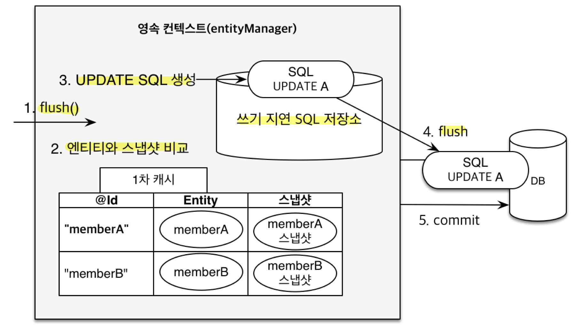

## JPA 개요
- SQL 중심적인 개발의 문제점
	- **코드 반복**
		- 정형화된 쿼리 반복 (`INSERT`, `UPDATE`, `SELECT`, `DELETE`)
		- 반복적인 자바 객체 매핑 작업 (자바 객체 -> SQL, SQL -> 자바 객체)
	- **SQL 유지보수의 어려움**
		- 테이블 필드 추가 시 모든 SQL에 개발자가 직접 필드를 추가해야 함
		- 실수 시 기능 이상 발생
	- **패러다임의 불일치** (객체 지향 & 관계형 DB)
		- 객체 지향 & 관계형 DB의 차이
			- 상속
				- 객체 상속 VS Table 슈퍼타입 서브타입 관계 (One-to-Many)
				- 여러 테이블을 삽입하고 조회하게 되어 객체 변환 과정이 번거로움
			- 연관관계
				- 객체는 참조(Reference) VS Table은 Foreign Key
				- 객체를 테이블에 맞추어 모델링하게 됨 (`teamId`)
				- 객체 다운 모델링을 하면 객체 변환 과정이 번거로움(`Team`)
			- 객체 그래프 탐색
				- 객체는 자유롭게 객체 그래프 탐색 VS 실행하는 SQL에 따라 탐색 범위 결정
				- 계층형 아키텍처에서 **진정한 의미의 계층 분할이 어려움** (**엔터티 신뢰 문제**)
				- 즉, **물리적으로는 계층이 분할되었지만, 논리적으로는 계층이 분할되어 있지 않음**
					- 계층형 아키텍처는 다음 계층을 믿고 쓸 수 있어야 함
					- 만약, 서비스 계층 개발 중에 다른 개발자가 만든 DAO `find`를 쓸 때 
					  조회된 엔터티의 `getTeam`, `getOrder` 나아가 `getDelivery`가 가능한지는
					  DAO 내부의 SQL 쿼리를 까봐야 알 수 있음
					- 즉, 다음 계층에 대한 신뢰가 없음
			- 데이터 식별 방법 (`==`)
				-  같은 ID를 2번의 조회로 데이터 가져온 상황에서
					- SQL로 조회한 2개 데이터는 서로 다르다
					- 컬렉션에서 같은 ID로 찾은 객체는 항상 같음
		- **객체 다운 모델링을 할수록 매핑 작업이 무수히 늘어남**
		- 객체를 **자바 컬렉션에 저장하듯이** DB에 저장할 수는 없을까?
- JPA (Java Persistence API)
	
	- 자바 진영의 ORM 기술 표준
		- JPA 표준 명세로 인터페이스의 모음
		- JPA 2.1 표준 명세를 구현한 3가지 구현체 (**하이버네이트**, EclipseLink, DataNucleus)
		- 2.0에서 대부분의 ORM 기능을 포함
	- 객체는 객체대로 RDB는 RDB대로 설계하고 ORM 프레임워크가 중간에서 매핑
		- **JVM** 내 **JAVA 애플리케이션**과 **JDBC API** **사이에서 동작**
		- **패러다임 불일치를 중간에서 해결** (SQL 생성, 객체 매핑)
	- SQL 중심적인 개발에서 벗어나 **객체 중심으로 개발**해 **생산성** 및 **유지보수** 향상
		- 필드 추가 시, JPA가 알아서 SQL을 동적 생성
		- 자바 컬렉션에 저장하듯이 코드를 작성하여 패러다임 불일치를 해결 (객체 매핑 자동화)
## JPA 설정하기
- JPA 설정 파일 (`persistence.xml`)
	- 경로: `/META-INF/persistence.xml`
	- 이름 지정: `persistence-unit name`
	- 설정 값 분류
		- JPA 표준 속성: `jakarta.persistence.~`
		- 하이버네이트 전용 속성: `hibernate.~`
	- **스프링 부트를 쓴다면 생성할 필요 없음**
		- 대신 **`application.properties`** 사용
		- **`spring.jpa.properties`** 하위에 똑같은 속성 추가
- **Dialect (방언)**
	
	- SQL 표준을 지키지 않는 **특정 DB만의 고유한 기능**
	- 각각 DB가 제공하는 SQL 문법 및 함수가 조금씩 다름
		- 페이징: MySQL-LIMIT, Oracle-ROWNUM
	- JPA는 특정 DB에 종속되지 않지만 **Dialect 설정은 필요**
		- **`hibernate.dialect`** 속성 값 지정 (하이버네이트는 40가지 이상의 Dialect 지원)
		- H2: `H2Dialect`
		- Oracle: `Oracle10gDialect`
		- MySQL: `MySQL5InnoDBDialect`
- **데이터베이스 스키마 자동생성** (**DDL**)
	- **애플리케이션 실행 시점**에 **DDL 자동 생성**
	- 설정한 **Dialect에 맞춰서** 적절한 DDL 생성
	- 설정값 (**`hibernate.hbm2ddl.auto`**)
		- `create`: 기존 테이블 삭제 후 다시 생성 (**`DROP` + `CREATE`**)
		- `create-drop`
			- `create` + 종료 시점에 테이블 삭제 (**`DROP` + `CREATE` + `DROP`**)
			- 테스트 사용 시 마지막에 깔끔히 날리고 싶을 때 사용
		- `update`
			- **변경분**만 반영 (`ALTER`)
			- 컬럼 추가는 가능하지만 지우기는 안됨
			- **운영에서 사용하면 안됨 X**
		- `validate`: 엔터티와 테이블이 **정상 매핑되었는지만 확인**
		- `none`: 사용하지 않음 (**주석처리**하는 것과 똑같음)
	- 유의사항
		- **개발, 스테이지, 운영 서버는 반드시 validate 혹은 none만 사용!!!!** (스크립트 권장)
		- 개발초기 단계 혹은 로컬에서만 create 혹은 update 사용

>DDL 생성 기능
>
>JPA의 DDL 생성 기능(`@Table` `uniqueConstraints`, `@Column` `nullable` 등)은 **DB에만 영향을 주고 런타임에 영향을 주지 않는다.**
>즉, 애플리케이션 시작 시점에 제약 추가 같은 DDL 자동 생성에만 사용하고, 실제 INSERT, SELECT 등의 JPA 실행 로직에는 큰 영향을 주지 않는다.

## JPA 동작 원리

- **JPA의 모든 데이터 변경은 트랜잭션 안에서 실행**
	- `EntityTransaction transaction = em.getTransaction();`
	- `transaction.begin();`
	- `...`
	- `transaction.commit();`
- 주요 객체
	- **`EntityManagerFactory`**
		- 하나만 생성해서 애플리케이션 전체에서 공유
	- **`EntityManager`**
		- 한 요청 당 1회 사용하고 버림 (쓰레드 간 공유 X)
- 동작 순서
	- **`Persistence`**(클래스)가 `persistence.xml` **설정 정보 조회**
	- `Persistence`가 **`EntityManagerFactory`** 생성
	- `EntityManagerFactory`가 **`EntityManager`** 생성
## 영속성 컨텍스트
- **애플리케이션**과 **DB**(**JDBC API**) 사이에서 **엔터티를 관리하는 논리적인 영역**
	- 엔터티를 영구 저장하는 환경
	- 눈에 보이지 않는 논리적인 개념
- **엔터티 매니저**와 **영속성 컨텍스트**는 **1:1 관계** (엔터티 매니저를 통해 접근)
- 엔터티의 생명주기
	
	- **비영속 (new/transient)**
		- 영속성 컨텍스트와 전혀 관계가 없는 새로운 상태
		- e.g. 새로운 객체 생성
	- **영속 (managed)**
		- 영속성 컨텍스트에 관리되는 상태
		- e.g. `em.persist(member);`
	- **준영속 (detached)**
		- 영속성 컨텍스트에 저장되었다가 분리된 상태
		- 영속성 컨텍스트가 제공하는 기능을 사용하지 못함 (더티 체킹 등...)
		- 방법
			- `em.detach(member)`: 특정 엔터티만 준영속상태로 전환
			- `em.clear()`: 영속성 컨텍스트를 완전히 초기화
			- `em.close()`: 영속성 컨텍스트를 종료
	- **삭제 (removed)**
		- 실제 DB에 삭제를 요청하는 상태 (`DELETE` SQL 생성)
		- e.g. `em.remove(member);`
## 영속성 컨텍스트의 이점 - JPA 성능 최적화 기능
- 애플리케이션과 DB 사이에 **영속성 컨텍스트**라는 **계층**이 생기면서 Buffering, Cacheing 등의 이점 얻음
- **1차 캐시**
	- ID(PK)가 Key, Entity가 value인 **Map** (메모리 내 **영속성 컨택스트 안에 위치**)
	- 동작
		- 엔터티가 **1차 캐시에 있으면** 1차 캐시에서 **조회**
		- **1차 캐시에 없으면** **DB에서 조회**한 후 1차 캐시에 **저장** (=DB 조회가 **엔터티를 영속 상태로 만듦**)
	- 이점
		- 조회 성능 향상
			- **같은 트랜잭션 안**에서는 **1차 캐시를 조회해 같은 엔티티를 반환**
			- 다만, **큰 성능 향상은 없음**
				- 조회가 DB까지 가지 않아서 약간의 성능 향상 
				- 하지만, 서비스 전체적으로 봤을 때 이점을 얻는 순간이 매우 짧고 효과가 적음
					- 한 비즈니스 로직 당 하나의 영속성 컨텍스트를 사용해서 이점 순간이 짧음
					- 고객 10명이 와도 모두 별도의 1차 캐시를 가지므로 효과가 적음
				- 같은 것을 여러 번 조회할 정도로 비즈니스 로직이 매우 복잡한 경우 도움이 될 때가 있을 것
		- 동일성 보장
			- **같은 트랜잭션 내**에서 영속 엔터티는 **여러 번 조회해도 동일성이 보장**됨
			- **애플리케이션 차원**에서 **`Repeatable Read`** 트랜잭션 격리 수준 보장
				- 예를 들어, 트랜잭션 격리수준이 `Read Committed`여도 보장
- 트랜잭션을 지원하는 **쓰기 지연** (transactional write-behind)
	- **쓰기 지연**
		
		- 트랜잭션 커밋 순간 **쓰기 지연 SQL 저장소**에 쌓아둔 SQL을 **한 번에 DB에 전달**하고 바로 **커밋**
			- `INSERT` SQL을 버퍼에 모아두었다 **트랜잭션 커밋 시 한 번에 DB에 보냄**
			- `UPDATE`, `DELETE`도 트랜잭션 커밋 시 한 번에 보내서 **락(Lock) 시간을 최소화**
			- JDBC BATCH SQL 이용
			- **성능 상 이점 (일반 상황 & 배치 작업)** - 큰 성능향상은 아님
	- **변경 감지** (**Dirty Checking**)
		
		- 엔터티의 조회 순간 **1차 캐시**에 엔터티와 **스냅샷**을 함께 보관
		- 변경 감지 과정
			- `transaction.commit()` 호출 -> `flush()` 메서드 호출
			- **현재 엔터티와 스냅샷을 비교**
			- **변경사항이 있으면 `UPDATE` SQL을 생성**해 쓰기 지연 SQL 저장소에 적재
			- 적재된 SQL을 한 번에 DB로 보냄 (실제 flush)
			- 실제 DB 커밋 발생
- **지연 로딩** (Lazy Loading) & **즉시 로딩** (Eager Loading)
	- 지연 로딩: 객체가 실제 사용될 때 로딩
	- 즉시 로딩: JOIN SQL로 한번에 연관된 객체까지 미리 조회
	- **지연 로딩으로 개발**하다가 **성능 최적화가 필요한 부분은 즉시 로딩**을 적용해 해결

>기술 사이에 계층이 생길 때
>
>**중간**에 기술이 껴서 **계층**이 생긴다면 항상 2가지의 **성능 최적화**가 가능하다.
>1. 캐시
>2. Buffer로 Write 가능 (모아서 보내기 가능)

## 플러시 (Flush)
- 영속성 컨텍스트의 변경내용을 **DB**에 **반영**하는 것 (=**동기화**)
	- **쓰기 지연 SQL 저장소에 쌓아둔 쿼리를 DB에 날리는 작업**
	- 영속성 컨텍스트를 비우지는 않음
- **트랜잭션**이 있기 때문에 플러시 개념이 존재할 수 있음
	- 플러시는 **SQL 전달 타이밍**만 조절
	- 결국 커밋 직전에만 동기화하면 됨
- 플러시 방법
	- `em.flush()` - 직접 호출
		- 테스트 이외에 **직접 사용할 일은 거의 없음**
		- 쿼리를 직접 확인하고 싶거나 커밋 전에 SQL을 미리 반영하고 싶을 때
	- **트랜잭션 커밋** - 플러시 자동 호출
		- 변경 감지가 먼저 발생
		- 쓰기 지연 SQL 저장소의 쿼리(등록, 수정, 삭제)를 DB에 전송
	- **JPQL 쿼리 실행** - 플러시 자동 호출
		```java
		em.persist(memberA);
		em.persist(memberB);
		em.persist(memberC);
		
		//중간에 JPQL 실행
		query = em.createQuery("select m from Member m", Member.class);
		List<Member> members= query.getResultList();
		```
		- JPQL은 1차 캐시를 거치지 않고 **SQL로 번역되어 바로 실행**되므로 **항상 플러시를 자동 호출**
		- 영속성 컨텍스트에 새로 생성된 엔터티가 아직 DB에 반영되지 않았기 떄문
		- `em.setFlushMode`로 조절할 수 있으나 굳이 이 옵션을 사용할 일은 없음
## Entity 매핑
- 객체 & 테이블 매핑
	- **`@Entity`**
		- JPA가 관리하는 객체 (=엔터티)
		- **기본 생성자 필수** (public 또는 protected)
		- final 클래스, final 필드, enum, interface, inner 클래스 사용 X
		- `name` 속성: JPA에서 사용할 엔터티 이름 지정 (기본값: 클래스 이름, **가급적 기본값 사용**)
	- `@Table`
		- 엔터티와 매핑할 테이블 지정
		- 속성
			- **`name`**
				- 매핑할 테이블 이름 지정
				- 기본값: 엔터티 이름
				- 지정DB 이름이 `ORDERS`면 `name="ORDERS"` 지정)
			- **`uniqueConstraints`**(**DDL**): DDL 생성 시 유니크 제약 조건 생성
			- `catalog`: DB catalog 매핑
			- `schema`: DB schema 매핑
- 필드 & 컬럼 매핑
	- `@Column` (컬럼 매핑)
		- name
		- nullable(DDL)
		- length(DDL)
		- precision, scale(DDL)
	- `@Temporal`
		- 날짜 타입 매핑
	- `@Enumerated`
		- enum 타입 매핑
	- `@Lob`
		- BLOB, CLOB 매핑
	- `@Transient`
		- **메모리 상에서만 임시로 어떤 값을 보관**하고 싶을 때 사용 (메모리 임시 계산값, 캐시 데이터...)
		- 해당 컬럼은 **메모리에서만 쓰고 DB에서 쓰지 않음**
- 기본키 매핑
	- `@Id`: DB Primary Key
	- `@GeneratedValue`
- 연관관계 매핑
	- `@JoinColumn`
	- `@ManyToOne`
## JPQL
- 단순한 조회 방법
	- `EntityManager.find()`
	- 객체 그래프 탐색 - `a.getB()`, `b.getC()`
- **검색조건이 포함된 SQL의 필요성**
	- 단순 조회는 문제 없지만 애플리케이션이 **필요한 데이터만 DB에서 불러오려면** 결국 검색 SQL이 필요
- **JPQL**
	- **엔터티 객체**를 대상으로 검색하는 **객체 지향 SQL** (JPA 제공)
		- 반면에, SQL은 데이터베이스 **테이블**을 대상으로 쿼리
	- SQL을 추상화해서 **특정 DB SQL에 의존 X**
		- JPQL은 현재 설정 Dialect와 합쳐져 **현재 DB에 맞는 적절한 SQL을 생성하고 전달**
		- **DB를 바꿔서** Dialect가 바뀌었더라도 **JPQL 자체를 바꿀 필요는 없음**
