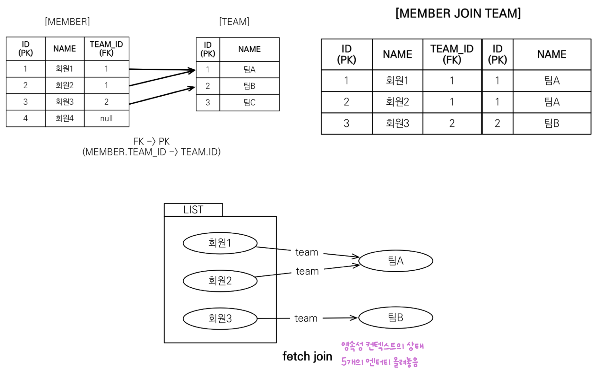

## JPQL 개요
- 단순한 조회 방법
	- `EntityManager.find()`
	- 객체 그래프 탐색 - `a.getB()`, `b.getC()`
- **검색조건이 포함된 SQL의 필요성**
	- 단순 조회는 문제 없지만 애플리케이션이 **필요한 데이터만 DB에서 불러오려면** 결국 검색 SQL이 필요
	  (모든 DB 데이터를 객체로 변환해 검색하는 것은 불가능)
- **JPQL**
	- **엔터티 객체**를 대상으로 검색하는 **객체 지향 SQL** (JPA 제공)
		- 반면에, SQL은 데이터베이스 **테이블**을 대상으로 쿼리
	- SQL을 추상화해서 **특정 DB SQL에 의존 X**
		- JPQL은 현재 설정 Dialect와 합쳐져 **현재 DB에 맞는 적절한 SQL을 생성하고 전달**
		- **DB를 바꿔서** Dialect가 바뀌었더라도 **JPQL 자체를 바꿀 필요는 없음**
- JPQL 빌더 - **QueryDSL 권장**
	- 문자가 아닌 **자바코드**로 **JPQL을 작성**할 수 있음
	- Criteria
		- JPA 공식 기능
		- **너무 복잡하고 실용성이 없음**
	- **QueryDSL**
		- **컴파일 시점**에 **문법 오류**를 찾을 수 있음
		- **편리한 동적쿼리 작성**
		- **단순하고 쉬움**
- 네이티브 쿼리 - **네이티브 쿼리가 필요할 때는 JdbcTemplate을 사용하는게 낫다**
	- JPQL로 해결할 수 없는 **특정 DB 의존적인 기능 해결**
	- e.g. 오라클 `CONNECT BY`, ...
	- 네이티브 SQL 
		- JPA에서 SQL을 직접 사용하는 기능
		- `em.createNativeQuery(sql, 클래스)`
	- **JDBC, JdbcTemplate, MyBatis 사용**
		- 주의점: **영속성 컨텍스트를 적절한 시점에 강제로 플러시 필요**
		- JPA로 Persist만 해둔 데이터는 JdbcTemplate으로 커넥션을 얻어 SQL 조회시 조회 X
		- **조회 직전 `flush()` 호출 필요**
## 기본 조회
- `select m from Member as m where m.age > 18`
	- 테이블 이름이 아닌 **엔터티 이름 사용** (`Member`)
	- **별칭은 필수** (`m`, as는 생략 가능)
	- 엔터티와 속성은 대소문자 구분 O
	- JPQL 키워드는 대소문자 구분 X
- `em.createQuery` 반환 타입
	- TypedQuery
		- 반환 타입이 **명확**할 때 사용
		- 보통 **엔터티 클래스**를 넘김
		- `TypedQuery<Member> query = em.createQuery("SELECT m FROM Member m", Member.class)`;
	- Query
		- 반환 타입이 **명확하지 않을 때** 사용
		- `Query query = em.createQuery("SELECT m.username, m.age from Member m");`
- 결과 조회 API
	- `query.getResultList()`
		- **결과가 하나 이상**일 때, 리스트 반환
		- 결과가 없으면 빈 리스트 반환
	- `query.getSingleResult()`
		- **결과가 정확히 하나**, 단일 객체 반환
		- 이외의 결과는 예외 일으킴
			- 결과가 없으면 `javax.persistence.NoResultException`
			- 둘 이상이면 `javax.persistence.NonUniqueResultException`
## 파라미터 바인딩
- **이름 기준**
	- `SELECT m FROM Member m where m.username=:username`
	- `query.setParameter("username", usernameParam);`
- 위치 기준 - 버그나기 쉬우므로 사용하지 말 것!
	- `SELECT m FROM Member m where m.username=?1`
	- `query.setParameter(1, usernameParam);`
## 프로젝션
- **SELECT 절에 조회할 대상을 지정**하는 것
- **DISTINCT로 중복 제거**
- 엔터티 프로젝션
	- `SELECT m FROM Member m`
		- **조회된 엔터티는 영속성 컨텍스트가 관리**
	- `SELECT m.team FROM Member m`
		- 이 경우 조인 쿼리가 나가는데 **예측이 어려우므로 이 형태로 사용하지 말 것**
		- **조인쿼리는 직접 조인 쿼리로 작성하자**
- 임베디드 타입 프로젝션
	- `SELECT m.address FROM Member m`
- 스칼라 타입 프로젝션
	- `SELECT m.username, m.age FROM Member m`
	- 위와 같이 여러 값을 조회할 시 3가지 방법 존재
		- `Query` 타입으로 조회
		- `TypedQuery`에서 `Object[]` 타입으로 조회
		- **DTO로 바로 조회**
			- `SELECT new jpabook.jpql.UserDTO(m.username, m.age) FROM Member m`
			- `TypedQuery`에서 `UserDTO` 타입으로 조회
			- **패키지 명을 포함**한 전체 클래스 명 입력 (문자 SQL이라 적어줘야 함)
			- **순서와 타입이 일치하는 생성자** 필요
## 페이징 API
- 각각의 DB Dialect에 맞게 JPA가 **추상화**
- `setFirstResult(int startPosition)`: 조회 시작 위치 (0부터 시작)
- `setMaxResults(int maxResult)`: 조회할 데이터 수
```java
//페이징 쿼리
String jpql = "select m from Member m order by m.name desc";
List<Member> resultList = em.createQuery(jpql, Member.class)
		.setFirstResult(10)
		.setMaxResults(20)
		.getResultList();
``` 
## 조인
- 내부 조인
	- `SELECT m FROM Member m [INNER] JOIN m.team t`
- 외부 조인
	- `SELECT m FROM Member m LEFT [OUTER] JOIN m.team t`
- 세타 조인
	- 연관 관계가 없는 테이블끼리 조인 (카테시안 곱 발생)
	- `select count(m) from Member m, Team t where m.username = t.name`
- ON 절 (JPA 2.1부터 지원)
	- 조인 대상 필터링
		- JPQL
			- `SELECT m, t FROM Member m LEFT JOIN m.team t on t.name = 'A'`
		- SQL
			- `SELECT m.*, t.* FROM Member m LEFT JOIN Team t ON m.TEAM_ID=t.id and t.name='A'`
	- 연관관계 없는 엔터티 외부 조인
		- JPQL
			- `SELECT m, t FROM Member m LEFT JOIN Team t on m.username = t.name`
		- SQL
			- `SELECT m.*, t.* FROM Member m LEFT JOIN Team t ON m.username = t.name`
## 서브 쿼리
- JPA는 WHERE, HAVING 절에서만 서브 쿼리 사용 가능
- 하이버네이트는 SELECT, FROM 절에서 서브 쿼리 가능하도록 지원 (FROM은 6부터 지원)
- 서브 쿼리 지원 함수
	- `EXISTS (subquery)`: 서브쿼리에 결과가 존재하면 참
	- `ALL (subquery)`: 모두 만족하면 참
	- `ANY, SOME (subquery)`: 하나라도 만족하면 참
	- `IN (subquery)`: 하나라도 같은 것이 있으면 참
## JPQL 타입 표현
- 문자: ‘HELLO’, ‘She’’s’
- 숫자: 10L(Long), 10D(Double), 10F(Float)
- Boolean: TRUE, FALSE
- ENUM: jpabook.MemberType.Admin (패키지명 포함)
	- **파라미터 바인딩으로 풀면 패키지명 안 쓸 수 있음**
- 엔티티 타입: TYPE(m) = Member (**상속 관계에서 사용**)
	- `em.createQuery(“select i from Item i where type(i) = Book”, Item.class)`
	- where 절에 `DTYPE = ‘Book’` 으로 쿼리가 나감
## 조건식
- CASE 식
	- 기본 CASE 식
		```java
		select
			case when m.age <= 10 then '학생요금'
				when m.age >= 60 then '경로요금'
				else '일반요금'
			end
		from Member m
		```
	- 단순 CASE 식
		```java
		select
			case t.name
				when '팀A' then '인센티브110%'
				when '팀B' then '인센티브120%'
				else '인센티브105%'
			end
		from Team t
		```
- COALESCE
	- 조건식을 하나씩 차례로 조회해서 null이 아닌 조건식 반환
	- `select coalesce(m.username,'이름 없는 회원') from Member m`
- NULLIF
	- 두 값이 같으면 null 반환, 다르면 첫 번째 값 반환
	- `select NULLIF(m.username, '관리자') from Member m`
## JPQL 기본 함수 및 사용자 정의 함수
- JPQL 기본 함수
	- CONCAT
	- SUBSTRING
	- TRIM
	- LOWER, UPPER
	- LENGTH
	- LOCATE: 문자 위치 찾기 (`locate('de', 'abcdegf')`)
	- ABS, SQRT, MOD
	- SIZE (JPA 용도): 컬렉션의 크기를 리턴 (`select size(t.members) from Team t`)
- 사용자 정의 함수 호출
	- 등록 방법
		- Hibernate 6는 **`FunctionContributer` 구현체**를 만들어야 함
			- Hibernate 6 이전에는 방언을 상속받고 사용자 정의 함수 등록했음
		- **`src/main/resources/META-INF/services/org.hibernate.boot.model.FunctionContributor`**
		- 위 파일을 생성해 구현체 등록 (`custom.CustomFunctionContributor`)
			```java
			package custom;
			
			import org.hibernate.boot.model.FunctionContributions;
			import org.hibernate.boot.model.FunctionContributor;
			import org.hibernate.dialect.function.StandardSQLFunction;
			import org.hibernate.type.StandardBasicTypes;
			
			public class CustomFunctionContributor implements FunctionContributor {
				@Override
				public void contributeFunctions(FunctionContributions functionContributions) {
					functionContributions.getFunctionRegistry()
						.register("group_concat", new StandardSQLFunction("group_concat", StandardBasicTypes.STRING));
				}
			}
			```
	- 호출 방법
		- `select function('group_concat', i.name) from Item i`
## 경로표현식
- `.`을 찍어 객체 그래프를 탐색하는 것
- 경로표현식에 의한 **묵시적 조인은 쓰지 말자**
	- 최대한 JPQL과 실제 SQL의 **모양을 맞춰 예측가능**하게 만들어야 함
	- 조인은 **쿼리 튜닝**에 중요 포인트이기 때문
	- 유의사항: 묵시적 조인은 **항상 내부 조인**
- **명시적 조인** 사용하자! (별칭으로 상세 탐색 가능)
	- `select m.username from Team t join t.members m`
- 용어
	- 상태 필드 (state field)
		- 단순히 **값**을 저장하기 위한 필드
		- 경로 탐색의 끝 (탐색 X)
		- `m.username`
	- 연관 필드 (association field)
		- **연관 관계**를 위한 필드
		- 단일 값 연관 필드
			- 대상이 **엔터티** (`@ManyToOne`, `@OneToOne`)
			- **묵시적 내부 조인** 발생 (탐색 O)
			- `select m.team from Member m` (e.g.`m.team`)
		- 컬렉션 값 연관 필드
			- 대상이 **컬렉션** (`@OneToMany`, `@ManyToMany`)
			- **묵시적 내부 조인** 발생 (탐색 X)
			- `select t.members from Team t` (e.g. `t.members`)
## 페치 조인 (fetch join) - `join fetch`

- **JPQL**에서 **성능 최적화**를 위해 연관된 엔터티나 컬렉션을 **SQL 한 번에 함께 조회**하는 기능
	- 페치 조인으로 가져온 연관 엔터티는 프록시가 아닌 **실제 엔터티**
	- 지정한 엔터티를 **즉시 로딩**으로 가져오므로, **N + 1 문제를 해결**
- 사용 전략
	- **글로벌 로딩 전략은 모두 지연로딩**으로 가져가고 **최적화가 필요한 곳**에 **페치 조인** 적용
	- 여러 테이블을 조인해 **원래의 엔터티 모양과 전혀 다른 결과**를 내야 한다면 **일반조인 사용** 
		- 일반 조인으로 **필요한 데이터들만 조회**해 **DTO로 반환**
		- 페치 조인은 객체 그래프를 유지할 때 사용하면 효과적
- 페치 조인과 일반 조인과의 차이
	- **페치 조인**은 회원을 조회하면 연관된 팀도 함께 조회 (**`SELECT T.*, M.*`**)
		- [JPQL] `select t from Team t join fetch t.members`
		- [SQL] `SELECT T.*, M.* FROM TEAM T INNER JOIN MEMBER M ON T.ID=M.TEAM_ID`
	- **일반 조인**은 연관된 엔터티를 함께 조회 X (**`SELECT T.*`**)
		- [JPQL] `select t from Team t join t.members m`
		- [SQL] `SELECT T.* FROM TEAM T INNER JOIN MEMBER M ON T.ID=M.TEAM_ID`
- 컬렉션 페치 조인
	- 일대다 관계에서 실행하는 페치 조인
	- **하이버네이트 6 이후**
		- **JPQL `DISTINCT` 없이도 애플리케이션에서 자동으로 중복 제거 적용**
	- 하이버네이트 6 이전
		- 조인 시 **데이터 중복 발생**
			- **DB와 객체의 차이** 때문에 같은 엔터티 중복 발생
			- 실제 팀은 1개인데 멤버와의 **조인으로 발생한 행 수에 의해 2개의 팀**이 반환
				- teamname = 팀A, team = Team@0x100
					- -> username = 회원1, member = Member@0x200
					- -> username = 회원2, member = Member@0x300
				- teamname = 팀A, team = Team@0x100
					- -> username = 회원1, member = Member@0x200
					- -> username = 회원2, member = Member@0x300
		- JPQL **`DISTINCT`**
			- 컬렉션 페치 조인 **데이터 중복 방지**를 위해 적용
			- JPQL `DISTINCT`는 2가지 기능을 제공
				- SQL에 `DISTINCT` 추가
					- 실제 SQL에 적용되지만, SQL 결과에서는 중복 제거할 것이 없음
				- **애플리케이션**에서 **엔터티 중복 제거**
					- 애플리케이션 단에서 **같은 식별자를 가진 엔터티 제거**
			- DISTINCT 적용시 결과
				- teamname = 팀A, team = Team@0x100
					- -> username = 회원1, member = Member@0x200
					- -> username = 회원2, member = Member@0x300
- 유의 사항
	- 여러 엔터티 **다중 페치 조인 시에만 대상에 별칭을 쓰자**
		- 하이버네이트에서는 페치 조인 대상에 별칭 사용 가능 (가급적 사용 X)
	- 페치 조인은 연관된 엔터티를 몇 개 **걸러서 가져와서는 안됨** (**정합성 이슈**)
		- 페치 조인은 연관된 엔터티를 항상 모두 가져와야 함
			- e.g. 팀 조회 시, 팀에 연관된 멤버가 5명일 때 멤버 3명만 가져와서는 안됨
			- 이는 **누락을 동반하는 매우 위험한 조작** (Cascade etc...)
		- **JPA 설계 사상**은 **연관된 모든 것을 다 조회**하는 것을 전제하므로 위반 조심
	- **둘 이상의 컬렉션**은 페치 조인하지 말자
		- 페치 조인은 **컬렉션을 딱 하나**만 지정하자
		- 예상치 못하게 **데이터 중복**이 늘어날 수 있음
		- e.g `Team.members`, `Team.orders`를 한꺼번에 페치 조인해서는 안됨
	- **컬렉션을 페치 조인**하면 **페이징 API 사용 불가** (**메모리 페이징 문제로 매우 위험**)
		- 페이징 API: `setFIrstResult`, `setMaxResults`
		- 문제
			- **데이터 중복**
				- 1:M 컬렉션 페치 조인은 단순히 DB 상 조인 쿼리를 생성
				- DB에서 조인된 테이블의 로우는 M개 (1 기준으로는 중복된 row가 많은 상황)
				- 따라서, **생성된 DB 쿼리 상 1 기준 페이징이 불가능**
			- **데이터 누락** 문제가 **JPA의 객체 그래프 사상을 위반**
				- e.g. 팀 A에 멤버가 2명 있을 때, 이를 페치 조인해 pageSize를 1로 페이징
				- 페이징은 철저히 DB 중심 -> 팀 & 멤버 조인 테이블에서 1개 row를 가져옴 (멤버1)
				- DB 결과에 따라 JPA는 팀 A에 멤버가 1명 있다고 생각해 문제 발생 (멤버2 누락)
			- 데이터 중복 및 누락을 피하기 위해 **메모리 페이징** 발생  (**장애 유발 가능성 높음**)
				- 하이버네이트는 경고 로그를 남기고 강제로 메모리에서 페이징 (**매우 위험**)
				- **실제로 조인 쿼리만 날리고** DB에서 페이징하지 않고 메모리에서 페이징
				- e.g. 100만 건 데이터를 모두 메모리에 올리고 메모리에서 페이징...
		- 해결 방법
			1. 일대다 쿼리를 **다대일 쿼리로 바꿔 실행** (**권장**)
				- **일대일, 다대일** 같은 단일 값 연관 필드들은 페치 조인해도 **당연히 페이징 가능**
				- **쿼리 한 번**으로 해결되므로 일반적으로 **성능이 좋음**
				- 팀과 멤버 (OneToMany)에서 멤버 테이블로 페이징 쿼리 후 팀 기준 `group by`
			2. **`batchSize`** 적용
				- **페치 조인을 하지 않고 지연 로딩 활용** (팀에 페이징 쿼리하고 멤버를지연로딩)
				- 배치 사이즈는 **N + 1 쿼리를 막고** 설정한 단위 기준으로 **in-query** 진행
				- 기본적으로 **글로벌 배치 사이즈** 깔고 모든 작업 진행
					- 1000 이하의 적절한 수 지정 (보통 DB의 in 절 개수의 한계가 1000)
					- `persistence.xml`
						- `<property name="hibernate.default_batch_fetch_size" value="100" />`
					- `application.properties`
						```java
						spring:
						  jpa:
						    properties:
						      hibernate:
						        default_batch_fetch_size: 100
						```
				- e.g. 팀이 150개고 멤버가 레이지 로딩될 때, `batchSize`가 100개인 상황
					- 원래는 150개의 N + 1 쿼리가 발생하지만 이를 예방
					- 100개 & 50개 뭉치로 총 2번 in-query해 가져옴
			3. DTO 쿼리
## 다형성 쿼리
- **상속 관계 매핑**에서 사용
- `type`
	- 조회 대상을 **특정 자식**으로 한정 (=`DTYPE` where 절 자동 적용)
	- e.g. Item 중 Book, Movie 조회하기
		- [JPQL] `select i from Item i where type(i) IN (Book, Movie)`
		- [SQL] `select i from i where i.DTYPE in (‘B’, ‘M’)`
- `treat` (JPA 2.1)
	- 부모 타입을 특정 자식 타입으로 다룸
	- **타입 캐스팅**과 유사
	- FROM, WHERE, SELECT(하이버네이트) 절에서 사용 가능
	- e.g. 부모인 Item과 자식 Book이 있을 때, 자식 속성으로 where절 걸고 싶은 경우
		- [JPQL] `select i from Item i where treat(i as Book).author = ‘kim’`
		- [SQL] `select i.* from Item i where i.DTYPE = ‘B’ and i.author = ‘kim’`
## 엔터티 직접 사용
- **JPQL**에서 **엔터티를 직접 사용**하면 **SQL**에서 해당 엔터티의 **기본키 값** 사용
	- [JPQL]
		- `select count(m.id) from Member m` - 엔티티의 아이디를 사용
		- `select count(m) from Member m` - 엔티티를 직접 사용
	- [SQL]
		- `select count(m.id) as cnt from Member m` - JPQL 둘 다 같은 SQL 실행
- **연관된 엔터티**를 직접 사용하면 **외래키 값** 사용
	- [JPQL]
		- `select m from Member m where m.team = :team`
		- `select m from Member m where m.team.id = :teamId`
	- [SQL]
		- `select m.* from Member m where m.team_id=?` - JPQL 둘 다 같은 SQL 실행
## Named 쿼리
- **미리 정의**해서 **이름을 부여**해두고 사용하는 **JPQL** (=정적 쿼리)
- 에노테이션, XML에 정의
	- **XML 정의가 항상 우선권**을 가짐
	- 애플리케이션 운영 환경에 따라 다른 XML 배포 가능
- **애플리케이션 로딩 시점**에 초기화 후 **재사용** - **JPQL을 SQL로 미리 파싱 후 캐싱**
	- 약간의 **속도** 이점
	- 애플리케이션 로딩 시점에 **미리 쿼리의 예외를 검증**하는 이점
- 에노테이션 정의 사용 예
	```java
	@Entity
	@NamedQuery(
		name = "Member.findByUsername",
		query="select m from Member m where m.username = :username")
	public class Member {
		...
	}
	
	List<Member> resultList = em.createNamedQuery("Member.findByUsername", Member.class)
		.setParameter("username", "회원1")
		.getResultList();
	```
- XML 정의 사용 예
	- [META-INF/persistence.xml]
		```java
		<persistence-unit name="jpabook" >
			<mapping-file>META-INF/ormMember.xml</mapping-file>
		```
	- [META-INF/ormMember.xml]
		```java
		<?xml version="1.0" encoding="UTF-8"?>
		<entity-mappings xmlns="http://xmlns.jcp.org/xml/ns/persistence/orm" version="2.1">
		...
		
			<named-query name="Member.findByUsername">
				<query><![CDATA[
					select m
					from Member m
					where m.username = :username
				]]></query>
			</named-query>
			
			<named-query name="Member.count">
				<query>select count(m) from Member m</query>
			</named-query>
			
		</entity-mappings>
		```
## 벌크 연산
- 여러 개의 데이터에 대한 갱신 쿼리
- **벌크연산은 주로 JPQL**로 진행
	- **JPA 자체는 실시간 단건성 작업에 적합**
	- JPA **변경 감지 기능**으로 실행하려면 **너무 많은 SQL 실행**
		- e.g. 100건의 엔터티라면 100번의 UPDATE SQL 실행
- **`executeUpdate()`**
	- **영향 받은 엔터티 수 반환**
	- **쿼리 한 번**으로 여러 테이블 로우 변경
	- UPDATE, DELETE 지원
	```java
	String qlString = "update Product p " + 
					  "set p.price = p.price * 1.1 " + 
					  "where p.stockAmount < :stockAmount";
	
	int resultCount = em.createQuery(qlString)
						.setParameter("stockAmount", 10)
						.executeUpdate();
	```
- `insert into .. select`
	- 하이버네이트가 INSERT 지원
- 벌크 연산 사용 전략
	- JPQL은 **영속성 컨텍스트를 무시하고 DB에 직접 쿼리**하므로 벌크 연산 사용 맥락이 중요
	- 사용 전략 1: **벌크 연산을 먼저 실행**
		- 영속성 컨텍스트에 아무 것도 하지 않고 벌크 연산만 실행
		- **영속성 컨텍스트가 비어 있으니** 벌크 연산으로 새로 조회가 발생해도 문제 없음
			- DB에서 최신 데이터 가져와 1차캐시에 반영할 것이므로
	- 사용 전략 2: **벌크 연산 수행 후 영속성 컨텍스트 초기화** (**`em.clear()`**)
		- 어떤 엔터티가 미리 조회되어 있는 상황에서 벌크 연산을 진행
		- JPQL 호출로 플러시 자동 발생
		- **벌크 연산 후 영속성 컨텍스트는 DB에 비해 Old한 상태가 됨**
			- e.g. 처음 조회한 회원 엔터티의 연봉이 5000만원
			- 이후 수행한 벌크 연산에서 연봉이 6000만원이 되어 DB에 플러시됨
			- 이 경우 애플리케이션에서는 여전히 회원 연봉이 5000만원임
			- 따라서, **영속성 컨텍스트를 비워주어 깨끗한 상태에서 다시 조회될 수 있도록 해야 함**