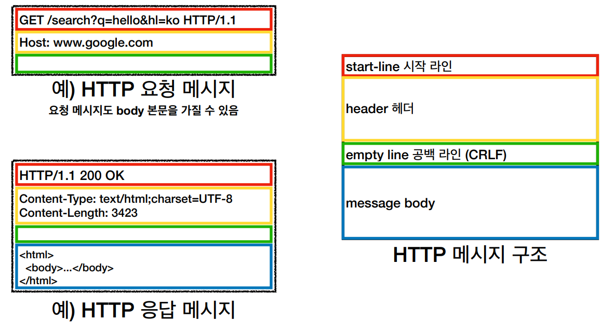

# HTTP basic

## 모든 것이 HTTP(Hypertext Transfer Protocol)

- 처음엔 HTML 전달 용으로 시작되었지만, 이제는 HTTP 메시지에 모든 데이터를 전송할 수 있습니다. (지금은 HTTP 시대입니다!)
  - HTML, TEXT
  - IMAGE, 음성, 영상, 파일
  - JSON, XML
- HTTP/1.1 (1997)이 가장 많이 사용되는 버전이자 가장 중요한 버전입니다. (기반 프로토콜: TCP)
  - HTTP/2 (2015): 성능 개선 (기반 프로토콜: TCP)
  - HTTP/3: TCP 대신 UDP 사용, 성능 개선 (기반 프로토콜: UDP)

​    

## HTTP의 특징

- 클라이언트 서버 구조
  - 서로의 역할이 분리된다는 점이 중요!
  - 서버는 비즈니스 로직과 데이터, 클라이언트는 UI, 사용성에 집중
- 무상태 프로토콜 (Stateless)
  - 상태유지: 중간에 다른 점원으로 바뀌면 안됩니다. (바뀐 서버는 Context를 모르기 때문)
    - 무상태: 중간에 다른 점원으로 바뀌어도 됩니다.
  - Stateless는 클라이언트 서버 아키텍쳐에서 엄청난 확장성을 제공합니다
    - 무상태는 응답 서버를 쉽게 바꿀 수 있어 무한한 서버 증설 가능
      - 갑자기 클라이언트 요청이 증가해도 서버를 대거 투입할 수 있음
      - scale out(=서버의 수평적 확장)이 가능
  - 한계
    - 모든 것을 무상태로 설계 할 수  없는 경우가 있습니다.
      - 로그인은 상태유지 필요 (브라우저 쿠키 + 서버 세션)
      - 그럼에도 상태유지는 최소한의 사용을 지향합시다.
    - 클라이언트에서 요청 시 데이터가 많아집니다.
- 비연결성(Connectionless)
  - HTTP는 연결을 유지하지 않는 모델입니다.
  - 일반적으로 초 단위 이하의 빠른 속도로 응답
  - 서버자원을 효율적으로 사용할 수 있습니다.
    - 1시간동안 수천명이 서비스를 사용해도 실제 서버에서 동시에 처리하는 요청은 수십개 이하로 매우 작습니다.
  - 한계
    - TCP/IP 연결을 새로 맺어야 합니다. (3 way handshake 시간 추가)
    - 클라이언트 요청시 수 많은 자원이 함께 다운로드됩니다.
      - 기존 패턴이라면: html받고 끊고, 자바스크립트 받고 끊고, 이미지 받고 끊고
      - 요즈음은 HTTP 지속 연결(Persistent Connections)로 문제 해결 (default)
      - HTML 하나가 모두 받아질 때까지 왠만하면 연결을 유지 합니다.
      - HTTP/2, HTTP/3에서 더 많은 최적화

​    

## HTTP 메시지 구조

HTTP 메시지는 요청 메시지와 응답 메시지가 있고, 둘은 큰 구조가 같지만 내부 구조는 다릅니다.

- 시작 라인(start-line)

  - request-line 구조 (요청 메시지 경우)
    - (HTTP 메서드) (SP=공백) (request-target=path) (SP) (HTTP version) (CRLF=엔터)
    - ex) GET /search?q=hello&hl=ko HTTP/1.1
  - status-line 구조 (응답 메시지 경우)
    - (HTTP version) (SP) (status-code) (SP) (reason-phrase) (CRLF)
    - ex) HTTP/1.1 200 OK

- 헤더(header)

  - header-field 구조

    - (field-name) (:) (OWS=띄어쓰기 허용) (field-value) (OWS)

    - field-name은 대소문자 구분 X, field-value는 대소문자 구분 O

    - request example

      Host: [www.google.com](http://www.google.com)

    - response example

      Content-Type: text/html;charset=UTF-8

      Content-Length: 3432

  - HTTP 전송에 필요한 모든 부가 정보를 담습니다.

  - 수많은 표준 헤더가 존재하고 임의의 헤더를 추가할 수도 있습니다.

- 공백 라인(empty line)

  - 반드시 있어야 합니다.

- 메시지 바디(message body) - Optional

  - 실제 전송할 데이터가 담깁니다.
  - HTML, 이미지, 영상, JSON etc...

​    

## Reference

[모든 개발자를 위한 HTTP 웹 기본 지식](https://www.inflearn.com/course/http-%EC%9B%B9-%EB%84%A4%ED%8A%B8%EC%9B%8C%ED%81%AC)