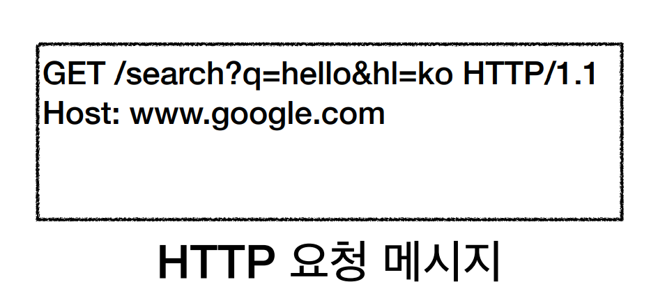
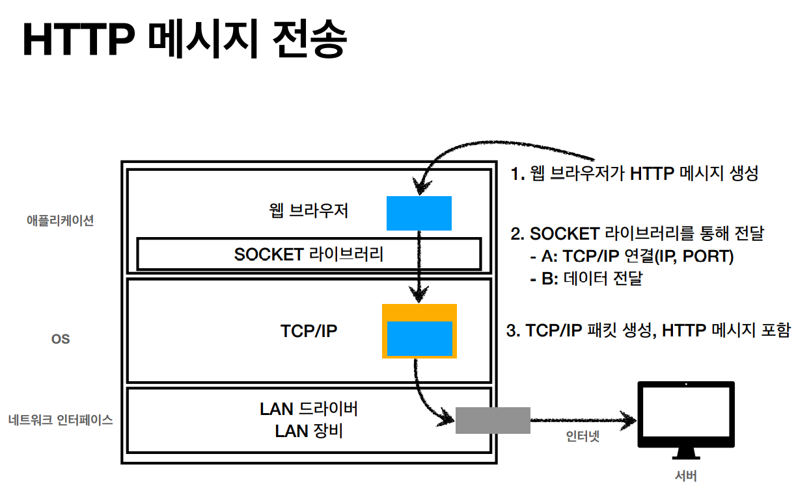
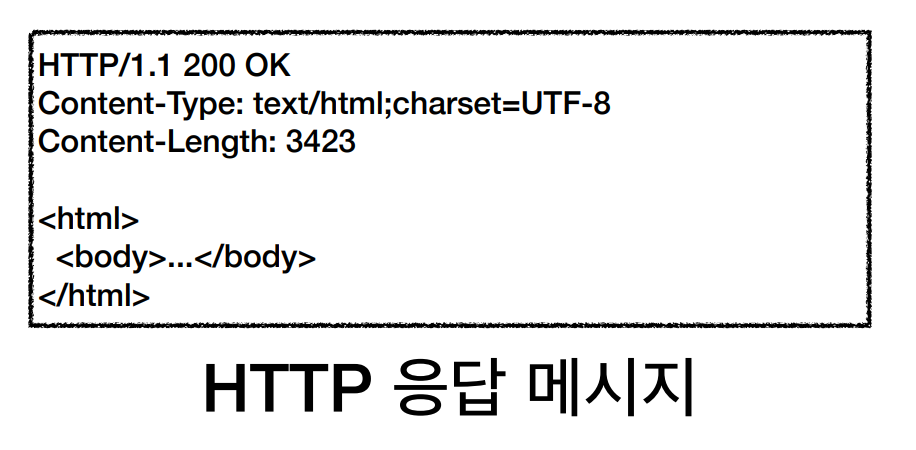

# URI와 웹브라우저 요청 흐름

### URI와 URL, URN의 차이는 무엇인가요?

URL은 Uniform Resource Locator로 인터넷 상 자원의 위치를 의미합니다. 자원의 위치라는 것은 결국 어떤 파일의 위치를 의미합니다. 반면에 URI는 Uniform Resource Identifier로 인터넷 상의 자원을 식별하기 위한 문자열의 구성으로, URI는 URL을 포함하게 됩니다. 그러므로 URI가 보다 포괄적인 범위라고 할 수 있습니다.

URN은 자원에 이름을 부여한 것입니다. 다만, 이름만으로 실제 리소스를 찾을 수 있는 방법이 보편화 되지 않았고, 실제 있었던 시도도 성공적이지 못했습니다. URN 역시 URI에 포함됩니다.

실제로는 URI와 URL을 거의 동일한 의미로 사용하게 됩니다.

​    

### Web browser의 요청 흐름

- https://www.google.com:443/search?q=hello&hl=ko

  - www.google.com의 IP를 DNS 서버에서 조회합니다. (IP: 200.200.200.2)

  - Port 정보를 인식합니다. (HTTPS는 443이므로, 포트가 생략되어도 443으로 인식합니다.)

  - HTTP 요청 메시지를 생성합니다.

    

  - HTTP 메시지를 전송합니다. (TCP/IP 패킷 씌워서)

    

  - 구글 서버에서 도착한 패킷의 TCP/IP를 벗겨 HTTP 메시지를 해석하고 해당하는 HTTP 응답 메시지를 생성합니다.

    

  - HTTP 응답 메시지를 클라이언트로 보냅니다. (TCP/IP 패킷 씌워서)

  - 브라우저는 전달받은 패킷의 TCP/IP를 벗기고 HTTP 응답 메시지의 HTML을 확인해 화면에 렌더링 합니다.

​    

## Reference

[모든 개발자를 위한 HTTP 웹 기본 지식](https://www.inflearn.com/course/http-%EC%9B%B9-%EB%84%A4%ED%8A%B8%EC%9B%8C%ED%81%AC)

​    

\- *본 포스팅은 김영한 님의 '모든 개발자를 위한 HTTP 웹 기본 지식' 강의를 공부하고 정리한 내용을 담고 있습니다*