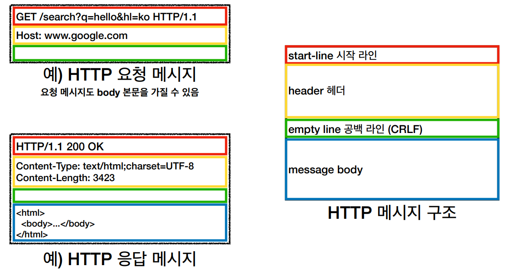
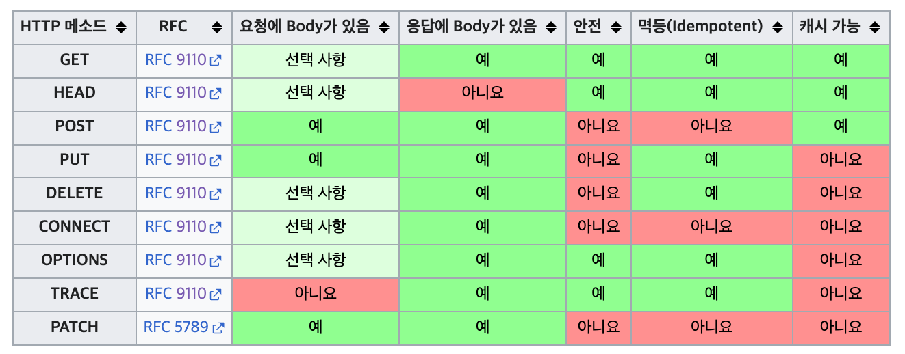
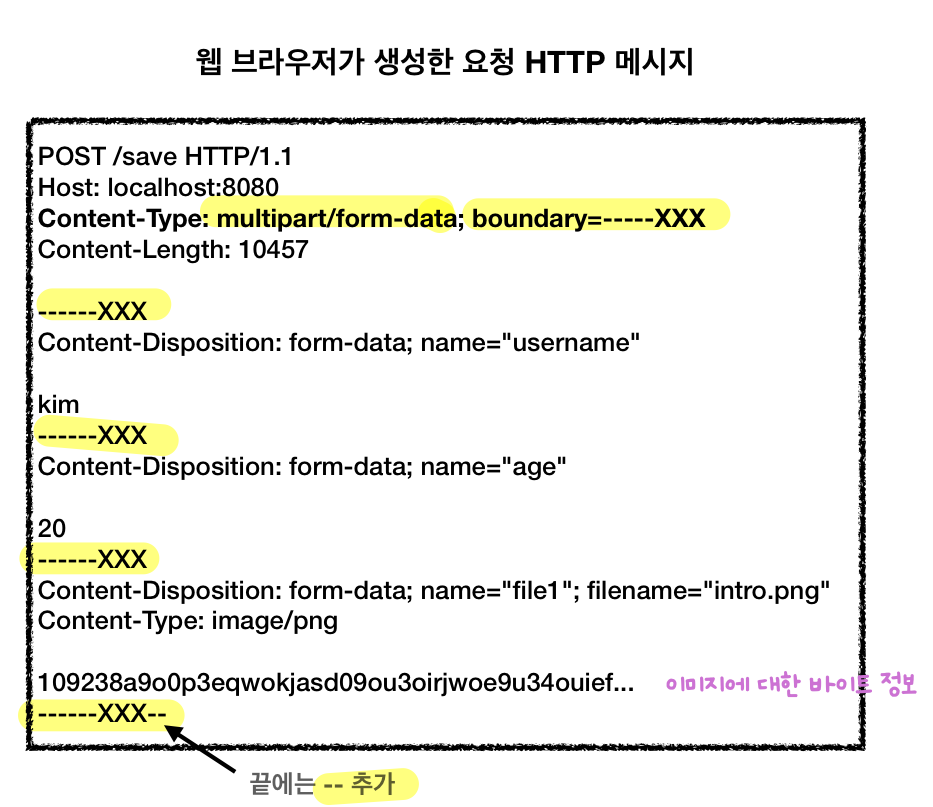

## 기본 용어
- IP (Internet Protocol)
	- **패킷(Packet)을 단위로 특정 주소(IP Address)에 데이터를 전달할 수 있는 프로토콜**
	- IP 패킷 (보내려는 메시지 + 출발지 IP, 도착지 IP...)
	- 한계
		- **비연결성**
			- 패킷을 받을 대상이 없거나 상대 서버가 불능 상태여도 전송
		- **비신뢰성**
			- 중간에 패킷이 누락되거나 순서대로 오지 않는 경우 존재
		- **프로그램 구분**
			- 같은 IP인데 통신하는 애플리케이션이 2개 이상인 경우 구분 불가
- 전송계층(Transport Layer)
	- 네트워크 4계층에서 TCP 혹은 UDP 추가 정보로 IP 패킷을 보완하는 단계
- TCP (Transmission Control Protocol)
	- **앞선 IP의 문제점을 해결 (전송제어 정보를 패킷에 추가)**
	- TCP/IP 패킷 (IP 패킷 + 출발지 PORT, 목적지 PORT, 전송제어, 순서, 검증정보...)
	- 특징
		- **연결지향 (3 way handshake)**
			- SYN, SYN+ACK, ACK 3단계로 연결을 확인하고 그 후 데이터를 보냄
			- 최근엔 최적화되어 세 번째 단계 ACK에서 데이터를 함께 보내는 것이 가능
		- 데이터 전달 보증
			- 서버는 데이터를 잘 받았다는 응답을 클라이언트에게 줌
		- 순서 보장
			- 기본적으로는 패킷 1, 3, 2 순서로 왔다면 2부터 다시 보낼 것을 클라이언트에 요청
			- 서버 최적화에 따라 다시 보내달라는 요청 없이 내부적으로 처리하기도 할 것
- UDP (User Datagram Protocol)
	- IP와 비슷할 정도로 기능이 거의 없음 (하얀 도화지)
		- **PORT, 체크섬 정도만 추가**
		- TCP의 연결지향, 데이터 전달 보증, 순서 보장 등이 없다.
	- **덕분에 단순하고 빠름**
		- TCP는 3 way handshake와 패킷의 추가정보들로 인해 데이터가 크고 속도가 느림
		- 따라서, 속도 최적화는 UDP 이용
		- HTTP3 스펙에서도 UDP를 활용하며 최근 각광
- PORT
	- 같은 IP(내 서버) 내에 여러 프로세스가 통신 중일 때, 응답 패킷이 어느 애플리케이션의 패킷인지 구분
	- IP가 아파트면 PORT는 동호수를 표현
	- 0~65535 할당 가능
	- 0~1023은 잘 알려진 포트로 사용하지 않는 것이 좋음
		- HTTP - 80
		- HTTPS - 443
- DNS (Domain Name System)
	- 전화번호부 같은 서버를 제공하여 **도메인명을 IP 주소로 변환**하는 역할 수행
	- IP는 기억하기 어렵고 가변적이어서 DNS가 이를 해결
- URI (Uniform Resource Identifier)
	- 자원을 식별하는 방법을 총칭
	- URL(Uniform Resource Locator) + URN(Uniform Resource Name)
		- URL: `https://www.inflearn.com/course/lecture`
		- URN: `urn:isbn:01270712`
	- URN은 보편화 되지 않아서 **URI = URL로 생각해도 무방하다.**
## URL 문법
- Syntax: **scheme://\[userinfo@]host\[:port]\[/path]\[?query]\[\#fragment]**
- 예시: https://www.google.com:443/search?q=hello&hl=ko
- `scheme`
	- 주로 **프로토콜** 사용 (어떤 방식으로 자원에 접근할 것인가에 대한 약속)
	- `http`, `https`, `ftp`
- `port`
	- `http` 80 포트, `https` 443 포트 등 보편적인 경우 **생략 가능**
- `userinfo`
	- URL에 사용자 정보를 포함해서 인증하는 경우 사용하지만 **거의 쓰이지 않음**
- `host`
	- **도메인명** 또는 **IP 주소**를 직접 사용 가능
- `path`
	- 계층적 구조의 리소스 경로
- `query`
	- key-value 형태
	- `?`로 시작, `&`로 추가
	- 서버로 요청시 모두 **문자로 넘어감**
	- = `query parameter` = `query string`
- `fragment`
	- `html` **내부 북마크**에 사용
	- 서버 전송 정보가 아님
## 브라우저 요청 흐름
1. 클라이언트
	- 애플리케이션 계층
		- 웹 브라우저에 요청: https://www.google.com:443/search?q=hello&hl=ko
		- 웹 브라우저가 DNS 조회 및 PORT 정보 파악
		- 웹 브라우저가 HTTP 요청 메시지 생성
		- SOCKET 라이브러리
			- 파악한 IP 및 PORT 정보로 구글 서버와 3 way handshake로 연결 맺기
			- OS로 데이터 전달
	- OS 계층 (TCP/UDP & IP 계층)
		- TCP/IP 패킷 생성 (HTTP 메시지 포함)
	- 네트워크 인터페이스
		- 패킷에 이더넷 프레임을 씌워 인터넷망으로 던짐
2. 인터넷 망
	- 수많은 인터넷 노드를 거쳐 목적지 구글 서버에 패킷 전달
3. 구글 서버
	- 구글 서버는 반대 과정으로 tcp/ip 패킷을 까서 http 메시지를 해석
	- 구글 서버는 요청에 맞는 http 응답 메시지를 생성하고 TCP/IP 패킷을 씌워 클라이언트에 다시 보냄
4. 인터넷 망
	- 수많은 인터넷 노드를 거쳐 클라이언트 웹브라우저에 응답 패킷 전달
5. 클라이언트
	- 클라이언트는 응답 패킷을 까서 http 메시지를 해석
	- 메시지 내 데이터를 웹 브라우저가 렌더링하여 화면에 출력
## HTTP (HyperText Transfer Protocol)
- **모든 형태의 데이터**를 HTTP 메시지로 전송 가능
	- 처음엔 HTML 같은 HyperText 문서 전송 용도로 시작
- **HTTP/1.1 (1997)**
	- 가장 많이 사용되는 중요한 버전
	- **주요 기능이 이미 모두 포함됨**
	- RFC7230~7235(2014)이 최신 개정판
	- HTTP/2, HTTP/3은 **성능 개선**에 초점
	- TCP 이용
		- HTTP/1.1, HTTP/2
	- UDP 이용
		- HTTP/3
- 특징
	- **클라이언트-서버 구조**
		- 클라이언트(UI, 사용성) & 서버(비즈니스 로직, 데이터) 분리로 각각이 독립적 진화 가능
	- **무상태 프로토콜(Stateless)**
		- 서버가 클라이언트의 상태를 보존하지 않음
		- 서버 **Scale Out**(**수평 확장**)에 유리
			- **무상태는 응답 서버를 쉽게 바꿀 수 있으므로** 무한한 서버 증설 가능
			- 갑자기 클라이언트 요청(고객)이 증가해도 서버(점원)를 대거 투입할 수 있음
		- 한계
			- 무상태로 설계할 수 없는 경우도 있음
				- 쿠키 세션 로그인
			- 요청 데이터가 많음
		- **최대한 무상태로 설계하고 어쩔 수 없는 경우에만 상태 유지**
			- 정말 같은 시간에 딱 맞추어 발생하는 대용량 트래픽 감당을 위한 **필수 설계**
			- 선착순 1000명 이벤트는 수만명 동시 요청 발생
			- 첫 페이지에 로그인도 필요 없는 정적 페이지 하나를 두면 조금 분산이 됨
	- **비연결성(Connectionless)**
		- 요청 및 응답할 때만 연결하고 바로 끊음
		- **서버의 자원을 매우 효율적**으로 사용할 수 있음
			- HTTP는 초 단위 이하의 빠른 속도로 응답
			- 1시간 동안 수천명이 서비스를 이용해도 서버에서 **실제 동시에 처리하는 요청은 수십개 이하**로 작음 (1초에 몇 명 되지도 않을 것)
		- **HTTP 지속 연결(Persistent Connections)** 기본으로 사용해 연결 시간을 어느정도 **최적화**
			- TCP/IP 연결(3 way handshake) 시간이 사용자에게 매번 추가되는 상황이 비효율적
				- js파일, html 파일, css 파일을 각각 다운 받을 때마다 연결을 맺음 (0.9초)
			- HTTP 지속 연결로 해결
				- HTML 페이지 하나가 전부 다운 받아질 때까지 TCP 연결을 유지하고 해제함 (0.5초)

## HTTP 메시지 구조


- 구조
	- **시작 라인(start-line)**
		- 요청과 응답 기본 형태는 start-line만 다름
		- request-line (요청 메시지 경우)
			- `(HTTP 메서드) (SP=공백) (request-target=absolute path) (SP) (HTTP version) (CRLF=엔터)`
			- ex) `GET /search?q=hello&hl=ko HTTP/1.1`
		  - status-line (응답 메시지 경우)
			- `(HTTP version) (SP) (status-code) (SP) (reason-phrase) (CRLF)`
			- ex) `HTTP/1.1 200 OK`
	- **헤더(header)**
		- HTTP 전송에 필요한 모든 **메타 정보** 담김
		- 수많은 표준 헤더가 존재 & 임의의 헤더 추가 가능
		- 구조 (header-field)
		    - `(field-name) (:) (OWS=띄어쓰기 허용) (field-value) (OWS)`
		    - `field-name`은 *대소문자 구분 X*, `field-value`는 *대소문자 구분 O*
		    - request example
			    - `Host: www.google.com`
		    - response example
			    - `Content-Type: text/html;charset=UTF-8`
			    - `Content-Length: 3432`
	- 공백 라인(empty line) - *Required*
	- **메시지 바디(message body)** - *Optional*
		- **실제 전송할 데이터** 담김
			- byte로 표현할 수 있는 모든 데이터 가능
			- HTML, 이미지, 영상, JSON etc...

## HTTP 메서드
- API URI 설계 표준
	- **리소스** 식별 (**명사**)
		- 리소스: 회원
		- 계층 구조 상 상위 => **컬렉션** => **복수 명사**(**/members**)
		- 계층 구조 상 하위 => **도큐먼트** => 식별자 구분 (**/members/{id}**)
	- **행위**는 **HTTP 메서드**로 분리 (**동사**)
		- 행위: 조회, 등록, 삭제, 변경
- 주요 HTTP 메서드 종류
	- GET
		- 리소스 조회
		- **쿼리 파라미터**로 데이터 전달
		- 최신 스펙에서 메시지 바디로 데이터 전달이 가능하지만, 지원하지 않는 곳이 있어 권장 X
	- POST
		- 요청 데이터 처리
		- **리소스마다 요청 데이터를 어떻게 처리할지 따로 정해야 함**
			- **신규 리소스 등록**
				- 회원가입, 게시판 글쓰기...
			- **프로세스 처리**
				- 단순한 데이터 생성 및 변경을 넘어서 **엮여있는 프로세스들을 처리**해야 하는 경우
				- POST의 결과로 **새 리소스가 생성되지 않을 수 있음**
				- 주문에서 `결제완료 -> 배달시작 -> 배달완료` 같은 큰 작업들이 엮인 상태변경
				- POST /orders/{orderId}/start-delivery (보통 POST에서 **컨트롤 URI** 사용)
			- **다른 메서드로 처리하기 애매한 경우**
				- JSON으로 조회 데이터 넘겨야 하는데, GET 메서드 사용하기 어려운 경우
				- 한 문서 끝에 내용 추가
		- 즉, **서버에서 큰 변화**가 일어나는 것은 POST 사용
	- PUT
		- 리소스 대체 & 해당 리소스가 없을시 생성 (=**덮어쓰기**)
		- 요청에서 데이터가 누락되면 그대로 삭제됨 (**위험성 존재**)
		- 클라이언트가 리소스를 식별 (URI)
	- PATCH
		- 리소스 부분 변경
		- 실무 엔터티들은 데이터가 많기 때문에 변경에 주로 PATCH를 사용
		- PATCH를 못받아들이는 서버가 있다면 POST를 부분 변경에 사용한다.
	- DELETE
		- 리소스 삭제
- HTTP 메서드의 속성
	
	- 안전(Safe Methods)
		- 호출해도 리소스를 **변경**하지 않음
		- 안전한 메서드: **GET**
	- 멱등(Idempotent Methods)
		- **여러 번 호출**해도 **결과가 똑같음**
		- 서버에 문제가 있을 때, 클라이언트가 같은 요청을 다시 해도 되는가의 판단 근거
		- **멱등하지 않은 메서드: POST, PATCH**
	- 캐시가능(Cacheable Methods)
		- **응답 결과 리소스를 캐시**해서 사용 가능
			- 큰 용량의 데이터를 로컬 PC 웹 브라우저 내부에 저장하고 있을 수 있는지 여부
		- 캐시 가능 메서드: **GET**, POST, PATCH
			- POST, PATCH는 메시지 바디까지 캐시 키로 고려해야 해서 구현이 어려움
			- **실제로 GET 정도만 캐시로 사용**

## HTTP 통신 유스 케이스
- 데이터 전송 방식 분류
	- 쿼리 파라미터 전송 (검색어를 포함한 정렬 필터)
		- GET
	- 메시지 바디 전송
		- POST, PUT, PATCH
- 유스케이스
	- 정적 데이터 조회
		- 이미지, 정적 텍스트 문서
		- 리소스 경로로 단순 조회
	- 동적 데이터 조회
		- 검색어 포함 필터 및 정렬 적용
		- 쿼리 파라미터 조회
	- HTML Form을 통한 데이터 전송
		- GET, POST만 지원
		- GET 전송
			- form 내용을 쿼리 파라미터 형식으로 전달
		- POST 전송
			- `Content-Type: application/x-www-form-urlencoded` (**default**)
				- form 내용을 메시지 바디 통해서 전송 (**key=value 형태**)
				- 전송 데이터를 **url encoding** 처리
					- 한글 같은 것이 들어오면 자동으로 인코딩 됨
					- abc김 -> abc%EA%B9%80
			- `Content-Type: multipart/form-data`
				
				- **form 내용 및 다른 종류의 여러 파일**을 메시지 바디 통해서 전송 (**boundary로 타입마다 나눔**)
				- 파일 업로드 같은 바이너리 데이터 전송시 사용
	- API를 통한 데이터 전송
		- AJAX, Axios 등을 통한 자바스크립트 통신
		- `Content-Type: application/json` (JSON 데이터로 소통)
		- 서버 to 서버, 웹 혹은 앱 클라이언트
- HTTP API 설계 예시
	- HTTP API - **컬렉션**(Collection)
		- **POST** 기반 등록
		- 컬렉션: 서버가 관리하는 리소스 디렉토리 (`/members`)
		- **서버**가 리소스 URI를 생성 및 관리
		- 회원 관리 시스템 예시
			- 회원 목록: GET `/members`
			- 회원 등록: POST `/members`
			- 회원 조회: GET `/members/{id}`
			- 회원 수정: **PATCH**, PUT, POST `/members/{id}`
				- 실무에서는 엔터티의 속성이 매우 많으므로 PATCH를 쓰는게 제일 좋음
				- PUT은 하나라도 누락되면 데이터가 날아가버릴 위험 (게시판 게시글 수정 정도 OK)
				- 둘 다 애매한 경우는 POST 사용
			- 회원 삭제: DELETE `/members/{id}`
	- HTTP API - **스토어**(Store)
		- **PUT** 기반 등록
		- 스토어: 클라이언트가 관리하는 리소스 디렉토리 (`/files`)
		- **클라이언트**가 리소스 URI를 알고 관리
		- 파일 관리 시스템 예시
			- 파일 목록: GET `/files`
			- 파일 조회: GET `/files/{filename}`
			- 파일 등록: PUT `/files/{filename}`
			- 파일 삭제: DELETE `/files/{filename}`
			- 파일 대량 등록: POST `/files`
	- HTML Form
		- **GET, POST**만 지원
		- 메서드 제약을 **컨트롤 URI**로 해결
			- 일반적으로 HTTP 메서드로 해결하기 애매한 경우 **동사로 된 리소스 경로** 사용
		- 회원 관리 시스템 예시
			- 회원 목록: GET `/members`
			- 회원 등록 폼: GET `/members/new`
			- 회원 등록: POST `/members/new` (혹은 `/members`)
			- 회원 조회: GET `/members/{id}`
			- 회원 수정 폼: GET `/members/{id}/edit`
			- 회원 수정: POST `/members/{id}/edit` (혹은 `/members/{id}`)
			- 회원 삭제: POST `/members/{id}/delete`

## HTTP header 
- HTTP 전송에 필요한 모든 부가정보
- History
	- RFC2616 (폐기)
		- Header를 General header, Request header, Response header, Entity header로 분류
		- **Entity body**(실제 데이터)는 Message body에 담음
		- **Entity header**는 Entity body 해석을 위한 정보 제공 (`Content-Type`, `Content-Length`)
	- RFC723x
		- Entity => **Representation**(**표현**)
		- 회원이라는 리소스를 특정 데이터 형식(HTML, JSON, XML)으로 **표현**해 전달하겠다는 의미
		- Representation = **Representation Metadata** + **Representation Data**
		- Representation Data는 Payload(=Message body)에 담음

## 일반 HTTP 헤더
- 표현 헤더
	- `Content-Type`
		- 미디어 타입, 문자 인코딩
		- `text/html; charset=utf-8`, `application/json` (디폴트 인코딩: utf-8), `image/png`
	- `Content-Encoding`
		- 표현 데이터의 압축 정보 (전달자가 헤더 추가)
		- `gzip`, `deflate`, `identity`(=압축 X)
	- `Content-Language`
		- 자연 언어
		- `ko`, `en`, `en-US`
	- `Content-Length`
		- 바이트 단위
		- Transfer-Encoding 사용 시에는 필요 없음
- 협상 헤더 (Content Negotiation)
	- **클라이언트가 선호하는 표현을 서버에 요청**하고 서버는 최대한 클라이언트 선호에 맞춰 응답
	- 요청시에만 사용하는 헤더
	- 종류
		- `Accept` (미디어 타입)
		- `Accept-Charset` (문자 인코딩)
		- `Accept-Encoding` (압축 정보)
		- `Accept-Language` (자연 언어)
	- 협상 우선순위
		- Quality Values(q)
			- 0~1: 클수록 높은 우선순위
			- 생략 시 1
			- `Accpet-Language: ko-KR,ko;q=0.9,en-US;q=0.8,en;q=0.7`
		- 구체적인 것이 우선
			- `Accept: text/*, text/plain, text/plain;format=flowed, */*`
			- `text/plain;format=flowed` > `text/plain` > `text/*` > `*/*`
- 전송방식 관련 헤더
	- 단순 전송
		- `Content-Length` 헤더와 함께 한번에 데이터 전송
	- 압축 전송
		- `Content-Length` + `Content-Encoding` 헤더와 함께 압축된 데이터를 전송
	- 분할 전송
		- `Transfer-Encdoing`: chunked 헤더와 함께 데이터를 일정한 단위로 쪼개어 보냄
		- `Content-Length` 헤더는 보내면 안됨
		- 큰 용량의 데이터를 한 번에 보내느라 기다리는 상황이 생기지 않도록, 분할된 데이터가 오는대로 바로바로 보여주는 방식
		- 서버에서 5byte가 만들어지면 클라이언트에 먼저 보내고, 또 만들어지면 또 보내서 마지막에 0바이트 `\r\n`을 보내고 끝을 표현
	- 범위 전송
		- `Range`(요청 헤더), `Content-Range`(응답 헤더)와 함께 범위를 지정해 데이터를 전송
		- 데이터를 절반정도 받다가 연결이 끊겼을 때, 못받은 범위만큼만 재요청하면 효율적
- 일반 정보 헤더
	- `From` (요청 헤더)
		- 유저 에이전트의 이메일 정보
		- 거의 사용되지 않지만 검색 엔진 같은 곳에서 주로 사용 (크롤링 그만해달라는 요청을 할 수 있는 연락 수단)
	- `Referer` (요청 헤더)
		- 이전 웹 페이지 주소
		- 유입 경로 분석에 사용
	- `User-Agent` (요청 헤더)
		- 클라이언트의 애플리케이션 정보 (웹브라우저 정보)
		- `user-agent: Mozilla/5.0 (Macintosh; Intel Mac OS X 10_15_7) AppleWebKit/ 537.36 (KHTML, like Gecko) Chrome/86.0.4240.183 Safari/537.36`
		- 통계 정보 혹은 특정 브라우저의 장애에 대한 파악에 이용
	- `Server` (응답 헤더)
		- ORIGIN 서버의 소프트웨어 정보
		- ORIGIN 서버: 여러 프록시 서버, 캐시 서버를 제외하고 정말로 요청을 처리해 응답하는 서버
		- `Server: Apache/2.2.22 (Debian)`
		- `server: nginx`
	- `Date` (응답 헤더)
		- 메시지가 발생한 날짜와 시간
		- 최신 스펙에서 응답에만 사용하도록 명시
- 특별 정보 헤더
	- `Host` (요청 헤더, **필수**)
		- 요청한 호스트 정보 (도메인)
		- 클라이언트가 DNS를 거쳐 얻은 IP로 가상호스팅 중인 서버에 패킷을 보냈을 때, 어떤 도메인으로 전달해야 할지 판단하는 것에 구분점이 됨
		- 가상호스팅: 하나의 IP 주소에 여러 도메인이 적용되어 있는 상황 (도메인이 다른 여러 애플리케이션 구동)
	- `Location` (응답 헤더)
		- 페이지 리다이렉션
		- **201**: 요청에 의해 생성된 리소스 URI
		- **3xx**: 요청을 자동으로 리다이렉션할 리소스 URI
	- `Allow` (응답 헤더)
		- 해당 Path에서 허용 가능한 HTTP 메서드를 확인해 서버에서 보냄
		- **405** (Method Not Allowed)에는 반드시 포함
		- **실제로 구현되어 있는 곳은 별로 없음**
	- `Retry-After` (응답 헤더)
		- 유저 에이전트가 다음 요청을 하기까지 기다려야 하는 시간
		- **503** (Service Unavailable) 응답 시 서비스가 언제까지 불능인지 알려줌
		- 날짜표기 혹은 초단위 표기
- 인증 헤더
	- `Authorization` (요청 헤더)
		- 클라이언트 인증 정보를 서버에 전달
		- `Authorization: Basic xxxxxxxxx`
		- `Authorization: Bearer xxxxxxxxx`
	- `WWW-Authenticate` (응답 헤더)
		- 리소스 접근시 필요한 인증 방법 정의
		- 정의해준 방법으로 다시 제대로 인증 정보를 생성해서 인증하라는 의미
		- **401** (Unauthorized)와 함께 사용
		- `WWW-Authenticate: Newauth realm="apps", type=1,
title="Login to \"apps\"", Basic realm="simple"`
- 쿠키 헤더
	- 특징
		- HTTP는 Stateless 프로토콜이므로 **상태가 요구되는 상황**에서는 쿠키로 저장
			- 사용자 로그인 세션 관리
			- 광고 정보 트래킹
		- **GDPR**(General Data Protection Regulation, EU 개인정보보호 법령)로 인해 EU 회원국의 웹사이트들은 유저들로부터 **쿠키 수집 동의를 받아야 함** (필수쿠키, 기능쿠키, 성능쿠키, 마케팅쿠키 등에 대해 각각 선택도 가능)
		- 쿠키는 항상 서버에 전송되므로 **네트워크 트래픽**이 유발되기 때문에, **최소한의 정보**만 사용해야 함 (세션 id, 인증 토큰)
		- **보안에 민감한 데이터는 저장하면 안됨** (주민번호, 신용카드 번호)
		- 생명주기
			- 세션 쿠키: 만료 날짜가 생략된 쿠키는 브라우저 종료시까지만 유지
			- 영속 쿠키: 만료 날짜가 입력된 쿠키는 해당 날짜까지 유지
	- `Cookie` (요청 헤더)
		- 서버에서 받은 쿠키를 클라이언트가 HTTP 요청시 전달
	- `Set-Cookie` (응답 헤더)
		- 서버에서 클라이언트로 쿠키 전달
		- Field Value
			- `expires`
				- 만료일이 되면 쿠키 삭제
			- `max-age`
				- 0이나 음수를 지정하면 쿠키 삭제
			- `domain`
				- **쿠키를 전송받는** 서버 도메인의 범위 제한
				- 예시) `domain=example.com`
				- 명시
					- 기준 도메인 + 서브 도메인 적용
					- `example.com`&`dev.example.com`까지 쿠키 접근 가능(=쿠키 전송)
				- 생략
					- 기준 도메인만 적용
					- `example.com`만 쿠키 접근 가능
			- `path`
				- 해당 경로를 포함해 하위 경로 페이지까지만 쿠키 접근 가능
				- 일반적으로 `path=/` 루트로 지정
			- `Secure`
				- https인 경우에만 쿠키 전송
			- `HttpOnly`
				- 자바스크립트로 쿠키 접근 불가, http 전송에만 사용 가능
				- XSS 공격 방지
			- `SameSite`
				- **쿠키를 전송하는** 요청 도메인(=현재 접속해 있는 페이지)의 범위 제한
				- **요청 도메인**이 쿠키에 설정된 도메인과 같은 경우에만 쿠키 전송
				- XSRF 공격 방지
				- 속성
					- `Strict`: 같은 도메인에서만 접근 가능
						- 퍼스트 파티 쿠키 only
					- `Lax`: `<a>`, `<link>`, `<form method="GET">`통한 이동은 다른 도메인이어도 cookie 전송
						- Chrome 80 default
						- 퍼스트 파티 쿠키 + 일부 서드 파티 쿠키
					- `None`: cross-site에서도 쿠키 전송 가능 (단, **Secure 옵션 추가필수**)
						- 퍼스트 파티 쿠키 + 모든 서드 파티 쿠키

## 캐시와 조건부 요청 HTTP 헤더
- (캐시 제어 헤더) + (검증 & 조건부 요청 헤더 한 쌍) 캐시 조합 권장
	- `cache-control: max-age=...` + `Last-Modified`
	- `cache-control: max-age=...` + `ETag` (**Recommendation**)
- 캐시 기본 동작
	- 첫 번째 요청시응답에서 특정 캐시 헤더 및 바디 데이터를 **브라우저 캐시**에 저장
		- `cache-control: max-age=60`
		- `Last-Modified: 2023-04-23...`
		- `ETag: "aaaaaaaaa"`
	- 두 번째 요청시 **캐시 유효시간(`max-age` 값)** 검증
		- 유효: **캐시**에서 조회
		- 유효 X
			- **서버**로 요청
				- 조건부 요청 헤더 추가
					- 검증 헤더에 따라 `If-Modified-Since` 혹은 `If-None-Match`
				- 서버 검증
					- 기존 데이터 변경 X
						- `304 Not Modified` (HTTP Body X) 응답
						- **캐시에서 조회** (재사용)
						- 브라우저 캐시갱신 (응답 캐시 **헤더**)
					- 기존 데이터 변경
						- `200 OK`, 변경된 데이터 응답
						- 브라우저 캐시 갱신 (응답 캐시 **헤더 + 바디**)
- 헤더 종류
	- 캐시 제어 헤더
		- **Cache-Control** (캐시 제어)
			- `max-age`
				- 캐시 유효 시간, 초 단위
			- `no-cache`
				- 데이터를 캐시해도 되지만, 항상 원 서버(Origin Server)에 검증하고 사용
			- `no-store`
				- 데이터에 민감한 정보가 있으므로 저장하면 안됨 (메모리에서 사용하고 최대한 빨리 삭제)
		- Pragma (캐시 제어, HTTP 1.0 하위호환)
			- `no-cache` (위와 동일)
		- Expires (`Cache-Control: max-age` 하위호환, 함께 사용시 Expires는 무시됨)
			- 캐시 만료일을 정확한 날짜로 지정
	- 검증 헤더 (Validator)
		- **캐시 데이터와 서버 데이터가 같은지 검증**하는 데이터
		- `Last-Modified`
			- 데이터가 마지막으로 수정된 시간
			- 1초 미만 단위의 캐시 조정이 불가능
		- `ETag` (Entity Tag)
			- 캐시용 데이터에 임의의 고유한 버전 이름(Hash)을 붙이고 데이터 변경시 Hash 재생성
			- `ETag`가 같으면 캐시유지, 다르면 변경된 데이터 전송
			- **서버에서 별도 캐시 로직을 관리**하고 싶은 경우 사용
				- 데이터 수정 날짜가 다르지만 A -> B -> A로 수정해 데이터 결과가 똑같은 경우
				- 스페이스나 주석 같이 크게 영향 없는 변경 무시
				- 애플리케이션 배포 주기에 맞추어 `ETag` 모두 갱신
	- 조건부 요청 헤더
		- 검증 헤더를 통해 브라우저 캐시에 저장된 값으로 **조건에 따른 분기** 요청
		- **`If-Modified-Since`**: `Last-modified` 값 사용
		- `If-Unmodified-Since`: `Last-modified` 값 사용
		- **`If-None-Match`**: `ETag` 값 사용
		- `If-Match`: `ETag` 값 사용
- 장점
	- **비싼 네트워크 사용량을 줄일 수 있음** (캐시 유효시간동안 네트워크 이용은 용량이 적은 헤더 전달뿐)
	- **브라우저 로딩 속도가 매우 빨라져서 사용자 경험이 좋아짐**

## 프록시 캐시
- 원 서버가 멀리 있는 경우 중간에 프록시 캐시 서버(CDN 서비스)를 두어 **속도적 이점**을 얻음
	- 클라이언트(한국) - (0.5초) - 원 서버(미국)
	- 클라이언트(한국) - (0.1초) - 프록시 캐시 서버(한국 어딘가) - (0.4초) - 원 서버(미국)
- 보편적 캐시 방법
	- 첫 번째 접근이 오래걸리고 **두 번째 이후부터는 다운이 이미 받아져 빨라짐**
		- 유튜브의 인기 있는 영상은 로딩이 빠르고 인기 없는 영상은 로딩이 느림
	- 원 서버에서 캐시 서버로 데이터를 밀어 넣는 경우도 있음
- 관련 캐시 응답 헤더
	- `Cache-Control: public`
		- 응답이 public 캐시에 저장되어도 됨 (=중간 프록시 캐시 서버에 저장되어도 됨)
	- `Cache-Control: private`
		- 응답이 private 캐시에 저장되어야 함 (기본값)
	- `Cache-Control: s-maxage`
		- 프록시 캐시에 적용되는 max-age
	- `Cache-Control: must-revalidate`
		- 캐시 만료 후 최초 조회시 원 서버에 검증해야 함
		- 원 서버 접근 실패시 반드시 오류가 발생해야 함 (504 Gateway Timeout)
		- 캐시 시간이 유효하다면 캐시 사용
	- `Age: 60`
		- 원 서버에서 응답 후 프록시 캐시 내에 머문 시간(초)
- **확실한 캐시 무효화 응답**
	```
	Cache-Control: no-cache, no-store, must-revalidate
	Pragma: no-cache
	```
	- 기본적으로 웹브라우저 임의로 캐시를 할 수 있기 때문에 완전한 캐시 무효를 위해 사용
	- **네트워크 단절 등으로 인한 원 서버 접근 불가 시 `must-revalidate`이 필요**
		- `no-cache`의 경우 캐시 서버 설정에 따라 원 서버에 접근할 수 없는 경우, 캐시 데이터를 반환할 수 있음 (오류보다는 오래된 데이터라도 보여주기, 200 OK)
		- `must-revalidate`은 원서버에 접근할 수 없는 경우, **항상 오류 발생시킴** (**매우 중요한 돈과 관련된 결과들에 필수, 504 Gateway Timeout**)
- 용어
	- 원 서버 (Origin Server): 실제 요청을 처리하는 서버
	- public 캐시: 프록시 캐시 서버
	- private 캐시: 각각의 브라우저의 로컬 캐시

***
## Reference

[모든 개발자를 위한 HTTP 웹 기본 지식](https://www.inflearn.com/course/http-%EC%9B%B9-%EB%84%A4%ED%8A%B8%EC%9B%8C%ED%81%AC)
[마케터를 위한 웹사이트 쿠키 동의 환경의 이해](https://osoma.kr/blog/cookie-consent/)
[What are the security differences between cookies with Domain vs SameSite strict?](https://stackoverflow.com/questions/57090774/what-are-the-security-differences-between-cookies-with-domain-vs-samesite-strict)
[SameSite란? None, Lax, Strict](https://jjam89.tistory.com/231)