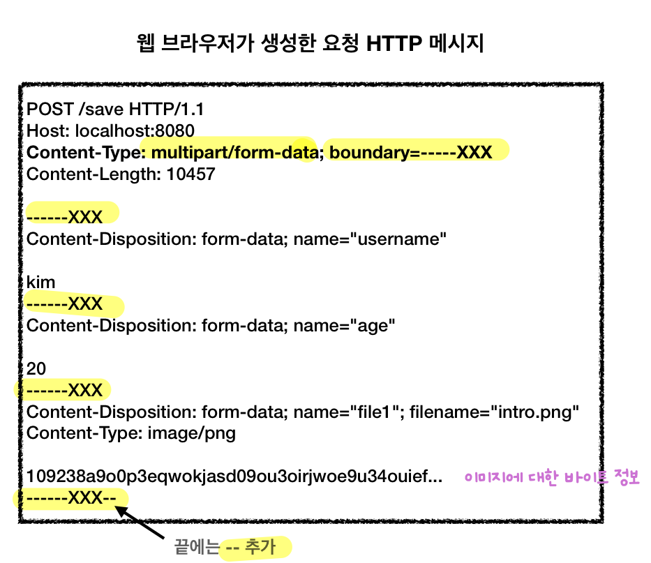
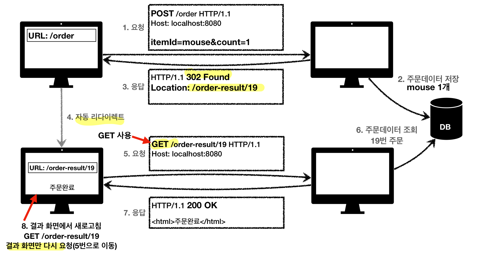

## HTTP 통신 유스 케이스
- 데이터 전송 방식 분류
	- 쿼리 파라미터 전송 (검색어를 포함한 정렬 필터)
		- GET
	- 메시지 바디 전송
		- POST, PUT, PATCH
- 유스케이스
	- 정적 데이터 조회
		- 이미지, 정적 텍스트 문서
		- 리소스 경로로 단순 조회
	- 동적 데이터 조회
		- 검색어 포함 필터 및 정렬 적용
		- 쿼리 파라미터 조회
	- HTML Form을 통한 데이터 전송
		- GET, POST만 지원
		- GET 전송
			- form 내용을 쿼리 파라미터 형식으로 전달
		- POST 전송
			- `Content-Type: application/x-www-form-urlencoded` (**default**)
				- form 내용을 메시지 바디 통해서 전송 (**key=value 형태**)
				- 전송 데이터를 **url encoding** 처리
					- 한글 같은 것이 들어오면 자동으로 인코딩 됨
					- abc김 -> abc%EA%B9%80
			- `Content-Type: multipart/form-data`
				
				- **form 내용 및 다른 종류의 여러 파일**을 메시지 바디 통해서 전송 (**boundary로 타입마다 나눔**)
				- 파일 업로드 같은 바이너리 데이터 전송시 사용
	- API를 통한 데이터 전송
		- AJAX, Axios 등을 통한 자바스크립트 통신
		- `Content-Type: application/json` (JSON 데이터로 소통)
		- 서버 to 서버, 웹 혹은 앱 클라이언트
- URI 설계 단위
	- 문서(Document)
		- 단일 개념 (파일 하나, 객체 인스턴스, 데이터베이스 row)
		- `members/1`, `/files/star.jpg`
	- **컬렉션**(Collection)
		- 서버가 관리하는 리소스 디렉토리
		- **POST** 기반 등록
		- **서버**가 리소스 URI를 결정
		- `/members`
	- **스토어**(Store)
		- 클라이언트가 관리하는 리소스 디렉토리
		- **PUT** 기반 등록 (없으면 생성, 있으면 수정)
		- **클라이언트**가 리소스 URI를 결정
		- 파일 시스템, 게시판 등에 적용
		- `/files`
	- 컨트롤러(Controller), **컨트롤 URI**
		- 일반적인 HTTP 메서드만으로 해결하기 애매한 경우 사용
		- 문서, 컬렉션, 스토어로 해결하기 어려운 추가 프로세스 실행
		- **동사로 된 리소스 경로** 사용
		- `/members/{id}/delete`
- HTTP API 설계 예시
	- HTTP API - **컬렉션**
		- 회원 관리 시스템 예시
			- 회원 목록: GET `/members`
			- 회원 등록: POST `/members`
			- 회원 조회: GET `/members/{id}`
			- 회원 수정: **PATCH**, PUT, POST `/members/{id}`
				- 실무에서는 엔터티의 속성이 매우 많으므로 PATCH를 쓰는게 제일 좋음
				- PUT은 하나라도 누락되면 데이터가 날아가버릴 위험 (게시판 게시글 수정 정도 OK)
				- 둘 다 애매한 경우는 POST 사용
			- 회원 삭제: DELETE `/members/{id}`
	- HTTP API - **스토어**
		- 파일 관리 시스템 예시
			- 파일 목록: GET `/files`
			- 파일 조회: GET `/files/{filename}`
			- 파일 등록: **PUT** `/files/{filename}`
			- 파일 삭제: DELETE `/files/{filename}`
			- 파일 대량 등록: **POST** `/files`
	- HTML Form
		- 순수 HTML, HTML Form만을 사용해야 할 때의 시나리오
		- **GET, POST**만 지원
		- 메서드 제약을 **컨트롤 URI**로 해결
		- 회원 관리 시스템 예시
			- 회원 목록: GET `/members`
			- 회원 등록 폼: GET `/members/new`
			- 회원 등록: POST `/members/new` (혹은 `/members`)
			- 회원 조회: GET `/members/{id}`
			- 회원 수정 폼: GET `/members/{id}/edit`
			- 회원 수정: POST `/members/{id}/edit` (혹은 `/members/{id}`)
			- 회원 삭제: POST `/members/{id}/delete`

>List 형식의 쿼리 파라미터
>
>쿼리 파라미터에서 같은 키 값에 대해 복수의 value를 보낼 수도 있음
>**`id=1&id=2&id=3&id=4`**
## HTTP 상태코드
클라이언트는 상위 상태코드로 해석해 처리하므로 미래에 새로운 상태 코드가 추가되어도 클라이언트는 변경 X
- 2xx (Successful)
	- **`200 OK`**
	- **`201 Created`**
		- 요청 성공해서 새로운 리소스가 생성됨
		- 응답의 Location 헤더 필드로 생성된 리소스 식별 (`Location: /members/1`)
		- 혹은 응답 메시지 바디에 `id`를 리턴해 생성된 리소스 식별
	- **`202 Accepted`**
		- 요청이 접수되었으나 처리가 완료되지 않았음
		- **배치 처리** (요청 접수 1시간 후 배치 프로세스 시작)
	- **`204 No Content`**
		- 서버가 요청을 성공적으로 수행했지만, 응답 페이로드 **본문에 보낼 데이터가 없음**
		- 웹 문서 편집기 save 버튼
- 3xx (Redirection)
	- 요청을 완료하기 위해 유저 에이전트의 추가 조치 필요
	- **웹브라우저는 3xx 응답 결과에 Location 헤더가 있으면, Location 위치로 자동 이동**
	- 영구 리다이렉션 (거의 사용 X)
		- 리소스 URI가 영구적으로 이동
		- 원래의 URL을 사용하지 않고 검색엔진에서도 변경을 인지
		- `301 Moved Permanently`
			- 리다이렉트시 요청 메서드가 GET으로 변하고, 본문(메시지 바디)이 제거될 수 있음
		- `308 Permanent Redirect`
			- 301과 같은 기능
			- 리다이렉트시 요청 메서드와 본문 유지 (POST로 보내면 리다이렉트도 POST)
	- **일시 리다이렉션**
		- 리소스 URI가 일시적으로 변경
		- 검색엔진에서 기존 URI 유지
		- 처음 302의 의도는 메서드 유지였으나 애매한 스펙 기재로 웹브라우저들이 GET으로 변경하도록 구현되었고 결국 명확한 스펙의 307, 303이 등장 함 (301 대응의 308도 마찬가지)
		- **`302 Found`** (현실적으로 이미 많은 라이브러리가 디폴트로 사용하므로 **302만 써도 무방**)
			- 리다이렉트 요청 메서드가 GET으로 변하고, 본문이 제거될 수 있음
		- `307 Temporary Redirect`
			- 302와 같은 기능
			- 리다이렉트시 요청 메서드와 본문 유지 (POST로 보내면 리다이렉트도 POST)
		- `303 See Other`
			- 302와 같은 기능
			- 리다이렉트시 요청 메서드가 GET으로 변경
		- **PRG (Post/Redirect/Get)** (자주 사용)
			
			- POST 주문 후 새로고침하면 재요청으로 인해 중복 주문이 될 수 있음
			- 따라서, **POST 주문 후에 주문 결과 화면을 GET 메서드로 리다이렉트**
	- 특수 리다이렉션
		- **`304 Not Modified`**
			- 클라이언트에게 서버 리소스가 수정되지 않았음을 알려줌
			- 클라이언트는 로컬 캐시로 리다이렉트 (**캐시 재사용**)
			- **응답 메시지 바디 X**
			- **조건부 GET, HEAD 요청시 사용**
- 4xx (Client Error) - 오류의 원인이 **클라이언트**에 있으므로, **재시도가 항상 실패**
	- **`400 Bad Request`**
		- 클라이언트가 잘못된 요청을 해서 서버가 요청을 처리할 수 없음
		- 요청 파라미터가 잘못되거나, API 스펙이 맞지 않을 때 (**백엔드는 철저히 validation해야 함**)
	- **`401 Unauthorized`**
		- 클라이언트가 해당 리소스에 대한 인증이 필요함 (**인증 실패**)
		- 응답에 `WWW-Authenticate` 헤더와 함께 인증 방법 설명
	- **`403 Forbidden`**
		- 서버가 요청을 이해했지만 승인을 거부함 (**인가 실패**, 접근 권한 불충분)
		- 로그인한 어드민 등급이 아닌 사용자가, 어드민 등급 리소스에 접근하는 경우
	- **`404 Not Found`**
		- 요청 리소스가 서버에 없음
		- 혹은 권한이 부족한 클라이언트에게 해당 리소스를 완전히 숨기고 싶을 때 (403도 안내고 완전히 숨기고 싶을 때)
- 5xx (Server Error) - 오류의 원인 **서버**에 있으므로, **재시도가 성공할 수도 있음**
	- **`500 Internal Server Error`**
		- 서버 내부 문제로 오류 발생
		- 애매하면 500
	- **`503 Service Unavailable`**
		- 서비스 이용 불가
		- 서버가 일시적인 과부하 혹은 예정된 작업으로 잠시 요청을 처리할 수 없음
		- `Retry-After` 헤더 필드로 얼마뒤에 복구되는지 보낼 수 있음
	- **서버는 왠만하면 500대 에러를 내서는 안됨. 항상 200대 혹은 400대 에러로 해결할 것**

***
## Reference

[모든 개발자를 위한 HTTP 웹 기본 지식](https://www.inflearn.com/course/http-%EC%9B%B9-%EB%84%A4%ED%8A%B8%EC%9B%8C%ED%81%AC)