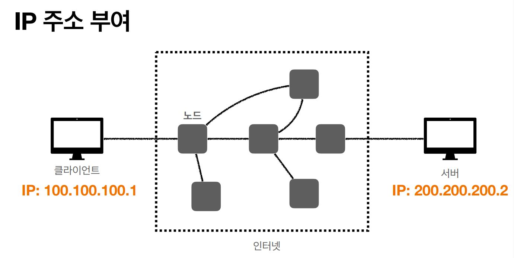
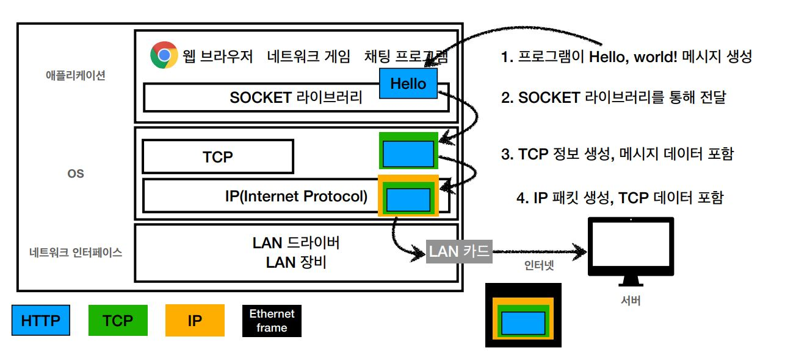
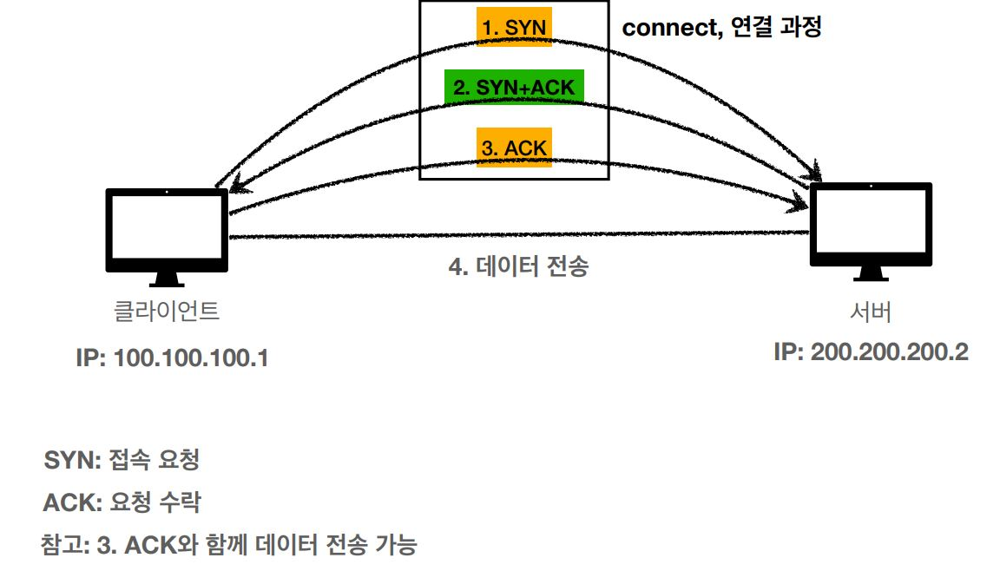
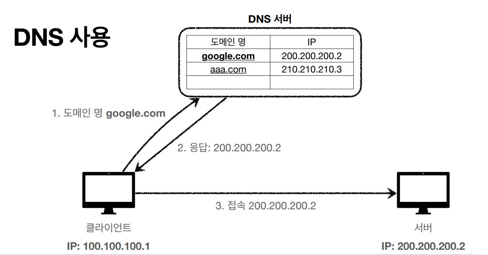

# 네트워크 Basic

## IP (인터넷 프로토콜)

### IP란?

복잡한 인터넷 망에서 원하는 누군가에게 데이터를 보내려면 최소한의 규칙이 있어야 합니다. 이러한 규칙을 IP(Internet Protocol)라고 하며, 데이터 송수신은 이 프로토콜을 통해 이뤄집니다.

IP를 따르는 데이터 송수신은

* 지정한 IP 주소에 데이터를 전달합니다.
  * 인터넷 망에 던져진 데이터는 IP 규칙에 따라 자동으로 노드를 건너다니며 목적지 IP 주소로 전달됩니다.
* 패킷이라는 통신 단위로 데이터를 전달합니다.
  * 패킷에는 출발지 IP, 목적지 IP, 데이터 등이 담깁니다.

### IP의 한계점

* 비연결성
  * 패킷을 받을 대상이 없거나 서비스 불능 상태여도 패킷이 전송됩니다.
    * 대상 서버가 꺼져 있어도 패킷은 전달됩니다.
    * 유럽에 사는 친구 집 주소로 편지를 보냈을 때, 친구가 이사를 갔어도 편지는 해당 집 주소로 전달됩니다 :(
* 비신뢰성
  * 중간에 패킷이 사라지는 문제
    * 광케이블을 맷돼지가 끊어 먹는 경우
  * 패킷이 순서대로 안오는 등의 문제
    * 보통 메시지가 1500 byte을 넘어갈 때, 이를 분리해서 나눠 보냅니다.
    * 예시로 "Welsh Corgi"라는 메시지를 보낼 때, 1번 패킷: "Welsh", 2번 패킷: "Corgi"으로 분리되어 보내진다고 가정해봅시다.
    * 두 패킷은 상황에 따라 다른 노드를 타고 목적지 IP로 전달 될 수 있으며, 속도에 따라 2번 패킷이 먼저 도착해 Corgi Welsh를 전달 받을 수도 있습니다 :(
* 프로그램 구분
  * 같은 IP를 사용하는 서버에서 두 개 이상의 애플리케이션이 통신할 경우
  * 한 컴퓨터에서 유튜브로 영상을 보고 지니뮤직으로 음악을 듣고 있다면, 둘 중 어떤 프로그램에게 데이터를 전달해야할지 모호합니다.

​    

## TCP, UDP

TCP, UDP는 인터넷 계층인 IP의 위에서 IP를 보완해주는 역할을 합니다.

### TCP/IP 패킷 정보

전송 데이터에 TCP 정보를 추가하고, 이것을 IP 패킷으로 만들면 기존 IP의 전송 순서 문제 등의 한계점이 해결됩니다. (전송 데이터 ⊂ TCP 세그먼트 ⊂ IP 패킷)

* TCP 정보의 예: 출발지 PORT, 목적지 PORT, 전송 제어, 순서, 검증 정보 etc...
* IP 정보의 예: 출발지 IP, 목적지 IP etc...

​    

> 인터넷 프로토콜 스택의 4계층
>
> 
>
> * 애플리케이션 계층 - HTTP, FTP
> * 전송 계층 - TCP, UDP
> * 인터넷 계층 - IP
> * 네트워크 인터페이스 계층

​    

### TCP의 의미와 특징

TCP는 전송 제어 프로토콜(Transmission Control Protocol)을 의미합니다. TCP는 신뢰할 수 있는 프로토콜이며, 현재 대부분의 애플리케이션에서 사용됩니다.

* 연결지향 - TCP 3 way handshake (가상 연결)

  ​	

  * TCP 3 way handshake (가상 연결)로 연결을 확인합니다.
    * 서로 SYN과 ACK 메시지를 3차례에 걸쳐 주고 받으며 연결을 확인합니다.
    * 연결이 확인되면, 실제 데이터를 전송합니다.
  * 연결 성공은 논리적으로 연결됐음을 의미합니다.
    * 클라이언트와 서버가 서로 ACK로 반응하므로, 둘은 연결됐다고 논리적으로 판단합니다.
    * 하지만, 클라이언트와 서버 사이를 연결하는 수많은 노드(서버)들이 실제 물리적으로 잘 연결됐는지 확인하는 것은 아닙니다.
  * 최근엔 최적화된 덕분에 마지막 ACK와 함께 데이터를 전송할 수 있습니다.

* 데이터 전달 보증

  * TCP/IP에서는 데이터를 전송하면 데이터를 잘 받았다고 서버가 응답해줍니다.
  * 덕분에 중간에 데이터가 누락된다면, 이를 알 수 있습니다.

* 순서 보장

  * 패킷 1, 2, 3 순서로 전송했지만, 서버에는 패킷 1, 3, 2 순서로 도착했다면
    * 서버는 패킷 1을 제외한 나머지를 패킷 2부터 다시 보내달라고 클라이언트에 요청합니다.
    * 혹은 서버 내부 최적화 방법으로 패킷 순서를 올바르게 교정합니다.

​    

### UDP의 의미와 특징

* UDP는 사용자 데이터그램 프로토콜(User Datagram Protocol)을 의미합니다. 

* IP와 거의 동일하며, PORT(애플리케이션 구분 용도) 및 체크섬(메시지가 제대로 왔는지 확인해주는 용도) 정도가 추가됩니다.
* 기능이 거의 없어서 하얀 도화지에 비유되기도 합니다. 
* 덕분에 UDP는 customized한 최적화 작업을 진행하기 용이합니다.
  * TCP는 3 way handshake와 증가하는 데이터 양으로 인해, 속도적인 부분에서 어느정도 감수해야할 부분이 있습니다.
  * 이미 약속되어 건드릴 수 없는 TCP를 대신해, UDP 위에서 application-level의 개발로 성능 향상을 시도할 수 있습니다.
* 최근에 각광받기 시작했습니다.
  * HTTP 3에서는 UDP를 사용해 3 way handshaking 마저 더욱 간단하게 최적화해보자는 시도가 있었습니다.

​    

## PORT

* PORT는 하나의 IP에서 여러 개의 애플리케이션이 동작하고 있을 때, 이를 구분해주는 역할을 합니다.

* IP는 목적지 서버를 찾아주는 반면, PORT는 서버안에서 돌아가는 애플리케이션을 구분해줍니다. 
  * 아파트를 하나의 서버로 본다면, 아파트 주소는 IP, 동호수는 PORT로 볼 수 있습니다.
* TCP 정보에 있는 출발지 및 도착지 PORT 정보 덕분에, 클라이언트와 서버는 서로의 PORT를 알고 데이터를 송수신할 수 있습니다.

* 0 ~ 65535 PORT까지 할당 가능합니다.
* 다만, 0~ 1023 PORT는 잘 알려진 포트이므로, 사용하지 않는 것이 좋습니다.
  * FTP - 20, 21
  * TELNET - 23
  * HTTP - 80
  * HTTPS - 443

​    

## DNS

* 도메인 네임 시스템(Domain Name System)을 의미합니다.
* DNS는 전화번호부 역할을 하는 서버로서, 도메인 명을 IP 주소로 변환해줍니다.

* IP는 기억하기 어렵고 변경될 수 있어서, 이를 도메인 이름과 매칭해 전화번호부 역할을 하는 서버(DNS 서버)에 기록합니다.
  * 특정 서비스(아마존)는 자신의 IP를 기억하기 쉽게 도메인(`www.amazon.com`)을 구매하여 DNS에 등록합니다.
  * 사용자가 브라우저로 도메인을 요청하면, DNS 서버는 이 요청을 받고 해당 도메인의 IP 주소를 응답으로 반환합니다. 그 후, 사용자는 응답받은 IP 주소로 접근할 수 있습니다.
  * IP 주소가 바뀐다면, 해당 도메인의 주인이 바뀐 IP를 업데이트할 것입니다.

​    

## Reference

[모든 개발자를 위한 HTTP 웹 기본 지식](https://www.inflearn.com/course/http-%EC%9B%B9-%EB%84%A4%ED%8A%B8%EC%9B%8C%ED%81%AC)

​    

\- *본 포스팅은 김영한 님의 '모든 개발자를 위한 HTTP 웹 기본 지식' 강의를 공부하고 정리한 내용을 담고 있습니다*