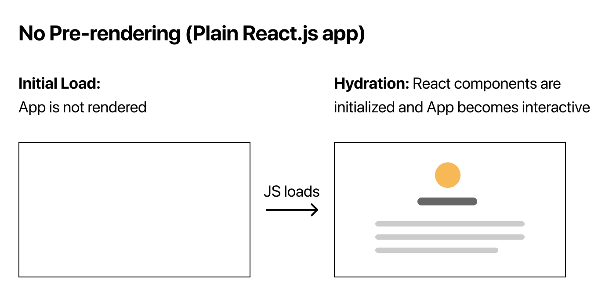
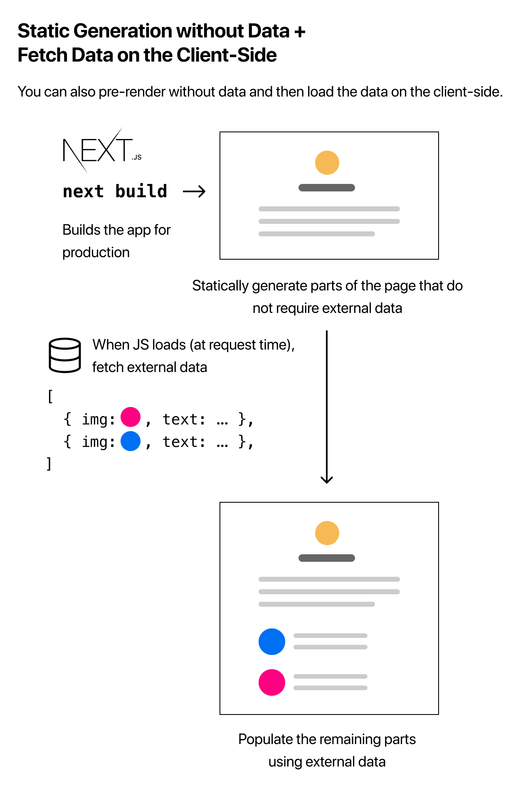

## Pre-rendering


Pre-rendering은 Next.js의 중요한 특징 중 하나입니다. Next.js는 클라이언트에서 HTML 생성을 모두 처리하기 보다는, 처음에 모든 페이지에 대한 HTML을 미리 생성하는데, 이것을 pre-rendering이라고 합니다. Pre-rendering 덕분에 Next.js는 SEO와 더불어 좋은 성능을 보입니다.

Pre-rendering 이후에는 hydration이라는 과정을 거칩니다. Hydration이란 브라우저가 페이지를 로딩할 때, 해당 페이지를 로딩하기 위해 필요한 최소한의 자바스크립트 코드만을 가져와 실행시켜서 미리 생성되어 있는 HTML을 interactive하게 만드는 과정을 말합니다.



만일 순수 리액트 코드로 작성된 애플리케이션의 경우, pre-rendering이 없기 때문에 페이지들의 HTML을 미리 생성하지 않습니다. 그래서 만일 순수 리액트 코드로 이루어진 애플리케이션의 자바스크립트 코드를 disabled 상태로 만든다면, 페이지 자체가 보이지 않게 됩니다. 반면, Next.js가 적용된 애플리케이션은 static HTML이 미리 생성된 덕분에 자바스크립트 기능을 제외한 페이지 자체는 보이게 됩니다.

​    

## Two forms of pre-rendering

Next.js의 pre-rendering은 Static Generation과 Server-side Rendering이라는 두 가지 형태가 존재합니다. 두 형태의 차이점은 언제 페이지에 대한 HTML이 생성되는가에 있습니다.


먼저, Static Generation은 build-time에 HTML을 생성하는 pre-rendering method입니다. 즉, 클라이언트의 request 이전에 HTML이 생성됩니다. 이렇게 pre-rendering된 HTML은 각각의 request에 요청될 때마다 재사용됩니다. Static Generation은 request에 상관없이 내용이 자주 바뀌지 않는 marketing page, blog post, E-commerce product listing, documentation 등에 유용합니다


이와 달리, Server-side Rendering은 각각의 request가 올 때마다 HTML을 생성하는 pre-rendering method입니다. 즉, 클라이언트의 request 후에 HTML이 생성되며, 생성된 HTML은 재사용되지 않습니다. Server-side Rendering은 빈번히 update되는 데이터 혹은 request마다 content가 바뀜으로 인해, request 이전에 pre-render하기 어려운 상황에서 유용합니다.

​    

> 참고로, 개발자 모드로 서버를 실행했을 때는 모든 페이지가 Server-side Rendering으로 pre-rendering됩니다. 심지어 Static Generation을 사용하는 페이지라고 하더라도 마찬가지입니다.

​    


Next.js는 각각의 페이지마다 위의 두 가지 형태 중 어떤 pre-rendering을 사용할지 선택할 수 있습니다. 따라서, Static Generation과 Server-side Rendering 방식이 혼합된 Next.js 애플리케이션을 만들 수 있습니다.

다만, 대부분의 경우에서는 Static Generation이 권장됩니다. 매 request 마다 HTML을 생성해야 하는 Server-side rendering에 비해, 한 번 HTML을 생성하고 재사용하는 Static Generation이 훨씬 빠르기 때문입니다. 만일 항상 최신 상태를 유지해야 하는 데이터를 처리할 경우, 느림을 감안하고서라도 Server-side Rendering을 사용하거나 pre-rendering을 생략하고 Client-side Rendering을 사용하는 것이 적합합니다.

​    

## Static Generation with and without data

Static Generation은 외부 데이터가 필요할 때 혹은 필요하지 않을 때 모두 사용할 수 있습니다. 외부적으로 데이터를 가져오지 않아도 되는 페이지들은 자동으로 Static Generation될 것입니다. 이와 달리, 처음에 반드시 데이터를 가져와야 하는 페이지의 경우, 빌드 시간에 파일 시스템에 접근하거나 외부 API 혹은 데이터베이스 등에 request를 해야만 합니다. 이러한 요청은 `getStaticProps`을 사용해 진행합니다.

```react
export default function Home(props) { ... }

export async function getStaticProps() {
  // Get external data from the file system, API, DB, etc.
  const data = ...

  // The value of the `props` key will be
  //  passed to the `Home` component
  return {
    props: ...
  }
}
```

비동기 함수 `getStaticProps` 안에서 실행하는 모든 것들은 빌드 타임에 진행되고, 요청을 통해 응답받은 데이터는 `props`의 형태로 데이터가 필요한 페이지 컴포넌트에 전달할 수 있습니다. 또한, `getStaticProps` 함수 내에 원하는 로직을 완성했다면, 페이지 컴포넌트를 export한 것과 마찬가지로 `getStaticProps` 함수도 export해주는 것을 유의해야 합니다.

​    

## `getStaticProps`에 대한 몇 가지 유의할 점

* `getStaticProps` 함수는 항상 server-side에서 실행됩니다. 즉, 브라우저에서 실행될 염려가 없기 때문에, 필요한 데이터를 가져오기 위해 데이터베이스에 쿼리를 날리는 것 역시 문제가 되지 않습니다. 

* 개발자 모드로 서버를 실행했다면, `getStaticProps`는 request가 있을 때마다 실행되는 Sever-side Rendering 방식으로 동작합니다. (`npm run dev`, `yarn dev`) 반면에, production용으로 서버가 실행되었다면, `getStaticProps` 함수는 원래 의도대로 빌드 시간에 실행됩니다.
* `getStaticProps` 함수는 항상 page 파일에서 export되어야 합니다. Non-page 파일에서 export 되어서는 안됩니다.

​    

## Server-side Rendering

만일 Server-side Rendering을 하고 싶다면, `getServerProps`를 사용합니다. CDN에 캐시되지 않아 `getStaticProps`보다는 느리겠지만, 최신의 정보를 request 때마다 가져올 수 있습니다.

```react
export async function getServerSideProps(context) {
  return {
    props: {
      // props for your component
    }
  }
}
```

`context` 매개변수를 사용하면, request와 관련된 매개변수들을 다룰 수 있습니다.

​    

## Client-side Rendering



만일 데이터 pre-rendering을 생략하고 싶다면, Client-side Rendering을 사용합니다. 페이지에서 외부적으로 데이터를 필요로하지 않는 부분만 Static Generation하고, 페이지의 나머지 부분은 client에서 자바스크립트를 사용해 데이터를 가져오면서 로딩할 수 있습니다. (Static Generation without data + Fetch data on the Client-Side)

​    

> 만일 client-side에서 데이터를 fetching하고 싶다면, Next.js에서 제공하는 리액트 훅 `SWR`을 사용할 것을 권장합니다. 다음은 `SWR`의 예시입니다.
>
> ```react
> import useSWR from 'swr'
> 
> function Profile() {
>   const { data, error } = useSWR('/api/user', fetch)
> 
>   if (error) return <div>failed to load</div>
>   if (!data) return <div>loading...</div>
>   return <div>hello {data.name}!</div>
> }
> ```

​    

## Reference

[Next.js Document](https://nextjs.org/learn/basics/navigate-between-pages)

