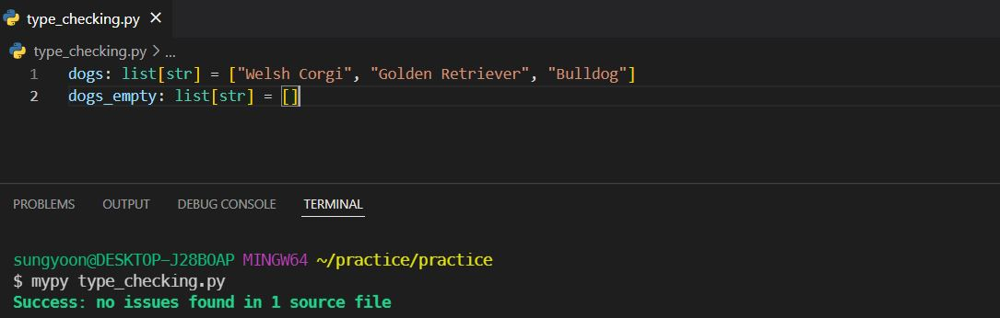

# Empty 자료형의 type annotation에 관하여

## Intro

Mypy와 친하게(?) 지내다보면 문득 어떤 type annotation를 줘야할지 모호한 경우가 왕왕 발생합니다. (안 발생한다면 mypy랑 베프인 분들 :thumbsup:) 그 중 재밌었던 부분은 빈 리스트 `[]`는 어떤 typing을 주어야할지에 대한 고민입니다. 보통 비어있다고 생각하면 typing 모듈의 `Optional`을 생각하게 되는데, 사실 약간 불편한 느낌이 있습니다. 예를 들어, `Optional[str]`은 `Union[str, None]`과 동일하며 그 의미는 "None을 허용한다"이므로, `list[Optional[str]]`는 리스트의 element로 `str`이 오거나 `None`이 올 수 있다는 말이 됩니다. 즉, `[None]`도 허용한다는 의미가 포함되게 됩니다.

그렇다면 `[None]`은 제외하고 순수하게 empty list `[]`만 허용하고 싶을 때는 어떻게 해야 할까요? 

결론만 이야기하면, `list[str]`으로 충분합니다. 굳이 `Optional`을 사용해 `[None]`의 경우까지 허용시킬 필요가 없습니다.

실제로 이것이 맞는지 PEP와 Mypy로 함께 확인해봅시다 :smiley:

​    

## Empty list의 타입

기본적인 `list` 타입은 위와 같이 선언할 수 있습니다. `list[str]`는 `str` 타입의 element로 구성된 리스트를 허용한다는 의미죠. Mypy로 체킹해봐도 `dogs: list[str] = ["Welsh Corgi", "Golden Retriever", "Bulldog"]`가 문제없이 허용됩니다.

`[]`도 허용하고 싶을 때는 어떻게 해야할까요? 

`list[Optional[str]]`은 `["Welsh Corgi", "Golden Retriever", "Bulldog"]`, `[None]`, `[]` 3가지 경우를 허용합니다. 보통 우리는 `[None]`에 대한 허용을 필요로 하지 않죠. 

따라서, 통상적인 의미의 빈 리스트를 허용 type annotation은 단순히 `list[str]`을 사용하면 됩니다. `list[str]`은 `["Welsh Corgi", "Golden Retriever", "Bulldog"]`, `[]` 2가지 경우를 허용합니다.

`list[int]`, `list[float]`, `list[bool]` 역시 동일하게 `[]`를 허용합니다.

​    

## Data type에 따른 분류

### 기본 자료형

기본 자료형의 경우는 `Optional`을 사용해주는 것이 본래 의도와 맞을 것입니다.

* `Optional[int]` example: `2`, `None`
* `Optional[float]` example: `3.14`, `None`
* `Optional[bool]` example: `True`, `None`

### 컬렉션 자료형

컬렉션 자료형의 경우, `Optional` 없이 본래의 타입을 사용하는 것이 의도에 맞을 것입니다.

* `list[str]` example: `[Welsh Corgi, 'Poodle']`, `[]`
* `dict[int, str]` example: `{1: "Barking", 2: "Running"}`, `{}`
* `set[int]` example: `{1, 2}`, `set()`

다만 튜플은 길이가 고정되는 자료형이기 때문에, 빈 튜플을 표현하거나 튜플의 길이를 가변적으로 표현하고 싶다면 다른 방법을 사용해야합니다.

* `tuple[int]` example: `(4,)`
* `tuple[()]` example: `()` (=empty tuple)
* `Union[tuple[()], tuple[int]]` example: `()`, `(4,)`
* `tuple[int, ...]` example: `()`, `(4,)`, `(3, 4, 5)` (=Arbitrary-length homogeneous tuple)

​    

## PEP 484 & Mypy docs

빈 자료형을 어떤 타입으로 표현해야 하는지만을 따로 설명한 챕터는 없습니다. 다만, 이에 대해 신빙성있게 명시된 부분들은 PEP 484 – Type Hints와 Mypy docs - Type inference and type annotations에서 직간접적으로 찾아볼 수 있습니다.

PEP 484의 type comments 설명을 보면, empty list를 어떤 타입으로 명시할 수 있는지가 간접적으로 드러나 있습니다.

PEP 484의 The typing Module 챕터에서는 empty tuple은 `tuple[()]`, arbitrary-length homogeneous tuple은 `tuple[int, ...]`를 사용하라고 명확히 설명해주었네요.

Mypy docs에서도 collection 자료형의 타입에 관하여 명시된 부분이 있습니다. 이에 따르면, empty list는 `list[int]`, empty dict는 `dict[str, int]`, empty set은 `set[int]` 등으로 표현 가능합니다.

​    

## Outro

Empty 자료형에 대해 온전히 설명하는 PEP가 있다면 좀 더 좋았을텐데라는 생각이 들지만, 한편으로는 여러 reference에서 이에 대한 증거들을 찾아가는 과정도 꽤 흥미로웠습니다. 

Empty 자료형은 type annotation을 조금 헷갈리게 할 수 있습니다. 하지만 충분히 직관적으로 타입을 표현할 수 있으니, 이를 염두해서 type annotation을 사용하면 좋을 것 같습니다 :)

​    

P.S. Tuple의 type annotation은 직관적인가...? 자료형에 특성에 따른 예외이니까 kindly하게 받아들여야겠다...!

​    

## Reference

[PEP 484 - Type hinting  #type-comments](https://peps.python.org/pep-0484/#type-comments)

[PEP 484 - Type hinting  #the-typing-module](https://peps.python.org/pep-0484/#the-typing-module)

[Mypy docs - Explicit types for collections](https://mypy.readthedocs.io/en/stable/type_inference_and_annotations.html#explicit-types-for-collections)