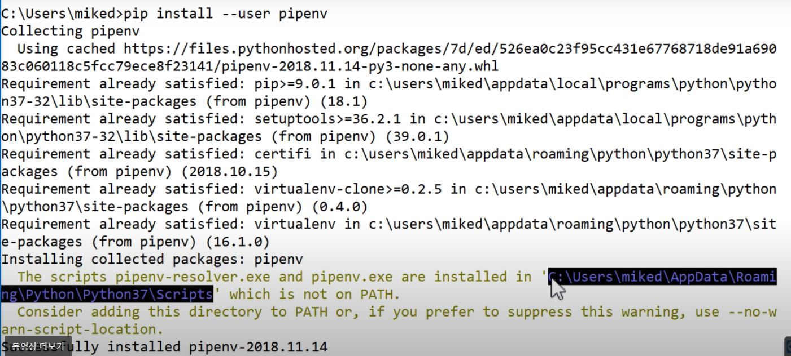

# pipenv로 가상환경 설정하기

## 가상환경이란?

* 가상 환경은 특정 버전 파이썬 설치와 여러 추가적인 패키지를 포함하는 독립된 디렉토리 트리입니다.

  > 파이썬 공식 문서 설명: https://docs.python.org/ko/3/tutorial/venv.html

* 여러가지 프로젝트를 진행하다보면 프로젝트마다 라이브러리와 파이썬의 버전이 달라지는데, 이를 각각 관리하기 위해 필요합니다.
* 협업에 있어서도 동일한 파이썬 환경을 공유하는데 도움이 됩니다.

## pipenv란?

* 패키지를 프로젝트 단위로 관리할 수 있도록 도와주는 고급 패키지 관리 도구입니다.
* 프로젝트 별로 격리된 가상 환경(virtual environment)과 프로젝트 단위의 패키지 관리 매커니즘을 제공합니다.
* Request 모듈로 잘 알려진 Kenneth Reitz(케네스 레이츠)가 만들었습니다.

## pipenv의 주요 특징

* 파이썬 패키지 라이브러리를 관리하는 pip와 가상환경 구축을 지원하는 virtualenv를 동시에 사용할 수 있습니다.
* Pipfile을 찾으면서 자동으로 프로젝트의 흠을 찾아줍니다.
* Pipfile과 Pipfile.lock을 통해 자동으로 최신 업데이트할 모듈 및 패키지와 버전을 고정할 모듈 및 패키지를 분류해 관리합니다.
* 패키지를 설치/삭제하면, 자동으로 Pipfile에서 추가/삭제합니다.
* 가상환경을 생성할 때, 필요한 python도 자동으로 설치합니다.

## pipenv 설치 과정 (Window)

* 내 필요에 맞는 로컬의 파이썬 버전을 업데이트합니다.

* pip 버전 확인하기
  * `pip --version`
  * 이 때 나오는 파이썬 버전이 python3인지(구체적으로는 내 필요에 맞는 파이썬 버전인지) 확인하고 진행합니다.
  
* pipenv 설치하기
  * `pip install --user pipenv`

* pipenv 환경변수 설정하기

  

  * `pip install --user pipenv` 코드 실행하면 어떤 주소를 환경변수에 추가하라는 메시지가 나오므로, 그대로 수행합니다.
    * 윈도우 시작메뉴 - 설정 - 검색 - '시스템 환경 변수 편집' - 환경 변수 - '\<username>에 대한 사용자 변수' 카테고리의 Path를 누르고 편집 버튼 누르기 - 새로만들기 - 주소 입력
    * 입력하는 주소는 아래의 2개와 같은 모습일 것입니다. (환경 변수를 추가하지 않은 상태에서 `pipenv`를 cmd에 입력하면 다음 주소를 환경변수에 추가하라는 메시지가 뜹니다.)
      * C:\Users\\\<username>\AppData\Roaming\Python\Python38\Scripts
      * C:\Users\\\<username>\AppData\Roaming\Python\Python38\site-packages
  * 터미널을 종료시키고 다시 실행합니다.
  * `pipenv --version` 코드로 버전을 확인하며, pipenv가 무사히 다운로드되었는지 체크합니다.

## pipenv 사용법

* 원하는 파이썬 버전으로 가상환경 만들기
  * `pipenv --python 3.7.5`
  * 프로젝트를 진행할 디렉토리에서 실행할 것을 유의합니다!
* 가상환경 활성화하기
  * `pipenv shell`
  * 가상 환경을 생성한 디렉토리에서 실행합니다.
* 특정한 패키지 다운로드 하기
  * `pipenv install <패키지이름>` - 최신 버전으로 다운로드
  * `pipenv install <패키지이름>==<버전>` - 지정된 버전으로 다운로드
  * 다운로드 후, Pipfile.lock 파일이 생성되거나 수정됩니다.
  * 해당 프로젝트의 디렉토리에서 실행합니다. (가상환경은 활성화되어도 안되어도 괜찮습니다.)
* 프로젝트에 사용되는 모든 패키지 다운 받기
  * `pipenv install`
  * Pipfile과 Pipfile.lock 파일이 있으면, 여기에 명시되어 있는 모든 패키지를 지정된 버전대로 한 번에 다운 받습니다.
* 가상환경 비활성화하기
  * `exit`
* 가상환경 삭제하기
  * `pipenv --rm`
  * 해당 가상환경이 활성화 되어있는 상태에서 실행합니다.
* 해당 프로젝트에서 사용하는 가상환경의 실제 위치 확인하기
  * `pipenv --venv`
  * 해당 프로젝트의 디렉토리에서 실행합니다. (가상환경은 활성화되어도 안되어도 괜찮습니다.)
* 해당 프로젝트에서 사용하는 파이썬 인터프리터의 실제 위치 확인하기
  * `pipenv --py`
  * 해당 프로젝트의 디렉토리에서 실행합니다. (가상환경은 활성화되어도 안되어도 괜찮습니다.)

## Pipfile과 Pipfile.lock

* Pipfile: 해당 프로젝트에서 1차적으로 필요한 패키지들만 포함합니다. 개발자는 새로운 패키지를 추가하거나 삭제할 때, Pipfile만 편집하면 됩니다.
* Pipfile.lock: 각각의 하위 패키지가 요구하는 패키지를 전부 포함합니다. 프로그램의 정상 동작을 보장하는 만큼의 상세한 패키지 정보는 Pipfile.lock 파일이 자동으로 관리합니다.

## Reference

[Pipenv 로 파이썬 가상환경 설정](https://velog.io/@doondoony/pipenv-101)

[pipenv 란 무엇인가](https://medium.com/@erish/python-pipenv-%EB%9E%80-%EB%AC%B4%EC%97%87%EC%9D%B8%EA%B0%80-961b00d4f42f)

[pipenv로 패키지 관리하기](https://www.daleseo.com/python-pipenv/)

[좌충우돌 pipenv 도입기](https://blog.crsd.team/post/769/)

