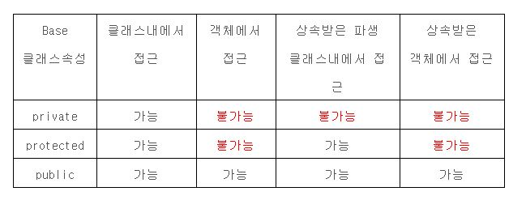

# 클래스 개념 조각 모음

## 클래스(Class)를 사용하는 이유

* 관련 있는 데이터를 묶기 위해 배열이, 데이터 묶음 요소마다 의미를 부여하기 위해 딕셔너리가, 의미를 확장해 다양한 정보와 동작들을 한데 묶어 표현하기 위해 클래스가 탄생했다.
* 보안상의 이슈를 다루기 위해 코드들을 바깥과 분리하여 감싸는 encapsulation 기능이 필요했다. 

​    

## _\_main__을 사용하는 이유

* C, C++ 같은 언어의 main 함수 영향을 받았다.
* 프로그램의 중심이 되는 코드들을 한 곳에 정리하기 위한 관리상 요인이 작용했다. (덕분에 프로그래밍의 시작점 파악이 용이)

​    

## 속성(Attribute)의 종류

* 인스턴스 속성

  * 인스턴스를 통해 접근할 수 있는 속성 (클래스 바깥에서는 `인스턴스.속성`, 클래스 내부에서는 `self.속성`으로 접근)

  * \__init__ 메서드 안에 정의한 속성

  * 인스턴스 별로 독립되어 있는 속성이며, 각 인스턴스가 값을 따로 저장해야 할 때 사용

  * 인스턴스를 생성한 후에도 자유롭게 속성을 추가할 수 있음

    * `인스턴스.속성` = something (방법 1)
    * 클래스 내 메서드에 속성을 정의하고, 인스턴스 생성 후 호출 (방법 2)

  * \__slots__ 메서드로 특정 속성만 추가를 허용하도록 지정 가능

    * `__slots__ = ['속성이름1, '속성이름2']` (속성 이름은 문자열로 지정)

      ``` python
      >>> class Person:
      ...     __slots__ = ['name', 'age']    # name, age만 허용(다른 속성은 생성 제한)
      ...
      >>> maria = Person()
      >>> maria.name = '마리아'                     # 허용된 속성
      >>> maria.age = 20                            # 허용된 속성
      >>> maria.address = '서울시 서초구 반포동'    # 허용되지 않은 속성은 추가할 때 에러가 발생함
      Traceback (most recent call last):
        File "<pyshell#32>", line 1, in <module>
          maria.address = '서울시 서초구 반포동'
      AttributeError: 'Person' object has no attribute 'address'
      ```

* 클래스 속성

  * 클래스에 바로 만든 속성

  * 클래스 내부, 클래스 바깥 모두에서 접근 가능하다. (언더스코어 2개를 사용해 비공개 속성으로도 만들 수 있음)

  * 모든 인스턴스가 공유하는 속성이며, 인스턴스 전체가 사용해야 하는 값을 저장할 때 사용

    ```python
    class Person:
        bag = []
     
        def put_bag(self, stuff):
            Person.bag.append(stuff)  # self.bag.append(stuff)라고 써도 되지만, 클래스 이름을 쓰는 것이 명확
     
    james = Person()
    james.put_bag('책')
     
    maria = Person()
    maria.put_bag('열쇠')
     
    print(james.bag)  # ['책', '열쇠']
    print(maria.bag)  # ['책', '열쇠']
    ```

  > **속성과 메서드 이름을 찾는 순서**
  >
  > 파이썬에서 속성, 메서드 이름을 찾을 때, 인스턴스, 클래스 순으로 찾는다. 위 예에서도 마치 인스턴스 속성을 사용한 것 같지만, 인스턴스 속성이 없으면 클래스 속성을 찾게 되므로 실제로 클래스 속성을 리턴한 것이다.
  >
  > 인스턴스나 클래스에서 \__dict__ 속성을 출력해보면 현재 인스턴스와 클래스의 속성을 딕셔너리로 확인할 수 있다.
  >
  > ```python
  > >>> james.__dict__
  > {}
  > >>> Person.__dict__
  > mappingproxy({'__module__': '__main__', 'bag': ['책', '열쇠'], 'put_bag': <function Person.put_bag at 0x028A32B8>, '__dict__': <attribute '__dict__' of 'Person' objects>, '__weakref__': <attribute '__weakref__' of 'Person' objects>, '__doc__': None})
  > ```

​     

## 메서드(Method)의 종류

* 인스턴스 메서드
  * 인스턴스를 통해 접근할 수 있는 메서드
  * 대부분의 일반적인 메서드에 해당되며 첫 번째 파라미터로 self를 지정하는 메서드 (self는 instance 그 자체를 받음)
* 정적 메서드
  * 인스턴스를 통하지 않고 클래스에서 바로 호출 가능
  
  * 메서드 위에 @staticmethod를 붙이고 파라미터로 self를 지정하지 않는 메서드
  
  * self를 받지 않기 때문에 인스턴스 속성에 접근할 수 없음
  
  * 그래서 보통 인스턴스 속성, 인스턴스 메서드가 필요없는 메서드, 인스턴스의 상태를 변화시키지 않는 순수함수를 만들 때 사용
  
    ```python
    class Calc:
        @staticmethod
        def add(a, b):
            print(a + b)
     
        @staticmethod
        def mul(a, b):
            print(a * b)
     
    Calc.add(10, 20)    # 클래스에서 바로 메서드 호출 / 30
    Calc.mul(10, 20)    # 클래스에서 바로 메서드 호출 / 200
    ```

* 클래스 메서드
  * 인스턴스를 통하지 않고 클래스에서 바로 호출 가능
  
  * 메서드 위에 @classmethod를 붙이고 첫번째 파라미터로 cls를 지정하는 메서드 (cls는 class 그 자체를 받음)
  
  * cls를 받기 때문에 클래스 속성, 클래스 메서드에 접근할 수 있음
  
  * 메서드 안에서 클래스 속성, 클래스 메서드에 접근하거나 메서드 안에서 현재 클래스의 인스턴스를 만들 때 사용
  
    ```python
    class Person:
        count = 0    # 클래스 속성
     
        def __init__(self):
            Person.count += 1    # 인스턴스가 만들어질 때
                                 # 클래스 속성 count에 1을 더함
     
        @classmethod
        def print_count(cls):
            print('{0}명 생성되었습니다.'.format(cls.count))    # cls로 클래스 속성에 접근
     
    james = Person()
    maria = Person()
     
    Person.print_count()    # 2명 생성되었습니다.
    ```

​    

## 비공개 속성과 비공개 메서드

* 비공개 속성 (Private Attribute)

  * 클래스 바깥에서는 접근할 수 없고 클래스 안에서만 사용할 수 있는 속성

  * 클래스 바깥에 드러내고 싶지 않은 값에 사용한다.

  * `__속성`으로 사용

    ```python
    class Person:
        def __init__(self, name, age, address, wallet):
            self.name = name
            self.age = age
            self.address = address
            self.__wallet = wallet    # 변수 앞에 __를 붙여서 비공개 속성으로 만듦
     
    maria = Person('마리아', 20, '서울시 서초구 반포동', 10000)
    maria.__wallet -= 10000    # 클래스 바깥에서 비공개 속성에 접근하면 에러가 발생함
    ```

  * 클래스 내 메서드에서는 접근 가능

    ``` python
    class Person:
        def __init__(self, name, age, address, wallet):
            self.name = name
            self.age = age
            self.address = address
            self.__wallet = wallet    # 변수 앞에 __를 붙여서 비공개 속성으로 만듦
     
        def pay(self, amount):
            self.__wallet -= amount   # 비공개 속성은 클래스 안의 메서드에서만 접근할 수 있음
            print('이제 {0}원 남았네요.'.format(self.__wallet))
     
    maria = Person('마리아', 20, '서울시 서초구 반포동', 10000)
    maria.pay(3000)
    ```

* 비공개 메서드 (Private Method)

  * 클래스 바깥에서는 접근할 수 없고 클래스 안에서만 사용할 수 있는 메서드

  * 클래스 바깥에 드러내고 싶지 않고 보통 내부에서만 호출되어야 할 때 사용한다.

  * `__메서드`로 사용

    ```python
    class Person:
        def __greeting(self):
            print('Hello')
     
        def hello(self):
            self.__greeting()    # 클래스 안에서는 비공개 메서드를 호출할 수 있음
     
    james = Person()
    james.__greeting()    # 에러: 클래스 바깥에서는 비공개 메서드를 호출할 수 없음
    ```

​    

## 파이썬 접근 제어

* 다른 언어와 달리 파이썬은 접근제어자 키워드가 따로 존재하지 않기 때문에 네이밍(naming)을 통해 접근 제어를 수행한다.

* 다만, 파이썬에서는 네이밍을 사용해 접근을 제어해도 **완벽하게 차단할 수는 없다**. 

* public, protected, private은 상황별로 다음과 같은 양상을 보인다.

  

* public

  * 언더스코어(_)없이 시작하는 속성, 메서드
  * 어디서나 접근 가능

* protected

  * 언더스코어 1개로 시작하는 속성, 메서드
  * 어디서나 접근 가능하지만, 암묵적 규칙에 의해 해당 클래스 내부와 파생 클래스에서만 접근해야 함 (파이썬은 protect 기능이 X)

* private

  * 언더스코어 2개로 시작하는 속성, 메서드
  * 해당 클래스 내부에서만 접근 가능

​    

## 주요 Dunder Method (=Magic method)

* \__repr__

  * 해당 class의 string representation을 설정

  * 객체를 출력하면 미리 설정된 사용자가 이해할 수 있는 문자열을 반환

  * self 파라미터 하나만 받고, 반드시 문자열을 리턴해야 한다.

    ``` python
    class Employee():
      def __init__(self, name):
        self.name = name
     
      def __repr__(self):
        return self.name
     
    argus = Employee("Argus Filch")
    print(argus)
    # prints "Argus Filch"
    ```

* \__add__

  * \+ 기호에 대응하는 메서드

  * 더하는 메서드로서 self 파라미터와 여기에 더할 인자 하나를 받는다.

    ```python
    class Color:
        def __init__(self, red, green, blue):
            self.red = red
            self.green = green
            self.blue = blue
     
     
        def __repr__(self):
            return "Color with RGB = ({red}, {green}, {blue})".format(red=self.red, green=self.green, blue=self.blue)
        
        
        def __add__(self, other):
            """
            Adds two RGB colors together
            Maximum value is 255
            """
            new_red = min(self.red + other.red, 255)
            new_green = min(self.green + other.green, 255)
            new_blue = min(self.blue + other.blue, 255)
     
            return Color(new_red, new_green, new_blue)
        
        
    red = Color(255, 0, 0)
    green = Color(0, 255, 0)
    blue = Color(0, 0, 255)
    
    
    # Color with RGB: (255, 0, 255)
    magenta = red + blue
     
    # Color with RGB: (0, 255, 255)
    cyan = green + blue
     
    # Color with RGB: (255, 255, 0)
    yellow = red + green
     
    # Color with RGB: (255, 255, 255)
    white = red + green + blue
    ```

* \__len__
  * len() 함수를 호출했을 때의 결과 값을 임의로 설정해 리턴할 수 있는 메서드
* \__iter__
  * iterator 객체를 반환해 반복가능한 객체로 만들어 주는 메서드

* \__contains__
  * 멤버 연산자 in을 사용할 수 있게 해주는 메서드

​    

## 클래스 관련 메서드

* 특정 클래스의 인스턴스인지 확인하기

  * `isinstance(인스턴스, 클래스)`
  * True, False 반환

* 해당 객체가 특정 속성을 가지고 있는지 여부 확인하기

  * `hasattr(객체, '속성')`

  * True, False 반환

    ```python
    hasattr(attributeless, "fake_attribute")
    # returns False
    ```

* 해당 객체에서 특정 속성의 값을 가져오기

  * `getattr(객체, '속성', default)`

  * 속성이 있으면 속성의 값 반환, 없으면 디폴트 값 반환

    ```python
    getattr(attributeless, "other_fake_attribute", 800)
    # returns 800, the default value
    ```

* 특정 클래스 A가 클래스 B의 subclass인지 확인하기
  * `issubclass(클래스 A, 클래스 B)`
  * True, False 반환

​    

## Reference

[파이썬 코딩 도장](https://dojang.io/course/view.php?id=7)

[Codecademy - learning python 3](https://www.codecademy.com/courses/learn-python-3)

[private, proteted, public 의 차이](https://blackcon.tistory.com/11)

[인스턴스 메소드의 종류와 용법 (Instance methods): Public, Protected, Private 접근제어자 (Access Modifiers)](https://oniondev.tistory.com/20)


