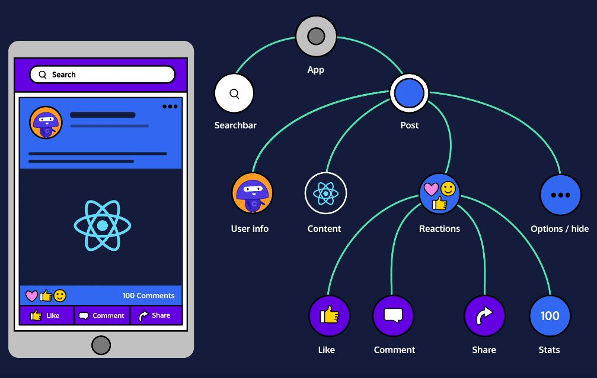

# Component interacting



React application은 몇 십에서 몇 백 개까지 component를 가질 수 있습니다. 각각의 작은 component들은 자신의 역할을 담당하면서 거대한 app을 구성하고 서로 상호작용함으로써 app을 동작시킵니다.

​    

> Component 간 상호 작용 유형
>
> 1. Component가 다른 component를 렌더링하는 것
> 2. Component가 다른 component에게 정보를 전달하는 것

​    

## A component in a render function

```jsx
class WelshCorgi extends React.Component {
  render() {
    return <h1>Welsh Corgi wooooow!</h1>;
  }
}
 
class Dog extends React.Component {
  render() {
    return <WelshCorgi />;
  }
}
```

Component 클래스의 `render()` 메서드는 HTML-like JSX expression 뿐만 아니라 component instance 형태의 JSX expression도 리턴할 수 있습니다.

```jsx
import React from 'react';
import ReactDOM from 'react-dom';


class WelshCorgi extends React.Component {
  render() {
    return <h1>Welsh Corgi wooooow!</h1>;
  }
}


class ProfilePage extends React.Component {
  render() {
    return (
      <div>
        <h1>All About Me!</h1>
        <p>I like Welsh Corgi!!!</p>
        <WelshCorgi />
      </div>
    );
  }
}
```

이러한 속성을 활용하면 하나의 component 안에서 다른 여러 개의 component를 함께 렌더링할 수 있습니다. 위의 `<WelshCorgi />` component 인스턴스는 `ProfilePage` component가 생성되면 그 안에서 렌더링됩니다. 따라서, `ReactDOM.render()`를 통해 `ProfilePage` 인스턴스 하나만 렌더링하면 내부에 있는 component들은 자동으로 함께 렌더링되게 됩니다.

Component 안에 다른 component가 포함되어 렌더링될 수 있다는 특징은 리액트의 강력한 장점입니다!

​    

## `Props`

부모 component가 자식 component에가 전달하는 정보가 담긴 객체를 `props`라고 합니다. 모든 component들은 자신의 `props`를 가지고 있으며, 이를 통해 부모 component로부터 전달받은 정보를 확인할 수 있습니다.

특정 component의 `props`를 보고 싶다면, `this.props`를 사용해 확인할 수 있습니다.

```jsx
<Greeting name="Frarthur" town="Flundon" age={2} haunted={false} myInfo={["top", "secret", "lol"]} />
```

Component에 prop을 추가하고 싶다면, 생성한 인스턴스에 속성으로 추가해주면 됩니다. 위의 코드는 `<Greeting />` component 인스턴스에 `name`, `town`, `age`, `haunted`, `myInfo` 등의 props를 부여한 것입니다.

이 때 만일 string이 아닌 정보를 주고 싶다면, `{}`로 정보를 감싸서 속성을 부여해야 한다는 점을 유의합시다.

이렇게 추가한 속성들은 `this.props.속성이름`을 통해 접근할 수 있습니다.

​    

## Event handler as prop

함수 역시 `props`로 넘길 수 있는데, 보통 event handler 함수가 이러한 특징을 활용해 prop으로 자주 전달됩니다.

```jsx
import React from 'react';
import ReactDOM from 'react-dom';


class Button extends React.Component {
  render() {
    return (
      <button onClick={this.props.talk}>
        Click me!
      </button>
    );
  }
}


class Talker extends React.Component {
  talk() {
    let speech = '';
    for (let i = 0; i < 10000; i++) {
      speech += 'blah ';
    }
    alert(speech);
  }
  
  render() {
    return <Button talk={this.talk} />;
  }
}

ReactDOM.render(
  <Talker />,
  document.getElementById('app')
);
```

Event handler는 `render()` 메서드와 비슷한 방식으로 임의의 이름의 메서드를 정의하고 필요한 component에 prop으로서 전달합니다.

​    

> **Naming convention of event handler**
>
> Event handler를 prop으로 전달할 때, 임의로 naming해야 할 부분이 두 군데 생깁니다. 이 때, 반드시 따를 필요는 없지만 통용되는 naming convention이 존재합니다.
>
> 첫 번째는 event handler 메서드를 정의할 때인데, 이벤트의 타입에 따라 handleClick, handleHover 등으로 사용합니다.
>
> 두 번째는 prop name인데, 이벤트 타입에 따라 onClick, onHover 등으로 정의합니다.
>
> ```jsx
> class MyClass extends React.Component {
>   handleHover() {
>     alert('I am an event handler.');
>     alert('I will listen for a "hover" event.');
>   }
>  
>   render() {
>     return <Child onHover={this.handleHover} />;
>   }
> }
> ```

​    

## `this.props.children`

모든 component들은 `props` 객체 내에 `children` property를 가집니다. 앞서 self-closing tag로 만들었던 component들은 사실 `<MyComponentClass></MyComponentClass>`로 나뉘어 쓰이는 것 역시 가능합니다. 이 경우, `this.props.children`은 나뉘어 쓰이는 태그 사이에 존재하는 모든 것을 리턴합니다.

```jsx
import React from 'react';
import ReactDOM from 'react-dom';


class List extends React.Component {
  render() {
    let titleText = `Favorite ${this.props.type}`;
    if (this.props.children instanceof Array) {
    	titleText += 's';
    }
    return (
      <div>
        <h1>{titleText}</h1>
        <ul>{this.props.children}</ul>
      </div>
    );
  }
}


class App extends React.Component {
  render() {
    return (
      <div>
        <List type='Dog'>
          <li>Welsh Corgi</li>
          <li>Dachshund</li>
        </List>
        <List type='Cat'>
          <li>Road cat</li>
        </List>
      </div>
    );
  }
}

ReactDOM.render(
  <App />, 
  document.getElementById('app')
);	
```

위 코드의 경우, `this.props.children`은 각각의 List component 사이에 있는 모든 `<li>` element들을 리턴합니다.

1. `<List type='Dog'>`의 경우

   ```jsx
   // return elements
   <li>Welsh Corgi</li>
   <li>Dachshund</li>
   ```

2. `<List type='Cat'>`의 경우

   ```jsx
   // return element
   <li>Road cat</li>
   ```

   

## `defaultProps`

```jsx
class Example extends React.Component {
  render() {
    return <h1>{this.props.text}</h1>;
  }
}
 
Example.defaultProps = { text: 'Welsh Corgi' }; 
```

만일 component 인스턴스에 요구되어지는 prop이 전달되지 않았을 때, 해당 prop은 화면에 아무것도 출력하지 않을 것입니다. 이 때, default 값을 prop에 지정해 화면에 항상 무언가가 출력될 수 있게 할 수 있습니다.

이를 위해 component 클래스의 `defaultProps` property를 사용합니다. `defaultProps` property에 원하는 `props`의 기본값들을 설정한 object를 지정하여 기본값 설정을 완료합니다.

​    

## `state`

축구 경기에서 각 팀의 스코어 정보처럼 변할 수 있는 정보를 dynamic information이라고 합니다. 리액트 component는 이러한 dynamic information을 다뤄야 할 때, `props`와 `state`를 사용합니다. 그 중, `state`란 각각의 component가 가지고 있는 상태를 저장한 것을 뜻하며, component 내부에서 관리됩니다. 렌더링 결과물에 영향을 주는 정보를 갖고 있다는 부분에서도 `props`와 공통점이 있습니다.

```jsx
class Example extends React.Component {
  constructor(props) {
    super(props);
    this.state = { mood: 'decent' };
  }
 
  render() {
    return <div></div>;
  }
}
 
<Example />
```

초기의 `state`는 `props`와 달리 component 클래스의 constructor에서 `state` property를 지정해 설정합니다. 또한, 각각의 component들은 스스로의 `state`를 가집니다.

모든 component는 `super()`를 통해 항상 초기화 시켜야 합니다. 이후, `state`에 적절한 객체를 할당해 initial state를 설정합니다.

```jsx
class TodayImFeeling extends React.Component {
  constructor(props) {
    super(props);
    this.state = { mood: 'decent' };
  }
 
  render() {
    return (
      <h1>
        I'm feeling {this.state.mood}!
      </h1>
    );
  }
}
```

Component 클래스 내에서 `state`에 접근하고 싶다면 `this.state.name-of-property` 형태로 접근합니다. 위의 `this.state.mood`는 'decent' 값에 접근합니다.

​    

## `this.setState()`

Component의 현재 `state`를 바꾸고 싶다면, `this.setState()` 메서드를 사용합니다. `setState()`는 변경 요소가 담긴 객체를 첫 번째 인자로 받아 사용합니다.

```jsx
{
  mood:   'great',
  hungry: false
}
```

현재 `state`의 상황이 위와 같다고 가정해봅시다.

```jsx
this.setState({ hungry: true });
```

그리고 `setState()`를 사용해 `hungry` 상태를 변경합니다.

```jsx
{
  mood:   'great',
  hungry: true
}
```

그 결과 위와 같이 `hungry` 상태만 `true`로 변경되었습니다. `setState`는 기본적으로 인자로 받은 객체에 담긴 요소들만 접근해 값을 변경하고 다른 원래의 요소들은 그대로 둡니다.

​    

> **`setState()`와 `render()`**

`setState()` 메서드에서 유의할 점은 이 메서드가 `state`를 변경한 후 자동적으로 `.render()` 메서드까지 호출한다는 부분입니다. 즉, `setState()`를 사용하면 `state`를 변경한 부분이 바로 화면에 반영됩니다. 따라서, `setState()`는 `render()` 메서드 안에서 호출되면 안됩니다. 이를 지키지 않으면 서로 끊임없이 호출하는 무한 루프에 빠지게 됩니다.

​    

## Reference

[Learn React - Codecademy](https://www.codecademy.com/courses/react-101)