## 로그 추적기 도입 과정
- 목표: `Controller`, `Service`, `Repository`에 변경을 최소화하여 로그 추적기 적용하기
- 로그 추적기 기본 구현
	- `TraceId`
		```java
		public class TraceId {
		    
		    private String id;
		    private int level;
		    
		    public TraceId() {
		         this.id = createId();
		         this.level = 0;
			}
			
		    private TraceId(String id, int level) {
		        this.id = id;
		        this.level = level;
		    }
		    
		    private String createId() {
		        return UUID.randomUUID().toString().substring(0, 8);
		    }
		         
		    public TraceId createNextId() {
		        return new TraceId(id, level + 1);
			}
			
		    public TraceId createPreviousId() {
		        return new TraceId(id, level - 1);
			}
		    
		    public boolean isFirstLevel() {
		        return level == 0;
			}
			
		    public String getId() {
		        return id;
			}
			
		    public int getLevel() {
		        return level;
			}
		
		}
		```
	- `TraceStatus`
		```java
		public class TraceStatus {
		    
		    private TraceId traceId;
		    private Long startTimeMs;
		    private String message;
		    
		    public TraceStatus(TraceId traceId, Long startTimeMs, String message) {
		        this.traceId = traceId;
		        this.startTimeMs = startTimeMs;
		        this.message = message;
			}
		    
		    public Long getStartTimeMs() {
		        return startTimeMs;
			}
			
		    public String getMessage() {
		        return message;
			}
		    public TraceId getTraceId() {
		        return traceId;
			}
		
		}
		```
	- `Trace` - 실제 로그 생성 및 처리
		```java
		@Slf4j
		@Component
		public class Trace {
		     
		    private static final String START_PREFIX = "-->";
		    private static final String COMPLETE_PREFIX = "<--";
		    private static final String EX_PREFIX = "<X-";
		    
		    public TraceStatus begin(String message) {
		        TraceId traceId = new TraceId();
		        Long startTimeMs = System.currentTimeMillis();
		        log.info("[{}] {}{}", traceId.getId(), addSpace(START_PREFIX, traceId.getLevel()), message);
		        return new TraceStatus(traceId, startTimeMs, message);
		    }
		     
		    public void end(TraceStatus status) {
			    complete(status, null);
		    }
		    
		    public void exception(TraceStatus status, Exception e) {
		        complete(status, e);
			}
		    
		    private void complete(TraceStatus status, Exception e) {
		        Long stopTimeMs = System.currentTimeMillis();
		        long resultTimeMs = stopTimeMs - status.getStartTimeMs();
		        TraceId traceId = status.getTraceId();
		        if (e == null) {
		            log.info("[{}] {}{} time={}ms", traceId.getId(), addSpace(COMPLETE_PREFIX, traceId.getLevel()), status.getMessage(), resultTimeMs);
		        } else {
		            log.info("[{}] {}{} time={}ms ex={}", traceId.getId(), addSpace(EX_PREFIX, traceId.getLevel()), status.getMessage(), resultTimeMs, e.toString());
				}
			}
			
		    private static String addSpace(String prefix, int level) {
		        StringBuilder sb = new StringBuilder();
		        for (int i = 0; i < level; i++) {
		            sb.append( (i == level - 1) ? "|" + prefix : "|   ");
		        }
		        return sb.toString();
		    }
		}
		```
	- 주요 `public` 메서드
		- `begin()`
		- `end()`
		- `exception()`
- 1단계: 단순 적용
	```java
	@GetMapping("/v1/request")
	public String request(String itemId) {
		TraceStatus status = null;
		try {
			status = trace.begin("OrderController.request()");
			orderService.orderItem(itemId);
			trace.end(status);
			return "ok";
		} catch (Exception e) { 
			trace.exception(status, e);
			throw e; //예외를 꼭 다시 던져주어야 한다.
		}
	}
	```
	- 해결 해야할 문제
		- **공통 로직 처리** 중복 문제 (부가 기능 코드가 너무 많음)
			- **모든 컨트롤러, 서비스, 레포지토리** 핵심 로직 앞 뒤로 로그 코드를 넣어야 함 (**수작업**)
				- `begin()`, `end()`, `exception()`, `try~catch` 문
			- 로그 때문에 예외가 사라지지 않도록 **예외를 다시 던져주어야 함**
		- 로그에 대한 **문맥 정보 전달** 문제: 직전 로그 깊이와 트랜잭션 ID 전달 필요 (`TraceId`)
			- **HTTP 요청 구분** 필요 (같은 HTTP 요청이면 같은 트랜잭션 ID 남겨야 함)
			- **메서드 호출 깊이 표현** 필요 (Level)
- 2단계: 파라미터 이용한 동기화 개발
	- **문맥 정보 전달 문제 해결**
		- `Trace` 클래스에 `beginSync` 메서드 추가
			```java
			public TraceStatus beginSync(TraceId beforeTraceId, String message) {
			    TraceId nextId = beforeTraceId.createNextId();
			    Long startTimeMs = System.currentTimeMillis();
			    log.info("[" + nextId.getId() + "] " + addSpace(START_PREFIX, nextId.getLevel()) + message);
			    return new TraceStatus(nextId, startTimeMs, message);
			}
			```
		- `TraceId`를 서비스, 레포지토리 메서드 파라미터에 추가
			- `public void orderItem(TraceId traceId, String itemId) {}`
			- `public void save(TraceId traceId, String itemId) {}`
		- 각각 `TraceId` 전달해 `beginSync` 호출
	- 해결해야할 문제
		- **공통 로직 처리** 중복 문제 (부가 기능 코드가 너무 많음)
			- **모든 컨트롤러, 서비스, 레포지토리** 핵심 로직 앞 뒤로 로그 코드를 넣어야 함 (**수작업**)
				- `begin()`, `end()`, `exception()`, `try~catch` 문
			- 로그 때문에 예외가 사라지지 않도록 **예외를 다시 던져주어야 함**
		- `TraceId` 동기화를 위해 **모든 관련 메서드 파라미터를 수정**해야함 (**수작업**)
- 3단계: 필드를 이용한 동기화
	- **모든 관련 메서드 파라미터 수정 문제 해결**
		- `traceIdHolder` 필드로 `TraceId` 동기화하는 `LogTrace` 구현체 개발
			```java
			@Slf4j
			public class FieldLogTrace implements LogTrace {
			     
			    private static final String START_PREFIX = "-->";
			    private static final String COMPLETE_PREFIX = "<--";
			    private static final String EX_PREFIX = "<X-";
			
				private TraceId traceIdHolder; //traceId 동기화, 동시성 이슈 발생
			    
			    @Override
			    public TraceStatus begin(String message) {
			        syncTraceId();
			        TraceId traceId = traceIdHolder;
			        ...
			        return new TraceStatus(traceId, startTimeMs, message);
				}
			    ...
			    
			    private void complete(TraceStatus status, Exception e) {
			        ...
			        releaseTraceId();
			    }
			    
			    private void syncTraceId() {
			        if (traceIdHolder == null) {
			            traceIdHolder = new TraceId();
			        } else {
			            traceIdHolder = traceIdHolder.createNextId();
			        }
				}
			    
			    private void releaseTraceId() {
			        if (traceIdHolder.isFirstLevel()) {
			            traceIdHolder = null; //destroy
			        } else {
			            traceIdHolder = traceIdHolder.createPreviousId();
					}
				}
			    ...
			
			}
			```
		- 구현체 스프링 빈 등록하면, 파라미터 전달 코드 필요 X
	- 해결해야 할 문제
		- **공통 로직 처리** 중복 문제 (부가 기능 코드가 너무 많음)
			- **모든 컨트롤러, 서비스, 레포지토리** 핵심 로직 앞 뒤로 로그 코드를 넣어야 함 (**수작업**)
				- `begin()`, `end()`, `exception()`, `try~catch` 문
			- 로그 때문에 예외가 사라지지 않도록 **예외를 다시 던져주어야 함**
		- **동시성 문제**: **여러 쓰레드가 동시에** 같은 인스턴스의 필드 값을 **변경**하면서 발생하는 문제
			- **싱글톤 스프링 빈** `FieldLogTrace` 인스턴스는 **애플리케이션에 딱 1개** 존재
			- 동시에 여러 사용자가 요청하면, **여러 스레드가 `traceIdHolder` 필드에 동시 접근**
			- 트래픽이 적은 상황에서는 확률상 잘 나타나지 않고, **트래픽이 많아질수록 자주 발생**
- 4단계: 필드 동기화 - **스레드 로컬(ThreadLocal)** 적용
	- **싱글톤 객체 필드**를 사용할 때 **동시성 문제 해결**
		- `traceIdHolder` 필드가 스레드 로컬을 사용하도록 변경
			- `TraceId traceIdHolder` -> **`ThreadLocal<TraceId> traceIdHolder`**
			- `private ThreadLocal<TraceId> traceIdHolder = new ThreadLocal<>();`
		- 값을 저장할 때는 `set(...)`, 조회할 때는 `get()` 사용
			- `traceIdHolder.set(new TraceId());`
			- `TraceId traceId = traceIdHolder.get();`
		- 호출 추적 로그 완료 시, 반드시 **`remove()`** 호출 (**스레드 전용 보관소 내 값 제거**)
	- 해결해야 할 문제
		- **공통 로직 처리** 중복 문제 (부가 기능 코드가 너무 많음)
			- **모든 컨트롤러, 서비스, 레포지토리** 핵심 로직 앞 뒤로 로그 코드를 넣어야 함 (**수작업**)
				- `begin()`, `end()`, `exception()`, `try~catch` 문
			- 로그 때문에 예외가 사라지지 않도록 **예외를 다시 던져주어야 함**
- 5단계: **템플릿 메서드 패턴** 적용
	- **공통 로직 처리 중복 문제 해결**
		- **변하지 않는 부가 기능** 로직을 템플릿 코드로 **분리**
			```java
			public abstract class AbstractTemplate<T> {
			    
			    private final LogTrace trace;
			    
			    public AbstractTemplate(LogTrace trace) {
			        this.trace = trace;
				}
			    
			    public T execute(String message) {
			        TraceStatus status = null;
			        try {
						status = trace.begin(message); //로직 호출
			            T result = call();
			            trace.end(status);
			            return result;
			        } catch (Exception e) {
			            trace.exception(status, e);
						throw e;
					}
				}
				
			    protected abstract T call();
			}
			```
		- **변하는 핵심 로직**을 자식 클래스로 **분리** (컨트롤러, 서비스, 레포지토리)
			```java
			@GetMapping("/v4/request")
			public String request(String itemId) {
			
			    AbstractTemplate<String> template = new AbstractTemplate<>(trace) {
			        @Override
					protected String call() {
						orderService.orderItem(itemId);
						return "ok";
					}
				};
				return template.execute("OrderController.request()");
			}
			```
	- 결과적으로, **변경 지점을 하나**로 모아 **변경에 쉽게 대처할 수 있는 구조** 만듦
		- 로그를 남기는 부분에 **단일 책임 원칙(SRP)을 지킴**
	- 해결해야 할 문제
		- 상속에서 오는 문제 (자식과 부모의 강결합, 자식 클래스 매 번 만들고 오버라이딩하는 복잡함)
- 6단계: **템플릿 콜백 패턴** 적용
	- **상속에서 오는 문제 해결**
		- `TraceCallback` 인터페이스 - **콜백**
			```java
			public interface TraceCallback<T> {
			    T call();
			}
			```
		- `TraceTemplate` - **템플릿**
			```java
			public class TraceTemplate {
			
				private final LogTrace trace;
			    
			    public TraceTemplate(LogTrace trace) {
			        this.trace = trace;
				}
			    
			    public <T> T execute(String message, TraceCallback<T> callback) {
			        TraceStatus status = null;
			        try {
						status = trace.begin(message); //로직 호출
			            T result = callback.call();
			            trace.end(status);
			            return result;
			        } catch (Exception e) {
			            trace.exception(status, e);
						throw e;
					}
				}
				
			}
			```
		- 컨트롤러, 서비스, 레포지토리에 템플릿 실행 코드 적용
			```java
			@RestController
			public class OrderControllerV5 {
			    
			    private final OrderServiceV5 orderService;
			    private final TraceTemplate template;
			    
			    public OrderControllerV5(OrderServiceV5 orderService, LogTrace trace) {
			        this.orderService = orderService;
			        this.template = new TraceTemplate(trace);
				}
				
				// 람다로도 전달 가능
			    @GetMapping("/v5/request")
			    public String request(String itemId) {
			        return template.execute("OrderController.request()", new
			 TraceCallback<>() {
			            @Override
			            public String call() {
			                orderService.orderItem(itemId);
			                return "ok";
			            }
					}); 
				}
			}
			```
			- **`this.template = new TraceTemplate(trace)`**
				- 생성자에서 `trace` 의존관계 주입을 받음과 동시에 Template 생성
					- 장점: **테스트 시 한 번에 목으로 대체**할 수 있어 **간단**
						- **`Template` 류 테스트에 적합**
						- 테스트 시 스프링 빈 등록할 때 다 만들어서 진행하는게 더 불편
				- 물론 처음부터 `TraceTemplate`을 스프링 빈으로 등록하고 주입 받을 수도 있음!
				- 또한, 모든 컨트롤러, 서비스, 레포지토리에 하더라도 **이 정도 객체 생성은 낭비 아님**
	- 해결해야 할 문제
		- 로그 추적기 도입 위해 **결국 원본 코드(컨트롤러, 서비스, 레포지토리) 수정해야 하는 문제**
			- **코드로 최적화**할 수 있는건 **최대치**로 완료!
- 6.5단계: 프록시 도입 예정 (데코레이터 패턴)
	- **원본 코드 수정 문제 해결** (프록시 + DI)
	- 해결해야 할 문제: **너무 많은 프록시 클래스를 만들어야 함** 
- 7단계: 동적 프록시 도입 (JDK 동적 프록시, 인터페이스가 있으므로)
	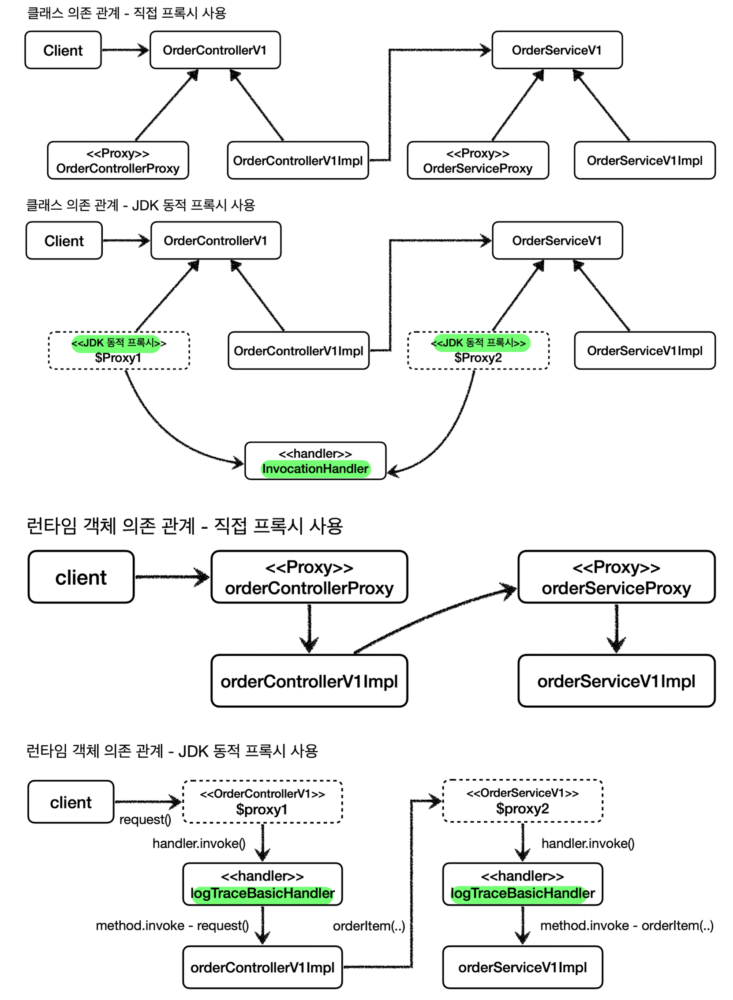
	- **원본 코드 수정** 및 **프록시 클래스 다량 수작업 문제 해결** + 메서드 마다 **선택적 적용** 기능 추가
		- `LogTraceBasicHandler` - `InvocationHandler` 상속
			```java
			public class LogTraceBasicHandler implements InvocationHandler {
			    
			    private final Object target;
			    private final LogTrace logTrace;
			    private final String[] patterns; //패턴을 통한 적용 필터링
			    
			    public LogTraceBasicHandler(Object target, LogTrace logTrace) {
			        this.target = target;
			        this.logTrace = logTrace;
			        this.patterns = patterns;
				}
			
				@Override
			    public Object invoke(Object proxy, Method method, Object[] args) throws Throwable {
			        
			        //메서드 이름 필터
					String methodName = method.getName();
					if (!PatternMatchUtils.simpleMatch(patterns, methodName)) {
						return method.invoke(target, args);
					}
			        
			        TraceStatus status = null;
			        try {
			            String message = method.getDeclaringClass().getSimpleName() + "."
			                    + method.getName() + "()";
						status = logTrace.begin(message); 
						
						//로직 호출
			            Object result = method.invoke(target, args);
			            
			            logTrace.end(status);
			            return result;
			        } catch (Exception e) {
			            logTrace.exception(status, e);
			            throw e;
					}
				}
			
			}
			```
		- 동적 프록시 스프링빈 등록
			```java
			@Configuration
			public class DynamicProxyBasicConfig {
				
				private static final String[] PATTERNS = {"request*", "order*", "save*"}; // 메서드 이름 필터링 패턴
				
			    @Bean
			    public OrderControllerV1 orderControllerV1(LogTrace logTrace) {
			        OrderControllerV1 orderController =
				        new OrderControllerV1Impl(orderServiceV1(logTrace));
			        
			        OrderControllerV1 proxy = (OrderControllerV1) Proxy.newProxyInstance(OrderControllerV1.class.getClassLoader(),
			            new Class[]{OrderControllerV1.class},
			            new LogTraceBasicHandler(orderController, logTrace, PATTERNS)
			        );
					return proxy;
			    }
			
				@Bean
				public OrderServiceV1 orderServiceV1(LogTrace logTrace) {
			        OrderServiceV1 orderService = 
				        new OrderServiceV1Impl(orderRepositoryV1(logTrace));
			        
			        OrderServiceV1 proxy = (OrderServiceV1) Proxy.newProxyInstance(OrderServiceV1.class.getClassLoader(),
			            new Class[]{OrderServiceV1.class},
			            new LogTraceBasicHandler(orderService, logTrace, PATTERNS)
					);
			        return proxy;
			    }
			    
			    @Bean
			    public OrderRepositoryV1 orderRepositoryV1(LogTrace logTrace) {
			        OrderRepositoryV1 orderRepository = new OrderRepositoryV1Impl();
			        
			        OrderRepositoryV1 proxy = (OrderRepositoryV1) Proxy.newProxyInstance(OrderRepositoryV1.class.getClassLoader(),
			            new Class[]{OrderRepositoryV1.class},
			            new LogTraceBasicHandler(orderRepository, logTrace, PATTERNS)
					);
			        return proxy;
			    }
			}
			```
	- 해결해야 할 문제
		- **인터페이스 없이 클래스만 있는 경우** 동적 프록시 **적용 불가**
		- 메서드 마다 부가기능 **선택적 적용** 기능 자동화
- 8단계: 프록시 팩토리 적용
	- **인터페이스 유무 상관없이 동적 프록시 생성**
		- **`Advice`** 정의
			```java
			@Slf4j
			public class LogTraceAdvice implements MethodInterceptor {
				
				private final LogTrace logTrace;
				
				public LogTraceAdvice(LogTrace logTrace) {
					this.logTrace = logTrace;
				}
				 
				@Override
				public Object invoke(MethodInvocation invocation) throws Throwable {
					
					TraceStatus status = null;
					
					try {
						Method method = invocation.getMethod();
						String message = method.getDeclaringClass().getSimpleName() + "."
								+ method.getName() + "()";
						
						status = logTrace.begin(message);
						
						//로직 호출
						Object result = invocation.proceed();
						
						logTrace.end(status);
						return result;
					} catch (Exception e) {
						logTrace.exception(status, e);
						throw e;
					}
				}
			}
			```
		- **프록시 팩토리** 사용해 프록시 생성 후 **스프링 빈 등록**
			```java
			@Slf4j
			@Configuration
			public class ProxyFactoryConfigV1 {
			    
			    @Bean
			    public OrderControllerV1 orderControllerV1(LogTrace logTrace) {
			        OrderControllerV1 orderController = new OrderControllerV1Impl(orderServiceV1(logTrace));
			        
			        ProxyFactory factory = new ProxyFactory(orderController);
			        factory.addAdvisor(getAdvisor(logTrace));
			        OrderControllerV1 proxy = (OrderControllerV1) factory.getProxy();
			        return proxy;
				}
			
				@Bean
			    public OrderServiceV1 orderServiceV1(LogTrace logTrace) {
			        OrderServiceV1 orderService = new OrderServiceV1Impl(orderRepositoryV1(logTrace));
			        
			        ProxyFactory factory = new ProxyFactory(orderService);
			        factory.addAdvisor(getAdvisor(logTrace));
			        OrderServiceV1 proxy = (OrderServiceV1) factory.getProxy();
			        return proxy;
				}
				
			    @Bean
			    public OrderRepositoryV1 orderRepositoryV1(LogTrace logTrace) {
			        OrderRepositoryV1 orderRepository = new OrderRepositoryV1Impl();
			        
			        ProxyFactory factory = new ProxyFactory(orderRepository);
			        factory.addAdvisor(getAdvisor(logTrace));
			        OrderRepositoryV1 proxy = (OrderRepositoryV1) factory.getProxy();
			        return proxy;
				}
				
			    private Advisor getAdvisor(LogTrace logTrace) {
			        //pointcut
			        NameMatchMethodPointcut pointcut = new NameMatchMethodPointcut();
			        pointcut.setMappedNames("request*", "order*", "save*");
			        //advice
			        LogTraceAdvice advice = new LogTraceAdvice(logTrace);
			        //advisor = pointcut + advice
			        return new DefaultPointcutAdvisor(pointcut, advice);
			    }
			
			}
			```
			- **어디에 부가기능을 적용할지는 포인트컷으로 조정**
				- `NameMatchMethodPointcut`의 심플 매칭 기능 활용해 `*` 패턴 사용
			- 어드바이저 = 
			  포인트컷(`NameMatchMethodPointcut`) + 어드바이스(`LogTraceAdvice`)
			- 인터페이스가 있기 때문에 **프록시 팩토리가 JDK 동적 프록시를 적용**
				- 물론, 구체 클래스만 있을 때는 **프록시 팩토리가 CGLIB을 적용**
	- 해결해야 할 문제
		- 스프링 빈 수동 등록 시 **너무 많은 설정 (설정 지옥)** 발생
			- 프록시 팩토리로 프록시 생성하는 코드를 포함해 **설정 파일 및 코드가 너무 많음**
		- **컴포넌트 스캔** 시 현재 방법으로는 **프록시 적용 불가**
			- 컴포넌트 스캔 시 **실제 객체**는 스프링 컨테이너 스프링 빈으로 **이미 등록을 다 해버린 상태**
- 9단계: 빈 후처리기 적용
	- **컴포넌트 스캔 포함 모든 스프링 빈 등록에 프록시 적용** + **설정 파일 프록시 생성 코드 반복 해결**
		- 프록시 변환을 위한 빈후처리기 (`PackageLogTraceProxyPostProcessor`)
			```java
			@Slf4j
			public class PackageLogTraceProxyPostProcessor implements BeanPostProcessor {
			    
			    private final String basePackage;
			    private final Advisor advisor;
			    
			    public PackageLogTraceProxyPostProcessor(String basePackage, Advisor advisor) {
			        this.basePackage = basePackage;
			        this.advisor = advisor;
			    }
			    
			    @Override
			    public Object postProcessAfterInitialization(Object bean, String beanName) throws BeansException {
			        
					//프록시 적용 대상 여부 체크
					//프록시 적용 대상이 아니면 원본을 그대로 반환
					String packageName = bean.getClass().getPackageName(); 
					if (!packageName.startsWith(basePackage)) {
			            return bean;
			        }
					
					//프록시 대상이면 프록시를 만들어서 반환
					ProxyFactory proxyFactory = new ProxyFactory(bean);
					proxyFactory.addAdvisor(advisor);
			        
			        Object proxy = proxyFactory.getProxy();
			        return proxy;
			    }
			}
			```
			- 특정 패키지와 그 하위에 위치한 스프링 빈들만 프록시를 적용
			- 즉, 스프링 부트의 수많은 기본 등록 빈들을 제외하고 필요한 빈만 프록시 적용
				- 스프링 부트 제공 빈은 `final` 클래스 등 프록시 만들 수 없는 빈이 있음
		- 빈후처리기 스프링 빈 등록
			```java
			@Slf4j
			@Configuration
			@Import({AppV1Config.class, AppV2Config.class})
			public class BeanPostProcessorConfig {
				@Bean
			    public PackageLogTraceProxyPostProcessor logTraceProxyPostProcessor(LogTrace logTrace) {
			        return new PackageLogTraceProxyPostProcessor("hello.proxy.app", getAdvisor(logTrace));
				}
				
			    private Advisor getAdvisor(LogTrace logTrace) {
			        //pointcut
			        NameMatchMethodPointcut pointcut = new NameMatchMethodPointcut();
			        pointcut.setMappedNames("request*", "order*", "save*");
			        //advice
			        LogTraceAdvice advice = new LogTraceAdvice(logTrace);
			        //advisor = pointcut + advice
			        return new DefaultPointcutAdvisor(pointcut, advice);
			    }
			}
			```
		- 프록시 적용 결과
			- v1: 인터페이스가 있으므로 JDK 동적 프록시가 적용
			- v2: 구체 클래스만 있으므로 CGLIB 프록시가 적용
			- v3: 구체 클래스만 있으므로 CGLIB 프록시가 적용 (**컴포넌트 스캔**)
## 스레드 로컬(ThreadLocal)
- 일반적인 공유 변수 필드 (문제)
	- **여러 스레드**가 같은 인스턴스의 필드에 접근하면 **처음 스레드가 보관한 데이터가 사라질 수 있음**
- **스레드 로컬 필드** (**해결**)
	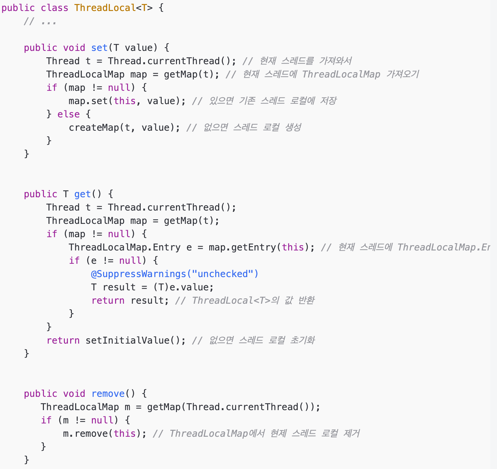
	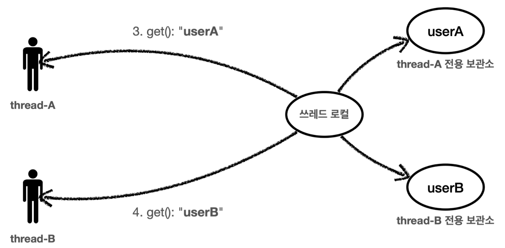
	- **각 스레드마다 제공**되는 **별도의 내부 저장소** (**본인 스레드만 접근 가능**)
		- **여러 스레드**가 **같은 인스턴스의 스레드 로컬 필드에 접근**해도 **문제 X**
			- 정말 **완전히 동시에 들어와도 구분** 가능
		- **각각의 스레드 객체**는 자신만의 **`ThreadLocalMap`** 을 가짐 (**전용 보관소**)
			- 키: `ThreadLocal` 인스턴스 참조 (e.g. `nameStore`) / 값: 데이터 (e.g. `userA`)
			- 참고로 스레드 로컬 저장소와 이에 보관된 데이터들은 힙 영역에 저장됨
	- 스프링 빈 같은 **싱글톤 객체 필드**를 사용하면서도 **동시성 문제 해결 가능**
		- **일반적으로** Controller, Service **싱글톤 빈**들에는 **상태값 필드를 두지 않음** (동시성 문제 예방)
		- **상태값을 저장해야 하는 경우**에만 **스레드 로컬**로 해결
	- **`java.lang.ThreadLocal`** 클래스 (자바 지원)
		- 변수 정의: `private ThreadLocal<String> nameStore = new ThreadLocal<>();`
		- 저장: `nameStore.set(name);`
		- 조회: `nameStore.get()`
		- 제거: `nameStore.remove()`
	- 그림 시나리오
		- `thread-A`가 `userA` 값 **저장** 시 **스레드 로컬**은 `thread-A` 전용 보관소에 데이터 보관
		- `thread-B`가 `userB` 값 **저장** 시 **스레드 로컬**은 `thread-B` 전용 보관소에 데이터 보관
		- `thread-A`가 **조회** 시 **스레드 로컬**은 `thread-A` 전용 보관소에서 `userA` 데이터 반환
		- `thread-B`가 **조회** 시 **스레드 로컬**은 `thread-B` 전용 보관소에서 `userB` 데이터 반환
	- 유의사항
		- 스레드는 스레드 로컬 **사용완료** 후 **스레드 로컬에 저장된 값을 항상 제거해야 함** (**`remove()`**)
			- 스레드 전용 보관소가 아니라 **스레드 전용 보관소 내 값 제거**
			- 즉, **요청이 끝날 때**
				- **필터나 인터셉터에서 clear**하거나
				- **최소한 `ThreadLocal.remove()` 반드시 호출할 것**
		- **제거하지 않을 경우 문제** 발생
			- **스레드 풀 없는 상황**에서는 가비지 컬렉터가 회수할 수 없어 **메모리 누수 발생 가능**
			- **WAS(톰캣)**처럼 **스레드 풀 사용하는 경우 문제** 발생!
				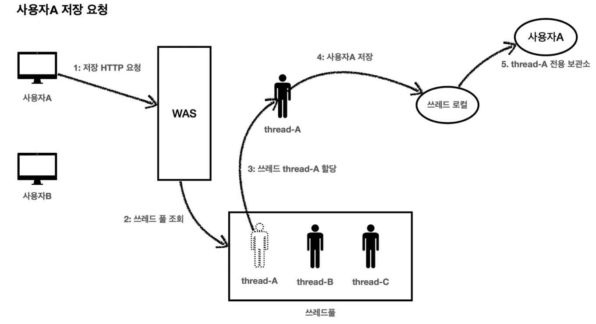
				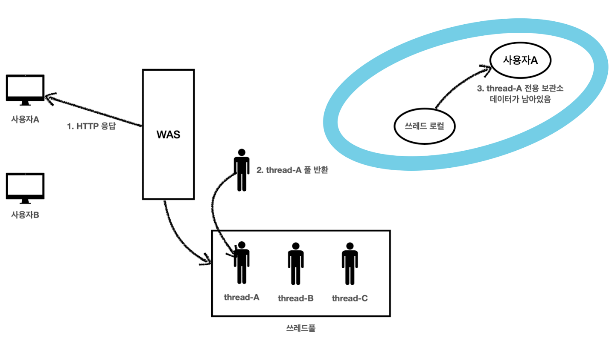
				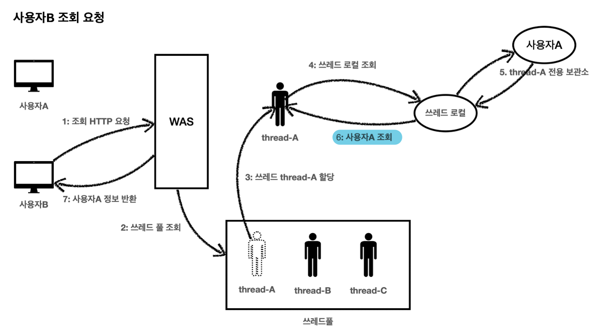
				- `thread-A`가 풀에 반환될 때, `thread-A` **전용 보관소에 데이터 남아있음**
				- 스레드 풀 스레드는 **재사용**되므로, 사용자 B 요청도 `thread-A` 할당 받을 수 있음
				- 결과적으로, **사용자B가 사용자A의 데이터를 확인**하게 되는 **심각한 문제**가 발생
				- 따라서, 사용자A의 **요청이 끝날 때 `remove()` 필요**
## 템플릿 메서드 패턴
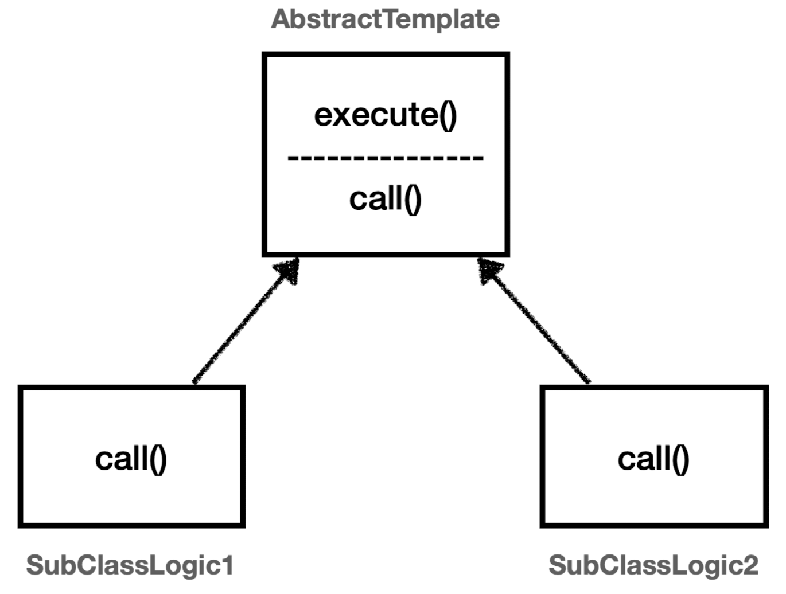
- **다형성**(**상속**)을 사용해서 **변하는 부분**과 **변하지 않는 부분**을 **분리**하는 방법
- **변하지 않는 템플릿 코드**를 **부모 클래스**에, **변하는 부분**은 **자식 클래스**에 두고 **상속**과 **오버라이딩**으로 처리
- GOF 디자인패턴 정의: "작업에서 알고리즘의 **골격**을 정의하고 **일부 단계를 하위 클래스로 연기**합니다"
- 장점
	- **변경 지점을 하나**로 모아 **변경에 쉽게 대처할 수 있는 구조** (SRP, **단일 책임 원칙** 지킴)
- 단점 (From **상속**)
	- **부모의 기능을 전혀 사용하지 않는데도** 자식이 부모를 **상속**해 **강결합**됨 (**잘못된 의존관계 설계**)
		- **부모 클래스 수정** 시, **자식 클래스도 영향** 받음
	- 핵심 로직 추가 시 **자식 클래스(익명 내부 클래스)를 계속 만들고 오버라이딩**해야 하는 **복잡함** 
- 예시 코드
	- `AbstractTemplate`
		```java
		@Slf4j
		public abstract class AbstractTemplate {
			
			public void execute() {
				long startTime = System.currentTimeMillis(); //비즈니스 로직 실행
				
				call(); //상속
				
				//비즈니스 로직 종료
				long endTime = System.currentTimeMillis(); 
				long resultTime = endTime - startTime; 
				log.info("resultTime={}", resultTime);
			}
			
		    protected abstract void call();
		}
		```
	- `SubClassLogic1`
		```java
		@Slf4j
		public class SubClassLogic1 extends AbstractTemplate {
		    @Override
		    protected void call() {
			    log.info("비즈니스 로직1 실행");
			}
		}
		```
	- `SubClassLogic2`
		```java
		@Slf4j
		public class SubClassLogic2 extends AbstractTemplate {
		    @Override
		    protected void call() {
				log.info("비즈니스 로직2 실행");
			}
		}
		```
	- 실행 코드 1
		```java
		AbstractTemplate template1 = new SubClassLogic1();
		template1.execute();
		AbstractTemplate template2 = new SubClassLogic2();
		template2.execute();
		```
	- 실행 코드 2 - 익명 내부 클래스 사용하기
		```java
		AbstractTemplate template1 = new AbstractTemplate() {
		    @Override
			protected void call() {
				log.info("비즈니스 로직1 실행");
			}
		};
		template1.execute();
		AbstractTemplate template2 = new AbstractTemplate() {
		    @Override
			protected void call() {
				log.info("비즈니스 로직2 실행");
			}
		};
		template2.execute();
		```

>핵심 기능: 해당 객체가 제공하는 고유 기능 e.g. 주문 로직
>부가 기능: 핵심 기능을 보조하기 위해 제공되는 기능 (단독 사용 X) e.g. 로그 추적 기능, 트랜잭션 기능

## 전략 패턴
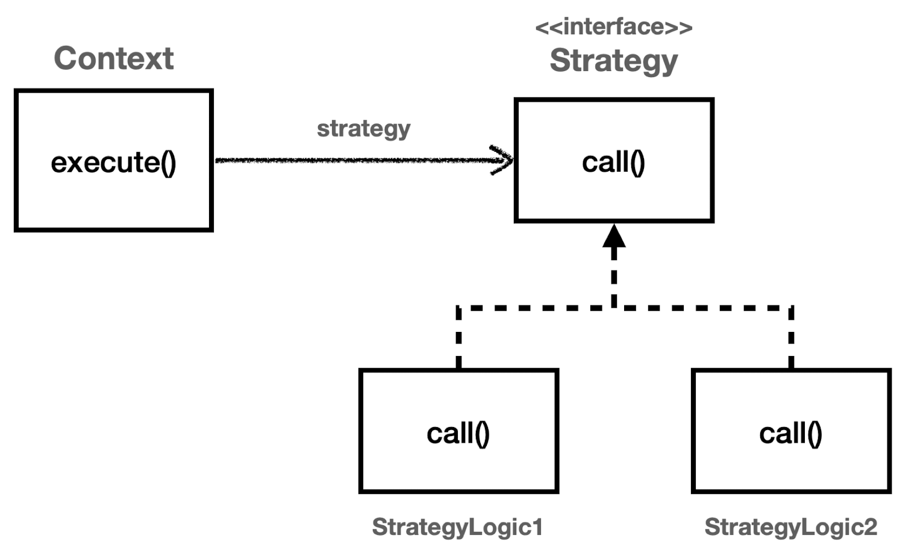
- **다형성**(**위임**)을 통해 **변하는 코드**와 **변하지 않는 코드**를 **분리**
- **변하지 않는 부분**을 **`Context`** 라는 곳에 두고, **변하는 부분**은 **`Strategy`** **인터페이스를 구현**해 처리
	- **`Context`** 는 **변하지 않는 템플릿** 역할
	- **`Strategy`** 는 **변하는 알고리즘** 역할
- GOF 디자인 패턴 정의
	- "**알고리즘** 제품군을 정의하고 각각을 **캡슐화**하여 **상호 교환** 가능하게 만들자."
	- "전략을 사용하면 알고리즘을 사용하는 **클라이언트와 독립적으로 알고리즘을 변경**할 수 있다."
- 전략(`Strategy`) 전달 방법
	- 전략을 생성자로 받아 **내부 필드**로 저장하기
		- `Context` 안에 내부 필드에 **원하는 전략을 주입**해 **조립 완료 후 실행** (Setter 두지 않음)
		- **선 조립, 후 실행 방법**에 적합
			- 전략 신경쓰지 않고 단순히 실행만 하면 됨 (`Context` 실행 시점에는 이미 조립이 끝남)
	- 전략을 `execute` 메서드의 **파라미터**로 받기 - 로그 추적기 구현에 적합
		- **실행할 때 마다 전략을 유연하게 변경 가능**
		- 단점은 실행할 때마다 신경써야 하는 번거로움
- 장점 (템플릿 메서드 패턴 상위 호환)
	- 템플릿 메서드 패턴의 **상속이 가져오는 단점 제거**
		- 템플릿 메서드 패턴: 부모 클래스가 변경되면 자식들이 영향 받음
		- 전략 패턴: **`Context` 코드가 변경**되어도 **전략들에 영향 X**
	- `Context`는 `Strategy` 인터페이스에만 의존해, **구현체를 변경 및 생성**해도 **`Context`에 영향 없음**
- 예시 코드
	- `Strategy`
		```java
		public interface Strategy {
		    void call();
		}
		```
	- `StrategyLogic1`
		```java
		@Slf4j
		public class StrategyLogic1 implements Strategy {
		    @Override
		    public void call() {
				log.info("비즈니스 로직1 실행");
			}
		}
		```
	- `StrategyLogic2`
		```java
		@Slf4j
		public class StrategyLogic2 implements Strategy {
		    @Override
		    public void call() {
				log.info("비즈니스 로직2 실행");
			}
		}
		```
	- `Context` - 전략 내부 필드 보관
		```java
		@Slf4j
		public class Context {
		
			private Strategy strategy; // 필드에 전략을 보관
			
			public Context(Strategy strategy) {
				this.strategy = strategy;
			}
			
			public void execute() {
				long startTime = System.currentTimeMillis(); 
				//비즈니스 로직 실행
				strategy.call(); //위임
				//비즈니스 로직 종료
				long endTime = System.currentTimeMillis();
				long resultTime = endTime - startTime;
				log.info("resultTime={}", resultTime);
			}
		
		}
		```
	- 실행 코드 1
		```java
		Strategy strategyLogic1 = new StrategyLogic1();
		ContextV1 context1 = new ContextV1(strategyLogic1);
		context1.execute();
		
		Strategy strategyLogic2 = new StrategyLogic2();
		ContextV1 context2 = new ContextV1(strategyLogic2);
		context2.execute();
		```
	- 실행 코드 2 - 익명 내부 클래스 사용하기
		```java
		Strategy strategyLogic1 = new Strategy() {
		    @Override
		    public void call() {
				log.info("비즈니스 로직1 실행"); 
			}
	    };
	    Context context1 = new Context(strategyLogic1);
	    context1.execute();
	    
	    Strategy strategyLogic2 = new Strategy() {
	        @Override
			public void call() { 
				log.info("비즈니스 로직2 실행");
			}
		};
	    Context context2 = new Context(strategyLogic2);
	    context2.execute();
		```
	- 실행 코드 3 - 람다 사용하기
		```java
		Context context1 = new Context(() -> log.info("비즈니스 로직1 실행"));
		context1.execute();
		
		Context context2 = new Context(() -> log.info("비즈니스 로직2 실행"));
		context2.execute();
		```
	- `ContextV2` - 전략 파라미터 전달
		```java
		@Slf4j
		public class ContextV2 {
			public void execute(Strategy strategy) {
				long startTime = System.currentTimeMillis(); 
				//비즈니스 로직 실행
				strategy.call(); //위임
				//비즈니스 로직 종료
				long endTime = System.currentTimeMillis(); 
				long resultTime = endTime - startTime;
				log.info("resultTime={}", resultTime);
		    }
		}
		```
	- 실행 코드 4 - 파라미터 전달 버전 `ContextV2` 실행
		```java
		ContextV2 context = new ContextV2();
		context.execute(new StrategyLogic1());
		context.execute(new StrategyLogic2());
		```

>**템플릿 메서드 패턴**과 **전략 패턴**
>
>**두 패턴 모두 동일한 문제를 다룬다.** (**변하는 부분과 변하지 않는 부분을 분리하기**)
>또한, **두 패턴**은 **코드 조각(변하는 부분) 전달하기**를 **동일한 목적**으로 둔다. 다음과 같이 정리할 수 있다.
>
>코드 조각 전달하기 **패턴**
>- 생성자 주입하기 (전략 패턴)
>- 파라미터로 전달하기 (전략 패턴)
>- 상속 활용하기 (템플릿 메서드 패턴)
>
>코드 조각 전달하기 **방법**
>- 클래스 정의 후 생성 (`new`)
>- 익명 클래스로 전달
>- 람다로 전달
>  
>  다만, **디자인 패턴**은 모양보다는 **의도가 중요**하다. 예를 들어, 전략 패턴이라는 의도를 담고 있으면 생성자 주입으로도 파라미터 주입으로도 구현할 수 있다.

## 템플릿 콜백 패턴
- 콜백(Callback)
	- **다른 코드의 인수**로서 넘겨주는 **실행 가능한 코드**
	- 콜백을 넘겨받는 코드는 이 **콜백을 필요에 따라 즉시 실행**할 수도 있고, **나중에 실행**할 수도 있음
	- 즉, 코드가 호출(`call`)은 되는데 코드를 넘겨준 곳의 뒤(`back`)에서 실행된다는 뜻
		- `ContextV2` 예제에서 콜백은 `Strategy`
		- 클라이언트에서 직접 `Strategy` 를 실행하는 것이 아니라, 클라이언트가 `ContextV2.execute(..)` 를 실행할 때 `Strategy` 를 넘겨주고, `ContextV2` 뒤에서 `Strategy` 가 실행됨
- **스프링**에서는 **파라미터 전달 방식의 전략 패턴**을 **템플릿 콜백 패턴**이라 지칭
	- **`Context`** 는 **템플릿**, **`Strategy`** 는 **콜백**
- GOF 패턴 X, **스프링 내부에서 자주 사용되는 패턴**이어서 **스프링에서만 이렇게 부름**
	- 스프링 내 **`XxxTemplate`** 은 **템플릿 콜백 패턴**으로 만들어진 것
	- e.g. `JdbcTemplate` , `RestTemplate` , `TransactionTemplate` , `RedisTemplate` ...
- 예시 코드
	- **파라미터 전달 전략 패턴**(`ContextV2`)과 **동일**하고 **이름만 다름**
		- `Context` -> **`Template`**
		- `Strategy` -> **`Callback`**
	- `Callback`
		```java
		public interface Callback {
		    void call();
		}
		```
	- `Template`
		```java
		@Slf4j
		public class TimeLogTemplate {
			public void execute(Callback callback) {
				long startTime = System.currentTimeMillis(); 
				//비즈니스 로직 실행
				callback.call(); //위임
				//비즈니스 로직 종료
				long endTime = System.currentTimeMillis(); 
				long resultTime = endTime - startTime; 
				log.info("resultTime={}", resultTime);
			}
		}
		```
	- 실행 코드 1 - 익명 내부 클래스 사용하기
		```java
		TimeLogTemplate template = new TimeLogTemplate();
		
		template.execute(new Callback() {
		    @Override
			public void call() { 
				log.info("비즈니스 로직1 실행");
			} 
		});
		
		template.execute(new Callback() {
		    @Override
		    public void call() { 
			    log.info("비즈니스 로직2 실행");
			}
		});
		```
	- 실행 코드 2 - 람다 사용하기
		```java
		TimeLogTemplate template = new TimeLogTemplate(); 
		template.execute(() -> log.info("비즈니스 로직1 실행")); 
		template.execute(() -> log.info("비즈니스 로직2 실행"));
		```

>**자바 언어에서 콜백**
>
>자바 언어에서 **실행 가능한 코드**를 **인수**로 넘기려면 **객체가 필요**하다. 자바8부터는 **람다**를 사용할 수 있다. 
>자바 8 이전에는 보통 하나의 메서드를 가진 인터페이스를 구현하고, 주로 익명 내부 클래스를 사용했다. 
>**최근에는 주로 람다를 사용**한다.

## 프록시 (Proxy)
- 클라이언트가 **간접적으로 서버에 요청**할 때 중간에서 역할하는 **대리자**(**Proxy**)
	- 클라이언트 -> 서버 (직접 호출)
	- 클라이언트 -> **프록시** -> 서버 (**간접 호출**)
- 프록시 개념은 **클라이언트-서버**라는 **큰 개념 아래서 폭넓게 사용** (규모 차이)
	- e.g. 객체 개념의 프록시, 웹 서버 개념의 프록시
- 특징
	- **서버**와 **프록시**는 **같은 인터페이스** 사용 (DI를 통한 대체 가능)
		- **실제 객체(서버) 코드**와 **클라이언트 코드 변경 없이** 유연하게 서버 대신 **프록시 주입** 가능
		- **클라이언트**는 서버에게 요청한 것인지 프록시에게 요청한 것인지 **모름**
	- **프록시 객체**는 **내부에 실제 객체의 참조값**을 가짐 (최종적으로 실제 객체 호출해야하므로)
		- 프록시 패턴에서의 실제 객체 명칭: **`target`**
		- 데코레이터 패턴에서의 실제 객체 명칭: `component`
	- **프록시 체인** 가능
		- **클라이언트**는 요청 후 여러 프록시가 여러 번 호출되어도 **모름**
- 중간 프록시 객체의 **이점**
	- **접근 제어**: 권한에 따른 접근 차단, 캐싱, 지연 로딩
	- **부가 기능 추가**: e.g. 요청 값/응답 값을 중간에 변형, 실행 시간 측정 로그 추가

>프록시 패턴 & 데코레이터 패턴
>
>**모두 프록시를 사용**하는 **GOF 디자인 패턴**이다. 둘은 **의도에 따라 구분**한다.
>
>프록시 패턴: **접근 제어**가 목적
>데코레이터 패턴: **부가 기능 추가**가 목적

## 프록시 패턴 (Proxy Pattern)
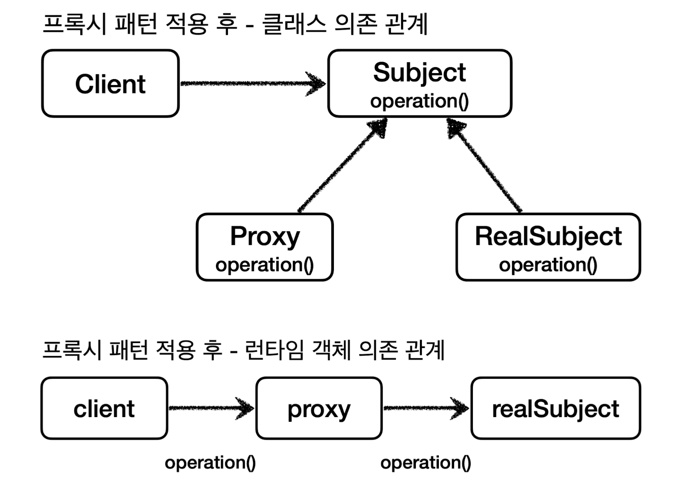
- **접근 제어**를 목적으로 **프록시**를 사용하는 패턴
	- e.g. **권한**에 따른 **접근 차단**, **캐싱**, 지연 로딩
- 핵심: **실제 객체 코드**와 **클라이언트 코드**를 **전혀 변경하지 않**고 **프록시 도입만으로 접근 제어**함
- 예시 코드
	- `Subject` 인터페이스
		```java
		public interface Subject {
		    String operation();
		}
		```
	- `ProxyPatternClient`
		```java
		public class ProxyPatternClient {
		    
		    private Subject subject;
		    
		    public ProxyPatternClient(Subject subject) {
		        this.subject = subject;
			}
			
		    public void execute() {
		        subject.operation();
		    }
		
		}
		```
	- `RealSubject` - **target** (e.g. 호출할 때마다 시스템에 큰 부하를 주는 데이터 조회)
		```java
		@Slf4j
		public class RealSubject implements Subject {
		    @Override
		    public String operation() {
				log.info("실제 객체 호출"); 
				sleep(1000); //1초 걸림
				return "data";
			}
		    
		    private void sleep(int millis) {
		        try {
		            Thread.sleep(millis);
		        } catch (InterruptedException e) {
		            e.printStackTrace();
		        }
			}
		}
		```
	- **`CacheProxy`** - **Proxy** (캐싱 통한 조회 성능 향상)
		```java
		@Slf4j
		public class CacheProxy implements Subject {
			
			private Subject target; // 실제 객체
		    private String cacheValue; // 캐시값
		    
		    public CacheProxy(Subject target) {
		        this.target = target;
			}
			
		    @Override
		    public String operation() {
				log.info("프록시 호출");
				if (cacheValue == null) {
		            cacheValue = target.operation();
		        }
		        return cacheValue;
		    }
		}
		```
	- `ProxyPatternTest`
		```java
		public class ProxyPatternTest {
		    
		    @Test
		    void noProxyTest() {
				RealSubject realSubject = new RealSubject();
				ProxyPatternClient client = new ProxyPatternClient(realSubject);
			    client.execute(); // 1초
			    client.execute(); // 1초
			    client.execute(); // 1초
			}
		    
		    @Test
		    void cacheProxyTest() {
		        Subject realSubject = new RealSubject();
		        Subject cacheProxy = new CacheProxy(realSubject);
		        ProxyPatternClient client = new ProxyPatternClient(cacheProxy);
		        client.execute(); // 1초
		        client.execute(); // 0초
		        client.execute(); // 0초
			}
			
		}
		```

>캐싱: : **처음 조회 결과값(`cacheValue`)을 보관**해 **다음 조회**를 **매우 빠르게** 만드는 **성능 향상** 기법

## 데코레이터 패턴 (Decorator Pattern)
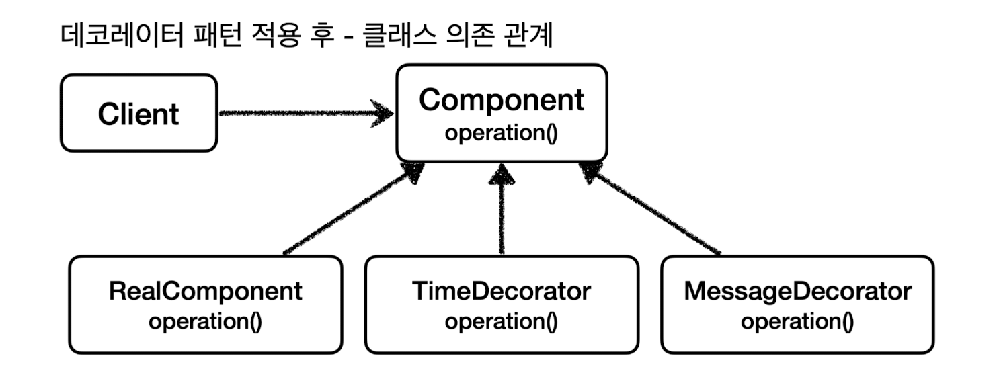
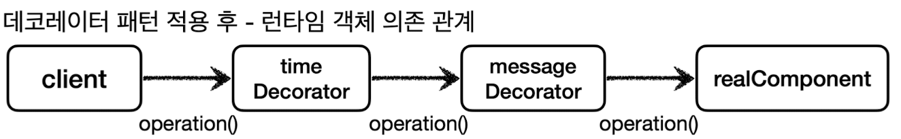
- **부가 기능 추가**를 목적으로 **프록시**를 사용하는 패턴
	- e.g. 요청 값/응답 값을 중간에 변형, 실행 시간 측정 로그 추가
- 핵심: **실제 객체 코드**와 **클라이언트 코드**를 **전혀 변경하지 않**고 **프록시 도입만으로 부가 기능 추가**
- 참고: GOF 데코레이터 패턴 기본예제
	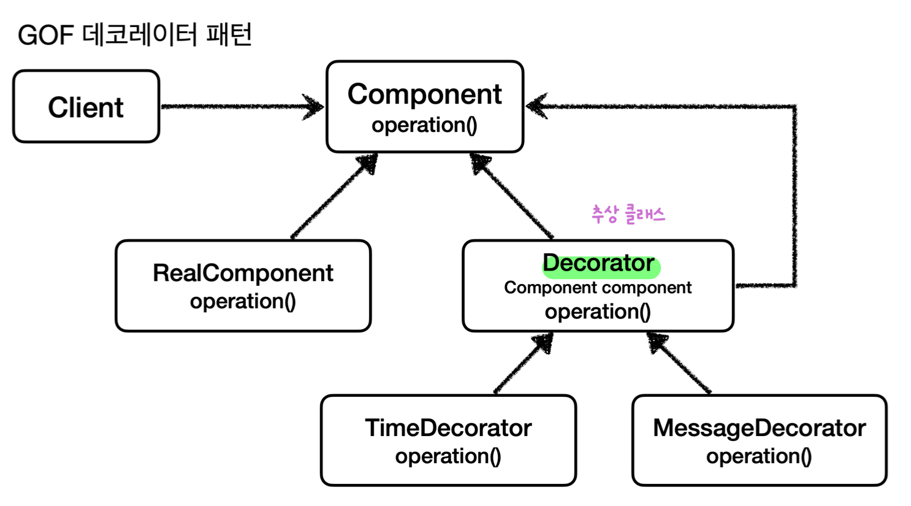
	- GOF에서는 **`Decorator` 추상 클래스**를 통해 **내부 `component` 중복까지 해결**
		- 데코레이터들이 내부에 호출 대상인 `component`를 가지고 항상 호출하는 부분이 계속 중복
		- 따라서, **`component` 속성**을 가지고 있는 **`Decorator` 추상 클래스** 도입
		- 효과: **내부 중복 해결** + **클래스 다이어그램**에서 **실제 컴포넌트와 데코레이터 구분 가능**
- 예시 코드
	- `Component` 인터페이스
		```java
		public interface Component {
		    String operation();
		}
		```
	- `DecoratorPatternClient`
		```java
		@Slf4j
		public class DecoratorPatternClient {
		    
		    private Component component;
		
			public DecoratorPatternClient(Component component) {
		        this.component = component;
			}
		    
		    public void execute() {
		        String result = component.operation();
		        log.info("result={}", result);
			}
		}
		```
	- `RealComponent` - component (**실제 객체**)
		```java
		@Slf4j
		public class RealComponent implements Component {
		    @Override
		    public String operation() {
				log.info("RealComponent 실행");
		        return "data";
		    }
		}
		```
	- **`MessageDecorator`** - **Proxy** (부가 기능 추가, 응답값 변형)
		```java
		@Slf4j
		public class MessageDecorator implements Component {
		    
		    private Component component;
		    
		    public MessageDecorator(Component component) {
		        this.component = component;
			}
			
		    @Override
		    public String operation() {
				log.info("MessageDecorator 실행");
				String result = component.operation();
				String decoResult = "*****" + result + "*****";
				log.info("MessageDecorator 꾸미기 적용 전={}, 적용 후={}", result, decoResult);
		        return decoResult;
		    }
		}
		```
	- **`TimeDecorator`** - **Proxy** (부가 기능 추가, 호출 시간 측정)
		```java
		@Slf4j
		public class TimeDecorator implements Component {
		
			private Component component;
		    
		    public TimeDecorator(Component component) {
		        this.component = component;
			}
			
		    @Override
		    public String operation() {
				log.info("TimeDecorator 실행");
				long startTime = System.currentTimeMillis();
				
		        String result = component.operation();
		        
				long endTime = System.currentTimeMillis();
				long resultTime = endTime - startTime; 
				log.info("TimeDecorator 종료 resultTime={}ms", resultTime); 
				return result;
			}
		}
		```
	- `DecoratorPatternTest`
		```java
		public class DecoratorPatternTest {
			@Test
			void decorator() {
			    Component realComponent = new RealComponent();
			    Component messageDecorator = new MessageDecorator(realComponent);
			    Component timeDecorator = new TimeDecorator(messageDecorator);
			    DecoratorPatternClient client = new DecoratorPatternClient(timeDecorator);
			    client.execute();
			}
		}
		```

## 상황에 따른 로그 추적기 프록시 적용법
- 결론
	- **프록시 적용**은 **인터페이스가 있든 없든 모두 대응**할 수 있어야 함
		- 인터페이스가 있는 편이 상속 제약에서 벗어나 프록시 적용하기 편리
		- 다만, 실용적인 관점에서 인터페이스를 안 만드는 경우도 있고 이에 대응할 수 있어야 함
	- **동적 프록시**를 적용해야 함
		- 만들어야 할 프록시 수가 너무 많음
		- 똑같은 로직 적용인데 대상 클래스마다 프록시를 만들어야 함 
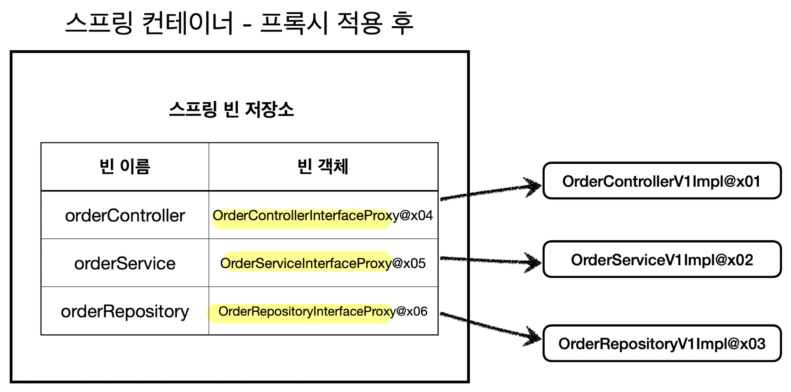
- 상황 1: **인터페이스 있는** 구체 클래스 - 스프링 빈 수동 등록
	- 프록시는 **인터페이스**를 **구현**
	- 프록시에서 로그 추적기 메서드 코드 실행하고 **`target` 호출**
	- 프록시를 **스프링 빈**으로 등록 (프록시만 스프링 컨테이너에서 관리, 실제 객체는 프록시에 주입)
- 상황 2: **인터페이스 없는** 구체 클래스 - 스프링 빈 수동 등록
	- 프록시는 **구체 클래스**를 **상속**
	- 프록시에서 로그 추적기 메서드 코드 실행하고 **`target` 호출**
	- 프록시를 **스프링 빈**으로 등록 (프록시만 스프링 컨테이너에서 관리, 실제 객체는 프록시에 주입)
	- 상속으로 인한 약간의 불편함 존재
		- 기본 생성자 없을 시 부모 클래스 생성자 호출해야 함
		- 클래스나 메서드에 `final`이 있을 시, 상속 혹은 오버라이딩 불가
- 상황 3: 스프링 빈 자동 등록 (컴포넌트 스캔)
## 리플렉션 (Reflection)
```java
@Slf4j
public class ReflectionTest {
	
	// 어려운 공통화 (메서드 호출 부분 동적 처리가 어려움)
	@Test
    void reflection0() {
        Hello target = new Hello();
		
		//공통 로직1 시작
		log.info("start");
		String result1 = target.callA(); //호출하는 메서드가 다름 
		log.info("result={}", result1);
		//공통 로직1 종료
		
		//공통 로직2 시작
		log.info("start");
		String result2 = target.callB(); //호출하는 메서드가 다름 
		log.info("result={}", result2);
		//공통 로직2 종료
	}
	
	// 리플렉션 활용 메서드 동적 호출
	@Test
	void reflection() throws Exception {
	    Class classHello =
	    Class.forName("hello.proxy.jdkdynamic.ReflectionTest$Hello");
	    Hello target = new Hello();
	    
	    Method methodCallA = classHello.getMethod("callA");
	    dynamicCall(methodCallA, target);
	    
	    Method methodCallB = classHello.getMethod("callB");
	    dynamicCall(methodCallB, target);
	}
	
	private void dynamicCall(Method method, Object target) throws Exception {
	    log.info("start");
	    Object result = method.invoke(target);
	    log.info("result={}", result);
	}
    
    @Slf4j
    static class Hello {
        public String callA() {
            log.info("callA");
            return "A";
        }
        public String callB() {
            log.info("callB");
			return "B";
		}
	}
}
```
- 사용 전략
	- **일반적으로 사용하면 안됨**
	- **프레임워크 개발**이나 **매우 일반적인 공통 처리**가 필요할 때 **부분적으로 주의해 사용**해야함
		- 프록시의 경우 프록시 클래스 100개, 1000개를 없앨 수 있으니 이럴 때는 사용할만 함
- 클래스나 메서드의 **메타정보를 동적으로 획득**하고, 코드를 **동적으로 호출**하는 기능
- 주요 메서드
	- `Class.forName("클래스 경로 포함 이름")` : 클래스 메타정보 획득
	- `classHello.getMethod("메서드이름")`
		- 클래스의 메서드 메타정보 획득
		- **소스코드로 박혀있던 메서드를 `Method` 클래스로 추상화해 동적으로 사용 가능**
	- `methodCallA.invoke(target)` : 획득한 메서드 메타정보로 실제 인스턴스의 메서드를 호출
- 장점: 애플리케이션을 **동적**으로 **유연**하게 만들 수 있음 (e.g. 동적 호출 통해 공통 로직 뽑아내고 재사용)
- 단점: 런타임에 동작하므로, **컴파일 시점에 오류를 잡을 수 없음**
	- 인자로 사용하는 것이 문자열이고, 실수 여지가 높음 (타입 안정성 낮음)
	- **컴파일 오류라는 발전을 역행하는 방식이므로 일반적으로 사용 X**
## 동적 프록시
- 동적 프록시
	- **프록시 객체**를 **동적으로 런타임에 생성**하는 기술
	- 덕분에 **부가 기능 로직을 하나만 개발**해 **공통으로 적용** 가능
		- 프록시 클래스를 대상 클래스마다 **수작업**으로 만드는 **문제 해결**
		- **단일 책임 원칙** 지킴 (하나의 클래스에 부가 기능 로직 모음)
- **JDK 동적 프록시** (자바 기본 제공)
	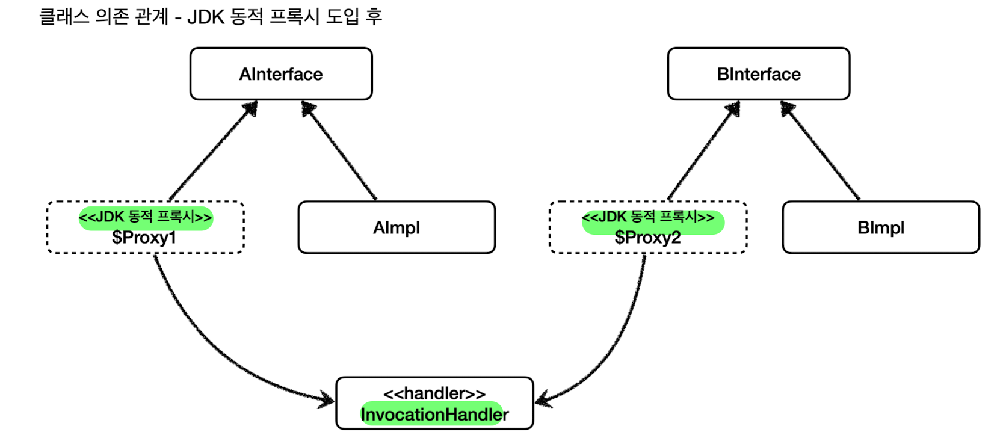
	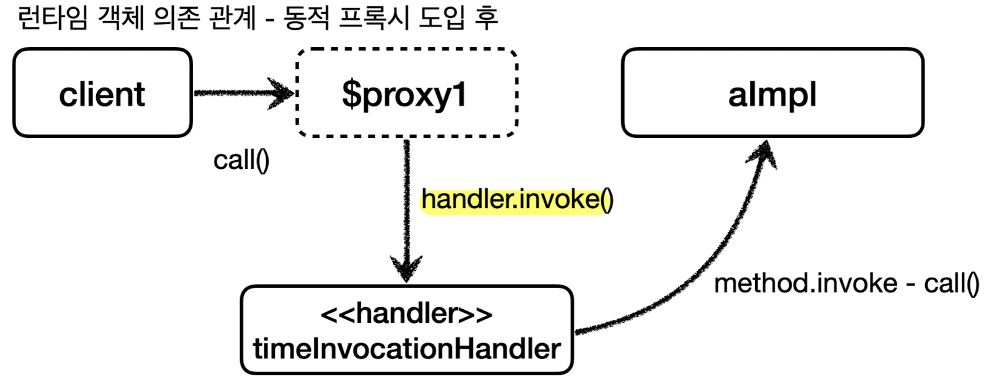
	- **인터페이스 기반**으로 동적 프록시 생성 (대상 객체는 **인터페이스 필수**로 있어야 함)
	- 개발자는 **`InvocationHandler`만 개발** (프록시 클래스 개발 X)
	- 사용 방법
		- **`InvocationHandler` 인터페이스를 구현**해 원하는 로직 적용
			- `InvocationHandler` 인터페이스 (JDK 동적 프록시 제공)
				```java
				public interface InvocationHandler {
				    public Object invoke(Object proxy, Method method, Object[] args)
				        throws Throwable;
				}
				```
				- `Object proxy` : 프록시 자신
				- `Method method` : 호출한 메서드
				- `Object[] args` : 메서드를 호출할 때 전달한 인수
			- 구현 예시
				```java
				@Slf4j
				public class TimeInvocationHandler implements InvocationHandler {
				    
				    private final Object target; //실제 객체
				    
				    public TimeInvocationHandler(Object target) {
				        this.target = target;
					}
				
					@Override
				    public Object invoke(Object proxy, Method method, Object[] args) throws Throwable {
						log.info("TimeProxy 실행");
						long startTime = System.currentTimeMillis();
						
						Object result = method.invoke(target, args);
						
						long endTime = System.currentTimeMillis();
						long resultTime = endTime - startTime; 
						log.info("TimeProxy 종료 resultTime={}", resultTime); 
						return result;
					}
				}
				```
		- **프록시 실행**
			```java
			//java.lang.reflect.Proxy
			@Slf4j
			public class JdkDynamicProxyTest {
			    @Test
			    void dynamicA() {
			        AInterface target = new AImpl();
			        TimeInvocationHandler handler = new TimeInvocationHandler(target);
			        AInterface proxy = (AInterface)
					Proxy.newProxyInstance(AInterface.class.getClassLoader(), new Class[] {AInterface.class}, handler);
			        
			        proxy.call();
			        
			        //targetClass=hello.proxy.jdkdynamic.code.AImpl
			        //proxyClass=com.sun.proxy.$Proxy1
				}
			}
			```
			- `new TimeInvocationHandler(target)`: 동적 프록시에 적용할 핸들러 로직
			- `Proxy.newProxyInstance(...)`: 동적 프록시 생성
			- 생성된 프록시는 전달 받은 `InvocationHandler` 구현체의 로직을 실행
		- **실제 실행 순서**
			- 클라이언트는 JDK 동적 프록시의 `call()` 실행
			- JDK 동적 프록시는 `InvocationHandler.invoke()` 를 호출
			- 구현체인 `TimeInvocationHandler` 내부 로직을 수행
				- `method.invoke(target, args)` 호출해 `target`인 실제 객체(`AImpl`) 호출
			- `AImpl` 인스턴스의 `call()` 실행
			- `AImpl` 인스턴스의 `call()` 실행 끝나면 `TimeInvocationHandler`로 응답이 돌아옴
				- 시간 로그를 출력하고 결과를 반환
- **CGLIB 동적 프록시**
	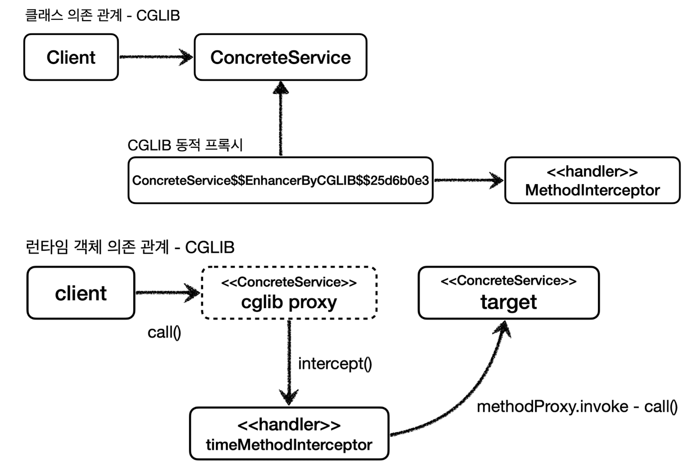
	- 인터페이스 없어도 **구체 클래스를 상속해 동적 프록시 생성 가능** (인터페이스 기반도 가능)
	- 개발자는 **`MethodInterceptor`만 개발** (프록시 클래스 개발 X)
	- 제약
		- 부모 클래스에 기본 생성자가 있어야 함 (동적 생성 위해)
		- 클래스나 메서드에 `final` 붙으면 상속 및 오버라이드 불가 -> 프록시에서 예외 혹은 동작 불가
	- 사용 방법
		- **`MethodInterceptor` 인터페이스를 구현**해 원하는 로직 적용
			- `MethodInterceptor` 인터페이스 (CGLIB 제공)
				```java
				public interface MethodInterceptor extends Callback {
				    Object intercept(Object obj, Method method, Object[] args, MethodProxy proxy) throws Throwable;
				}
				```
				- `obj` : CGLIB가 적용된 객체
				- `method` : 호출된 메서드
				- `args` : 메서드를 호출하면서 전달된 인수
				- `proxy` : 메서드 호출에 사용
			- 구현 예시
				```java
				@Slf4j
				public class TimeMethodInterceptor implements MethodInterceptor {
				    
				    private final Object target;
				    
				    public TimeMethodInterceptor(Object target) {
				        this.target = target;
					}
					
					@Override
				    public Object intercept(Object obj, Method method, Object[] args, MethodProxy proxy) throws Throwable {
						log.info("TimeProxy 실행");
						long startTime = System.currentTimeMillis();
						
				        //참고로 Method 사용도 되지만 CGLIB은 성능상 MethodProxy 권장
				        Object result = proxy.invoke(target, args);
				        
						long endTime = System.currentTimeMillis();
						long resultTime = endTime - startTime; 
						log.info("TimeProxy 종료 resultTime={}", resultTime); 
						return result;
					}
				}
				```
		- **프록시 실행**
			```java
			@Slf4j
			public class CglibTest {
			    @Test
			    void cglib() {
			        ConcreteService target = new ConcreteService();
			        
			        Enhancer enhancer = new Enhancer();
			        enhancer.setSuperclass(ConcreteService.class);
			        enhancer.setCallback(new TimeMethodInterceptor(target));
			        ConcreteService proxy = (ConcreteService) enhancer.create();
			        
			        proxy.call();
			        
			        // targetClass=hello.proxy.common.service.ConcreteService 
			        // proxyClass=hello.proxy.common.service.ConcreteService$ $EnhancerByCGLIB$$25d6b0e3
			    }
			}
			```
			- `Enhancer` : CGLIB는 `Enhancer` 를 사용해서 프록시를 생성
			- `enhancer.setSuperclass(ConcreteService.class)`
				- CGLIB는 구체 클래스를 상속 받아서 프록시 생성할 수 있음 (구체 클래스 지정)
			- `enhancer.setCallback(new TimeMethodInterceptor(target))`
				- 프록시에 적용할 실행 로직을 할당
			- `enhancer.create()` : 프록시를 생성
				- 클래스 이름 규칙: `대상클래스$$EnhancerByCGLIB$$임의코드`

>**CGLIB** (Code Generator Library)
>
>**바이트코드를 조작**해 **동적으로 클래스를 생성하는 기술**을 제공하는 라이브러리다. 
>본래 외부 라이브러리이지만, **스프링 내부 소스 코드에 포함**되어 있다. 
>따라서, 스프링을 사용하면 별도 설정이 필요 없다. 또한, 개발자가 CGLIB을 직접 사용할 일은 거의 없기 때문에, 너무 깊게 갈 필요도 없다.

## 스프링 지원 프록시 - `ProxyFactory`
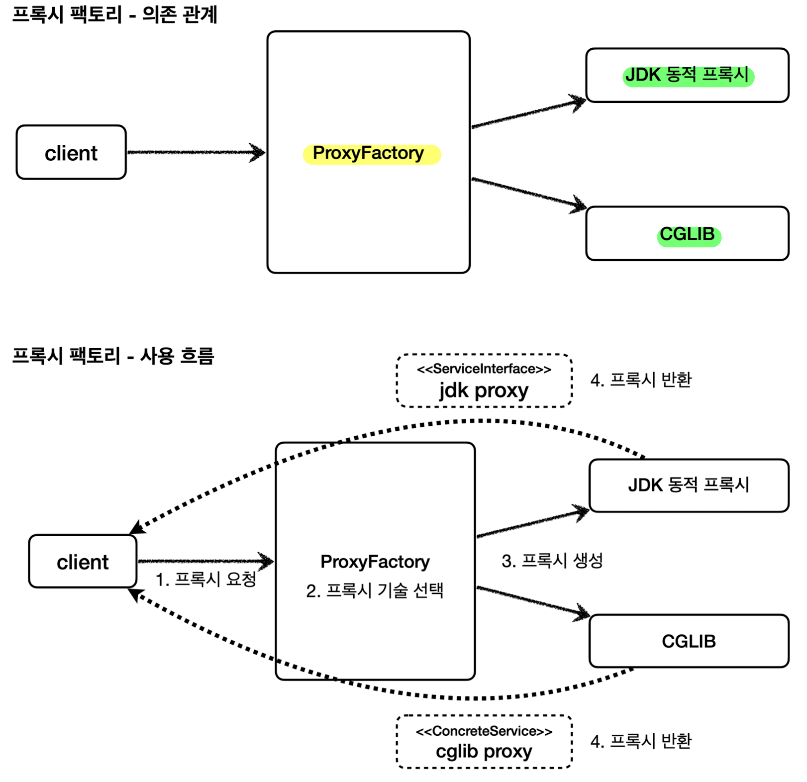
- **스프링**이 지원하는 **동적 프록시를 편리하게 만들어주는 기능**
	- 추상화 덕분에 구체적인 CGLIB, JDK 동적 프록시 기술에 의존 X
- **인터페이스가 있으면 JDK 동적 프록시, 없으면 CGLIB을 사용 가능** (변경 가능, `proxyTargetClass`)
- 스프링은 **`Advice`, `Pointcut` 개념 도입**
	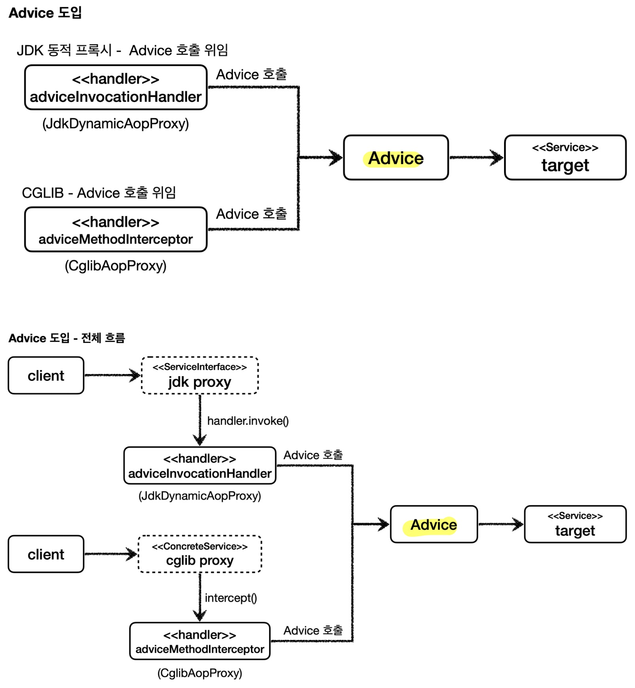
	- 개발자는 부가기능 로직으로 **`Advice`만 개발**
		- `Advice`는 프록시에 적용하는 **부가 기능 로직**
			- `InvocationHandler`, `MethodInterceptor`를 개념적으로 **추상화**
			- 덕분에 **개발자는 `InvocationHandler`, `MethodInterceptor` 중복 관리 필요 X**
		- 프록시 팩토리는 내부에서
			- JDK 동적 프록시인 경우 `InvocationHandler`가 `Advice` 호출하도록 개발
			- CGLIB인 경우 `MethodInterceptor`가 `Advice` 호출하도록 개발
	- **`Pointcut`을 사용**해 **특정 조건**에 따라 프록시 **로직 적용 여부 컨트롤**
- **`proxyTargetClass`** 옵션
	- **`proxyTargetClass=true`** (**스프링 부트** AOP 적용 **디폴트**)
		- 인터페이스가 있어도 여부 상관없이 **CGLIB** 사용 - **구체 클래스 기반 프록시**
	- `proxyTargetClass=false`
		- 인터페이스가 있으면 JDK 동적 프록시 - 인터페이스 기반 프록시
		- 인터페이스가 없으면 CGLIB 사용 - 구체 클래스 기반 프록시
- 기본 사용 방법
	- 스프링 제공 `MethodInterceptor` 구현해 `Advice` 만들기
		- `MethodInterceptor`
			```java
			public interface MethodInterceptor extends Interceptor {
			    Object invoke(MethodInvocation invocation) throws Throwable;
			}
			```
			- 스프링 AOP 모듈(`spring-aop`) 내 `org.aopalliance.intercept` 패키지 소속
			- 상속 관계
				- **`MethodInterceptor`는** `Interceptor` 상속
				- `Interceptor`는 **`Advice` 인터페이스 상속**
			- `MethodInvocation invocation`
				- `target` 정보, 현재 프록시 객체 인스턴스, `args`, 메서드 정보 등 포함
		- 구현 예시
			```java
			@Slf4j
			public class TimeAdvice implements MethodInterceptor {
			    @Override
			    public Object invoke(MethodInvocation invocation) throws Throwable {
					log.info("TimeProxy 실행");
					long startTime = System.currentTimeMillis();
					
					Object result = invocation.proceed(); //target 호출
					
					long endTime = System.currentTimeMillis();
					long resultTime = endTime - startTime; 
					log.info("TimeProxy 종료 resultTime={}ms", resultTime); 
					return result;
				}
			}
			```
	- 프록시 실행
		```java
		@Slf4j
		public class ProxyFactoryTest {
			@Test
			@DisplayName("인터페이스가 있으면 JDK 동적 프록시 사용") 
			void interfaceProxy() {
		        ServiceInterface target = new ServiceImpl();
		        ProxyFactory proxyFactory = new ProxyFactory(target);
		        proxyFactory.addAdvice(new TimeAdvice());
		        ServiceInterface proxy = (ServiceInterface) proxyFactory.getProxy();
				
				proxy.save();
				
				assertThat(AopUtils.isAopProxy(proxy)).isTrue();//true
				assertThat(AopUtils.isJdkDynamicProxy(proxy)).isTrue();//true
				assertThat(AopUtils.isCglibProxy(proxy)).isFalse();//false
			}
			
			@Test
			@DisplayName("구체 클래스만 있으면 CGLIB 사용")
			void concreteProxy() {
			    ConcreteService target = new ConcreteService();
				ProxyFactory proxyFactory = new ProxyFactory(target);
				proxyFactory.addAdvice(new TimeAdvice());
				ConcreteService proxy = (ConcreteService) proxyFactory.getProxy();
				
				proxy.call();
				
				assertThat(AopUtils.isAopProxy(proxy)).isTrue();//true
				assertThat(AopUtils.isJdkDynamicProxy(proxy)).isFalse();//false
				assertThat(AopUtils.isCglibProxy(proxy)).isTrue();//true
			}
			
			@Test
			@DisplayName("ProxyTargetClass 옵션을 사용하면 인터페이스가 있어도 CGLIB를 사용하고, 클래스 기반 프록시 사용")
			void proxyTargetClass() {
			ServiceInterface target = new ServiceImpl(); 
			ProxyFactory proxyFactory = new ProxyFactory(target); 
			proxyFactory.setProxyTargetClass(true); //중요
			proxyFactory.addAdvice(new TimeAdvice());
			ServiceInterface proxy = (ServiceInterface) proxyFactory.getProxy();
			
			proxy.save();
			
			assertThat(AopUtils.isAopProxy(proxy)).isTrue();//true
			assertThat(AopUtils.isJdkDynamicProxy(proxy)).isFalse();//false
			assertThat(AopUtils.isCglibProxy(proxy)).isTrue();//true
			}
		}
		```
		- **`new ProxyFactory(target)`**
			- 프록시 팩토리를 생성 시, 생성자에 **`target` 객체 전달**
			- 프록시 팩토리는 **`target` 인스턴스 정보 기반으로 프록시 생성**
				- 만약 이 인스턴스에 **인터페이스가 있다**면 **JDK 동적 프록시**를 기본으로 사용
				- **인터페이스가 없고** 구체 클래스만 있다면 **CGLIB**를 통해서 동적 프록시 생성
		- `proxyFactory.addAdvice(new TimeAdvice())`
			- 생성할 프록시가 사용할 부가 기능 로직을 설정 (`Advice`)
			- JDK 동적 프록시가 제공하는 `InvocationHandler` 와 CGLIB가 제공하는 `MethodInterceptor` 의 개념과 유사
		- **`proxyFactory.getProxy()`** : 프록시 객체를 생성하고 반환
## 포인트컷, 어드바이스, 어드바이저
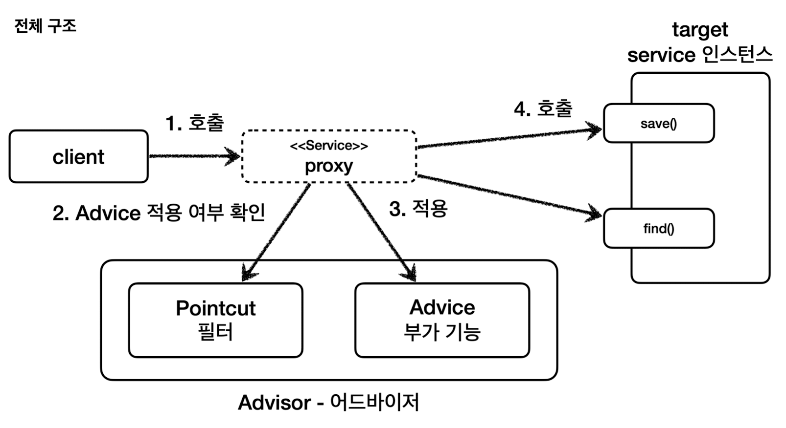
- **포인트컷**(`Pointcut`)
	```java
	public interface Pointcut {
	    ClassFilter getClassFilter();
	    MethodMatcher getMethodMatcher();
	}
	
	public interface ClassFilter {
	    boolean matches(Class<?> clazz);
	}
	
	public interface MethodMatcher {
	    boolean matches(Method method, Class<?> targetClass);
	    //..
	}
	```
	- 부가 기능 적용 여부를 판단하는 **필터링** 로직 (**어디에?**)
	- 주로 **클래스와 메서드 이름**으로 필터링
		- 포인트 컷은 크게 **`ClassFilter`와 `MethodMatcher`로 구성**
		- 클래스가 맞는지, 메서드가 맞는지 확인하고 **둘 다 `true`일 경우 어드바이스 적용**
	- 직접 만들진 않고 **보통 스프링 구현체 사용**
		- **`AspectJExpressionPointcut`** : **aspectJ 표현식**으로 매칭 (**실무 단독 사용**)
		- `NameMatchMethodPointcut` : 메서드 이름을 기반으로 매칭 (`PatternMatchUtils` 사용)
		- `JdkRegexpMethodPointcut` : JDK 정규 표현식을 기반으로 포인트컷을 매칭
		- `TruePointcut` : 항상 참을 반환
		- `AnnotationMatchingPointcut` : 애노테이션으로 매칭
- **어드바이스**(`Advice`)
	- 프록시가 호출하는 **부가 기능** (**어떤 로직?**)
- **어드바이저**(`Advisor`)
	- 하나의 포인트컷과 하나의 어드바이스를 가지고 있는 것 (**포인트컷1 + 어드바이스1**)
	- 프록시 팩토리 사용 시 어드바이저 제공 가능
	- 유의점: **하나의 `target`에 여러 AOP 적용 시**
		- 스프링 AOP는 `target` 마다 **하나의 프록시만 생성** (여러 프록시 X, **성능 최적화**)
		- **하나의 프록시**에 **여러 어드바이저를 적용**
- 예시 코드 1 - 기본 사용
	```java
	@Slf4j
	public class AdvisorTest {
		
		@Test
		void advisorTest1() {
			ServiceInterface target = new ServiceImpl();
			ProxyFactory proxyFactory = new ProxyFactory(target);
			DefaultPointcutAdvisor advisor = new DefaultPointcutAdvisor(Pointcut.TRUE, new TimeAdvice());
			proxyFactory.addAdvisor(advisor);
			ServiceInterface proxy = (ServiceInterface) proxyFactory.getProxy();
			
			proxy.save();
			proxy.find();
		}
		
		@Test
		@DisplayName("직접 만든 포인트컷") 
		void advisorTest2() {
			ServiceImpl target = new ServiceImpl();
			ProxyFactory proxyFactory = new ProxyFactory(target);
			DefaultPointcutAdvisor advisor = new DefaultPointcutAdvisor(new
			MyPointcut(), new TimeAdvice());
			proxyFactory.addAdvisor(advisor);
			ServiceInterface proxy = (ServiceInterface) proxyFactory.getProxy();
			
			proxy.save();
			proxy.find();
		}
		
		@Test
		@DisplayName("스프링이 제공하는 포인트컷") 
		void advisorTest3() {
			ServiceImpl target = new ServiceImpl();
			ProxyFactory proxyFactory = new ProxyFactory(target);
			NameMatchMethodPointcut pointcut = new NameMatchMethodPointcut();
			pointcut.setMappedNames("save");
			DefaultPointcutAdvisor advisor = new DefaultPointcutAdvisor(pointcut, new
			TimeAdvice());
			proxyFactory.addAdvisor(advisor);
			ServiceInterface proxy = (ServiceInterface) proxyFactory.getProxy();
			
			proxy.save();
			proxy.find();
		}
		
		static class MyPointcut implements Pointcut {
		    
		    @Override
		    public ClassFilter getClassFilter() {
			    return ClassFilter.TRUE;
		    }
		    
		    @Override
		    public MethodMatcher getMethodMatcher() {
		        return new MyMethodMatcher();
		    }
		}
 
		static class MyMethodMatcher implements MethodMatcher {
		
			private String matchName = "save";
		    
		    @Override
		    public boolean matches(Method method, Class<?> targetClass) {
		        boolean result = method.getName().equals(matchName);
		        return result;
		    }
     
		    //false인 경우 클래스의 정적 정보만 사용, 스프링이 내부에서 캐싱 통해 성능 향상 가능
			//true인 경우 매개변수가 동적으로 변경된다고 가정, 캐싱 X
		    @Override
		    public boolean isRuntime() {
		        return false;
		    }

			@Override
		    public boolean matches(Method method, Class<?> targetClass, Object... args) {
		        throw new UnsupportedOperationException();
		    }
		}

	}
	```
	- `new DefaultPointcutAdvisor(Pointcut.TRUE, new TimeAdvice());`
		- **`Advisor`** 인터페이스의 **가장 일반적인 구현체**
		- 생성자에 포인트컷과 어드바이스 전달
	- `proxyFactory.addAdvisor(advisor)`
		- 프록시 팩토리에 적용할 **어드바이저를 지정**
		- 프록시 팩토리를 사용할 때 어드바이저는 **필수**
- 예시 코드 2 - 여러 어드바이저 적용
	- 프록시 여러 개 만들기 (**해결책 X**, 프록시 수가 계속 늘어남)
		```java
		public class MultiAdvisorTest {
			
			@Test
			@DisplayName("여러 프록시") 
			void multiAdvisorTest1() {
		        //client -> proxy2(advisor2) -> proxy1(advisor1) -> target
		
				//프록시1 생성
				ServiceInterface target = new ServiceImpl(); 
				ProxyFactory proxyFactory1 = new ProxyFactory(target);
				DefaultPointcutAdvisor advisor1 = new DefaultPointcutAdvisor(Pointcut.TRUE, new Advice1());
		        proxyFactory1.addAdvisor(advisor1);
		        ServiceInterface proxy1 = (ServiceInterface) proxyFactory1.getProxy();
		
				//프록시2 생성, target -> proxy1 입력
				ProxyFactory proxyFactory2 = new ProxyFactory(proxy1);
				DefaultPointcutAdvisor advisor2 = new DefaultPointcutAdvisor(Pointcut.TRUE, new Advice2());
				proxyFactory2.addAdvisor(advisor2);
				ServiceInterface proxy2 = (ServiceInterface) proxyFactory2.getProxy(); 
				//실행
				proxy2.save();
				
				//결과
				//MultiAdvisorTest$Advice2 - advice2 호출
				//MultiAdvisorTest$Advice1 - advice1 호출
				//ServiceImpl - save 호출
			}
			
		    @Slf4j
		    static class Advice1 implements MethodInterceptor {
		        
		        @Override
		        public Object invoke(MethodInvocation invocation) throws Throwable {
			        log.info("advice1 호출");
		            return invocation.proceed();
		        }
			}
		    
		    @Slf4j
		    static class Advice2 implements MethodInterceptor {
		        @Override
		        public Object invoke(MethodInvocation invocation) throws Throwable {
			        log.info("advice2 호출");
		            return invocation.proceed();
		        }
		    }
		}
		```
	- **프록시 하나에 여러 어드바이저를 적용** (**해결책 O**)
		```java
		@Test
		@DisplayName("하나의 프록시, 여러 어드바이저") void multiAdvisorTest2() {
		    //proxy -> advisor2 -> advisor1 -> target
		    
		    DefaultPointcutAdvisor advisor2 = new DefaultPointcutAdvisor(Pointcut.TRUE,
		 new Advice2());
		    DefaultPointcutAdvisor advisor1 = new DefaultPointcutAdvisor(Pointcut.TRUE,
		 new Advice1());
		 
		    ServiceInterface target = new ServiceImpl();
		    ProxyFactory proxyFactory1 = new ProxyFactory(target);
		    proxyFactory1.addAdvisor(advisor2); //추가
		    proxyFactory1.addAdvisor(advisor1); //추가
		    ServiceInterface proxy = (ServiceInterface) proxyFactory1.getProxy();
			
			//실행
		    proxy.save();
			
			//결과
			//MultiAdvisorTest$Advice2 - advice2 호출 
			//MultiAdvisorTest$Advice1 - advice1 호출
			//ServiceImpl - save 호출
		}
		```
		- 프록시 팩토리에 원하는 만큼 **`addAdvisor()`** 호출로 어드바이저 등록
		- **등록하는 순서대로** `advisor` 가 호출 (여기서는 `advisor2` , `advisor1` 순서)
		- 여러 프록시 사용과 결과는 같고, **성능은 더 좋음**
## 빈 후처리기 (BeanPostProcessor)
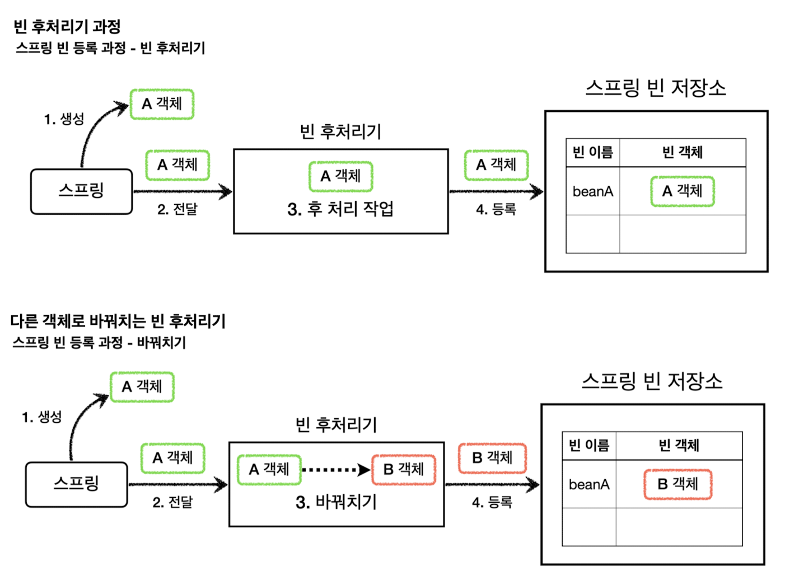
- **스프링 빈** 등록 위해 생성한 객체를 **빈 저장소 등록 직전에 조작**하는 기능 (후킹 포인트, **Hooking**)
	- 객체 **조작** (`setXxx`...)
	- 완전히 다른 객체로 **바꿔치기**
- **모든 빈 등록 후킹 가능** (수동 빈 등록 & 컴포넌트 스캔) -> **컴포넌트 스캔 빈도 프록시 적용 가능**
- **`BeanPostProcessor`** 인터페이스 - 스프링 제공
	```java
	public interface BeanPostProcessor {
	
	    Object postProcessBeforeInitialization(Object bean, String beanName) throws BeansException
	    
	    Object postProcessAfterInitialization(Object bean, String beanName) throws BeansException
	}
	```
	- 인터페이스를 **구현**하고 **스프링 빈으로 등록**하면 **스프링 컨테이너가 빈 후처리기로 인식하고 동작**
	- `postProcessBeforeInitialization`
		- 객체 생성 이후 `@PostConstruct` 같은 **초기화가 발생하기 전에 호출**되는 **포스트 프로세서**
	- `postProcessAfterInitialization`
		- 객체 생성 이후 `@PostConstruct` 같은 **초기화가 발생한 다음에 호출**되는 **포스트 프로세서**
- 빈 등록 과정 (feat. 빈 후처리기)
	- 생성: 스프링 빈 대상이 되는 객체를 생성 (`@Bean` , 컴포넌트 스캔 모두 포함)
	- 전달: 생성된 객체를 빈 저장소에 **등록하기 직전에 빈 후처리기에 전달**
	- 후 처리 작업: 빈 후처리기는 전달된 **스프링 빈 객체를 조작**하거나 **다른 객체로 바뀌치기**
	- 등록: 빈 후처리기는 빈을 **반환** (**반환된 빈이 빈 저장소에 등록됨**)
- 예시 코드
	```java
	public class BeanPostProcessorTest {
	    @Test
	    void postProcessor() {
	        ApplicationContext applicationContext = new AnnotationConfigApplicationContext(BeanPostProcessorConfig.class);
			
			//beanA 이름으로 B 객체가 빈으로 등록된다.
			B b = applicationContext.getBean("beanA", B.class); 
			b.helloB();
			
			//A는 빈으로 등록되지 않는다.
			Assertions.assertThrows(NoSuchBeanDefinitionException.class,
					() -> applicationContext.getBean(A.class));
		}
		
		@Slf4j
		@Configuration
	    static class BeanPostProcessorConfig {
	        
	        @Bean(name = "beanA")
	        public A a() {
	            return new A();
	        }
	        
	        @Bean
	        public AToBPostProcessor helloPostProcessor() {
	            return new AToBPostProcessor();
	        }
		}
	    
	    @Slf4j
	    static class A {
	        public void helloA() {
	            log.info("hello A");
			}
		}
		
	    @Slf4j
	    static class B {
	        public void helloB() {
	            log.info("hello B");
			} 
		}
		
	    @Slf4j
	    static class AToBPostProcessor implements BeanPostProcessor {
			@Override
	        public Object postProcessAfterInitialization(Object bean, String beanName) throws BeansException {
	            if (bean instanceof A) {
	                return new B();
	            }
	            return bean;
	        }
		}
	
	}
	```

>`@PostConstruct`와 빈 후처리기
>
>`@PostConstruct`는 빈 생성 이후 빈 초기화 역할을 하는데, 이 역시도 **빈 후처리기와 함께 동작**된다.
>사실, 스프링은 **`CommonAnnotationBeanPostProcessor`** 라는 **빈 후처리기를 자동으로 등록**하는데, 여기에서 **`@PostConstruct` 애노테이션이 붙은 메서드를 호출**한다. 
>
>즉, **스프링 스스로도 스프링 내부의 기능을 확장하기 위해 빈 후처리기를 사용**한다.

***
## Reference
[스레드 로컬 (Thread Local)](https://inma.tistory.com/171)