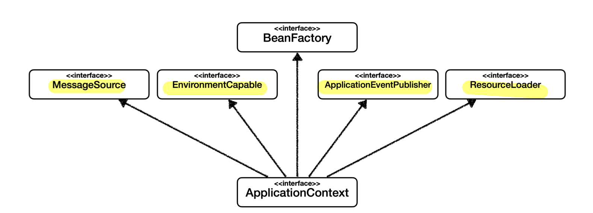
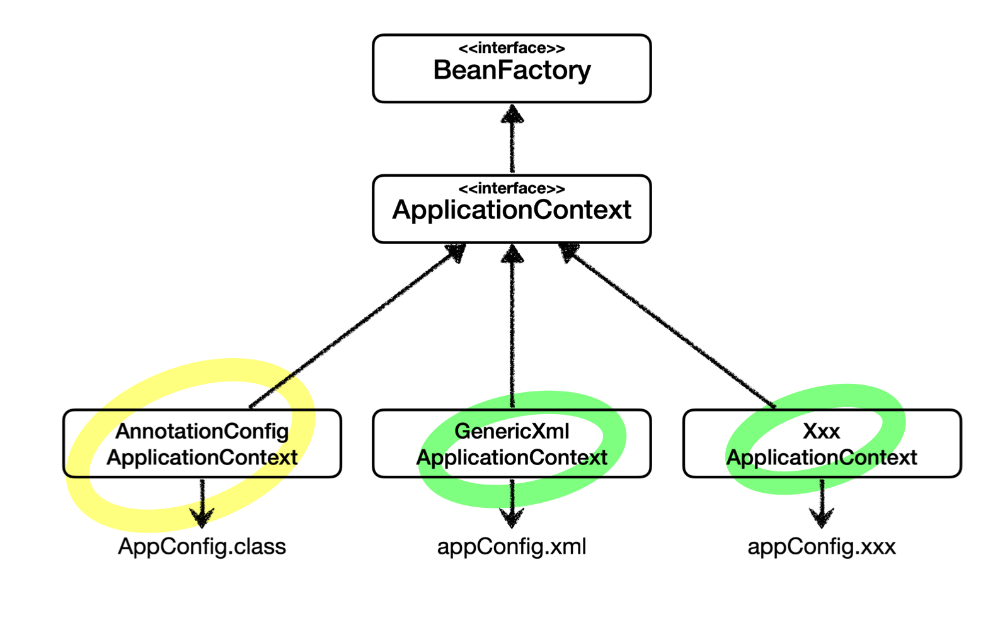
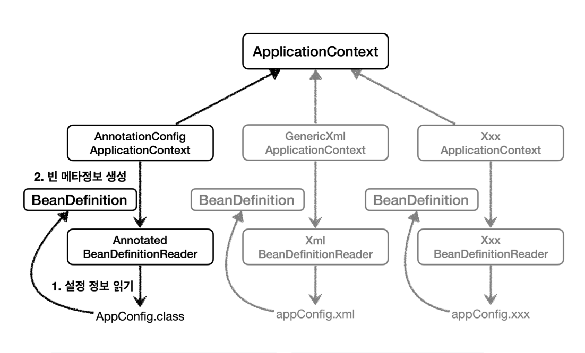

# 스프링 핵심 원리
## 스프링의 탄생
- EJB (Enterprise Java Beans) 지옥
	- 과거 EJB는 자바 진영의 표준이었다.
	- 분산 처리를 편리하게 도와주고 자체 ORM(Entity Bean)을 제공
	- 그러나 EJB 의존적 개발은 코드 관리가 심히 어려웠고 Entity Bean은 join이 잘 안될 정도로 기술력이 떨어짐
- 스프링의 탄생
	- Rod Johnson(로드 존슨)이 J2EE Design and Development 책 발행 (2002)
		- J2EE(=EJB)에 고통 받던 로드 존슨은 EJB 없이 고품질의 확장 가능한 애플리케이션 개발을 보여줌 (3만 줄 이상의 예제코드)
		- 현재의 스프링 핵심 개념 제시 (BeanFactory, ApplicationContext, POJO, IoC, DI etc...)
		- 개발자들은 열광했다.
	- Juergen Hoeller(유겐 휠러), Yann Caroff(얀 카로프)가 책이 아깝다며 오픈소스 프로젝트 제안
		- 스프링의 시작과 현재 (EJB의 겨울을 넘어 새로운 시작이라는 뜻)
		- 현재도 유겐 휠러가 스프링 핵심코드의 상당수를 개발 중
- JPA의 탄생
	- Gavin King(개빈 킹)이 EJB 엔터티 빈을 대체하는 Hibernate을 개발 (많은 개발자가 사용하게 됨)
	- 추후 자바 표준을 새로 만들 때, 개빈 킹을 영입해 JPA 표준을 만듦
		- 그 후 Hibernate이 다시 JPA 표준 구현체가 됨
		- 현재 JPA 구현체들 중 가장 많이 사용하는 것이 Hibernate이다.

## 스프링 생태계
- 필수
	- 스프링 프레임워크
		- 핵심 가치: **객체 지향 언어의 강점을 잘 살릴 수 있게 도와주는 프레임워크**
			- 핵심기술: 스프링 DI 컨테이너, AOP, 이벤트, 기타
			- 웹 기술: 스프링 MVC, 스프링 WebFlux
			- 데이터 접근 기술: 트랜잭션, JDBC, ORM 지원
			- 기술 통합: 캐시, 이메일, 원격접근, 스케줄링
			- 테스트: 스프링 기반 테스트 지원
			- 언어: 코틀린, 그루비
	- 스프링 부트
		- 스프링을 편리하게 사용할 수 있도록 지원
		- 쉬운 스프링 애플리케이션 생성
		- Tomcat 웹서버 설치 필요 없이 내장
		- 손쉬운 빌드 구성을 위한 starter 및 서드 파티 라이브러리 자동 구성
		- 모니터링 기능 제공
- 선택
	- 스프링 데이터
	- 스프링 세션
	- 스프링 시큐리티
	- 스프링 Rest Docs
	- 스프링 배치
	- 스프링 클라우드

## 객체 지향과 스프링
- 객체 지향의 핵심은 다형성이지만, 다형성만으로는 SOLID의 OCP, DIP 원칙을 지킬 수 없다.
	- `MemberRepository m = new MemoryMemberRepository();`
- **다형성 + OCP, DIP**를 지키려다보면 결국 **스프링 프레임워크**를 만들게 된다.
	- **의존관계 주입** (DI, Dependency Injection)
		- **런타임**에 외부에서 구현 객체를 생성하고 클라이언트에 전달해서 **실제 의존관계가 연결되는 것**
			- 스프링 이전: `AppConfig` 설정 클래스를 따로 만들고 구현 객체 생성, 연결 책임을 할당
				- 애플리케이션이 크게 **사용 영역**과 **구성 영역**으로 분리
					- **관심사의 분리**, **SRP** 준수
				- 구현 객체 변경시 사용 영역(클라이언트 코드) 변경 없이 **구성 영역만 영향** 받음
					- **다형성** + **DIP**가 잘 지켜지면 **OCP** 준수까지 이어짐
			- 스프링 이후:
				- 스프링은 **DI 컨테이너**(=**IoC 컨테이너**)를 통해 DI를 지원 (구성 영역)
				- 스프링 컨테이너 = `AppConfig` + `@Configuration` (+ `@Bean`)
		- **구성 영역** 덕분에 **클라이언트 코드 변경 없이 부품 갈아 끼우듯 런타임 기능 확장이 가능**
		- 정적인 클래스 의존관계를 변경하지 않고, **동적인 객체 의존관계를 쉽게 변경 가능**
	- **제어의 역전** (IoC, Inversion of Control)
		- **프로그램의 제어 흐름**을 직접 제어하는 것이 아니라 **외부에서 관리하는 것**
		- 구성영역(`AppConfig` 혹은 DI 컨테이너)이 프로그램의 제어흐름을 가져가면서 발생

>"역할에 따른 구현이 보인다"의 의미
>
>역할과 구현 클래스가 한눈에 들어오는 것을 말한다.
>**메소드 이름**, **리턴 타입**(**역할**), **리턴하는 객체**(**구현**)가 명확하게 보이는 코드가 좋다.

>프레임워크 VS 라이브러리
>
>**프레임워크**: 내가 작성하는 코드를 제어하고 대신 실행함 (`JUnit`)
>**라이브러리**: 내가 작성한 코드가 직접 제어의 흐름을 담당

>의존관계 분류
>
>**클래스 의존관계(정적):** 애플리케이션 실행 없이 `import` 코드만으로 파악하는 의존관계 (클래스 다이어그램)
>**객체 의존관계(동적)**: 애플리케이션 실행 시점(런타임)에 실제 생성되는 객체 인스턴스 간 의존관계 (객체 다이어그램)

## 스프링 컨테이너 (DI 컨테이너, IoC 컨테이너)
- **스프링 컨테이너** (`AppConfig` + `@Configuration` = `ApplicationContext`)
	- 스프링에서 의존관계 주입을 지원해주는 구성 영역
	- **`ApplicationContext`** 혹은 `BeanFactory`를 지칭
	- 구조
		1. `BeanFactory` (스프링 컨테이너 최상위 인터페이스)
			- 스프링 빈을 관리하고 조회하는 역할
			- `getBean()` 제공
		2. **`ApplicationContext`**(인터페이스, **주로 사용**) 
			
			- 빈 관리 및 조회 기능 (`BeanFactory` 상속 받음)
			- 부가 기능 제공
				- 국제화 기능, 환경변수 (로컬, 개발, 운영 구분), 애플리케이션 이벤트 (이벤트 발행 구독 모델 지원), 리소스 조회
		3. `ApplicationContext` **구현체** (다양한 형식의 설정 정보)
			
			- 종류
				- **`AnnotationConfigApplicationContext`** (애노테이션 기반 자바 코드 설정)
				- `GenericXmlApplicationContext` (XML 설정)
				- `XxxApplicationContext`...
			- `BeanDefinition`
				
				- **빈 설정 메타정보**
				- `@Bean` 당 각각 하나씩 메타정보가 생성됨
				- **스프링 컨테이너는 `BeanDefinition` 인터페이스만 알고 해당 메타정보 기반으로 빈 생성**
				- 다양한 형식의 설정 정보는 실제로 `BeanDefinitionReader`가 읽고 `BeanDefinition`을 생성
					- `AnnotatedBeanDefinitionReader`
					- `XmlBeanDefinitionReader`
					- `XxxBeanDefinitionReader`…
- **스프링 빈**(`@Bean`)
	- 스프링 컨테이너에 등록된 객체
- **스프링 컨테이너 생성 과정**
	1. 스프링 컨테이너 생성 단계
		- **구성 정보**(`AppConfig.class`)와 함께 컨테이너 객체 생성
		- `new AnnotationConfigApplicationContext(AppConfig.class)`
	2. 스프링 빈 생성 및 등록 단계
		- 스프링 컨테이너는 설정 클래스 정보를 확인하면서 `@Bean`이 붙은 메서드를 **모두 호출**하고 메서드의 이름 Key, 메서드 반환 객체를 Value로 **스프링 빈 저장소에 등록**
			- 메서드 호출로 빈 객체 생성시 **의존관계 주입이 필요한 객체에 한해서 이 시점에 DI가 발생**
		- 빈 이름 = 메서드 명
			- 빈 이름 직접 부여 가능 - `@Bean(name="memberServiceNewNamed")`
			- **빈 이름은 항상 다른 이름을 부여해야 함** (다른 빈 무시 혹은 기존 빈 덮는 등의 오류)
	3. 스프링 빈 의존관계 설정 단계
		- 스프링 컨테이너는 설정 정보를 참고해서 **의존관계 주입** (DI)
- 스프링 컨테이너 조회 메서드
	- 대원칙: **부모 타입을 조회하면, 자식 타입도 함께 조회한다.**
		- `Object`로 조회시 모든 스프링 빈 조회
	- 유의점
		- 구체 타입 조회(특정 하위 타입 조회 등)는 유연성이 감소되므로 지양
		- 개발시에는 굳이 컨테이너에 직접 빈을 조회할 일이 없음
	- 기본 조회
		- `ac.getBean(빈이름, 타입)`
		- `ac.getBean(타입)`
		- 예외
			- `NoSuchBeanDefinitionException: No bean named ...`
				- 조회 대상 빈이 없을 때
			- `NoUniqueBeanDefinitionException: No bean named ...`
				- 타입으로 조회시 같은 타입의 스프링 빈이 둘 이상일 때 (빈 이름 지정하면 해결)
	- 해당 타입의 모든 빈을 조회
		- `ac.getBeansOfType(타입)` 
	- 컨테이너에 등록된 모든 빈 이름 조회
		- `ac.getBeanDefinitionNames()`
	- Bean Definition 조회
		- `ac.getBeanDefinition(데피니션 네임)`
	- 빈 역할 조회
		- `beanDefinition.getRole()`
			- `ROLE_APPLICATION`: 일반적으로 사용자가 정의한 빈
			- `ROLE_INFRASTRUCTURE`: 스프링이 내부에서 사용하는 빈

>Class 내부의 static Class의 의미
>
>해당 클래스를 **현재 상위 클래스의 스코프 내에서만 사용**하겠다는 의미

>Spring Bean을 만드는 두 가지 일반적인 방법
>
>**직접 Spring Bean 등록 (=xml 방식)**
>BeanDefinition에 클래스 정보가 자세히 기록되어 있음
>`beanDefinition = Generic bean: class [hello.core.member.MemberServiceImpl]`
>
>**Factory method를 통해 등록** (=**Java config**를 통해 등록하는 방법)
>FactoryBean(=AppConfig) & Factory Method(=memberService 메서드)
>BeanDefinition에 `factoryBeanName=appConfig; factoryMethodName=memberService` 식으로 등록되어 있음

***
## Reference
*[스프링 핵심 원리 - 기본편](https://www.inflearn.com/course/%EC%8A%A4%ED%94%84%EB%A7%81-%ED%95%B5%EC%8B%AC-%EC%9B%90%EB%A6%AC-%EA%B8%B0%EB%B3%B8%ED%8E%B8)*