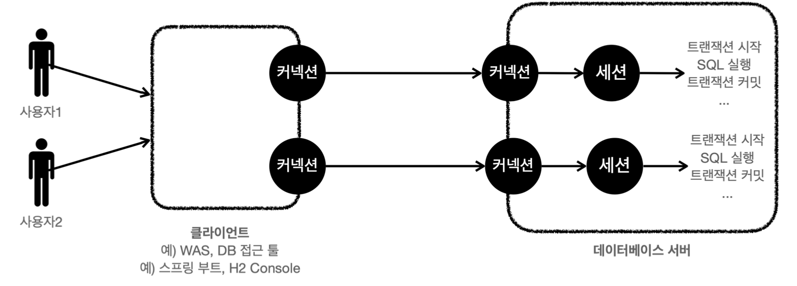
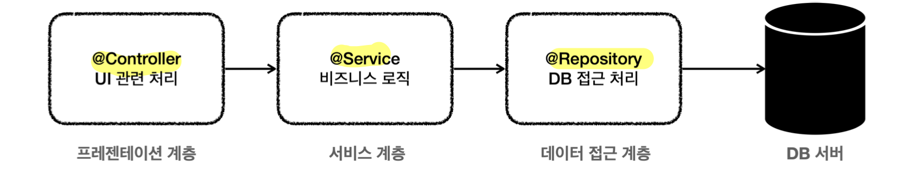
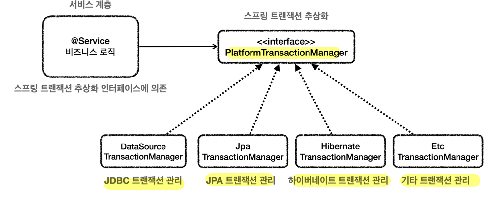
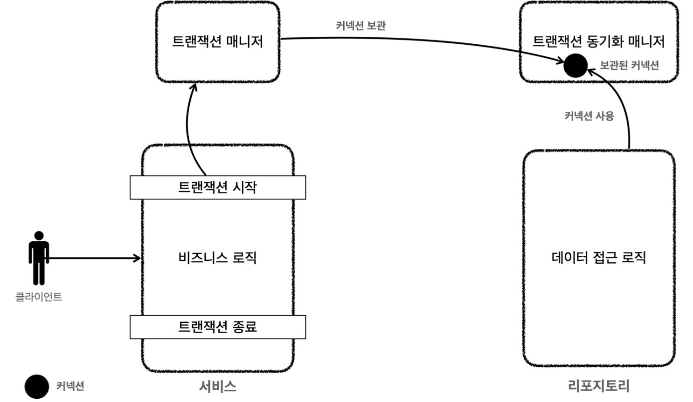
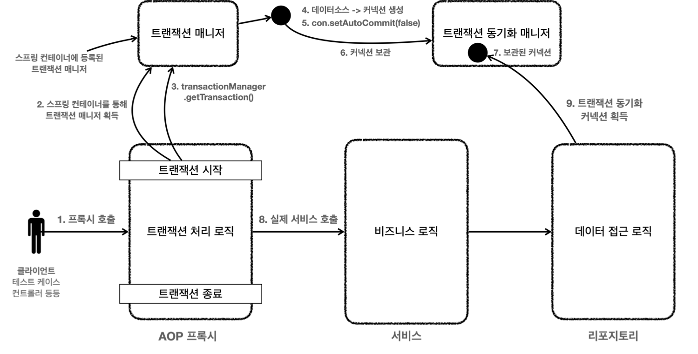
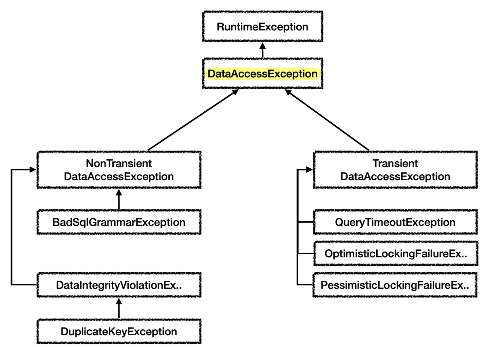

## DB 접근 기술 의존 관계
- **`@Transactional`**
	- -> **`PlatformTransactionManager`** 인터페이스
		- -> JDBC 활용 기술 (SQLMapper, ORM)에 따른 구현체 
		  (`DataSourceTransactionManager`, `JpaTransactionManager`, `EtcTransactionManager`)
			- -> **DataSource** 인터페이스
				- -> **Connection Pool의 DataSource 구현체** 사용
					- -> DriverManager -> JDBC `Connection` 인터페이스 (DB Driver)
					- 초기화 과정으로 커넥션들을 미리 생성
				- -> **`DriverManagerDataSource`** DataSource 구현체 사용
					- -> DriverManager -> JDBC `Connection` 인터페이스 (DB Driver)
					- 항상 새 커넥션 생성
## 데이터베이스 변경 문제
- 일반적인 애플리케이션 서버와 DB 사용법
	- 커넥션 연결 (TCP/IP)
	- SQL 전달 (with 커넥션)
	- 결과 응답
- 문제는 **데이터베이스마다 사용법이 모두 다름** (커넥션 연결, SQL 전달, 결과 응답 방법)
- 데이터베이스 변경시 **애플리케이션의 DB 사용코드도 함께 변경**해야 하고, **개발자의 학습량**이 늘어남
## JDBC 표준 인터페이스(Java Database Connectivity)

- 자바에서 **여러 데이터베이스에 편리하게 접속**할 수 있도록 도와주는 3가지 **표준 인터페이스**
	- **`java.sql.Connection`** (커넥션 연결)
	- **`java.sql.Statement`** (SQL을 담은 내용)
	- **`java.sql.ResultSet`** (결과 응답)
- **JDBC 드라이버**
	- 각각의 DB 벤더들이 JDBC 인터페이스를 자신의 DB에 맞도록 **구현한 라이브러리**
	- 예시: MySQL JDBC 드라이버,  Oracle JDBC 드라이버 etc...
- 장점
	- 애플리케이션 로직이 **JDBC 표준 인터페이스에만 의존**하므로, 
	  DB 변경시 **애플리케이션 코드를 그대로 유지**하고 **JDBC 구현 라이브러리만 변경 가능**
	- **개발자는 JDBC 표준 인터페이스 사용법만 학습**하면, 모든 DB 연결 가능
- 한계
	- DB마다 SQL 역시 사용법의 차이가 있어, DB 변경 시 **여전히 SQL은 그에 맞도록 변경**해야 함
	- 다만, JPA를 사용하면 이 역시도 많은 부분 해결됨
## JDBC 활용 기술
- JDBC(1997)는 오래된 기술이고 사용 방법도 복잡
- 직접 사용하기보다는 이를 **편리하게 사용할 수 있는 다른 기술들을 활용** (내부에서 JDBC 사용)
- **SQL Mapper**
	
	- 장점
		- SQL 응답 결과를 **객체로 편리하게 변환**
		- **JDBC 반복 코드를 제거**
		- 낮은 러닝커브 (SQL만 작성할 줄 알면 금방 배워 사용 가능)
	- 단점
		- 개발자가 직접 SQL 작성
	- Spring JdbcTemplate, MyBatis
- **ORM**
	
	- 장점
		- SQL 직접 작성하지 않아 **개발 생산성** 크게 상승 (**SQL을 동적으로 생성 및 실행**)
		- 데이터베이스마다 **다른 SQL을 사용하는 문제를 중간에서 해결**
	- 단점
		- 러닝커브가 높음
	- JPA (하이버네이트, 이클립스 링크...)
## JDBC DriverManager

- **`DriverManager`** (JDBC가 제공)
	- **라이브러리에 등록된 DB 드라이버들을 관리**
	- **커넥션 획득** 기능 제공 (JDBC 표준 인터페이스 **`Connection`**)
- **커넥션 획득 과정**
	- `Connection connection = DriverManager.getConnection(URL, USERNAME, PASSWORD);`
	- `DriverManager`는 라이브러리에 등록된 DB 드라이버 목록을 **자동으로 인식**
	- 드라이버들에게 순서대로 다음 정보를 넘겨서 **커넥션 획득 가능 여부 확인**
		- 접속에 필요한 정보: URL, 이름, 비밀번호...
		- 커넥션 획득 가능한 드라이버는 바로 **실제 DB에 연결해 커넥션 구현체 반환** 
		  (URL 등을 통해 판단)
		- 커넥션 획득 불가능한 드라이버는 다음 드라이버에게 순서를 넘김
- 커넥션 사용
	- 쿼리 준비
		- **`PreparedStatement`**(`pstmt`) 주로 사용 (**`Statement`의 자식 인터페이스**)
			- 전달할 SQL과 파라미터로 전달할 데이터를 바인딩
			- 파라미터 바인딩 방식은 SQL Injection 예방
		- 코드
			- `pstmt = con.prepareStatement(sql)`
			- `pstmt.setString(1, member.getMemberId)`
			- `pstmt.setInt(2, member.getMoney())`
	- 쿼리 실행
		- 조회
			- **`executeQuery()`**
				- `SELECT` 쿼리 조회 후 `ResultSet` 반환
				- `rs = pstmt.executeQuery()`
			- **`ResultSet`** (JDBC 표준 인터페이스)
				- `executeQuery()`의 반환 타입
				- `select` 쿼리 결과가 순서대로 들어가 있음
				- 내부의**커서**(Cursor)를 이동해 다음 데이터 조회 (`rs.next()`)
					- **최초 커서는 데이터를 가리키고 있지 않아서**, 한 번 `rs.next()` 호출해야 조회 가능
					- `rs.next()` 결과가 true면 데이터 있음, false면 데이터 없음
					- 원하는 커서 위치에서 키 값으로 데이터 획득 (`rs.getString`, `rs.getInt`...)
		- 갱신
			- **`executeUpdate()`**
				- 갱신 쿼리 실행 후 영향 받은 Row 수 반환
				- `pstmt.executeUpdate()`
## 커넥션 풀 (Connection Pool)
- 애플리케이션 시작 시점에 필요한 만큼 **커넥션을 미리 생성**해 풀에 **보관**
	- `DriverManager` 사용
	- 애플리케이션 실행 속도에 영향을 주지 않기 위해 **별도의 쓰레드로 커넥션 생성**
	  ("poolName" connection adder)
- 풀 내에 커넥션은 모두 TCP/IP로 **DB와 연결**되어 즉시 SQL 전달 가능
- **애플리케이션 로직**은 커넥션 풀을 통해 **이미 생성된 커넥션 획득 및 반환**
	- 애플리케이션 로직은 **DB 드라이버를 통하지 않음**
	- 커넥션을 단순히 **객체 참조**로 가져다 쓰면 됨
	- 다 사용한 **커넥션은 종료하지 않고** 그대로 커넥션 풀에 반환
- **적절한 커넥션 풀 숫자**
	- 스펙에 따라 다르기 떄문에 **성능 테스트**를 통해 정해야 함 (기본값은 보통 10개)
	- 서버 당 최대 커넥션 수를 제한 가능 (무한정 커넥션 생성을 막아 DB 보호)
- **hikariCP** 주로 사용

>커넥션 풀 없는 DB 커넥션 획득 과정
>
>1. 애플리케이션 로직이 DB 드라이버 통해 커넥션 조회 (TCP/IP 연결, 3 way handshake)
>2. 연결 후 드라이버는 ID, PW 및 기타 부가정보를 DB에 전달
>3. DB는 ID, PW로 내부 인증을 하고, 내부에 DB 세션을 생성 후 커넥션 생성 완료 응답
>4. DB 드라이버는 커넥션 객체를 생성해서 클라이언트에 반환
>
>-> 통신에 **리소스가 많이 들고**, 커넥션 생성 시간이 매번 추가되어 **사용자 경험이 안좋아짐**
>
>그래서 **커넥션 풀은 이 과정을 애플리케이션 시작 시점에 미리 진행**

>커넥션 생성 시간
>
>커넥션 생성시간은 MySQL 계열 DB에서는 수 ms 정도로 매우 빨리 커넥션을 확보한다. 
>반면에 수십 ms 이상 걸리는 DB들도 있다.

## DataSource 인터페이스

- 문제
	- 커넥션을 획득하는 다양한 방법 존재
		- JDBC DriverManager 직접 사용 (신규 커넥션 생성)
		- DBCP2 커넥션 풀
		- HikariCP 커넥션 풀
	- 커넥션 획득방법을 변경하면 **애플리케이션 코드도 함께 변경해야 함**
- **`DataSource`** (해결책)
	- **커넥션을 획득하는 방법을 추상화**한 인터페이스
	- 핵심 기능은 **커넥션 조회** (`getConnection` -> `Connection`)
	- 애플리케이션 코드는 **`DataSource`에 의존**
		- 각각의 **커넥션풀의 `DataSource` 구현체**를 갈아끼우기 (`HikariDataSource`)
		- `DriverManager`의 경우 `DataSource` 구현체로 **`DriverManagerDataSource`** 사용
	- 인터페이스에 의존하므로, 커넥션 획득 방법 변경해도 **애플리케이션 코드 변경 X** (**DI + OCP**)
	- `JdbcUtils`를 사용하면 커넥션도 편리하게 닫을 수 있음

>DataSource와 DriverManager의 차이
>
>`DriverManager`는 커넥션 획득마다 매 번 설정정보(URL, USERNAME, PASSWORD...)를 넘겨줘야 한다.
>반면에, `DataSource`는 객체 생성시 **한 번만 설정정보를 전달**하고 이후 커넥션 획득은 `dataSource.getConnection`만 호출한다.
>이렇게 **설정과 사용을 분리**하면 설정 정보를 한 곳에 모아두고 이에 대한 의존성을 없앨 수 있다. (예를 들어, `Repository`는 `DataSource`만 의존하고 설정정보를 몰라도 된다.)

## DB 연결구조와 DB 세션

- 사용자는 WAS, DB 접근 툴 같은 클라이언트를 사용해 DB 서버에 접근
- DB 서버에 연결을 요청하고 **커넥션**을 맺음
- DB 서버는 내부에 커넥션에 대응하는 **세션**을 생성
	- 해당 커넥션을 통한 **모든 요청은 세션이 실행** (SQL 실행 및 트랜잭션 제어)
	- 커넥션 풀이 10개의 커넥션을 생성하면 세션도 10개 생성
- **사용자가 커넥션을 닫거나 DBA가 세션을 강제 종료**하면 **세션 종료**
## 애플리케이션 구조와 트랜잭션

- 3계층 아키텍처 (가장 단순하면서 많이 사용)
	- 프레젠테이션 계층
		- UI 관련 처리
		- 웹 요청과 응답, 사용자 요청 Validation
		- 사용 기술: 서블릿, 스프링 MVC
	- **서비스 계층**
		- **비즈니스 로직**
		- 사용 기술: 가급적 특정 기술 의존 없이 **순수 자바 코드**
			- 시간이 흘러서 UI(웹), 데이터 저장 기술을 다른 기술로 변경해도 
			  **비즈니스 로직은 최대한 변경 없이 유지해야 함**
			- 덕분에 비즈니스 로직의 **유지보수와 테스트가 쉬움**
	- 데이터 접근 계층
		- 실제 데이터베이스에 접근하는 코드
		- 사용 기술: JDBC, JPA, File, Redis, Mongo...
- 트랜잭션은 **비즈니스 로직이 있는 서비스 계층에서 시작**해야 함 
	- **서비스 계층에서 커넥션 생성 및 종료**
	- 비즈니스 로직이 잘못되면 다같이 롤백
- 이를 위해, **트랜잭션 추상화**가 필요
	- 추상화 없는 경우, 같은 커넥션을 유지하기 위해 **커넥션을 파라미터로 전달**하는 단순한 방법 사용
	- 그 결과 DB 접근 기술인 트랜잭션으로 인해 **순수한 서비스 계층에 의존성 발생**
## 트랜잭션 추상화
```java
public interface TxManager {
	begin();
	commit();
	rollback();
}
```
- **트랜잭션 추상화 인터페이스를 의존**하도록 하면, **순수한 서비스 계층**을 만들 수 있음
- DB 접근 기술을 변경할 때, 해당 기술에 맞는 구현체를 만들면 됨 (DI + OCP)
	- `JdbcTxManager`, `JpaTxManager`
## 스프링 트랜잭션 추상화
- **`PlatformTransactionManager`** 인터페이스 (=**트랜잭션 매니저**)
	
	- **스프링**이 제공하는 트랜잭션 추상화
	- **트랜잭션 추상화** 역할
		- 데이터 접근 기술에 따른 **트랜잭션 구현체**도 **스프링**이 제공
			- 스프링 5.3부터 JDBC 트랜잭션 관리 시, **`JdbcTransactionManager`** 제공
			- `DataSourceTransactionManager`를 상속 받아 약간의 기능 확장이 있지만, 같은 것으로 보기
		- 메소드
			- **`getTransaction()`**
				- 트랜잭션을 시작
				- 기존에 **이미 진행 중인 트랜잭션**이 있는 경우, **해당 트랜잭션에 참여**
			- `commit()`
			- `rollback()`
	- **리소스 동기화** 역할
		
		- **스프링**은 **트랜잭션 동기화 매니저**를 제공
			- 트랜잭션 유지를 위해, 트랜잭션의 시작부터 끝까지 **같은 커넥션을 동기화**(유지)하도록 도움
			- **트랜잭션 매니저 내부**에서 트랜잭션 동기화 매니저를 **사용**
		- **쓰레드 로컬** (**`ThreadLocal`**)을 사용해 커넥션 동기화
			- **멀티스레드 상황**에도 **커넥션**을 문제 없이 **안전하게 보관**해주는 것
			- **쓰레드마다 별도의 저장소**가 부여되어, 해당 쓰레드만 해당 데이터에 접근 가능
		- 코드가 지저분해지는 단순한 커넥션 **파라미터 전달 방법을 피할 수 있음**
		- 트랜잭션 동기화 매니저 유용한 메서드 (`TransactionSynchronizationManager`)
			- `.isActualTransactionActive()`
				- 현재 쓰레드에 트랜잭션이 적용되어 있는지 확인하기
			- `.isCurrentTransactionReadOnly()`
				- 현재 쓰레드의 트랜잭션이 읽기 전용인지 확인
	- 커넥션 획득 및 종료 과정
		- 트랜잭션 매니저는 데이터 소스를 통해 커넥션을 생성하고 트랜잭션 시작
		- 트랜잭션 매니저는 해당 **커넥션**을 **트랜잭션 동기화 매니저에 보관**
		- 리포지토리는 **트랜잭션 동기화 매니저에 보관된 커넥션**을 꺼내서 사용
		- 트랜잭션 매니저는 트랜잭션 동기화 매니저에 보관된 커넥션으로 트랜잭션을 종료
		- 이어서 커넥션을 닫음
	- 동작
		- 서비스 코드
			- `private final PlatformTransactionManager transactionManager;`
			- `TransactionStatus status = transactionManager.getTransaction(new DefaultTransactionDefinition());`
				- 내부에서 **데이터소스**를 사용해 **커넥션을 생성** 후, 수동 커밋 모드로 **트랜잭션 시작**
				- 커넥션을 **트랜잭션 동기화 매니저**에 보관 (**쓰레드 로컬**에 보관)
			- `transactionManager.commit(status);`
				- 트랜잭션 동기화 매니저를 통해 **동기화된 커넥션 획득**
				- 해당 커넥션을 트랜잭션을 커밋
				- 리소스 정리
					- **트랜잭션 동기화 매니저 정리** (쓰레드 로컬은 사용 후 꼭 정리해야 함)
					- **`con.setAutoCommit(true)`**로 되돌리기 (커넥션 풀 고려)
					- `con.close()`로 **커넥션 종료** (커넥션 풀인 경우 **반환**)
			- `transactionManager.rollback(status);`
				- 커밋과 마찬가지 과정 진행
		- 리포지토리 코드
			- `DataSourceUtils`를 사용해 트랜잭션 동기화 매니저를 거쳐 커넥션 동기화 시도
			- `Connection con = DataSourceUtils.getConnection(dataSource);`
				- **트랜잭션 동기화 매니저가 관리하는 커넥션**이 있으면 해당 커넥션 반환
				- 없으면 새로운 커넥션 생성 (=서비스 계층에서 트랜잭션 없이 돌리는 경우)
			- `DataSourceUtils.releaseConnection(con, dataSource);`
				- 동기화된 커넥션을 닫지 않고 **그대로 유지**
				- 트랜잭션 동기화 매니저가 관리하는 커넥션이 아니라면 해당 커넥션을 닫음 
				  (=리포지토리에서 생성된 커넥션이므로 닫음)
## `TransactionTemplate`
- **템플릿 콜백 패턴**을 활용해 트랜잭션 시작 및 커밋, 롤백 코드 **반복을 제거**
- **언체크 예외**가 발생하면 **롤백**, 그 외 경우는 커밋
- 코드
	- `new TransactionTemplate(transactionManager)`
	- `execute()`: 응답 값이 있을 때 사용
	- `executeWithoutResult()`: 응답 값이 없을 때 사용
- 다만, 여전히 서비스 계층은 핵심 기능과 부가 기능이 섞여 있어 **유지보수가 어려움**
	- 핵심 기능: 비즈니스 로직
	- 부가 기능: 트랜잭션 처리 로직
- **순수한 비즈니스 로직만 남긴다는 목표를 달성하지 못함**
## 트랜잭션 AOP (**`@Transactional`**)

- 스프링은 **트랜잭션 AOP**를 제공 (`@Transactional`)
	- **스프링 AOP 프록시**는 **트랜잭션을 처리하는 객체**와 **비즈니스 로직을 처리하는 객체**를 명확히 분리
- `@Transactional`은 **클래스, 메서드 모두 적용** 가능
	- **클래스나 메서드에 하나라도 있으면** 트랜잭션 AOP는 **프록시를 만들어 스프링 컨테이너에 등록**
	- 클래스의 경우 `public` 메서드만 적용 대상)
	- **인터페이스에서 사용은 지양** (AOP 적용이 안될 수 있음)
	- `@Transactional` 적용 규칙
		- 우선순위 규칙
			- 스프링에서 항상 **더 구체적인 것이 높은 우선순위**
			- `@Transactional`이 클래스와 메서드에 붙어 있다면 **메서드가 높은 우선순위**
			- `@Transactional`이 인터페이스와 클래스에 붙어 있다면 **클래스가 높은 우선순위**
			- 클래스 메서드 > 클래스 타입 > 인터페이스 메서드 > 인터페이스 타입
		- **클래스에 적용 시 메서드는 자동 적용**
- **스프링 부트**가 트랜잭션 AOP 처리를 위한 **스프링 빈들도 자동으로 등록**
	- 어드바이저, 포인트컷, 어드바이스
	- **트랜잭션 매니저**와 **데이터소스**도 자동 등록
		- 스프링 빈 이름: **`dataSource`**
			- `application.properties` 정보로 **`HikariDataSource`** 기본 생성
				- `spring.datasource.url`
				- `spring.datasource.username`
				- `spring.datasource.password`
			- `spring.datasource.url`이 없으면 메모리 DB 생성 시도
		- 스프링 빈 이름: **`transactionManager`**
			- `PlatformTransactionManager`에 해당하는 **적절한 트랜잭션 매니저를 자동 등록**
			- 현재 등록된 라이브러리를 보고 판단
				- JdbcTemplate 혹은 MyBatis이면 `DataSourceTransactionManager`
				- JPA면 `JpaTransactionManager`
				- 둘 다 사용하면 `JpaTransactionManager` (`DataSourceTransactionManager` 기능 대부분을 지원하므로)
		- **개발자가 직접 스프링 빈으로 등록**할 경우 스프링 부트가 **자동 등록하지 않음**

>선언적 트랜잭션 관리 VS 프로그래밍 방식 트랜잭션 관리
>
>**선언적 트랜잭션 관리**
>**선언** 하나로 실용적이고 편리하게 트랜잭션 적용하는 것 (**`@Transactional`**, 과거 XML 설정)
>실무에서 주로 사용
>
>**프로그래밍 방식 트랜잭션 관리**
>트랜잭션 매니저, 트랜잭션 템플릿 등을 사용해서 트랜잭션 관련 코드를 **직접 작성**하는 것

## 트랜잭션 AOP 주의사항
```java
@Slf4j
@SpringBootTest
public class InternalCallV1Test {
    @Autowired
    CallService callService;
    
	@Test
	void printProxy() {
        log.info("callService class={}", callService.getClass());
	}
	
    @Test
    void internalCall() {
        callService.internal();
    }
    
    @Test
    void externalCall() {
        callService.external();
    }
    
    @TestConfiguration
    static class InternalCallV1Config {
        @Bean
        CallService callService() {
            return new CallService();
        }
	} 

	@Slf4j
    static class CallService {
        
        public void external() {
            log.info("call external");
            printTxInfo();
            internal();
		}
		
        @Transactional
        public void internal() {
            log.info("call internal");
            printTxInfo();
        }
        
        private void printTxInfo() {
            boolean txActive = TransactionSynchronizationManager.isActualTransactionActive();
            log.info("tx active={}", txActive);
		}
	}
}
```
- **트랜잭션이 적용되지 않는 문제**
	- `internalCall` 테스트에 `internal()` 호출 시, 예상대로 프록시를 거쳐 트랜잭션이 시작됨
	- `externalCall` 테스트에 `external()` 호출 시, **`internal()` 호출에서 트랜잭션이 시작되지 않음**
	- **대상 객체의 내부에서 메서드 호출 발생할 시 AOP 프록시를 거치지 않고 대상 객체를 직접 호출**
		- 자바에서 메서드 앞에 별도 참조가 없으면, `this` (자기 자신 인스턴스) 사용
		- 따라서, `this.internal()` 실행 (프록시를 통하지 않고 직접 객체 호출)
```java
@SpringBootTest
public class InternalCallV2Test {

	@Autowired
    CallService callService;
    
    @Test
    void externalCallV2() {
        callService.external();
    }
    
    @TestConfiguration
    static class InternalCallV2Config {
        @Bean
        CallService callService() {
            return new CallService(innerService());
        }
        @Bean
        InternalService innerService() {
            return new InternalService();
        }
	}
	
    @Slf4j
    @RequiredArgsConstructor
    static class CallService {
        
        private final InternalService internalService;
        
        public void external() {
            log.info("call external");
            printTxInfo();
            internalService.internal();
		}
		
        private void printTxInfo() {
            boolean txActive =
TransactionSynchronizationManager.isActualTransactionActive();
            log.info("tx active={}", txActive);
		} 
	}
	
    @Slf4j
    static class InternalService {
	    
	    @Transactional
        public void internal() {
            log.info("call internal");
            printTxInfo();
        }
        
        private void printTxInfo() {
            boolean txActive =
TransactionSynchronizationManager.isActualTransactionActive();
            log.info("tx active={}", txActive);
		} 
	}
}
```
- 해결책: **별도의 클래스로 분리하기**
	- 메서드 내부 호출을 **외부 호출로 변경**
	- `externalCallV2` 테스트를 실행하면
		- `callService` 객체를 직접 호출해 `external()`을 호출
		- `callService`는 주입 받은 `internalService` **트랜잭션 프록시 객체**를 통해 다음 처리 진행
		- `internal()`에 `@Transactional`이 붙어 있으므로 **트랜잭션을 시작**하고 `internal()` 호출
## 스프링 데이터 접근 예외 추상화
- 예외 처리 의존성 제거 과정
	- **서비스 계층을 순수하게 유지하기 위해** 리포지토리에서 **체크 예외를 런타임 예외로 전환**해 던지기
		- `SQLException`을 런타임 에러로 전환해 던짐
	- 리포지토리에서 넘어오는 **특정한 예외만 복구**하고 싶을 때는 **DB 에러 코드에 따라 다른 런타임 예외 던지고 서비스에서 처리하기**
		- `SQLException`에 DB가 제공하는 `errorCode`가 들어 있음
		- 커스텀 DB 예외를 부모로 에러코드에 맞게 런타임 예외를 생성해 상속 
		  (의미 있는 DB 관련 예외 계층을 만들 수 있음)
	- 여전히 남은 문제
		- DB마다 SQL ErrorCode가 다르므로 **DB 변경 시 에러코드도 모두 변경**해야 함 (OCP 위반)
		- **수많은 에러 코드**에 맞춰 런타임 예외를 만들기 **어려움**
- **스프링 데이터 접근 예외 추상화**
	
	- 스프링은 **데이터 접근 계층에 대한 수십 가지 예외**를 정리하여 **일관된 예외 계층 추상화**를 제공
	- 각각의 **예외가 특정 기술에 종속되어 있지 않아**, **서비스 계층에서도 사용 가능**
		- 스프링 예외 변환기
		- 기술 변경에도 서비스 코드 변경 X -> OCP 준수
	- 계층
		- **`DataAccessException`**: **런타임 예외**를 상속, 최상위 데이터 접근 예외
			- **`TransientDataAccessException`**
				- **일시적** (동일한 SQL을 다시 시도할 때 성공할 가능성 있음)
				- 쿼리 타임아웃, 락 관련 오류
			- **`NonTransientDataAccessException`**
				- **일시적이지 않음** (동일한 SQL을 다시 시도하면 실패)
				- SQL 문법 오류(`BadSqlGrammarException`), DB 제약조건 위배
		- 스프링 메뉴얼에 모든 예외가 정리되어 있진 않아서, **코드를 직접 열어 확인하는 것이 필요**
	- 스프링 **예외 변환기**
		- DB 발생 오류 코드를 **적절한 스프링 데이터 접근 예외로 자동 변환**
		- 데이터 접근 기술(JDBC, JPA)에서 발생하는 예외를 **적절한 스프링 데이터 접근 예외로 변환**
		- **`sql-error-codes.xml`** 참고해 각각 DB의 에러코드에 대응하는 스프링 예외로 변환
		- 코드
			- `SQLExceptionTranslator exTranslator = new SQLErrorCodeSQLExceptionTranslator(dataSource);`
			- `DataAccessException resultEx = exTranslator.translate("select", sql, e);`
				- 첫 번째 파라미터는 읽을 수 있는 설명
				- 두 번째는 실행한 SQL
				- 마지막은 발생한 `SQLException`
	- 스프링이 예외를 추상화해 준 덕분에
		- 특정 구현 기술에 종속적이지 않은 **순수한 서비스 계층**을 유지 가능
		- 필요한 경우 **서비스 계층**에서 **특정한 스프링 예외를 잡아 복구** 가능
## JdbcTemplate
- 스프링은 **템플릿 콜백 패턴**을 사용하는 **`JdbcTemplate`**을 제공해 **JDBC 반복 문제를 해결**
	- 코드 반복 제거 (`PreparedStatement` 생성, 파라미터 바인딩, 쿼리 실행, 결과 바인딩 in 리포지토리)
	- 트랜잭션을 위한 커넥션 조회 및 동기화 자동 처리 (`DataSourceUtils`)
	- 스프링 예외 변환기 자동 실행
	- 리소스 자동 종료
- 코드
	- `private final JdbcTemplate template`
	- `template = new JdbcTemplate(dataSource);`
	- 조회: `template.queryForObject(sql, memberRowMapper(), memberId);`
	- 갱신: `template.update(sql, money, memberId);`
	- RowMapper
		- 데이터베이스의 반환 결과인 `ResultSet`을 객체로 변환
		```java
		private RowMapper<Member> memberRowMapper() {
			return (rs, rowNum) -> {
				Member member = new Member();
				member.setMemberId(rs.getString("member_id"));
				member.setMoney(rs.getInt("money"));
				return member;
			}; 
		}
		```
## 각 계층의 결과
- **서비스 계층의 순수성**
	- **트랜잭션 추상화 + 트랜잭션 AOP**
		- 서비스 계층의 순수성을 유지하면서 **트랜잭션 이용** 가능
	- **스프링 예외 추상화 및 예외 변환기**
		- **데이터 접근 기술이 변경**되어도 서비스 계층의 순수성을 유지하면서 예외도 사용 가능
	- **서비스 계층이 리포지토리 인터페이스에 의존**
		- 리포지토리가 **다른 구현 기술로 변경**되어도 서비스 계층 순수성 유지 가능
- 리포지토리
	- **`JdbcTemplate`** 사용으로 반복 코드가 대부분 제거