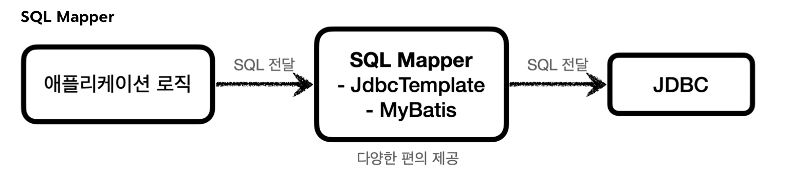

## DB 접근 기술 의존 관계 Flow
- JDBC 활용 기술 (SQLMapper, ORM)
	- -> DataSource 인터페이스
		- -> Connection Pool의 DataSource 구현체 사용
			- 초기화 과정: -> DriverManager -> JDBC Connection 인터페이스 (DB Driver)
		- -> `DriverManagerDataSource` DataSource 구현체 사용
			- 매 연결 시: -> DriverManager -> JDBC Connection 인터페이스 (DB Driver)
## 데이터베이스 변경 문제
- 일반적인 애플리케이션 서버와 DB 사용법
	- 커넥션 연결 (TCP/IP)
	- SQL 전달 (with 커넥션)
	- 결과 응답
- 문제는 **데이터베이스마다 사용법이 모두 다름** (커넥션 연결, SQL 전달, 결과 응답 방법)
- 데이터베이스 변경시 **애플리케이션의 DB 사용코드도 함께 변경**해야 하고, **개발자의 학습량**이 늘어남
## JDBC 표준 인터페이스(Java Database Connectivity)

- 자바에서 **여러 데이터베이스에 편리하게 접속**할 수 있도록 도와주는 3가지 **표준 인터페이스**
	- **`java.sql.Connection`** (커넥션 연결)
	- **`java.sql.Statement`** (SQL을 담은 내용)
	- **`java.sql.ResultSet`** (결과 응답)
- **JDBC 드라이버**
	- 각각의 DB 벤더들이 JDBC 인터페이스를 자신의 DB에 맞도록 **구현한 라이브러리**
	- 예시: MySQL JDBC 드라이버,  Oracle JDBC 드라이버 etc...
- 장점
	- 애플리케이션 로직이 **JDBC 표준 인터페이스에만 의존**하므로, 
	  DB 변경시 **애플리케이션 코드를 그대로 유지**하고 **JDBC 구현 라이브러리만 변경 가능**
	- **개발자는 JDBC 표준 인터페이스 사용법만 학습**하면, 모든 DB 연결 가능
- 한계
	- DB마다 SQL 역시 사용법의 차이가 있어, DB 변경 시 **여전히 SQL은 그에 맞도록 변경**해야 함
	- 다만, JPA를 사용하면 이 역시도 많은 부분 해결됨
## JDBC 활용 기술
- JDBC(1997)는 오래된 기술이고 사용 방법도 복잡
- 직접 사용하기보다는 이를 **편리하게 사용할 수 있는 다른 기술들을 활용** (내부에서 JDBC 사용)
- **SQL Mapper**
	
	- 장점
		- SQL 응답 결과를 **객체로 편리하게 변환**
		- **JDBC 반복 코드를 제거**
		- 낮은 러닝커브 (SQL만 작성할 줄 알면 금방 배워 사용 가능)
	- 단점
		- 개발자가 직접 SQL 작성
	- Spring JdbcTemplate, MyBatis
- **ORM**
	
	- 장점
		- SQL 직접 작성하지 않아 **개발 생산성** 크게 상승 (**SQL을 동적으로 생성 및 실행**)
		- 데이터베이스마다 **다른 SQL을 사용하는 문제를 중간에서 해결**
	- 단점
		- 러닝커브가 높음
	- JPA (하이버네이트, 이클립스 링크...)
## JDBC DriverManager

- **`DriverManager`** (JDBC가 제공)
	- **라이브러리에 등록된 DB 드라이버들을 관리**
	- **커넥션 획득** 기능 제공 (JDBC 표준 인터페이스 **`Connection`**)
- **커넥션 획득 과정**
	- `Connection connection = DriverManager.getConnection(URL, USERNAME, PASSWORD);`
	- `DriverManager`는 라이브러리에 등록된 DB 드라이버 목록을 **자동으로 인식**
	- 드라이버들에게 순서대로 다음 정보를 넘겨서 **커넥션 획득 가능 여부 확인**
		- 접속에 필요한 정보: URL, 이름, 비밀번호...
		- 커넥션 획득 가능한 드라이버는 바로 **실제 DB에 연결해 커넥션 구현체 반환** 
		  (URL 등을 통해 판단)
		- 커넥션 획득 불가능한 드라이버는 다음 드라이버에게 순서를 넘김
- 커넥션 사용
	- 쿼리 준비
		- **`PreparedStatement`**(`pstmt`) 주로 사용 (**`Statement`의 자식 인터페이스**)
			- 전달할 SQL과 파라미터로 전달할 데이터를 바인딩
			- 파라미터 바인딩 방식은 SQL Injection 예방
		- 코드
			- `pstmt = con.prepareStatement(sql)`
			- `pstmt.setString(1, member.getMemberId)`
			- `pstmt.setInt(2, member.getMoney())`
	- 쿼리 실행
		- 조회
			- **`executeQuery()`**
				- `SELECT` 쿼리 조회 후 `ResultSet` 반환
				- `rs = pstmt.executeQuery()`
			- **`ResultSet`** (JDBC 표준 인터페이스)
				- `executeQuery()`의 반환 타입
				- `select` 쿼리 결과가 순서대로 들어가 있음
				- 내부의**커서**(Cursor)를 이동해 다음 데이터 조회 (`rs.next()`)
					- **최초 커서는 데이터를 가리키고 있지 않아서**, 한 번 `rs.next()` 호출해야 조회 가능
					- `rs.next()` 결과가 true면 데이터 있음, false면 데이터 없음
					- 원하는 커서 위치에서 키 값으로 데이터 획득 (`rs.getString`, `rs.getInt`...)
		- 갱신
			- **`executeUpdate()`**
				- 갱신 쿼리 실행 후 영향 받은 Row 수 반환
				- `pstmt.executeUpdate()`
## 커넥션 풀 (Connection Pool)
- 애플리케이션 시작 시점에 필요한 만큼 **커넥션을 미리 생성**해 풀에 **보관** (`DriverManager` 사용)
- 풀 내에 커넥션은 모두 TCP/IP로 **DB와 연결**되어 즉시 SQL 전달 가능
- **애플리케이션 로직**은 커넥션 풀을 통해 **이미 생성된 커넥션 획득 및 반환**
	- 애플리케이션 로직은 **DB 드라이버를 통하지 않음**
	- 커넥션을 단순히 **객체 참조**로 가져다 쓰면 됨
	- 다 사용한 **커넥션은 종료하지 않고** 그대로 커넥션 풀에 반환
- **적절한 커넥션 풀 숫자**
	- 스펙에 따라 다르기 떄문에 **성능 테스트**를 통해 정해야 함 (기본값은 보통 10개)
	- 서버 당 최대 커넥션 수를 제한 가능 (무한정 커넥션 생성을 막아 DB 보호)
- **hikariCP** 주로 사용

>커넥션 풀 없는 DB 커넥션 획득 과정
>
>1. 애플리케이션 로직이 DB 드라이버 통해 커넥션 조회 (TCP/IP 연결, 3 way handshake)
>2. 연결 후 드라이버는 ID, PW 및 기타 부가정보를 DB에 전달
>3. DB는 ID, PW로 내부 인증을 하고, 내부에 DB 세션을 생성 후 커넥션 생성 완료 응답
>4. DB 드라이버는 커넥션 객체를 생성해서 클라이언트에 반환
>
>-> 통신에 **리소스가 많이 들고**, 커넥션 생성 시간이 매번 추가되어 **사용자 경험이 안좋아짐**
>
>그래서 **커넥션 풀은 이 과정을 애플리케이션 시작 시점에 미리 진행**

>커넥션 생성 시간
>
>커넥션 생성시간은 MySQL 계열 DB에서는 수 ms 정도로 매우 빨리 커넥션을 확보한다. 
>반면에 수십 ms 이상 걸리는 DB들도 있다.

## DataSource 인터페이스

- 문제
	- 커넥션을 획득하는 다양한 방법 존재
		- JDBC DriverManager 직접 사용 (신규 커넥션 생성)
		- DBCP2 커넥션 풀
		- HikariCP 커넥션 풀
	- 커넥션 획득방법을 변경하면 **애플리케이션 코드도 함께 변경해야 함**
- **`DataSource`** (해결책)
	- **커넥션을 획득하는 방법을 추상화**한 인터페이스
	- 핵심 기능은 **커넥션 조회** (`getConnection` -> `Connection`)
	- 애플리케이션 코드는 **`DataSource`에 의존**
		- 각각의 **커넥션풀의 `DataSource` 구현체**를 갈아끼우기
		- `DriverManager`의 경우 `DataSource` 구현체로 **`DriverManagerDataSource`** 사용
	- 인터페이스에 의존하므로, 커넥션 획득 방법 변경해도 **애플리케이션 코드 변경 X**
