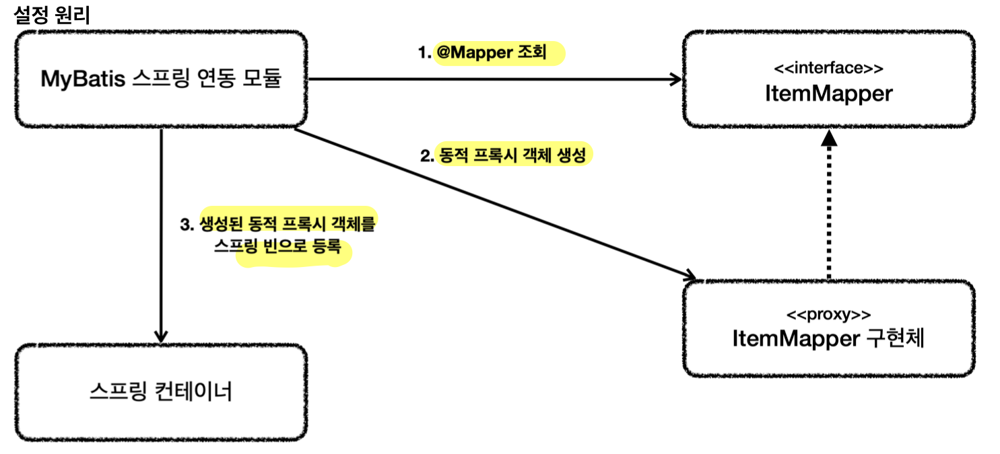

# 데이터 관련 테크닉
## DTO (Data Transfer Object)
- 기능은 없고 **데이터를 전달**만 하는 용도로 사용하는 객체
	- 기능이 있어도 주 기능이 데이터 전달이면 DTO라 할 수 있음
- 네이밍 컨벤션은 자유여서 DTO를 꼭 붙이지 않아도 됨
- DTO는 최종 호출되는 곳이 소유자이므로, **소유자가 있는 패키지**에 위치하는 것이 맞다!
	- 보통은 리포지토리 패키지에 위치할 것이고, 만일 서비스에서 사용이 끝난다면 서비스 패키지에 둠
	- 이를 지키지 않으면 **순환참조**가 발생할 수 있음
## 별칭 (as)
- **별칭**을 사용하면 **DB 컬럼 이름과 객체의 이름의 표기법이 불일치**하거나 **이름이 아얘 다른 문제** 해결 가능
	- 관례적으로 **DB는 snake case**를 쓰고 **자바는 camel case**를 써서 문제 발생
	- BeanProperty 관련 기능을 쓸 때, `select item_name` 쿼리의 경우 `setItem_name()`이라는 메서드가 없으므로 문제가 생기는데 `select item_name as itemName`은 불일치 문제를 해결
- 보통 **DB 관련 기능들은 표기법 자동 변환을 지원**
	- `NamedParameterJdbcTemplate`의 `BeanPropertyRowMapper()` 등
- **컬럼 이름과 객체 이름이 완전히 다를 때만 SQL에서 별칭을 사용**하면 됨
## 테스트 원칙과 방법
- 테스트는 **다른 환경과 철저히 분리**해야 함
	1. **메모리 모드** (=임베디드 모드)
		- **DB를 애플리케이션에 내장해 함께 실행** (애플리케이션 실행 시 **DB를 JVM 메모리에 포함**)
		- 애플리케이션이 종료되면 임베디드 모드 DB도 함께 종료되고 데이터도 모두 사라짐
		- **DB 초기화 SQL 스크립트** 필요 (테이블 생성 etc...)
			- 스프링 부트가 SQL 스크립트를 실행해 **애플리케이션 로딩 시점에 DB 초기화** 제공
			- 위치와 파일 이름 일치 필요
				- **`src/test/resources/schema.sql`**
			- SQL 실행 로그 확인 방법 (`application.properties`)
				- `logging.level.org.springframework.jdbc=debug`
		- 방법
			1. **별 다른 DB 설정 안하기**
				- 스프링 부트는 별 다른 DB 설정이 없으면 **메모리 DB로 접속**
				- `src/test/resources/application.properties`의 DB 접근 정보 지우기
			2. 테스트 프로필로 메모리 DB 접속하는 `dataSource` 빈 등록하기
				- `jdbc:h2:mem:db` 등의 메모리 주소로 데이터 소스 생성 및 사용
	2. 테스트 전용 DB 사용하기
		- 다른 이름의 데이터베이스를 하나 생성하고 테스트 시에는 해당 주소에 접속
- 테스트는 **다른 테스트와 격리**해야 하고 **반복 실행**할 수 있어야 함
	- **트랜잭션 & 롤백 전략**
		- 각각의 테스트를 **시작할 때 트랜잭션을 열고 끝날 때 해당 트랜잭션을 롤백**
		- 방법
			1. **`@Transactional`**
				- 기본은 로직이 성공적으로 수행되면 커밋
				- **테스트에서 사용**하면, 테스트를 각각 트랜잭션 안에서 실행하고 **끝나면 자동 롤백**
					- 트랜잭션 전파로 서비스, 리포지토리도 테스트에서 시작한 같은 트랜잭션에 참여
				- 클래스, 메서드 단위 적용 가능
				- 간혹 테스트에서 실제 저장을 하고 싶을 때는 `@Commit`을 테스트에 함께 붙이면 됨
			2. `@BeforeEach`, `@AfterEach`에서 트랜잭션 열고 롤백
				- `transactionManager.getTransaction(...);`
				- `transactionManager.rollback();`
## 테스트 유의점
- 테스트시 `application.properties`는 `src/test/resources`에 있는 것이 우선순위 실행
- `@SpringBootTest`: `@SpringBootApplication`을 찾아 설정으로 사용
# SQL Mapper 종류
## 선택기준
- ORM 기술 스택을 사용하면, **네이티브 SQL**을 사용할 때 **JdbcTemplate 수준에서 거의 해결**될 것
- 따라서, **단순한 쿼리**가 많다면 **JdbcTemplate** 사용
- 반면에, 프로젝트에 **복잡한 쿼리**가 많다면 **MyBatis** 사용
- 둘 다 사용해도 되지만, MyBatis를 선택했다면 그것으로 충분할 것
## JdbcTemplate
- 장점
	- **설정의 편리함**
		- **`spring-jdbc`** 라이브러리에 포함되어 있어 간단하게 바로 사용 가능
		- `spring-jdbc`는 스프링으로 JDBC 사용할 때 기본으로 사용되는 라이브러리
	- **반복 문제 해결**
		- 템플릿 콜백 패턴으로 JDBC를 직접 사용할 때 발생하는 **반복 작업을 대신 처리**
- 단점
	- **동적 SQL 해결이 어려움**
	- SQL을 자바 코드로 작성하기 때문에, **SQL 라인이 넘어갈 때 마다 문자 더하기**를 해주어야 함
- 패키지 설정
	- `implementation 'org.springframework.boot:spring-boot-starter-jdbc'`
- 추가 설정(**`application.properties`**)
	- SQL 로그: `logging.level.org.springframework.jdbc=debug`
	- main, test 모두 추가
- 주요 기능
	- `JdbcTemplate`
		- 순서 기반 파라미터 바인딩 지원
		- 객체 생성
			- `private final JdbcTemplate template`
			- `template = new JdbcTemplate(dataSource);`
		- 단건 조회
			- `template.queryForObject(sql, memberRowMapper(), memberId);`
			- 결과 로우가 하나일 때 사용
			- 결과가 없으면 `EmpytyResultDataAccessException` 발생
			- 결과가 둘 이상이면 `IncorrectResultSizeDataAccessException` 발생
		- 리스트 조회
			- `template.query(sql, memberRowMapper(), param.toArray());`
			- 결과가 하나 이상일 때 사용
			- 결과 없으면 빈 컬렉션을 반환
		- 갱신
			- `template.update(sql, money, memberId);`
			- `KeyHolder`
				- DB가 Identity (auto increment) 전략을 사용할 때, Insert 완료 후 PK 값을 채움
		- 임의의 SQL (DDL 등)
			- `jdbcTemplate.execute("create table mytable (id integer, name varchar(100))");`
		- 응답 결과 매핑
			- **`RowMapper`**
			- 데이터베이스의 반환 결과인 `ResultSet`을 객체로 변환
				```java
				private RowMapper<Member> memberRowMapper() {
					return (rs, rowNum) -> {
						Member member = new Member();
						member.setMemberId(rs.getString("member_id"));
						member.setMoney(rs.getInt("money"));
						return member;
					}; 
				}
				```
	- **`NamedParameterJdbcTemplate`** (**권장**)
		- **이름 기반 파라미터 바인딩** 지원
		- 객체 생성
			- `private final NamedParameterJdbcTemplate template;`
			- `template = new NamedParameterJdbcTemplate(dataSource);`
		- 자주 사용하는 파라미터 종류
			- **`Map`**
				- `Map<String, Object> param = Map.of("id", id);`
				- `Item item = template.queryForObject(sql, param, itemRowMapper());`
			- **`MapSqlParameterSource`**
				```java
				SqlParameterSource param = new MapSqlParameterSource() 
						.addValue("itemName", updateParam.getItemName()) 
						.addValue("price", updateParam.getPrice()) 
						.addValue("quantity", updateParam.getQuantity()) 
						.addValue("id", itemId);
				template.update(sql, param);
				```
			- **`BeanPropertySqlParameterSource`**
				- 자바빈 프로퍼티 규약을 통해 자동으로 파라미터 객체 생성
				- 전달하는 객체에 `getXxx` 메소드가 있어야 함
				```java
				SqlParameterSource param = new BeanPropertySqlParameterSource(item);
				KeyHolder keyHolder = new GeneratedKeyHolder();
				template.update(sql, param, keyHolder);
				```
		- 응답 결과 매핑
			- **`BeanPropertyRowMapper`**
			- `ResultSet`의 결과를 받아서 자바빈 규약에 맞추어 데이터를 변환
				```java
				private RowMapper<Item> itemRowMapper() {
					return BeanPropertyRowMapper.newInstance(Item.class); 
					//camel 변환 지원
				}
				```
	- **`SimpleJdbcInsert`**
		- **INSERT SQL**을 직접 작성하지 않아도 되도록 지원
		- 생성 시점에 DB 테이블 메타 데이터 조회, 어떤 칼럼이 있는지 확인 (`usingColumns` 생략 가능)
		- 객체 생성
			- `private final SimpleJdbcInsert jdbcInsert;`
			- `jdbcInsert = new SimpleJdbcInsert(dataSource)`
			- `    .withTableName("item")`
			- `    .usingGeneratedKeyColumns("id");`
			- `    // .usingColumns("item_name", "price", "quantity"); //생략 가능`
		- 삽입
			```java
			SqlParameterSource param = new BeanPropertySqlParameterSource(item);
			Number key = jdbcInsert.executeAndReturnKey(param); //생성된 키 자동 조회
			```
	- `SimpleJdbcCall`
		- 스토어드 프로시저를 편리하게 호출 가능
## MyBatis
- `JdbcTemplate`의 대부분의 기능 및 추가 기능 제공
- 장점
	- SQL을 **XML**에 편리하게 작성 가능 (**문자 더하기 불편 X**)
	- **동적 쿼리**를 편리하게 작성 가능
- 단점
	- **약간의 설정**이 필요
- 패키지 설정
	- `implementation 'org.mybatis.spring.boot:mybatis-spring-boot-starter:2.2.0`
		- 스프링 부트가 관리해주는 공식 라이브러리가 아니므로 뒤에 버전 정보를 붙여야 함
		- 스프링 부트 3.0 이상 -> `mybatis-spring-boot-starter` 3.0.3 사용
- 추가 설정 (**`application.properties`**)
	```java
	mybatis.type-aliases-package=hello.itemservice.domain //패키지 이름
	mybatis.configuration.map-underscore-to-camel-case=true
	logging.level.hello.itemservice.repository.mybatis=trace
	```
	- `mybatis.type-aliases-package`
		- 마이바티스에서 타입 정보 사용할 때 패키지 이름을 적어야 하는데, 여기 명시 시 생략 가능
		- 지정 패키지 및 하위 패키지까지 자동 인식
		- 여러 위치 지정 시 `,`, `;`로 구분
	- `mybatis.configuration.map-underscore-to-camel-case`
		- 언더바 -> 카멜 케이스 자동 변경 기능 활성화
		- DB 컬럼 이름과 자바 객체 이름 사이의 불일치 해결
	- `logging.level.hello.itemservice.repository.mybatis=trace`
		- 쿼리 로그 확인
	- main, test 모두 추가
- 주요 기능
	- **매퍼 인터페이스**
		- **`@Mapper`**
			- 마이바티스 매핑 XML을 호출해주는 **매퍼 인터페이스에 `@Mapper` 애노테이션을 적용**
			- 매퍼 인터페이스의 메서드를 호출하면 **연결된 XML의 SQL을 실행**하고 결과를 반환
		- 원리
			
			- 애플리케이션 로딩 시점에 **MyBatis 스프링 연동 모듈**이 `@Mapper` 인터페이스 조회
			- **동적 프록시 기술**을 사용해 조회된 해당 **인터페이스들의 구현체를 생성**
			- 생성한 구현체를 **스프링 빈으로 등록**
		- 매퍼 구현체
			- MyBatis 스프링 연동 모듈이 생성한 구현체 덕에 인터페이스만으로 깔끔하게 사용 가능
			- MyBatis 예외를 **스프링 예외 추상화**인 **`DataAccessException`에 맞게 변환**해 반환
	- **XML 매핑 파일**
		```xml
		<?xml version="1.0" encoding="UTF-8"?>
		<!DOCTYPE mapper PUBLIC "-//mybatis.org//DTD Mapper 3.0//EN"
		        "http://mybatis.org/dtd/mybatis-3-mapper.dtd">
		<mapper namespace="hello.item.repository.mybatis.ItemMapper">
		    <insert id="save" useGeneratedKeys="true" keyProperty="id">
			    insert into item (item_name, price, quantity)
		        values (#{itemName}, #{price}, #{quantity})
			</insert>
			
		    <update id="update">
		        update item
		        set item_name=#{updateParam.itemName},
		            price=#{updateParam.price},
		            quantity=#{updateParam.quantity}
		        where id = #{id}
		    </update>
		    
		    <select id="findById" resultType="Item">
		        select id, item_name, price, quantity
		        from item
		        where id = #{id}
			</select>
			
			<select id="findAll" resultType="Item">
		        select id, item_name, price, quantity
		        from item
		        <where>
		            <if test="itemName != null and itemName != ''">
		                and item_name like concat('%',#{itemName},'%')
		            </if>
		            <if test="maxPrice != null">
		                and price &lt;= #{maxPrice}
		            </if>
		        </where>
		    </select>
		    
		</mapper>
		```
		- `src/main/resources` 하위에 **매핑 인터페이스와 패키지 위치를 똑같이 맞추어 생성**
			- `src/main/resources/hello/item/repository/mybatis/ItemMapper.xml`
		- `namespace`
			- 매퍼 인터페이스를 지정
		- XML 파일 경로 수정 (`application.properties)
			- `mybatis.mapper-locations=classpath:mapper/**/*.xml`
			- `resources/mapper`를 포함한 하위 폴더의 XML을 매핑 파일로 인식
			- main, test 모두 적용
	- 기본 쿼리
		- `<insert>`
			```xml
			<insert id="save" useGeneratedKeys="true" keyProperty="id">
			    insert into item (item_name, price, quantity)
			    values (#{itemName}, #{price}, #{quantity})
			</insert>
			```
			- `id`: 매퍼 인터페이스에 설정한 메서드 이름 지정
			- `#{}`: 파라미터 바인딩
			- `useGeneratedKeys`: IDENTITY 전략일 때 사용
			- `keyProperty`: 생성되는 키 이름 지정
		  - `<update>`
			```java
			import org.apache.ibatis.annotations.Param;
			
			void update(@Param("id") Long id, @Param("updateParam") ItemUpdateDto updateParam);
			```
			```xml
			<update id="update">
			    update item
			    set item_name=#{updateParam.itemName},
			        price=#{updateParam.price},
			        quantity=#{updateParam.quantity}
			    where id = #{id}
			</update>
			```
			- `@Param`: 파라미터가 2개 이상이면 애노테이션으로 이름을 지정해 구분해야 함
		- `<select>`
			```xml
			<select id="findById" resultType="Item">
			     select id, item_name, price, quantity
			     from item
			     where id = #{id}
			</select>
			```
			- `resultType`: 반환 타입 명시
			- SQL 결과를 편리하게 객체로 변환
		  - **`<select>` 동적 쿼리**
			```xml
			<select id="findAll" resultType="Item">
			     select id, item_name, price, quantity
			     from item
			     <where>
			        <if test="itemName != null and itemName != ''">
			            and item_name like concat('%',#{itemName},'%')
			        </if>
			        <if test="maxPrice != null">
			            and price &lt;= #{maxPrice}
			        </if>
			    </where>
			</select>
			```
			- **`<if>`**: 모두 실패해면 `where`를 만들지 않고, 하나라도 성공하면 `where`, `and` 자동 지원
			- XML 특수문자
				- XML은 태그 사용으로 인해 **특수문자 사용이 제한** 되어 다음과 같은 **연산 키워드** 지원
				- `&lt` (<), `&gt` (>), `&amp` (&)
			- CDATA
				- CDATA 구문 내에서는 특수문자 사용 가능
				- `<![CDATA[ and price <= #{maxPrice} ]]>`
			- 다른 동적 쿼리 형태
				- `<choose>`, `<when>`, `<otherwise>`: switch 구문과 유사
				- `<foreach>`: 컬렉션 반복 처리 시 사용
	- 애노테이션 SQL 작성
		- 인터페이스 메서드에 적용
		- `@Select`, `@Insert`, `@Update`, `@Delete`
			- `@Select("select id, item_name, price from item where id=#{id}")`
		- MyBatis의 장점은 XML에 있으므로 가끔 간단한 쿼리 정도에만 사용하고 **거의 사용 X**
		- 동적 SQL도 어려움
	- `<sql>`
		- **SQL 코드를 재사용** 가능
			- `<sql id="userColumns"> ${alias}.id,${alias}.username,${alias}.password </sql>`
		- `<include>`로 sql 조각을 찾아 사용
			- `<include refid="userColumns"><property name="alias" value="t1"/></include>`
	- `<resultMap>`
		- DB 컬럼 이름과 객체 이름 불일치 문제를 별칭 사용 대신 **사용자 지정 매핑**으로 해결


