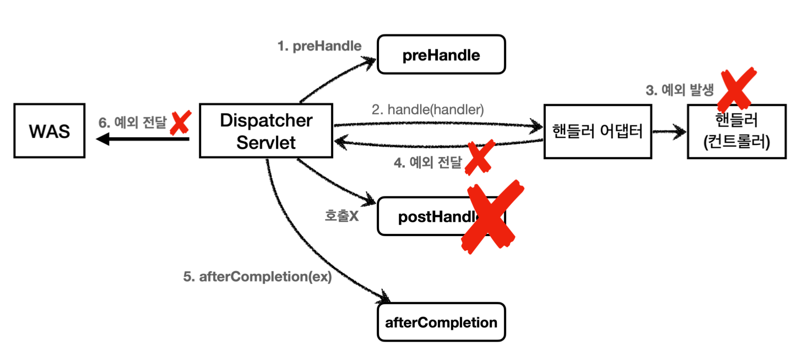
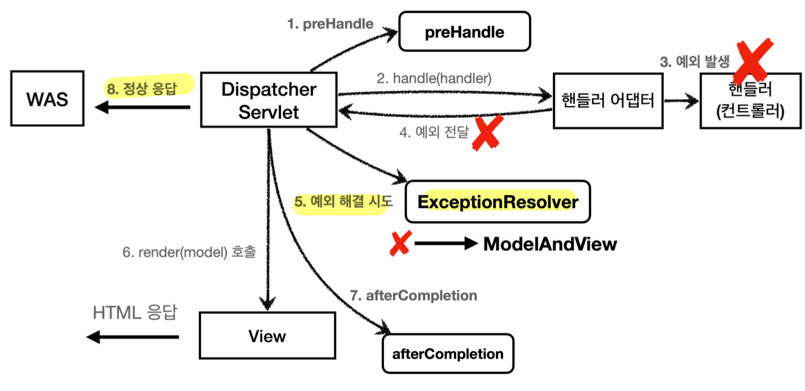

## 서블릿 예외 처리
- 순수 서블릿 컨테이너는 2가지 방식으로 예외 처리 지원
	- `Exception`
		- **WAS**(**여기까지 전파**) <- 필터 <- 서블릿 <- 인터셉터 <- **컨트롤러**(**예외발생**)
			- **웹 애플리케이션**은 서블릿 컨테이너 안에서 실행
			- 애플리케이션 내에서 예외를 잡지 못하고 **서블릿 밖으로 WAS까지 예외가 전달**되는 상황
			- **WAS**(**톰캣**)가 **500 상태코드**로 처리 (서버에서 처리할 수 없는 오류로 판단)
				- 스프링 부트 사용시 **스프링 부트 기본 예외 페이지** 보여줌
				- 아닐 시 **tomcat 기본 제공 오류 화면**
				- 참고) 없는 자원 접근 시 스프링 부트 혹은 tomcat의 404 예외 페이지 보여줌
	- `response.sendError(HTTP 상태 코드, 오류 메시지)`
		- **WAS**(sendError 호출 기록 확인) <- 필터 <- 서블릿 <- 인터셉터 <- **컨트롤러** (**response.sendError()**)
			- 호출 시 **`response` 내부**에 **오류가 발생했다는 상태**를 저장
			- 서블릿 컨테이너는 **응답 전에 해당 상태를 보고** 오류 코드에 맞는 **기본 오류 페이지** 제공
		- `HttpServletResponse` 메서드
		- 호출 시 **서블릿 컨테이너에게 오류가 발생했다고 전달**
		- 실제로 예외가 발생하지는 않고 **정상 리턴으로 WAS까지 전달**
## 서블릿 오류 페이지
- 서블릿 오류 페이지 등록 (스프링 부트를 통한 커스터마이징)
	- `ErrorPage` 설정
		```java
		@Component
		public class WebServerCustomizer implements WebServerFactoryCustomizer<ConfigurableWebServerFactory> {
		    
		    @Override
		    public void customize(ConfigurableWebServerFactory factory) {
		    
		        ErrorPage errorPage404 = new ErrorPage(HttpStatus.NOT_FOUND, "/error-page/404");
		        ErrorPage errorPage500 = new ErrorPage(HttpStatus.INTERNAL_SERVER_ERROR, "/error-page/500");
				ErrorPage errorPageEx = new ErrorPage(RuntimeException.class, "/error-page/500");
		        
		        factory.addErrorPages(errorPage404, errorPage500, errorPageEx);
			} 
		}
		```
		- `sendError`, `Exception` 발생 상황에 따라 설정한 컨트롤러 URL 호출
	- 오류 페이지 컨트롤러
		```java
		@Slf4j
		@Controller
		public class ErrorPageController {
		
			@RequestMapping("/error-page/404")
		    public String errorPage404(HttpServletRequest request, HttpServletResponse response) {
		        log.info("errorPage 404");
		        return "error-page/404";
		    }
		
			@RequestMapping("/error-page/500")
		    public String errorPage500(HttpServletRequest request, HttpServletResponse response) {
		        log.info("errorPage 500");
		        return "error-page/500";
		    }
		}
		```
		- 컨트롤러가 개발자가 만든 오류 페이지 뷰 리턴
- **오류 페이지 작동 원리**
	- 예외 발생과 오류 페이지 요청 흐름
		- WAS(여기까지 전파) <- 필터 <- 서블릿 <- 인터셉터 <- 컨트롤러(예외발생)
		- WAS `/error-page/500` **다시 요청** -> 필터 -> 서블릿 -> 인터셉터 -> 컨트롤러(`/error-page/1`) -> View
	- 정상 요청, 예외 발생과 오류 페이지 요청 흐름 (Ver. 필터, 인터셉터 중복 호출 제거)
		- WAS(`/error-ex`, `dispatchType=REQUEST`) -> 필터 -> 서블릿 -> 인터셉터 -> 컨트롤러
		- WAS(여기까지 전파) <- 필터 <- 서블릿 <- 인터셉터 <- 컨트롤러(예외발생)
		- WAS 오류 페이지 확인
		- WAS(`/error-page/500`, `dispatchType=ERROR`) -> 필터(x) -> 서블릿 -> 인터셉터(x) -> 컨트롤러(`/error-page/500`) -> View 
	- 고객(클라이언트)은 한 번 요청하지만, **서버 내부적으로 컨트롤러 2번 호출**
		- 재호출 시 WAS는 오류 정보를 `request` 객체에 담아 보내줌 (`setAttribute()`)
		- 오류정보는 다음 키에 대응
			- `javax.servlet.error.exception` : 예외 
			- `javax.servlet.error.exception_type` : 예외 타입 
			- `javax.servlet.error.message` : 오류 메시지 
			- `javax.servlet.error.request_uri` : 클라이언트 요청 URI 
			- `javax.servlet.error.servlet_name` : 오류가 발생한 서블릿 이름 
			- `javax.servlet.error.status_code` : HTTP 상태 코드
	- 오류 페이지 출력을 위한 **내부 요청**은 **보통 필터, 인터셉터 중복 호출을 피하는게 효율적**
		- 필터는 **`DispatcherType`** 통해 중복 호출 제거 (`dispatchType=REQUEST`)
			- 서블릿은 요청 종류를 구분할 수 있도록 **`DispatcherType`** 제공 
			  (`HttpServletRequest`에 포함)
				- **`DispatcherType.REQUEST`**: 클라이언트 요청 (필터의 **기본값**)
				- **`DispatcherType.ERROR`**: 오류 요청
				- `DispatcherType.FORWARD`: 서블릿에서 다른 서블릿이나 JSP를 호출할 때
				- `DispatcherType.INCLUDE`: 서블릿에서 다른 서블릿이나 JSP의 결과 포함할 때
				- `DispatcherType.ASYNC`: 서블릿 비동기 호출
			- 필터 호출 여부 등록 예시
				- `filterRegistrationBean.setDispatcherTypes(DispatcherType.REQUEST, DispatcherType.ERROR);`
				- 이 경우, 클라이언트 요청과 오류 페이지 요청 모두 필터 호출
		- 인터셉터는 **경로 정보**로 중복 호출 제거 (`excludePathPatterns("/error-page/**")`)
			- 인터셉터는 서블릿이 아니라 스프링이 제공하는 기능 -> `DispatcherType`과 무관
			- 따라서, **`excludePathPatterns`** 에 **오류 페이지 경로를 추가**하는 방식 사용

>자바 메인 메서드에서 Exception 발생 상황
>
>자바는 메인 메서드 직접 실행 시 `main()`이라는 이름의 쓰레드가 실행된다.
>만일, **`main()` 메서드 넘어 예외가 던져지면**, 예외 정보를 남기고 **해당 쓰레드가 종료된다.**

## 스프링 부트 오류 페이지
- **스프링 부트**는 서블릿의 복잡한 오류 페이지 작동 과정을 **기본으로 제공**
	- **`/error`** 기본 경로로 **기본 오류 페이지 설정** (`ErrorPage` 자동 등록)
		- `ErrorMvcAutoConfiguration` 클래스가 오류 페이지 자동 등록
	- **`BasicErrorController`** 스프링 컨트롤러를 **자동 등록**
		- `ErrorPage`에서 등록한 `/error` 경로를 매핑해 처리
- **개발자는 오류 페이지만 등록하면 됨**
	- **규칙에 따른 경로 위치**에 **HTTP 상태 코드 이름의 뷰 파일**을 넣어두면 됨
	- `BasicErrorController`가 구현된 기본 로직으로 처리
		- 뷰 선택 우선순위 (구체적인게 더 우선순위 높음)
			- 뷰 템플릿 - 1 순위
				- `resources/templates/error/500.html` 
				- `resources/templates/error/5xx.html`
			- 정적 리소스( `static` , `public` ) - 2 순위
				- `resources/static/error/400.html` 
				- `resources/static/error/404.html` 
				- `resources/static/error/4xx.html`
			- 적용 대상이 없을 때 뷰 이름(`error`) - 3 순위
				- `resources/templates/error.html`
	- `BasicErrorController`는 오류 관련 정보를 model에 담아 뷰로 전달 가능
		- 다만, **오류 정보 model 포함 여부는 선택 가능**
		- **실무에서는 노출 X**
			- 고객에게 오류 관련 내부 정보를 노출하는 것은 좋지 않음
			- **고객에겐 정제된 오류화면 보이고, 서버에 오류를 로그로 남길 것**
			- `application.properties`
				```yml
				server.error.include-exception=true //exception 포함여부
				server.error.include-message=on_param //message 포함여부
				server.error.include-stacktrace=on_param //trace 포함여부
				server.error.include-binding-errors=on_param //errors 포함여부
				```
				- `true/false`가 아닌 값은 다음 3가지 옵션 사용 가능 (**기본값**: **`never`**)
					- `never` : 사용하지 않음
					- `always` :항상 사용
					- `on_param` : 파라미터가 있을 때 사용
		- 참고로 다음 정보를 뷰 템플릿에서 활용 가능
			- `timestamp`: Fri Feb 05 00:00:00 KST 2021
			* `status`: 400
			* `error`: Bad Request
			* `exception`: `org.springframework.validation.BindException `
			* `trace`: 예외 trace
			* `message`: Validation failed for object='data'. Error count: 1
			* `errors`: Errors(BindingResult)
			* `path`: 클라이언트 요청 경로 (`/hello`)

>스프링 부트 오류 관련 옵션 (`application.properties`)
>
>`server.error.whitelabel.enabled=true`: 스프링 whitelabel 오류 페이지 적용 여부
>`server.error.path=/error`: 오류 페이지 자동 등록 경로 (**사용할 일 거의 없음**)

>확장 포인트
>
>에러 공통 처리 컨트롤러의 기능 변경을 원할 때, `ErrorController` 인터페이스를 상속 받아 구현하거나 `BasicErrorController` 를 상속 받아 기능을 추가할 수 있다.
>**사용할 일은 거의 없다.**

## API 예외 처리
- API는 예외 처리는 조금 더 **복잡함**
	- **각 오류 상황에 맞는 오류 응답 스펙**을 정의
	- **JSON**으로 데이터 응답
- **`@ExceptionHandler`** (**실무 사용 권장**)
	- `BasicErrorController` 사용이나 `HandlerExceptionResolver` 직접 구현은 
	  API 예외를 다루기 어려움
	- 어려운 점
		- `HandlerExceptionResolver`에서 ModelAndView 반환 - API 응답에 필요 없음
		- API 응답을 위해 `HttpServletResponse`로 직접 응답 데이터 넣음 - 서블릿 시절 회귀
		- 컨트롤러마다 예외를 별도 처리하기 어려움 - 같은 `RuntimeException`을 다르게 처리 어려움
	- 스프링이 만들어둔 구현체 **`ExceptionHandlerExceptionResolver`** 사용
	- 사용 방법
		- **애노테이션**과 함께 해당 컨트롤러에서 처리하고 싶은 **예외**를 **메서드에 지정**
			- 해당 컨트롤러에서 예외가 발생하면 메서드 호출
			- 예외는 자기자신과 그 자식까지 포함
		- 예외 생략
			```java
			@ExceptionHandler
			public ResponseEntity<ErrorResult> userExHandle(UserException e) {}
			```
			- `@ExceptionHandler`에 예외를 **생략**하면 **메서드 파라미터의 예외를 자동 지정**
		- 상속관계 예외에 대한 `@ExceptionHandler` 우선순위
			- `@ExceptionHandler(부모예외.class)` < **`@ExceptionHandler(자식예외.class)`**
			- 자세한 것이 우선권
		- 다양한 예외 한번에 처리
			```java
			@ExceptionHandler({AException.class, BException.class})
			public String ex(Exception e) {
			    log.info("exception e", e);
			}
			```
		- `ModelAndView`를 리턴해 오류 화면 응답도 가능하지만 **잘 사용하지 않음**
			```java
			@ExceptionHandler(ViewException.class)
			public ModelAndView ex(ViewException e) {
			    log.info("exception e", e);
			    return new ModelAndView("error");
			}
			```
	- 예시 코드
		```java
		@Slf4j
		@RestController
		public class ApiExceptionV2Controller {
		    
		    @ResponseStatus(HttpStatus.BAD_REQUEST)
		    @ExceptionHandler(IllegalArgumentException.class)
		    public ErrorResult illegalExHandle(IllegalArgumentException e) {
		        log.error("[exceptionHandle] ex", e);
		        return new ErrorResult("BAD", e.getMessage());
		    }
		    
		    @ExceptionHandler
		    public ResponseEntity<ErrorResult> userExHandle(UserException e) {
		        log.error("[exceptionHandle] ex", e);
		        ErrorResult errorResult = new ErrorResult("USER-EX", e.getMessage());
		        return new ResponseEntity<>(errorResult, HttpStatus.BAD_REQUEST);
		    }
		    
			@ResponseStatus(HttpStatus.INTERNAL_SERVER_ERROR)
			@ExceptionHandler
			public ErrorResult exHandle(Exception e) {
			    log.error("[exceptionHandle] ex", e);
				return new ErrorResult("EX", "내부 오류"); }
		
			@GetMapping("/api2/members/{id}")
			public MemberDto getMember(@PathVariable("id") String id) {
				
				if (id.equals("ex")) {
					throw new RuntimeException("잘못된 사용자");
			    }
			    if (id.equals("bad")) {
					throw new IllegalArgumentException("잘못된 입력 값"); }
				if (id.equals("user-ex")) {
					throw new UserException("사용자 오류");
				}
			    return new MemberDto(id, "hello " + id);
			}
		
			@Data
			@AllArgsConstructor
			static class MemberDto {
			    private String memberId;
			    private String name;
			}
		}
		```
- **`@ControllerAdvice`** / **`@RestControllerAdvice`** (`@ControllerAdvice` + `@ResponseBody`)
	- 대상으로 지정한 여러 컨트롤러에 `@ExceptionHandler`, `@InitBinder` 기능 부여
	- 컨트롤러 지정 방법
		- **대상 지정 X** -> 모든 컨트롤러 적용 (**글로벌 적용**) 
		- 애노테이션, 패키지, 클래스 등으로 지정 가능 (보통 **패키지**까지는 **일반적으로 지정**해줌)
			```java
			// Target all Controllers annotated with @RestController
			@ControllerAdvice(annotations = RestController.class)
			public class ExampleAdvice1 {}
			
			// Target all Controllers within specific packages
			@ControllerAdvice("org.example.controllers")
			public class ExampleAdvice2 {}
			 
			// Target all Controllers assignable to specific classes
			@ControllerAdvice(assignableTypes = {ControllerInterface.class, AbstractController.class})
			public class ExampleAdvice3 {}
			```
	- **정상 코드와 예외 처리 코드 분리 가능**
	- 예시 코드
		```java
		@Slf4j
		@RestControllerAdvice
		public class ExControllerAdvice {
		    
		    @ResponseStatus(HttpStatus.BAD_REQUEST)
		    @ExceptionHandler(IllegalArgumentException.class)
		    public ErrorResult illegalExHandle(IllegalArgumentException e) {
		        log.error("[exceptionHandle] ex", e);
		        return new ErrorResult("BAD", e.getMessage());
		    }
		    
		    @ExceptionHandler
		    public ResponseEntity<ErrorResult> userExHandle(UserException e) {
		        log.error("[exceptionHandle] ex", e);
		        ErrorResult errorResult = new ErrorResult("USER-EX", e.getMessage());
		        return new ResponseEntity<>(errorResult, HttpStatus.BAD_REQUEST);
			}
			
		    @ResponseStatus(HttpStatus.INTERNAL_SERVER_ERROR)
		    @ExceptionHandler
		    public ErrorResult exHandle(Exception e) {
		        log.error("[exceptionHandle] ex", e);
				return new ErrorResult("EX", "내부 오류"); 
			}
		}
		```
- 여러가지 방법
	- `HandlerExceptionResolver` (줄여서 `ExceptionResolver`라고 부름)
		- 스프링 MVC 제공 인터페이스
			```java
			public interface HandlerExceptionResolver {
			    
			    ModelAndView resolveException(HttpServletRequest request, HttpServletResponse response, Object handler, Exception ex);
			}
			```
		- 목표
			- 발생하는 **예외마다 다른 상태코드**로 처리
			- **API 마다 오류 메시지, 형식 등을 다르게 처리**
		- **API 예외 처리에 유용**
		- **예외처리가 깔끔해짐**
			- **스프링 MVC 내에서 예외 처리를 끝내고 정상 흐름으로 돌림**
				- 기존의 **복잡한 내부 재호출 과정을 없앰** 
					- 기존 예외 처리 과정: 예외 발생 -> WAS, WAS -> `/error` 다시 호출
				- **컨트롤러에서 예외가 발생**했을 때, **`ExceptionResolver` 에서 예외 처리 마무리**
					- 서블릿 컨테이너까지 예외가 올라가지 않음
					- **WAS 입장**에서는 **정상 처리**된 것
			- `ExceptionResolver` **한 곳에서 예외를 모두 처리**
		- 예외 처리 흐름
			- `ExceptionResolver` 적용 전
				
			- `ExceptionResolver` 적용 후
				
				- `ExceptionResolver`로 예외를 해결해도 `postHandle()`은 호출 X
		- 스프링 기본 제공 구현체
			- `HandlerExceptionResolverComposite` 에 다음 순서로 등록
				- **`ExceptionHandlerExceptionResolver`** (우선순위 가장 높음)
					- **`@ExceptionHandler` 처리 담당**
				- `ResponseStatusExceptionResolver`
					- 예외에 따라 HTTP 상태 코드 지정
					- 담당 처리
						- `@ResponseStatus` 적용된 예외
							```java
							@ResponseStatus(code = HttpStatus.BAD_REQUEST, reason = "잘못된 요청 오류")
							public class BadRequestException extends RuntimeException {}
							```
							- 애노테이션 확인 후 오류 코드 변경 및 메시지 담아 전달
							- `response.sendError()` 호출 후 WAS 오류 페이지 내부 요청
							- `reason` -> `MessageSource`에서 찾기 가능
								- e.g. `reason = "error.bad"`
							- 개발자가 변경할 수 없는 예외에 적용 불가능
						- `ResponseStatusException` 예외
							```java
							@GetMapping("/api/response-status")
							public String responseStatusEx2() {
								throw new ResponseStatusException(HttpStatus.NOT_FOUND, "error.bad", new IllegalArgumentException());
							}
							```
				- `DefaultHandlerExceptionResolver` (우선순위 가장 낮음)
					- 스프링 내부 기본 예외 처리
					- e.g. 파라미터 바인딩 실패 시 `TypeMismatchException`
						- 그냥 두면 서블릿 컨테이너까지 올라가 500 에러 발생
						- 다만, `TypeMismatchException`는 클라이언트 실수인 400이 맞음
						- 따라서, 스프링이 400 오류로 변경 처리
						- `DefaultHandlerExceptionResolver.handleTypeMismatch()`
							- `response.sendError()` (400)
							- WAS 오류 페이지 내부 요청
		- 구현 예시 코드
			- 구현
				```java
				@Slf4j
				public class UserHandlerExceptionResolver implements HandlerExceptionResolver {
				
					private final ObjectMapper objectMapper = new ObjectMapper();
					
					@Override
				    public ModelAndView resolveException(HttpServletRequest request, HttpServletResponse response, Object handler, Exception ex) {
				         
				        try {
				            if (ex instanceof UserException) {
				                log.info("UserException resolver to 400");
				                String acceptHeader = request.getHeader("accept");
				                response.setStatus(HttpServletResponse.SC_BAD_REQUEST);
				                
				                if ("application/json".equals(acceptHeader)) {
				                    Map<String, Object> errorResult = new HashMap<>();
				                    errorResult.put("ex", ex.getClass());
				                    errorResult.put("message", ex.getMessage());
				                    String result = objectMapper.writeValueAsString(errorResult);
				                    
				                    response.setContentType("application/json");
				                    response.setCharacterEncoding("utf-8");
				                    response.getWriter().write(result);
				                    return new ModelAndView();
				                } else {
				                    //TEXT/HTML
				                    return new ModelAndView("error/400");
				                }
				            }
				        } catch (IOException e) {
				            log.error("resolver ex", e);
				        }
				         
				        return null;
				     }
				}
				```
				- `ACCEPT` 헤더 값이 `application/json` 이면 JSON으로 오류를 내려 줌
				- 그 외 경우에는 `error/ 500`에 있는 HTML 오류 페이지를 보여줌
			- 등록 (`WebMvcConfigurer`)
				```java
				@Override
				public void extendHandlerExceptionResolvers(List<HandlerExceptionResolver> resolvers) {
				    resolvers.add(new UserHandlerExceptionResolver());
				}
				```
				- `configureHandlerExceptionResolvers`는 스프링 기본 등록 `ExceptionResolver`를 제거하므로 사용 지양
				- **`extendHandlerExceptionResolvers`** 사용 지향
		- `HandlerExceptionResolver` 반환 값에 따른 `DispatcherServlet` 동작 방식
			- 빈 `ModelAndView`: 뷰를 렌더링하지 않고, 정상 흐름으로 서블릿이 리턴
			- `ModelAndView`: `View`, `Model` 등을 지정 후 반환해 뷰를 렌더링
			- `null`
				- 다음 `ExceptionResolver` 찾아 실행
				- 만일 처리할 수 있는 `ExceptionResolver`가 없으면 예외 처리가 안되고 서블릿 밖으로 던짐
		- `ExceptionResolver` 활용
			- 예외 상태 코드 변환
				- 예외를 `response.sendError(xxx)`로 변경해 WAS 내부 호출로 위임
			- 뷰 템플릿 처리
				- 새로운 오류 화면 뷰를 렌더링
			- API 응답 처리
				- `response.getWriter()`로 JSON 응답 처리 가능
	- `BasicErrorController` 기본 처리 (**HTML 오류 페이지 제공에 대해서만 사용**)
		```java
		@RequestMapping(produces = MediaType.TEXT_HTML_VALUE)
		public ModelAndView errorHtml(HttpServletRequest request, HttpServletResponse response) {}
		
		@RequestMapping
		public ResponseEntity<Map<String, Object>> error(HttpServletRequest request) {}
		```
		- **스프링 부트** 제공 기본 오류 방식
		- 동일한 경로(`/error`)에 클라이언트 **`Accept` 요청 헤더에 따라 다르게 응답**
			- 헤더 값이 **`text/html`인 경우** `errorHtml()` 메서드 호출해 **뷰 반환**
			- **그 외 경우**, `error()` 메서드 호출해 HTTP Body로 **JSON 반환**
		- 문제
			- **API 응답**은 각각의 컨트롤러, 예외마다 **서로 다른 응답 결과**를 전달해야 할 수 있음
				- 회원 API 예외 응답과 상품 API 예외 응답이 다른 것처럼 **세밀하고 복잡**
			- **`BasicErrorController`는 확장해야 세밀한 응답 변경 가능**