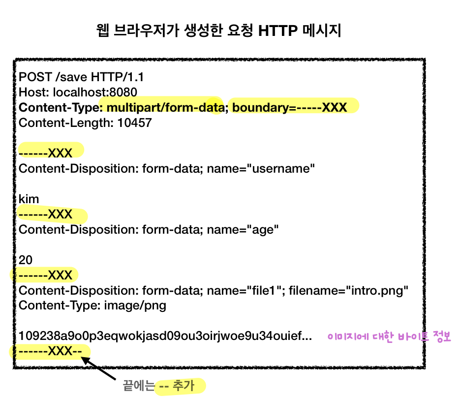

## HTML Form 전송 방식 차이
- `application/x-www-form-urlencoded`
	- HTML 폼 기본 전송 방식
	- 폼 태그에 `enctype` 옵션을 주지 않을 시 자동 지정
- **`multipart/form-data`**
	
	- **여러 데이터 형식**을 함께 보내기 위한 Form 데이터 전송 방식 (HTTP 제공)
		- 파일은 문자가 아닌 **바이너리 타입**으로 전송 필요
		- 각각의 항목을 **구분**해 **한번에 전송**
			- e.g. 폼 데이터 전송 시 **문자와 바이너리를 동시 전송**
				- 문자: 이름, 나이...
				- 파일: 첨부파일
	- 폼 태그 -> `enctype="multipart/form-data"`
## 서블릿 파일 업로드
- `HttpServletRequest`
	- `request.getParameter(...)`
		- 요청 파라미터 접근
	- `request.getParts()`
		- `multipart/form-data` 전송 방식에서 각각 나누어진 부분을 받아서 확인
		- 개별 `Part` 메서드
			- `part.getSubmittedFileName()` : 클라이언트가 전달한 파일명
			- `part.getInputStream():` Part의 전송 데이터를 읽기 (Body)
			- `part.write(fullPath):` Part를 통해 전송된 데이터를 지정 경로에 저장
## 스프링 파일 업로드
- 업로드하는 HTML Form의 name에 맞추어 **`@RequestParam` 을 적용하면 됨**
	- `@RequestParam String itemName`
	- `@RequestParam MultipartFile file`
		- **`MultipartFile`** 인터페이스 제공
			- 메서드
				- `file.getOriginalFilename()` : 업로드 파일 명
				- `file.transferTo(...)` : 파일 저장
		- 서블릿에 비해
			- **`HttpServletRequest`를 사용 X**
			- **파일 부분만 구분**하기도 편리
- 예시 코드
	```java
	@Slf4j
	@Controller
	@RequestMapping("/spring")
	public class SpringUploadController {
	    
	    @Value("${file.dir}")
	    private String fileDir;
	    
	    @GetMapping("/upload")
	    public String newFile() {
	        return "upload-form";
		}
		
	    @PostMapping("/upload")
	    public String saveFile(@RequestParam String itemName,
	                           @RequestParam MultipartFile file, HttpServletRequest request) throws IOException {
	
			log.info("request={}", request);
	        log.info("itemName={}", itemName);
	        log.info("multipartFile={}", file);
	
			if (!file.isEmpty()) {
				String fullPath = fileDir + file.getOriginalFilename(); 
				log.info("파일 저장 fullPath={}", fullPath); 
				file.transferTo(new File(fullPath));
			}
	        
	        return "upload-form";
	    }
	}
	```
## 멀티파트 관련 사용 옵션 (`application.properties`)
- 실제 파일 저장 경로 지정
	- `file.dir=파일 업로드 경로`
		- e.g. `/Users/lucian/study/file/`
		- 해당 경로에 **반드시 실제 폴더 만들어두기**
	- 지정 파일 경로는 컨트롤러의 멤버 변수에 주입해 사용 가능
		```java
		//application.properties에서 설정한 파일 경로 주입
		@Value("${file.dir}")
		private String fileDir;
		```
- 업로드 사이즈 제한
	```yaml
	//파일 하나의 최대 사이즈 (기본 1MB)
	spring.servlet.multipart.max-file-size=1MB
	//멀티 파트 요청 하나의 여러 파일 전체 합 (기본 10MB)
	spring.servlet.multipart.max-request-size=10MB
	```
	- 큰 파일 무제한 업로드를 예방하고 업로드 사이즈 제한 가능
	- 사이즈를 넘길 시 예외 발생 (`SizeLimitExceededException`)
- 서블릿 컨테이너 멀티파트 관련 처리 옵션
	- `spring.servlet.multipart.enabled` (기본 `true`)
		- `false`: 멀티파트 처리 안하기
			- 결과
				```java
				request=org.apache.catalina.connector.RequestFacade@xxx
				itemName=null
				parts=[]
				```
		- `true`: 멀티파트 처리하기
			- 결과
				```java
				request=org.springframework.web.multipart.support.StandardMultipartHttpServletRequest
				itemName=Spring
				parts=[ApplicationPart1, ApplicationPart2]
				```
			- `true`일 시, 스프링 `DispatcherServlet`의 **`MultipartResolver`를 실행**
				- `MultipartResolver`는 멀티파트 요청이 온 경우
				  `HttpServletRequest` -> **`MultipartHttpServletRequest` 변환**
			- 스프링 기본 멀티파트 리졸버는 **`StandardMultipartHttpServletRequest` 반환**
				- `MultipartHttpServletRequest`
					- `HttpServletRequest`의 **자식 인터페이스**
					- 멀티파트 관련 추가 기능 제공
				- `StandardMultipartHttpServletRequest`
					- `MultipartHttpServletRequest` 인터페이스 **구현체**
- 
