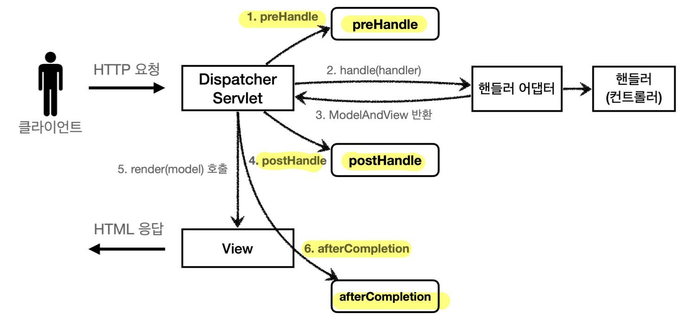
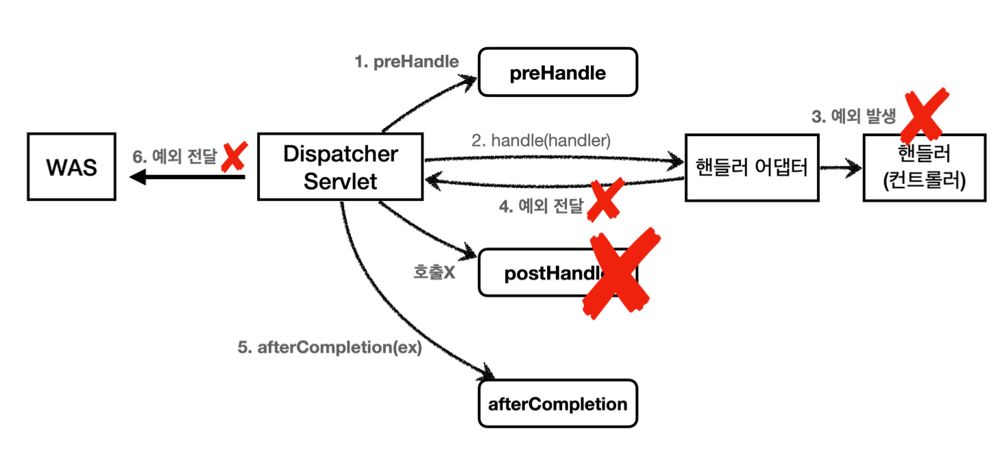

## 로그인 기본 비즈니스 로직
- 로그인 컨트롤러
	- 로그인 서비스 로직 호출
		- 호출 성공하면 정상 리턴
		- 실패 시, 글로벌 오류 생성
- 로그인 서비스 로직
	- 회원을 조회
	- 파라미터로 넘어온 password와 비교
		- password가 같으면 회원을 반환
		- 다르면 `null` 을 반환
## 로그인 유지 방법
- e.g. 로그인 성공한 고객의 이름을 보여주기
- 쿠키 방식
	- 서버에서 로그인 성공 시 HTTP 응답에 쿠키를 담아 브라우저에 전달 (`Set-Cookie`)
	- 브라우저는 앞으로 모든 요청에 쿠키 정보 자동 포함
	- 쿠키 종류
		- 영속 쿠키: 만료 날짜를 **입력**하면 **해당 날짜까지 유지**
		- 세션 쿠키: 만료 날짜를 **생략**하면 **브라우저 종료시까지만 유지**
	- 쿠키 생성 로직
		```java
		//쿠키에 시간 정보를 주지 않으면 세션 쿠키(브라우저 종료시 모두 종료)
		Cookie idCookie = new Cookie("memberId", String.valueOf(loginMember.getId()));
		response.addCookie(idCookie); //response: HttpServletResponse
		```
	- 쿠키 조회 파라미터
		- `@CookieValue(name = "memberId", required = false) Long memberId`
		- `required = false`: 로그인 하지 않은 사용자도 접근 허용
	- 쿠키 로그아웃 로직
		```java
		Cookie cookie = new Cookie(cookieName, null);
		cookie.setMaxAge(0);
		response.addCookie(cookie); //response: HttpServletResponse
		```
		- 응답 쿠키를 `Max-Age=0`로 생성해, 기존 쿠키를 덮어 씌우고 즉시 종료되게끔 함
	- 보안 문제
		- 쿠키 값은 **임의로 변경** 가능
			- 클라이언트에서 마음대로 변경 가능
			- e.g. `Cookie: memberId=1` `Cookie: memberId=2` (다른사용자의 이름이 보임)
		- 쿠키에 보관된 정보는 **훔칠 수 있음**
			- 쿠키에 개인 정보나, 신용카드 정보가 있다면...
			- 해당 정보가 **브라우저에도 보관**되고, **네트워크 요청마다** 계속 클라이언트에서 서버로 전달
			- 나의 **로컬 PC**에서 털릴 수도 있고, **네트워크 전송 구간**에서 털릴 수도 있음
		- 해커가 쿠키를 **한 번 훔쳐가면 평생 사용 가능**
			- 해커가 악의적인 요청 계속 시도 가능
	- 보안 문제 대안
		- 쿠키에 **예측 불가능한 임의의 토큰(랜덤 값)을 노출**
			- 토큰은 해커가 임의의 값을 넣어도 찾을 수 없도록 예상 불가능해야 함
			- 클라이언트와 서버의 연결은 추정 불가능한 임의의 식별자 값으로 연결해야 함
		- **서버에서 토큰을 관리**
			- **중요한 값을 서버에 보관하고 노출하지 않음**
			- 서버에서 토큰과 사용자 id를 매핑해서 인식
		- **서버**에서 해당 **토큰의 만료시간을 짧게 유지** (예: 30분)
			- 해커가 토큰을 털어가도 시간이 지나면 사용할 수 없음
			- **해킹이 의심**되는 경우 **서버**에서 **해당 토큰을 강제로 제거**
- 세션 방식
	- **서버에 중요한 정보를 보관**하고 **연결을 유지**하는 방법
		- **단순히 쿠키를 사용하지만, 서버에서 데이터를 유지하는 방법일 뿐**
	- 서버는 **세션 저장소**를 가짐
		- 단순하게는 **`Map<sessionId, value>`** 형태
			- 서블릿의 세션 저장소는 **`Map<JSESSIONID, Map<String, Object>>`** 형태
		- 세션 ID는 **추정 불가능** 해야 하므로 **UUID를 주로 사용**
	- 세션 방식은 단순 쿠키 방식의 **보안 문제들을 해결**
		- **예상 불가능한 세션 ID**를 사용해 쿠키값 변조를 예방
		- **쿠키 정보(세션 ID)가 털려도** 여기에는 **중요한 정보가 없음** (서버에 있음)
		- 세션 만료시간을 **짧게** 유지하고, 해킹 의심시 서버에서 **해당 세션 강제 제거**
	- 동작 방식
		- 로그인
			- 사용자가 `loginId` , `password` 정보를 전달하면 **서버에서 해당 사용자가 맞는지 확인**
			- 서버는 **세션 ID를 생성**하고, 보관할 **값**과 함께 **세션 저장소에 보관**
			- 서버는 클라이언트에게 **세션 ID만 쿠키로 전달** (`Set-Cookie`)
				- **중요한 정보**는 **서버**에 있음
				- 추정불가능한 세션 ID만 클라이언트에 전달되므로 **사용자 추정 불가**
			- 클라이언트는 **쿠키 저장소**에 세션 ID가 담긴 쿠키를 **저장**
		- 로그인 이후
			- 클라이언트는 요청시 항상 서버로 쿠키를 전달
			- 서버는 전달 받은 쿠키 정보로 **세션 저장소를 조회**해서 **로그인시 보관한 세션 정보를 사용**
	- 기능 정리
		- 세션 **생성**
			- sessionId 생성 (UUID)
			- 세션 저장소에 sessionId 및 보관 값 저장
			- 응답 쿠키에 sessionId를 담아 전달
		- 세션 **조회**
			- 요청 쿠키의 sessionId 값을 사용해, 세션 저장소에서 보관 값 조회
		- 세션 **만료**
			- 요청 쿠키의 sessionId 값을 사용해, 세션 저장소에 보관된 sessionId와 보관 값 제거
	- **세션 타임아웃**
		- 대부분의 사용자는 로그아웃 없이 브라우저를 종료 -> 서버는 사용자 이탈 여부를 알 수 없음
		- 그렇다고 **세션을 무한정 보관해서는 안됨**
			- 세션과 관련된 쿠키를 탈취 당했을 경우, 지속적인 악의적 요청 가능
			- 메모리의 한계가 있으므로, 세션은 꼭 필요한 경우만 사용해야 함
		- **사용자가 서버에 최근 요청한 시간을 기준**으로 **30분 정도 세션 유지 권장**
			- 세션 생성 시점 기준 30분을 잡으면, 로그인 연장이 안되어 고객이 불편
		- 흐름
			- **`LastAccessedTime`** 통해 최근 세션 접근 시간을 확인하고 갱신
			- **타임아웃 설정 시간**만큼 세션을 추가로 사용
			- `LastAccessedTime` 이후로 타임아웃 되면, **WAS가 내부에서 해당 세션을 제거**
	- 세션에는 **적당한 유지 시간**을 설정하고 **최소한의 데이터만 보관**
		- 사용자 수가 급증하면 메모리가 급증해 장애 발생 가능
			- 세션 메모리 사용량 = 보관한 데이터 용량 * 사용자 수
			- 실무에서는 **멤버 아이디만** 혹은 **로그인 용 멤버 객체**를 따로 만들어 **최소 정보만 보관**
		- 세션의 시간을 너무 길게 가져가도 메모리 누적으로 장애 위험
			- 기본 30분을 기준으로 고민
## 세션 방식 구현 예
- 서블릿 제공
	- `@SessionAttribute`
		- `HttpSession`과 같은 기능을 제공
		- 세션을 찾고 세션에 들어 있는 데이터를 조회하는 과정을 스프링이 **간편하게 처리**
		- 사용 방법
			- `@SessionAttribute(name = "loginMember", required = false) Member loginMember`
				- 이미 로그인된 사용자 찾음
				- 세션을 생성하는 기능은 없음
	- `HttpSession`
		- 직접 구현 기능에 더해 **일정 시간 사용하지 않으면 해당 세션을 삭제하는 기능**도 제공
		- 쿠키 이름은 `JSESSIONID`로 추정 불가능한 랜덤 값 생성
			- `Cookie: JSESSIONID=5B78E23B513F50164D6FDD8C97B0AD05`
		- 세션 저장소의 형태: **`Map<JSESSIONID, Map<String, Object>>`**
			- 세션 저장소는 하나만 있고, 그 안에 여러 `HttpSession`이 보관됨
			- `HttpSession`은 내부에 데이터를 Map 형식으로 보관
		- 사용 방법
			- `HttpSession session = request.getSession() //HttpServeletRequest`
				- 세션 생성과 조회
				- **쿠키의 `JSESSIONID`로 세션 보관소에서 세션을 가져옴**
				- create 옵션 (기본값: `true`)
					- `request.getSession(true)`
						- 세션이 있으면 기존 세션 반환
						- 세션이 없으면 **새로운 세션을 생성 및 반환**
					- `request.getSession(false)`
						- 세션이 있으면 기존 세션 반환
						- 세션이 없으면 **`null` 반환**
			- `session.setAttribute(SessionConst.LOGIN_MEMBER, loginMember);`
				- 세션에 로그인 정보 보관
				- **하나의 세션에 여러 값 보관 가능**
				- `SessionConst.LOGIN_MEMBER`의 값을 키로 사용해 `loginMember` 데이터 저장
			- `session.getAttribute(SessionConst.LOGIN_MEMBER)`
				- 세션에서 특정 키 값으로 데이터 조회
			- `session.invalidate()`
				- 세션 제거
			- 타임아웃 설정
				- 스프링 부트 글로벌 설정 (`application.properties`)
					- `server.servlet.session.timeout=60` : 60초, 기본은 1800(30분)
				- 특정 세션 단위로 시간 설정
					- `session.setMaxInactiveInterval(1800); //1800초` 
					- 보안상 더 중요한 부분에 대하여 적용할 수 있는 장점 존재
		- 제공 속성
			- `sessionId`: 세션 ID, JSESSIONID 값
			- `maxInactiveInterval`: 세션의 유효 시간
			- `creationTime`: 세션 생성일시
			- `lastAccessedTime`: 최근에 sessionID(`JSESSIONID`)를 전달하는 요청을 보낸 시간
			- `isNew`: 새로 생성된 세션인지 여부
- 직접 구현
	```java
	@Component
	public class SessionManager {
	    public static final String SESSION_COOKIE_NAME = "mySessionId";
	    private Map<String, Object> sessionStore = new ConcurrentHashMap<>();
	
		/**
		* 세션 생성 */
	    public void createSession(Object value, HttpServletResponse response) {
			//세션 id를 생성하고, 값을 세션에 저장
			String sessionId = UUID.randomUUID().toString();
			sessionStore.put(sessionId, value);
			
			//쿠키 생성
			Cookie mySessionCookie = new Cookie(SESSION_COOKIE_NAME, sessionId);
			response.addCookie(mySessionCookie);
	    }
	
		/**
		* 세션 조회 */
	    public Object getSession(HttpServletRequest request) {
	        Cookie sessionCookie = findCookie(request, SESSION_COOKIE_NAME);
	        if (sessionCookie == null) {
	            return null;
	        }
	        return sessionStore.get(sessionCookie.getValue());
	    }

		/**
		* 세션 만료 */
	    public void expire(HttpServletRequest request) {
	        Cookie sessionCookie = findCookie(request, SESSION_COOKIE_NAME);
	        if (sessionCookie != null) {
	            sessionStore.remove(sessionCookie.getValue());
	        }
		}
		
	    private Cookie findCookie(HttpServletRequest request, String cookieName) {
	        if (request.getCookies() == null) {
	            return null;
	        }
	        return Arrays.stream(request.getCookies())
	                .filter(cookie -> cookie.getName().equals(cookieName))
	                .findAny()
	                .orElse(null);
		}
	}
	```

>상수 관리
>
>로그인 등을 위한 **상수는 인터페이스 혹은 추상 클래스로 만들어두는 게 좋다.** 상수를 위한 클래스는 **인스턴스를 생성할 일이 따로 없기 때문**이다.

>TrackingModes
>
>로그인 처음 시도시 URL에 다음과 같이 `jsessionid`가 포함되어 있다.
>
>`http://localhost:8080/;jsessionid=F59911518B921DF62D09F0DF8F83F872`
>
>이는 웹 브라우저가 쿠키를 지원하지 않을 경우 쿠키 대신 URL을 통해 세션을 유지할 수 있게 돕는 방식이다. 타임리프 같은 템플릿을 사용해 자동으로 URL에 해당 값이 계속 포함되도록 구현해야 한다.
>
>다만, URL 전달 방식은 잘 사용하지 않으므로 `application.properties`를 설정해 기능을 꺼두는게 좋다.
>스프링 URL 매핑 전략 변경으로 URL 전달 방식에 대해 404 에러가 나타날 때도 tracking-modes를 끄는게 권장 방법이다.
>**`server.servlet.session.tracking-modes=cookie`**
>
>만약 반드시 URL에 `jsessionid`가 필요하다면 `application.properties`에 다음 옵션을 추가하자.
>`spring.mvc.pathmatch.matching-strategy=ant_path_matcher`

## 서블릿 필터와 스프링 인터셉터
- 서블릿 필터와 스프링 인터셉터는 **웹과 관련된 공통 관심사를 편리하게 관리 가능**
	- 모든 컨트롤러에 공통으로 적용되는 로직을 관리
	- 공통 관심사(cross-cutting concern)는 **한 곳에서 관리해 변경 포인트를 줄여야 함**
		- e.g. 로그인 여부 체크 (인증), 모든 고객의 요청 로그 남기기
	- 공통 관심사는 AOP로도 해결하지만, 웹 관련 공통 관심사는 **HTTP 헤더**나 **URL 정보**들 필요
		- 서블릿 필터와 스프링 인터셉터는 `HttpServletRequest` 제공

>같은 리퀘스트에 대응하는 모든 로그에 같은 식별자(UUID)를 자동으로 남기고 싶은 경우
>-> **logback mdc** 참고해 사용

### 서블릿 필터
- 필터 인터페이스
	```java
	public interface Filter {
	    
	    public default void init(FilterConfig filterConfig) throws ServletException {}
	    
	    public void doFilter(ServletRequest request, ServletResponse response,
	            FilterChain chain) throws IOException, ServletException;
	    
	    public default void destroy() {}
	}
	```
	- 필터 인터페이스를 **구현하고 등록**하면, **서블릿 컨테이너가 필터를 싱글톤 객체로 생성 및 관리**
	- 메서드
		- `init()`: 필터 초기화 메서드 (서블릿 컨테이너 생성 시 호출)
		- `doFilter()`: **요청이 올 때 마다 호출**됨, **원하는 필터 로직**을 여기에 **구현**
		- `destroy()`: 필터 종료 메서드 (서블릿 컨테이너 종료 시 호출)
- 필터 흐름
	- **필터 정상 흐름**
		- HTTP 요청 -> WAS -> **필터** -> 서블릿 -> 컨트롤러
			- 필터가 호출된 후 서블릿 호출
			- **스프링**을 사용하는 경우, 서블릿은 **디스패처 서블릿**을 의미
	- **필터 제한**
		- HTTP 요청 -> WAS -> 필터 -> X
			- 필터는 **적절하지 않은 요청**이라 판단되면 **서블릿 호출 X**
			- e.g. 비 로그인 사용자
	- **필터 체인**
		- HTTP 요청 -> WAS -> 필터1 -> 필터2 -> 필터3 -> 서블릿 -> 컨트롤러
			- 필터는 **체인**으로 구성되고, **중간에 필터를 자유롭게 추가 가능**
			- e.g. 로그 남기는 필터 적용 후, 로그인 여부 체크 필터 적용
- 특정 URL 패턴에만 적용 가능
	- `/*`: 모든 요청에 필터 적용
	- 서블릿 URL 패턴과 동일하므로 참고
- 서블릿 필터 고유 특징 (거의 사용 X)
	- 다음 필터 또는 서블릿을 호출시, `request`, `response`를 다른 객체로 바꿔서 넘길 수 있음
		- `chain.doFilter(request, response)`
		- `ServletRequest` , `ServletResponse` 를 구현한 다른 객체를 만들어서 넘기면, 
		  해당 객체를 다음 필터 또는 서블릿에서 사용
	- 스프링 인터셉터에서는 제공 X
- 로그인 필터 구현 예시
	- 로그인 필터
		```java
		@Slf4j
		public class LoginCheckFilter implements Filter {
		    private static final String[] whitelist = {"/", "/members/add", "/login", "/logout","/css/*"};
		
			@Override
		    public void doFilter(ServletRequest request, ServletResponse response, FilterChain chain) throws IOException, ServletException {
		        
		        HttpServletRequest httpRequest = (HttpServletRequest) request;
		        String requestURI = httpRequest.getRequestURI();
		        HttpServletResponse httpResponse = (HttpServletResponse) response;
		        
		        try {
			        log.info("인증 체크 필터 시작 {}", requestURI);
					
					if (isLoginCheckPath(requestURI)) {
						log.info("인증 체크 로직 실행 {}", requestURI); 
						HttpSession session = httpRequest.getSession(false); 
						if (session == null || session.getAttribute(SessionConst.LOGIN_MEMBER) == null) {
							log.info("미인증 사용자 요청 {}", requestURI);
							//로그인으로 redirect 
							//로그인 후 요청 경로로 돌아가기 위해 redirectURL 전달
							httpResponse.sendRedirect("/login?redirectURL=" + requestURI);
							return; //중요, 미인증 사용자는 다음으로 진행하지 않고 끝!
		                }
		            }
		            // 중요!
		            // 다음 필터 있으면 호출, 없으면 서블릿 호출
		            // 호출하지 않으면 다음단계로 진행되지 않음
		            chain.doFilter(request, response);
		        } catch (Exception e) {
			        throw e; //예외 로깅 가능 하지만, 톰캣까지 예외를 보내주어야 함 
			    } finally {
				    log.info("인증 체크 필터 종료 {}", requestURI);
				}
		    }
		    
			/**
			* 화이트 리스트의 경우 인증 체크X */
		    private boolean isLoginCheckPath(String requestURI) {
		        return !PatternMatchUtils.simpleMatch(whitelist, requestURI);
			}
		}
		```
	- 필터 등록
		```java
		@Configuration
		public class WebConfig {
		    
		    @Bean
		    public FilterRegistrationBean loginCheckFilter() {
		        
		        FilterRegistrationBean<Filter> filterRegistrationBean = new FilterRegistrationBean<>(); //스프링 부트 사용시 가능
			
				filterRegistrationBean.setFilter(new LoginCheckFilter());
		        //필터 체인 순서, 낮을수록 먼저 동작
		        filterRegistrationBean.setOrder(2); 
		        //필터를 적용할 URL 패턴
		        filterRegistrationBean.addUrlPatterns("/*");
		        return filterRegistrationBean;
		    }
		}
		```

>`@ServletComponentScan` `@WebFilter(filterName = "logFilter", urlPatterns = "/*")` 로 필터 등록이 가능하지만 필터 순서 조절이 안된다. 따라서 `FilterRegistrationBean` 을 사용하자.

### 스프링 인터셉터
- 특징
	- **스프링 MVC** 제공
	- 서블릿 필터보다 편리하고 정교한 다양한 기능 제공
	- 스프링 MVC를 사용하고 필터를 꼭 사용해야하는 상황이 아니라면 **인터셉터 사용 권장**
- 인터셉터 인터페이스
	```java
	public interface HandlerInterceptor {
	    
	    default boolean preHandle(HttpServletRequest request, HttpServletResponse
	response, Object handler) throws Exception {}
	    
	    default void postHandle(HttpServletRequest request, HttpServletResponse response, Object handler, @Nullable ModelAndView modelAndView) throws Exception {}
	
	    default void afterCompletion(HttpServletRequest request, HttpServletResponse
	response, Object handler, @Nullable Exception ex) throws Exception {}
	}
	```
	- 인터셉터 인터페이스를 **구현하고 등록**
		- `WebMvcConfigurer`가 제공하는 `addInterceptors()`를 사용해 등록
	- 인터셉터는 컨트롤러 호출 전과 후, 요청 완료 이후로 **단계가 세분화** 되어 있음
	- 어떤 컨트롤러(`handler`)가 호출되는지 그리고 어떤 `modelAndView`가 반환되는지
	  **호출 정보**와 **응답 정보**를 받을 수 있음
		- 서블릿 필터는 단순히 `request`, `response`만 제공했음
- 인터셉터 흐름
	- **인터셉터 정상 흐름**
		- HTTP 요청 -> WAS -> 필터 -> 서블릿 -> **스프링 인터셉터** -> 컨트롤러
			- 스프링 MVC의 시작점이 **디스패처 서블릿**이므로 **인터셉터는 이후 호출**
	- **인터셉터 제한**
		- HTTP 요청 -> WAS -> 필터 -> 서블릿 -> 스프링 인터셉터 -> X
			- **적절하지 않은 요청**이라 판단되면 **컨트롤러 호출 X**
			- e.g. 비 로그인 사용자
	- **인터셉터 체인**
		- HTTP 요청 -> WAS -> 필터 -> 서블릿 -> 인터셉터1 -> 인터셉터2 -> 컨트롤러
			- 인터셉터는 **체인**으로 구성되고, **중간에 인터셉터를 자유롭게 추가 가능**
			- e.g. 로그 남기는 인터셉터 적용 후, 로그인 여부 체크 인터셉터 적용
- 디스패처 서블릿 내 호출 흐름
	
	- `preHandle()`: 컨트롤러 호출 전에 호출 (**핸들러 어댑터 호출 전**)
		- `preHandle()` 응답값이 
			- `true`이면 다음으로 진행
			- `false`이면 더 이상 진행 X (나머지 인터셉터, 핸들러 어댑터 모두 호출 X)
	- `postHandle()`: 컨트롤러 호출 후에 호출 (**핸들러 어댑터 호출 후**)
	- `afterCompletion()`: **뷰가 렌더링 된 이후**에 호출
- 디스패처 서블릿 내 예외 흐름
	
	- `preHandle()`: 컨트롤러 호출 전에 호출
	- `postHandle()`: 컨트롤러에서 **예외**가 발생하면 **호출되지 않음**
	- `afterCompletion()`
		- 예외 발생해도 **항상 호출**
		- **예외와 무관하게 공통 처리** 시 사용
		- **예외를 파라미터로 받아서** 어떤 예외 발생했는지 로그 출력 가능
- 특정 URL 패턴에만 적용 가능
	- 서블릿 URL 패턴과 다름 (스프링 URL 패턴)
	- 매우 정밀하게 설정 가능 (`addPathPatterns`, `excludePathPatterns`)
- 로그인 인터셉터 구현 예시
	- 로그인 인터셉터
		```java
		@Slf4j
		public class LoginCheckInterceptor implements HandlerInterceptor {
		
			@Override
		    public boolean preHandle(HttpServletRequest request, HttpServletResponse response, Object handler) throws Exception {
			    
			    String requestURI = request.getRequestURI(); 
			    
			    log.info("인증 체크 인터셉터 실행 {}", requestURI);
		        HttpSession session = request.getSession(false);
		        
		        if (session == null || session.getAttribute(SessionConst.LOGIN_MEMBER) == null) {
			        log.info("미인증 사용자 요청");
					//로그인으로 redirect 
					response.sendRedirect("/login?redirectURL=" + requestURI); 
					return false; // 다음 호출 진행 X
				}
		        
		        return true; // 다음 호출 진행 여부를 위해 반환
		    }
		}
		```
	- 인터셉터 등록
		```java
		@Configuration
		public class WebConfig implements WebMvcConfigurer {
		    
		    @Override
		    public void addInterceptors(InterceptorRegistry registry) {
		        registry.addInterceptor(new LogInterceptor())
				        .order(1)
						.addPathPatterns("/**")
						.excludePathPatterns("/css/**", "/*.ico", "/error");
		
				registry.addInterceptor(new LoginCheckInterceptor())
				        .order(2)
				        .addPathPatterns("/**") // 적용할 URL 패턴
				        .excludePathPatterns(
					        "/", "/members/add", "/login", "/logout",
					        "/css/**", "/*.ico", "/error"
						); // 제외할 URL 패턴
			}
		}
		```

>Intercepter 구현 시 유의사항
>
>스프링 인터셉터 구현체 역시 싱글톤처럼 관리되므로 멤버 변수를 사용할 때는 주의해야 한다.
>**나의 요청 중에 다른 쓰레드가 사용**하면 **멤버 변수값이 바꿔치기 될 수 있어서 위험**하다.
>e.g. 로그 남길 시 UUID를 멤버 변수로 생성하면 위험

>스프링 URL 패턴
>
>스프링이 제공하는 URL 패턴은 서블릿의 패턴과 완전히 다르다. 더 자세하고 세밀한 설정이 가능한 장점이 있다.
>
>? 한 문자 일치
>* 경로(/) 안에서 0개 이상의 문자 일치
>** 경로 끝까지 0개 이상의 경로(/) 일치
>{spring} 경로(/)와 일치하고 spring이라는 변수로 캡처
>{spring:[a-z]+} matches the regexp [a-z]+ as a path variable named "spring"
>{spring:[a-z]+} regexp [a-z]+ 와 일치하고, "spring" 경로 변수로 캡처
>{\*spring} 경로가 끝날 때 까지 0개 이상의 경로(/)와 일치하고 spring이라는 변수로 캡처
>
>/pages/t?st.html — matches /pages/test.html, /pages/tXst.html but not /pages/toast.html
>/resources/*.png — matches all .png files in the resources directory
>/resources/** — matches all files underneath the /resources/ path, including /resources/image.png and /resources/css/spring.css
>/resources/{*path} — matches all files underneath the /resources/ path and captures their relative path in a variable named "path"; /resources/image.png 
>will match with "path" → "/image.png", and /resources/css/spring.css will match with "path" → "/css/spring.css"
>/resources/{filename:\\w+}.dat will match /resources/spring.dat and assign the value "spring" to the filename variable
>
>[Spring PathPattern 공식문서](https://docs.spring.io/spring-framework/docs/current/javadoc-api/org/springframework/web/util/pattern/PathPattern.html)

## ArgumentResolver 활용
- **공통 관심사**를 `ArgumentResolver`로 구현해 등록 가능
- **핸들러의 파라미터**에 **필요한 객체를 전달**하는 것에 초점
	- **컨트롤러**를 **더욱 편리**하게 사용 가능
- 로그인 처리에 활용 시 인터셉터와의 차이점 (**역할과 시점이 다름**)
	- 인터셉터에서는 **전역적으로 세션을 체크**하여 요청의 **인가 및 인증** 여부를 확인
	- `ArgumentResolver`에서는 **특정 요청 중**에 세션 정보가 **필요할 시 가져오는 역할**을 수행
- e.g. 구현 예시: 로그인 회원 편리하게 가져오기 
	- 흐름
		- @Login 애노테이션이 있으면 직접 만든 `ArgumentResolver`가 동작
		- 자동으로 세션에 있는 로그인 회원 찾아주고, 없으면 `null` 반환
	- 컨트롤러
		```java
		@GetMapping("/")
		public String homeLoginArgumentResolver(@Login Member loginMember, Model model) {
			
			//세션에 회원 데이터가 없으면 home 
			if (loginMember == null) {
		        return "home";
		    }
		    
			//세션이 유지되면 로그인으로 이동
			model.addAttribute("member", loginMember); 
			return "loginHome";
		}
		```
	- @Login 애노테이션 생성
		```java
		package hello.login.web.argumentresolver;
		
		import java.lang.annotation.ElementType;
		import java.lang.annotation.Retention;
		import java.lang.annotation.RetentionPolicy;
		import java.lang.annotation.Target;
		
		@Target(ElementType.PARAMETER)
		@Retention(RetentionPolicy.RUNTIME)
		public @interface Login {
		}
		```
	- `HandlerMethodArgumentResolver` 구현
		```java
		@Slf4j
		public class LoginMemberArgumentResolver implements HandlerMethodArgumentResolver {
		    
		    @Override
		    public boolean supportsParameter(MethodParameter parameter) {
				
				log.info("supportsParameter 실행");
		        
		        boolean hasLoginAnnotation = parameter.hasParameterAnnotation(Login.class);
		        boolean hasMemberType = Member.class.isAssignableFrom(parameter.getParameterType());
		        
		        return hasLoginAnnotation && hasMemberType;
		    }
		    
			@Override
		    public Object resolveArgument(MethodParameter parameter, ModelAndViewContainer mavContainer, NativeWebRequest webRequest, WebDataBinderFactory binderFactory) throws Exception {
		
				log.info("resolveArgument 실행");
		        
		        HttpServletRequest request = (HttpServletRequest) webRequest.getNativeRequest();
		        HttpSession session = request.getSession(false);
		        if (session == null) {
		            return null;
		        }
		        
		        return session.getAttribute(SessionConst.LOGIN_MEMBER);
		    }
		}
		```
		- `supportsParameter()`
			- `@Login` 애노테이션이 있으면서 `Member` 타입이면, 해당 `ArgumentResolver` 사용
		- `resolveArgument()`
			- 컨트롤러 호출 직전에 호출되어 **필요한 파라미터 정보를 생성**
			- 여기서는 세션에 있는 로그인 회원 정보인 `member` 객체를 찾아 반환
			- 이후 컨트롤러의 파라미터에 `member` 객체를 전달
	- `ArgumentResolver` 등록
		```java
		@Configuration
		public class WebConfig implements WebMvcConfigurer {
			
			@Override
		    public void addArgumentResolvers(List<HandlerMethodArgumentResolver> resolvers) {
		        resolvers.add(new LoginMemberArgumentResolver());
		    }
			//...
		}
		```