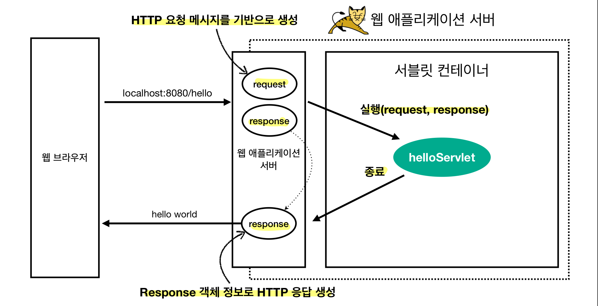

## Web Server & Web Application Server
- Web Server (HTTP)
	- **정적 리소스 제공** + 기타 부가기능
	- 동적인 처리(애플리케이션 로직 등)가 필요하면 **WAS에 요청 위임**
	- 예시) NGINX, APACHE
- Web Application Server (HTTP)
	- **애플리케이션 로직 수행** (프로그램 코드 실행) + 웹 서버 기능 (정적 리소스 제공)
		- 동적 HTML, HTTP API(JSON), 서블릿, JSP, Spring MVC
	- API 서버만 제공할 경우 WAS만으로 서버 구축해도 괜찮음 (회사끼리 데이터 주고 받을 때)
	- 예시) Tomcat, Jetty, Undertow
- WAS는 애플리케이션 코드 실행에 더 **특화**되어 있다!
	- 웹서버와 WAS는 서로가 서로의 기능을 가지고 있긴 해서 경계가 모호
	- 서블릿 컨테이너 기능 제공하면 WAS라 보기도 함 (서블릿 사용안하는 프레임워크도 있지만...)
- 공존 이유
	- 효율적인 리소스 관리
		- WAS가 너무 많은 역할을 담당하여 **서버 과부하 우려**
		- **애플리케이션 로직은 값어치가 높으므로** 값이 낮은 정적 리소스 때문에 과부하되면 안됨
		- 역할 분리
			- 정적 리소스 사용이 많을 때는 Web Server 증설
			- 애플리케이션 리소스 사용이 많을 때는 WAS 증설
	- 지속적인 오류 화면 제공
		- WAS는 잘 죽는 반면, Web Server는 잘 안 죽음
		- WAS 및 DB 장애시 **Web Server가 오류화면 제공 가능**
## Servlet
- 메시지 수신, 파싱, 응답 메시지 생성 및 송신 등 HTTP 스펙의편리한 사용을 지원하는 자바 클래스
- 서블릿을 지원하는 WAS를 사용하면, **의미있는 비즈니스 로직에만 집중 가능**
- 사용 방법
	- `HttpServlet`을 상속받고 `@WebServlet` 애노테이션에 `name`과 `urlPatterns`를 지정
	- `protected`의 `service` 코드를 오버라이딩해 비즈니스 로직 작성
	- `HttpServletRequest`와 `HttpServletResponse` 타입 파라미터로 요청 및 응답 정보 사용 가능
- 흐름
	
	- HTTP 요청시 WAS가 `Request`, `Response` 객체를 생성해서 서블릿 객체 호출
	- 서비스 로직에서 `Request` 객체의 HTTP 요청 정보를 이용하고 `Response` 객체에 응답 정보 입력
	- WAS는 `Response` 객체에 담긴 내용으로 HTTP 응답 정보 생성
## Servlet Container(서블릿 컨테이너)
- **서블릿을 지원하는 WAS** (톰캣)
- 서블릿 객체의 **생명주기 관리** (생성, 초기화, 호출, 종료)
- 서블릿 객체를 **싱글톤**으로 관리
	- 최초 로딩 시점에 서블릿 객체를 미리 만들어두고 재활용
	- 공유 변수 사용에는 주의해야 함
- **동시 요청**을 위한 **멀티 쓰레드 처리** 지원
	- 덕분에 개발자가 멀티 쓰레드를 신경쓰지 않고 **마치 싱글 쓰레드 프로그래밍 하듯이** 편리하게 개발 (**WAS가 개발 생산성을 가장 높여주는 부분**)
	- 멀티 쓰레드 환경이므로 **싱글톤 객체(서블릿, 스프링 빈)는 주의해서 사용** (공유변수, 멤버변수 조심)
## 동시요청 (멀티 쓰레드)
- 쓰레드
	- 애플리케이션 코드를 하나하나 순차적으로 실행하는 것 (**한번에 하나의 코드 라인만 수행**)
	- 자바 메인 메서드를 처음 실행하면 main이라는 이름의 쓰레드가 실행
	- 동시 처리가 필요하면 쓰레드를 추가로 생성
	- **서블릿 객체는 쓰레드가 호출**
- **멀티 쓰레드는 동시요청 처리 가능** (단일 쓰레드로는 처리가 어려움)
	- 요청마다 쓰레드 생성
		- 장점
			- 동시 요청 처리 가능
			- 하나의 쓰레드가 지연 되어도, 나머지 쓰레드는 정상 동작
		- 단점
			- 쓰레드 생성 비용은 매우 비쌈 (요청마다 쓰레드 생성하면 응답 속도도 늦어짐)
			- 컨텍스트 스위칭 비용 발생 (하나의 CPU 코어에 2개 이상의 쓰레드를 돌리면 발생) 
			- 쓰레드 생성에 제한 없음 (요청이 너무 많으면, CPU와 메모리 임계점을 넘어 서버가 죽음)
	- **쓰레드 풀**
		- 설정한 최대치 만큼 **쓰레드를 미리 생성해 풀에 보관하고 관리** (톰캣 기본설정: 최대 200개)
		- 요청이 들어오면 쓰레드 풀에서 쓰레드를 할당하고 다 쓰면 반납 (**재사용**)
		- 풀에 남은 쓰레드가 부족하면 대기 중인 요청은 거절하거나 특정 숫자만큼만 대기하도록 설정 가능
		- 장점
			- 쓰레드를 미리 생성하므로, **쓰레드 생성 비용(CPU)이 절약**되고 **응답이 빠름**
			- **쓰레드 풀 최대치**가 있으므로 너무 많은 요청이 들어와도 **기존 요청은 안전하게 처리 가능**
		- WAS의 주요 튜닝 포인트는 **최대 쓰레드 수**(**max thread**)
			- 동시 요청이 많은 상황에서
				- 너무 낮게 설정 시: 서버 리소스는 여유롭지만, 금방 클라이언트 응답 지연이 발생
					- 100개 요청이 왔는데 최대 쓰레드가 10개면 동시에 10개 요청만 처리
					- 그런데 사실 CPU는 5% 밖에 사용안함
				- 너무 높게 설정 시: CPU, 메모리 임계점 초과로 서버 다운 발생
					- 10000개의 요청이 오면 10000개를 모두 받아들이다가 서버가 죽음
			- 장애 발생시
				- 클라우드면 일단 서버부터 늘리고 이후 튜닝
				- 클라우드가 아니면 바로 튜닝
			- **적정 쓰레드 풀 숫자는 성능 테스트를 통해 찾아야 함**
				- 애플리케이션 로직 복잡도, CPU & 메모리 & IO 리소스 상황에 따라 모두 다름
				- 최대한 실제 서비스와 유사하게 성능 테스트 시도
				- 아파치 ab, 제이미터, nGrinder
## 백엔드가 고려할 3가지 HTTP 통신
- **정적 리소스** 어떻게 제공할지
- **동적 HTML 페이지** 어떻게 제공할지 (**View Template**)
- **API** 어떻게 제공할지 (JSON)
## SSR & CSR
- 서버 사이드 렌더링 (SSR)
	- HTML 최종 결과를 **서버에서 만들어서** 웹브라우저에 전달
	- JSP, Thymeleaf (백엔드 기술)
- 클라이언트 사이드 렌더링 (CSR)
	- HTML 최종 결과를 JS를 이용해 **웹 브라우저에서 동적으로 생성**해 적용
	- **필요한 부분만 부분부분 변경**
	- React, Vue.js (프론트엔드 기술)
- CSR + SSR 동시 지원하는 프론트 기술도 존재하므로 칼같이 나눌 필요 X (Next.js)
- SSR도 JS 이용해 화면 일부를 동적으로 변경 가능