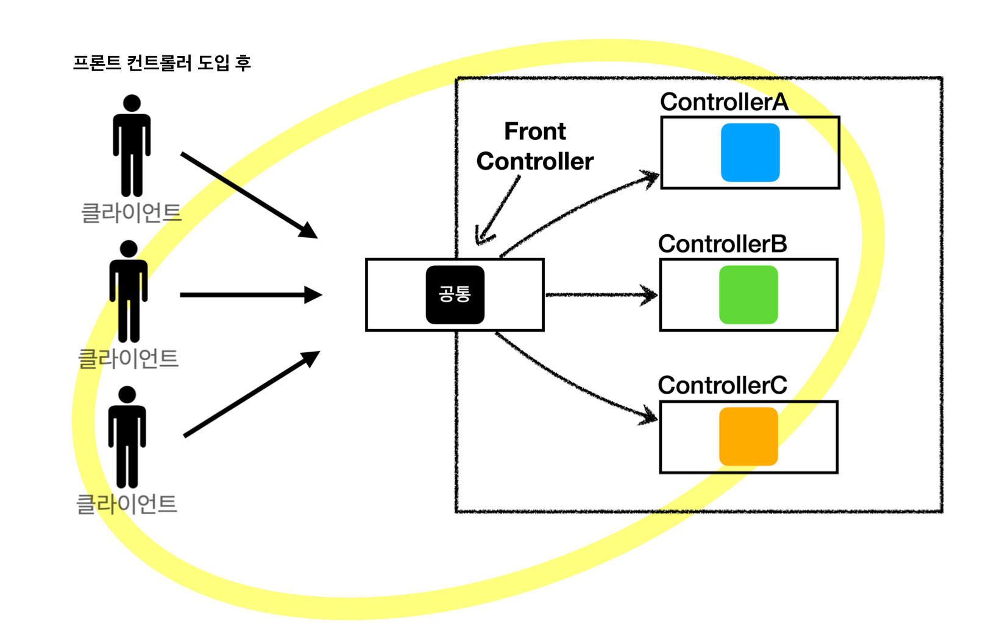
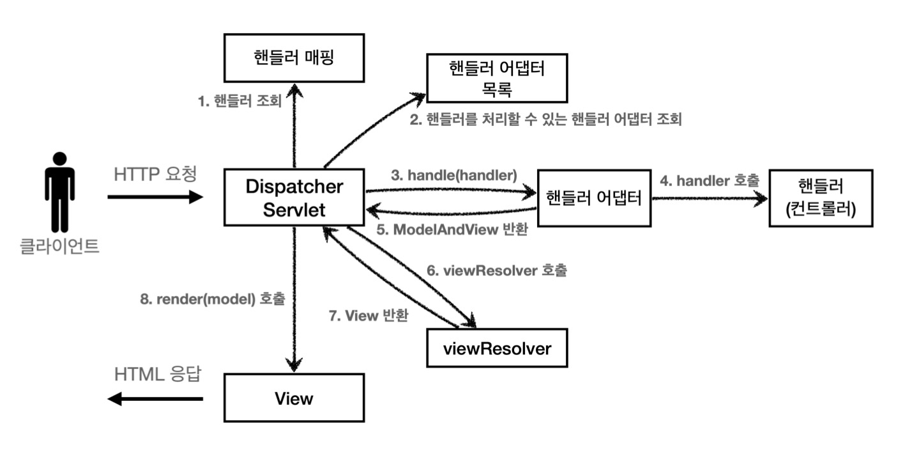
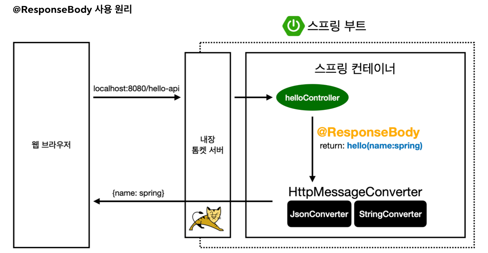
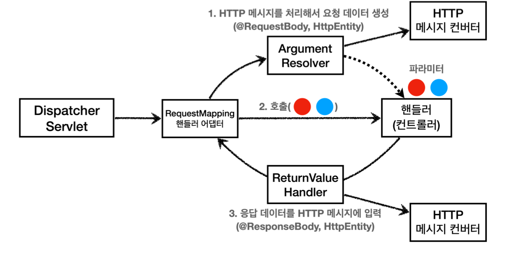

## Web Server & Web Application Server
- Web Server (HTTP)
	- **정적 리소스 제공** + 기타 부가기능
	- 동적인 처리(애플리케이션 로직 등)가 필요하면 **WAS에 요청 위임**
	- 예시) NGINX, APACHE
- Web Application Server (HTTP)
	- **애플리케이션 로직 수행** (프로그램 코드 실행) + 웹 서버 기능 (정적 리소스 제공)
		- 동적 HTML, HTTP API(JSON), 서블릿, JSP, Spring MVC
	- API 서버만 제공할 경우 WAS만으로 서버 구축해도 괜찮음 (회사끼리 데이터 주고 받을 때)
	- 예시) Tomcat, Jetty, Undertow
- WAS는 애플리케이션 코드 실행에 더 **특화**되어 있다!
	- 웹서버와 WAS는 서로가 서로의 기능을 가지고 있긴 해서 경계가 모호
	- 서블릿 컨테이너 기능 제공하면 WAS라 보기도 함 (서블릿 사용안하는 프레임워크도 있지만...)
- 공존 이유
	- 효율적인 리소스 관리
		- WAS가 너무 많은 역할을 담당하여 **서버 과부하 우려**
		- **애플리케이션 로직은 값어치가 높으므로** 값이 낮은 정적 리소스 때문에 과부하되면 안됨
		- 역할 분리
			- 정적 리소스 사용이 많을 때는 Web Server 증설
			- 애플리케이션 리소스 사용이 많을 때는 WAS 증설
	- 지속적인 오류 화면 제공
		- WAS는 잘 죽는 반면, Web Server는 잘 안 죽음
		- WAS 및 DB 장애시 **Web Server가 오류화면 제공 가능**
## Servlet
- 메시지 수신, 파싱, 응답 메시지 생성 및 송신 등 **HTTP 스펙의편리한 사용**을 지원하는 자바 클래스
- 서블릿을 지원하는 WAS를 사용하면, **의미있는 비즈니스 로직에만 집중 가능**
- 사용 방법
	- 메인 함수가 실행되는 클래스에 `@ServletComponentScan` 추가
	- `HttpServlet`을 상속받고 `@WebServlet` 애노테이션에 `name`과 `urlPatterns`를 지정
	- `protected`의 `service` 코드를 오버라이딩해 비즈니스 로직 작성
	- `HttpServletRequest`와 `HttpServletResponse` 타입 파라미터로 요청 및 응답 정보 사용 가능
- 부가 기능
	- 임시 저장소 기능: HTTP 요청의 시작과 끝까지 유지, View에 데이터 전달하는 Model 역할도 수행
	- 세션 관리 기능: `request.getSession(create: true)`
- 흐름
	
	- HTTP 요청시 WAS가 `Request`, `Response` 객체를 생성해서 서블릿 객체 호출
	- 서비스 로직에서 `Request` 객체의 HTTP 요청 정보를 이용하고 `Response` 객체에 응답 정보 입력
	- WAS는 `Response` 객체에 담긴 내용으로 HTTP 응답 정보 생성
## Servlet Container(서블릿 컨테이너)
- **서블릿을 지원하는 WAS** (톰캣)
- 서블릿 객체의 **생명주기 관리** (생성, 초기화, 호출, 종료)
- 서블릿 객체를 **싱글톤**으로 관리
	- 최초 로딩 시점에 서블릿 객체를 미리 만들어두고 재활용
	- 공유 변수 사용에는 주의해야 함
- **동시 요청**을 위한 **멀티 쓰레드 처리** 지원
	- 덕분에 개발자가 멀티 쓰레드를 신경쓰지 않고 **마치 싱글 쓰레드 프로그래밍 하듯이** 편리하게 개발 (**WAS가 개발 생산성을 가장 높여주는 부분**)
	- 멀티 쓰레드 환경이므로 **싱글톤 객체(서블릿, 스프링 빈)는 주의해서 사용** (공유변수, 멤버변수 조심)
## 동시요청 (멀티 쓰레드)
- 쓰레드
	- 애플리케이션 코드를 하나하나 순차적으로 실행하는 것 (**한번에 하나의 코드 라인만 수행**)
	- 자바 메인 메서드를 처음 실행하면 main이라는 이름의 쓰레드가 실행
	- 동시 처리가 필요하면 쓰레드를 추가로 생성
	- **서블릿 객체는 쓰레드가 호출**
- **멀티 쓰레드는 동시요청 처리 가능** (단일 쓰레드로는 처리가 어려움)
	- 요청마다 쓰레드 생성
		- 장점
			- 동시 요청 처리 가능
			- 하나의 쓰레드가 지연 되어도, 나머지 쓰레드는 정상 동작
		- 단점
			- 쓰레드 생성 비용은 매우 비쌈 (요청마다 쓰레드 생성하면 응답 속도도 늦어짐)
			- 컨텍스트 스위칭 비용 발생 (하나의 CPU 코어에 2개 이상의 쓰레드를 돌리면 발생) 
			- 쓰레드 생성에 제한 없음 (요청이 너무 많으면, CPU와 메모리 임계점을 넘어 서버가 죽음)
	- **쓰레드 풀**
		- 설정한 최대치 만큼 **쓰레드를 미리 생성해 풀에 보관하고 관리** (톰캣 기본설정: 최대 200개)
		- 요청이 들어오면 쓰레드 풀에서 쓰레드를 할당하고 다 쓰면 반납 (**재사용**)
		- 풀에 남은 쓰레드가 부족하면 대기 중인 요청은 거절하거나 특정 숫자만큼만 대기하도록 설정 가능
		- 장점
			- 쓰레드를 미리 생성하므로, **쓰레드 생성 비용(CPU)이 절약**되고 **응답이 빠름**
			- **쓰레드 풀 최대치**가 있으므로 너무 많은 요청이 들어와도 **기존 요청은 안전하게 처리 가능**
		- WAS의 주요 튜닝 포인트는 **최대 쓰레드 수**(**max thread**)
			- 동시 요청이 많은 상황에서
				- 너무 낮게 설정 시: 서버 리소스는 여유롭지만, 금방 클라이언트 응답 지연이 발생
					- 100개 요청이 왔는데 최대 쓰레드가 10개면 동시에 10개 요청만 처리
					- 그런데 사실 CPU는 5% 밖에 사용안함
				- 너무 높게 설정 시: CPU, 메모리 임계점 초과로 서버 다운 발생
					- 10000개의 요청이 오면 10000개를 모두 받아들이다가 서버가 죽음
			- 장애 발생시
				- 클라우드면 일단 서버부터 늘리고 이후 튜닝
				- 클라우드가 아니면 바로 튜닝
			- **적정 쓰레드 풀 숫자는 성능 테스트를 통해 찾아야 함**
				- 애플리케이션 로직 복잡도, CPU & 메모리 & IO 리소스 상황에 따라 모두 다름
				- 최대한 실제 서비스와 유사하게 성능 테스트 시도
				- 아파치 ab, 제이미터, nGrinder
## 백엔드가 고려할 3가지 HTTP 통신
- **정적 리소스** 어떻게 제공할지
- **동적 HTML 페이지** 어떻게 제공할지 (**View Template**)
- **API** 어떻게 제공할지 (JSON)
## MVC 패턴
- 배경
	- 비즈니스 로직과 뷰는 **변경의 라이프 사이클이 다르므로, 분리하는 것이 좋은 설계**
	- 역할을 나누면 **유지보수성이 향상**되고 각각의 **기능을 특화**할 수 있음
- 컨트롤러 (Controller)
	- **HTTP 요청을 받아서 파라미터를 검증**하고 **비즈니스 로직 및 오케스트레이션 작업 실행**
	- 오케스트레이션: 데이터 접근 및 모델 담기 등의 작업
	- 지금은 더 고도화 되어서 다음 두 가지 패턴을 띔
		- 서비스 계층: 비즈니스 로직 + 오케스트레이션
		- 서비스 계층: 오케스트레이션 / 도메인 모델: 비즈니스 로직
- 모델 (Model)
	- **뷰에 출력할 데이터를 담아둠**
- 뷰 (View)
	- **화면을 렌더링**하는 일에 집중
	- HTML 생성에 더하여 XML, Excel, JSON 생성 등도 포괄
## SSR & CSR
- 서버 사이드 렌더링 (SSR)
	- HTML 최종 결과를 **서버에서 만들어서** 웹브라우저에 전달
	- JSP, Thymeleaf (백엔드 기술)
- 클라이언트 사이드 렌더링 (CSR)
	- HTML 최종 결과를 JS를 이용해 **웹 브라우저에서 동적으로 생성**해 적용
	- **필요한 부분만 부분부분 변경**
	- React, Vue.js (프론트엔드 기술)
- CSR + SSR 동시 지원하는 프론트 기술도 존재하므로 칼같이 나눌 필요 X (Next.js)
- SSR도 JS 이용해 화면 일부를 동적으로 변경 가능
## 자바 웹기술 역사
- Servlet(1997)
	- HTML 생성이 어려움 (동적 HTML을 생성할 수 있으나 자바코드로 일일히 HTML 만들어야 해서 불편)
- JSP(1999)
	- HTML 생성이 편리해 JSP로 모두 개발
	- 비즈니스 로직과 뷰 로직이 결합되어 **코드라인이 너무 많아지고 유지보수 저하**
- Servlet + JSP MVC 패턴
	- 모델, 뷰, 컨트롤러로 역할을 나눠 **비즈니스 로직과 화면 렌더링 부분을 나눔**
	- 한계점: **공통 기능 처리가 어려움**
		- `dispatcher.forward()` 같은 View로 이동하는 코드 중복
		- `/WEB-INF/views` 와 `.jsp` 같은 ViewPath 중복 (JSP 의존성도 증가)
		- `HttpServletResponse response`는 파라미터로 항상 존재하지만 사용 X
		- 공통 기능을 메서드로 뽑는 방안도 여전히 호출 중복이 존재하며 호출을 강제하지는 못함
		- **프론트 컨트롤러 패턴의 등장 배경**
- MVC 프레임워크 춘추 전국 시대 (2000년 초 ~ 2010년 초)
	- 반복되는 MVC 패턴을 자동화하기 위해 여러 프레임워크 등장
		- 스트럿츠, 웹워크, 스프링 MVC(과거 버전) 
		- 당시에는 스트럿츠 + 스프링 코어(MVC 제외한 service, DAO, repository) 형태를 주로 사용
	- FrontController 패턴 적용
		
		- **프론트 컨트롤러 서블릿 하나**로 클라이언트 요청을 받음 (나머지 컨트롤러는 서블릿 사용 X)
		- 프론트 컨트롤러가 **요청에 맞는 컨트롤러를 찾아 호출**
		- 공통 처리 담당
		- **스프링 MVC 핵심도 프론트 컨트롤러 패턴**
- **애노테이션 기반의 스프링 MVC**
	- MVC 프레임워크 혼돈 시대 정리
	- `@RequestMapping` 기반의 애노테이션 컨트롤러 등장으로, 스프링은 MVC 부분에서도 완승
- **스프링 부트 (Spring Boot)**
	- 빌드 결과(Jar)에 **WAS 서버(Tomcat)를 포함**하여 **빌드 배포를 단순화**
		- 빌드된 Jar 파일을 아무 서버에 넣고 말아서 실행하면 됨
	- 과거에는 서버에 WAS(Tomcat)를 직접 설치하고 Jar 파일을 모아 War 파일을 만들어서 배포를 위한 특정 폴더에 집어 넣어 배포해야 했음
- 최신 기술 - 스프링 웹 기술의 분화
	- Web Servlet - Spring MVC
		- 서블릿 위에 Spring MVC를 올려서 동작
	- **Web Reactive - Spring WebFlux**
		- **비동기 Non-Blocking 처리**
		- **최소 쓰레드로 최대 성능** (**컨텍스트 스위칭 비용 효율화**)
			- CPU 코어가 4개 있으면 쓰레드 개수를 4 혹은 +1(5개) 정도로 맞춤
			- 고효율로 CPU 개수에 딱 맞췄기 때문에 쓰레드가 계속 돌아가고 컨텍스트 스위칭 비용이 거의 안듦
		- 함수형 스타일로 개발 - 동시처리 코드 효율화
			- WAS에서 상품 조회, 주문 서버 조회 등 여러 개의 서버에 여러 개 API를 동시에 찔러서 데이터를 가져와 조합해야 할 때 매우 효율적
			- Java 코드는 깔끔하지 않지만 함수형 스타일 코드는 매우 깔끔 (Netty)
		- 서블릿 사용 X
		- 단점
			- **기술적 난이도 매우 높음**
			- **RDB 지원 부족**
				- NoSQL(Redis, Elastic Search, DynamoDB, MongoDB)은 지원 잘 됨
			- 일반 MVC 쓰레드 모델도 충분히 빠름
				- 좋은 장비 띄워서 쓰레드 1000개 넣고 돌려도 잘 돌아감
			- 실무에서 아직 많이 사용 X
## 자바 뷰 템플릿 역사
- JSP
	- 느린 속도, 부족한 기능
- Freemarker, Velocity
	- 빠른 속도 (Thymeleaf 보다 빠름)
- **Thymeleaf** (권장)
	- 네추럴 템플릿
		- HTML 태그 속성을 이용하므로 HTML의 모양을 유지하면서 뷰 템플릿 적용 가능
	- 스프링 MVC와 강한 기능 통합
## 스프링 MVC 핵심 구조와 원리

- 구조
	- **DispatcherServlet**
		- **프론트 컨트롤러** (스프링 MVC의 핵심)
		- 부모 클래스로부터 **`HttpServlet`을 상속** 받아, **서블릿**으로서 동작
		- 스프링 부트는 `DispatcherServlet`을 서블릿으로 자동 등록하면서, **모든 경로**(`urlPatterns="/"`)에 대해서 매핑
		- 흐름
			- 서블릿이 호출되면 `DispatcherServlet`의 부모인 `FrameworkServlet`에서 오버라이드한 `HttpServlet`에서 제공하는 `service()` 메서드가 호출됨
			- 이후 여러 메서드가 호출되다가 **`DispatcherServlet.doDispatch()`를 호출**
	- HandlerMapping
		- **요청 URL**과 **핸들러**(**컨트롤러**)의 매핑
		- **핸들러** (**Handler**)
			- 컨트롤러를 포괄
			- 꼭 컨트롤러 개념이 아니더라도 어떠한 것이든 어댑터가 지원하면 처리 가능
	- **HandlerAdapter** (in 핸들러 어댑터 목록)
		- 다양한 버전의 규격이 다른 핸들러들을 **호환** 가능하게 도움
		- 프레임워크를 **유연**하고 **확장성** 있게 설계 가능
		- **어댑터 패턴 덕분에 프론트 컨트롤러가 다양한 방식의 컨트롤러를 처리 가능**
		- 핵심 메서드
			- `boolean supports(Object handler)`
				- 어댑터가 해당 컨트롤러를 처리할 수 있는지 판단
			- `ModelAndView handle(HttpServletRequest request, HttpServletResponse response, Object handler)`
				- 실제 컨트롤러를 호출하고 ModelAndView 반환
				- 컨트롤러가 ModelAndView를 반환하지 못하면, 어댑터가 직접 생성해서라도 반환
	- ModelAndView
		- **논리 뷰 이름**을 가짐
		- 뷰 렌더링에 필요한 모델 객체 포함
	- ViewResolver (물리 뷰 경로 반환기)
		- **논리 뷰 이름을 실제 물리 뷰 경로로 변경**
		- e.g. `return new View("/WEB-INF/views/" + viewName + ".jsp");`
	- View
		- **물리 뷰 경로**를 가짐
		- 모델 정보와 함께 `render()` 메서드를 호출 (해당 물리명 주소로 servlet의 `forward` 함수 호출)
- 동작 순서
	- 핸들러 조회: 핸들러 매핑을 통해 **요청 URL에 매핑된 핸들러(컨트롤러)를 조회**
		- 자동 등록된 `HandlerMapping`들을 순서대로 실행해 핸들러 탐색
		- **스프링 부트가 자동 등록하는 핸들러 매핑 종류** (우선순위 내림차순)
			- **`RequestMappingHandlerMapping`**: 애노테이션 기반 컨트롤러에 사용 (`@RequestMapping`)
			- `BeanNameUrlHandlerMapping`: 스프링 빈의 이름으로 핸들러 탐색 (`@Component("...")`)
	- 핸들러 어댑터 조회: 핸들러를 실행할 수 있는 **핸들러 어댑터 조회**
		- 자동 등록된 `HandlerAdapter`들의 `supports()`를 순서대로 호출
		- **스프링 부트가 자동 등록하는 핸들러 어댑터 종류** (우선순위 내림차순)
			- **`RequestMappingHandlerAdapter`**: 애노테이션 기반 컨트롤러에 사용 (`@RequestMapping`)
			- `HttpRequestHandlerAdapter`: `HttpRequestHandler` 인터페이스 처리 (서블릿 유사)
			- `SimpleControllerHandlerAdapter`: `Controller` 인터페이스 처리 (과거)
	- 핸들러 어댑터 실행
	- 핸들러 실행: 핸들러 어댑터가 실제 핸들러 실행
	- `ModelAndView` 반환: 핸들러 어댑터는 **핸들러의 반환 결과를 ModelAndView로 변환해 반환**
		- `@ResponseBody`, `HttpEntity`(`ResponseEntity`) 있는 경우
			- **`ViewResolver` 호출하지 않고 이대로 종료**
	- `ViewResolver` 호출: 뷰 리졸버를 찾고 실행
		- 주어진 논리 뷰 이름으로 자동 등록된 `viewResolver`들을 순서대로 호출
		- **스프링 부트가 자동 등록하는 뷰 리졸버**
			- `BeanNameViewResolver`: 빈 이름으로 뷰를 찾아서 반환 (엑셀 파일 생성에 사용)
			- `InternalResourceViewResolver`: JSP를 처리할 수 있는 뷰를 반환
				- `application.properties` 파일에 prefix와 suffix 등록 (권장)
					- `spring.mvc.view.prefix=/WEB-INF/views/`
					- `spring.mvc.view.suffix=.jsp`
	- `View` 반환: 뷰 리졸버는 **뷰의 논리 이름을 물리 이름으로 바꾸고**, **뷰 객체 반환**
		- JSP의 경우 `InternalResourceView(JstlView)`를 반환 (내부에 `forward()` 로직 존재)
		- 다른 뷰 템플릿들은 `forward()` 과정 없이 바로 렌더링
	- **뷰 렌더링**: 뷰 객체의 `render()` 메서드 호출
## 스프링 MVC 기본 기능
### Controller 관련 기능
- **컨트롤러 애노테이션**
	- **`@Controller`**
		- 스프링이 자동으로 컨트롤러로 인식해 스프링 빈으로 등록
		- **반환 값이 String**이면 뷰 이름으로 인식하여, **뷰를 찾고 렌더링**
	- **`@RestController`**
		- 스프링이 자동으로 컨트롤러로 인식해 스프링 빈으로 등록
		- 반환 값으로 **HTTP 메시지 바디**에 바로 입력 (**`@Controller` + `@ResponseBody`**)
	- **`@RequestMapping`**
		- 요청 정보 URL 매핑
		- 대부분의 속성을 배열로 제공하므로 다중 설정 가능
			- `{"/hello-basic", "/hello-go"}`
		- HTTP 메서드를 설정하지 않으면 메서드 모두 허용
			- 설정하려면 아래와 같이 적용해야 해서 불편함
				- `@RequestMapping(value = "/", method = RequestMethod.GET)`
		- **HTTP 메서드 축약 애노테이션** 제공
			- **`@GetMapping`**/**`@PostMapping`**/**`@PutMapping`**/**`@PatchMapping`**/**`@DeleteMapping`**
			- `@RequestMapping` 내포
		- **클래스 레벨 + 메서드 레벨 조합 적용** (효율적 URL 매핑 적용)
			```java
			@Controller
			@RequestMapping("/springmvc/members")
			public class SpringMemberController {
			    
			    @GetMapping("/new-form") // @RequestMapping도 가능
			    public ModelAndView newForm() {
			        ...
			    }
			
				@PostMapping("/save") // @RequestMapping도 가능
			    public ModelAndView save() {
			        ...
			    }
	
			    @GetMapping // @RequestMapping도 가능
			    public ModelAndView members() {
			        ...
			    }
			}
			```
- **경로 변수** 조회
	- 기본 사용법
		- `@PathVariable("userId") String userId`
	- 경로변수 이름과 변수명이 같으면 **생략 가능**
		- **`@PathVariable String userId`**
- **HTTP 헤더** 조회
	- 모든 헤더 조회
		- **`@RequestHeader MultiValueMap<String, String> headerMap`**
		- **하나의 키에 여러 값**을 받는 HTTP header, 쿼리 파라미터를 처리 가능
	- 특정 헤더 조회
		- **`@RequestHeader("host") String host`**
		- 속성: `required` (필수 값 여부), `defaultValue` (기본값)
	- 특정 쿠키 조회
		- **`@CookieValue(value = "myCookie", required = false)`**
		- 속성: `required` (필수 값 여부), `defaultValue` (기본값)
	- 서블릿 조회
		- `HttpServletRequest request`
		- `HttpServletResponse response`
	- 특수 조회
		- `Locale locale`
		- `HttpMethod httpMethod`
		- ...
- **HTTP 요청 파라미터** 조회 (GET 쿼리 파라미터, POST HTML Form)
	- **`@RequestParam("요청 파라미터 이름")`**
		- **`request.getParameter("파라미터 이름")`**와 유사
		- 요청 파라미터와 변수명이 같으면 **생략 가능**
		- **Primitive 타입**이면 `@RequestParam`도 **생략가능**
			- `required=false` 자동 적용
			- **완전 생략은 과한 측면도 있으니 유의**
		- 속성: `required` (필수 값 여부), `defaultValue` (기본값)
	- Map으로 조회하기
		- `@RequestParam Map<String, Object> paramMap` 
		- `@RequestParam MultiValueMap<String, Object> paramMap`
		- 파라미터의 값이 **1개가 확실하다면 Map**을 사용하지만, 아니라면 **MultiValueMap**을 사용
	- 서블릿 조회
		- `HttpServletRequest`의 `request.getParameter()`
- **HTTP 요청 메시지 바디** 조회
	- **`@RequestBody`** 
		- **`HttpMessageConverter`** 사용 (요청이 `content-type: application/json`일 때)
		- 헤더 정보가 필요할 땐, `HttpEntity` 혹은 `@RequestHeader` 사용할 것
		- **생략 불가능**
		- 단순 Text (`StringHttpMessageConverter`)
			- `@RequestBody String messageBody`
		- JSON (`MappingJackson2HttpMessageConverter`)
			- `@RequestBody HelloData data`
			- 직접 만든 객체 지정
	- **`HttpEntity` 조회**
		- **`HttpMessageConverter`** 사용 (요청이 `content-type: application/json`일 때)
		- 단순 Text (`StringHttpMessageConverter`)
			- `HttpEntity<String> httpEntity`
				- `String messageBody = httpEntity.getBody();`
		- JSON (`MappingJackson2HttpMessageConverter`)
			- `HttpEntity<HelloData> httpEntity`
	- **`RequestEntity`**
		- **HttpEntity를 상속 받음**
		- HttpMethod, URL 정보 추가 가능
	- 서블릿 조회
		- 단순 Text
			- `HttpServletRequest request`
				- `ServletInputStream inputStream = request.getInputStream();`
				- `String messageBody = StreamUtils.copyToString(inputStream, StandardCharsets.UTF_8);`
			- `InputStream inputStream`
				- `String messageBody = StreamUtils.copyToString(inputStream, StandardCharsets.UTF_8);`
		- JSON
			- 단순 Text와 유사하나 다음 코드가 추가됨
			- `private ObjectMapper objectMapper = new ObjectMapper();` 
				- **Jackson 라이브러리** ObjectMapper를 사용 (JSON to 자바 객체)
				- `MappingJackson2HttpMessageConverter`가 하는 작업을 **수동**으로 진행
			- `HelloData data = objectMapper.readValue(messageBody, HelloData.class);`
- 조건 매핑 파라미터
	- 특정 파라미터 조건 매핑 (**`params`**)
		- `@GetMapping(value = "/mapping-param", params = "mode=debug")`
		- 특정 요청 파라미터 포함한 요청만 받음
			- `http://localhost:8080/mapping-param?mode=debug`
	- 특정 헤더 조건 매핑 (**`headers`**)
		- `@GetMapping(value = "/mapping-header", headers = "mode=debug")`
	- 미디어 타입 조건 매핑
		- HTTP 요청 헤더 **`Content-Type`** (**`consume`**)
			- `@PostMapping(value = "/mapping-consume", consumes = "application/json")`
			- 만약 맞지 않으면 상태코드 415 **`Unsupported Media Type`** 반환
			- 사용 예시
				- `consumes = "text/plain"`
				- `consumes = {"text/plain", "application/*"}`
				- `consumes = MediaType.TEXT_PLAIN_VALUE`
		- HTTP 요청 헤더 **`Accept`** (**`produce`**)
			- `@PostMapping(value = "/mapping-produce", produces = "text/html")`
			- 만약 맞지 않으면 상태코드 406 **`Not Acceptable`** 반환
			- 사용예시
				- `produces = "text/plain"`
				- `produces = {"text/plain", "application/*"}`
				- `produces = MediaType.TEXT_PLAIN_VALUE`
				- `produces = "text/plain;charset=UTF-8"`
- `required` & `defaultValue` 속성
	- `required` 속성
		- `required`의 기본값은 **`true`**
		- 주의사항
			- 파라미터 이름만 사용하는 요청의 경우
				- **`@RequestParam(required = true) String username`**
					- 요청: **`/request-param-required?username=`** -> **빈 문자열로 통과**
					- 요청: `/request-param-required` -> **400** 예외 발생
			- Primitive 타입에 `null` 입력하는 경우
				- **`@RequestParam(required = false) int age`**
					- 요청: `/request-param` -> **500** 예외 발생 (`null`을 `int`에 입력 불가능) 
				- 해결 방법
					- **`@RequestParam(required = false) Integer age`**
						- 요청: `/request-param` -> **`null` 입력 통과**
					- **`@RequestParam(required = false, defaultValue = "-1") int age`**
						- 요청: `/request-param` -> 기본값이 있으므로 **`required`가 무의미**
	- `defaultValue` 속성
		- 파라미터에 값이 없는 경우 지정한 **기본값** 적용
		- 기본 값이 있기 때문에 **`required`는 의미 없어짐**
		- **빈 문자의 경우도 기본값 적용** (요청: `/request-param-default?username=`)

>클라이언트 to 서버 데이터 전달 방법 3가지
>1. **쿼리 파라미터** (GET)
>2. **HTML Form** (POST, 메시지 바디에 쿼리 파라미터 형식으로 전달)
>3. **HTTP message body** (POST, PUT, PATCH)

>요청 파라미터 VS HTTP 메시지 바디
>
>**요청 파라미터** 조회: `@RequestParam`, `@ModelAttribute` (생략 가능)
>**HTTP 메시지 바디** 조회: `@RequestBody` (생략 불가능, 생략하면 `@ModelAttribute`로 기능)

>스프링 부트 3.2: 파라미터 이름 생략시 발생하는 예외 (`@PathVariable`, `@RequestParam`)
>
>`java.lang.IllegalArgumentException: Name for argument of type [java.lang.String] not specified, and parameter name information not found in class file either.`
>
>해결방법 1. 파라미터 이름을 생략하지 않고 항상 적기
>해결방법 2. 컴파일 시점에 `-parameters` 옵션 추가
>(File -> Settings -> Build, Execution, Deployment → Compiler → Java Compiler -> Additional command line parameters)
>해결방법 3. Gradle을 사용해서 빌드하고 실행 (**권장**)

### View 관련 기능
- **정적 리소스** (HTML, CSS, JS 제공) 
	- 스프링 부트는 기본 정적 리소스 경로 제공
		- **`src/main/resources/static`**
		- 실제 서비스에서도 공개되기 때문에 **공개할 필요없는 HTML을 두는 것을 조심할 것!**
	- 접근
		- 요청: `http://localhost:8080/basic/hello-form.html`
		- 제공: `src/main/resources/static/basic/hello-form.html`
- **뷰 템플릿** (동적 HTML 제공)
	- 스프링 부트는 기본 뷰 템플릿 경로 제공
		- **`src/main/resources/templates`**
	- 사용 방법
		- **String 반환**
			- ViewName 직접 반환 (뷰의 논리 이름을 리턴)
			- **`@ResponseBody`가 없으면 뷰 리졸버를 실행**
		- **String 반환**: **리다이렉트** 지원 (`RedirectView`)
			- `redirect:/`
			- `return "redirect:/basic/items/{itemId}";`
			- **`RedirectAttributes`** 함께 사용 **권장**
				- URL에 ID 값을 넣을 때 URL 인코딩이 안되어 위험
				- URL 인코딩 + 경로변수, 쿼리 파라미터 처리
				```java
				@PostMapping("/add")
				public String addItem(Item item, RedirectAttributes redirectAttributes) {
				    Item savedItem = itemRepository.save(item);
				    redirectAttributes.addAttribute("itemId", savedItem.getId());
				    redirectAttributes.addAttribute("status", true);
				    return "redirect:/basic/items/{itemId}";
				}
				```
		- ModelAndView 생성 및 반환 (권장 X)
			- `ModelAndView mv = new ModelAndView("뷰 논리경로")`
			- `mv.addObject("객체 이름", 실제 객체)`: 모델에 데이터 추가
		- `void` 반환 (권장 X)
			- 요청 URL을 참고해 논리 뷰 이름으로 사용
			- `/response/hello`(요청) -> `templates/response/hello.html` (실행)
			- 실행 조건
				- `@Controller` O
				- HTTP 메시지 바디 처리 파라미터 X (`HttpServletResponse`, `OutputStream`)
	- 접근
		- 반환: `response/hello`
		- 실행: `templates/response/hello.html`
- **HTTP 응답 메시지 바디** 직접 입력 (API 방식, 정적 리소스나 뷰 템플릿 거치치 않음)
	- **`@ResponseBody`**
		- **`HttpMessageConverter`** 사용
			- 단순 Text (`StringHttpMessageConverter`) -> **String 리턴**
			- JSON (`MappingJackson2HttpMessageConverter`) -> **Java 객체 리턴**
		- 상태코드 입력: **`@ResponseStatus`**
			- `@ResponseStatus(HttpStatus.OK)`
		- 클레스 레벨 및 메서드 레벨 모두 적용 가능
	- **`HttpEntity`**
		- **`HttpMessageConverter`** 사용
			- 단순 Text (`StringHttpMessageConverter`) -> **String 리턴**
			- JSON (`MappingJackson2HttpMessageConverter`) -> **Java 객체 리턴**
		- `return new HttpEntity<>("ok");`
	- **`ResponseEntity`**
		- **HttpEntity를 상속 받음**
		- **HTTP Status Code** 추가 가능
		- 단순 Text
			- 반환 타입 선언: `ResponseEntity<String>`
			- `return new ResponseEntity<>("Hello World", responseHeaders, HttpStatus.CREATED)`
		- JSON
			- 반환 타입 선언: `ResponseEntity<HelloData>`
			- `return new ResponseEntity<>(helloData, HttpStatus.OK)`
	- 서블릿 응답
		- `HttpServletResponse response`
			- `response.getWriter().write("ok");`
		- `Writer responseWriter`
			- `responseWriter.write("ok");`
### Model 관련 기능
```java
@Controller
@RequestMapping("/springmvc/v3/members")
public class SpringMemberControllerV3 {
	
	private MemberRepository memberRepository = MemberRepository.getInstance();
	
	@GetMapping("/new-form")
	public String newForm() {
		return "new-form";
	}
	
	@PostMapping("/save")
	public String save(
			@RequestParam("username") String username,
			@RequestParam("age") int age,
			Model model) {
		
		Member member = new Member(username, age);
		memberRepository.save(member);
		
		model.addAttribute("member", member);
		return "save-result";
	}
	
	@GetMapping
	public String members(Model model) {
		List<Member> members = memberRepository.findAll();
		
		model.addAttribute("members", members);
		return "members";
	} 
}
```
- `Model model`
	- 파라미터 선언으로 편리하게 모델 사용 가능
	- `model.addAttribute("객체 이름", 실제 객체)`: 모델에 데이터 추가
- **`@ModelAttribute`**
	- **요청 파라미터**를 받아 **객체에 바인딩**하는 과정을 **자동화**
	- **Primitive 이외 타입**은 `@ModelAttribute` **생략가능** (argument resolver 지정타입 외)
	- 이름을 생략하면 클래스 명의 첫글자만 소문자로 바꿔서 모델에 등록 (`HelloData` -> `helloData`)
	- **`@ModelAttribute HelloData helloData`** 실행 과정
		- `HelloData` 객체 생성
		- 요청 파라미터 이름으로 `HelloData` 객체의 프로퍼티 찾고 setter를 호출해 바인딩
		```java
		@Data 
		public class HelloData {
			private String username;
			private int age;
		}
		// 롬복 @Data = @Getter + @Setter + @ToString + 
		// @EqualsAndHashCode + @RequiredArgsConstructor
		// 위험하기 때문에 사용 주의! DTO는 괜찮지만 핵심 도메인 모델엔 사용 X
		```
## HTTP 메시지 컨버터

- **`@ResponseBody`** 사용시
	- 반환값을 HTTP Body에 직접 입력
	- `viewResolver` 대신 **`HttpMessaveConverter`** 동작
	- **HTTP Accept 헤더**와 **컨트롤러의 반환 타입** 정보를 조합해 적절한 `HttpMessageConverter` 선택
- **`HttpMessageConverter`**
	- 인터페이스로서 HTTP 요청 및 응답에 모두 사용
	- 주요 메서드
		- `canRead()`, `canWrite()`: 메시지 컨버터가 **해당 클래스, 미디어타입을 지원하는지 체크**
		- `read()`, `write()`: 메시지 컨버터를 통해 **메시지를 읽고 쓰는 기능**
	- 동작
		- 클래스 타입을 먼저 바라보고 컨버터 종류 채택 후, 미디어 타입 지원 확인
		- HTTP 요청 데이터 읽기
			- 요청이 오고 컨트롤러는 `@RequestBody`, `HttpEntity`(`RequestEntity`) 사용
			- **`canRead()`** 호출 (메시지 컨버터가 메시지 읽을 수 있는 지 확인)
				- **대상 클래스 타입**을 지원하는가 (`@RequestBody`의 대상 클래스)
				- HTTP 요청의 **`Content-Type`** 헤더의 미디어 타입을 지원하는가
			- 조건을 만족하면 **`read()`** 호출해, 객체 생성 및 반환
		- HTTP 응답 데이터 생성
			- 컨트롤러에서 `@ResponseBody`, `HttpEntity`(`ResponseEntity`)로 값을 반환
			- **`canWrite()`** 호출 (메시지 컨버터가 메시지를 쓸 수 있는지 확인)
				- **대상 클래스 타입**을 지원하는가 (`return`의 대상 클래스)
				- 미디어 타입을 지원하는가
					- **`@RequestMapping`의 `produces`가 세팅**되어 있으면 이 값을 기준으로 처리
					- 아니라면 HTTP 요청의 **`Accept`** 헤더의 미디어 타입을 지원하는지 여부 확인
			- 조건을 만족하면 **`write()`** 호출해, HTTP 응답 메시지 바디에 데이터 생성
	- **스프링 부트 기본 메시지 컨버터** (우선순위 순서로)
		- **`ByteArrayHttpMessageConverter`**
			- **기본이 바이트 배열**로 오므로 변환 없이 그대로 받이들이는 것
			- 클래스 타입: `byte[]`, 미디어 타입: `*/*`
			- 요청 예
				- `@RequestBody byte[] data`
			- 응답 예
				- `@ResponseBody return byte[]`
				- 쓰기 미디어 타입: `application/octet-stream`
		- **`StringHttpMessageConverter`**
			- 바이트로 오는 데이터를 **문자열**로 처리
			- 클래스 타입: `String`, 미디어타입: `*/*`
			- 요청 예
				- `@RequestBody String data`
			- 응답 예
				- `@ResponseBody return "ok"`
				- 쓰기 미디어타입: `text/plain`
		- **`MappingJackson2HttpMessageConverter`**
			- 바이트로 오는 데이터를 **객체 또는 `HashMap`으로 처리**
			- 클래스 타입: 객체 또는 `HashMap`, 미디어 타입: **`application/json`**
			- 요청 예
				- `@RequestBody HelloData data`
			- 응답 예
				- `@ResponseBody return helloData`
				- 쓰기 미디어타입: `application/json`
- **HTTP 메시지 컨버터의 위치**
	
	- **HTTP 메시지 컨버터**는 **`RequestMappingHandlerAdapter`에서 실제로 사용** (애노테이션 기반)
	- **`RequestMappingHandlerAdapter`** 동작 방식
		- **`ArgumentResolver`** 호출
			- 정확히는 **`HandlerMethodArgumentResolver`**
			- 핸들러의 파라미터, 애노테이션 정보를 기반으로 핸들러가 필요로 하는 **요청 데이터 생성**
			  (`HttpServletRequest`, `Model`, `@RequestParam`, `@ModelAttribute`, `@RequestBody`, `HttpEntity`)
			- 과정
				- `ArgumentResolver` 구현체들을 탐색하며 (`InvocableHandlerMethod`)
				- **`supportsParameter()`** 호출 (해당 파라미터 지원 여부 체크)
				- 지원 가능하면 **`resolveArgument()`** 호출 (실제 객체 생성)
					- **HTTP 메시지 컨버터** 사용해 데이터 처리 후 리턴 (`canRead()`, `read()`)
		- **핸들러 호출** (with 생성된 요청 데이터)
		- **ReturnValueHandler**
			- 정확히는 **`HandlerMethodReturnValueHandler`**
			- 컨트롤러의 반환 값을 변환해 **응답 데이터 생성**
			  (`ModelAndView`, `@ResponseBody`, `HttpEntity`)
			- 과정
				- `ReturnValueHandler` 구현체들을 탐색하며 (`ServletInvocableHandlerMethod`)
				- **`supportsReturnType()`** 호출 (해당 리턴 타입 지원 여부 체크)
				- 지원 가능하면 **`handleReturnValue()`** 호출
					- **HTTP 메시지 컨버터** 사용해 데이터 처리 (`canWrite()`, `write()`)

>HTTP 메시지 컨버터 적용 경우
>
>스프링 MVC는 **다음 상황에서 HTTP 메시지 컨버터를 적용**한다.
>HTTP 요청: `@RequestBody`, `HttpEntity`(`RequestEntity`)
>HTTP 응답: `@ResponseBody`, `HttpEntity`(`ResponseEntity`)

>스프링 MVC 주요 `ArgumentResolver` & `ReturnValueHandler`
>
>`@RequestBody`, `@ResponseBody` 존재: **`RequestResponseBodyMethodProcessor()`** 사용
>`HttpEntity` 존재: **`HttpEntityMethodProcessor()`** 사용

>기능 확장
>
>기능 확장은 `WebMvcConfigurer` 상속 및 스프링 빈 등록을 통해 구현한다.
>스프링은 다음을 모두 인터페이스로 제공하므로, 언제든 커스터마이징 **기능 확장**이 가능하다.
>- `HandlerMethodArgumentResolver`
>- `HandlerMethodReturnValueHandler`
>- `HttpMessageConverter` 

```java  
@Bean
public WebMvcConfigurer webMvcConfigurer() {
    return new WebMvcConfigurer() {
        @Override
        public void addArgumentResolvers(List<HandlerMethodArgumentResolver> resolvers) {
            //...
        }
        @Override
        public void extendMessageConverters(List<HttpMessageConverter<?>> converters) {
            //...
        }
    };
}
```

***
## Reference
*[스프링 MVC 1편 - 백엔드 웹 개발 핵심 기술](https://www.inflearn.com/course/%EC%8A%A4%ED%94%84%EB%A7%81-mvc-1#)*
*[View, ViewResolver](https://joont92.github.io/spring/View-ViewResolver/)*
*[(SERVLET) @RequestBody는 어떻게 동작할까?](https://jwdeveloper.tistory.com/306)*