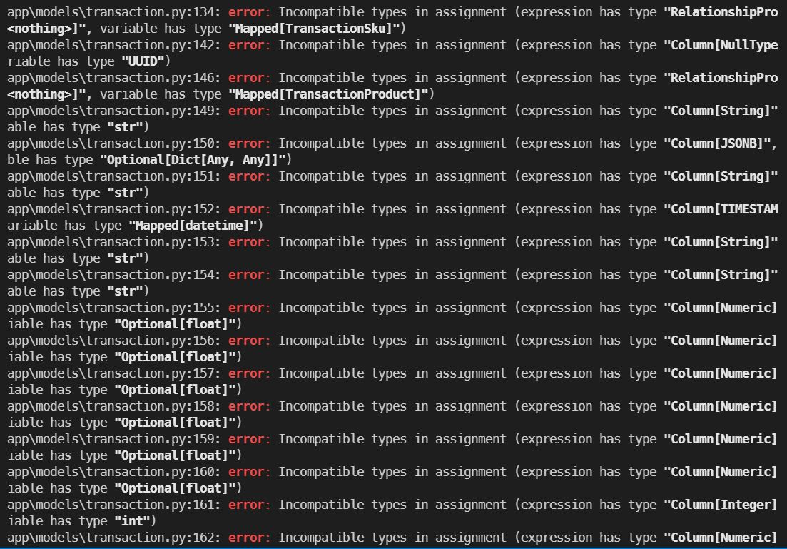
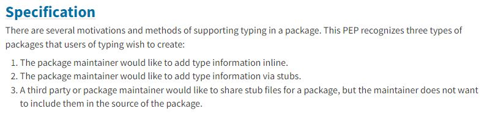
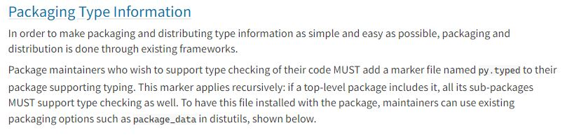

# Poetry typed package를 mypy가 인식하려면? feat. `py.typed`

## Intro

최근 몇 주간은 회사 업무 중 트러블 슈팅이 특히 많았습니다. 그 중 가장 기억에 남았던 것은 import한 poetry 패키지의 타입을 mypy가 제대로 인식하지 못하는 문제였습니다. 

해당 문제는 MSA로 개발 중인 프로젝트에서 발생했는데, 각 서비스에서 공통으로 쓰이는 class들을 하나의 패키지에 담는 과정에서 나타났습니다. 이는 `py.typed` 파일을 추가함으로써 생각보다 간단히(?) 해결할 수 있었는데, 그 과정을 남겨보고자 합니다.

​    

## Problem



Poetry로 빌드된 패키지를 개발 중인 서비스로 import 하고 mypy로 type checking하니, 위와 같이 무수한 type error가 발생했습니다. :(

우선, 관련 error는 mypy extension package 중 하나인 `sqlalchemy2-stubs`의 적용이 제대로 이루어지지 않아 발생한 에러였습니다. 서비스 내에는 잘 install 되어 있었기 때문에, 처음엔 패키지 내에서도 `sqlalchemy2-stubs`를 설치해야 하나 고민했습니다. 하지만, 패키지 내의 dependecy 설정으로도 에러는 해결되지 않았습니다.

결국 `sqlalchemy2-stubs` 자체보다는 **타입 인식 자체가 잘 안되는 이유**를 찾아야 했습니다.

​    

## Solution

실제로 문제의 해결은 **`py.typed` 파일의 존재 유무**에 있었습니다.

문제가 되었던 패키지의 디렉토리 구조는 다음과 같았습니다.

```
|- project-core
   |- dist
   |- project_core
      |- __init__.py
      |- package_content...
   |- __init__.py
   |- pyproject.toml
```

그리고 실제 패키지 내용에 해당하는 디렉토리 내의 최상단에 내용이 비어있는 `py.typed` 파일을 수동으로 생성해주면, mypy가 패키지 코드의 type annotation을 인식하기 시작합니다.

```
|- project-core
   |- dist
   |- project_core
      |- py.typed
      |- __init__.py
      |- package_content...
   |- __init__.py
   |- pyproject.toml
```

​    

패키지와 관련된 type checking 수단을 제안하는 PEP-561에도 `py.typed`에 대한 내용이 명시되어 있습니다. (poetry 뿐만 아니라 범용적으로 적용됩니다.)



우선 지금 문제 상황은 3번에 해당할 것입니다. 즉, package maintainer(패키지 관리자)가 자신의 패키지 코드에 외부의 stub file이 적용되길 원하는 경우입니다. (여기서 stub은 type information만이 담긴 파일을 의미합니다.) 

이에 따라, 현재 서비스의 `sqlalchemy2-stubs`가 패키지에도 적용되길 원합니다.



PEP-581은 이를 위해 패키지 관리자가 package의 top-level에 `py.typed`라는 marker file을 생성해야 함을 전달합니다. (MUST)

사실 문제를 해결하는 다른 방법도 존재하겠지만(`MYPYPATH`에 site-packages를 추가하는 방법 등...), 간단하고 편한 방법이 있으니 굳이 사용하지 않을 이유가 없을 것 같습니다.

​    

## Outro

아직 package를 만들어 본 경험이 없었는데, 덕분에 package 빌드 방법에 조금 더 익숙해진 것 같습니다. 이와 더불어 package를 올바르게 배포하기 위해 다양한 요소들이 필요함을 느꼈습니다. 익숙함이 쌓이다보면 언젠가 작은 오픈소스를 배포하는 날도 오지 않을까 기대되네요 :)

결론입니다. Typed package에는 항상 `py.typed`를 추가해주세요!!

​    

## Reference

[Don't forget `py.typed` for your typed Python package](https://blog.whtsky.me/tech/2021/dont-forget-py.typed-for-your-typed-python-package/)

[PEP-581 Packaging Type Information](https://peps.python.org/pep-0561/#packaging-type-information)