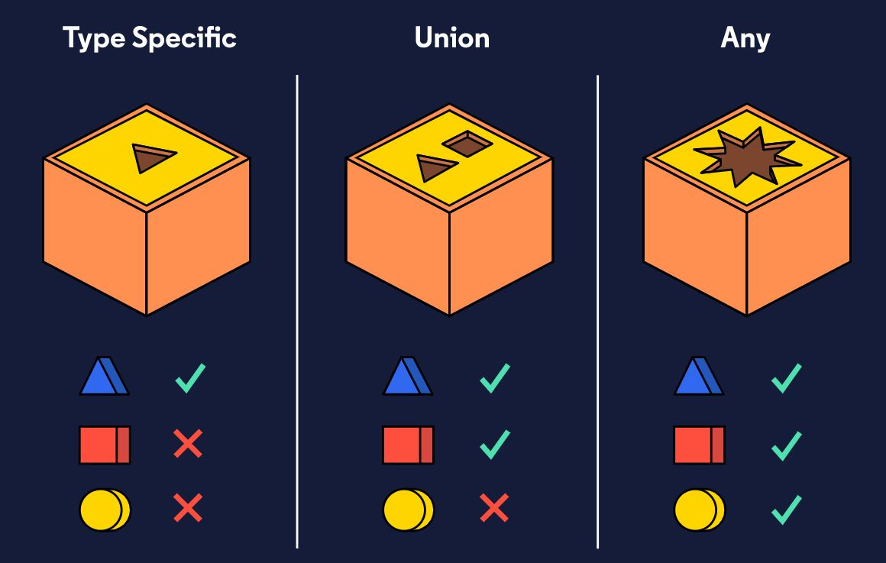

## Union

타입스크립트는 변수마다 다른 단계의 타입 구체성을 부여할 수 있습니다. 예를 들어, 변수에 `string` 타입을 강제하면 해당 변수는 `string` 타입으로 매우 제한적인 타이핑을 가지게 됩니다. 반면에, `any`를 부여하면 해당 변수는 특정 타입에 제한되지 않는 매우 자유로운 타이핑을 가지게 됩니다.



Union 타입은 이러한 두 극단의 타이핑에서 중간을 찾아가는 방법입니다. union은 서로 다른 타입들을 원하는대로 조합하여 만든 것을 의미합니다. 예를 들어, 회사원의 ID를 저장할 때, ID는 string 혹은 number가 모두 올 수 있습니다. 다만, 이를 `any`로 받기에는 너무 광범위하기 때문에, union을 사용해 원하는 타이핑 범위를 조절하는 것이 효과적입니다.

​    

## Union 정의

Union은 `|`을 사용해 원하는 type 멤버들을 하나하나 함께 정의합니다.

```typescript
let ID: string | number;
 
// number
ID = 1;
 
// or string
ID = '001';
 
console.log(`The ID is ${ID}.`);
```

위 코드에서 `ID`는 string 혹은 number 값의 할당이 모두 허용됩니다. 이러한 union 타입은 함수의 파라미터를 포함해 어디서든 사용할 수 있습니다.

```typescript
function getMarginLeft(margin: string | number) {
  return { 'marginLeft': margin };
}
```

예를 들어, 함수의 파라미터에서는 위와 같이 union을 정의해주면 됩니다.

​    

## Type narrowing with type guard

Union을 사용하다보면, 코드의 특정 지점에서 union으로 type annotation된 변수의 타입이 모호해지는 경우가 발생합니다.

```typescript
function getMarginLeft(margin: string | number) {
  // ...
}
```

예를 들어, 함수 내에서 `margin`은 string과 number를 동시에 가지기 때문에, string의 메서드를 분별없이 사용하면 타입스크립트 트랜스파일러가 오류를 띄웁니다. 따라서, 다음과 같이 `type guard`를 사용하여, 해당 지점에서 변수가 string인지 number인지 명확히 표시해주어야 합니다.

```typescript
function getMarginLeft(margin: string | number) {
  // margin may be a string or number here
 
  if (typeof margin === 'string') {
    // margin must be a string here
    return margin.toLowerCase();
  }
}
```

위의 if 조건문은 `type guard`라고 부릅니다. 조건문 내에서라면 `margin`은 반드시 string 타입임이 보장되므로, `toLowerCase()`와 같은 string 메서드를 써도 에러가 나지 않습니다.

이렇게 `type guard`를 사용하여 코드 내에서 type을 명확히 하는 것을 type narrowing이라고 합니다. Union을 사용할 때는 type narrowing으로 각각의 타입에 맞는 로직을 분리해 사용하는 것이 필요합니다.

​    

## Inffered union return type

만일 경우마다 다양한 타입의 값을 리턴하는 함수가 있다면, 타입스크립트는 해당 함수의 return type을 union으로서 판단합니다.

```typescript
function getBook() {
  try {
    return getBookFromServer();
  } catch (error) {
    return `Something went wrong: ${error}`;
  }
}
```

예를 들어, 위 코드에서 `getBookFromServer()`의 리턴 값의 타입이 `Book`이라고 합시다. 그러면 함수 `getBook`은 `Book` 혹은 `string` 타입의 값을 리턴할 것입니다. 따라서, 타입스크립트는 `getBook`의 리턴 타입을 union `Book | string`으로 추론합니다.

​    

## Union with array

Union 타입은 array와 함께 할 때 더욱 강력해집니다.

```typescript
const dateNumber = new Date().getTime(); // returns a number
const dateString = new Date().toString(); // returns a string
 
const timesList: (string | number)[] = [dateNumber, dateString];
```

예를 들어, 날짜의 타입으로 number 혹은 string이 올 수있습니다. 이러한 날짜 데이터를 array에 담고 싶다면, 위와 같이 union을 사용해 `const timesList: (string | number)[] = [dateNumber, dateString];`로 type annotation 해주면 됩니다.

이를 활용하면, 다양한 multiple type을 annotation하여 유연하게 배열을 사용할 수 있습니다.

​    

## Union with literal type

```typescript
type Color = 'green' | 'yellow' | 'red';
 
function changeLight(color: Color) {
  // ...
}
```

프로그램에서 어떠한 구체적으로 구별되는 상태를 만들길 원할 때, literal type을 union을 사용해 만들 수 있습니다. 위와 같이 `'green'`, `'yellow'`, `'red'`라는 리터럴을 사용해 union 타입을 만들면, `'purple'`과 같은 인자는 타입스크립트에 의해 validation 됩니다.

​    

## Reference

[Codecademy - TypeScript](https://www.codecademy.com/learn/learn-typescript)